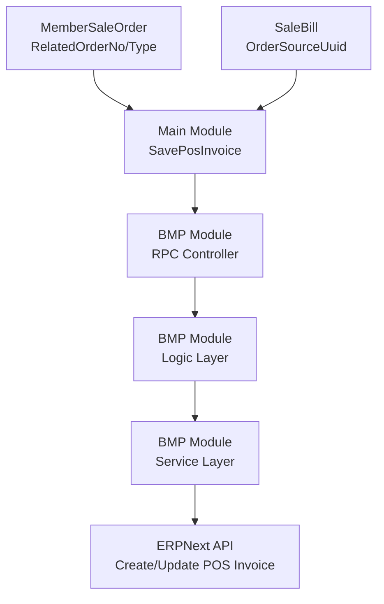

# POS Invoice 外卖订单字段扩展 设计文档

> 本文档定义 POS Invoice 外卖订单字段扩展 的技术设计和实现方案。

## 📋 概述

本功能在 ERPNext 的 POS Invoice DocType 中新增两个自定义字段（`custom_takeout_order_no` 和 `custom_takeout_provider`），用于记录外卖订单的第三方平台订单号和平台标识。同时更新 TTPOS 系统的相关代码，支持在保存 POS Invoice 时传递和保存这两个字段。

该功能实现外卖订单在 ERPNext 系统中的完整追溯，支持按平台进行数据分析和财务对账。

---

## 🎯 规范对齐

### Go BMP 规范 (go-rules.mdc)

- 禁止修改 dao/entity/do/ 目录（自动生成）
- Protobuf 文件修改后需重新生成 Go 代码
- Logic 层实现业务逻辑
- 遵循 GoFrame 项目结构
- 使用 `erp.ApiResponse` 包装 gRPC 响应

### Protobuf 规范 (proto-rules.mdc)

- 字段命名使用 snake_case（如：`takeout_order_no`）
- 字段编号从 17 开始（当前最大编号为 16）
- 字段必须为可选（optional），确保向后兼容
- 请求消息以 `Req` 结尾，响应消息以 `Resp` 结尾

### API 设计规范 (api.mdc)

- Protobuf 字段使用 snake_case 命名
- 响应格式通过 `erp.ApiResponse` 包装
- 字段必须为可选，确保向后兼容

### 数据库规范 (database.mdc)

- ERPNext 自定义字段使用 `custom_` 前缀
- 字段类型：Data（字符串类型）
- 字段命名遵循 ERPNext 规范

---

## 🔄 代码复用分析

### 可复用的现有组件

- **ERPNext 自定义字段迁移**: `ttpos-bmp/app/ttpos-erp/manifest/erp-migrate/v2.12/01_custom_field/01_custom_payment_id.json` - 参考格式和结构
- **buildPosInvoice 方法**: `ttpos-bmp/app/ttpos-erp/internal/logic/selling/selling.go` - 扩展字段赋值逻辑
- **SavePosInvoice 调用**: `main/app/service/order.go` - 扩展请求参数传递
- **SavePosInvoice RPC 调用**: `main/app/service/rpc/erp/selling.go` - 扩展参数映射

### 集成点

- **ERPNext API**: 通过自定义字段迁移脚本创建字段
- **Protobuf 接口**: 扩展 `SavePosInvoiceReq` 消息定义
- **DTO 结构**: 扩展 `POSInvoice` DTO 结构
- **业务逻辑**: 在 `buildPosInvoice` 中增加字段赋值
- **Main 模块**: 在 `SavePosInvoice` 调用处传递外卖订单信息

---

## 🏗️ 架构设计

### 分层设计原则

**Go BMP 模块三层架构**:

```
RPC Controller 层 (controller/rpc/)
  ↓ 依赖
Logic 层 (logic/)
  ↓ 依赖
Service 层 (service/) → ERPNext API
```

**依赖规则**:

- ✅ 上层可依赖下层
- ❌ 禁止下层依赖上层
- ❌ 禁止跨层调用
- ✅ Logic 层可以依赖 Service 接口

### 架构图



### 模块划分

#### Go BMP 模块 (ttpos-erp)

- **RPC Controller**: `ttpos-bmp/app/ttpos-erp/internal/controller/rpc/` - gRPC 接口处理
- **Logic 层**: `ttpos-bmp/app/ttpos-erp/internal/logic/selling/` - 业务逻辑实现
- **Service 层**: `ttpos-bmp/app/ttpos-erp/internal/service/` - ERPNext API 调用
- **Model 层**: `ttpos-bmp/app/ttpos-erp/internal/model/dto/erp/` - DTO 定义
- **Protobuf**: `ttpos-bmp/app/ttpos-erp/manifest/protobuf/selling/` - 接口定义

#### Go Main 模块

- **Service 层**: `main/app/service/order.go` - 订单服务，调用 SavePosInvoice
- **RPC Service**: `main/app/service/rpc/erp/selling.go` - ERP RPC 服务，构建请求参数
- **DTO 层**: `main/app/dto/req/erpnext.go` - 请求参数定义

---

## 🗄️ 数据库设计

### ERPNext 自定义字段

本功能不涉及 TTPOS 数据库表变更，仅在 ERPNext 中创建自定义字段。

#### 字段 1: custom_takeout_order_no

**迁移文件**: `ttpos-bmp/app/ttpos-erp/manifest/erp-migrate/v2.12/01_custom_field/01_pos_invoice_takeout_order_no.json`

```json
{
  "doctype": "DocType",
  "label": "Takeout Order No",
  "fieldname": "custom_takeout_order_no",
  "fieldtype": "Data",
  "insert_after": "custom_pos_opening_entry",
  "dt": "POS Invoice"
}
```

**字段说明**:
| 字段 | 类型 | 说明 | 约束 |
|------|------|------|------|
| fieldname | string | 字段名 | custom_takeout_order_no |
| fieldtype | string | 字段类型 | Data（字符串） |
| label | string | 字段标签 | Takeout Order No |
| dt | string | DocType | POS Invoice |
| insert_after | string | 插入位置 | custom_pos_opening_entry |

#### 字段 2: custom_takeout_provider

**迁移文件**: `ttpos-bmp/app/ttpos-erp/manifest/erp-migrate/v2.12/01_custom_field/02_pos_invoice_takeout_provider.json`

```json
{
  "doctype": "DocType",
  "label": "Takeout Provider",
  "fieldname": "custom_takeout_provider",
  "fieldtype": "Data",
  "insert_after": "custom_takeout_order_no",
  "dt": "POS Invoice"
}
```

**字段说明**:
| 字段 | 类型 | 说明 | 约束 |
|------|------|------|------|
| fieldname | string | 字段名 | custom_takeout_provider |
| fieldtype | string | 字段类型 | Data（字符串） |
| label | string | 字段标签 | Takeout Provider |
| dt | string | DocType | POS Invoice |
| insert_after | string | 插入位置 | custom_takeout_order_no |

### 数据库迁移

**迁移脚本执行**:

迁移文件由 ERPNext 系统自动执行，无需手动执行 SQL。

**参考**: ERPNext 自定义字段文档: https://docs.erpnext.com/docs/user/en/customize-erpnext/custom-fields

---

## 📊 数据模型

### Protobuf 定义

```protobuf
// ttpos-bmp/app/ttpos-erp/manifest/protobuf/selling/selling.proto

// SavePosInvoiceReq 保存POS发票请求消息
message SavePosInvoiceReq {
  // ... 现有字段 ...
  string remark = 16; // 备注,可选
  
  // 新增字段
  optional string takeout_order_no = 17;    // 外卖订单号，可选
  optional string takeout_provider = 18;    // 外卖平台提供商，可选
}
```

### DTO 定义

#### POS Invoice DTO

```go
// ttpos-bmp/app/ttpos-erp/internal/model/dto/erp/selling.go

// POSInvoice 结构体定义
type POSInvoice struct {
    // ... 现有字段 ...
    CustomPosOpeningEntry string `json:"custom_pos_opening_entry,omitempty"` // 自定义POS开帐分录
    
    // 新增字段
    CustomTakeoutOrderNo   string `json:"custom_takeout_order_no,omitempty"`   // 外卖订单号
    CustomTakeoutProvider  string `json:"custom_takeout_provider,omitempty"`    // 外卖平台提供商
}
```

#### Main 模块 Request DTO

```go
// main/app/dto/req/erpnext.go

type SavePosInvoiceReq struct {
    // ... 现有字段 ...
    Remark string `form:"remark" json:"remark"` // 备注,可选
    
    // 新增字段
    TakeoutOrderNo  string `form:"takeout_order_no" json:"takeout_order_no"`   // 外卖订单号，可选
    TakeoutProvider string `form:"takeout_provider" json:"takeout_provider"`   // 外卖平台提供商，可选
}
```

---

## 🔌 API 设计

### gRPC API

#### SavePosInvoice

**Protobuf 定义**:

```protobuf
// ttpos-bmp/app/ttpos-erp/manifest/protobuf/selling/selling.proto

service SellingService {
  // 保存 Pos Invoice
  rpc SavePosInvoice (SavePosInvoiceReq) returns (erp.ResponseInfo);
}

message SavePosInvoiceReq {
  // ... 现有字段 ...
  optional string takeout_order_no = 17;    // 外卖订单号，可选
  optional string takeout_provider = 18;    // 外卖平台提供商，可选
}
```

**请求示例**:

```json
{
  "order_no": "ORD20251226001",
  "open_pos_entry_name": "OPE-2025-12-26-001",
  "company_abbr": "TEST",
  "posting_datetime": 1735200000,
  "update_stock": 1,
  "currency": "THB",
  "price_list_currency": "THB",
  "items": [...],
  "material_items": [...],
  "taxes": [...],
  "payments": [...],
  "takeout_order_no": "GRAB-123456789",
  "takeout_provider": "grab"
}
```

**响应格式**:

通过 `erp.ApiResponse` 包装，格式如下：

```json
{
  "code": "0",
  "message": "success",
  "data": {
    "products_invoice_name": "SINV-2025-12-26-001",
    "material_invoice_name": "SINV-2025-12-26-002",
    "async_record_id": ""
  }
}
```

**生成代码**:

```bash
cd ttpos-bmp/app/ttpos-erp
gf gen pb
```

---

## 🧩 组件和接口

### Logic 层

#### buildPosInvoice 方法扩展

```go
// ttpos-bmp/app/ttpos-erp/internal/logic/selling/selling.go

func (s *sSelling) buildPosInvoice(ctx context.Context, req *selling.SavePosInvoiceReq, openingEntry *erp.POSOpeningEntry) *erp.POSInvoice {
    // ... 现有代码 ...
    
    posInvoice := &erp.POSInvoice{
        // ... 现有字段 ...
        CustomPosOpeningEntry: req.OpenPosEntryName,
    }
    
    // ... 现有代码 ...
    
    // 设置备注
    if len(req.Remark) > 0 {
        posInvoice.Remarks = req.Remark
    }
    
    // 新增：设置外卖订单字段
    if len(req.TakeoutOrderNo) > 0 {
        posInvoice.CustomTakeoutOrderNo = req.TakeoutOrderNo
    }
    if len(req.TakeoutProvider) > 0 {
        posInvoice.CustomTakeoutProvider = req.TakeoutProvider
    }
    
    return posInvoice
}
```

### Main 模块 Service 层

#### SavePosInvoice 方法扩展

```go
// main/app/service/order.go

func (s *orderSrv) SavePosInvoice(ctx context.Context, saleOrder *model.SaleOrder, saleBill *model.SaleBill, db *gorm.DB, opts ...func(*SavePosInvoiceOption)) (*selling.SavePosInvoiceResp, error) {
    // ... 现有代码 ...
    
    param := req.SavePosInvoiceReq{
        // ... 现有字段 ...
        Remark: option.Remark,
    }
    
    // 新增：检查是否为外卖订单并设置字段
    if saleBill.OrderSourceUuid > 0 {
        // 获取 MemberSaleOrder 信息
        memberSaleOrderRepo := repository.NewMemberSaleOrderRepo(db)
        memberSaleOrder, err := memberSaleOrderRepo.GetMemberSaleOrderBySaleBillUuid(saleBill.Uuid)
        if err == nil && memberSaleOrder != nil {
            if len(memberSaleOrder.RelatedOrderNo) > 0 {
                param.TakeoutOrderNo = memberSaleOrder.RelatedOrderNo
            }
            if len(memberSaleOrder.RelatedOrderType) > 0 {
                param.TakeoutProvider = memberSaleOrder.RelatedOrderType
            }
        }
    }
    
    response, err := erpSrv.SavePosInvoice(ctx, param)
    // ... 现有代码 ...
}
```

#### RPC Service 扩展

```go
// main/app/service/rpc/erp/selling.go

func (s *erpSrv) SavePosInvoice(ctx pkgCtx.Context, savePosInvoiceReq req.SavePosInvoiceReq) (*selling.SavePosInvoiceResp, error) {
    // ... 现有代码 ...
    
    params := &selling.SavePosInvoiceReq{
        // ... 现有字段 ...
        Remark: savePosInvoiceReq.Remark,
    }
    
    // 新增：传递外卖订单字段
    if len(savePosInvoiceReq.TakeoutOrderNo) > 0 {
        params.TakeoutOrderNo = &savePosInvoiceReq.TakeoutOrderNo
    }
    if len(savePosInvoiceReq.TakeoutProvider) > 0 {
        params.TakeoutProvider = &savePosInvoiceReq.TakeoutProvider
    }
    
    res, err := client.SavePosInvoice(WithSiteCode(ctx.GetContext(), savePosInvoiceReq.SiteCode), params)
    // ... 现有代码 ...
}
```

---

## ⚡ 缓存设计

本功能不涉及缓存设计。

---

## 🚨 错误处理

### 错误场景

#### 场景 1: 外卖订单信息缺失

- **处理方式**: 如果 `OrderSourceUuid > 0` 但无法获取 `MemberSaleOrder` 信息，记录警告日志但不中断流程
- **用户影响**: POS Invoice 正常创建，但外卖订单字段为空
- **代码示例**:
  ```go
  if saleBill.OrderSourceUuid > 0 {
      memberSaleOrder, err := memberSaleOrderRepo.GetMemberSaleOrderBySaleBillUuid(saleBill.Uuid)
      if err != nil {
          ctx.Log().Warning("获取外卖订单信息失败", zap.Error(err), zap.Uint64("sale_bill_uuid", saleBill.Uuid))
          // 继续执行，不设置外卖订单字段
      } else if memberSaleOrder != nil {
          // 设置字段
      }
  }
  ```

#### 场景 2: Protobuf 字段为空

- **处理方式**: 在 `buildPosInvoice` 中检查字段值，空值不设置
- **用户影响**: 不影响现有功能，向后兼容
- **代码示例**:
  ```go
  if len(req.TakeoutOrderNo) > 0 {
      posInvoice.CustomTakeoutOrderNo = req.TakeoutOrderNo
  }
  ```

#### 场景 3: ERPNext 字段创建失败

- **处理方式**: 迁移脚本执行失败时，记录错误日志，需要手动处理
- **用户影响**: 字段无法创建，需要检查 ERPNext 配置和权限

---

## 🔒 安全设计

### 数据验证

- **字段长度限制**: 
  - `takeout_order_no`: 最大 100 字符
  - `takeout_provider`: 最大 50 字符
- **字段格式验证**: 
  - `takeout_provider` 只允许特定值：grab, foodpanda, lineman 等
- **输入校验**: 在 Logic 层进行字段值验证

### 数据安全

- **敏感信息**: 外卖订单号可能包含敏感信息，但属于业务数据，按正常流程处理
- **SQL 注入防护**: 使用参数化查询（通过 ERPNext API）

---

## 🧪 测试策略

### 单元测试

**目标覆盖率**:

- Logic 层: 70%+
- 字段赋值逻辑: 100%

**测试内容**:

- `buildPosInvoice` 方法中字段赋值逻辑
- 空值处理
- 字段值验证

**示例**:

```go
// ttpos-bmp/app/ttpos-erp/internal/logic/selling/selling_test.go

func TestBuildPosInvoice_WithTakeoutFields(t *testing.T) {
    req := &selling.SavePosInvoiceReq{
        // ... 其他字段 ...
        TakeoutOrderNo:  "GRAB-123456789",
        TakeoutProvider: "grab",
    }
    
    posInvoice := s.buildPosInvoice(ctx, req, openingEntry)
    
    assert.Equal(t, "GRAB-123456789", posInvoice.CustomTakeoutOrderNo)
    assert.Equal(t, "grab", posInvoice.CustomTakeoutProvider)
}

func TestBuildPosInvoice_WithoutTakeoutFields(t *testing.T) {
    req := &selling.SavePosInvoiceReq{
        // ... 其他字段 ...
        // 不设置外卖订单字段
    }
    
    posInvoice := s.buildPosInvoice(ctx, req, openingEntry)
    
    assert.Empty(t, posInvoice.CustomTakeoutOrderNo)
    assert.Empty(t, posInvoice.CustomTakeoutProvider)
}
```

### 集成测试

**测试流程**:

- 端到端测试：从订单支付到 ERPNext 保存
- 测试外卖订单字段正确传递和保存
- 测试非外卖订单不设置字段

### API 测试

**测试内容**:

- Protobuf 序列化/反序列化
- 字段可选性验证
- 向后兼容性测试

---

## 📈 性能优化

### 优化策略

1. **字段查询优化**: 
   - 外卖订单字段查询不影响现有 POS Invoice 查询性能
   - 字段保存操作时间 < 50ms

2. **并发控制**: 
   - 支持并发创建 POS Invoice
   - 字段保存使用事务管理

### 性能指标

- 字段保存操作时间: < 50ms
- 不影响现有 POS Invoice 创建性能
- 支持并发创建

---

## 📚 实现清单

### Phase 1: ERPNext 字段创建

- [ ] 创建 `01_pos_invoice_takeout_order_no.json` 迁移文件
- [ ] 创建 `02_pos_invoice_takeout_provider.json` 迁移文件
- [ ] 验证字段创建

### Phase 2: Protobuf 和 DTO 更新

- [ ] 更新 Protobuf 定义（`SavePosInvoiceReq`）
- [ ] 重新生成 protobuf Go 代码
- [ ] 更新 DTO 结构（`POSInvoice`）
- [ ] 更新 Main 模块 Request DTO

### Phase 3: 业务逻辑实现

- [ ] 在 `buildPosInvoice` 中增加字段赋值逻辑
- [ ] 在 Main 模块 `SavePosInvoice` 中获取并传递外卖订单信息
- [ ] 在 RPC Service 中传递字段到 BMP 模块

### Phase 4: 测试

- [ ] 单元测试
- [ ] 集成测试
- [ ] 向后兼容性测试

**详细任务**: 参见 `tasks.md`

---

## Graphiti & 活动日志

- Related Episode: `[待补充]`
- 模板：`docs/agent/templates/graphiti-episode.md`
- 活动日志：`docs/team/activities/{YYYY-MM}/{YYYY-MM-DD}.md`
- 在技术方案评审、关键架构决策或踩坑总结后，立即补充 Episode 并在设计文档尾部互链。

---

**版本**: v1.0.0  
**创建日期**: 2025-12-26  
**作者**: rikugun  
**审核者**: {审核者}

