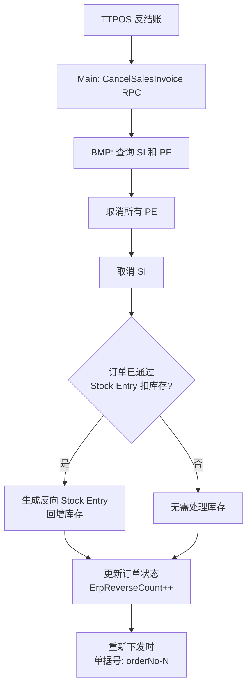
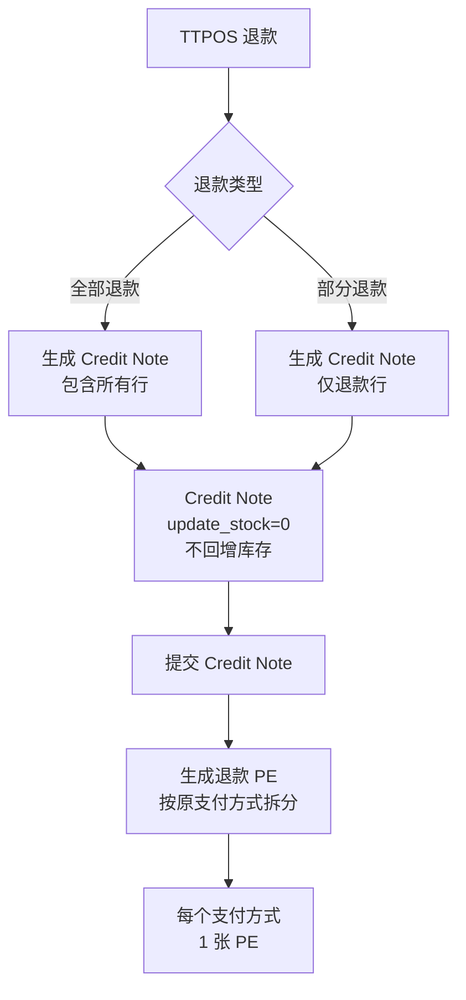

# story-erp-reverse-settle-refund 技术设计

## 概述

| 项目 | 内容 |
|------|------|
| Spec ID | story-erp-reverse-settle-refund |
| 设计人 | weifashi |
| 设计日期 | 2026-03-05 |
| 总 SP | 5 |
| 依赖 | story-erp-sales-invoice-pipeline（需要 SI/PE 已创建）, story-erp-stock-entry-deferred（反结账联动） |

## 代码复用分析

### 可复用代码

| 文件 | 说明 | 复用方式 |
|------|------|---------|
| `main/app/service/rpc/erp/selling.go` | CancelPosInvoice/ReturnPosInvoice RPC | 参考，新增 Cancel/Return SalesInvoice |
| `ttpos-bmp/app/ttpos-erp/internal/logic/selling/async_selling.go` | 异步取消/退款逻辑 | 扩展 |
| `main/app/model/sale_order.go` | ErpReverseCount 字段 | 直接使用 |
| `main/app/model/payment_order.go` | RefundOrder 模型 | 参考 |

### 需要新建

| 文件 | 说明 |
|------|------|
| `ttpos-bmp/app/ttpos-erp/internal/logic/selling/cancel_sales_invoice.go` | 取消 SI+PE 逻辑 |
| `ttpos-bmp/app/ttpos-erp/internal/logic/selling/return_sales_invoice.go` | 退款 Credit Note 逻辑 |
| `ttpos-bmp/app/ttpos-erp/internal/model/dto/erp/credit_note.go` | Credit Note DTO |

## 架构设计

### 反结账流程



### 退款流程



### 单据号递增规则

```
原订单号: ORD-001
第1次反结账后重新下发: ORD-001-1
第2次反结账后重新下发: ORD-001-2
第3次反结账后重新下发: ORD-001-3
```

## 组件和接口

### Protobuf 新增 Message

**位置**: `ttpos-bmp/app/ttpos-erp/manifest/protobuf/selling/selling.proto`

```protobuf
// 取消 Sales Invoice 请求
message CancelSalesInvoiceReq {
  string order_no = 1;                    // TTPOS 订单号
  string sale_order_uuid = 2;             // 订单 UUID（幂等键）
  string sales_invoice_name = 3;          // SI 单据名称
  repeated string payment_entry_names = 4; // PE 单据名称列表
  bool stock_deducted = 5;                // 是否已通过 Stock Entry 扣库存
  string remark = 6;
}

message CancelSalesInvoiceResp {
  string async_record_id = 1;
}

// 退款 (Credit Note) 请求
message ReturnSalesInvoiceReq {
  string order_no = 1;
  string sale_order_uuid = 2;
  string sales_invoice_name = 3;          // 原 SI 名称
  int64 posting_datetime = 4;
  string company = 5;
  string customer = 6;
  repeated SalesInvoiceItem items = 7;    // 退款商品（数量为正，系统自动取负）
  repeated SalesInvoiceItem material_items = 8; // 退款物品
  repeated SalesInvoiceTax taxes = 9;
  repeated SalesInvoicePayment payments = 10; // 原支付方式的退款金额
  string refund_type = 11;                // full_refund / partial_refund
  string remark = 12;
}

message ReturnSalesInvoiceResp {
  string credit_note_name = 1;
  repeated string payment_entry_names = 2;
  string async_record_id = 3;
}
```

### Service: IErpSrv 扩展

```go
type IErpSrv interface {
    // 新增
    CancelSalesInvoice(ctx context.Context, req *selling.CancelSalesInvoiceReq) (*selling.CancelSalesInvoiceResp, error)
    ReturnSalesInvoice(ctx context.Context, req *selling.ReturnSalesInvoiceReq) (*selling.ReturnSalesInvoiceResp, error)
}
```

## 数据模型

### Credit Note DTO

```go
type CreditNote struct {
    IsReturn       int                 `json:"is_return"`        // 1
    ReturnAgainst  string              `json:"return_against"`   // 原 SI 名称
    Customer       string              `json:"customer"`
    Company        string              `json:"company"`
    PostingDate    string              `json:"posting_date"`
    UpdateStock    int                 `json:"update_stock"`     // 0（不回增库存）
    Items          []SalesInvoiceItem  `json:"items"`
    Taxes          []SalesInvoiceTax   `json:"taxes"`
    // 自定义字段
    TtposSaleOrderUuid string `json:"custom_ttpos_sale_order_uuid"`
    TtposRefundType    string `json:"custom_ttpos_refund_type"`     // full_refund/partial_refund
}
```

### 退款 Payment Entry

```go
type RefundPaymentEntry struct {
    PaymentType    string  `json:"payment_type"`     // "Pay"（退款方向）
    PartyType      string  `json:"party_type"`       // "Customer"
    Party          string  `json:"party"`
    ModeOfPayment  string  `json:"mode_of_payment"`  // 原支付方式
    PaidAmount     float64 `json:"paid_amount"`      // 退款金额
    References     []PaymentReference `json:"references"`
}

type PaymentReference struct {
    ReferenceDoctype string  `json:"reference_doctype"` // "Sales Invoice"
    ReferenceName    string  `json:"reference_name"`    // Credit Note 名称
    AllocatedAmount  float64 `json:"allocated_amount"`
}
```

### MQ 新增 Topic

```go
const (
    MsgTypeCancelSalesInvoice MsgTyp = "cancel-sales-invoice"
    MsgTypeReturnSalesInvoice MsgTyp = "return-sales-invoice"
)
```

## 风险识别

| 风险 | 影响 | 缓解措施 |
|------|------|---------|
| PE 取消失败 | SI 无法取消（有未取消的 PE 引用） | 严格按顺序：先取消 PE → 再取消 SI |
| 反向 Stock Entry 失败 | 库存不准 | 重试 + 手动补偿入口 |
| 单据号冲突 | ERP 侧创建失败 | ErpReverseCount 递增确保唯一 |
| 部分退款计算错误 | 金额不一致 | 退款金额从原订单计算，不依赖前端 |

## 测试策略

```bash
cd main && go test -run TestCancelSalesInvoice ./app/service/...
cd main && go test -run TestReturnSalesInvoice ./app/service/...
cd ttpos-bmp && go test -run TestCreditNote ./app/ttpos-erp/internal/logic/selling/...
```
