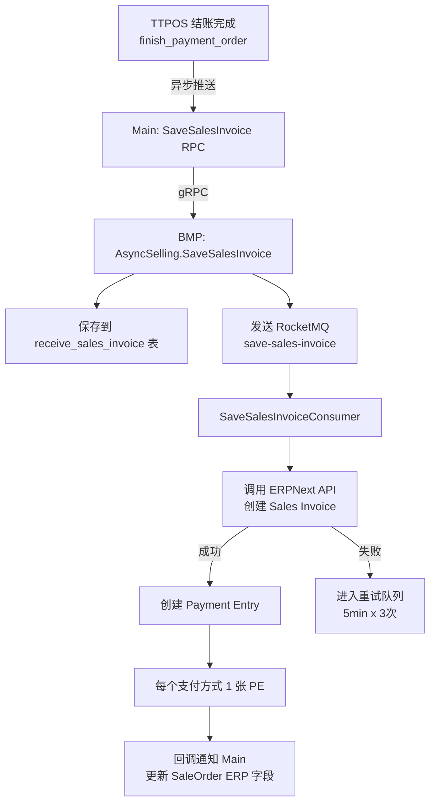

# story-erp-sales-invoice-pipeline 技术设计

## 概述

| 项目 | 内容 |
|------|------|
| Spec ID | story-erp-sales-invoice-pipeline |
| 设计人 | weifashi |
| 设计日期 | 2026-03-05 |
| 总 SP | 5 |
| 依赖 | story-pos-erp-shift-decouple（班次解耦后才能切换） |

## 代码复用分析

### 可复用代码

| 文件 | 说明 | 复用方式 |
|------|------|---------|
| `main/app/service/rpc/erp/selling.go` | ERP RPC 客户端 | 扩展，新增 SaveSalesInvoice 方法 |
| `main/app/service/order.go` | 订单服务 SavePosInvoice 逻辑 | 参考，改为 SaveSalesInvoice |
| `ttpos-bmp/app/ttpos-erp/internal/logic/selling/async_selling.go` | 异步队列处理 | 扩展，新增 SI/PE 消费者 |
| `ttpos-bmp/app/ttpos-erp/internal/model/dto/erp/selling.go` | ERP DTO（POSInvoice） | 参考，新建 SalesInvoice DTO |
| `ttpos-bmp/app/ttpos-erp/manifest/protobuf/selling/selling.proto` | Protobuf 定义 | 扩展，新增 SI/PE message |
| `main/app/modules/takeout/domain/service/takeout_erp_sync_service.go` | 外卖 ERP 同步 | 修改，切换为 SI |

### 需要新建

| 文件 | 说明 |
|------|------|
| `ttpos-bmp/app/ttpos-erp/internal/logic/selling/sales_invoice.go` | Sales Invoice 同步逻辑 |
| `ttpos-bmp/app/ttpos-erp/internal/logic/selling/payment_entry.go` | Payment Entry 同步逻辑 |
| `ttpos-bmp/app/ttpos-erp/internal/consumer/selling/sales_invoice_consumer.go` | SI 队列消费者 |
| `ttpos-bmp/app/ttpos-erp/internal/consumer/selling/payment_entry_consumer.go` | PE 队列消费者 |
| `ttpos-bmp/app/ttpos-erp/internal/model/entity/receive_sales_invoice.go` | SI 异步记录实体 |
| `ttpos-bmp/app/ttpos-erp/internal/model/entity/receive_payment_entry.go` | PE 异步记录实体 |
| `ttpos-bmp/app/ttpos-erp/internal/model/dto/erp/sales_invoice.go` | Sales Invoice DTO |
| `ttpos-bmp/app/ttpos-erp/internal/model/dto/erp/payment_entry.go` | Payment Entry DTO |

## 架构设计



### 数据流

```
订单支付完成
  → Main.OrderSrv.SaveSalesInvoice()
    → gRPC → BMP.AsyncSelling.SaveSalesInvoice()
      → DB: receive_sales_invoice (docstatus=0)
      → MQ: save-sales-invoice topic
        → Consumer: SaveSalesInvoiceConsumer
          → ERPNext POST /api/resource/Sales Invoice
            → 成功: docstatus=1, 获取 invoice_name
              → ERPNext POST /api/resource/Payment Entry (per payment)
                → 成功: 更新 receive_payment_entry
              → RocketMQ 回调: erp-sales-invoice-callback
                → Main: 更新 SaleOrder.ErpSalesInvoiceName
            → 失败: docstatus=0, 进入重试
```

## 组件和接口

### Protobuf 新增 Message

**位置**: `ttpos-bmp/app/ttpos-erp/manifest/protobuf/selling/selling.proto`

```protobuf
// Sales Invoice 请求
message SaveSalesInvoiceReq {
  string order_no = 1;                        // TTPOS 订单号
  string sale_order_uuid = 2;                 // TTPOS 订单 UUID（幂等键）
  string sale_bill_uuid = 3;                  // TTPOS 账单 UUID
  string pos_profile = 4;                     // POS Profile 名称
  string company = 5;                         // 公司
  string customer = 6;                        // 客户（默认客户或会员）
  string currency = 7;                        // 货币 THB/CNY
  string price_list_currency = 8;             // 价格表货币
  int64 posting_datetime = 9;                 // 支付完成时间戳
  string branch = 10;                         // 分店
  int32 update_stock = 11;                    // 0=不扣库存
  repeated SalesInvoiceItem items = 12;       // 商品明细
  repeated SalesInvoiceItem material_items = 13; // 物品明细（价格为0）
  repeated SalesInvoiceTax taxes = 14;        // 税费
  repeated SalesInvoicePayment payments = 15; // 支付方式列表
  string remark = 16;                         // 备注
  optional string order_source_uuid = 17;     // 订单来源UUID
  optional string order_source_name = 18;     // 订单来源名称
  optional string takeout_order_no = 19;      // 外卖订单号
  optional string takeout_provider = 20;      // 外卖平台
  double discount_amount = 21;                // 额外折扣金额
  string amended_from = 22;                   // 反结账后的原单据号
}

message SalesInvoiceItem {
  string item_code = 1;
  double qty = 2;
  double rate = 3;
  double amount = 4;
  string uom = 5;
  string description = 6;
  bool is_free_item = 7;
  string warehouse = 8;                       // 行级仓库（新增）
}

message SalesInvoiceTax {
  double rate = 1;
  double tax_amount = 2;
  string description = 3;
}

message SalesInvoicePayment {
  string mode_of_payment = 1;
  double amount = 2;
  optional string payment_id = 3;
}

message SaveSalesInvoiceResp {
  string sales_invoice_name = 1;              // SI 单据名称
  repeated string payment_entry_names = 2;    // PE 单据名称列表
  string async_record_id = 3;                 // 异步记录ID
}
```

### Service: IErpSrv 扩展

**位置**: `main/app/service/rpc/erp/erp.go`

```go
type IErpSrv interface {
    // 现有方法保留...
    SavePosInvoice(ctx context.Context, req *selling.SavePosInvoiceReq) (*selling.SavePosInvoiceResp, error)

    // 新增方法
    SaveSalesInvoice(ctx context.Context, req *selling.SaveSalesInvoiceReq) (*selling.SaveSalesInvoiceResp, error)
}
```

### Service: OrderSrv 变更

**位置**: `main/app/service/order.go`

```go
// 新增方法: 保存 Sales Invoice（替代 SavePosInvoice）
func (s *OrderSrv) SaveSalesInvoice(ctx context.Context, saleOrder *model.SaleOrder) error {
    // 1. 构建 SaveSalesInvoiceReq
    //    - 从 POS Profile 读取 company/customer/currency
    //    - 商品明细: 订单商品 → SalesInvoiceItem（有价格，行级仓库）
    //    - 物品明细: 成本卡/BOM → SalesInvoiceItem（价格0，行级仓库）
    //    - 支付方式: PaymentOrder → SalesInvoicePayment
    // 2. 调用 erpSrv.SaveSalesInvoice()
    // 3. 更新 SaleOrder.ErpSalesInvoiceName
}
```

## 数据模型

### SaleOrder 新增字段

**位置**: `main/app/model/sale_order.go`

```go
type SaleOrder struct {
    // ... 现有字段 ...

    // 新增 ERP 字段
    ErpSalesInvoiceName  string `gorm:"column:erp_sales_invoice_name;type:varchar(255)" json:"erp_sales_invoice_name"`
    ErpPaymentEntryNames string `gorm:"column:erp_payment_entry_names;type:text" json:"erp_payment_entry_names"` // JSON array
    ErpSyncStatus        int    `gorm:"column:erp_sync_status;type:tinyint(1);default:0" json:"erp_sync_status"`
    // 0=未同步, 1=SI已创建, 2=PE已创建(全部完成), 3=同步失败
    ErpReverseCount      int    `gorm:"column:erp_reverse_count;type:int(11);default:0" json:"erp_reverse_count"`
    // 反结账次数（用于单据号后缀递增）
    ErpStockDeducted     int    `gorm:"column:erp_stock_deducted;type:tinyint(1);default:0" json:"erp_stock_deducted"`
    // 0=未出库, 1=已通过StockEntry扣减
}
```

### BMP 新增 receive_sales_invoice 表

```sql
CREATE TABLE receive_sales_invoice (
    id BIGINT AUTO_INCREMENT PRIMARY KEY,
    order_no VARCHAR(255) NOT NULL COMMENT 'TTPOS订单号',
    sale_order_uuid VARCHAR(64) NOT NULL COMMENT 'TTPOS订单UUID（幂等键）',
    pos_profile VARCHAR(255) NOT NULL COMMENT 'POS Profile名称',
    posting_datetime BIGINT NOT NULL COMMENT '过账时间戳',
    docstatus VARCHAR(2) NOT NULL DEFAULT '0' COMMENT '文档状态: 0=Draft 1=Submitted 2=Cancelled',
    sales_invoice_name VARCHAR(255) COMMENT 'ERP Sales Invoice名称',
    payment_entry_names TEXT COMMENT 'ERP Payment Entry名称(JSON)',
    site_code VARCHAR(64) NOT NULL COMMENT 'ERP site code',
    req_message TEXT COMMENT '请求数据(base64)',
    resp_message TEXT COMMENT '响应数据(base64)',
    req_body TEXT COMMENT '请求文本',
    resp_body TEXT COMMENT '响应文本',
    retry_count INT NOT NULL DEFAULT 0 COMMENT '重试次数',
    created_at INT NOT NULL COMMENT '创建时间',
    updated_at INT NOT NULL COMMENT '更新时间',
    UNIQUE KEY uk_sale_order_uuid (sale_order_uuid)
) COMMENT 'Sales Invoice异步记录';
```

### BMP 新增 receive_payment_entry 表

```sql
CREATE TABLE receive_payment_entry (
    id BIGINT AUTO_INCREMENT PRIMARY KEY,
    sale_order_uuid VARCHAR(64) NOT NULL COMMENT 'TTPOS订单UUID',
    mode_of_payment VARCHAR(255) NOT NULL COMMENT '支付方式',
    payment_entry_name VARCHAR(255) COMMENT 'ERP Payment Entry名称',
    docstatus VARCHAR(2) NOT NULL DEFAULT '0' COMMENT '文档状态',
    paid_amount DECIMAL(12,2) NOT NULL COMMENT '支付金额',
    site_code VARCHAR(64) NOT NULL COMMENT 'ERP site code',
    req_body TEXT COMMENT '请求文本',
    resp_body TEXT COMMENT '响应文本',
    retry_count INT NOT NULL DEFAULT 0 COMMENT '重试次数',
    created_at INT NOT NULL COMMENT '创建时间',
    updated_at INT NOT NULL COMMENT '更新时间',
    UNIQUE KEY uk_order_payment (sale_order_uuid, mode_of_payment)
) COMMENT 'Payment Entry异步记录';
```

### MQ 新增 Topic

```go
const (
    MsgTypeSaveSalesInvoice   MsgTyp = "save-sales-invoice"
    MsgTypeSavePaymentEntry   MsgTyp = "save-payment-entry"
)
```

## API 设计

### SaveSalesInvoice (gRPC)

| 项目 | 内容 |
|------|------|
| Service | SellingService |
| Method | SaveSalesInvoice |
| 请求 | SaveSalesInvoiceReq |
| 响应 | SaveSalesInvoiceResp |
| 调用时机 | 订单支付完成后（finish_payment_order 成功） |

### ERPNext API 调用

**创建 Sales Invoice**:
```
POST /api/resource/Sales Invoice
{
  "pos_profile": "...",
  "company": "...",
  "customer": "...",
  "is_pos": 1,
  "update_stock": 0,
  "items": [...],
  "taxes": [...],
  "custom_ttpos_sale_order_uuid": "..."
}
```

**创建 Payment Entry**:
```
POST /api/resource/Payment Entry
{
  "payment_type": "Receive",
  "party_type": "Customer",
  "party": "...",
  "mode_of_payment": "...",
  "paid_amount": ...,
  "references": [{
    "reference_doctype": "Sales Invoice",
    "reference_name": "...",
    "allocated_amount": ...
  }]
}
```

## 风险识别

| 风险 | 影响 | 缓解措施 |
|------|------|---------|
| ERPNext API 超时 | SI 创建延迟 | 30s 超时 + 重试队列 |
| 幂等失败 | 重复创建单据 | sale_order_uuid 唯一索引 |
| PE 部分失败 | SI 已创建但 PE 未完成 | 分步状态追踪（erp_sync_status） |
| 仓库映射缺失 | item 无法出库 | 回退到 POS Profile 默认仓库 |

## 测试策略

**目标覆盖率**: main/app/service: 80%+, ttpos-bmp logic: 70%+

```bash
cd main && go test -run TestSaveSalesInvoice ./app/service/...
cd ttpos-bmp && go test -run TestSalesInvoice ./app/ttpos-erp/internal/logic/selling/...
```
