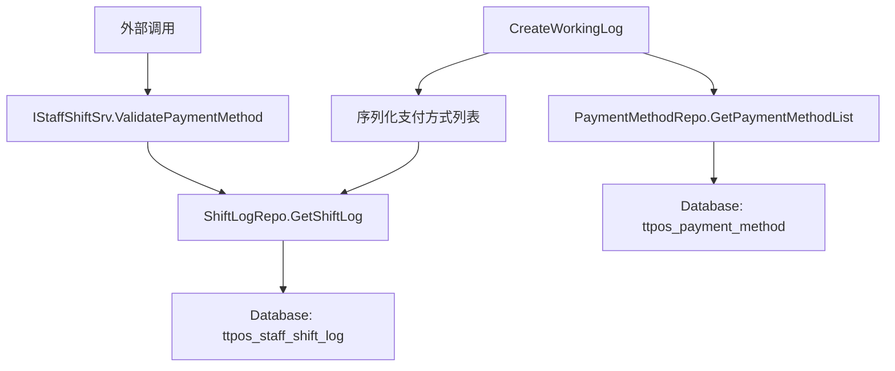

# ERP 班次支付方式锁定与验证 设计文档

> 本文档定义 ERP 班次支付方式锁定与验证功能的技术设计和实现方案。

## 📋 概述

本功能在班次开账时保存当前可用的支付方式配置到班次记录中，并提供检查函数供外部调用，以支持后续的支付方式验证功能。本次实现仅包含数据保存和检查函数，不包含完整的验证逻辑实现。

**技术栈**: Go (main/)  
**涉及模块**: Service 层、Repository 层、Model 层

---

## 🎯 规范对齐

### Go Main 规范 (go-main.mdc)

- ✅ Service 只依赖其他 Service 接口，不直接依赖 Repository
- ✅ Repository 只持有 db 实例，不持有 DBManager
- ✅ 接口以 `I` 开头，实现以 `Impl` 结尾
- ✅ 不使用 panic，返回 error
- ✅ 使用 `errors.WithMessage` 包装错误

### 数据库规范 (database.mdc)

- ✅ 新增字段使用 snake_case 命名
- ✅ 时间字段使用 int 类型，\_time 结尾
- ✅ JSON 字段使用 text 类型存储
- ✅ 字段设置为可空（NULL），兼容历史数据

---

## 🔄 代码复用分析

### 可复用的现有组件

- **PaymentMethodRepo**: `main/app/repository/payment_method.go` - 查询已启用的支付方式列表
- **ShiftLogRepo**: `main/app/repository/staff_shift_log.go` - 班次记录的 CRUD 操作
- **StaffShiftSrv**: `main/app/service/staff_shift.go` - 班次开账逻辑（`CreateWorkingLog` 方法）
- **PaymentMethod Model**: `main/app/model/payment_order.go` - 支付方式数据模型

### 集成点

- **班次开账流程**: 在 `CreateWorkingLog` 方法中，当公司开启 ERP 时，保存支付方式列表
- **数据库表**: `ttpos_staff_shift_log` 表新增字段存储支付方式列表
- **Service 接口**: `IStaffShiftSrv` 接口新增检查方法供外部调用

---

## 🏗️ 架构设计

### 分层设计原则

**Go Main 三层架构**:

```
API 层 (Controller/API)
  ↓ 依赖
业务层 (Service)
  ↓ 依赖
数据层 (Repository)
```

**依赖规则**:
- ✅ Service 可以依赖其他 Service 接口
- ✅ Repository 只持有 db 实例
- ❌ Service 不能直接依赖 Repository（通过其他 Service 间接访问）

### 架构图



### 模块划分

#### Go Main 模块

- **Service 层**: `main/app/service/staff_shift.go` - 业务逻辑实现
- **Repository 层**: `main/app/repository/staff_shift_log.go` - 数据访问
- **Model 层**: `main/app/model/staff.go` - 数据模型（`StaffShiftLog`）

---

## 🗄️ 数据库设计

### 数据表设计

#### 表: ttpos_staff_shift_log（修改现有表）

**新增字段**:

```sql
ALTER TABLE `ttpos_staff_shift_log` 
ADD COLUMN `opening_payment_methods` varchar(2000) COMMENT '开账时的支付方式UUID列表（逗号分隔）' AFTER `erpnext_async_record_id`;
```

**字段说明**:

| 字段 | 类型 | 说明 | 约束 |
|------|------|------|------|
| opening_payment_methods | varchar(2000) | 开账时的支付方式UUID列表（逗号分隔） | NULL，兼容历史数据 |

**数据格式**:

```
123456,123457,123458
```

**字段说明**:
- 存储支付方式 UUID，多个 UUID 用逗号（`,`）分隔
- 示例：`123456,123457,123458` 表示开账时允许使用 UUID 为 123456、123457、123458 的支付方式

**迁移文件**: `admin/database/migrations/{YYYYMMDDHHMMSS}_add_opening_payment_methods_to_staff_shift_log.php`

---

## 📊 数据模型

### Go Model

```go
// main/app/model/staff.go
type StaffShiftLog struct {
    // ... 现有字段 ...
    
    OpeningPaymentMethods string `gorm:"column:opening_payment_methods;type:varchar(2000);comment:开账时的支付方式UUID列表（逗号分隔）" json:"opening_payment_methods"`
    
    // ... 其他字段 ...
}
```

---

## 🔌 API 设计

**注意**: 本次实现不涉及 HTTP API 接口，仅提供 Service 层方法供内部调用。

### Service 接口

```go
// main/app/service/staff_shift.go
type IStaffShiftSrv interface {
    // ... 现有方法 ...
    
    // ValidatePaymentMethod 验证支付方式是否在开账时保存的列表中
    // shiftNo: 交班编号
    // paymentMethodUuid: 支付方式 UUID
    // 返回: true-允许使用, false-不允许使用, error-错误信息
    ValidatePaymentMethod(ctx context.Context, shiftNo string, paymentMethodUuid uint64) (bool, error)
}
```

---

## 🧩 组件和接口

### Service 层

#### Service 接口

```go
// main/app/service/staff_shift.go
type IStaffShiftSrv interface {
    // ... 现有方法 ...
    ValidatePaymentMethod(ctx context.Context, shiftNo string, paymentMethodUuid uint64) (bool, error)
}
```

#### Service 实现

```go
// main/app/service/staff_shift.go
func (s *staffShiftSrv) CreateWorkingLog(ctx context.Context, staff model.Staff) (model.StaffShiftLog, error) {
    // ... 现有代码 ...
    
    var openingPaymentMethodsStr string
    if company.IsOpenErp() && companySetting.ErpnextSiteCode != "" {
        // ... 现有 ERP 开账逻辑 ...
        
        // 保存支付方式UUID列表（逗号分隔）
        uuids := make([]string, 0)
        for _, paymentMethod := range paymentMethodList {
            uuids = append(uuids, fmt.Sprintf("%d", paymentMethod.Uuid))
        }
        
        if len(uuids) > 0 {
            openingPaymentMethodsStr = strings.Join(uuids, ",")
        }
    }
    
    shiftLog, _ := shiftLogRepo.Create(model.StaffShiftLog{
        // ... 现有字段 ...
        OpeningPaymentMethods: openingPaymentMethodsStr,
    })
    return shiftLog, nil
}

// ValidatePaymentMethod 验证支付方式是否在开账时保存的列表中
func (s *staffShiftSrv) ValidatePaymentMethod(ctx context.Context, shiftNo string, paymentMethodUuid uint64) (bool, error) {
    db := s.dbm.GetDB(ctx.GetCompanyUuid())
    shiftLogRepo := repository.NewShiftLogRepo(db)
    commonRepo := repository.NewCommonRepo()
    
    // 查询班次记录
    shiftLog, err := shiftLogRepo.GetShiftLog(
        commonRepo.WhereByShiftNo(shiftNo),
    )
    if err != nil {
        return false, errors.WithMessage(err, "班次记录不存在")
    }
    
    // 如果未保存支付方式列表（历史数据），返回 false（不允许使用）
    if shiftLog.OpeningPaymentMethods == "" {
        return false, nil
    }
    
    // 检查支付方式UUID是否在列表中（逗号分隔的字符串）
    paymentMethodUuidStr := fmt.Sprintf("%d", paymentMethodUuid)
    uuids := strings.Split(shiftLog.OpeningPaymentMethods, ",")
    for _, uuidStr := range uuids {
        uuidStr = strings.TrimSpace(uuidStr) // 去除空格
        if uuidStr == paymentMethodUuidStr {
            return true, nil
        }
    }
    
    return false, nil
}
```

### Repository 层

**无需新增 Repository 方法**，使用现有的 `GetShiftLog` 方法即可。

---

## ⚡ 缓存设计

**本次实现不涉及缓存**，直接查询数据库。

---

## 🚨 错误处理

### 错误场景

#### 场景 1: 班次记录不存在

- **处理方式**: 返回错误，错误信息："班次记录不存在"
- **代码示例**:
  ```go
  if err != nil {
      return false, errors.WithMessage(err, "班次记录不存在")
  }
  ```

#### 场景 2: 支付方式不在列表中

- **处理方式**: 返回 `false`（不允许使用）
- **用户影响**: 调用方根据返回值决定是否允许使用该支付方式

---

## 🔒 安全设计

### 数据安全

- **SQL 注入防护**: 使用 GORM 参数化查询
- **数据验证**: 验证交班编号和支付方式 UUID 的有效性

---

## 🧪 测试策略

### 单元测试

**目标覆盖率**:
- Service 层: 70%+
- Repository 层: 80%+（使用现有方法，无需新增测试）

**测试内容**:
- `CreateWorkingLog`: 测试支付方式UUID列表保存逻辑（逗号分隔）
- `ValidatePaymentMethod`: 测试检查函数逻辑
  - 正常场景：支付方式在列表中
  - 异常场景：支付方式不在列表中
  - 边界场景：历史数据（未保存支付方式列表）
  - 错误场景：班次记录不存在（通过 shift_no 查询）

**示例**:

```go
// main/app/service/staff_shift_test.go
func TestStaffShiftSrv_CreateWorkingLog_SavePaymentMethods(t *testing.T) {
    // 测试支付方式列表保存逻辑
}

func TestStaffShiftSrv_ValidatePaymentMethod_Success(t *testing.T) {
    // 测试支付方式在列表中的场景
}

func TestStaffShiftSrv_ValidatePaymentMethod_NotInList(t *testing.T) {
    // 测试支付方式不在列表中的场景
}

func TestStaffShiftSrv_ValidatePaymentMethod_HistoryData(t *testing.T) {
    // 测试历史数据（未保存支付方式列表）的场景
}
```

### 集成测试

**测试流程**:
- 班次开账 → 保存支付方式列表 → 调用检查函数 → 验证结果

---

## 📈 性能优化

### 优化策略

1. **数据库优化**:
   - 使用索引查询班次记录（uuid 字段已有唯一索引）
   - JSON 字段使用 text 类型，避免长度限制

2. **查询优化**:
   - 只查询必要的字段（uuid, opening_payment_methods）
   - 使用 GORM 的 Select 方法限制查询字段

### 性能指标

- 本地响应时间: < 50ms（单次查询）
- 数据库查询: < 20ms（索引查询）

---

## 📚 实现清单

### Phase 1: 数据库和模型

- [ ] 创建数据库迁移文件
- [ ] 执行数据库迁移
- [ ] 更新 Go Model（添加字段和结构体）

### Phase 2: 核心实现

- [ ] 修改 `CreateWorkingLog` 方法，保存支付方式列表
- [ ] 实现 `ValidatePaymentMethod` 方法
- [ ] 添加 `OpeningPaymentMethod` 结构体定义

### Phase 3: 测试

- [ ] 编写 Service 单元测试
- [ ] 编写集成测试

**详细任务**: 参见 `tasks.md`

---

## Graphiti & 活动日志

- Related Episode: `[待补充]`
- 模板：`docs/agent/templates/graphiti-episode.md`
- 活动日志：`docs/team/activities/{YYYY-MM}/{YYYY-MM-DD}.md`
- 在技术方案评审、关键架构决策或踩坑总结后，立即补充 Episode 并在设计文档尾部互链。

---

**版本**: v1.0.0  
**创建日期**: 2025-12-30  
**作者**: 王昱  
**审核者**: {审核者}

