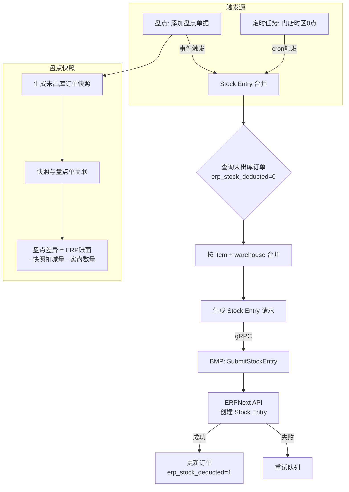

# story-erp-stock-entry-deferred 技术设计

## 概述

| 项目 | 内容 |
|------|------|
| Spec ID | story-erp-stock-entry-deferred |
| 设计人 | weifashi |
| 设计日期 | 2026-03-05 |
| 总 SP | 5 |
| 依赖 | story-erp-sales-invoice-pipeline（需要 erp_stock_deducted 字段） |

## 代码复用分析

### 可复用代码

| 文件 | 说明 | 复用方式 |
|------|------|---------|
| `ttpos-bmp/app/ttpos-erp/internal/logic/stock/` | 现有库存逻辑 | 扩展，新增 Stock Entry 合并逻辑 |
| `main/app/service/rpc/erp/selling.go` | ERP RPC SubmitStockEntry | 直接调用 |
| `main/app/tasks/` | 定时任务框架 | 复用，新增 0 点 Stock Entry 任务 |
| `main/app/service/` | 盘点相关服务 | 修改，添加 Stock Entry 触发 |
| `main/app/model/sale_order.go` | erp_stock_deducted 字段 | 直接使用 |

### 需要新建

| 文件 | 说明 |
|------|------|
| `ttpos-bmp/app/ttpos-erp/internal/logic/stock/stock_entry_merge.go` | Stock Entry 合并扣减逻辑 |
| `main/app/service/erp_stock_entry.go` | Main 侧 Stock Entry 服务 |
| `main/app/tasks/erp_stock_entry_task.go` | 0 点定时任务 |

## 架构设计



### Stock Entry 合并规则

```
输入: N 个未出库订单的商品/物品明细
  订单1: itemA@warehouseX qty=2, itemB@warehouseY qty=1
  订单2: itemA@warehouseX qty=3, itemB@warehouseZ qty=2
  订单3: itemA@warehouseX qty=1

输出: 合并后的 Stock Entry 行项
  itemA@warehouseX qty=6 (2+3+1)
  itemB@warehouseY qty=1
  itemB@warehouseZ qty=2
```

## 组件和接口

### Service: ErpStockEntrySrv

**位置**: `main/app/service/erp_stock_entry.go`

```go
type IErpStockEntrySrv interface {
    // 触发 Stock Entry 合并扣减（盘点或0点调用）
    TriggerStockEntryDeduction(ctx context.Context, companyUuid uint64) error

    // 生成盘点快照
    GenerateStocktakeSnapshot(ctx context.Context, stocktakeUuid uint64) (*StocktakeSnapshot, error)

    // 查询订单是否已出库
    IsOrderStockDeducted(ctx context.Context, saleOrderUuid uint64) (bool, error)
}
```

### Task: ErpStockEntryTask

**位置**: `main/app/tasks/erp_stock_entry_task.go`

```go
// 每日门店时区 0 点触发
func (t *ErpStockEntryTask) Run(ctx context.Context) {
    // 1. 获取所有 ERP 商家的门店列表
    // 2. 按门店时区判断是否到达 0 点
    // 3. 对每个到达 0 点的门店触发 TriggerStockEntryDeduction
}
```

## 数据模型

### 盘点快照表

```sql
CREATE TABLE ttpos_stocktake_snapshot (
    id BIGINT AUTO_INCREMENT PRIMARY KEY,
    uuid BIGINT UNSIGNED NOT NULL,
    stocktake_uuid BIGINT UNSIGNED NOT NULL COMMENT '盘点单UUID',
    item_code VARCHAR(255) NOT NULL COMMENT 'ERP Item Code',
    warehouse VARCHAR(255) NOT NULL COMMENT 'ERP 仓库',
    pending_qty DECIMAL(12,4) NOT NULL COMMENT '未出库数量',
    order_uuids TEXT COMMENT '关联的订单UUID列表(JSON)',
    create_time INT NOT NULL,
    update_time INT NOT NULL,
    delete_time INT NOT NULL DEFAULT 0,
    KEY idx_stocktake (stocktake_uuid),
    KEY idx_item_warehouse (item_code, warehouse)
) COMMENT '盘点未出库订单快照';
```

### Stock Entry 类型扩展

在 ERPNext 中新增 Stock Entry Type:
- **Name**: Material Inventory Deduction
- **Purpose**: Material Consumption for Manufacture

## 风险识别

| 风险 | 影响 | 缓解措施 |
|------|------|---------|
| 大量订单合并超时 | Stock Entry 创建失败 | 分批合并，每批最多 500 行 |
| 门店时区计算错误 | 0 点触发时间不对 | 使用门店配置的 timezone 字段 |
| 快照与实际不一致 | 盘点差异计算错误 | 反结账时重算快照 |
| Stock Entry 失败 | 库存账面不准 | 重试队列 + 告警 + 手动补偿 |

## 测试策略

```bash
cd main && go test -run TestStockEntry ./app/service/...
cd main && go test -run TestStocktakeSnapshot ./app/service/...
```
