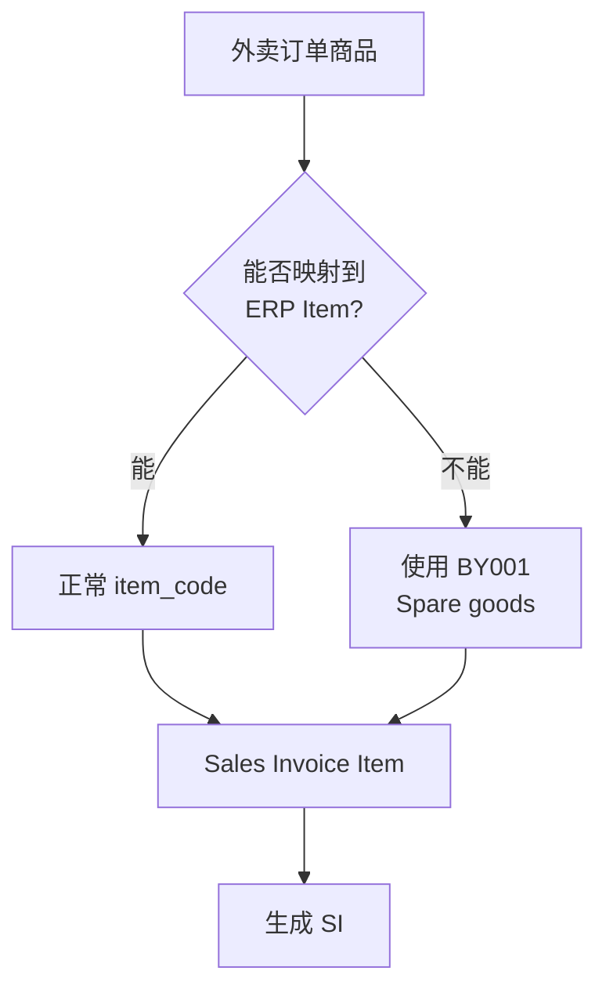

# story-erp-takeout-exception-fallback 技术设计

## 概述

| 项目 | 内容 |
|------|------|
| Spec ID | story-erp-takeout-exception-fallback |
| 设计人 | weifashi |
| 设计日期 | 2026-03-05 |
| 总 SP | 2 |
| 依赖 | story-erp-sales-invoice-pipeline（SI 生成逻辑中使用备用商品） |

## 代码复用分析

### 可复用代码

| 文件 | 说明 | 复用方式 |
|------|------|---------|
| `ttpos-bmp/app/ttpos-erp/internal/logic/selling/sales_invoice.go` | SI 创建逻辑 | 修改，添加 item 映射降级 |
| `main/app/modules/takeout/` | 外卖模块 | 修改，添加异常处理 |

### 需要新建

| 文件 | 说明 |
|------|------|
| 无需新建文件 | 在现有逻辑中添加降级判断 |

## 架构设计



### 降级规则

1. 外卖订单（Grab/LINE MAN）的商品尝试映射到 ERP Item
2. 如果映射失败（item_code 不存在或未配置）：
   - 使用 BY001 (Spare goods) 作为 item_code
   - 保留原商品数量和金额
   - 在 description 中记录原商品名称
3. POS Invoice 和 Sales Invoice 均适用此降级逻辑

## 组件和接口

### 降级逻辑

**位置**: SI 创建逻辑中（BMP 或 Main）

```go
const SpareGoodsItemCode = "BY001"

func mapItemCode(itemCode string, isTakeoutOrder bool) string {
    if itemCode == "" && isTakeoutOrder {
        return SpareGoodsItemCode
    }
    // 可选: 查询 ERP 确认 item 存在，不存在则降级
    return itemCode
}
```

## 数据模型

### 备用商品配置

| 属性 | 值 |
|------|-----|
| 备用商品名称 | Spare goods |
| Item Code | BY001 |
| Item group | Products |
| 单位 | Nos |

### ERPNext 配置要求

需要在以下环境的所有 site 中添加 BY001:
- 测试环境
- UAT 环境
- 生产环境
- 初始化 site 模板

## 风险识别

| 风险 | 影响 | 缓解措施 |
|------|------|---------|
| BY001 未配置 | SI 创建仍然失败 | 启动时检查 BY001 存在性 |
| 大量异常订单 | 对账困难 | 记录日志和统计，便于排查 |

## 测试策略

```bash
cd main && go test -run TestTakeoutSpareGoods ./app/modules/takeout/...
```
