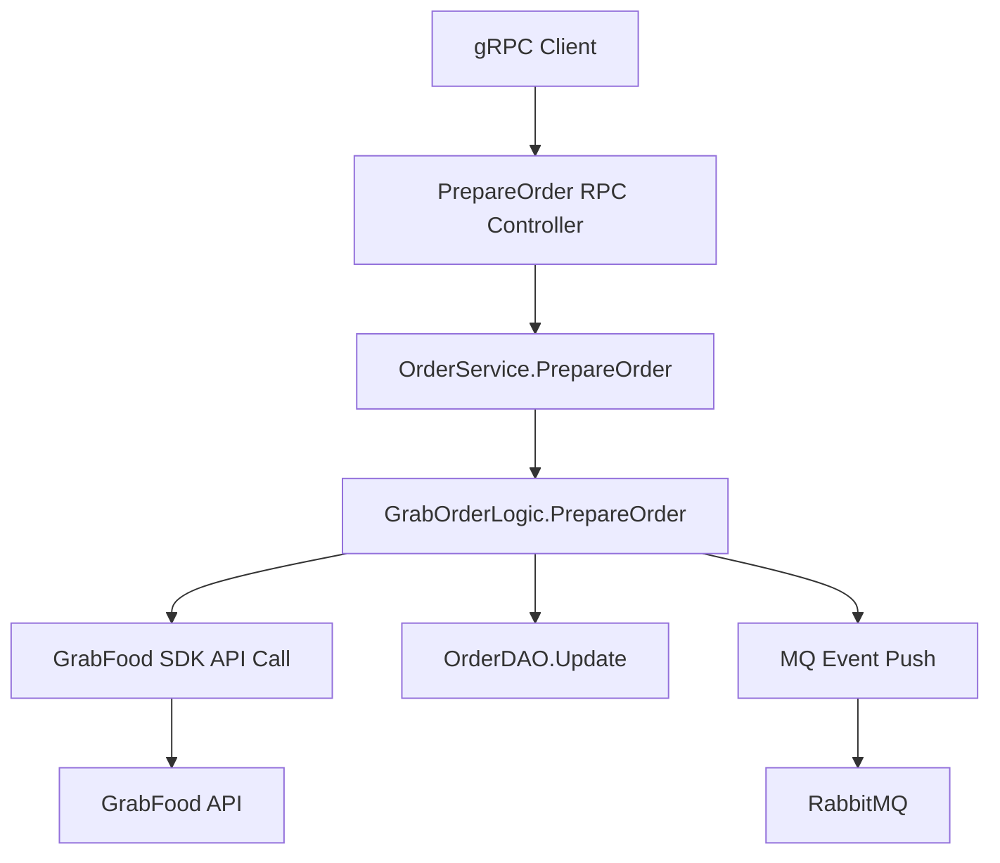

# Grab 订单接受/拒绝功能 设计文档

> 本文档定义 Grab 订单接受/拒绝功能的技术设计和实现方案。

## 📋 概述

Grab 订单接受/拒绝功能允许商户主动管理订单状态，通过调用 GrabFood API 的 accept-reject-order 接口实现订单的接受或拒绝操作。该功能基于现有的 GrabFood 集成架构，新增 PrepareOrder gRPC 服务，支持多平台扩展设计。

## 🎯 规范对齐

### Go BMP 规范 (go-bmp.mdc)

[说明设计如何遵循 Go BMP 开发规范]

- **GoFrame v2.x**: 使用 GoFrame 框架实现 gRPC 服务
- **目录结构**: 遵循 ttpos-bmp 项目结构，代码放在 `internal/logic/`, `internal/controller/rpc/`
- **自动生成文件**: dao/entity/do/ 目录由框架生成，不手动修改
- **gRPC 服务**: 服务注册到 Nacos，支持服务发现
- **Protobuf 生成**: 使用 `gf gen pb` 生成 gRPC 代码
- **错误处理**: 使用 gerror 包进行错误处理，不使用 panic

### API 设计规范 (api.mdc)

[说明 API 设计如何遵循规范]

- **gRPC 接口**: 遵循 Protobuf 规范，消息命名使用 PascalCase
- **字段命名**: 请求参数使用 snake_case，响应数据使用 camelCase
- **响应格式**: gRPC 响应包含 code, message, data 字段
- **参数验证**: 在 Controller 层进行参数验证

### 数据库规范 (database.mdc)

[说明数据库设计如何遵循规范]

- **现有表结构**: 使用现有的 `ttpos_order` 表，无需新增表结构
- **字段规范**: 现有字段已符合规范（uuid, create_time, update_time, delete_time）
- **软删除**: 使用 delete_time 字段进行软删除

---

## 🔄 代码复用分析

[分析将复用、扩展或集成的现有代码]

### 可复用的现有组件

- **grab_order.go**: `ttpos-bmp/app/ttpos-takeout/internal/logic/grab_order/grab_order.go` - 现有 Grab 订单处理逻辑，可扩展 PrepareOrder 方法
- **OrderService**: `ttpos-bmp/app/ttpos-takeout/internal/service/order.go` - 现有订单服务，可新增 PrepareOrder 接口
- **Protobuf 模板**: `ttpos-bmp/app/ttpos-takeout/manifest/protobuf/order/order.proto` - 现有 Protobuf 定义，可新增 PrepareOrder 服务
- **MQ 事件**: `ttpos-bmp/app/ttpos-takeout/internal/logic/grab_order/grab_order.go` - 现有的 MQ 事件推送机制

### 集成点

- **GrabFood SDK**: 集成 `github.com/grab/grabfood-api-sdk-go` 的 accept-reject-order API
- **订单查询**: 复用现有的订单查询逻辑
- **状态更新**: 复用现有的订单状态更新逻辑
- **MQ 推送**: 复用现有的 MQ 事件推送机制

---

## 🏗️ 架构设计

[描述整体架构和使用的设计模式]

### 分层设计原则

**Go BMP 三层架构**:

```
gRPC Controller (RPC)
  ↓ 依赖
Logic 层 (业务逻辑)
  ↓ 依赖
DAO 层 (数据访问 - 自动生成 ❌ 禁止修改)
```

**依赖规则**:

- ✅ 上层可依赖下层
- ❌ 禁止下层依赖上层
- ✅ Logic 可依赖其他 Logic 接口
- ✅ 使用依赖注入方式管理依赖

### 架构图



### 模块划分

#### Go BMP 模块

- **Protobuf 定义**: `ttpos-bmp/app/ttpos-takeout/manifest/protobuf/order/order.proto` - 新增 PrepareOrder 服务定义
- **RPC Controller**: `ttpos-bmp/app/ttpos-takeout/internal/controller/rpc/order/order.go` - 实现 gRPC 接口
- **Logic 层**: `ttpos-bmp/app/ttpos-takeout/internal/logic/grab_order/grab_order.go` - 实现业务逻辑
- **Service 层**: `ttpos-bmp/app/ttpos-takeout/internal/service/order.go` - 服务接口定义

---

## 🗄️ 数据库设计

### 数据表设计

#### 表 1: ttpos_order (现有表，无需修改)

```sql
-- 现有表结构，无需修改
CREATE TABLE IF NOT EXISTS `ttpos_order` (
    `id` bigint unsigned NOT NULL AUTO_INCREMENT COMMENT '主键ID',
    `uuid` bigint unsigned NOT NULL DEFAULT 0 COMMENT '唯一标识',
    `shop_uuid` varchar(64) NOT NULL DEFAULT '' COMMENT '店铺UUID',
    `provider_merchant_id` varchar(128) NOT NULL DEFAULT '' COMMENT '平台商户ID',
    `provider_order_id` varchar(128) NOT NULL DEFAULT '' COMMENT '平台订单ID',
    `short_order_number` varchar(32) NOT NULL DEFAULT '' COMMENT '订单简号',
    `provider_name` varchar(32) NOT NULL DEFAULT '' COMMENT '平台名称',
    `order_type` varchar(32) NOT NULL DEFAULT '' COMMENT '订单类型',
    `order_time` int NOT NULL DEFAULT 0 COMMENT '下单时间',
    `order_status` varchar(32) NOT NULL DEFAULT '' COMMENT '订单状态',
    `scheduled_time` int NOT NULL DEFAULT 0 COMMENT '预约时间',
    `currency` varchar(8) NOT NULL DEFAULT '' COMMENT '货币代码',
    `subtotal` decimal(20,8) NOT NULL DEFAULT 0.00000000 COMMENT '小计金额',
    `total_amount` decimal(20,8) NOT NULL DEFAULT 0.00000000 COMMENT '总金额',
    `merchant_charge` decimal(20,8) NOT NULL DEFAULT 0.00000000 COMMENT '商户手续费',
    `tax_amount` decimal(20,8) NOT NULL DEFAULT 0.00000000 COMMENT '税费',
    `discount_amount` decimal(20,8) NOT NULL DEFAULT 0.00000000 COMMENT '折扣金额',
    `merchant_fund_promo` decimal(20,8) NOT NULL DEFAULT 0.00000000 COMMENT '商户优惠',
    `payment_type` varchar(32) NOT NULL DEFAULT '' COMMENT '支付类型',
    `is_mex_edit_order` tinyint NOT NULL DEFAULT 0 COMMENT '是否商户编辑订单',
    `cutlery` tinyint NOT NULL DEFAULT 0 COMMENT '是否需要餐具',
    `eater_count` int NOT NULL DEFAULT 0 COMMENT '用餐人数',
    `customer_name` varchar(128) NOT NULL DEFAULT '' COMMENT '客户姓名',
    `customer_phone` varchar(32) NOT NULL DEFAULT '' COMMENT '客户电话',
    `delivery_address` text COMMENT '配送地址JSON',
    `note` text COMMENT '备注',
    `raw_data` text COMMENT '原始数据JSON',
    `create_time` int NOT NULL DEFAULT 0 COMMENT '创建时间',
    `update_time` int NOT NULL DEFAULT 0 COMMENT '更新时间',
    `delete_time` int NOT NULL DEFAULT 0 COMMENT '删除时间',
    PRIMARY KEY (`id`),
    UNIQUE KEY `uk_uuid` (`uuid`),
    KEY `idx_provider_order_id` (`provider_order_id`),
    KEY `idx_shop_uuid` (`shop_uuid`),
    KEY `idx_provider_name` (`provider_name`),
    KEY `idx_order_status` (`order_status`)
) ENGINE=InnoDB DEFAULT CHARSET=utf8mb4 COMMENT='订单表';
```

**字段说明**:
| 字段 | 类型 | 说明 | 约束 |
|------|------|------|------|
| id | bigint unsigned | 主键 ID | AUTO_INCREMENT |
| uuid | bigint unsigned | 唯一标识 | DEFAULT 0, UNIQUE |
| shop_uuid | varchar(64) | 店铺UUID | NOT NULL |
| provider_order_id | varchar(128) | 平台订单ID | NOT NULL |
| order_status | varchar(32) | 订单状态 | NOT NULL |
| ... | ... | ... | ... |

**索引设计**:

- 主键索引: `PRIMARY KEY (id)`
- 唯一索引: `UNIQUE KEY uk_uuid (uuid)`
- 普通索引: `KEY idx_provider_order_id (provider_order_id)`
- 普通索引: `KEY idx_shop_uuid (shop_uuid)`

---

## 📊 数据模型

### Go Model (现有)

```go
// ttpos-bmp/app/ttpos-takeout/internal/model/entity/order.go (自动生成)
// 现有数据模型，无需修改
type Order struct {
    Id                   uint64  `gorm:"column:id;primaryKey" json:"id"`
    Uuid                 uint64  `gorm:"column:uuid;uniqueIndex" json:"uuid"`
    ShopUuid             string  `gorm:"column:shop_uuid" json:"shop_uuid"`
    ProviderMerchantId   string  `gorm:"column:provider_merchant_id" json:"provider_merchant_id"`
    ProviderOrderId      string  `gorm:"column:provider_order_id" json:"provider_order_id"`
    OrderStatus          string  `gorm:"column:order_status" json:"order_status"`
    // ... 其他字段
}
```

### DTO 定义

#### Request DTO

```go
// ttpos-bmp/app/ttpos-takeout/internal/model/dto/order/prepare_req.go
type PrepareOrderReq struct {
    TakeoutOrderUuid string `json:"takeout_order_uuid" v:"required#订单UUID不能为空"`
    ToState          string `json:"to_state" v:"required|in:Accepted,Rejected#状态必须是Accepted或Rejected"`
    RequestId        string `json:"request_id,omitempty"` // 请求追踪ID
}
```

#### Response DTO

```go
// ttpos-bmp/app/ttpos-takeout/internal/model/dto/order/prepare_resp.go
type PrepareOrderResp struct {
    OrderUuid string `json:"order_uuid"` // 订单UUID
}
```

---

## 🔌 API 设计

### gRPC API

#### Protobuf 定义

```protobuf
// ttpos-bmp/app/ttpos-takeout/manifest/protobuf/order/order.proto
syntax = "proto3";

package order;
option go_package = "ttpos-bmp/app/ttpos-takeout/api/order";

// 新增 PrepareOrder 请求消息
message PrepareOrderReq {
  string takeout_order_uuid = 1;  // TTPOS 订单 UUID
  string to_state = 2;            // 目标状态: Accepted/Rejected
  string request_id = 3;          // 请求追踪ID (可选)
}

// 新增 PrepareOrder 响应消息
message PrepareOrderResp {
  string order_uuid = 1;     // 订单 UUID
}

// 订单服务
service OrderService {
  // 获取订单信息
  rpc GetOrderInfo(GetOrderInfoReq) returns (takeout.ApiResponse);
  // 准备订单（接受/拒绝）
  rpc PrepareOrder(PrepareOrderReq) returns (takeout.ApiResponse);
}
```

**生成代码**:

```bash
cd ttpos-bmp/app/ttpos-takeout
gf gen pb
```

**参考**: `ttpos-bmp/.cursor/rules/proto-rules.mdc`

---

## 🧩 组件和接口

### Service 层

#### Service 接口

```go
// ttpos-bmp/app/ttpos-takeout/internal/service/order.go
type IOrderService interface {
    GetOrderInfo(ctx context.Context, req *api.GetOrderInfoReq) (*api.GetOrderInfoResp, error)
    PrepareOrder(ctx context.Context, req *api.PrepareOrderReq) (*api.PrepareOrderResp, error)
}

type sOrder struct{}

func New() IOrderService {
    return &sOrder{}
}
```

#### Service 实现

```go
// ttpos-bmp/app/ttpos-takeout/internal/service/order.go
func (s *sOrder) PrepareOrder(ctx context.Context, req *api.PrepareOrderReq) (*api.PrepareOrderResp, error) {
    // 根据 provider_name 路由到不同的处理逻辑
    switch req.ProviderName {
    case consts.ProviderGrab:
        return grab_order.New().PrepareOrder(ctx, req)
    // 未来可扩展其他平台
    default:
        return nil, gerror.Newf("不支持的平台: %s", req.ProviderName)
    }
}
```

### Logic 层

#### Grab Order Logic

```go
// ttpos-bmp/app/ttpos-takeout/internal/logic/grab_order/grab_order.go
func (s *sGrabOrder) PrepareOrder(ctx context.Context, req *api.PrepareOrderReq) (*api.PrepareOrderResp, error) {
    // 1. 查询订单信息
    order, err := s.getOrderByUuid(ctx, req.TakeoutOrderUuid)
    if err != nil {
        return nil, err
    }

    // 2. 验证订单状态
    if err := s.validateOrderStatus(order.OrderStatus); err != nil {
        return nil, err
    }

    // 3. 调用 GrabFood SDK
    if err := s.callGrabAcceptRejectAPI(ctx, order, req.ToState); err != nil {
        return nil, err
    }

    // 4. 更新本地状态
    if err := s.updateOrderStatus(ctx, order.Uuid, req.ToState); err != nil {
        return nil, err
    }

    // 5. 发送 MQ 事件
    s.sendPrepareOrderEvent(ctx, order, req.ToState)

    return &api.PrepareOrderResp{
        OrderUuid: req.TakeoutOrderUuid,
    }, nil
}
```

### RPC Controller

```go
// ttpos-bmp/app/ttpos-takeout/internal/controller/rpc/order/order.go
func (c *Controller) PrepareOrder(ctx context.Context, req *order.PrepareOrderReq) (*order.PrepareOrderResp, error) {
    // 参数验证
    if err := c.validatePrepareOrderReq(req); err != nil {
        return nil, err
    }

    // 调用服务
    resp, err := service.Order().PrepareOrder(ctx, &api.PrepareOrderReq{
        TakeoutOrderUuid: req.TakeoutOrderUuid,
        ToState:          req.ToState,
        RequestId:        req.RequestId,
    })
    if err != nil {
        return nil, err
    }

    return &order.PrepareOrderResp{
        OrderUuid: resp.OrderUuid,
    }, nil
}
```

---

## ⚡ 缓存设计

### Redis 缓存 (如需要)

**缓存策略**:

- **Key 命名**: `ttpos:grab:order:{order_uuid}`
- **过期时间**: 5 分钟（订单状态缓存）
- **更新策略**: Write-Through Pattern

---

## 🚨 错误处理

### 错误场景

#### 场景 1: 订单不存在

- **处理方式**: 查询订单失败时返回明确错误
- **用户影响**: 返回 "订单不存在" 错误信息
- **代码示例**:
  ```go
  order, err := dao.Order.GetByUuid(ctx, orderUuid)
  if err != nil {
      return nil, gerror.Wrap(err, "查询订单失败")
  }
  if order == nil {
      return nil, gerror.New("订单不存在")
  }
  ```

#### 场景 2: 订单状态不允许操作

- **处理方式**: 验证订单状态，只有特定状态允许接受/拒绝
- **用户影响**: 返回 "订单状态不允许操作" 错误
- **代码示例**:
  ```go
  if !s.isOrderAcceptable(order.OrderStatus) {
      return gerror.New("订单状态不允许接受/拒绝操作")
  }
  ```

#### 场景 3: GrabFood API 调用失败

- **处理方式**: API 调用失败时不更新本地状态，返回错误
- **用户影响**: 返回 API 调用失败信息
- **代码示例**:
  ```go
  if err := s.callGrabAcceptRejectAPI(ctx, order, toState); err != nil {
      g.Log().Errorf(ctx, "GrabFood API 调用失败: %v", err)
      return gerror.Wrap(err, "平台API调用失败")
  }
  ```

---

## 🔒 安全设计

### 身份验证

- **gRPC 认证**: 使用 gRPC 拦截器进行身份验证
- **Token 验证**: 验证调用方的身份和权限

### 权限控制

- **订单权限**: 验证调用方是否有操作该订单的权限
- **店铺权限**: 验证订单是否属于调用方的店铺

### 数据安全

- **参数验证**: 严格验证输入参数，防止注入攻击
- **错误信息**: 不暴露敏感信息给错误响应

---

## 🧪 测试策略

### 单元测试

**目标覆盖率**:

- ttpos-bmp/app/ttpos-takeout/internal/logic: ≥ 70%
- ttpos-bmp/app/ttpos-takeout/internal/service: ≥ 70%

**测试内容**:

- Logic 业务逻辑测试
- Service 接口测试
- 参数验证测试
- 错误处理测试

**示例**:

```go
// ttpos-bmp/app/ttpos-takeout/internal/logic/grab_order/grab_order_prepare_test.go
func TestGrabOrder_PrepareOrder(t *testing.T) {
    // 测试接受订单
    // 测试拒绝订单
    // 测试订单不存在
    // 测试状态不允许操作
}
```

### API 测试

**测试内容**:

- gRPC 接口调用测试
- 参数验证测试
- 响应格式测试
- 错误处理测试

### 集成测试

**测试流程**:

- 完整的接受/拒绝订单流程
- MQ 事件验证
- 数据库状态一致性验证

---

## 📈 性能优化

### 优化策略

1. **数据库优化**:

   - 使用现有索引（idx_provider_order_id, idx_shop_uuid）
   - 优化查询条件，减少全表扫描

2. **缓存优化**:

   - 缓存订单基础信息，减少数据库查询
   - 缓存店铺配置信息

3. **并发控制**:

   - 使用订单 UUID 作为锁，防止并发操作同一订单
   - 实现乐观锁机制

4. **接口优化**:

   - 异步处理 MQ 事件推送，不阻塞主流程
   - 实现请求合并，减少 API 调用次数

### 性能指标

- 本地响应时间: < 200ms
- GrabFood API 调用时间: < 1000ms
- 数据库查询: < 50ms
- 并发处理能力: 支持 100+ QPS

---

## 🌐 浏览器兼容性

不涉及前端界面，无浏览器兼容性要求。

---

## 📚 实现清单

### Phase 1: Protobuf 和接口设计

- [ ] 定义 PrepareOrder Protobuf 接口
- [ ] 生成 gRPC 代码
- [ ] 创建 DTO 定义
- [ ] 更新 Service 接口

### Phase 2: 核心实现

- [ ] 实现 Grab Order Logic PrepareOrder 方法
- [ ] 集成 GrabFood SDK accept-reject-order API
- [ ] 实现订单状态验证和更新
- [ ] 实现 MQ 事件推送

### Phase 3: 控制器和集成

- [ ] 实现 RPC Controller PrepareOrder 方法
- [ ] 集成参数验证逻辑
- [ ] 更新 Service 实现
- [ ] 添加多平台路由支持

### Phase 4: 测试和优化

- [ ] 编写单元测试
- [ ] 编写 API 测试
- [ ] 性能优化和调优
- [ ] 集成测试验证

**详细任务**: 参见 `tasks.md`

---

## Graphiti & 活动日志

- Related Episode: `[待补充]`
- 模板：`docs/agent/templates/graphiti-episode.md`
- 活动日志：`docs/team/activities/{YYYY-MM}/{YYYY-MM-DD}.md`
- 在技术方案评审、关键架构决策或踩坑总结后，立即补充 Episode 并在设计文档尾部互链。

---

**版本**: v1.0.0  
**创建日期**: 2025-12-22  
**作者**: AI Assistant  
**审核者**:
