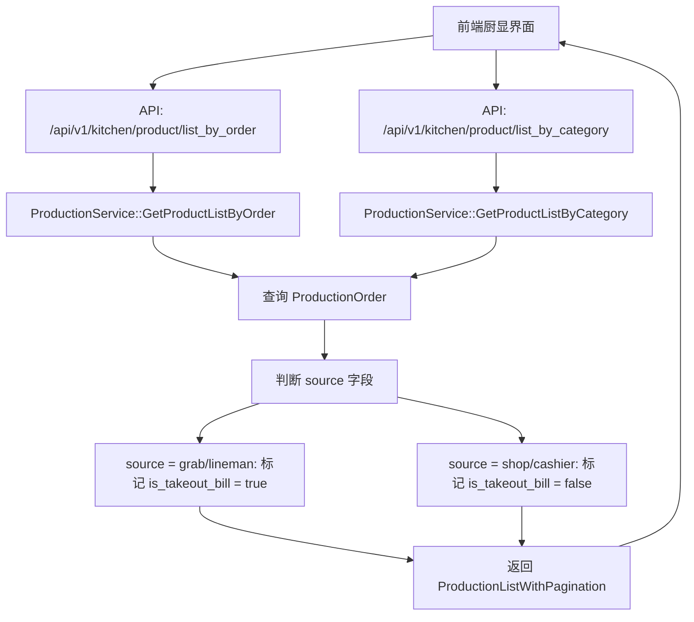

# 厨显（Grab/LINE MAN外卖相关） 设计文档

> 本文档定义厨显系统中 Grab/LINE MAN 外卖订单标识和商品名称统一显示的技术设计和实现方案。

## 📋 概述

在厨显系统中，当处理 Grab/LINE MAN 等第三方外卖平台的订单时，需要在"按订单显示"和"按分类显示"两种模式下，清晰标记外卖订单，并确保商品名称统一使用店内商品名称显示。该功能主要涉及后端接口数据返回和前端显示逻辑。

**技术栈**: Go (main/) + Vue (前端仓库: `all-kds-grab-order-display`)

---

## 🎯 规范对齐

### Go Main 规范 (go-main.mdc)

- ✅ Service 只依赖其他 Service 接口
- ✅ Repository 只持有 db 实例
- ✅ URL 使用 snake_case（已符合：`/api/v1/kitchen/product/list_by_order`）
- ✅ data 字段必须是对象（已符合）
- ✅ 不使用 panic，返回 error

### API 设计规范 (api.mdc)

- ✅ URL 使用 snake_case
- ✅ 响应格式统一：`{code, message, data{}}`
- ✅ data 不能为 null 或数组

### 数据库规范 (database.mdc)

- ⚠️ **需要新增字段**: 在 `ttpos_production_order` 表中添加 `takeout_order_uuid` 字段
- ✅ 外卖订单使用 `ttpos_takeout_order` 表（`main/app/modules/takeout` 模块）
- ⚠️ **重要**: Grab/LINE MAN 外卖订单是独立的，与 SaleBill 没有任何关系
- ✅ **架构设计**: 外卖订单接单后会创建 `ProductionOrder`，通过 `takeout_order_uuid` 字段关联到 `TakeoutOrder`
- ✅ **来源标识**: `ProductionOrder` 的 `source` 字段记录来源平台（grab, lineman）

---

## 🔄 代码复用分析

### 可复用的现有组件

- **ProductionService**: `main/app/service/production.go` - 送厨商品服务，已实现 `GetProductListByOrder` 和 `GetProductListByCategory` 方法
- **SaleBill Model**: `main/app/model/sale_bill.go` - 销售账单模型，已实现 `IsTakeoutBill()` 和 `IsOrderSourceTakeout()` 方法
- **TakeoutOrder Model**: `main/app/modules/takeout/domain/model/takeout_order.go` - 外卖订单模型（Grab/LINE MAN 等平台）
- **TakeoutOrderService**: `main/app/modules/takeout/domain/service/takeout_order_service.go` - 外卖订单领域服务
- **ProductionGroup Response**: `main/app/dto/resp/production.go` - 响应结构，已包含 `is_takeout_bill` 字段
- **ProductionItem Response**: `main/app/dto/resp/production.go` - 商品项响应，已包含 `locale_name` 字段（多语言商品名称）

### 集成点

- **现有 API**: `/api/v1/kitchen/product/list_by_order` 和 `/api/v1/kitchen/product/list_by_category` 已存在
- **外卖订单表**: `ttpos_takeout_order` 表存储 Grab/LINE MAN 等平台的订单数据
- **送厨单表**: `ttpos_production_order` 表统一管理店内订单和外卖订单的送厨数据
- ✅ **关联关系**: 外卖订单接单后会创建 `ProductionOrder`，通过 `takeout_order_uuid` 字段关联到 `TakeoutOrder`
- ✅ **来源标识**: `ProductionOrder.source` 字段记录来源平台（grab, lineman），用于识别外卖订单
- **前端仓库**: `all-kds-grab-order-display`（厨显前端）

---

## 🏗️ 架构设计

### 分层设计原则

**Go Main 三层架构**:

```
API 层 (Controller/API)
  ↓ 依赖
业务层 (Service)
  ↓ 依赖
数据层 (Repository)
```

**依赖规则**:

- ✅ 上层可依赖下层
- ❌ 禁止下层依赖上层
- ❌ 禁止跨层调用
- ❌ Service 不能依赖 Repository
- ✅ Service 可以依赖其他 Service 接口

### 架构图



### 模块划分

#### Go Main 模块

- **API 层**: `main/app/api/v1/kitchen/kitchen_product.go` - 路由处理、参数校验
- **Service 层**: `main/app/service/production.go` - 业务逻辑（已实现）
- **Model 层**: `main/app/model/sale_bill.go` - 数据模型（已实现 `IsTakeoutBill()` 方法）
- **DTO 层**: `main/app/dto/resp/production.go` - 响应数据结构（已包含 `is_takeout_bill` 字段）

#### 前端模块

- **前端仓库**: `all-kds-grab-order-display`（厨显）
- **显示逻辑**: 根据 `is_takeout_bill` 字段显示外卖标识

---

## 🗄️ 数据库设计

### 需要新增字段

**在 `ttpos_production_order` 表中添加字段**:

```sql
ALTER TABLE `ttpos_production_order` 
ADD COLUMN `takeout_order_uuid` BIGINT UNSIGNED NOT NULL DEFAULT 0 COMMENT '外卖订单UUID（关联 ttpos_takeout_order.uuid）' AFTER `sale_bill_uuid`;
```

**字段说明**:
- `takeout_order_uuid`: 外卖订单UUID，关联到 `ttpos_takeout_order.uuid`
- 当 `takeout_order_uuid > 0` 时，表示该 ProductionOrder 来自外卖订单
- 当 `takeout_order_uuid = 0` 时，表示该 ProductionOrder 来自店内订单（SaleBill）
- 使用 `ProductionOrder.IsTakeoutOrder()` 方法判断是否为外卖订单

**使用的现有表**:

- `ttpos_sale_bill`: 店内订单（堂食、点餐等）
- `ttpos_takeout_order`: Grab/LINE MAN 等第三方外卖平台的订单（独立表，与 SaleBill 无关联）
- `ttpos_production_order`: 送厨单表，统一管理店内订单和外卖订单的送厨数据

**重要说明**:

⚠️ **Grab/LINE MAN 外卖订单是独立的，与 SaleBill 没有任何关系**

1. **外卖订单存储**: Grab/LINE MAN 等平台的订单存储在 `ttpos_takeout_order` 表中（`main/app/modules/takeout` 模块）
2. **独立系统**: 外卖订单不会创建 SaleBill，是完全独立的订单系统
3. **送厨单创建**: 外卖订单接单后会创建 `ProductionOrder`，设置 `takeout_order_uuid` 关联到 `TakeoutOrder.uuid`
4. **来源标识**: `ProductionOrder.source` 字段记录来源平台（grab, lineman），用于识别外卖订单
5. **厨显识别**: 厨显系统通过 `ProductionOrder.IsTakeoutOrder()` 方法判断是否为外卖订单

---

## 📊 数据模型

### 现有 Model

#### SaleBill Model（已存在）

```go
// main/app/model/sale_bill.go
type SaleBill struct {
    OrderSourceUuid uint64 `gorm:"column:order_source_uuid;type:bigint(20);default:0;comment:订单来源UUID（0=店内，>0=外卖）" json:"order_source_uuid"`
    OrderSourceName string `gorm:"column:order_source_name;type:text;default:'';comment:外卖来源名称快照（JSON），不随后台更新" json:"order_source_name"`
    // ... 其他字段
}

// 判断是否为传统外卖订单
func (model *SaleBill) IsTakeoutBill() bool {
    return model.BillType == constant.SaleBillTypeTakeout || model.MemberSaleOrderUuid != 0
}

// 判断是否为第三方外卖平台订单（Grab/LINE MAN）
func (model *SaleBill) IsOrderSourceTakeout() bool {
    return model.OrderSourceUuid > 0
}
```

#### ProductionOrder Model（送厨单，需要修改）

```go
// main/app/model/production.go
type ProductionOrder struct {
    BaseModel
    DeskUuid         uint64 `gorm:"column:desk_uuid;type:bigint(20) unsigned;default:0;comment:桌台ID;NOT NULL" json:"desk_uuid"`
    SaleOrderUuid    uint64 `gorm:"column:sale_order_uuid;type:bigint(20) unsigned;default:0;comment:销售订单ID;NOT NULL" json:"sale_order_uuid"`
    SaleBillUuid     uint64 `gorm:"column:sale_bill_uuid;type:bigint(20) unsigned;default:0;comment:销售账单ID;NOT NULL" json:"sale_bill_uuid"`
    TakeoutOrderUuid uint64 `gorm:"column:takeout_order_uuid;type:bigint(20) unsigned;default:0;comment:外卖订单UUID（关联 ttpos_takeout_order.uuid）;NOT NULL" json:"takeout_order_uuid"` // ✅ 新增字段
    Source           string `gorm:"column:source;type:varchar(255);comment:操作来源 shop-商家、cashier-收银机、tablet-平板端、kitchen-厨显端、assistant-点餐助手、h5-H5、grab、lineman" json:"source"` // ⚠️ 需要扩展支持 grab, lineman
    
    ProductionOrderProducts []*ProductionOrderProduct `gorm:"foreignKey:ProductionOrderUuid;references:Uuid" json:"production_order_products"`
}

// 判断是否为外卖订单
func (p *ProductionOrder) IsTakeoutOrder() bool {
    return p.TakeoutOrderUuid > 0
}

// 获取来源平台
func (p *ProductionOrder) GetPlatform() string {
    if p.TakeoutOrderUuid > 0 {
        return p.Source // grab, lineman
    }
    return ""
}
```

#### TakeoutOrder Model（外卖订单模块）

```go
// main/app/modules/takeout/domain/model/takeout_order.go
type TakeoutOrder struct {
    BaseModel
    Platform           string `gorm:"column:platform" json:"platform"`           // 平台: grab, lineman
    PlatformOrderId    string `gorm:"column:platform_order_id" json:"platform_order_id"`
    ShortOrderNumber   string `gorm:"column:short_order_number" json:"short_order_number"`
    OrderState         int    `gorm:"column:order_state" json:"order_state"`      // 订单状态
    TakeoutOrderItems  []TakeoutOrderItem `gorm:"foreignKey:TakeoutOrderUuid;references:Uuid"`
    // ... 其他字段
}
```

**关联关系**:
- ⚠️ **外卖订单（`TakeoutOrder`）是独立的，与 SaleBill 没有任何关系**
- ✅ **送厨单关联**: 外卖订单接单后会创建 `ProductionOrder`，设置 `takeout_order_uuid` 关联到 `TakeoutOrder.uuid`
- ✅ **来源标识**: `ProductionOrder.source` 字段设置为 `TakeoutOrder.platform`（grab, lineman）
- ✅ **厨显识别**: 厨显系统通过 `ProductionOrder.IsTakeoutOrder()` 方法判断是否为外卖订单

### DTO 定义（需要修改）

#### Response DTO

```go
// main/app/dto/resp/production.go
type ProductionGroup struct {
    LocaleName        *dto.LocaleResponse `json:"locale_name"`          // 序列号
    DiningMethod      uint                `json:"dining_method"`        // 用餐方式,0-堂食(店内就餐) 1-打包
    IsTakeoutBill     bool                `json:"is_takeout_bill"`      // 是否是外送订单（传统店内外送）✅ 已存在
    IsTakeoutOrder    bool                `json:"is_takeout_order"`     // 是否是外卖订单（第三方平台外卖：Grab/LINE MAN）⚠️ 新增字段
    ProductionList    ProductionList      `json:"product_list"`         // 送厨商品列表
    SaleBillUuid      uint64              `json:"sale_bill_uuid"`       // 销售账单Uuid
    // ... 其他字段
}

type ProductionItem struct {
    LocaleName            dto.LocaleResponse `json:"locale_name"`             // 送厨商品名称 ✅ 已使用店内商品名称
    // ... 其他字段
}
```

**字段说明**:
- `is_takeout_bill`: `true` 表示传统店内外送订单（通过 SaleBill，`SaleBill.IsTakeoutBill() == true`）
- `is_takeout_order`: `true` 表示第三方平台外卖订单（Grab/LINE MAN，通过 `ProductionOrder.IsTakeoutOrder()` 判断）

**订单类型判断逻辑**:
```go
// 堂食订单：is_takeout_bill = false, is_takeout_order = false
// 传统外送订单：is_takeout_bill = true, is_takeout_order = false
// 第三方平台外卖订单：is_takeout_bill = false, is_takeout_order = true
```

---

## 🔌 API 设计

### RESTful API（已存在，无需修改）

#### API 1: 按订单获取送厨商品列表

**请求**:

- **URL**: `/api/v1/kitchen/product/list_by_order`
- **Method**: `GET`
- **Headers**:
  ```json
  {
    "Authorization": "Bearer {token}",
    "Content-Type": "application/json"
  }
  ```
- **Query Parameters**:
  ```json
  {
    "page_no": 1,
    "page_size": 20,
    "mode": 0  // 0-传菜模式; 1-制作模式
  }
  ```

**响应**:

```json
{
  "code": 1,
  "message": "success",
  "data": {
    "send_kitchen_num": 10.0,
    "list": [
      {
        "locale_name": {
          "zh": "外送0001",
          "en": "Takeout 0001"
        },
        "dining_method": 1,
        "is_takeout_bill": false,  // 传统外送订单为 true，第三方平台外卖订单为 false
        "is_takeout_order": true,  // ✅ 第三方平台外卖订单标识（Grab/LINE MAN）
        "sale_bill_uuid": 123456,
        "product_list": {
          "list": [
            {
              "uuid": 789012,
              "locale_name": {  // ✅ 店内商品名称（多语言）
                "zh": "牛肉",
                "en": "Beef"
              },
              "num": 2.0,
              "remark": "小份,五分熟"
            }
          ]
        }
      }
    ],
    "finished_list": {
      "list": []
    },
    "meta": {
      "page_no": 1,
      "page_size": 20,
      "total": 10
    }
  }
}
```

#### API 2: 按分类获取送厨商品列表

**请求**:

- **URL**: `/api/v1/kitchen/product/list_by_category`
- **Method**: `GET`
- **Headers**:
  ```json
  {
    "Authorization": "Bearer {token}",
    "Content-Type": "application/json"
  }
  ```
- **Query Parameters**:
  ```json
  {
    "page_no": 1,
    "page_size": 20,
    "mode": 0,  // 0-传菜模式; 1-制作模式
    "category_uuid": 0  // 分类Uuid，0-全部
  }
  ```

**响应**:

```json
{
  "code": 1,
  "message": "success",
  "data": {
    "send_kitchen_num": 10.0,
    "list": [
      {
        "locale_name": {
          "zh": "生牛肉类",
          "en": "Beef Category"
        },
        "is_takeout_bill": false,  // 传统外送订单为 true，第三方平台外卖订单为 false
        "is_takeout_order": true,  // ✅ 第三方平台外卖订单标识（Grab/LINE MAN）
        "product_list": {
          "list": [
            {
              "uuid": 789012,
              "locale_name": {  // ✅ 店内商品名称（多语言）
                "zh": "牛肉",
                "en": "Beef"
              },
              "num": 2.0,
              "remark": "小份,五分熟"
            }
          ]
        }
      }
    ],
    "finished_list": {
      "list": []
    },
    "meta": {
      "page_no": 1,
      "page_size": 20,
      "total": 10
    }
  }
}
```

---

## 🧩 组件和接口

### Service 层（已实现，需验证）

#### Service 实现

```go
// main/app/service/production.go
func (s *productionSrv) GetProductListByOrder(ctx context.Context, req req.ProductionListReq) (resp.ProductionListWithPagination, error) {
    // ... 现有逻辑
    
    // 在 groupByOrder 方法中已设置 is_takeout_bill
    return resp.ProductionListWithPagination{
        SendKitchenNum: sendKitchenNum,
        List:           s.groupByOrder(ctx, limitedProducts, products, nil),  // ✅ 已包含 is_takeout_bill
        FinishedList:   finishedList,
        Meta: dto.PageResponse{
            PageNo:   req.PageNo,
            PageSize: req.PageSize,
            Total:    total,
        },
    }, nil
}

func (s *productionSrv) GetProductListByCategory(ctx context.Context, req req.ProductionListByCategoryReq) (resp.ProductionListWithPagination, error) {
    // ... 现有逻辑
    
    // 在 groupByCategory 方法中已设置 is_takeout_bill
    return resp.ProductionListWithPagination{
        SendKitchenNum: sendKitchenNum,
        List:           groups,  // ✅ 已包含 is_takeout_bill
        FinishedList:   finishedList,
        Meta: dto.PageResponse{
            PageNo:   req.PageNo,
            PageSize: req.PageSize,
            Total:    total,
        },
    }, nil
}
```

**关键代码位置**:

```go
// main/app/repository/production_order.go::GetProducts
// ⚠️ 需要修改：在查询时预加载 ProductionOrder
db.Preload("ProductionOrder").  // ✅ 新增：预加载 ProductionOrder
    Preload("SaleBill").
    Preload("BatchTag.MultiLanguageName").
    // ... 其他预加载

// main/app/service/production.go::GetProductListByOrder
// ⚠️ 需要修改：通过 ProductionOrder.IsTakeoutOrder() 判断外卖订单
// 1. 查询 ProductionOrderProduct（现有逻辑，已包含店内和外卖订单）
// 2. 在 groupByOrder 方法中，通过 ProductionOrder.IsTakeoutOrder() 判断是否为外卖订单
// 3. 设置 is_takeout_order = true（当 IsTakeoutOrder() 返回 true 时）

// main/app/service/production.go::GetProductListByCategory
// ⚠️ 需要修改：通过 ProductionOrder.IsTakeoutOrder() 判断外卖订单
// 1. 查询 ProductionOrderProduct（现有逻辑，已包含店内和外卖订单）
// 2. 在 groupByCategory 方法中，通过 ProductionOrder.IsTakeoutOrder() 判断是否为外卖订单
// 3. 设置 is_takeout_order = true（当 IsTakeoutOrder() 返回 true 时）

// main/app/model/production.go
// ⚠️ 需要修改：在 ProductionOrderProduct 中添加 ProductionOrder 关联
type ProductionOrderProduct struct {
    // ... 现有字段
    ProductionOrder ProductionOrder `gorm:"foreignKey:ProductionOrderUuid;references:Uuid" json:"production_order"`
}

// main/app/service/production.go::groupByOrder
// ⚠️ 需要修改：区分传统外送和第三方平台外卖
// 传统外送订单：通过 SaleBill.IsTakeoutBill() 判断
// 第三方平台外卖订单：通过 ProductionOrder.IsTakeoutOrder() 判断
group.IsTakeoutBill = product.SaleBill.IsTakeoutBill()  // 传统外送订单
group.IsTakeoutOrder = product.ProductionOrder.IsTakeoutOrder()  // 第三方平台外卖订单

// main/app/service/production.go::groupByCategory
// ⚠️ 需要修改：区分传统外送和第三方平台外卖
// 传统外送订单：通过 SaleBill.IsTakeoutBill() 判断
// 第三方平台外卖订单：通过 ProductionOrder.IsTakeoutOrder() 判断
group.IsTakeoutBill = product.SaleBill.IsTakeoutBill()  // 传统外送订单
group.IsTakeoutOrder = product.ProductionOrder.IsTakeoutOrder()  // 第三方平台外卖订单
```

**外卖订单流程**:

1. **订单创建**: Grab/LINE MAN 订单通过 `main/app/modules/takeout` 模块创建 `TakeoutOrder`
2. **订单接单**: 调用 `TakeoutOrderService.AcceptOrder()` 接单
3. **创建送厨单**: 接单后创建 `ProductionOrder`，设置：
   - `takeout_order_uuid = TakeoutOrder.uuid`
   - `source = TakeoutOrder.platform`（grab, lineman）
   - `sale_bill_uuid = 0`（外卖订单不关联 SaleBill）
4. **创建送厨商品**: 创建 `ProductionOrderProduct`，关联到 `ProductionOrder`
5. **厨显显示**: 厨显系统查询 `ProductionOrderProduct`，通过 `ProductionOrder.IsTakeoutOrder()` 识别并标记外卖订单

### Model 层（已实现）

#### SaleBill Model

```go
// main/app/model/sale_bill.go
// 判断是否为传统外卖订单（BillType == SaleBillTypeTakeout）
func (model *SaleBill) IsTakeoutBill() bool {
    return model.BillType == constant.SaleBillTypeTakeout || model.MemberSaleOrderUuid != 0
}

// ⚠️ 注意：Grab/LINE MAN 外卖订单是独立的，不会创建 SaleBill
// 因此不能通过 SaleBill 来判断 Grab/LINE MAN 订单
```

#### TakeoutOrder Model（外卖订单模块）

```go
// main/app/modules/takeout/domain/model/takeout_order.go
// 外卖订单模型，存储 Grab/LINE MAN 等平台的订单数据
type TakeoutOrder struct {
    Platform string `gorm:"column:platform" json:"platform"`  // grab, lineman
    // ... 其他字段
}
```

---

## ⚡ 缓存设计

### 无需新增缓存

- 现有接口已支持分页查询
- 响应数据实时性要求高，不适合缓存
- 商品名称已通过 `locale_name` 多语言字段返回，无需额外缓存

---

## 🚨 错误处理

### 错误场景

#### 场景 1: ProductionOrder 数据不完整

- **处理方式**: 如果 `ProductionOrder.takeout_order_uuid` 字段缺失或为 0，`IsTakeoutOrder()` 方法会返回 `false`（默认值）
- **用户影响**: 外卖订单可能被误判为店内订单
- **代码示例**:
  ```go
  // 已实现：takeout_order_uuid = 0 时返回 false
  func (p *ProductionOrder) IsTakeoutOrder() bool {
      return p.TakeoutOrderUuid > 0
  }
  ```

#### 场景 2: 商品名称映射失败

- **处理方式**: 商品名称已使用 `locale_name` 字段，该字段存储的是店内商品名称（多语言），不依赖第三方平台商品名称
- **用户影响**: 无影响，商品名称始终显示店内商品名称

---

## 🔒 安全设计

### 身份验证

- ✅ **JWT Token**: 所有 API 需要 Token 验证（已实现）
- ✅ **Token 刷新**: 自动刷新机制（已实现）

### 权限控制

- ✅ **设备权限**: 厨显设备需要正确配置 `product_printer_uuid`（已实现）
- ✅ **API 权限**: 每个 API 检查用户权限（已实现）

### 数据安全

- ✅ **SQL 注入防护**: 使用参数化查询（GORM，已实现）
- ✅ **敏感数据**: 无敏感数据暴露

---

## 🧪 测试策略

### 单元测试

**目标覆盖率**:

- main/app/service/production.go: 70%+
- main/app/model/sale_bill.go: 80%+

**测试内容**:

- `IsTakeoutBill()` 方法测试
  - 测试 `order_source_uuid = 0` 时返回 `false`
  - 测试 `order_source_uuid > 0` 时返回 `true`
- `GetProductListByOrder` 方法测试
  - 测试返回的 `is_takeout_bill` 字段正确
- `GetProductListByCategory` 方法测试
  - 测试返回的 `is_takeout_bill` 字段正确

**示例**:

```go
// main/app/model/sale_bill_test.go
func TestSaleBill_IsTakeoutBill(t *testing.T) {
    // 测试堂食订单
    bill := &SaleBill{OrderSourceUuid: 0}
    assert.False(t, bill.IsTakeoutBill())
    
    // 测试外卖订单
    bill = &SaleBill{OrderSourceUuid: 123456}
    assert.True(t, bill.IsTakeoutBill())
}
```

### API 测试

**测试内容**:

- API 接口调用
- 参数验证
- 响应格式
- `is_takeout_bill` 字段正确性

### 集成测试

**测试流程**:

- 创建 Grab 外卖订单
- 调用 `/api/v1/kitchen/product/list_by_order`
- 验证返回的 `is_takeout_bill` 为 `true`
- 验证商品名称使用店内商品名称

---

## 📈 性能优化

### 优化策略

1. **数据库优化**:
   - ✅ 已使用索引（SaleBill 相关查询）
   - ⚠️ 需要为 `ttpos_production_order.takeout_order_uuid` 字段添加索引
   - ✅ 已使用子查询优化，避免 IN 子句过长

2. **查询优化**:
   - ✅ 已实现分页查询
   - ✅ 已使用预加载（Preload）减少查询次数

3. **响应优化**:
   - ✅ 响应数据结构已优化
   - ✅ 多语言字段已包含在响应中

### 性能指标

- 本地响应时间: < 200ms（目标）
- 数据库查询: < 50ms（目标）
- 并发能力: 1000+ QPS（目标）

---

## 🌐 浏览器兼容性

### 前端兼容性（Vue）

- Chrome 90+
- Safari 14+
- Firefox 88+
- Edge 90+

### 响应式设计

- 厨显端: 1920x1080（主要）
- 平板端: 1024x768（可选）

---

## 📚 实现清单

### Phase 1: 数据库迁移和模型修改（1 天）

- [ ] 创建数据库迁移脚本，在 `ttpos_production_order` 表中添加 `takeout_order_uuid` 字段
- [ ] 为 `ttpos_production_order.takeout_order_uuid` 字段添加索引
- [ ] 更新 `ProductionOrder` Model，添加 `TakeoutOrderUuid` 字段
- [ ] 在 `ProductionOrder` Model 中添加 `IsTakeoutOrder()` 方法
- [ ] 更新 `ProductionOrder.Source` 字段注释，支持 grab, lineman 值
- [ ] 在 `ProductionOrderProduct` Model 中添加 `ProductionOrder` 关联（如果不存在）

### Phase 2: 外卖订单接单流程修改（1-2 天）

- [ ] 修改外卖订单接单逻辑（`TakeoutOrderService.AcceptOrder()`），创建 `ProductionOrder` 时：
  - 设置 `takeout_order_uuid = TakeoutOrder.uuid`
  - 设置 `source = TakeoutOrder.platform`（grab, lineman）
  - 设置 `sale_bill_uuid = 0`（外卖订单不关联 SaleBill）
- [ ] 创建 `ProductionOrderProduct`，关联到 `ProductionOrder`
- [ ] 验证外卖订单接单后正确创建送厨单和送厨商品

### Phase 3: 厨显接口修改和验证（1-2 天）

- [ ] 修改 `repository/production_order.go::GetProducts` 方法，在查询时预加载 `ProductionOrder` 关联
- [ ] 修改 `production.go::GetProductListByOrder` 方法，通过 `ProductionOrder.takeout_order_uuid` 判断外卖订单
  - 在 `groupByOrder` 方法中，通过 `ProductionOrder.IsTakeoutOrder()` 判断是否为外卖订单
- [ ] 修改 `production.go::GetProductListByCategory` 方法，通过 `ProductionOrder.takeout_order_uuid` 判断外卖订单
  - 在 `groupByCategory` 方法中，通过 `ProductionOrder.IsTakeoutOrder()` 判断是否为外卖订单
- [ ] 更新 `ProductionGroup` DTO，添加 `IsTakeoutOrder` 字段
- [ ] 修改 `groupByOrder` 和 `groupByCategory` 方法，正确区分传统外送和第三方平台外卖：
  - `is_takeout_bill`: 传统外送订单为 `true`，第三方平台外卖订单为 `false`
  - `is_takeout_order`: 第三方平台外卖订单为 `true`，其他为 `false`
- [ ] 验证 `GetProductListByOrder` 返回的字段正确：
  - 传统外送订单：`is_takeout_bill = true`, `is_takeout_order = false`
  - 第三方平台外卖订单：`is_takeout_bill = false`, `is_takeout_order = true`
- [ ] 验证 `GetProductListByCategory` 返回的字段正确（同上）
- [ ] 编写单元测试（测试 `IsTakeoutOrder()` 方法和外卖订单判断逻辑）
- [ ] 编写 API 集成测试（测试 Grab/LINE MAN 订单在厨显中的显示）

### Phase 2: 前端实现（2-3 天）

- [ ] 前端根据 `is_takeout_bill` 和 `is_takeout_order` 字段显示相应标识
  - `is_takeout_bill = true`: 显示"外送"标识（传统店内外送）
  - `is_takeout_order = true`: 显示"外卖"标识（第三方平台外卖：Grab/LINE MAN）
- [ ] 按订单显示模式：在订单列标题或订单卡片上显示相应的标识
- [ ] 按分类显示模式：在商品卡片上显示相应的标识
- [ ] 标识的视觉样式设计（颜色、图标等）：
  - 外送订单：使用通用外送标识
  - 外卖订单：使用第三方平台标识（Grab/LINE MAN）
- [ ] 前端测试

### Phase 3: 集成测试和优化（1 天）

- [ ] 端到端集成测试
- [ ] 性能测试
- [ ] Bug 修复
- [ ] 文档更新

**详细任务**: 参见 `tasks.md`

---

## Graphiti & 活动日志

- Related Episode: `[待补充]`
- 模板：`docs/agent/templates/graphiti-episode.md`
- 活动日志：`docs/team/activities/{YYYY-MM}/{YYYY-MM-DD}.md`
- 在技术方案评审、关键架构决策或踩坑总结后，立即补充 Episode 并在设计文档尾部互链。

---

**版本**: v1.0.0  
**创建日期**: 2025-12-25  
**作者**: weifashi  
**审核者**: {审核者}

