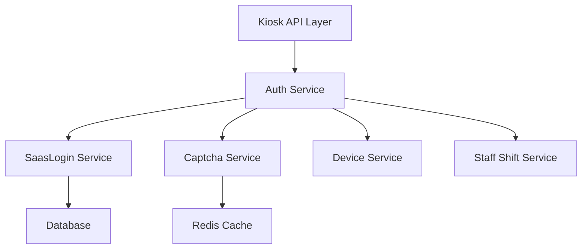

# Kiosk 自助点餐机登录认证功能 设计文档

> 本文档定义 Kiosk 自助点餐机登录认证功能的技术设计和实现方案。

## 📋 概述

实现自助点餐机终端的登录认证功能，使用商家员工账号登录（与 POS、Assistant、Tablet 等终端一致），支持邮箱/手机号登录、图形验证码验证、记住密码功能，确保设备安全启动。

**实现范围**：实现后端 API 接口，参考收银机（Cashier）、平板端（Tablet）、助手端（Assistant）的登录认证接口实现。

**技术栈**：Go (main/) + Gin 框架

---

## 🎯 规范对齐

### Go Main 规范 (go-main.mdc)

- Service 只依赖其他 Service 接口
- Repository 只持有 db 实例
- URL 使用 snake_case
- data 字段必须是对象
- 不使用 panic，返回 error
- 接口以 `I` 开头，实现以 `Impl` 结尾

### API 设计规范 (api.mdc)

- URL 使用 snake_case（如：`/kiosk/login`）
- 响应格式统一：`{code, message, data{}}`
- data 不能为 null 或数组
- 登录接口需要验证码 sign（X-SIGN header）

### 安全规范 (security.mdc)

- 所有 API 需要身份验证（除登录接口外）
- 登录接口需要验证码 sign（X-SIGN header）
- 密码加密传输（HTTPS）
- Token 安全存储
- 图形验证码防止暴力破解

---

## 🔄 代码复用分析

### 可复用的现有组件

- **统一认证服务**: `main/app/service/auth.go` - `IAuthSrv.SaasLogin()` 方法
- **验证码服务**: `main/app/service/captcha.go` - `ICaptchaSrv` 接口
- **认证中间件**: `main/middleware/auth.go` - `Auth()` 中间件
- **收银机认证实现**: `main/app/api/v1/cashier/cashier_auth.go` - 参考登录、刷新Token、退出登录实现
- **平板端认证实现**: `main/app/api/v1/tablet/tablet_auth.go` - 参考登录、刷新Token、退出登录实现
- **助手端认证实现**: `main/app/api/v1/assistant/assistant_auth.go` - 参考登录、刷新Token、退出登录实现

### 集成点

- **统一认证服务**: 使用 `authSrv.SaasLogin()` 进行登录认证
- **Token 刷新**: 使用 `authSrv.RefreshToken()` 刷新 Token
- **退出登录**: 使用 `authSrv.Logout()` 退出登录
- **Source 常量**: 需要在 `main/app/constant/jwt/jwt.go` 和 `main/app/constant/device.go` 中添加 `SourceKiosk` 常量

---

## 🏗️ 架构设计

### 分层设计原则

**Go Main 三层架构**:

```
API 层 (Controller/API)
  ↓ 依赖
业务层 (Service)
  ↓ 依赖
数据层 (Repository)
```

**依赖规则**:

- ✅ 上层可依赖下层
- ❌ 禁止下层依赖上层
- ❌ 禁止跨层调用
- ❌ Service 不能依赖 Repository
- ✅ Service 可以依赖其他 Service 接口

### 架构图



### 模块划分

#### Go Main 模块

- **API 层**: `main/app/api/v1/kiosk/kiosk_auth.go` - 路由处理、参数校验
- **Service 层**: `main/app/service/auth.go` - 业务逻辑（复用现有服务）
- **常量定义**: `main/app/constant/jwt/jwt.go` - 添加 `SourceKiosk` 常量
- **常量定义**: `main/app/constant/device.go` - 添加 `SourceKiosk` 常量
- **DTO 层**: `main/app/dto/req/login_req.go` - 复用现有登录请求 DTO
- **DTO 层**: `main/app/dto/resp/login_resp.go` - 复用现有登录响应 DTO

---

## 🗄️ 数据库设计

### 数据表设计

**无需新增数据库表**，复用现有的员工账号和认证表：

- `ttpos_staff` - 员工表（已存在）
- `ttpos_staff_token` - 员工 Token 表（已存在）
- `ttpos_device` - 设备表（已存在）

---

## 📊 数据模型

### Go Model

**无需新增 Model**，复用现有的 Model：

- `main/app/model/staff.go` - 员工模型
- `main/app/model/staff_token.go` - 员工 Token 模型
- `main/app/model/device.go` - 设备模型

### DTO 定义

#### Request DTO

**复用现有 DTO**：

```go
// main/app/dto/req/login_req.go
type LoginReq struct {
    Account  string `json:"account" binding:"required"`  // 账号（邮箱/手机号）
    Password string `json:"password" binding:"required"` // 密码
    Sign     string `json:"sign" binding:"required"`     // 验证码 sign
    Source   string `json:"source"`                      // 来源（由 API 设置）
}
```

#### Response DTO

**复用现有 DTO**：

```go
// main/app/dto/resp/login_resp.go
type LoginResp struct {
    Token        string `json:"token"`         // JWT Token
    RefreshToken string `json:"refresh_token"` // Refresh Token
}
```

---

## 🔌 API 设计

### RESTful API

#### API 1: 登录

**请求**:

- **URL**: `/api/v1/kiosk/login`
- **Method**: `POST`
- **Headers**:
  ```json
  {
    "X-SIGN": "{验证码sign}",
    "Content-Type": "application/json"
  }
  ```
- **Body**:
  ```json
  {
    "account": "user@example.com",
    "password": "password123",
    "sign": "captcha_sign"
  }
  ```

**响应**:

```json
{
  "code": 1,
  "message": "success",
  "data": {
    "token": "eyJhbGciOiJIUzI1NiIsInR5cCI6IkpXVCJ9...",
    "refresh_token": "eyJhbGciOiJIUzI1NiIsInR5cCI6IkpXVCJ9..."
  }
}
```

**错误响应**:

```json
{
  "code": 0,
  "message": "登录失败：账号或密码错误",
  "data": {}
}
```

#### API 2: 刷新 Token

**请求**:

- **URL**: `/api/v1/kiosk/refresh_token`
- **Method**: `GET`
- **Headers**:
  ```json
  {
    "Authorization": "Bearer {token}",
    "Content-Type": "application/json"
  }
  ```

**响应**:

```json
{
  "code": 1,
  "message": "success",
  "data": {
    "token": "eyJhbGciOiJIUzI1NiIsInR5cCI6IkpXVCJ9...",
    "refresh_token": "eyJhbGciOiJIUzI1NiIsInR5cCI6IkpXVCJ9..."
  }
}
```

#### API 3: 退出登录

**请求**:

- **URL**: `/api/v1/kiosk/logout`
- **Method**: `POST`
- **Headers**:
  ```json
  {
    "Authorization": "Bearer {token}",
    "Content-Type": "application/json"
  }
  ```

**响应**:

```json
{
  "code": 1,
  "message": "退出成功",
  "data": {}
}
```

---

## 🧩 组件和接口

### Service 层

**复用现有 Service**：

- **IAuthSrv**: `main/app/service/auth.go` - 统一认证服务
  - `SaasLogin(ctx, loginReq)` - 统一认证登录
  - `RefreshToken(ctx)` - 刷新 Token
  - `Logout(ctx)` - 退出登录

### API 层

```go
// main/app/api/v1/kiosk/kiosk_auth.go
package kiosk

import (
	"ttpos-server-go/app/api/helper"
	"ttpos-server-go/app/constant"
	"ttpos-server-go/app/dto/req"
	"ttpos-server-go/app/dto/resp"
	"ttpos-server-go/app/service"
	"ttpos-server-go/app/service/setting"
	"ttpos-server-go/middleware"
	"ttpos-server-go/pkg/cache"
	"ttpos-server-go/pkg/context"
	"ttpos-server-go/pkg/database"

	"github.com/gin-gonic/gin"
)

// AuthHandler 认证鉴权控制器
type AuthHandler struct {
	authSrv service.IAuthSrv
}

// Login 登录
// @Summary 登录
// @Description 登录
// @Tags 自助点餐机.认证
// @Accept json
// @Produce json
// @Param X-SIGN header string true "验证码sign"
// @param data body req.LoginReq true "登录参数"
// @Success 200 {object} dto.Response{data=resp.LoginResp}
// @Router /kiosk/login [post]
func (h *AuthHandler) Login(c *gin.Context) {
	ctx := helper.GetContext(c)
	var loginReq req.LoginReq
	if err := c.ShouldBindJSON(&loginReq); err != nil {
		helper.HandleValidationError(c, err, loginReq, req.LoginRequestMessage)
		return
	}
	loginReq.Source = constant.SourceKiosk

	var loginResp resp.LoginResp
	var err error

	// 版本判断：如果版本号 >= 2.11.0，使用统一认证登录
	if ctx.Version(context.GTE, constant.ClientVersionV2110) {
		loginResp, err = h.authSrv.SaasLogin(ctx, loginReq)
	} else {
		// 旧版本兼容，使用原有登录方法
		loginResp, err = h.authSrv.Login(ctx, loginReq)
	}

	if err != nil {
		helper.ErrorWithDetail(c, constant.CodeLoginFailed, err)
		return
	}
	helper.Success(c, loginResp)
}

// RefreshToken 刷新token
// @Summary 刷新token
// @Description 刷新token
// @Tags 自助点餐机.认证
// @Accept json
// @Produce json
// @Security JwtToken
// @Success 200 {object} dto.Response{data=resp.LoginResp}
// @Router /kiosk/refresh_token [get]
func (h *AuthHandler) RefreshToken(c *gin.Context) {
	ctx := helper.GetContext(c)
	loginResp, err := h.authSrv.RefreshToken(ctx)
	if err != nil {
		helper.ErrorWithDetail(c, constant.CodeLoginFailed, err)
		return
	}
	helper.Success(c, loginResp)
}

// Logout 退出登录
// @Summary 退出登录
// @Description 退出登录
// @Tags 自助点餐机.认证
// @Accept json
// @Produce json
// @Security JwtToken
// @Success 200 {object} dto.Response
// @Router /kiosk/logout [post]
func (h *AuthHandler) Logout(c *gin.Context) {
	ctx := helper.GetContext(c)
	err := h.authSrv.Logout(ctx)
	if err != nil {
		helper.ErrorWithDetail(c, constant.CodeSystemError, err)
		return
	}
	helper.Success(c, gin.H{}, "退出成功")
}

func RegisterAuthHandlers(router gin.IRouter, dbm *database.DBManager, cache cache.Cache) {
	// 初始化服务
	captchaSrv := service.NewCaptchaSrv(cache)
	settingSrv := setting.NewSrv(dbm, cache)
	roleAccessSrv := service.NewRoleAccessSrv(dbm)
	deviceSrv := service.NewDeviceSrv(settingSrv, dbm)
	cashBoxSrv := service.NewCashBoxSrv(dbm)
	statisticsSrv := service.NewStatisticsSrv()
	staffShiftSrv := service.NewStaffShiftSrv(cache, dbm, cashBoxSrv, statisticsSrv)
	authSrv := service.NewAuthSrv(dbm, captchaSrv, roleAccessSrv, deviceSrv, staffShiftSrv, settingSrv)

	wrapper := &AuthHandler{
		authSrv: authSrv,
	}

	publicApi := router.Group("")
	{
		publicApi.POST("/login", wrapper.Login) // 登录
	}

	// 需要认证
	privateApi := router.Group("", middleware.Auth(authSrv, dbm))
	{
		privateApi.GET("/refresh_token", wrapper.RefreshToken) // 刷新token
		privateApi.POST("/logout", wrapper.Logout)             // 退出登录
	}
}
```

---

## ⚡ 缓存设计

### Redis 缓存

**Token 缓存**:

- **Key 命名**: `ttpos:staff:token:{staff_uuid}`
- **过期时间**: 与 Token 过期时间一致
- **更新策略**: Token 刷新时更新缓存

**验证码缓存**:

- **Key 命名**: `ttpos:captcha:{sign}`
- **过期时间**: 5 分钟
- **更新策略**: 验证后删除

---

## 🚨 错误处理

### 错误场景

#### 场景 1: 登录失败（账号或密码错误）

- **处理方式**: 返回错误码 `CodeLoginFailed`，错误信息："登录失败：账号或密码错误"
- **用户影响**: 用户看到错误提示，需要重新输入
- **代码示例**:
  ```go
  if err != nil {
      helper.ErrorWithDetail(c, constant.CodeLoginFailed, err)
      return
  }
  ```

#### 场景 2: 验证码错误

- **处理方式**: 返回错误码 `CodeInvalidParam`，错误信息："验证码错误"
- **用户影响**: 用户看到错误提示，需要重新输入验证码

#### 场景 3: Token 过期

- **处理方式**: 中间件自动拦截，返回错误码 `CodeLoginFailed`，错误信息："Token 已过期"
- **用户影响**: 前端自动使用 RefreshToken 刷新，或提示重新登录

#### 场景 4: RefreshToken 过期

- **处理方式**: 返回错误码 `CodeLoginFailed`，错误信息："RefreshToken 已过期，请重新登录"
- **用户影响**: 用户需要重新登录

---

## 🔒 安全设计

### 身份验证

- **JWT Token**: 所有 API 需要 Token 验证（除登录接口外）
- **Token 刷新**: 自动刷新机制，使用 RefreshToken
- **验证码验证**: 登录接口需要验证码 sign（X-SIGN header）

### 权限控制

- **员工权限**: 使用统一认证服务验证员工身份
- **设备权限**: 验证设备是否授权

### 数据安全

- **密码加密**: 密码加密传输（HTTPS）
- **Token 安全**: Token 存储在 Redis，设置过期时间
- **验证码防护**: 图形验证码防止暴力破解

---

## 🧪 测试策略

### 单元测试

**目标覆盖率**:

- main/app/api/v1/kiosk: 70%+
- Service 层: 复用现有测试（已覆盖）

**测试内容**:

- API 接口调用
- 参数验证
- 错误处理
- Token 刷新逻辑

**示例**:

```go
// main/app/api/v1/kiosk/kiosk_auth_test.go
func TestKioskAuthHandler_Login(t *testing.T) {
    // 测试实现
}
```

### API 测试

**测试内容**:

- 登录接口调用
- Token 刷新接口调用
- 退出登录接口调用
- 参数验证
- 响应格式
- 错误处理

### 集成测试

**测试流程**:

- 端到端登录流程
- Token 刷新流程
- 退出登录流程
- 错误场景处理

---

## 📈 性能优化

### 优化策略

1. **数据库优化**:
   - 使用索引查询员工信息
   - 使用连接池

2. **缓存优化**:
   - Token 缓存到 Redis
   - 验证码缓存到 Redis

3. **接口优化**:
   - 登录接口响应时间 < 500ms
   - Token 刷新接口响应时间 < 200ms

### 性能指标

- 本地响应时间: < 200ms
- 登录接口响应时间: < 500ms
- Token 刷新接口响应时间: < 200ms
- 缓存命中率: > 80%

---

## 📚 实现清单

### Phase 1: 常量定义

- [ ] 在 `main/app/constant/jwt/jwt.go` 中添加 `SourceKiosk` 常量
- [ ] 在 `main/app/constant/device.go` 中添加 `SourceKiosk` 常量和文本映射

### Phase 2: API 实现

- [ ] 创建 `main/app/api/v1/kiosk/kiosk_auth.go` 文件
- [ ] 实现 `Login()` 方法
- [ ] 实现 `RefreshToken()` 方法
- [ ] 实现 `Logout()` 方法
- [ ] 实现 `RegisterAuthHandlers()` 方法

### Phase 3: 路由注册

- [ ] 在 `main/router/router.go` 中注册 Kiosk 路由组
- [ ] 调用 `kiosk.RegisterAuthHandlers()` 注册认证路由

### Phase 4: 测试

- [ ] 编写 API 单元测试
- [ ] 编写集成测试
- [ ] 测试登录流程
- [ ] 测试 Token 刷新流程
- [ ] 测试退出登录流程

**详细任务**: 参见 `tasks.md`

---

## Graphiti & 活动日志

- Related Episode: `[待补充]`
- 模板：`docs/agent/templates/graphiti-episode.md`
- 活动日志：`docs/team/activities/{YYYY-MM}/{YYYY-MM-DD}.md`
- 在技术方案评审、关键架构决策或踩坑总结后，立即补充 Episode 并在设计文档尾部互链。

---

**版本**: v1.0.0  
**创建日期**: 2025-12-17  
**作者**: xiezhihuan  
**审核者**: {审核者}

