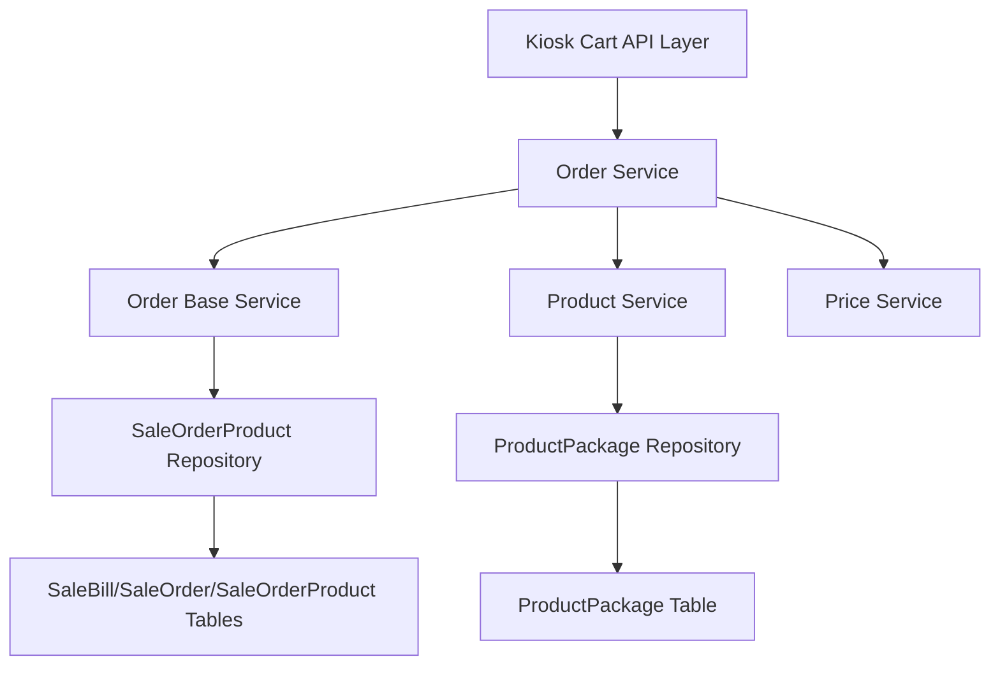

# Kiosk 自助点餐机购物车管理模块 设计文档

> 本文档定义 Kiosk 自助点餐机购物车管理模块的技术设计和实现方案。

## 📋 概述

实现 Kiosk 自助点餐机购物车管理模块，提供完整的购物车管理功能，包括购物车信息查询、商品/套餐添加、数量修改、商品删除、商品选购详情查看等核心能力。购物车管理是用户点餐流程的核心环节，确保顾客能够顺畅地管理已选商品，为后续的订单确认和支付流程提供基础。

**实现范围**：实现后端 API 接口，参考 POS 端即时点餐模块和点餐助手端的购物车管理接口实现，确保功能一致性和用户体验的统一性。

**技术栈**：Go (main/) + Gin 框架

**注意**：当前需求文档审核状态为「待审核」，本文档基于需求文档创建，待审核通过后开始开发。

---

## 🎯 规范对齐

### Go Main 规范 (go-main.mdc)

- Service 只依赖其他 Service 接口
- Repository 只持有 db 实例
- URL 使用 snake_case
- data 字段必须是对象
- 不使用 panic，返回 error
- 接口以 `I` 开头，实现以 `Impl` 结尾

### API 设计规范 (api.mdc)

- URL 使用 snake_case（如：`/api/v1/kiosk/order/cart/info`）
- 响应格式统一：`{code, message, data{}}`
- data 不能为 null 或数组
- 所有 API 需要身份验证（JWT Token）

### 数据库规范 (database.mdc)

- 复用现有订单相关表结构（SaleBill、SaleOrder、SaleOrderProduct 等）
- 不新增数据库表，使用现有表结构
- 时间字段使用 int 类型
- 金额字段使用 decimal(20,8)

### 安全规范 (security.mdc)

- 所有 API 需要身份验证（JWT Token）
- 验证用户权限（确保只能操作自己的订单）
- SQL 注入防护（使用参数化查询）
- 输入验证（商品数量、UUID 格式等）

---

## 🔄 代码复用分析

### 可复用的现有组件

- **订单服务**: `main/app/service/order.go` - `GetOrderCartInfo()`, `AddProductToCart()`, `AddProductPackageToCart()`, `UpdateProductNum()`, `DeleteProduct()` 等方法
- **订单基础服务**: `main/app/service/order_base.go` - `GetProductPackageDetail()` 方法，获取商品选购详情
- **订单商品仓储**: `main/app/repository/sale_order_product.go` - 订单商品数据访问方法
- **购物车响应 DTO**: `main/app/dto/resp/shop_cart.go` - `ShopCart`, `SaleOrder`, `SaleOrderProduct` 等响应结构体
- **POS 端购物车实现**: `main/app/api/v1/cashier/cashier_instant.go` - 参考 `OrderCartInfo()`, `OrderCartProductAdd()`, `OrderCartProductPackageAdd()`, `OrderCartProductNum()` 等实现
- **助手端商品选购详情**: `main/app/api/v1/assistant/assistant_order.go` - 参考 `GetProductPackageDetail()` 实现

### 集成点

- **购物车信息查询**: 复用 `orderSrv.GetOrderCartInfo()` 方法，参考 POS 端 `OrderCartInfo()` 的实现
- **商品添加**: 复用 `orderSrv.AddProductToCart()` 方法，参考 POS 端 `OrderCartProductAdd()` 的实现
- **套餐添加**: 复用 `orderSrv.AddProductPackageToCart()` 方法，参考 POS 端 `OrderCartProductPackageAdd()` 的实现
- **数量修改**: 复用 `orderSrv.UpdateProductNum()` 方法，参考 POS 端 `OrderCartProductNum()` 的实现
- **商品选购详情**: 复用 `orderSrv.GetProductPackageDetail()` 方法，参考助手端 `GetProductPackageDetail()` 的实现
- **商品删除**: 复用 `orderSrv.DeleteProduct()` 方法，参考 POS 端删除商品的实现
- **路由注册**: 在 `main/router/router.go` 中注册 Kiosk 购物车相关路由

---

## 🏗️ 架构设计

### 分层设计原则

**Go Main 三层架构**:

```
API 层 (Controller/API)
  ↓ 依赖
业务层 (Service)
  ↓ 依赖
数据层 (Repository)
```

**依赖规则**:

- ✅ 上层可依赖下层
- ❌ 禁止下层依赖上层
- ❌ 禁止跨层调用
- ❌ Service 不能依赖 Repository
- ✅ Service 可以依赖其他 Service 接口

### 架构图



### 模块划分

#### Go Main 模块

- **API 层**: `main/app/api/v1/kiosk/kiosk_order.go` - 购物车管理路由处理、参数校验
- **Service 层**: `main/app/service/order.go` - 复用现有购物车管理方法
- **Service 层**: `main/app/service/order_base.go` - 复用现有商品选购详情方法
- **Repository 层**: `main/app/repository/sale_order_product.go` - 复用现有订单商品仓储
- **DTO 层**: `main/app/dto/resp/shop_cart.go` - 复用现有购物车响应结构体
- **DTO 层**: `main/app/dto/req/shop_cart.go` - 复用现有购物车请求结构体

---

## 🗄️ 数据库设计

### 数据表设计

**无需新增数据库表**，复用现有的表：

- `ttpos_sale_bill` - 销售账单表（存储订单账单信息）
- `ttpos_sale_order` - 销售订单表（存储订单信息）
- `ttpos_sale_order_product` - 销售订单商品表（存储购物车商品信息）
- `ttpos_product_package` - 商品包表（存储商品信息）
- `ttpos_product_flavor` - 商品规格表（存储商品规格信息）
- `ttpos_product_attribute` - 商品属性表（存储商品属性信息）

---

## 📊 数据模型

### Go Model

**无需新增 Model**，复用现有的 Model：

- `main/app/model/sale_bill.go` - 销售账单模型
- `main/app/model/sale_order.go` - 销售订单模型
- `main/app/model/sale_order_product.go` - 销售订单商品模型
- `main/app/model/product_package.go` - 商品包模型

### DTO 定义

#### Request DTO

**复用现有 DTO**：

```go
// main/app/dto/req/shop_cart.go（已存在）
type OrderCartProductAddReq struct {
    SaleBillUuid  uint64          `json:"sale_bill_uuid" binding:"required"`
    SaleOrderUuid uint64          `json:"sale_order_uuid" binding:"required"`
    Products      []ProductParams `json:"products" binding:"required,min=1,dive"`
}

type OrderCartProductPackageAddReq struct {
    SaleBillUuid  uint64          `json:"sale_bill_uuid" binding:"required"`
    SaleOrderUuid uint64          `json:"sale_order_uuid" binding:"required"`
    ProductPackageUuid uint64     `json:"product_package_uuid" binding:"required"`
    ProductPackageGroups []ProductPackageGroup `json:"product_package_groups" binding:"required,min=1,dive"`
}

type OrderCartProductNumReq struct {
    SaleOrderProductUuid uint64 `json:"sale_order_product_uuid" binding:"required"`
    Num                  int    `json:"num" binding:"required,min=1"`
}

type GetProductPackageDetailReq struct {
    SaleBillUuid       uint64 `form:"sale_bill_uuid" binding:"required"`
    SaleOrderUuid      uint64 `form:"sale_order_uuid" binding:"required"`
    ProductPackageUuid uint64 `form:"product_package_uuid" binding:"required"`
}
```

#### Response DTO

**复用现有 DTO**：

```go
// main/app/dto/resp/shop_cart.go（已存在）
type ShopCart struct {
    SaleOrderList []SaleOrder `json:"sale_order_list"`
    TotalPrice    *decimal.Decimal `json:"total_price"`
    // ... 其他字段
}

type SaleOrder struct {
    Uuid         uint64 `json:"uuid"`
    SaleOrderProductList []SaleOrderProduct `json:"sale_order_product_list"`
    // ... 其他字段
}

type SaleOrderProduct struct {
    Uuid         uint64 `json:"uuid"`
    ProductPackageUuid uint64 `json:"product_package_uuid"`
    Num          int    `json:"num"`
    // ... 其他字段
}

// main/app/dto/resp/shop_cart.go（已存在）
type ProductPackageDetailRes struct {
    List []ProductPackageDetail `json:"list"`
}

type ProductPackageDetail struct {
    Uuid         uint64 `json:"uuid"`
    ProductPackageUuid uint64 `json:"product_package_uuid"`
    // ... 其他字段
}
```

---

## 🔌 API 设计

### RESTful API

#### API 1: 查询购物车信息

**请求**:

- **URL**: `/api/v1/kiosk/order/cart/info`
- **Method**: `GET`
- **Headers**:
  ```json
  {
    "Authorization": "Bearer {token}",
    "Content-Type": "application/json"
  }
  ```
- **Query Parameters**:
  - `sale_bill_uuid` (可选): 销售账单 UUID

**响应**:

```json
{
  "code": 1,
  "message": "success",
  "data": {
    "sale_order_list": [
      {
        "uuid": 123456,
        "sale_order_product_list": [
          {
            "uuid": 789012,
            "product_package_uuid": 345678,
            "num": 2,
            "price": "50.00"
          }
        ]
      }
    ],
    "total_price": "100.00"
  }
}
```

**错误响应**:

```json
{
  "code": 0,
  "message": "错误信息",
  "data": {}
}
```

#### API 2: 添加商品到购物车

**请求**:

- **URL**: `/api/v1/kiosk/order/cart/product/add`
- **Method**: `POST`
- **Body**:
  ```json
  {
    "sale_bill_uuid": 123456,
    "sale_order_uuid": 789012,
    "products": [
      {
        "product_package_uuid": 345678,
        "num": 1,
        "flavor_uuid": 111111,
        "attributes": [222222]
      }
    ]
  }
  ```

**响应**:

```json
{
  "code": 1,
  "message": "success",
  "data": {
    "sale_order_list": [...],
    "total_price": "100.00"
  }
}
```

#### API 3: 添加套餐到购物车

**请求**:

- **URL**: `/api/v1/kiosk/order/cart/product_package/add`
- **Method**: `POST`
- **Body**:
  ```json
  {
    "sale_bill_uuid": 123456,
    "sale_order_uuid": 789012,
    "product_package_uuid": 345678,
    "product_package_groups": [
      {
        "group_uuid": 111111,
        "products": [
          {
            "product_package_uuid": 222222,
            "num": 1
          }
        ]
      }
    ]
  }
  ```

**响应**:

```json
{
  "code": 1,
  "message": "success",
  "data": {
    "sale_order_list": [...],
    "total_price": "150.00"
  }
}
```

#### API 4: 修改商品数量

**请求**:

- **URL**: `/api/v1/kiosk/order/cart/product/num`
- **Method**: `POST`
- **Body**:
  ```json
  {
    "sale_order_product_uuid": 789012,
    "num": 3
  }
  ```

**响应**:

```json
{
  "code": 1,
  "message": "success",
  "data": {
    "sale_order_list": [...],
    "total_price": "150.00"
  }
}
```

#### API 5: 获取商品选购详情

**请求**:

- **URL**: `/api/v1/kiosk/order/product/package/detail`
- **Method**: `GET`
- **Query Parameters**:
  - `sale_bill_uuid`: 销售账单 UUID
  - `sale_order_uuid`: 销售订单 UUID
  - `product_package_uuid`: 商品包 UUID

**响应**:

```json
{
  "code": 1,
  "message": "success",
  "data": {
    "list": [
      {
        "uuid": 789012,
        "product_package_uuid": 345678,
        "num": 2,
        "flavor_name": "中份",
        "attributes": ["加糖", "加冰"]
      }
    ]
  }
}
```

#### API 6: 删除购物车商品

**请求**:

- **URL**: `/api/v1/kiosk/order/cart/product/delete`
- **Method**: `DELETE`
- **Query Parameters**:
  - `sale_order_product_uuid`: 销售订单商品 UUID

**响应**:

```json
{
  "code": 1,
  "message": "success",
  "data": {
    "sale_order_list": [...],
    "total_price": "50.00"
  }
}
```

---

## 🧩 组件和接口

### Service 层

**复用现有 Service**：

- `main/app/service/order.go` - `IOrderSrv` 接口
  - `GetOrderCartInfo()` - 获取购物车信息
  - `AddProductToCart()` - 添加商品到购物车
  - `AddProductPackageToCart()` - 添加套餐到购物车
  - `UpdateProductNum()` - 修改商品数量
  - `DeleteProduct()` - 删除商品

- `main/app/service/order_base.go` - `IOrderBaseSrv` 接口
  - `GetProductPackageDetail()` - 获取商品选购详情

### Repository 层

**复用现有 Repository**：

- `main/app/repository/sale_order_product.go` - `ISaleOrderProductRepo` 接口
  - 订单商品数据访问方法

### API 层

```go
// main/app/api/v1/kiosk/kiosk_order.go
type OrderHandler struct {
    orderSrv service.IOrderSrv
    orderBaseSrv service.IOrderBaseSrv
}

func NewOrderHandler(
    orderSrv service.IOrderSrv,
    orderBaseSrv service.IOrderBaseSrv,
) *OrderHandler {
    return &OrderHandler{
        orderSrv: orderSrv,
        orderBaseSrv: orderBaseSrv,
    }
}

// GET /api/v1/kiosk/order/cart/info
func (h *OrderHandler) GetCartInfo(c *gin.Context) {
    // 实现购物车信息查询
}

// POST /api/v1/kiosk/order/cart/product/add
func (h *OrderHandler) AddProduct(c *gin.Context) {
    // 实现商品添加
}

// POST /api/v1/kiosk/order/cart/product_package/add
func (h *OrderHandler) AddProductPackage(c *gin.Context) {
    // 实现套餐添加
}

// POST /api/v1/kiosk/order/cart/product/num
func (h *OrderHandler) UpdateProductNum(c *gin.Context) {
    // 实现数量修改
}

// GET /api/v1/kiosk/order/product/package/detail
func (h *OrderHandler) GetProductPackageDetail(c *gin.Context) {
    // 实现商品选购详情查询
}

// DELETE /api/v1/kiosk/order/cart/product/delete
func (h *OrderHandler) DeleteProduct(c *gin.Context) {
    // 实现商品删除
}
```

---

## ⚡ 缓存设计

### Redis 缓存

**缓存策略**:

- **Key 命名**: `ttpos:kiosk:cart:{sale_bill_uuid}`
- **过期时间**: 5 分钟
- **更新策略**: Cache-Aside Pattern

**示例**:

```go
// 缓存购物车信息
key := fmt.Sprintf("ttpos:kiosk:cart:%d", saleBillUuid)
cached, err := redis.Get(key)
if err == nil {
    // 缓存命中
    return cached
}

// 缓存未命中，查询数据库
cartInfo, err := orderSrv.GetOrderCartInfo(ctx, saleBillUuid)
if err != nil {
    return err
}

// 写入缓存
redis.Set(key, cartInfo, 5*time.Minute)
return cartInfo
```

---

## 🚨 错误处理

### 错误场景

#### 场景 1: 购物车不存在

- **处理方式**: 返回空购物车信息
- **用户影响**: 显示空购物车提示
- **代码示例**:
  ```go
  cartInfo, err := orderSrv.GetOrderCartInfo(ctx, saleBillUuid)
  if err != nil {
      if utils.IsNotFoundRecord(err) {
          return &resp.ShopCart{SaleOrderList: []resp.SaleOrder{}}, nil
      }
      return nil, errors.WithMessage(err, "查询购物车失败")
  }
  ```

#### 场景 2: 商品不存在或已下架

- **处理方式**: 返回错误提示
- **用户影响**: 显示"商品不存在或已下架"提示
- **代码示例**:
  ```go
  product, err := productSrv.GetProductDetail(ctx, productPackageUuid)
  if err != nil {
      return nil, errors.WithMessage(err, "商品不存在")
  }
  if product.Status != constant.ProductStatusOnSale {
      return nil, errors.New("商品已下架")
  }
  ```

#### 场景 3: 数量超出限制

- **处理方式**: 返回错误提示
- **用户影响**: 显示"数量超出限制"提示

---

## 🔒 安全设计

### 身份验证

- **JWT Token**: 所有 API 需要 Token 验证
- **Token 刷新**: 自动刷新机制

### 权限控制

- **订单归属验证**: 确保用户只能操作自己的订单
- **设备验证**: 确保订单属于当前设备

### 数据安全

- **敏感数据加密**: 价格、订单信息等
- **SQL 注入防护**: 使用参数化查询
- **输入验证**: 商品数量、UUID 格式等

---

## 🧪 测试策略

### 单元测试

**目标覆盖率**:

- main/app/service: 70%+
- main/app/repository: 80%+
- **Order 相关: 100%**（高风险）

**测试内容**:

- Service 业务逻辑
- Repository 数据访问
- DTO 数据转换

### API 测试

**测试内容**:

- API 接口调用
- 参数验证
- 响应格式
- 错误处理

### 集成测试

**测试流程**:

- 端到端业务流程（添加商品 → 修改数量 → 删除商品 → 查看详情）
- 数据库事务
- 缓存一致性

---

## 📈 性能优化

### 优化策略

1. **数据库优化**:
   - 使用索引（sale_bill_uuid, sale_order_uuid, sale_order_product_uuid）
   - 优化 SQL 查询
   - 使用连接池

2. **缓存优化**:
   - Redis 缓存购物车信息
   - 缓存预热
   - 缓存穿透防护

3. **并发控制**:
   - UUID 锁防止并发冲突
   - 事务隔离级别

### 性能指标

- 本地响应时间: < 200ms
- 数据库查询: < 50ms
- 缓存命中率: > 80%
- 并发能力: 1000+ QPS

---

## 📚 实现清单

### Phase 1: API 层实现

- [ ] 创建 Order Handler
- [ ] 实现购物车信息查询 API
- [ ] 实现商品添加 API
- [ ] 实现套餐添加 API
- [ ] 实现数量修改 API
- [ ] 实现商品选购详情 API
- [ ] 实现商品删除 API

### Phase 2: 路由注册

- [ ] 注册购物车相关路由

### Phase 3: 测试和优化

- [ ] 单元测试
- [ ] API 测试
- [ ] 集成测试
- [ ] 性能优化

**详细任务**: 参见 `tasks.md`

---

## Graphiti & 活动日志

- Related Episode: `[待补充]`
- 模板：`docs/agent/templates/graphiti-episode.md`
- 活动日志：`docs/team/activities/{YYYY-MM}/{YYYY-MM-DD}.md`
- 在技术方案评审、关键架构决策或踩坑总结后，立即补充 Episode 并在设计文档尾部互链。

---

**版本**: v1.0.0  
**创建日期**: 2025-12-18  
**作者**: 开发团队  
**审核者**: {审核者}

