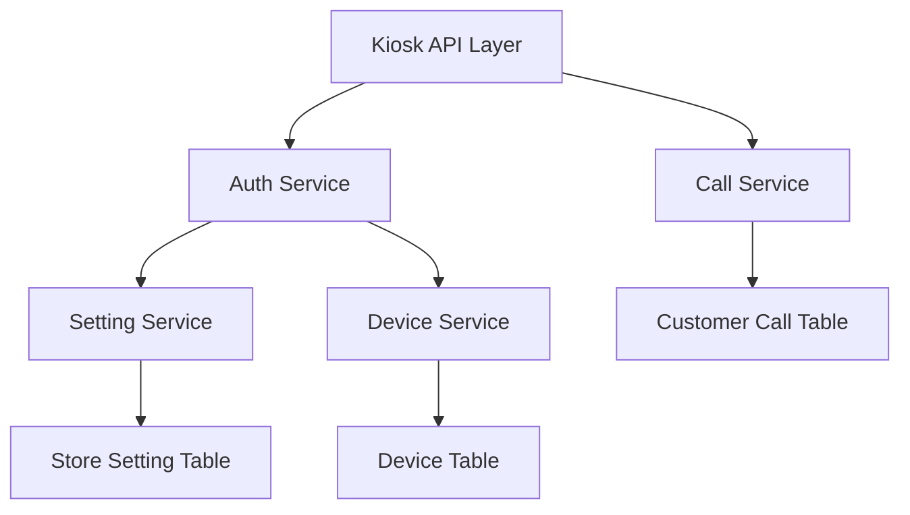

# Kiosk 自助点餐机首页功能模块 设计文档

> 本文档定义 Kiosk 自助点餐机首页功能模块的技术设计和实现方案。

## 📋 概述

实现 Kiosk 自助点餐机首页功能模块，提供统一的首页入口，包含轮播广告展示、用餐方式选择、多语言切换、呼叫服务员等核心功能。首页作为用户登录后的第一个界面，需要提供清晰的信息展示和操作引导。

**实现范围**：实现后端 API 接口，参考收银机（Cashier）、平板端（Tablet）、助手端（Assistant）等终端的 base 接口和呼叫服务员接口实现。

**技术栈**：Go (main/) + Gin 框架

**注意**：当前需求文档审核状态为「待审核」，本文档基于需求文档创建，待审核通过后开始开发。

---

## 🎯 规范对齐

### Go Main 规范 (go-main.mdc)

- Service 只依赖其他 Service 接口
- Repository 只持有 db 实例
- URL 使用 snake_case
- data 字段必须是对象
- 不使用 panic，返回 error
- 接口以 `I` 开头，实现以 `Impl` 结尾

### API 设计规范 (api.mdc)

- URL 使用 snake_case（如：`/api/v1/kiosk/base`）
- 响应格式统一：`{code, message, data{}}`
- data 不能为 null 或数组
- 所有 API 需要身份验证（JWT Token）

### 安全规范 (security.mdc)

- 所有 API 需要身份验证（JWT Token）
- 敏感数据加密存储
- SQL 注入防护（使用参数化查询）

---

## 🔄 代码复用分析

### 可复用的现有组件

- **认证服务 Base 方法**: `main/app/service/auth.go` - `CashierBase()`, `TabletBase()`, `AssistantBase()`, `KitchenBase()` 方法
- **设置服务**: `main/app/service/setting/setting.go` - `GetKioskSetting()` 方法，获取自助点餐机设置（包含语言列表、轮播广告）
- **呼叫服务**: `main/app/service/call.go` - `ICallSrv.Call()` 方法，发起呼叫服务员
- **设备服务**: `main/app/service/device.go` - `IDeviceSrv.GetRemark()` 方法，获取设备备注
- **收银机 Base 实现**: `main/app/api/v1/cashier/cashier_base.go` - 参考 `GetBase()` 实现
- **平板端 Base 实现**: `main/app/api/v1/tablet/tablet_base.go` - 参考 `GetBase()` 实现
- **平板端呼叫实现**: `main/app/api/v1/tablet/tablet_call.go` - 参考 `Call()` 实现
- **H5 端呼叫实现**: `main/app/api/v1/h5/h5_handler.go` - 参考呼叫实现

### 集成点

- **Base 接口**: 在 `main/app/service/auth.go` 中添加 `KioskBase()` 方法，参考 `CashierBase()`, `TabletBase()` 实现
- **呼叫接口**: 复用 `main/app/service/call.go` 的 `Call()` 方法，参考 `tablet/call.go` 的实现
- **设置获取**: 使用 `settingSrv.GetKioskSetting()` 获取自助点餐机设置（语言列表、轮播广告）
- **设备信息**: 使用 `deviceSrv.GetRemark()` 获取设备备注
- **路由注册**: 在 `main/router/router.go` 中注册 `/kiosk/base` 和 `/kiosk/call` 路由

---

## 🏗️ 架构设计

### 分层设计原则

**Go Main 三层架构**:

```
API 层 (Controller/API)
  ↓ 依赖
业务层 (Service)
  ↓ 依赖
数据层 (Repository)
```

**依赖规则**:

- ✅ 上层可依赖下层
- ❌ 禁止下层依赖上层
- ❌ 禁止跨层调用
- ❌ Service 不能依赖 Repository
- ✅ Service 可以依赖其他 Service 接口

### 架构图



### 模块划分

#### Go Main 模块

- **API 层**: `main/app/api/v1/kiosk/kiosk_base.go` - 路由处理、参数校验
- **API 层**: `main/app/api/v1/kiosk/kiosk_call.go` - 呼叫服务员接口
- **Service 层**: `main/app/service/auth.go` - 添加 `KioskBase()` 方法
- **Service 层**: `main/app/service/call.go` - 复用现有 `Call()` 方法
- **DTO 层**: `main/app/dto/resp/base.go` - 添加 `KioskBase` 响应结构体
- **DTO 层**: `main/app/dto/req/call_req.go` - 复用现有 `CallReq` 请求结构体

---

## 🗄️ 数据库设计

### 数据表设计

**无需新增数据库表**，复用现有的表：

- `ttpos_store_setting` - 门店设置表（key = "kiosk"，存储自助点餐机设置）
- `ttpos_device` - 设备表（存储设备信息）
- `ttpos_company` - 商家表（存储商家信息）
- `ttpos_customer_call` - 顾客呼叫表（存储呼叫记录）

---

## 📊 数据模型

### Go Model

**无需新增 Model**，复用现有的 Model：

- `main/app/model/store_setting.go` - 门店设置模型
- `main/app/model/device.go` - 设备模型
- `main/app/model/company.go` - 商家模型
- `main/app/model/customer_call.go` - 顾客呼叫模型

### DTO 定义

#### Request DTO

**复用现有 DTO**：

```go
// main/app/dto/req/call_req.go（已存在）
type CallReq struct {
    CallType int `json:"call_type" binding:"required"` // 呼叫类型（1-服务员，2-结账）
}
```

#### Response DTO

**新增 KioskBase 响应结构体**：

```go
// main/app/dto/resp/base.go
type KioskBase struct {
    Username      string              `json:"username"`       // 登录账号
    DeviceId      string              `json:"device_id"`      // 设备ID
    DeviceRemark  string              `json:"device_remark"`  // 设备备注
    Company       Company             `json:"company"`        // 商家信息
    Currency      setting.Currency    `json:"currency"`       // 货币单位
    Business      setting.Business    `json:"business"`       // 门店业务设置
    Kiosk         setting.KioskResp  `json:"kiosk"`         // 自助点餐机设置（包含语言列表、轮播广告）
    UpdateTime    int64               `json:"update_time"`    // 更新时间
    
    // 关联的门店列表
    CompanyList []*CompanyStaffResp `json:"company_list,omitempty"`
}
```

---

## 🔌 API 设计

### RESTful API

#### API 1: 获取首页基本信息

**请求**:

- **URL**: `/api/v1/kiosk/base`
- **Method**: `GET`
- **Headers**:
  ```json
  {
    "Authorization": "Bearer {token}",
    "Content-Type": "application/json"
  }
  ```

**响应**:

```json
{
  "code": 1,
  "message": "success",
  "data": {
    "username": "user@example.com",
    "device_id": "device123",
    "device_remark": "1号自助点餐机",
    "company": {
      "uuid": 123456,
      "name": "测试餐厅",
      "logo": "https://example.com/logo.png",
      "time_zone": "Asia/Shanghai"
    },
    "currency": {
      "code": "CNY",
      "symbol": "¥"
    },
    "business": {
      "is_open_member": 1,
      "is_open_buffet": 0
    },
    "kiosk": {
      "language_list": [
        {"code": "zh-CN", "name": "简体中文"},
        {"code": "zh-TW", "name": "繁体中文"},
        {"code": "en", "name": "English"}
      ],
      "default_language": "zh-CN",
      "carousel": [
        {
          "type": "image",
          "url": "https://example.com/image1.jpg",
          "sort": 1
        },
        {
          "type": "video",
          "url": "https://example.com/video1.mp4",
          "sort": 2
        }
      ]
    },
    "update_time": 1703001600
  }
}
```

**错误响应**:

```json
{
  "code": 0,
  "message": "获取首页信息失败：配置不存在",
  "data": {}
}
```

#### API 2: 呼叫服务员

**请求**:

- **URL**: `/api/v1/kiosk/call`
- **Method**: `POST`
- **Headers**:
  ```json
  {
    "Authorization": "Bearer {token}",
    "Content-Type": "application/json"
  }
  ```
- **Body**:
  ```json
  {
    "call_type": 1
  }
  ```
  - `call_type`: 呼叫类型（1-服务员，2-结账）

**响应**:

```json
{
  "code": 1,
  "message": "已呼叫服务员，请稍等",
  "data": {}
}
```

**错误响应**:

```json
{
  "code": 0,
  "message": "呼叫失败：桌台不存在",
  "data": {}
}
```

---

## 🧩 组件和接口

### Service 层

#### Auth Service - KioskBase 方法

**新增方法**：

```go
// main/app/service/auth.go
// KioskBase 获取自助点餐机基本信息
func (s *authSrv) KioskBase(ctx context.Context) (resp.KioskBase, error) {
    var kioskBase resp.KioskBase

    // 如果 company_uuid 为 0，只返回可用门店列表
    if ctx.GetCompanyUuid() == 0 {
        kioskBase.CompanyList = s.getCompanyList(ctx)
        return kioskBase, nil
    }

    // company_uuid 不为 0，走原有逻辑
    company := ctx.GetCompany()
    companySetting := ctx.GetCompanySetting()
    staff := ctx.GetStaff()
    var (
        source    = ctx.GetSource()
        deviceId  = ctx.GetGin().GetString(jwt.DeviceId)
    )
    deviceRemark := s.deviceSrv.GetRemark(company.Uuid, source, deviceId)
    
    // 获取自助点餐机设置（包含语言列表、轮播广告）
    kioskSetting, err := s.settingSrv.GetKioskSetting(ctx)
    if err != nil {
        return kioskBase, errors.WithMessage(err)
    }
    
    currencySetting, err := s.settingSrv.GetCurrencySetting(ctx)
    if err != nil {
        return kioskBase, errors.WithMessage(err)
    }
    
    businessSetting, err := s.settingSrv.GetBusinessSetting(ctx)
    if err != nil {
        return kioskBase, errors.WithMessage(err)
    }
    
    cloudBasicSetting, err := s.settingSrv.GetCloudBasicSetting(ctx)
    if err != nil {
        return kioskBase, errors.WithMessage(err)
    }
    
    return resp.KioskBase{
        Username:     staff.Username,
        DeviceId:     deviceId,
        DeviceRemark: deviceRemark,
        Company: resp.Company{
            Uuid:       company.Uuid,
            Name:       company.Name,
            Logo:       utils.AddImageDomain(company.Logo, utils.GetBaseURL(ctx.GetGin().Request), true),
            TimeZone:   companySetting.Timezone,
            ExpireTime: company.ExpireTime,
        },
        Currency:   currencySetting,
        Business:   businessSetting,
        Kiosk:      kioskSetting.KioskResp,
        UpdateTime: time.Now().Unix(),
        CompanyList: s.getCompanyList(ctx),
    }, nil
}
```

#### Call Service - 复用现有方法

**复用现有方法**：

```go
// main/app/service/call.go（已存在）
// Call 发起呼叫
func (s *callSrv) Call(ctx context.Context, callReq req.CallReq) error {
    // 复用现有实现，参考 tablet/call.go 的调用方式
    // 注意：Kiosk 终端可能没有 deskUuid，需要特殊处理
}
```

### API 层

#### Base Handler

```go
// main/app/api/v1/kiosk/kiosk_base.go
package kiosk

import (
    "ttpos-server-go/app/api/helper"
    "ttpos-server-go/app/constant"
    "ttpos-server-go/app/errors"
    "ttpos-server-go/app/service"
    "ttpos-server-go/app/service/setting"
    "ttpos-server-go/middleware"
    "ttpos-server-go/pkg/cache"
    "ttpos-server-go/pkg/database"
    
    "github.com/gin-gonic/gin"
)

// BaseHandler 基础相关控制器
type BaseHandler struct {
    authSrv    service.IAuthSrv
    settingSrv setting.ISrv
    deviceSrv  service.IDeviceSrv
}

// GetBase 基本信息
// @Summary 基本信息
// @Description 获取自助点餐机首页基本信息
// @Tags 自助点餐机.基础信息
// @Accept json
// @Produce json
// @Security JwtToken
// @Success 200 {object} dto.Response{data=resp.KioskBase}
// @Router /kiosk/base [get]
func (h *BaseHandler) GetBase(c *gin.Context) {
    ctx := helper.GetContext(c)
    info, err := h.authSrv.KioskBase(ctx)
    if err != nil {
        helper.ErrorWithDetail(c, constant.CodeFail, errors.WithMessage(err))
        return
    }
    helper.Success(c, info)
}

func RegisterBaseHandlers(router gin.IRouter, dbm *database.DBManager, cache cache.Cache) {
    // 初始化服务
    captchaSrv := service.NewCaptchaSrv(cache)
    settingSrv := setting.NewSrv(dbm, cache)
    roleAccessSrv := service.NewRoleAccessSrv(dbm)
    deviceSrv := service.NewDeviceSrv(settingSrv, dbm)
    cashBoxSrv := service.NewCashBoxSrv(dbm)
    statisticsSrv := service.NewStatisticsSrv()
    staffShiftSrv := service.NewStaffShiftSrv(cache, dbm, cashBoxSrv, statisticsSrv)
    authSrv := service.NewAuthSrv(dbm, captchaSrv, roleAccessSrv, deviceSrv, staffShiftSrv, settingSrv)

    wrapper := &BaseHandler{
        authSrv:    authSrv,
        settingSrv: settingSrv,
        deviceSrv:  deviceSrv,
    }

    // 需要认证
    privateApi := router.Group("", middleware.Auth(authSrv, dbm))
    {
        privateApi.GET("/base", wrapper.GetBase) // 获取基本信息
    }
}
```

#### Call Handler

```go
// main/app/api/v1/kiosk/kiosk_call.go
package kiosk

import (
    "ttpos-server-go/app/api/helper"
    "ttpos-server-go/app/constant"
    "ttpos-server-go/app/dto/req"
    "ttpos-server-go/app/errors"
    "ttpos-server-go/app/service"
    "ttpos-server-go/app/service/setting"
    "ttpos-server-go/middleware"
    "ttpos-server-go/pkg/cache"
    "ttpos-server-go/pkg/database"
    
    "github.com/gin-gonic/gin"
)

// CallHandler 呼叫相关控制器
type CallHandler struct {
    callSrv service.ICallSrv
}

// Call 发起呼叫
// @Summary 发起呼叫
// @Description 发起呼叫服务员
// @Tags 自助点餐机.呼叫
// @Accept json
// @Produce json
// @Security JwtToken
// @Param data body req.CallReq true "呼叫请求"
// @Success 200 {object} dto.Response
// @Router /kiosk/call [post]
func (h *CallHandler) Call(c *gin.Context) {
    var callReq req.CallReq
    if err := c.ShouldBindJSON(&callReq); err != nil {
        helper.HandleValidationError(c, err, callReq, nil)
        return
    }
    err := h.callSrv.Call(helper.GetContext(c), callReq)
    if err != nil {
        helper.ErrorWithDetail(c, constant.CodeFail, errors.WithMessage(err))
        return
    }
    helper.Success(c, gin.H{}, "已呼叫服务员，请稍等")
}

func RegisterCallHandlers(router gin.IRouter, dbm *database.DBManager, cache cache.Cache) {
    // 初始化服务
    captchaSrv := service.NewCaptchaSrv(cache)
    settingSrv := setting.NewSrv(dbm, cache)
    roleAccessSrv := service.NewRoleAccessSrv(dbm)
    deviceSrv := service.NewDeviceSrv(settingSrv, dbm)
    cashBoxSrv := service.NewCashBoxSrv(dbm)
    statisticsSrv := service.NewStatisticsSrv()
    staffShiftSrv := service.NewStaffShiftSrv(cache, dbm, cashBoxSrv, statisticsSrv)
    authSrv := service.NewAuthSrv(dbm, captchaSrv, roleAccessSrv, deviceSrv, staffShiftSrv, settingSrv)

    // 初始化处理器
    wrapper := CallHandler{
        callSrv: service.NewCallSrv(dbm),
    }

    // 需要认证
    privateApi := router.Group("", middleware.Auth(authSrv, dbm))
    {
        privateApi.POST("/call", wrapper.Call) // 呼叫
    }
}
```

---

## ⚡ 缓存设计

### Redis 缓存

**缓存策略**:

- **Key 命名**: `ttpos:kiosk:base:{company_uuid}:{device_id}`
- **过期时间**: 5 分钟
- **更新策略**: Cache-Aside Pattern

**实现**:

```go
// 在 Service 层实现缓存
key := fmt.Sprintf("ttpos:kiosk:base:%d:%s", companyUuid, deviceId)
cached, err := cache.Get(key)
if err == nil {
    // 缓存命中
    return cached
}

// 缓存未命中，查询数据库
data, err := s.getKioskBaseData(ctx)
if err != nil {
    return err
}

// 写入缓存
cache.Set(key, data, 5*time.Minute)
return data
```

---

## 🚨 错误处理

### 错误场景

#### 场景 1: 配置获取失败

- **处理方式**: 返回友好错误提示，支持使用默认配置
- **用户影响**: 显示错误提示，但系统仍可使用
- **代码示例**:
  ```go
  kioskSetting, err := s.settingSrv.GetKioskSetting(ctx)
  if err != nil {
      // 使用默认配置
      kioskSetting = s.getDefaultKioskSetting()
      logger.Logger.Warn("获取自助点餐机设置失败，使用默认配置", zap.Error(err))
  }
  ```

#### 场景 2: 呼叫服务员失败

- **处理方式**: 返回友好错误提示，支持重试
- **用户影响**: 显示错误提示，提示用户重试或联系工作人员
- **代码示例**:
  ```go
  err := h.callSrv.Call(ctx, callReq)
  if err != nil {
      logger.Logger.Error("呼叫服务员失败", zap.Error(err))
      return errors.WithMessage(err, "呼叫失败，请稍后重试")
  }
  ```

---

## 🔒 安全设计

### 身份验证

- **JWT Token**: 所有 API 需要 Token 验证
- **Token 刷新**: 自动刷新机制

### 权限控制

- **设备权限**: 验证设备是否属于当前商家
- **员工权限**: 验证员工是否有权限使用自助点餐机

### 数据安全

- **敏感数据加密**: 密码、支付信息等加密存储
- **SQL 注入防护**: 使用参数化查询

---

## 🧪 测试策略

### 单元测试

**目标覆盖率**:

- main/app/service: 70%+
- main/app/api: 80%+

**测试内容**:

- Service 业务逻辑（KioskBase 方法）
- API 接口调用
- 错误处理

### API 测试

**测试内容**:

- API 接口调用
- 参数验证
- 响应格式
- 错误处理

### 集成测试

**测试流程**:

- 端到端业务流程（获取首页信息、呼叫服务员）
- 配置缓存一致性
- 错误场景处理

---

## 📈 性能优化

### 优化策略

1. **数据库优化**:
   - 使用索引查询
   - 避免 N+1 查询

2. **缓存优化**:
   - Redis 缓存配置信息
   - 缓存预热
   - 缓存穿透防护

3. **接口优化**:
   - 批量获取配置
   - 减少数据库查询次数

### 性能指标

- 本地响应时间: < 200ms
- 数据库查询: < 50ms
- 缓存命中率: > 80%

---

## 📚 实现清单

### Phase 1: DTO 和 Service 层

- [ ] 创建 `KioskBase` 响应 DTO
- [ ] 在 `auth.go` 中实现 `KioskBase()` 方法
- [ ] 实现配置缓存机制

### Phase 2: API 层

- [ ] 创建 `kiosk_base.go` API 文件
- [ ] 创建 `kiosk_call.go` API 文件
- [ ] 注册路由

### Phase 3: 测试和优化

- [ ] 单元测试
- [ ] API 测试
- [ ] 集成测试
- [ ] 性能优化

**详细任务**: 参见 `tasks.md`

---

## Graphiti & 活动日志

- Related Episode: `[待补充]`
- 模板：`docs/agent/templates/graphiti-episode.md`
- 活动日志：`docs/team/activities/{user}/{YYYY-MM}/{YYYY-MM-DD}.md`
- 在技术方案评审、关键架构决策或踩坑总结后，立即补充 Episode 并在设计文档尾部互链。

---

**版本**: v1.0.0  
**创建日期**: 2025-12-18  
**作者**: xiezhihuan  
**审核者**: {审核者}

