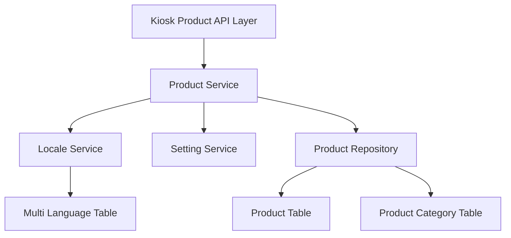

# Kiosk 自助点餐机商品浏览模块 设计文档

> 本文档定义 Kiosk 自助点餐机商品浏览模块的技术设计和实现方案。

## 📋 概述

实现 Kiosk 自助点餐机商品浏览模块，提供商品分类列表、商品列表、商品详情等核心功能。商品浏览模块作为用户点餐流程的重要环节，需要提供清晰的商品展示和便捷的浏览体验。

**实现范围**：实现后端 API 接口，复用现有的商品服务（IProductSrv），参考平板端（Tablet）、会员端（Member）等终端的商品接口实现。

**技术栈**：Go (main/) + Gin 框架

**注意**：当前需求文档审核状态为「待审核」，本文档基于需求文档创建，待审核通过后开始开发。

---

## 🎯 规范对齐

### Go Main 规范 (go-main.mdc)

- Service 只依赖其他 Service 接口
- Repository 只持有 db 实例
- URL 使用 snake_case
- data 字段必须是对象
- 不使用 panic，返回 error
- 接口以 `I` 开头，实现以 `Impl` 结尾

### API 设计规范 (api.mdc)

- URL 使用 snake_case（如：`/api/v1/kiosk/product/category/list`）
- 响应格式统一：`{code, message, data{}}`
- data 不能为 null 或数组
- 分页信息统一放在 meta 中
- 所有 API 需要身份验证（JWT Token）

### 数据库规范 (database.mdc)

- 复用现有商品表（`ttpos_product`、`ttpos_product_category` 等）
- 不需要新增表结构
- 时间字段使用 int 类型

---

## 🔄 代码复用分析

### 可复用的现有组件

- **商品服务**: `main/app/service/product.go` - `IProductSrv` 接口，包含：
  - `GetProductCategoryList(dbId uint64)` - 获取商品分类列表
  - `GetProductList(ctx context.Context, req req.ProductListReq)` - 获取商品列表
  - `GetProductDetail(ctx context.Context, req req.ProductDetailReq)` - 获取商品详情
- **多语言服务**: `main/app/service/locale.go` - `ILocaleSrv` 接口，处理多语言名称
- **设置服务**: `main/app/service/setting/setting.go` - `ISrv` 接口，获取设置信息
- **平板端商品实现**: `main/app/api/v1/tablet/tablet_product.go` - 参考 `GetProductCategoryList()` 和 `GetProductList()` 实现
- **会员端商品实现**: `main/app/api/v1/member/member_product.go` - 参考 `GetProductDetail()` 实现

### 集成点

- **商品分类接口**: 在 `main/app/api/v1/kiosk/kiosk_product.go` 中创建 `GetProductCategoryList()` 方法，调用 `productSrv.GetProductCategoryList()`
- **商品列表接口**: 在 `main/app/api/v1/kiosk/kiosk_product.go` 中创建 `GetProductList()` 方法，调用 `productSrv.GetProductList()`，需要设置 `sourceMap` 支持 Kiosk 终端
- **商品详情接口**: 在 `main/app/api/v1/kiosk/kiosk_product.go` 中创建 `GetProductDetail()` 方法，调用 `productSrv.GetProductDetail()`
- **路由注册**: 在 `main/router/router.go` 中注册 `/kiosk/product/category/list`、`/kiosk/product/list`、`/kiosk/product/detail` 路由

### 需要扩展的部分

- **Service 层**: 在 `GetProductList()` 方法中添加 `SourceKiosk` 的支持，设置 `is_show_kiosk=1` 的筛选条件
- **Repository 层**: 不需要修改，复用现有的 `ProductRepo`

---

## 🏗️ 架构设计

### 分层设计原则

**Go Main 三层架构**:

```
API 层 (Controller/API)
  ↓ 依赖
业务层 (Service)
  ↓ 依赖
数据层 (Repository)
```

**依赖规则**:

- ✅ 上层可依赖下层
- ❌ 禁止下层依赖上层
- ❌ 禁止跨层调用
- ❌ Service 不能依赖 Repository
- ✅ Service 可以依赖其他 Service 接口

### 架构图



### 模块划分

#### Go Main 模块

- **API 层**: `main/app/api/v1/kiosk/kiosk_product.go` - 路由处理、参数校验
- **Service 层**: `main/app/service/product.go` - 业务逻辑（复用现有实现，需要扩展 Kiosk 支持）
- **Repository 层**: `main/app/repository/product.go` - 数据访问（复用现有实现）
- **Model 层**: `main/app/model/product.go` - 数据模型（复用现有模型）
- **DTO 层**: `main/app/dto/` - 数据传输对象（复用现有 DTO）
  - `req/product.go` - 请求参数
  - `resp/product_resp.go` - 响应数据

---

## 🗄️ 数据库设计

### 数据表设计

**复用现有表结构**，不需要新增表：

- `ttpos_product` - 商品表
- `ttpos_product_category` - 商品分类表
- `ttpos_product_package` - 商品包表
- `ttpos_product_bom` - 商品规格表
- `ttpos_product_attribute_group` - 商品属性组表
- `ttpos_product_attribute` - 商品属性表
- `ttpos_product_sauce` - 商品加料表
- `ttpos_multi_language_name` - 多语言名称表

### 数据库查询优化

- 使用索引：`status`、`delete_time`、`sort`、`category_uuid`
- 预加载关联数据：`MultiLanguageName`、`ProductCategory`、`ProductBoms` 等
- 分页查询：避免一次性加载大量数据

---

## 📊 数据模型

### Go Model

复用现有的 Model 定义：

- `model.Product` - 商品模型
- `model.ProductCategory` - 商品分类模型
- `model.ProductPackage` - 商品包模型
- `model.ProductBom` - 商品规格模型
- `model.ProductAttributeGroup` - 商品属性组模型
- `model.ProductAttribute` - 商品属性模型
- `model.ProductSauce` - 商品加料模型

### DTO 定义

复用现有的 DTO：

#### Request DTO

```go
// main/app/dto/req/product.go
type ProductListReq struct {
    dto.PageReq
    CategoryUuid uint64 `json:"category_uuid"` // 分类UUID，可选
}

type ProductDetailReq struct {
    Uuid uint64 `json:"uuid" binding:"required"` // 商品UUID，必填
}
```

#### Response DTO

```go
// main/app/dto/resp/product_resp.go
type ProductCategoryListResp struct {
    List []ProductCategoryItem `json:"list"`
}

type ProductListWithPaginationResp struct {
    List []ProductItem `json:"list"`
    Meta PageMeta      `json:"meta"`
}

type ProductDetailResp struct {
    Uuid         uint64                    `json:"uuid"`
    Name         string                    `json:"name"`
    Image        string                    `json:"image"`
    Price        float64                   `json:"price"`
    Discount     float64                   `json:"discount"`
    Description  string                    `json:"description"`
    Boms         []ProductBomResp          `json:"boms"`         // 规格列表
    Attributes   []ProductAttributeResp    `json:"attributes"`   // 属性列表
    Sauces       []ProductSauceResp        `json:"sauces"`       // 加料列表
    // ... 其他字段
}
```

---

## 🔌 API 设计

### RESTful API

#### API 1: 获取商品分类列表

**请求**:

- **URL**: `/api/v1/kiosk/product/category/list`
- **Method**: `GET`
- **Headers**:
  ```json
  {
    "Authorization": "Bearer {token}",
    "Content-Type": "application/json"
  }
  ```

**响应**:

```json
{
  "code": 1,
  "message": "success",
  "data": {
    "list": [
      {
        "uuid": 123456,
        "name": "分类名称",
        "sort": 1
      }
    ]
  }
}
```

**错误响应**:

```json
{
  "code": 0,
  "message": "获取分类列表失败",
  "data": {}
}
```

#### API 2: 获取商品列表

**请求**:

- **URL**: `/api/v1/kiosk/product/list`
- **Method**: `GET`
- **Query Parameters**:
  - `page_no` (int, required) - 页码
  - `page_size` (int, required) - 每页条数
  - `category_uuid` (uint64, optional) - 分类UUID，可选
- **Headers**:
  ```json
  {
    "Authorization": "Bearer {token}",
    "Content-Type": "application/json"
  }
  ```

**响应**:

```json
{
  "code": 1,
  "message": "success",
  "data": {
    "list": [
      {
        "uuid": 123456,
        "name": "商品名称",
        "image": "商品图片URL",
        "price": 29.00,
        "discount": 0.00,
        "description": "商品描述"
      }
    ],
    "meta": {
      "page_no": 1,
      "page_size": 20,
      "total": 100
    }
  }
}
```

#### API 3: 获取商品详情

**请求**:

- **URL**: `/api/v1/kiosk/product/detail`
- **Method**: `GET`
- **Query Parameters**:
  - `uuid` (uint64, required) - 商品UUID，必填
- **Headers**:
  ```json
  {
    "Authorization": "Bearer {token}",
    "Content-Type": "application/json"
  }
  ```

**响应**:

```json
{
  "code": 1,
  "message": "success",
  "data": {
    "uuid": 123456,
    "name": "商品名称",
    "image": "商品图片URL",
    "price": 29.00,
    "discount": 0.00,
    "description": "商品描述",
    "boms": [
      {
        "uuid": 789012,
        "name": "中份",
        "price": 29.00
      }
    ],
    "attributes": [
      {
        "group_uuid": 345678,
        "group_name": "熟度",
        "items": [
          {
            "uuid": 901234,
            "name": "全熟",
            "price": 0.00
          }
        ]
      }
    ],
    "sauces": [
      {
        "group_uuid": 567890,
        "group_name": "加料",
        "items": [
          {
            "uuid": 123789,
            "name": "加蛋",
            "price": 2.00
          }
        ]
      }
    ]
  }
}
```

---

## 🧩 组件和接口

### Service 层

#### Service 接口（复用现有）

```go
// main/app/service/product.go
type IProductSrv interface {
    GetProductCategoryList(dbId uint64) (product_resp.ProductCategoryListResp, error)
    GetProductList(ctx context.Context, req req.ProductListReq) (product_resp.ProductListWithPaginationResp, error)
    GetProductDetail(ctx context.Context, req req.ProductDetailReq) (*product_resp.ProductDetailResp, error)
    // ... 其他方法
}
```

#### Service 实现扩展

需要在 `GetProductList()` 方法中添加 `SourceKiosk` 的支持：

```go
// main/app/service/product.go
func (s *productSrv) GetProductList(ctx context.Context, req req.ProductListReq) (product_resp.ProductListWithPaginationResp, error) {
    dbId := ctx.GetDbId()
    commonRepo := repository.NewCommonRepo()
    sourceMap := map[string]repository.DBOption{
        constant.SourceCashier:   commonRepo.WhereByIsShowCashier(1),
        constant.SourceAssistant: commonRepo.WhereByIsShowAssistant(1),
        constant.SourceTablet:    commonRepo.WhereByIsShowTablet(1),
        constant.SourceKitchen:   commonRepo.WhereByIsShowKitchen(1),
        constant.SourceH5:        commonRepo.WhereByIsShowH5(1),
        constant.SourceMember:    commonRepo.WhereByIsShowMember(1),
        constant.SourceKiosk:     commonRepo.WhereByIsShowKiosk(1), // 新增：Kiosk 终端支持
    }
    // ... 其他逻辑
}
```

**注意**：需要检查 `repository.CommonRepo` 是否有 `WhereByIsShowKiosk()` 方法，如果没有需要添加。

### API 层

```go
// main/app/api/v1/kiosk/kiosk_product.go
package kiosk

import (
    "ttpos-server-go/app/api/helper"
    "ttpos-server-go/app/constant"
    "ttpos-server-go/app/dto/req"
    "ttpos-server-go/app/errors"
    "ttpos-server-go/app/service"
    "ttpos-server-go/app/service/setting"
    "ttpos-server-go/middleware"
    "ttpos-server-go/pkg/cache"
    "ttpos-server-go/pkg/database"
    
    "github.com/gin-gonic/gin"
)

type ProductHandler struct {
    productSrv service.IProductSrv
}

// GetProductCategoryList 获取商品分类列表
func (h *ProductHandler) GetProductCategoryList(c *gin.Context) {
    ctx := helper.GetContext(c)
    res, err := h.productSrv.GetProductCategoryList(ctx.GetDbId())
    if err != nil {
        helper.ErrorWithDetail(c, constant.CodeFail, errors.WithMessage(err))
        return
    }
    helper.Success(c, res)
}

// GetProductList 获取商品列表
func (h *ProductHandler) GetProductList(c *gin.Context) {
    ctx := helper.GetContext(c)
    var productListReq req.ProductListReq
    if err := c.ShouldBindQuery(&productListReq); err != nil {
        helper.HandleValidationError(c, err, productListReq, dto.PageReqMessage)
        return
    }
    res, err := h.productSrv.GetProductList(ctx, productListReq)
    if err != nil {
        helper.ErrorWithDetail(c, constant.CodeFail, errors.WithMessage(err))
        return
    }
    helper.Success(c, res)
}

// GetProductDetail 获取商品详情
func (h *ProductHandler) GetProductDetail(c *gin.Context) {
    ctx := helper.GetContext(c)
    var productDetailReq req.ProductDetailReq
    if err := c.ShouldBindQuery(&productDetailReq); err != nil {
        helper.HandleValidationError(c, err, productDetailReq, nil)
        return
    }
    res, err := h.productSrv.GetProductDetail(ctx, productDetailReq)
    if err != nil {
        helper.ErrorWithDetail(c, constant.CodeFail, errors.WithMessage(err))
        return
    }
    helper.Success(c, res)
}

func RegisterProductHandlers(router gin.IRouter, dbm *database.DBManager, cache cache.Cache) {
    // 初始化服务
    captchaSrv := service.NewCaptchaSrv(cache)
    settingSrv := setting.NewSrv(dbm, cache)
    roleAccessSrv := service.NewRoleAccessSrv(dbm)
    deviceSrv := service.NewDeviceSrv(settingSrv, dbm)
    cashBoxSrv := service.NewCashBoxSrv(dbm)
    statisticsSrv := service.NewStatisticsSrv()
    staffShiftSrv := service.NewStaffShiftSrv(cache, dbm, cashBoxSrv, statisticsSrv)
    authSrv := service.NewAuthSrv(dbm, captchaSrv, roleAccessSrv, deviceSrv, staffShiftSrv, settingSrv)
    translateSrv := service.NewTranslateSrv(dbm, cache)
    
    // 创建商品处理程序
    wrapper := ProductHandler{
        productSrv: service.NewProductSrv(
            dbm,
            service.NewLocaleSrv(),
            settingSrv,
            cache,
            translateSrv,
        ),
    }
    
    // 需要认证
    privateApi := router.Group("", middleware.Auth(authSrv, dbm))
    {
        privateApi.GET("/product/category/list", wrapper.GetProductCategoryList) // 获取商品分类列表
        privateApi.GET("/product/list", wrapper.GetProductList)                  // 获取商品列表
        privateApi.GET("/product/detail", wrapper.GetProductDetail)              // 获取商品详情
    }
}
```

---

## ⚡ 缓存设计

### Redis 缓存

**缓存策略**:

- **Key 命名**: `ttpos:kiosk:product:category:list:{company_uuid}` - 商品分类列表
- **Key 命名**: `ttpos:kiosk:product:list:{company_uuid}:{category_uuid}:{page_no}:{page_size}` - 商品列表
- **Key 命名**: `ttpos:kiosk:product:detail:{product_uuid}` - 商品详情
- **过期时间**: 5 分钟
- **更新策略**: Cache-Aside Pattern

**示例**:

```go
// 缓存读取（商品分类列表）
key := fmt.Sprintf("ttpos:kiosk:product:category:list:%d", companyUuid)
cached, err := cache.Get(key)
if err == nil {
    // 缓存命中
    return cached
}

// 缓存未命中，查询数据库
data, err := productSrv.GetProductCategoryList(dbId)
if err != nil {
    return err
}

// 写入缓存
cache.Set(key, data, 5*time.Minute)
return data
```

---

## 🚨 错误处理

### 错误场景

#### 场景 1: 商品分类列表获取失败

- **处理方式**: 记录错误日志，返回友好错误提示
- **用户影响**: 显示"获取分类列表失败，请重试"
- **代码示例**:
  ```go
  if err != nil {
      logger.Logger.Error("获取商品分类列表失败", zap.Error(err))
      helper.ErrorWithDetail(c, constant.CodeFail, errors.WithMessage(err, "获取分类列表失败"))
      return
  }
  ```

#### 场景 2: 商品列表数据为空

- **处理方式**: 返回空列表，不报错
- **用户影响**: 显示空状态提示
- **代码示例**:
  ```go
  if len(list) == 0 {
      return product_resp.ProductListWithPaginationResp{
          List: []product_resp.ProductItem{},
          Meta: PageMeta{PageNo: req.PageNo, PageSize: req.PageSize, Total: 0},
      }, nil
  }
  ```

#### 场景 3: 商品详情不存在

- **处理方式**: 返回错误，提示商品不存在
- **用户影响**: 显示"商品不存在"
- **代码示例**:
  ```go
  if product == nil {
      return nil, errors.New("商品不存在")
  }
  ```

---

## 🔒 安全设计

### 身份验证

- **JWT Token**: 所有 API 需要 Token 验证
- **Token 刷新**: 自动刷新机制

### 数据安全

- **SQL 注入防护**: 使用参数化查询（GORM 自动处理）
- **XSS 防护**: 前端输入校验
- **敏感数据**: 商品价格、折扣等信息需要权限验证

---

## 🧪 测试策略

### 单元测试

**目标覆盖率**:

- main/app/service: 70%+
- main/app/api/v1/kiosk: 80%+

**测试内容**:

- Service 业务逻辑（商品分类列表、商品列表、商品详情）
- API 接口调用
- 参数验证
- 错误处理

### API 测试

**测试内容**:

- API 接口调用
- 参数验证（分页参数、分类筛选、商品UUID）
- 响应格式
- 错误处理
- 多语言支持

### 集成测试

**测试流程**:

- 端到端业务流程（分类导航 → 商品列表 → 商品详情）
- 多语言切换
- 分页加载
- 缓存一致性

---

## 📈 性能优化

### 优化策略

1. **数据库优化**:
   - 使用索引（`status`、`delete_time`、`sort`、`category_uuid`）
   - 预加载关联数据（`MultiLanguageName`、`ProductCategory` 等）
   - 分页查询，避免一次性加载大量数据

2. **缓存优化**:
   - Redis 缓存热点数据（商品分类列表、商品列表、商品详情）
   - 缓存预热
   - 缓存穿透防护

3. **接口优化**:
   - 分页加载，减少单次请求数据量
   - 图片懒加载（前端实现）

### 性能指标

- 本地响应时间: < 200ms
- 数据库查询: < 50ms
- 缓存命中率: > 80%
- 并发能力: 1000+ QPS

---

## 📚 实现清单

### Phase 1: Service 层扩展

- [ ] 在 `GetProductList()` 方法中添加 `SourceKiosk` 支持
- [ ] 检查并添加 `WhereByIsShowKiosk()` Repository 方法（如需要）

### Phase 2: API 层实现

- [ ] 创建 `kiosk_product.go` 文件
- [ ] 实现 `GetProductCategoryList()` Handler
- [ ] 实现 `GetProductList()` Handler
- [ ] 实现 `GetProductDetail()` Handler
- [ ] 实现 `RegisterProductHandlers()` 函数

### Phase 3: 路由注册

- [ ] 在 `router.go` 中注册商品相关路由

### Phase 4: 缓存实现

- [ ] 实现商品分类列表缓存
- [ ] 实现商品列表缓存
- [ ] 实现商品详情缓存

### Phase 5: 测试

- [ ] 单元测试
- [ ] API 测试
- [ ] 集成测试

**详细任务**: 参见 `tasks.md`

---

## Graphiti & 活动日志

- Related Episode: `[待补充]`
- 模板：`docs/agent/templates/graphiti-episode.md`
- 活动日志：`docs/team/activities/{user}/{YYYY-MM}/{YYYY-MM-DD}.md`
- 在技术方案评审、关键架构决策或踩坑总结后，立即补充 Episode 并在设计文档尾部互链。

---

**版本**: v1.0.0  
**创建日期**: 2025-12-18  
**作者**: xiezhihuan  
**审核者**: 待指派

