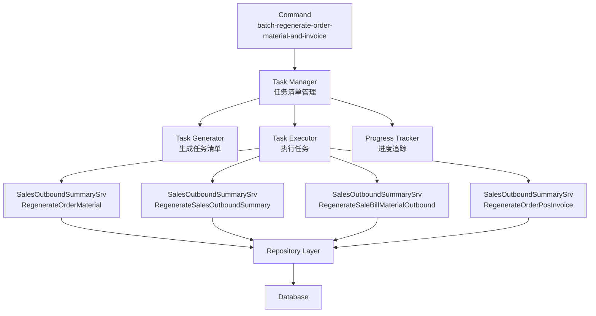
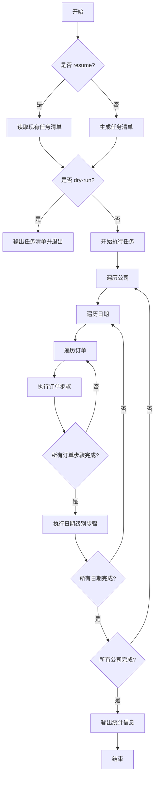

# 批量重新生成订单材料消耗和POS发票 设计文档

> 本文档定义批量重新生成订单材料消耗和POS发票功能的技术设计和实现方案。

## 📋 概述

本功能提供一个命令行工具，用于批量重新生成指定公司和日期范围内的所有订单的材料消耗和POS发票。核心实现是复用现有的四个命令的Service方法，通过任务清单管理批量执行，支持断点续传和进度显示。

**技术要点**：
- 复用现有Service方法（`RegenerateOrderMaterial`、`RegenerateSalesOutboundSummary`、`RegenerateSaleBillMaterialOutbound`、`RegenerateOrderPosInvoice`），避免代码重复
- 使用JSON文件管理任务清单，支持四层结构（公司 → 日期 → 订单 → 步骤）
- 支持断点续传，自动跳过已完成的步骤
- 支持进度显示（可选功能），实时显示处理进度
- 使用文件锁机制防止并发操作

---

## 🎯 规范对齐

### Go Main 规范 (go-main.mdc)

- ✅ 命令文件放在 `main/command/` 目录
- ✅ 使用 Cobra 框架
- ✅ 不使用 panic，返回 error
- ✅ Service 只依赖其他 Service 接口
- ✅ Repository 只持有 db 实例，不持有 DBManager

### 数据库规范 (database.mdc)

- ✅ 复用现有表结构，不涉及数据库表变更
- ✅ 使用事务保证数据一致性
- ✅ 每个步骤的执行使用数据库事务，确保原子性

---

## 🔄 代码复用分析

### 可复用的现有组件

- **SalesOutboundSummarySrv.RegenerateOrderMaterial()**: `main/app/service/sales_outbound_summary_service.go:458-558`
  - 重新生成指定订单的材料用料记录
  - 已实现完整的业务逻辑，包括订单信息获取、材料计算、删除旧记录、插入新记录

- **SalesOutboundSummarySrv.RegenerateSalesOutboundSummary()**: `main/app/service/sales_outbound_summary_service.go:76-456`
  - 重新生成指定日期的销售出库汇总记录
  - 已实现完整的业务逻辑，包括删除旧记录、重新生成汇总记录

- **SalesOutboundSummarySrv.RegenerateSaleBillMaterialOutbound()**: `main/app/service/sales_outbound_summary_service.go:560-750`
  - 重新生成指定销售订单的材料出库记录
  - 已实现完整的业务逻辑，包括退库、软删除、重新计算、创建新记录、扣库

- **SalesOutboundSummarySrv.RegenerateOrderPosInvoice()**: `main/app/service/sales_outbound_summary_service.go:752-850`
  - 重新生成指定订单的POS发票
  - 已实现完整的业务逻辑，包括调用 SavePosInvoice 方法

- **SaleOrderRepo.GetSaleOrdersByCompanyAndDateRange()**: `main/app/repository/sale_order.go`
  - 查询指定公司和日期范围内的订单（需要实现或使用现有方法）

- **文件锁机制**: `pkg/lock/system_lock.go`
  - 使用 `TryLockUuidString()` 和 `UnlockUuidString()` 实现文件锁

### 集成点

- **数据库表**: 复用现有表结构
  - `ttpos_sale_order` - 订单表
  - `ttpos_sale_order_material` - 材料记录表
  - `ttpos_warehouse_out_form_item` - 出库单明细表
- **Service方法**: 复用现有的四个Service方法
- **任务清单文件**: JSON格式，存储在文件系统中

---

## 🏗️ 架构设计

### 分层设计原则

**命令行工具架构**:

```
Command Layer (batch_regenerate_order_material_and_invoice.go)
  ↓ 调用
Task Manager (任务清单管理)
  ↓ 调用
Service Layer (SalesOutboundSummarySrv)
  ↓ 调用
Repository Layer (复用现有)
```

**依赖规则**:

- ✅ Command 调用 Task Manager 管理任务清单
- ✅ Task Manager 调用 Service 方法执行步骤
- ✅ Service 方法复用现有实现，不修改
- ✅ 任务清单使用JSON文件存储，支持读写和状态更新

### 架构图



### 模块划分

#### Go Main 模块

- **Command 层**: `main/command/batch_regenerate_order_material_and_invoice.go` - 命令行工具入口
- **Task Manager 层**: `main/app/service/batch_regenerate_task_manager.go` - 任务清单管理（新建）
  - 任务清单生成
  - 任务清单读取和解析
  - 任务清单状态更新
  - 任务执行引擎
  - 进度追踪（可选）
- **Service 层**: `main/app/service/sales_outbound_summary_service.go` - 复用现有Service方法
- **Repository 层**: `main/app/repository/` - 数据访问（复用现有）
- **DTO 层**: `main/app/dto/resp/` - 响应数据（复用现有）

---

## 🗄️ 数据库设计

### 数据表设计

不涉及数据库表结构变更，复用现有表结构。

---

## 📊 数据模型

### 任务清单JSON结构

```go
// main/app/dto/batch_regenerate_task.go
type BatchRegenerateTask struct {
    Companies []CompanyTask `json:"companies"`
    Summary   TaskSummary   `json:"summary"`
    CreatedAt string        `json:"created_at"`
    UpdatedAt string        `json:"updated_at"`
}

type CompanyTask struct {
    CompanyUuid uint64      `json:"company_uuid"`
    CompanyName string      `json:"company_name"`
    Dates       []DateTask  `json:"dates"`
}

type DateTask struct {
    Date      string        `json:"date"`
    DateStep  StepTask      `json:"date_step"`
    Orders    []OrderTask   `json:"orders"`
}

type OrderTask struct {
    SaleOrderUuid uint64    `json:"sale_order_uuid"`
    OrderNo       string     `json:"order_no"`
    OrderDate     string     `json:"order_date"`
    Steps         []StepTask `json:"steps"`
}

type StepTask struct {
    Step      int    `json:"step"`
    Name      string `json:"name"`
    Status    string `json:"status"` // pending, running, completed, failed
    StartTime string `json:"start_time"`
    EndTime   string `json:"end_time"`
    Error     string `json:"error"`
}

type TaskSummary struct {
    TotalCompanies  int `json:"total_companies"`
    TotalDates      int `json:"total_dates"`
    TotalOrders     int `json:"total_orders"`
    TotalDateSteps  int `json:"total_date_steps"`
    TotalOrderSteps int `json:"total_order_steps"`
    CompletedSteps  int `json:"completed_steps"`
    FailedSteps     int `json:"failed_steps"`
    PendingSteps    int `json:"pending_steps"`
}
```

### DTO 定义

#### Request DTO

```go
// main/app/dto/req/batch_regenerate_req.go
// 不需要Request DTO（命令行参数直接解析）
```

#### Response DTO

```go
// main/app/dto/resp/batch_regenerate_resp.go
type BatchRegenerateTaskResp struct {
    TaskFile string      `json:"task_file"`
    Summary  TaskSummary `json:"summary"`
}

type BatchRegenerateProgressResp struct {
    OverallProgress   float64   `json:"overall_progress"`   // 总体完成百分比
    CompletedSteps    int       `json:"completed_steps"`
    FailedSteps       int       `json:"failed_steps"`
    PendingSteps      int       `json:"pending_steps"`
    EstimatedTimeLeft string    `json:"estimated_time_left"` // 预计剩余时间
    CompanyProgress   CompanyProgress `json:"company_progress"`
    DateProgress      DateProgress    `json:"date_progress"`
    OrderProgress     OrderProgress   `json:"order_progress"`
}

type CompanyProgress struct {
    TotalCompanies   int      `json:"total_companies"`
    PendingCompanies int      `json:"pending_companies"`
    CompletedCompanies []string `json:"completed_companies"`
    CurrentCompany   string   `json:"current_company"`
}

type DateProgress struct {
    TotalDates   int      `json:"total_dates"`
    PendingDates int      `json:"pending_dates"`
    CompletedDates []string `json:"completed_dates"`
    CurrentDate  string   `json:"current_date"`
}

type OrderProgress struct {
    TotalOrders   int      `json:"total_orders"`
    PendingOrders int      `json:"pending_orders"`
    CompletedOrders []string `json:"completed_orders"`
    CurrentOrder  string   `json:"current_order"`
}
```

---

## 🔌 命令行接口设计

### 命令格式

```bash
./main batch-regenerate-order-material-and-invoice \
  --company-uuids <公司UUID列表，逗号分隔> \
  --start-date <起始日期，格式：YYYY-MM-DD> \
  [--task-file <任务清单文件路径>] \
  [--resume] \
  [--dry-run] \
  [--show-progress] \
  [--progress-interval <秒数>]
```

### 参数说明

| 参数 | 类型 | 必填 | 说明 |
|------|------|------|------|
| `--company-uuids` | string | 是 | 公司UUID列表，逗号分隔 |
| `--start-date` | string | 是 | 起始日期，格式：YYYY-MM-DD |
| `--task-file` | string | 否 | 任务清单文件路径（默认：./batch-regenerate-task-{timestamp}.json） |
| `--resume` | bool | 否 | 从现有任务清单继续执行 |
| `--dry-run` | bool | 否 | 预览模式，仅生成任务清单 |
| `--show-progress` | bool | 否 | 显示详细进度信息（默认：false） |
| `--progress-interval` | int | 否 | 进度信息刷新间隔（秒数，默认：5秒） |

### 执行流程



---

## 🧩 组件和接口

### Task Manager Service

#### Service 接口

```go
// main/app/service/i_batch_regenerate_task_manager.go
type IBatchRegenerateTaskManager interface {
    // GenerateTaskList 生成任务清单
    // companyUuids: 公司UUID列表
    // startDate: 起始日期，格式：YYYY-MM-DD
    // taskFilePath: 任务清单文件路径（可选）
    GenerateTaskList(companyUuids []uint64, startDate string, taskFilePath string) (*dto.BatchRegenerateTask, error)
    
    // LoadTaskList 加载任务清单
    // taskFilePath: 任务清单文件路径
    LoadTaskList(taskFilePath string) (*dto.BatchRegenerateTask, error)
    
    // SaveTaskList 保存任务清单
    // task: 任务清单对象
    // taskFilePath: 任务清单文件路径
    SaveTaskList(task *dto.BatchRegenerateTask, taskFilePath string) error
    
    // ExecuteTaskList 执行任务清单
    // task: 任务清单对象
    // taskFilePath: 任务清单文件路径
    // showProgress: 是否显示进度
    // progressInterval: 进度刷新间隔（秒）
    ExecuteTaskList(task *dto.BatchRegenerateTask, taskFilePath string, showProgress bool, progressInterval int) error
    
    // GetProgress 获取进度信息
    // task: 任务清单对象
    GetProgress(task *dto.BatchRegenerateTask) (*dto_resp.BatchRegenerateProgressResp, error)
}
```

#### Service 实现

```go
// main/app/service/batch_regenerate_task_manager.go
type batchRegenerateTaskManager struct {
    dbm                    *database.DBManager
    salesOutboundSummarySrv service.ISalesOutboundSummarySrv
    fileLock               *sync.Mutex
}

func NewBatchRegenerateTaskManager(
    dbm *database.DBManager,
    salesOutboundSummarySrv service.ISalesOutboundSummarySrv,
) IBatchRegenerateTaskManager {
    return &batchRegenerateTaskManager{
        dbm:                    dbm,
        salesOutboundSummarySrv: salesOutboundSummarySrv,
        fileLock:               &sync.Mutex{},
    }
}

func (m *batchRegenerateTaskManager) GenerateTaskList(
    companyUuids []uint64,
    startDate string,
    taskFilePath string,
) (*dto.BatchRegenerateTask, error) {
    // 1. 查询所有符合条件的订单
    // 2. 按日期分组订单
    // 3. 生成任务清单结构
    // 4. 保存到JSON文件
}

func (m *batchRegenerateTaskManager) ExecuteTaskList(
    task *dto.BatchRegenerateTask,
    taskFilePath string,
    showProgress bool,
    progressInterval int,
) error {
    // 1. 获取文件锁
    // 2. 遍历公司→日期→订单→步骤
    // 3. 执行每个步骤（跳过已完成的）
    // 4. 更新任务清单状态
    // 5. 定期保存任务清单
    // 6. 显示进度（如果启用）
}
```

### Command 层

```go
// main/command/batch_regenerate_order_material_and_invoice.go
var batchRegenerateOrderMaterialAndInvoiceCmd = &cobra.Command{
    Use:   "batch-regenerate-order-material-and-invoice",
    Short: "批量重新生成订单材料消耗和POS发票",
    Long:  `批量重新生成指定公司和日期范围内的所有订单的材料消耗和POS发票`,
    PreRun: func(cmd *cobra.Command, args []string) {
        // 初始化配置、日志、数据库、缓存等
    },
    Run: func(cmd *cobra.Command, args []string) {
        // 1. 解析参数
        // 2. 创建 Task Manager
        // 3. 生成或加载任务清单
        // 4. 执行任务清单
        // 5. 输出结果
    },
}
```

---

## ⚡ 缓存设计

不涉及缓存设计。

---

## 🚨 错误处理

### 错误场景

#### 场景 1: 任务清单文件不存在或格式错误

- **处理方式**: 提示错误信息并退出
- **用户影响**: 命令执行失败，需要检查文件路径或重新生成任务清单
- **代码示例**:
  ```go
  task, err := taskManager.LoadTaskList(taskFilePath)
  if err != nil {
      fmt.Printf("%s错误: 加载任务清单失败: %s%s\n", redColor, err.Error(), resetColor)
      return
  }
  ```

#### 场景 2: 单个步骤执行失败

- **处理方式**: 记录错误信息到任务清单，继续执行下一个步骤
- **用户影响**: 该步骤标记为 failed，其他步骤继续执行
- **代码示例**:
  ```go
  err := executeStep(step)
  if err != nil {
      step.Status = "failed"
      step.Error = err.Error()
      step.EndTime = time.Now().Format(time.RFC3339)
      // 继续执行下一个步骤
      continue
  }
  ```

#### 场景 3: 文件锁获取失败

- **处理方式**: 提示错误信息并退出
- **用户影响**: 可能有其他实例正在执行，需要等待或检查
- **代码示例**:
  ```go
  lockKey := fmt.Sprintf("batch_regenerate_task:%s", taskFilePath)
  if !systemLock.TryLockUuidString(lockKey) {
      return errors.New("任务清单正在被其他进程使用，请稍后再试")
  }
  defer systemLock.UnlockUuidString(lockKey)
  ```

---

## 🔒 安全设计

### 文件锁机制

- **实现方式**: 使用 `pkg/lock/system_lock.go` 的 `TryLockUuidString()` 方法
- **锁Key**: `batch_regenerate_task:{taskFilePath}`
- **作用**: 防止多个实例同时操作同一任务清单文件

### 任务清单文件验证

- **验证内容**: JSON格式正确性、必需字段存在、状态值有效性
- **验证时机**: 加载任务清单时

---

## 🧪 测试策略

### 单元测试

**目标覆盖率**:

- main/app/service/batch_regenerate_task_manager: 70%+
- main/command/batch_regenerate_order_material_and_invoice: 70%+

**测试内容**:

- 任务清单生成逻辑
- 任务清单加载和保存
- 任务执行引擎
- 进度计算逻辑
- 错误处理

### 集成测试

**测试流程**:

- 端到端批量处理流程
- 断点续传功能
- 进度显示功能
- 文件锁机制

---

## 📈 性能优化

### 优化策略

1. **分批处理订单**:
   - 避免一次性加载所有订单到内存
   - 按日期分批处理

2. **任务清单文件读写优化**:
   - 使用文件锁防止并发
   - 定期保存状态，不阻塞主流程

3. **进度显示优化**:
   - 使用异步更新，不阻塞主执行流程
   - 默认刷新间隔5秒，可配置

### 性能指标

- 任务清单生成: < 10秒（1000订单）
- 单个步骤执行: 复用现有Service方法性能
- 任务清单文件读写: < 100ms

---

## 📚 实现清单

### Phase 1: 任务清单管理

- [ ] 创建 Task Manager Service 接口和实现
- [ ] 实现任务清单生成逻辑
- [ ] 实现任务清单加载和保存
- [ ] 实现JSON序列化和反序列化

### Phase 2: 任务执行引擎

- [ ] 实现任务执行引擎（遍历公司→日期→订单→步骤）
- [ ] 实现步骤执行逻辑（调用现有Service方法）
- [ ] 实现日期级别步骤执行时机检查
- [ ] 实现任务清单状态更新

### Phase 3: 断点续传

- [ ] 实现任务清单加载逻辑
- [ ] 实现已完成步骤跳过逻辑
- [ ] 实现失败步骤重新执行逻辑

### Phase 4: 进度显示（可选）

- [ ] 实现进度计算逻辑
- [ ] 实现进度显示格式化
- [ ] 实现定时刷新机制

### Phase 5: 命令行工具

- [ ] 创建命令文件框架
- [ ] 实现参数解析和验证
- [ ] 集成 Task Manager
- [ ] 实现日志输出和错误处理

### Phase 6: 测试

- [ ] 单元测试
- [ ] 集成测试
- [ ] 断点续传测试
- [ ] 进度显示测试（可选）

**详细任务**: 参见 `tasks.md`

---

## Graphiti & 活动日志

- Related Episode: `[待补充]`
- 模板：`docs/agent/templates/graphiti-episode.md`
- 活动日志：`docs/team/activities/{YYYY-MM}/{YYYY-MM-DD}.md`
- 在技术方案评审、关键架构决策或踩坑总结后，立即补充 Episode 并在设计文档尾部互链。

---

**版本**: v1.0.0  
**创建日期**: 2025-12-17  
**作者**: xiezhihuan  
**审核者**: {审核者}

