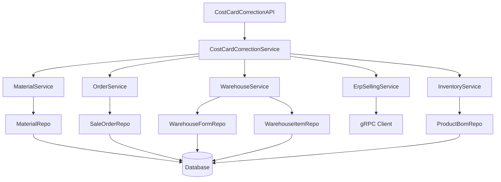

# 成本卡材料消耗修正 设计文档

> 本文档定义 成本卡材料消耗修正 功能的技术设计和实现方案。

## 📋 概述

成本卡材料消耗修正功能是一个批量数据修正工具，用于修正因成本卡设置错误导致的订单材料消耗、出库记录和商品库存错误。该功能需要处理历史订单数据的回滚和重新计算，涉及订单、出库、库存、ERP 等多个模块，需要严格的事务控制和数据一致性保证。

**核心流程**：
1. 用户选择需要修正的订单
2. 退回错误扣减的材料，修正材料库存和商品库存
3. 根据正确的成本卡重新计算材料消耗
4. 重新生成出库记录
5. 重新同步 ERP 数据
6. 修正每日销售出库记录

---

## 🎯 规范对齐

### Go Main 规范 (go-main.mdc)

- **Service 层**：只依赖其他 Service 接口，不直接依赖 Repository
- **Repository 层**：只持有 db 实例，不持有 DBManager
- **URL 命名**：使用 snake_case（如：`/api/v1/cost_card_correction`）
- **响应格式**：data 字段必须是对象，不能是 null 或数组
- **错误处理**：不使用 panic，返回 error，使用 errors.WithMessage 包装错误
- **接口命名**：接口以 `I` 开头，实现以 `Impl` 结尾

### API 设计规范 (api.mdc)

- URL 使用 snake_case 命名
- 响应格式：`{code, message, data{}}`
- data 字段必须是对象
- 分页信息统一放在 meta 中

### 数据库规范 (database.mdc)

- 使用现有数据库表，不创建新表
- 所有操作在事务中执行
- 使用软删除（delete_time）
- 时间字段使用 int 类型

---

## 🔄 代码复用分析

### 可复用的现有组件

- **订单反结账逻辑**：`main/app/service/order.go` (ReverseSettleOrder) - 参考出库单撤销和库存回滚逻辑
- **材料出库处理**：`main/app/service/purchase_order/helper.go` (reduceHeadquarterStockAndLog) - 参考材料库存扣减和日志记录
- **材料退回逻辑**：`admin/app/common/model/erp/ErpWarehouseOutForm.php` (revoke) - 参考材料库存退回实现
- **成本卡材料消耗计算**：`main/app/model/sale_order.go` (flavorUseCard) - 参考材料消耗量计算逻辑
- **商品库存计算**：`main/app/modules/inventory/domain/service/bom_card_product_inventory_strategy.go` - 参考基于成本卡的商品库存计算
- **ERP POS Invoice 同步**：`main/app/service/rpc/erp/selling.go` (SavePosInvoice) - 参考 ERP 数据同步逻辑
- **出库单创建**：`main/app/service/order.go` - 参考出库单和出库单明细的创建逻辑
- **仓库日志记录**：`main/app/service/purchase_order/helper.go` - 参考 WarehouseInOutLog 创建逻辑

### 集成点

- **订单查询**：通过 `SaleOrderRepo` 查询订单信息
- **出库记录查询**：通过 `WarehouseFormRepo` 查询历史出库记录
- **材料库存操作**：通过 `WarehouseItemRepo` 操作材料库存
- **成本卡查询**：通过 `ProductBomCardRepo` 查询成本卡配置
- **ERP 同步**：通过 `ErpSellingService` 调用 gRPC 接口同步数据
- **商品库存计算**：通过 `InventoryService` 重新计算商品库存

---

## 🏗️ 架构设计

### 分层设计原则

**Go Main 三层架构**:

```
API 层 (Controller/API)
  ↓ 依赖
业务层 (Service)
  ↓ 依赖
数据层 (Repository)
```

**依赖规则**:

- ✅ 上层可依赖下层
- ❌ 禁止下层依赖上层
- ❌ 禁止跨层调用
- ❌ Service 不能依赖 Repository
- ✅ Service 可以依赖其他 Service 接口

### 架构图



### 模块划分

#### Go Main 模块

- **API 层**: `main/app/api/cost_card_correction_api.go` - 路由处理、参数校验
- **Service 层**: `main/app/service/cost_card_correction_service.go` - 业务逻辑、事务管理
- **Repository 层**: 复用现有的 Repository（SaleOrderRepo, WarehouseFormRepo, WarehouseItemRepo 等）
- **Model 层**: 复用现有的 Model（SaleOrder, WarehouseOutForm, WarehouseItem 等）
- **DTO 层**: `main/app/dto/req/cost_card_correction_req.go`, `main/app/dto/resp/cost_card_correction_resp.go`

---

## 🗄️ 数据库设计

### 数据表设计

本功能不创建新表，使用现有数据库表：

#### 相关表说明

1. **订单相关表**：
   - `ttpos_sale_bill` - 销售单据表
   - `ttpos_sale_order` - 销售订单表
   - `ttpos_sale_order_product` - 销售订单商品表
   - `ttpos_sale_order_product_bom` - 销售订单商品BOM表（材料消耗记录）
   - `ttpos_sale_order_material` - 销售订单材料表

2. **出库相关表**：
   - `ttpos_warehouse_out_form` - 出库单表
   - `ttpos_warehouse_out_form_item` - 出库单明细表
   - `ttpos_warehouse_in_out_log` - 仓库出入库日志表

3. **库存相关表**：
   - `ttpos_warehouse_item` - 仓库物品库存表

4. **商品和成本卡相关表**：
   - `ttpos_product_bom` - 商品BOM表（关联成本卡）
   - `ttpos_product_bom_card` - 成本卡表
   - `ttpos_related_material` - 成本卡关联材料表（定义成本卡的材料组成）

### 数据操作说明

**材料退回操作**：
- 查询 `ttpos_warehouse_out_form_item` 获取历史出库记录
- 增加 `ttpos_warehouse_item.stock`（材料库存）
- 创建 `ttpos_warehouse_in_out_log`（退回日志）
- 更新 `ttpos_related_material`（关联材料库存）

**重新生成出库记录**：
- 创建 `ttpos_warehouse_out_form`（出库单）
- 创建 `ttpos_warehouse_out_form_item`（出库单明细）
- 创建 `ttpos_warehouse_in_out_log`（出库日志）
- 减少 `ttpos_warehouse_item.stock`（材料库存）
- 更新 `ttpos_sale_order_product_bom`（材料消耗记录）

**ERP 同步**：
- 调用 gRPC 接口保存 POS invoice
- 更新 `ttpos_sale_order.erp_products_invoice_name` 和 `erp_material_invoice_name`

---

## 📊 数据模型

### Go Model（复用现有）

```go
// main/app/model/sale_order.go
type SaleOrder struct {
    // ... 现有字段
    SaleOrderProducts []*SaleOrderProduct
    SaleOrderProductBoms []*SaleOrderProductBom
}

// main/app/model/warehouse_form.go
type WarehouseOutForm struct {
    // ... 现有字段
    WarehouseOutFormItems []*WarehouseOutFormItem
}

type WarehouseOutFormItem struct {
    // ... 现有字段
    MaterialUuid uint64
    Num float64
    SaleOrderProductUuid uint64
}

// main/app/model/warehouse_item.go
type WarehouseItem struct {
    // ... 现有字段
    Stock float64
}

// main/app/model/product.go
type ProductBomCard struct {
    // ... 现有字段
    RelatedMaterials []*RelatedMaterial
}
```

### DTO 定义

#### Request DTO

```go
// main/app/dto/req/cost_card_correction_req.go
type CostCardCorrectionReq struct {
    OrderUuids []uint64 `json:"order_uuids" binding:"required,min=1"` // 需要修正的订单UUID列表
}

type CostCardCorrectionPreviewReq struct {
    OrderUuids []uint64 `json:"order_uuids" binding:"required,min=1"` // 预览修正影响的订单UUID列表
}
```

#### Response DTO

```go
// main/app/dto/resp/cost_card_correction_resp.go
type CostCardCorrectionPreviewResp struct {
    Orders []OrderCorrectionInfo `json:"orders"` // 订单修正信息列表
    TotalOrders int `json:"total_orders"` // 总订单数
    AffectedDates []string `json:"affected_dates"` // 受影响的日期列表
}

type OrderCorrectionInfo struct {
    OrderUuid uint64 `json:"order_uuid"` // 订单UUID
    OrderNo string `json:"order_no"` // 订单号
    CreateTime int64 `json:"create_time"` // 创建时间
    Products []ProductCorrectionInfo `json:"products"` // 商品修正信息列表
}

type ProductCorrectionInfo struct {
    ProductBomUuid uint64 `json:"product_bom_uuid"` // 商品BOM UUID
    ProductName string `json:"product_name"` // 商品名称
    BomCardUuid uint64 `json:"bom_card_uuid"` // 成本卡UUID
    Materials []MaterialCorrectionInfo `json:"materials"` // 材料修正信息列表
}

type MaterialCorrectionInfo struct {
    MaterialUuid uint64 `json:"material_uuid"` // 材料UUID
    MaterialName string `json:"material_name"` // 材料名称
    OldConsumption float64 `json:"old_consumption"` // 旧消耗量
    NewConsumption float64 `json:"new_consumption"` // 新消耗量
    ReturnQuantity float64 `json:"return_quantity"` // 退回数量
}

type CostCardCorrectionResp struct {
    CorrectionUuid uint64 `json:"correction_uuid"` // 修正操作UUID（用于日志追踪）
    SuccessCount int `json:"success_count"` // 成功修正的订单数
    FailCount int `json:"fail_count"` // 失败的订单数
    FailedOrders []FailedOrderInfo `json:"failed_orders"` // 失败的订单信息
}

type FailedOrderInfo struct {
    OrderUuid uint64 `json:"order_uuid"` // 订单UUID
    OrderNo string `json:"order_no"` // 订单号
    ErrorMessage string `json:"error_message"` // 错误信息
}
```

---

## 🔌 API 设计

### RESTful API

#### API 1: 预览修正影响

**请求**:

- **URL**: `/api/v1/cost_card_correction/preview`
- **Method**: `POST`
- **Headers**:
  ```json
  {
    "Authorization": "Bearer {token}",
    "Content-Type": "application/json"
  }
  ```
- **Body**:
  ```json
  {
    "order_uuids": [123456, 123457]
  }
  ```

**响应**:

```json
{
  "code": 1,
  "message": "success",
  "data": {
    "orders": [
      {
        "order_uuid": 123456,
        "order_no": "SO20251212001",
        "create_time": 1702368000,
        "products": [
          {
            "product_bom_uuid": 789012,
            "product_name": "菜品A",
            "bom_card_uuid": 345678,
            "materials": [
              {
                "material_uuid": 111111,
                "material_name": "材料A",
                "old_consumption": 10.5,
                "new_consumption": 8.0,
                "return_quantity": 2.5
              }
            ]
          }
        ]
      }
    ],
    "total_orders": 2,
    "affected_dates": ["2025-12-10", "2025-12-11", "2025-12-12"]
  }
}
```

#### API 2: 执行修正操作

**请求**:

- **URL**: `/api/v1/cost_card_correction/execute`
- **Method**: `POST`
- **Headers**:
  ```json
  {
    "Authorization": "Bearer {token}",
    "Content-Type": "application/json"
  }
  ```
- **Body**:
  ```json
  {
    "order_uuids": [123456, 123457]
  }
  ```

**响应**:

```json
{
  "code": 1,
  "message": "success",
  "data": {
    "correction_uuid": 999999,
    "success_count": 2,
    "fail_count": 0,
    "failed_orders": []
  }
}
```

**错误响应**:

```json
{
  "code": 0,
  "message": "修正失败：订单 123456 的成本卡不存在",
  "data": {}
}
```

#### API 3: 查询修正日志

**请求**:

- **URL**: `/api/v1/cost_card_correction/logs`
- **Method**: `GET`
- **Query Parameters**:
  - `correction_uuid`: 修正操作UUID（可选）
  - `order_uuid`: 订单UUID（可选）
  - `page_no`: 页码（默认1）
  - `page_size`: 每页数量（默认20）

**响应**:

```json
{
  "code": 1,
  "message": "success",
  "data": {
    "list": [
      {
        "correction_uuid": 999999,
        "order_uuid": 123456,
        "order_no": "SO20251212001",
        "status": "success",
        "create_time": 1702368000,
        "operator_uuid": 888888
      }
    ],
    "meta": {
      "page_no": 1,
      "page_size": 20,
      "total": 1
    }
  }
}
```

---

## 🧩 组件和接口

### Service 层

#### Service 接口

```go
// main/app/service/i_cost_card_correction_service.go
type ICostCardCorrectionSrv interface {
    // PreviewCorrection 预览修正影响
    PreviewCorrection(ctx *gin.Context, req *dto_req.CostCardCorrectionPreviewReq) (*dto_resp.CostCardCorrectionPreviewResp, error)
    
    // ExecuteCorrection 执行修正操作
    ExecuteCorrection(ctx *gin.Context, req *dto_req.CostCardCorrectionReq) (*dto_resp.CostCardCorrectionResp, error)
    
    // GetCorrectionLogs 查询修正日志
    GetCorrectionLogs(ctx *gin.Context, req *dto_req.CostCardCorrectionLogsReq) (*dto_resp.CostCardCorrectionLogsResp, error)
}
```

#### Service 实现

```go
// main/app/service/cost_card_correction_service.go
type costCardCorrectionSrv struct {
    dbm *database.DBManager
    
    // 依赖其他 Service 接口
    materialSrv IMaterialSrv
    orderSrv IOrderSrv
    warehouseSrv IWarehouseSrv
    erpSellingSrv IErpSellingSrv
    inventorySrv IInventorySrv
}

func NewCostCardCorrectionSrv(
    dbm *database.DBManager,
    materialSrv IMaterialSrv,
    orderSrv IOrderSrv,
    warehouseSrv IWarehouseSrv,
    erpSellingSrv IErpSellingSrv,
    inventorySrv IInventorySrv,
) ICostCardCorrectionSrv {
    return &costCardCorrectionSrv{
        dbm: dbm,
        materialSrv: materialSrv,
        orderSrv: orderSrv,
        warehouseSrv: warehouseSrv,
        erpSellingSrv: erpSellingSrv,
        inventorySrv: inventorySrv,
    }
}

func (s *costCardCorrectionSrv) ExecuteCorrection(ctx *gin.Context, req *dto_req.CostCardCorrectionReq) (*dto_resp.CostCardCorrectionResp, error) {
    correctionUuid := pkg_uuid.GenerateUuid()
    successCount := 0
    failCount := 0
    failedOrders := []dto_resp.FailedOrderInfo{}
    
    // 分批处理订单（每批 100 个）
    batchSize := 100
    for i := 0; i < len(req.OrderUuids); i += batchSize {
        end := i + batchSize
        if end > len(req.OrderUuids) {
            end = len(req.OrderUuids)
        }
        batch := req.OrderUuids[i:end]
        
        // 处理每批订单
        for _, orderUuid := range batch {
            err := s.correctOrder(ctx, orderUuid, correctionUuid)
            if err != nil {
                failCount++
                // 查询订单号
                order, _ := repository.NewSaleOrderRepo(s.dbm.GetDB(ctx)).GetByUuid(orderUuid)
                orderNo := ""
                if order != nil {
                    orderNo = order.OrderNo
                }
                failedOrders = append(failedOrders, dto_resp.FailedOrderInfo{
                    OrderUuid: orderUuid,
                    OrderNo: orderNo,
                    ErrorMessage: err.Error(),
                })
                logger.Logger.Error("修正订单失败", zap.Uint64("order_uuid", orderUuid), zap.Error(err))
            } else {
                successCount++
            }
        }
    }
    
    return &dto_resp.CostCardCorrectionResp{
        CorrectionUuid: correctionUuid,
        SuccessCount: successCount,
        FailCount: failCount,
        FailedOrders: failedOrders,
    }, nil
}

// correctOrder 修正单个订单
func (s *costCardCorrectionSrv) correctOrder(ctx *gin.Context, orderUuid uint64, correctionUuid uint64) error {
    db := s.dbm.GetDB(ctx)
    
    return repository.CommonRepo.Transaction(db, func(db *gorm.DB) error {
        // 1. 查询订单信息
        orderRepo := repository.NewSaleOrderRepo(db)
        order, err := orderRepo.GetByUuid(orderUuid)
        if err != nil {
            return errors.WithMessage(err, "查询订单失败")
        }
        
        // 2. 查询历史出库记录
        warehouseFormRepo := repository.NewWarehouseFormRepo(db)
        outFormItems, err := warehouseFormRepo.GetOutFormItemsByOrderUuid(orderUuid)
        if err != nil {
            return errors.WithMessage(err, "查询出库记录失败")
        }
        
        // 3. 退回错误扣减的材料
        if err := s.returnMaterials(ctx, db, orderUuid, outFormItems, correctionUuid); err != nil {
            return errors.WithMessage(err, "退回材料失败")
        }
        
        // 4. 重新计算材料消耗
        if err := s.recalculateMaterialConsumption(ctx, db, order, correctionUuid); err != nil {
            return errors.WithMessage(err, "重新计算材料消耗失败")
        }
        
        // 5. 重新生成出库记录
        if err := s.regenerateOutForm(ctx, db, order, correctionUuid); err != nil {
            return errors.WithMessage(err, "重新生成出库记录失败")
        }
        
        // 6. 重新同步 ERP 数据
        if err := s.resyncErpData(ctx, db, order); err != nil {
            return errors.WithMessage(err, "同步ERP数据失败")
        }
        
        // 7. 记录修正日志
        if err := s.recordCorrectionLog(ctx, db, orderUuid, correctionUuid, "success"); err != nil {
            logger.Logger.Warn("记录修正日志失败", zap.Error(err))
        }
        
        return nil
    })
}

// returnMaterials 退回材料
func (s *costCardCorrectionSrv) returnMaterials(ctx *gin.Context, db *gorm.DB, orderUuid uint64, outFormItems []*model.WarehouseOutFormItem, correctionUuid uint64) error {
    warehouseItemRepo := repository.NewWarehouseItemRepo(db)
    warehouseLogRepo := repository.NewWarehouseInOutLogRepo(db)
    materialRepo := repository.NewMaterialRepo(db)
    
    // 按材料汇总需要退回的数量
    materialReturnMap := make(map[uint64]float64) // materialUuid -> returnQuantity
    for _, item := range outFormItems {
        if item.MaterialUuid > 0 && item.ReduceStock == 1 {
            materialReturnMap[item.MaterialUuid] += item.Num
        }
    }
    
    // 退回每个材料
    for materialUuid, returnQuantity := range materialReturnMap {
        // 查询材料信息
        material, err := materialRepo.GetByUuid(materialUuid)
        if err != nil {
            return errors.WithMessage(err, fmt.Sprintf("查询材料失败: %d", materialUuid))
        }
        
        // 查询仓库物品
        warehouseItem, err := warehouseItemRepo.GetByWarehouseAndMaterial(material.WarehouseUuid, materialUuid)
        if err != nil {
            return errors.WithMessage(err, fmt.Sprintf("查询仓库物品失败: %d", materialUuid))
        }
        
        // 增加材料库存
        if err := warehouseItemRepo.IncreaseStock(warehouseItem.Uuid, returnQuantity); err != nil {
            return errors.WithMessage(err, fmt.Sprintf("退回材料库存失败: %d", materialUuid))
        }
        
        // 记录退回日志
        warehouseLog := &model.WarehouseInOutLog{
            LogType:              constant.WarehouseInOutLogLogTypeIn, // 入库（退回）
            Scene:                constant.WarehouseInOutLogSceneProfitIn, // 修正退回（使用盘盈入库场景）
            WarehouseUuid:        material.WarehouseUuid,
            MaterialUuid:         materialUuid,
            MaterialName:         material.MultiLanguageName.ToJson(),
            MaterialBaseUnitUuid: material.BaseUnitUuid,
            MaterialBaseUnitName: material.BaseUnitName.ToJson(),
            Num:                  returnQuantity,
            OrderNo:              fmt.Sprintf("CORRECTION-%d", correctionUuid),
        }
        if err := warehouseLogRepo.Create(warehouseLog); err != nil {
            return errors.WithMessage(err, "记录退回日志失败")
        }
        
        // 更新规格/加料关联材料库存
        relatedMaterialUuids := material.GetRelatedMaterialUuids()
        if err := materialRepo.UpdateRelatedMaterialStock(relatedMaterialUuids); err != nil {
            return errors.WithMessage(err, "更新关联材料库存失败")
        }
        
        // 重新计算相关商品的库存
        if err := s.recalculateProductInventory(ctx, db, materialUuid); err != nil {
            logger.Logger.Warn("重新计算商品库存失败", zap.Uint64("material_uuid", materialUuid), zap.Error(err))
        }
    }
    
    return nil
}

// recalculateMaterialConsumption 重新计算材料消耗
func (s *costCardCorrectionSrv) recalculateMaterialConsumption(ctx *gin.Context, db *gorm.DB, order *model.SaleOrder, correctionUuid uint64) error {
    saleOrderProductBomRepo := repository.NewSaleOrderProductBomRepo(db)
    
    // 删除旧的材料消耗记录
    if err := saleOrderProductBomRepo.DeleteByOrderUuid(order.Uuid); err != nil {
        return errors.WithMessage(err, "删除旧材料消耗记录失败")
    }
    
    // 重新生成材料消耗记录
    for _, product := range order.GetValidSaleOrderProductList() {
        if product.ProductBom == nil || product.ProductBom.ProductBomCard == nil {
            continue
        }
        
        // 使用 flavorUseCard 逻辑计算材料消耗
        bomCard := product.ProductBom.ProductBomCard
        for _, relatedMaterial := range bomCard.RelatedMaterials {
            consumption := relatedMaterial.GetDecreaseNum(product.Num)
            
            // 创建新的材料消耗记录
            saleOrderProductBom := &model.SaleOrderProductBom{
                SaleOrderProductUuid: product.Uuid,
                SaleOrderUuid: order.Uuid,
                MaterialUuid: relatedMaterial.MaterialUuid,
                Num: consumption,
            }
            if err := saleOrderProductBomRepo.Create(saleOrderProductBom); err != nil {
                return errors.WithMessage(err, "创建材料消耗记录失败")
            }
        }
    }
    
    return nil
}

// regenerateOutForm 重新生成出库记录
func (s *costCardCorrectionSrv) regenerateOutForm(ctx *gin.Context, db *gorm.DB, order *model.SaleOrder, correctionUuid uint64) error {
    warehouseFormRepo := repository.NewWarehouseFormRepo(db)
    warehouseItemRepo := repository.NewWarehouseItemRepo(db)
    warehouseLogRepo := repository.NewWarehouseInOutLogRepo(db)
    materialRepo := repository.NewMaterialRepo(db)
    
    // 创建出库单
    outFormUuid := pkg_uuid.GenerateUuid()
    outForm := &model.WarehouseOutForm{
        BaseModel: model.BaseModel{Uuid: outFormUuid},
        FormNo: warehouseFormRepo.GenerateWarehouseOutFormNo(ctx.GetCompanySetting().Timezone),
        Scene: constant.WarehouseOutFormSceneSales,
        Status: constant.WarehouseOutFormStatusSuccess,
        OperatorUuid: ctx.GetStaffUuid(),
    }
    if err := warehouseFormRepo.CreateWarehouseOutFormRecord(*outForm); err != nil {
        return errors.WithMessage(err, "创建出库单失败")
    }
    
    // 按材料汇总出库数量
    materialOutMap := make(map[uint64]float64) // materialUuid -> outQuantity
    for _, product := range order.GetValidSaleOrderProductList() {
        if product.SaleOrderProductBoms == nil {
            continue
        }
        for _, bom := range product.SaleOrderProductBoms {
            if bom.MaterialUuid > 0 {
                materialOutMap[bom.MaterialUuid] += bom.Num
            }
        }
    }
    
    // 创建出库单明细和扣减库存
    for materialUuid, outQuantity := range materialOutMap {
        // 查询材料信息
        material, err := materialRepo.GetByUuid(materialUuid)
        if err != nil {
            return errors.WithMessage(err, fmt.Sprintf("查询材料失败: %d", materialUuid))
        }
        
        // 查询仓库物品
        warehouseItem, err := warehouseItemRepo.GetByWarehouseAndMaterial(material.WarehouseUuid, materialUuid)
        if err != nil {
            return errors.WithMessage(err, fmt.Sprintf("查询仓库物品失败: %d", materialUuid))
        }
        
        // 扣减材料库存
        if err := warehouseItemRepo.ReduceStock(warehouseItem.Uuid, outQuantity); err != nil {
            return errors.WithMessage(err, fmt.Sprintf("扣减材料库存失败: %d", materialUuid))
        }
        
        // 创建出库单明细
        outFormItem := &model.WarehouseOutFormItem{
            WarehouseOutFormUuid: outFormUuid,
            WarehouseUuid: material.WarehouseUuid,
            MaterialUuid: materialUuid,
            Num: outQuantity,
            Scene: constant.WarehouseOutFormSceneSales,
            Status: constant.WarehouseOutFormItemStatusSuccess,
            ReduceStock: constant.WarehouseOutFormItemReduceStockSuccess,
            SaleOrderUuid: order.Uuid,
        }
        if err := warehouseFormRepo.CreateWarehouseOutFormItemRecord(*outFormItem); err != nil {
            return errors.WithMessage(err, "创建出库单明细失败")
        }
        
        // 记录出库日志
        warehouseLog := &model.WarehouseInOutLog{
            LogType:              constant.WarehouseInOutLogLogTypeOut,
            Scene:                constant.WarehouseInOutLogSceneSale,
            WarehouseUuid:        material.WarehouseUuid,
            MaterialUuid:         materialUuid,
            MaterialName:         material.MultiLanguageName.ToJson(),
            MaterialBaseUnitUuid: material.BaseUnitUuid,
            MaterialBaseUnitName: material.BaseUnitName.ToJson(),
            Num:                  outQuantity,
            OrderNo:              order.OrderNo,
        }
        if err := warehouseLogRepo.Create(warehouseLog); err != nil {
            return errors.WithMessage(err, "记录出库日志失败")
        }
        
        // 更新规格/加料关联材料库存
        relatedMaterialUuids := material.GetRelatedMaterialUuids()
        if err := materialRepo.UpdateRelatedMaterialStock(relatedMaterialUuids); err != nil {
            return errors.WithMessage(err, "更新关联材料库存失败")
        }
        
        // 重新计算相关商品的库存
        if err := s.recalculateProductInventory(ctx, db, materialUuid); err != nil {
            logger.Logger.Warn("重新计算商品库存失败", zap.Uint64("material_uuid", materialUuid), zap.Error(err))
        }
    }
    
    return nil
}

// resyncErpData 重新同步 ERP 数据
func (s *costCardCorrectionSrv) resyncErpData(ctx *gin.Context, db *gorm.DB, order *model.SaleOrder) error {
    company := ctx.GetCompany()
    if !company.IsOpenErpPhase3() {
        return nil // 未开启 ERP，跳过
    }
    
    // 查询订单关联的账单
    saleBillRepo := repository.NewSaleBillRepo(db)
    saleBill, err := saleBillRepo.GetByUuid(order.SaleBillUuid)
    if err != nil {
        return errors.WithMessage(err, "查询账单失败")
    }
    
    // 重新生成 POS invoice 数据并同步
    // 参考 order_pay.go 中的 SavePosInvoice 逻辑
    res, err := s.orderSrv.SavePosInvoice(ctx, order, saleBill, db)
    if err != nil {
        return errors.WithMessage(err, "同步ERP数据失败")
    }
    
    // 更新订单的 ERP invoice 名称
    order.ErpProductsInvoiceName = res.ProductsInvoiceName
    order.ErpMaterialInvoiceName = res.MaterialInvoiceName
    if err := repository.NewSaleOrderRepo(db).UpdateSaleOrderRecord(*order); err != nil {
        return errors.WithMessage(err, "更新订单ERP信息失败")
    }
    
    return nil
}

// recalculateProductInventory 重新计算商品库存
func (s *costCardCorrectionSrv) recalculateProductInventory(ctx *gin.Context, db *gorm.DB, materialUuid uint64) error {
    // 查询使用该材料的所有成本卡
    productBomCardRepo := repository.NewProductBomCardRepo(db)
    bomCards, err := productBomCardRepo.GetByMaterialUuid(materialUuid)
    if err != nil {
        return errors.WithMessage(err, "查询成本卡失败")
    }
    
    // 重新计算每个成本卡关联的商品库存
    for _, bomCard := range bomCards {
        // 使用 InventoryService 重新计算商品库存
        // 参考 bom_card_product_inventory_strategy.go
        if err := s.inventorySrv.RecalculateProductInventoryByBomCard(ctx, bomCard.Uuid); err != nil {
            logger.Logger.Warn("重新计算商品库存失败", zap.Uint64("bom_card_uuid", bomCard.Uuid), zap.Error(err))
        }
    }
    
    return nil
}

// recordCorrectionLog 记录修正日志
func (s *costCardCorrectionSrv) recordCorrectionLog(ctx *gin.Context, db *gorm.DB, orderUuid uint64, correctionUuid uint64, status string) error {
    // TODO: 创建修正日志表或使用现有日志表记录
    // 记录操作时间、操作人、订单UUID、修正UUID、状态等信息
    return nil
}
```

### API 层

```go
// main/app/api/cost_card_correction_api.go
type CostCardCorrectionAPI struct {
    costCardCorrectionSrv service.ICostCardCorrectionSrv
}

func NewCostCardCorrectionAPI(costCardCorrectionSrv service.ICostCardCorrectionSrv) *CostCardCorrectionAPI {
    return &CostCardCorrectionAPI{costCardCorrectionSrv: costCardCorrectionSrv}
}

// POST /api/v1/cost_card_correction/preview
func (api *CostCardCorrectionAPI) Preview(c *gin.Context) {
    var req dto_req.CostCardCorrectionPreviewReq
    if err := c.ShouldBindJSON(&req); err != nil {
        helper.ErrorWithDetail(c, constant.CodeInvalidParam, err)
        return
    }
    
    resp, err := api.costCardCorrectionSrv.PreviewCorrection(c, &req)
    if err != nil {
        helper.ErrorWithDetail(c, constant.CodeFail, err)
        return
    }
    
    helper.Success(c, gin.H{
        "data": resp,
    })
}

// POST /api/v1/cost_card_correction/execute
func (api *CostCardCorrectionAPI) Execute(c *gin.Context) {
    var req dto_req.CostCardCorrectionReq
    if err := c.ShouldBindJSON(&req); err != nil {
        helper.ErrorWithDetail(c, constant.CodeInvalidParam, err)
        return
    }
    
    resp, err := api.costCardCorrectionSrv.ExecuteCorrection(c, &req)
    if err != nil {
        helper.ErrorWithDetail(c, constant.CodeFail, err)
        return
    }
    
    helper.Success(c, gin.H{
        "data": resp,
    })
}

// GET /api/v1/cost_card_correction/logs
func (api *CostCardCorrectionAPI) GetLogs(c *gin.Context) {
    var req dto_req.CostCardCorrectionLogsReq
    if err := c.ShouldBindQuery(&req); err != nil {
        helper.ErrorWithDetail(c, constant.CodeInvalidParam, err)
        return
    }
    
    resp, err := api.costCardCorrectionSrv.GetCorrectionLogs(c, &req)
    if err != nil {
        helper.ErrorWithDetail(c, constant.CodeFail, err)
        return
    }
    
    helper.Success(c, gin.H{
        "data": resp,
    })
}
```

---

## ⚡ 缓存设计

### Redis 缓存

**缓存策略**:

- **Key 命名**: `ttpos:cost_card_correction:preview:{order_uuids_hash}`
- **过期时间**: 5 分钟（预览结果）
- **更新策略**: Cache-Aside Pattern

**示例**:

```go
// 预览结果缓存
key := fmt.Sprintf("ttpos:cost_card_correction:preview:%s", hashOrderUuids(req.OrderUuids))
cached, err := redis.Get(key)
if err == nil {
    // 缓存命中
    return cached
}

// 缓存未命中，计算预览结果
preview, err := s.calculatePreview(ctx, req)
if err != nil {
    return err
}

// 写入缓存
redis.Set(key, preview, 5*time.Minute)
return preview
```

---

## 🚨 错误处理

### 错误场景

#### 场景 1: 订单不存在

- **处理方式**: 返回错误，跳过该订单
- **用户影响**: 显示错误信息，其他订单继续处理
- **代码示例**:
  ```go
  order, err := orderRepo.GetByUuid(orderUuid)
  if err != nil {
      return errors.WithMessage(err, "查询订单失败")
  }
  ```

#### 场景 2: 成本卡不存在或无效

- **处理方式**: 返回错误，中止该订单的修正
- **用户影响**: 显示错误信息，记录到失败列表
- **代码示例**:
  ```go
  if product.ProductBom == nil || product.ProductBom.ProductBomCard == nil {
      return errors.New("成本卡不存在")
  }
  ```

#### 场景 3: 材料库存不足（重新出库时）

- **处理方式**: 返回错误，中止修正
- **用户影响**: 显示错误信息，需要先补充库存
- **代码示例**:
  ```go
  if warehouseItem.Stock < outQuantity {
      return errors.New("材料库存不足")
  }
  ```

#### 场景 4: ERP 同步失败

- **处理方式**: 记录错误，允许重试
- **用户影响**: 显示警告信息，可以手动重试
- **代码示例**:
  ```go
  if err := s.resyncErpData(ctx, db, order); err != nil {
      logger.Logger.Error("ERP同步失败", zap.Error(err))
      // 记录到失败列表，但不回滚已执行的修正
  }
  ```

#### 场景 5: 事务回滚

- **处理方式**: 自动回滚所有操作
- **用户影响**: 显示错误信息，数据恢复到修正前状态
- **代码示例**:
  ```go
  return repository.CommonRepo.Transaction(db, func(db *gorm.DB) error {
      // 所有操作在事务中
      // 如果任何一步失败，自动回滚
  })
  ```

---

## 🔒 安全设计

### 身份验证

- **JWT Token**: 所有 API 需要 Token 验证
- **权限检查**: 只有商户管理员可以执行修正操作

### 权限控制

- **API 权限**: 检查用户是否有修正权限
- **数据权限**: 只能修正当前商户的订单

### 数据安全

- **事务控制**: 所有操作在事务中执行，确保数据一致性
- **操作日志**: 记录所有修正操作的详细信息
- **并发控制**: 使用 UUID 锁避免并发修正同一订单

---

## 🧪 测试策略

### 单元测试

**目标覆盖率**:

- main/app/service: 70%+
- main/app/repository: 80%+
- **材料出库相关: 100%**（高风险）

**测试内容**:

- Service 业务逻辑（材料退回、重新计算、出库记录生成）
- Repository 数据访问
- DTO 数据转换

### API 测试

**测试内容**:

- API 接口调用
- 参数验证
- 响应格式
- 错误处理

### 集成测试

**测试流程**:

- 端到端业务流程（订单选择 → 材料退回 → 重新计算 → 出库记录 → ERP 同步）
- 数据库事务
- 批量处理（多订单）
- 错误回滚

---

## 📈 性能优化

### 优化策略

1. **数据库优化**:
   - 添加索引（order_uuid, material_uuid）
   - 优化 SQL 查询（批量查询）
   - 使用连接池

2. **批量处理**:
   - 分批处理订单（每批 100 个）
   - 避免一次性处理过多数据

3. **并发控制**:
   - UUID 锁防止并发冲突
   - 事务隔离级别

4. **异步处理**:
   - ERP 同步可以异步处理（如需要）
   - 每日销售出库修正可以异步处理

### 性能指标

- 批量处理响应时间: < 30s（每批 100 个订单）
- 单个订单修正时间: < 2s
- 数据库查询: < 50ms
- 并发能力: 支持多订单并发修正（使用锁）

---

## 🌐 浏览器兼容性

### 前端兼容性（Vue）

- Chrome 90+
- Safari 14+
- Firefox 88+
- Edge 90+

---

## 📚 实现清单

### Phase 1: 核心 Service 实现

- [ ] 实现 CostCardCorrectionService 接口
- [ ] 实现材料退回逻辑
- [ ] 实现材料消耗重新计算逻辑
- [ ] 实现出库记录重新生成逻辑
- [ ] 实现商品库存重新计算逻辑

### Phase 2: ERP 同步和每日销售出库修正

- [ ] 实现 ERP 数据重新同步逻辑
- [ ] 实现每日销售出库修正逻辑
- [ ] 实现修正日志记录

### Phase 3: API 和路由

- [ ] 实现 CostCardCorrectionAPI
- [ ] 注册 API 路由
- [ ] 实现预览接口

### Phase 4: 测试和优化

- [ ] 单元测试
- [ ] API 测试
- [ ] 集成测试
- [ ] 性能优化

**详细任务**: 参见 `tasks.md`

---

## Graphiti & 活动日志

- Related Episode: `[待补充]`
- 模板：`docs/agent/templates/graphiti-episode.md`
- 活动日志：`docs/team/activities/{YYYY-MM}/{YYYY-MM-DD}.md`
- 在技术方案评审、关键架构决策或踩坑总结后，立即补充 Episode 并在设计文档尾部互链。

---

**版本**: v1.0.0  
**创建日期**: 2025-12-12  
**作者**: xiezhihuan  
**审核者**: {审核者}

