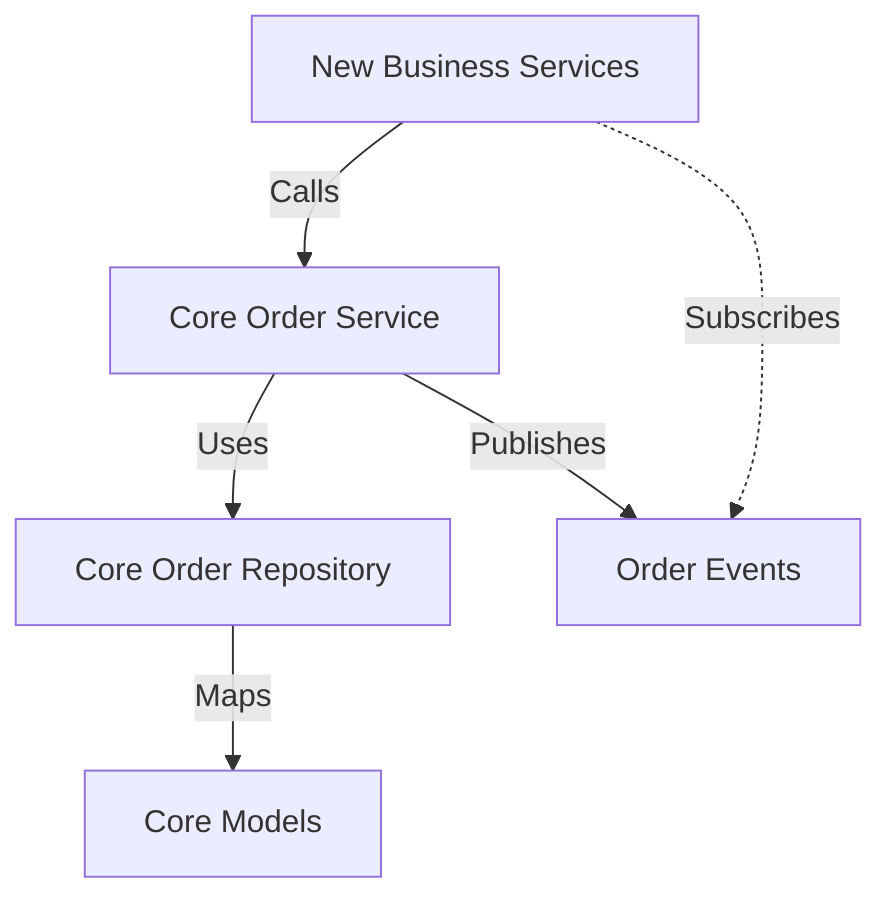

# 解耦独立订单模块 - 技术设计

> 本文档定义解耦独立订单模块 (Order Core Module) 的技术设计和实现方案。

## 📋 概述

为了解决现有 `SaleOrder` 和 `SaleBill` 模型承载过多业务逻辑（如积分、ERP、打印等）的问题，我们将采用 **绞杀榕模式 (Strangler Fig Pattern)**，新建一个独立的 `order_core` 模块。该模块专注于订单数据的生命周期管理和基础状态流转，不包含具体的业务计算逻辑，为未来业务扩展提供干净的底座。

---

## 🎯 规范对齐

### Go Main 规范 (go-main.mdc)

- **模块化**: 新代码置于 `main/app/modules/order_core/` 下，保持独立性。
- **分层架构**: 遵循 Service -> Repository -> Model 的依赖关系。
- **错误处理**: 不使用 panic，统一返回 error，使用 `errors.WithMessage` 包装堆栈。
- **数据库**: 字段映射使用 GORM tag，金额使用 `float64` (配合 decimal 计算) 或 `decimal` 类型 (Model定义)。

### API 设计规范 (api.mdc)

- **接口**: 新模块主要提供 Go 内部 Service 接口供业务适配层调用，初期可能不直接暴露 HTTP API。
- **事件**: 定义清晰的领域事件 (`OrderCreated`, `OrderPaid`)。

### 数据库规范 (database.mdc)

- **复用表结构**: 复用现有的 `ttpos_sale_bill`, `ttpos_sale_order` 等表，不修改 Schema。
- **只读/并发控制**: 引入乐观锁机制 (如需) 或明确写入权限。

---

## 🔄 代码复用分析

### 可复用的现有组件

- **数据库连接**: 复用 `database.DBManager`。
- **事件总线**: 复用 `event.SystemBus` 或新建模块内 Event Bus。
- **工具类**: 复用 `pkg/utils` 中的 UUID 生成、时间处理等。

### 集成点

- **数据库**: `order_core` 模块的 Repository 连接到现有的 `ttpos_sale_*` 表。
- **事件系统**: `order_core` 发布事件，现有的或新的业务 Service (如 `LoyaltyService`) 订阅这些事件。

---

## 🏗️ 架构设计

### 模块划分

新模块位于 `main/app/modules/order_core/`，内部结构如下：

```
main/app/modules/order_core/
├── api/              # (可选) 内部 API 或 HTTP 接口
├── model/            # 数据模型 (PO) - 映射数据库表
├── repository/       # 仓储层 - 负责数据 CRUD
├── service/          # 服务层 - 负责状态机和核心逻辑
├── event/            # 领域事件定义
└── dto/              # 数据传输对象
```

### 依赖关系



### 状态机设计

订单状态流转将受到严格限制：

- `Pending` (待支付)
- `Paid` (已支付)
- `Finished` (已完成/已结账)
- `Canceled` (已取消)

不允许非法跳转（如 `Canceled` -> `Paid`）。

---

## 🗄️ 数据库设计

**注意**: 本次设计 **不修改** 现有数据库表结构，而是通过新的 Model 结构体映射现有表。

### 复用表

- `ttpos_sale_bill`
- `ttpos_sale_order`
- `ttpos_sale_order_product`

---

## 📊 数据模型 (New Core Models)

### CoreSaleBill

```go
// main/app/modules/order_core/model/core_sale_bill.go
type CoreSaleBill struct {
    Uuid           uint64  `gorm:"column:uuid;primaryKey" json:"uuid"`
    OrderNo        string  `gorm:"column:order_no" json:"order_no"`
    Status         uint    `gorm:"column:status" json:"status"` // 0-待付款, 1-已完成, 2-已取消
    Amount         float64 `gorm:"column:amount" json:"amount"`
    // ... 仅包含核心字段
    CreateTime     int64   `gorm:"column:create_time" json:"create_time"`
    UpdateTime     int64   `gorm:"column:update_time" json:"update_time"`
}

func (*CoreSaleBill) TableName() string {
    return "ttpos_sale_bill"
}
```

### CoreSaleOrder

```go
// main/app/modules/order_core/model/core_sale_order.go
type CoreSaleOrder struct {
    Uuid         uint64  `gorm:"column:uuid;primaryKey" json:"uuid"`
    SaleBillUuid uint64  `gorm:"column:sale_bill_uuid" json:"sale_bill_uuid"`
    OrderNo      string  `gorm:"column:order_no" json:"order_no"`
    Status       uint    `gorm:"column:status" json:"status"` // 0-未结账 1-已结账
    Amount       float64 `gorm:"column:amount" json:"amount"`
    // ... 仅包含核心字段
}

func (*CoreSaleOrder) TableName() string {
    return "ttpos_sale_order"
}
```

---

## 🧩 组件和接口

### Repository 层

#### ICoreOrderRepo

```go
// main/app/modules/order_core/repository/i_core_order_repo.go
type ICoreOrderRepo interface {
    CreateBill(bill *model.CoreSaleBill) error
    UpdateBillStatus(uuid uint64, status uint) error
    GetBillByUuid(uuid uint64) (*model.CoreSaleBill, error)
    
    CreateOrder(order *model.CoreSaleOrder) error
    UpdateOrderStatus(uuid uint64, status uint) error
    // ...
}
```

### Service 层

#### ICoreOrderService

```go
// main/app/modules/order_core/service/i_core_order_service.go
type ICoreOrderService interface {
    // 创建订单核心数据
    CreateOrder(ctx context.Context, req *dto.CreateOrderReq) (*dto.CreateOrderResp, error)
    // 支付成功回调 (更新状态 + 发布事件)
    MarkAsPaid(ctx context.Context, billUuid uint64) error
    // 完成订单
    FinishOrder(ctx context.Context, billUuid uint64) error
    // 取消订单
    CancelOrder(ctx context.Context, billUuid uint64) error
}
```

### 事件定义

```go
// main/app/modules/order_core/event/events.go
type OrderPaidEvent struct {
    BillUuid uint64
    PayTime  int64
}
```

---

## 🧪 测试策略

### 单元测试

- **Service**: 重点测试状态机流转逻辑，确保非法状态变更被拒绝。
- **Repository**: 测试基本的 CRUD 操作是否能正确读写现有表。

### 集成测试

- 模拟完整流程：Create -> MarkAsPaid -> Finish。
- 验证 Event 是否正确发布。

---

## 📚 实现清单

### Phase 1: 基础构建

- [ ] 创建模块目录结构 `main/app/modules/order_core/`
- [ ] 定义 Core Models (`CoreSaleBill`, `CoreSaleOrder`, `CoreSaleOrderProduct`)
- [ ] 实现 Repository 层

### Phase 2: 核心逻辑

- [ ] 定义 DTOs
- [ ] 实现 Service 层 (含状态机)
- [ ] 定义并集成 Event

### Phase 3: 测试验证

- [ ] 编写 Service 单元测试
- [ ] 编写 Repository 集成测试

---

**版本**: v1.0.0
**创建日期**: 2025-12-05
**作者**: xiezhihuan

