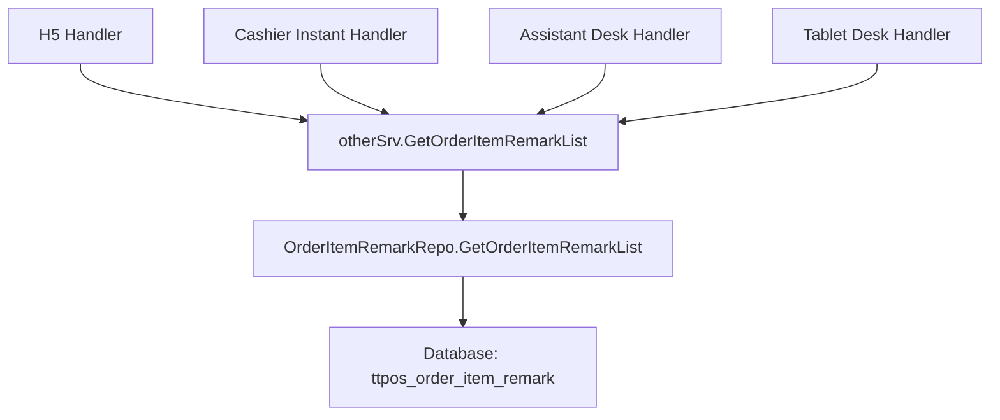

# 获取单品备注预设选项列表 API 设计文档

> 本文档定义获取单品备注预设选项列表 API 的技术设计和实现方案。

## 📋 概述

为收银机、点餐助手、H5、平板等终端提供获取单品备注预设选项列表的 API 接口。本功能复用现有的 Service 和 Repository 方法，仅需要在各终端添加 API 接口层，参考整单备注列表 API 的实现方式。

**技术特点**：
- ✅ 无需数据库变更（数据模型已存在）
- ✅ 无需新增 Service/Repository（已存在）
- ✅ 仅需添加 API 层（4 个终端）
- ✅ 完全复用现有代码逻辑

---

## 🎯 规范对齐

### Go Main 规范 (go-main.mdc)

- ✅ Service 只依赖其他 Service 接口（复用 `otherSrv.GetOrderItemRemarkList()`）
- ✅ Repository 只持有 db 实例（已存在，无需修改）
- ✅ URL 使用 snake_case（`/order/item/remark/list`）
- ✅ data 字段必须是对象（`{code, message, data: {list: []}}`）
- ✅ 不使用 panic，返回 error（遵循现有实现）

### API 设计规范 (api.mdc)

- ✅ URL 使用 snake_case 命名
- ✅ 响应格式统一：`{code, message, data{}}`
- ✅ data 字段是对象，包含 `list` 数组
- ✅ 错误响应格式统一

---

## 🔄 代码复用分析

### 可复用的现有组件

- **Service 方法**: `main/app/service/other.go` - `GetOrderItemRemarkList()` (line 372-392)
  - 已实现完整的业务逻辑
  - 返回 `*resp.OrderItemRemarkResp`
  - 包含多语言支持
  - 排除已删除的预设选项

- **Repository 方法**: `main/app/repository/base/order_item_remark.go` - `GetOrderItemRemarkList()` (line 70-78)
  - 已实现数据访问逻辑
  - 使用 Preload 加载多语言名称
  - 按创建时间倒序排列
  - 排除软删除记录

- **响应结构**: `main/app/dto/resp/order_item_remark.go` - `OrderItemRemarkResp`
  - 已定义完整的响应结构
  - 包含 `uuid` 和 `locale_name`（多语言）

- **参考实现**: 整单备注列表 API
  - `main/app/api/v1/h5/h5_handler.go` - `OrderRemarkList()` (line 274-293)
  - `main/app/api/v1/cashier/cashier_instant.go` - `OrderRemarkList()` (line 470-489)
  - `main/app/api/v1/assistant/assistant_desk.go` - `OrderRemarkList()` (line 276-295)
  - `main/app/api/v1/tablet/tablet_desk.go` - `OrderRemarkList()` (line 320-339)

### 集成点

- **现有 API 路由**: 在各终端的路由文件中注册新路由
- **现有 Service**: 直接调用 `otherSrv.GetOrderItemRemarkList(ctx)`
- **现有认证中间件**: 使用现有的 JWT Token 验证

---

## 🏗️ 架构设计

### 分层设计原则

**Go Main 三层架构**:

```
API 层 (Controller/Handler)
  ↓ 调用
业务层 (Service) - otherSrv.GetOrderItemRemarkList()
  ↓ 调用
数据层 (Repository) - OrderItemRemarkRepo.GetOrderItemRemarkList()
```

**依赖规则**:
- ✅ API 层依赖 Service 接口
- ✅ Service 层依赖 Repository 接口
- ✅ 完全复用现有代码，无需新增 Service/Repository

### 架构图



### 模块划分

#### Go Main 模块

- **API 层**: `main/app/api/v1/` - 4 个终端的 Handler
  - `h5/h5_handler.go` - H5 端
  - `cashier/cashier_instant.go` - 收银机点餐端
  - `assistant/assistant_desk.go` - 点餐助手端
  - `tablet/tablet_desk.go` - 平板端
- **Service 层**: `main/app/service/other.go` - **已存在，无需修改**
- **Repository 层**: `main/app/repository/base/order_item_remark.go` - **已存在，无需修改**
- **DTO 层**: `main/app/dto/resp/order_item_remark.go` - **已存在，无需修改**

---

## 🗄️ 数据库设计

### 数据表设计

**无需数据库变更**，使用现有的 `ttpos_order_item_remark` 表。

**表结构**（已存在）:
- `id` - 主键 ID
- `uuid` - 唯一标识
- `name` - 名称（中文）
- `multi_language_name_uuid` - 多语言名称 UUID
- `create_time` - 创建时间
- `update_time` - 更新时间
- `delete_time` - 删除时间（软删除）

**关联表**:
- `ttpos_multi_language_name` - 多语言名称表（通过 `multi_language_name_uuid` 关联）

---

## 📊 数据模型

### Go Model

**已存在**，无需修改：

```go
// main/app/model/reason.go
type OrderItemRemark struct {
    Id                   uint64 `gorm:"column:id;primaryKey"`
    Uuid                 uint64 `gorm:"column:uuid;uniqueIndex"`
    Name                 string `gorm:"column:name"`
    MultiLanguageNameUuid uint64 `gorm:"column:multi_language_name_uuid"`
    CreateTime           int64  `gorm:"column:create_time"`
    UpdateTime           int64  `gorm:"column:update_time"`
    DeleteTime           int64  `gorm:"column:delete_time;index"`
    MultiLanguageName    MultiLanguageName `gorm:"foreignKey:MultiLanguageNameUuid;references:Uuid"`
}

func (*OrderItemRemark) TableName() string {
    return "ttpos_order_item_remark"
}
```

### DTO 定义

**已存在**，无需修改：

#### Response DTO

```go
// main/app/dto/resp/order_item_remark.go
type OrderItemRemarkResp struct {
    List []OrderItemRemark `json:"list"`
}

type OrderItemRemark struct {
    Uuid       uint64             `json:"uuid"`
    LocaleName dto.LocaleResponse `json:"locale_name"`
}
```

---

## 🔌 API 设计

### RESTful API

#### API 1: H5 端获取单品备注列表

**请求**:
- **URL**: `/h5/order/item/remark/list` (Swagger 完整路径)
- **路由注册**: `/desk/order/item/remark/list` (相对于路由组)
- **Method**: `GET`
- **Headers**:
  ```json
  {
    "Authorization": "Bearer {JWT_TOKEN}",
    "Content-Type": "application/json"
  }
  ```

**响应**:
```json
{
  "code": 200,
  "message": "success",
  "data": {
    "list": [
      {
        "uuid": 1234567890,
        "locale_name": {
          "zh": "不要香菜",
          "th": "ไม่ใส่ผักชี",
          "en": "No coriander",
          "zh_tw": "不要香菜",
          "ja": "コリアンダーなし",
          "ko": "고수 없음",
          "my": "ကြက်သွန်နီမပါ",
          "tr": "Kişniş yok",
          "sv": "Ingen koriander"
        }
      }
    ]
  }
}
```

**错误响应**:
```json
{
  "code": 500,
  "message": "获取单品备注列表失败",
  "data": {}
}
```

#### API 2: 收银机点餐端获取单品备注列表

**请求**:
- **URL**: `/cashier/instant/order/item/remark/list` (Swagger 完整路径)
- **路由注册**: `/instant/order/item/remark/list` (相对于路由组)
- **Method**: `GET`
- **Headers**: 同上

**响应**: 同上

#### API 3: 点餐助手端获取单品备注列表

**请求**:
- **URL**: `/assistant/desk/order/item/remark/list` (Swagger 完整路径)
- **路由注册**: `/desk/order/item/remark/list` (相对于路由组)
- **Method**: `GET`
- **Headers**: 同上

**响应**: 同上

#### API 4: 平板端获取单品备注列表

**请求**:
- **URL**: `/tablet/desk/order/item/remark/list` (Swagger 完整路径)
- **路由注册**: `/desk/order/item/remark/list` (相对于路由组)
- **Method**: `GET`
- **Headers**: 同上

**响应**: 同上

---

## 🧩 组件和接口

### API 层实现

#### H5 端 Handler

```go
// main/app/api/v1/h5/h5_handler.go
// OrderItemRemarkList 处理获取单品备注列表
// @Summary 获取单品备注列表
// @Description 获取单品备注列表
// @Tags 扫码点餐
// @Accept json
// @Produce json
// @Security JwtToken
// @Success 200 {object} dto.Response{data=resp.OrderItemRemarkResp}
// @Failure 404 {object} nil "未找到"
// @Router /h5/order/item/remark/list [get]
func (h *Handler) OrderItemRemarkList(c *gin.Context) {
    ctx := helper.GetContext(c)
    info, err := h.otherSrv.GetOrderItemRemarkList(ctx)
    if err != nil {
        helper.ErrorWithDetail(c, constant.CodeFail, errors.WithMessage(err))
        return
    }
    // 返回结果
    helper.Success(c, info)
}
```

#### 收银机点餐端 Handler

```go
// main/app/api/v1/cashier/cashier_instant.go
// OrderItemRemarkList 处理获取单品备注列表
// @Summary 获取单品备注列表
// @Description 获取单品备注列表
// @Tags 收银端.点餐
// @Accept json
// @Produce json
// @Security JwtToken
// @Success 200 {object} dto.Response{data=resp.OrderItemRemarkResp}
// @Failure 404 {object} nil "未找到"
// @Router /cashier/instant/order/item/remark/list [get]
func (h *InstantHandler) OrderItemRemarkList(c *gin.Context) {
    ctx := helper.GetContext(c)
    info, err := h.otherSrv.GetOrderItemRemarkList(ctx)
    if err != nil {
        helper.ErrorWithDetail(c, constant.CodeFail, errors.WithMessage(err))
        return
    }
    // 返回结果
    helper.Success(c, info)
}
```

#### 点餐助手端 Handler

```go
// main/app/api/v1/assistant/assistant_desk.go
// OrderItemRemarkList 处理获取单品备注列表
// @Summary 获取单品备注列表
// @Description 获取单品备注列表
// @Tags 点餐助手端.桌台
// @Accept json
// @Produce json
// @Security JwtToken
// @Success 200 {object} dto.Response{data=resp.OrderItemRemarkResp}
// @Failure 404 {object} nil "未找到"
// @Router /assistant/desk/order/item/remark/list [get]
func (h *DeskHandler) OrderItemRemarkList(c *gin.Context) {
    ctx := helper.GetContext(c)
    info, err := h.otherSrv.GetOrderItemRemarkList(ctx)
    if err != nil {
        helper.ErrorWithDetail(c, constant.CodeFail, errors.WithMessage(err))
        return
    }
    // 返回结果
    helper.Success(c, info)
}
```

#### 平板端 Handler

```go
// main/app/api/v1/tablet/tablet_desk.go
// OrderItemRemarkList 处理获取单品备注列表
// @Summary 获取单品备注列表
// @Description 获取单品备注列表
// @Tags 平板端.桌台
// @Accept json
// @Produce json
// @Security JwtToken
// @Success 200 {object} dto.Response{data=resp.OrderItemRemarkResp}
// @Failure 404 {object} nil "未找到"
// @Router /tablet/desk/order/item/remark/list [get]
func (h *DeskHandler) OrderItemRemarkList(c *gin.Context) {
    ctx := helper.GetContext(c)
    info, err := h.otherSrv.GetOrderItemRemarkList(ctx)
    if err != nil {
        helper.ErrorWithDetail(c, constant.CodeFail, errors.WithMessage(err))
        return
    }
    // 返回结果
    helper.Success(c, info)
}
```

### 路由注册

在各终端的路由注册位置添加新路由：

#### H5 端路由

```go
// main/app/api/v1/h5/h5_handler.go (line ~832)
privateApi.GET("/desk/order/item/remark/list", wrapper.OrderItemRemarkList) // 获取单品备注列表
```

#### 收银机点餐端路由

```go
// main/app/api/v1/cashier/cashier_instant.go (line ~1733)
privateApi.GET("/instant/order/item/remark/list", wrapper.OrderItemRemarkList) // 获取单品备注列表
```

#### 点餐助手端路由

```go
// main/app/api/v1/assistant/assistant_desk.go (line ~2041)
privateApi.GET("/desk/order/item/remark/list", wrapper.OrderItemRemarkList) // 获取单品备注列表
```

#### 平板端路由

```go
// main/app/api/v1/tablet/tablet_desk.go (line ~414)
privateApi.GET("/desk/order/item/remark/list", wrapper.OrderItemRemarkList) // 获取单品备注列表
```

---

## ⚡ 缓存设计

**暂不实现缓存**：
- 预设选项列表数据量小（最多 100 条）
- 变更频率低（商户设置后很少修改）
- 查询频率中等（仅在点餐时查询）
- 如果后续需要，可以添加 Redis 缓存

---

## 🚨 错误处理

### 错误场景

#### 场景 1: Service 调用失败

- **处理方式**: 使用 `errors.WithMessage` 包装错误，返回 500 错误码
- **用户影响**: 用户看到"获取单品备注列表失败"的错误提示
- **代码示例**:
  ```go
  if err != nil {
      helper.ErrorWithDetail(c, constant.CodeFail, errors.WithMessage(err))
      return
  }
  ```

#### 场景 2: 数据库查询失败

- **处理方式**: Repository 层返回错误，Service 层包装错误信息
- **用户影响**: 用户看到"获取单品备注列表失败"的错误提示

#### 场景 3: 空列表

- **处理方式**: 返回空数组 `[]`，不视为错误
- **用户影响**: 用户看到空列表，可以手动输入备注

---

## 🔒 安全设计

### 身份验证

- **JWT Token**: 所有 API 需要 Token 验证
- **中间件**: 使用现有的认证中间件（`middleware.DeskAuth` 或 `middleware.Auth`）

### 权限控制

- **门店隔离**: 通过 Context 获取 `CompanyUuid`，自动隔离不同门店的数据
- **无需额外权限检查**: 获取列表是基础功能，所有认证用户都可以访问

---

## 🧪 测试策略

### 单元测试

**目标覆盖率**:
- API 层: 70%+（可选，因为逻辑简单）

**测试内容**:
- API 接口调用
- 错误处理
- 响应格式

**示例**:
```go
// main/app/api/v1/h5/h5_handler_test.go
func TestHandler_OrderItemRemarkList(t *testing.T) {
    // 测试实现
}
```

### API 测试

**测试内容**:
- 4 个 API 接口调用
- 响应格式验证
- 错误处理验证
- 空列表处理

---

## 📈 性能优化

### 优化策略

1. **数据库优化**:
   - 使用现有索引（`uuid`, `delete_time`）
   - Preload 多语言名称（已实现）

2. **查询优化**:
   - 限制查询条件（`delete_time = 0`）
   - 按创建时间倒序排列（已实现）

### 性能指标

- 本地响应时间: < 200ms（预期）
- 数据库查询: < 50ms（预期）
- 并发能力: 1000+ QPS（预期）

---

## 📚 实现清单

### Phase 1: API 实现

- [x] 无需数据库变更（数据模型已存在）
- [x] 无需新增 Service/Repository（已存在）
- [ ] 实现 H5 端 API Handler
- [ ] 实现收银机点餐端 API Handler
- [ ] 实现点餐助手端 API Handler
- [ ] 实现平板端 API Handler

### Phase 2: 路由注册

- [ ] 注册 H5 端路由
- [ ] 注册收银机点餐端路由
- [ ] 注册点餐助手端路由
- [ ] 注册平板端路由

### Phase 3: 测试

- [ ] API 测试（4 个接口）
- [ ] 集成测试
- [ ] 文档更新（Swagger）

**详细任务**: 参见 `tasks.md`

---

## Graphiti & 活动日志

- Related Episode: `[待补充]`
- 模板：`docs/agent/templates/graphiti-episode.md`
- 活动日志：`docs/team/activities/{YYYY-MM}/{YYYY-MM-DD}.md`

---

**版本**: v1.0.0  
**创建日期**: 2025-12-05  
**作者**: {团队/个人}  
**审核者**: {审核者}

