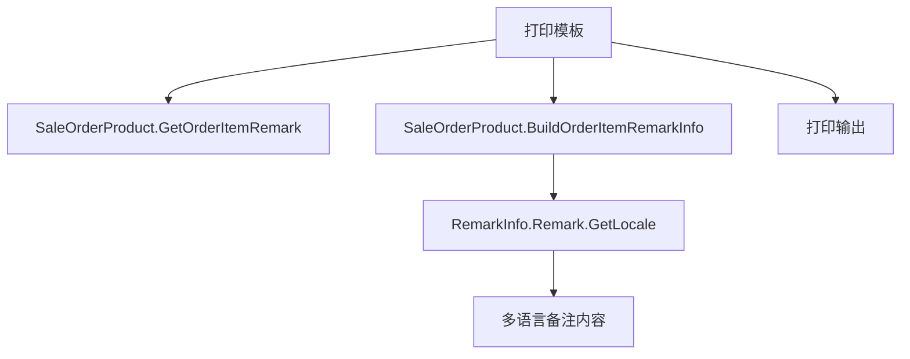

# 单品备注预设备注打印 设计文档

> 本文档定义单品备注预设备注打印功能的技术设计和实现方案。

## 📋 概述

在小票打印时，将单品预设备注与自定义备注拼接后一起打印。本功能通过修改打印模板代码实现，复用现有的 `BuildOrderItemRemarkInfo` 方法构建多语言备注信息，参考整单备注的实现方式。

**技术特点**：
- ✅ 无需数据库变更（数据模型已存在）
- ✅ 无需新增 Service/Repository（已存在）
- ✅ 仅需修改打印模板代码
- ✅ 完全复用现有多语言处理逻辑

---

## 🎯 规范对齐

### Go Main 规范 (go-main.mdc)

- ✅ 打印模板层修改，不涉及 Service/Repository 层
- ✅ 复用现有的 Model 方法（`GetOrderItemRemark`, `BuildOrderItemRemarkInfo`）
- ✅ 不使用 panic，保持错误处理逻辑
- ✅ 遵循现有打印模板代码风格

### 打印模块规范 (go-printer.mdc)

- ✅ 保持与现有打印模板一致的代码风格
- ✅ 复用多语言处理逻辑（`GetLocale` 方法）
- ✅ 保持行间距和字符大小设置逻辑
- ✅ 支持所有打印机类型（CodeSoft、XPrinter、图片打印）

### API 设计规范 (api.mdc)

- ✅ 不涉及 API 接口（纯打印模板修改）

### 数据库规范 (database.mdc)

- ✅ 不涉及数据库变更（数据模型已存在）

---

## 🔄 代码复用分析

### 可复用的现有组件

- **Model 方法**: `main/app/model/sale_order_product.go` - `GetOrderItemRemark()` (line 1197-1210)
  - 已实现获取订单商品的预设备注列表
  - 返回 `[]*SaleOrderProductReason`
  - 过滤非备注预设原因

- **Model 方法**: `main/app/model/sale_order_product.go` - `BuildOrderItemRemarkInfo()` (line 1212-1261)
  - 已实现构建备注信息（包含多语言支持）
  - 参数：`orderItemRemarkList []*SaleOrderProductReason`, `remark string`
  - 返回：`resp.RemarkInfo`（包含多语言备注内容）
  - 自动拼接预设备注和自定义备注
  - 支持 10 种语言（EN, TH, ZH, ZHTW, JA, KO, MY, TR, SV）

- **多语言方法**: `resp.RemarkInfo.Remark.GetLocale(lang string)` 
  - 根据语言环境获取对应语言的备注内容
  - 参考整单备注的实现方式

### 参考实现

- **整单备注打印**: `main/app/printer/template/dishes_codesoft.go` (line 629-636)
  ```go
  if orderRemark := order.GetLatestOrderRemarkRes(); orderRemark != nil {
      printer.LineFeed(1)
      printer.AppendText("\n------------------------\n")
      printer.SetLineSpacing(120)
      printer.AppendText(t.base.Translate("整单备注") + ": " + orderRemark.Remark.GetLocale(t.base.Lang))
      printer.RestoreDefaultLineSpacing()
      printer.AppendText("\n------------------------\n")
  }
  ```

- **整单备注打印**: `main/app/printer/template/dishes_xprinter.go` (line 719-726)
- **整单备注打印**: `main/app/printer/template/dishes_img.go` (line 79-86)

---

## 🏗️ 架构设计

### 分层设计原则

**打印模板层架构**:

```
打印模板 (Template)
  ↓ 依赖
Model 层 (SaleOrderProduct)
  ↓ 使用
多语言处理 (LocaleResponse)
```

**依赖规则**:

- ✅ 打印模板依赖 Model 层的方法
- ✅ 使用 Model 层提供的 `GetOrderItemRemark()` 和 `BuildOrderItemRemarkInfo()` 方法
- ✅ 不涉及 Service/Repository 层

### 架构图



### 模块划分

#### 打印模板模块

- **CodeSoft 模板**: `main/app/printer/template/dishes_codesoft.go`
  - 修改位置：line 206-219, 378-389, 570-576, 718-723
  
- **XPrinter 模板**: `main/app/printer/template/dishes_xprinter.go`
  - 修改位置：line 229-241, 428-440, 652-664, 834-840, 1078-1084, 1349-1355
  
- **图片模板**: `main/app/printer/template/dishes_img.go`
  - 修改位置：line 290-301, 431-442, 615-619, 817-821
  
- **基础模板**: `main/app/printer/template/base.go`
  - 修改位置：line 707-714 (`PrintCompleteOrderImgProducts` 方法)

---

## 🗄️ 数据库设计

### 数据表设计

**无需数据库变更**：数据模型已存在

- `ttpos_sale_order_product` - 订单商品表（已存在）
- `ttpos_sale_order_product_reason` - 订单商品原因表（已存在，包含 `order_item_remark_uuid` 字段）
- `ttpos_order_item_remark` - 单品备注预设表（已存在）

---

## 📊 数据模型

### Go Model（已存在）

```go
// main/app/model/sale_order_product.go
type SaleOrderProduct struct {
    // ... 其他字段
    OrderItemRemarks []*SaleOrderProductReason `gorm:"-" json:"order_item_remarks"`
    Remark           string                    `gorm:"column:remark" json:"remark"`
}

// GetOrderItemRemark 获取订单商品的备注预设列表
func (model *SaleOrderProduct) GetOrderItemRemark() []*SaleOrderProductReason {
    list := make([]*SaleOrderProductReason, 0)
    for _, reason := range model.OrderItemRemarks {
        if reason.SaleOrderProductUuid != model.Uuid || reason.SaleOrderUuid != model.SaleOrderUuid {
            continue
        }
        if reason.OrderItemRemarkUuid != 0 && reason.DeleteTime == 0 {
            list = append(list, reason)
        }
    }
    return list
}

// BuildOrderItemRemarkInfo 构建订单商品的备注信息
func (model *SaleOrderProduct) BuildOrderItemRemarkInfo(orderItemRemarkList []*SaleOrderProductReason, remark string) resp.RemarkInfo {
    // 构建多语言备注内容
    // 返回 RemarkInfo（包含多语言备注）
}
```

### DTO 定义（已存在）

```go
// main/app/dto/resp/shop_cart.go
type RemarkInfo struct {
    Uuids        []uint64          `json:"uuids"`
    Remark       dto.LocaleResponse `json:"remark"`
    CustomRemark string            `json:"custom_remark"`
}

// main/app/dto/locale.go
type LocaleResponse struct {
    EN    string `json:"en"`
    TH    string `json:"th"`
    ZH    string `json:"zh"`
    ZHTW  string `json:"zhtw"`
    JA    string `json:"ja"`
    KO    string `json:"ko"`
    MY    string `json:"my"`
    TR    string `json:"tr"`
    SV    string `json:"sv"`
}

// GetLocale 根据语言获取对应内容
func (l *LocaleResponse) GetLocale(lang string) string {
    switch lang {
    case "en":
        return l.EN
    case "th":
        return l.TH
    case "zh":
        return l.ZH
    case "zhtw":
        return l.ZHTW
    case "ja":
        return l.JA
    case "ko":
        return l.KO
    case "my":
        return l.MY
    case "tr":
        return l.TR
    case "sv":
        return l.SV
    default:
        return l.ZH
    }
}
```

---

## 🔌 API 设计

**不涉及 API 接口**：本功能仅修改打印模板代码，不涉及 API 接口。

---

## 🧩 组件和接口

### 打印模板修改

#### CodeSoft 模板修改示例

**修改前**:
```go
// 处理备注
if product.Remark != "" {
    // 设置行间距
    if t.base.IsMyText(product.Remark) {
        printer.SetLineSpacing(85)
    } else {
        printer.SetLineSpacing(55)
    }
    printer.SetCharacterSize(2, 2)
    printer.PrintInColumns(product.Remark)
    printer.SetCharacterSize(1, 1)
    printer.SetLineSpacing(20)
    printer.LineFeed()
}
```

**修改后**:
```go
// 处理备注（包含预设备注和自定义备注）
orderItemRemarkList := product.GetOrderItemRemark()
remarkInfo := product.BuildOrderItemRemarkInfo(orderItemRemarkList, product.Remark)
remarkText := remarkInfo.Remark.GetLocale(t.base.Lang)

if remarkText != "" {
    // 设置行间距
    if t.base.IsMyText(remarkText) {
        printer.SetLineSpacing(85)
    } else {
        printer.SetLineSpacing(55)
    }
    printer.SetCharacterSize(2, 2)
    printer.PrintInColumns(remarkText)
    printer.SetCharacterSize(1, 1)
    printer.SetLineSpacing(20)
    printer.LineFeed()
}
```

#### XPrinter 模板修改示例

**修改前**:
```go
if product.Remark != "" {
    // 设置行间距
    if t.base.IsMyText(product.Remark) {
        printer.SetLineSpacing(85)
    } else {
        printer.SetLineSpacing(55)
    }
    printer.SetCharacterSize(2, 2)
    printer.PrintInColumns(product.Remark)
    printer.SetCharacterSize(1, 1)
    printer.SetLineSpacing(20)
    printer.LineFeed()
}
```

**修改后**:
```go
orderItemRemarkList := product.GetOrderItemRemark()
remarkInfo := product.BuildOrderItemRemarkInfo(orderItemRemarkList, product.Remark)
remarkText := remarkInfo.Remark.GetLocale(t.base.Lang)

if remarkText != "" {
    // 设置行间距
    if t.base.IsMyText(remarkText) {
        printer.SetLineSpacing(85)
    } else {
        printer.SetLineSpacing(55)
    }
    printer.SetCharacterSize(2, 2)
    printer.PrintInColumns(remarkText)
    printer.SetCharacterSize(1, 1)
    printer.SetLineSpacing(20)
    printer.LineFeed()
}
```

#### 图片模板修改示例

**修改前**:
```go
// 打印备注
if product.Remark != "" && len(opts) == 0 {
    img.SetTextLineHeight(utils.IfInt(p.IsMyText(product.Remark), 68, 50))
    img.LineFeed(1, 12)
    img.SetFontSize(28)
    img.AppendText(product.Remark)
    img.LineFeed(1, 50)
    img.SetFontSize(20)
}
```

**修改后**:
```go
// 打印备注（包含预设备注和自定义备注）
orderItemRemarkList := product.GetOrderItemRemark()
remarkInfo := product.BuildOrderItemRemarkInfo(orderItemRemarkList, product.Remark)
remarkText := remarkInfo.Remark.GetLocale(p.Lang)

if remarkText != "" && len(opts) == 0 {
    img.SetTextLineHeight(utils.IfInt(p.IsMyText(remarkText), 68, 50))
    img.LineFeed(1, 12)
    img.SetFontSize(28)
    img.AppendText(remarkText)
    img.LineFeed(1, 50)
    img.SetFontSize(20)
}
```

---

## ⚡ 缓存设计

**不涉及缓存**：打印模板直接使用 Model 数据，无需缓存。

---

## 🚨 错误处理

### 错误场景

#### 场景 1: 预设备注获取失败

- **处理方式**: 降级为仅显示自定义备注
- **用户影响**: 小票上仍显示自定义备注，不影响打印
- **代码示例**:
  ```go
  orderItemRemarkList := product.GetOrderItemRemark()
  // GetOrderItemRemark() 不会失败，返回空列表表示没有预设备注
  remarkInfo := product.BuildOrderItemRemarkInfo(orderItemRemarkList, product.Remark)
  remarkText := remarkInfo.Remark.GetLocale(t.base.Lang)
  ```

#### 场景 2: 多语言内容为空

- **处理方式**: 不打印备注信息（保持原有逻辑）
- **用户影响**: 小票上不显示备注，与原有行为一致
- **代码示例**:
  ```go
  if remarkText != "" {
      // 打印备注
  }
  ```

---

## 🔒 安全设计

**不涉及安全相关功能**：打印模板仅读取数据并输出，不涉及安全验证。

---

## 🧪 测试策略

### 单元测试

**目标覆盖率**:

- 打印模板逻辑测试：覆盖所有修改位置

**测试内容**:

- 预设备注打印测试
- 自定义备注打印测试
- 预设备注 + 自定义备注拼接测试
- 多语言显示测试
- 空备注处理测试

### 集成测试

**测试流程**:

- 整单打印测试（包含预设备注的商品）
- 一菜一单打印测试
- 退菜单打印测试
- 出菜单打印测试
- 不同打印机类型测试（CodeSoft、XPrinter、图片打印）

### 手动测试

**测试场景**:

- 不同语言环境下的备注显示（中文、英文、泰文、缅甸文等）
- 不同打印场景（整单、一菜一单、退菜单、出菜单）
- 不同打印机类型
- 向后兼容测试（没有预设备注的商品）

---

## 📈 性能优化

### 优化策略

1. **无性能影响**:
   - 仅修改显示内容，不增加数据库查询
   - 使用已实现的 `BuildOrderItemRemarkInfo` 方法，性能已优化

2. **内存优化**:
   - 复用现有的 Model 方法，不创建额外对象

### 性能指标

- 打印性能：与原有性能一致（无额外查询）
- 内存占用：无额外内存占用

---

## 🌐 浏览器兼容性

**不涉及前端**：本功能仅修改后端打印模板代码。

---

## 📚 实现清单

### Phase 1: CodeSoft 模板修改

- [ ] 修改 `dishes_codesoft.go` - 一菜一单打印（line 206-219）
- [ ] 修改 `dishes_codesoft.go` - 整单打印（line 378-389）
- [ ] 修改 `dishes_codesoft.go` - 退菜单打印（line 570-576）
- [ ] 修改 `dishes_codesoft.go` - 出菜单打印（line 718-723）

### Phase 2: XPrinter 模板修改

- [ ] 修改 `dishes_xprinter.go` - 一菜一单打印（line 229-241）
- [ ] 修改 `dishes_xprinter.go` - 整单打印（line 428-440）
- [ ] 修改 `dishes_xprinter.go` - 退菜单打印（line 652-664）
- [ ] 修改 `dishes_xprinter.go` - 出菜单打印（line 834-840）
- [ ] 修改 `dishes_xprinter.go` - 其他打印场景（line 1078-1084, 1349-1355）

### Phase 3: 图片模板修改

- [ ] 修改 `dishes_img.go` - 一菜一单打印（line 290-301）
- [ ] 修改 `dishes_img.go` - 整单打印（line 431-442）
- [ ] 修改 `dishes_img.go` - 退菜单打印（line 615-619）
- [ ] 修改 `dishes_img.go` - 出菜单打印（line 817-821）
- [ ] 修改 `base.go` - `PrintCompleteOrderImgProducts` 方法（line 707-714）

### Phase 4: 测试验证

- [ ] 单元测试：打印模板逻辑测试
- [ ] 集成测试：所有打印场景测试
- [ ] 手动测试：不同打印机类型测试
- [ ] 多语言测试：不同语言环境测试

**详细任务**: 参见 `tasks.md`

---

## Graphiti & 活动日志

- Related Episode: `[待补充]`
- 模板：`docs/agent/templates/graphiti-episode.md`
- 活动日志：`docs/team/activities/{YYYY-MM}/{YYYY-MM-DD}.md`
- 在技术方案评审、关键架构决策或踩坑总结后，立即补充 Episode 并在设计文档尾部互链。

---

**版本**: v1.0.0  
**创建日期**: 2025-12-11  
**作者**: 王昱  
**审核者**: {审核者}
