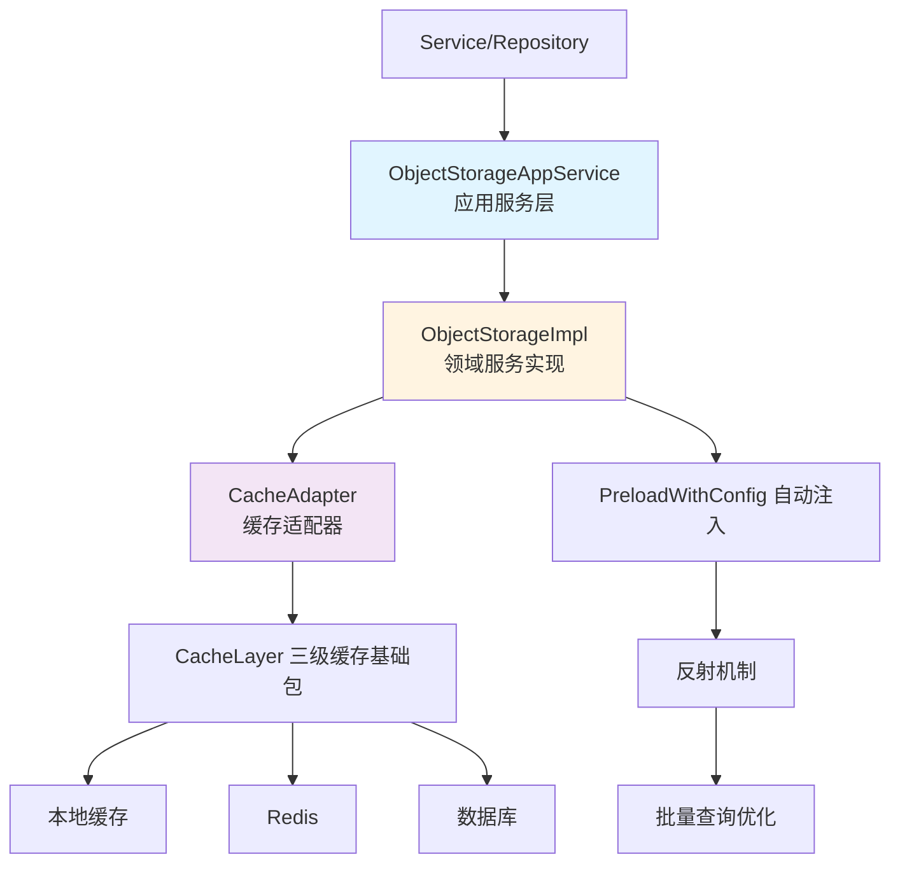

# 对象存储层 设计文档

> 本文档定义对象存储层的技术设计和实现方案。

## 📋 概述

对象存储层（Object Storage Layer）是一个统一的 DDD 模块，位于 `main/app/modules/objectstorage/` 模块中。该模块基于三级缓存基础包，提供统一的接口通过 key 获取模型对象，自动处理缓存查询、数据库回填和对象生命周期管理。

**设计目标**：
- 减少代码重复，统一缓存访问模式
- 集中管理对象生命周期，便于统一优化和调试
- 提供类型安全的泛型接口
- 支持多租户隔离（company 粒度）
- 支持配置映射自动关联注入

**在系统中的位置**：
```
main/
├── pkg/
│   ├── cache/              # 现有缓存实现（参考）
│   └── ...
└── app/
    ├── modules/
    │   └── objectstorage/  # 对象存储层模块（DDD 架构）
    │       ├── domain/      # 领域层
    │       │   ├── entity/  # 领域实体
    │       │   ├── repository/ # 仓储接口
    │       │   └── service/ # 领域服务
    │       ├── application/ # 应用层
    │       ├── infrastructure/ # 基础设施层
    │       │   ├── adapter/ # 适配器
    │       │   └── persistence/ # 持久化实现
    │       └── module.go    # 模块入口
    ├── service/            # 业务层（使用对象存储层）
    └── repository/         # 数据层（使用对象存储层）
```

---

## 🎯 规范对齐

### Go Main 规范 (go-main.mdc)

- ✅ **接口命名**：接口以 `I` 开头（如 `IObjectStorage`），实现以 `Impl` 结尾（如 `ObjectStorageImpl`）
- ✅ **依赖管理**：对象存储层依赖三级缓存基础包，不直接依赖数据库或业务 Service
- ✅ **错误处理**：不使用 panic，统一返回 error，使用 `errors.WithMessage` 包装错误
- ✅ **泛型支持**：使用 Go 1.18+ 泛型，提供类型安全
- ✅ **上下文传递**：所有方法支持 `context.Context`，便于链路追踪和超时控制

### API 设计规范 (api.mdc)

- ✅ 不涉及对外 API 接口（基础设施层，内部使用）

### 数据库规范 (database.mdc)

- ✅ 不涉及数据库表结构变更（使用现有数据库查询）

### 安全规范 (security.mdc)

- ✅ **多租户隔离**：Key 设计强制包含 company UUID，确保不同租户数据隔离
- ✅ **数据泄露防护**：防止因 key 构建错误导致的跨租户数据泄露
- ✅ **错误处理**：统一的错误处理策略，不泄露敏感信息

---

## 🔄 代码复用分析

### 可复用的现有组件

- **三级缓存基础包**：`main/pkg/cache/` - 提供 Redis 和本地缓存能力（参考实现）
- **Context 包**：`main/pkg/context/` - 提供 `GetCompanyUuid()` 方法，用于多租户隔离
- **现有缓存实现**：`main/app/repository/cache_data.go` - 参考现有的缓存使用模式
- **错误处理**：`main/app/errors/` - 使用统一的错误处理包

### 集成点

- **三级缓存基础包**：对象存储层依赖三级缓存基础包提供的 `GET` 方法
- **Context 包**：从 `context.Context` 中提取 company UUID
- **现有缓存**：参考 `main/pkg/cache/` 的实现模式

---

## 🏗️ 架构设计

### 分层设计原则

**对象存储层架构**:

```
业务层 (Service/Repository)
  ↓ 使用
对象存储层 (ObjectStorage)
  ↓ 依赖
三级缓存基础包 (CacheLayer)
  ↓ 使用
Redis / 本地缓存 / 数据库
```

**依赖规则**:

- ✅ 业务层可以依赖对象存储层（通过应用服务）
- ✅ 应用层依赖领域层
- ✅ 基础设施层实现领域层接口
- ✅ 对象存储层依赖三级缓存基础包（通过适配器）
- ❌ 领域层不依赖基础设施层（依赖倒置）
- ❌ 领域层不依赖具体业务逻辑
- ❌ 领域层不直接依赖数据库

### 架构图



### DDD 模块架构

对象存储层采用 DDD（领域驱动设计）架构，分为三层：

**领域层 (Domain)**:
- **实体 (Entity)**: `Association` - 关联配置实体
- **仓储接口 (Repository)**: `CacheLayer` - 缓存层接口定义
- **领域服务 (Service)**: `IObjectStorage` - 对象存储领域服务接口

**应用层 (Application)**:
- **应用服务**: `ObjectStorageAppService` - 提供业务场景的应用服务，如 `PreloadSaleBillAssociations`

**基础设施层 (Infrastructure)**:
- **适配器 (Adapter)**: `CacheAdapter` - 适配现有的 `cache.Cache` 接口
- **持久化 (Persistence)**: `ObjectStorageImpl` - 实现领域服务接口

### 模块划分

#### 对象存储层模块 (`main/app/modules/objectstorage/`)

**领域层 (Domain)**:
- **实体**: `domain/entity/association.go` - 定义 `Association` 关联配置实体
- **仓储接口**: `domain/repository/cache_layer.go` - 定义 `CacheLayer` 缓存层接口
- **领域服务**: `domain/service/object_storage.go` - 定义 `IObjectStorage` 接口和 `Config` 配置结构

**应用层 (Application)**:
- **应用服务**: `application/object_storage_app_service.go` - 提供 `PreloadSaleBillAssociations` 等应用服务方法

**基础设施层 (Infrastructure)**:
- **适配器**: `infrastructure/adapter/cache_adapter.go` - 适配现有的 `cache.Cache` 接口到 `CacheLayer` 接口
- **持久化实现**: `infrastructure/persistence/object_storage_impl.go` - 实现 `Get`、`BatchGet`、`Invalidate`、`Update`、`PreloadWithConfig` 等核心方法
- **工具方法**: `infrastructure/persistence/utils.go` - Key 构建、UUID 提取等工具方法

**模块入口**:
- **模块入口**: `module.go` - 提供模块的公共接口，便于外部使用

---

## 🗄️ 数据库设计

### 数据表设计

**不涉及数据库表结构变更**。对象存储层使用现有的数据库查询，通过 Repository 层获取数据。

---

## 📊 数据模型

### 接口定义

```go
// main/app/modules/objectstorage/domain/service/object_storage.go

package service

import (
    "context"
    "time"
    "ttpos-server-go/app/modules/objectstorage/domain/entity"
    "ttpos-server-go/app/modules/objectstorage/domain/repository"
)

// IObjectStorage 对象存储领域服务接口
type IObjectStorage[T any] interface {
    // Get 获取对象，自动处理缓存查询和回填
    // key 格式：{company_uuid}:{object_type}:{object_uuid}
    Get(ctx context.Context, key string, query func() (T, error)) (T, error)
    
    // BatchGet 批量获取对象
    BatchGet(ctx context.Context, keys []string, query func([]string) (map[string]T, error)) (map[string]T, error)
    
    // Invalidate 使缓存失效
    Invalidate(ctx context.Context, key string) error
    
    // Update 更新缓存
    Update(ctx context.Context, key string, value T) error
    
    // Warmup 预热缓存
    Warmup(ctx context.Context, keys []string, query func([]string) (map[string]T, error)) error
    
    // InvalidateByCompany 按 company 粒度批量失效缓存
    InvalidateByCompany(ctx context.Context, companyUuid uint64) error
    
    // InvalidateByCompanyAndType 按 company + object_type 粒度批量失效缓存
    InvalidateByCompanyAndType(ctx context.Context, companyUuid uint64, objectType string) error
    
    // UpdateByCompany 按 company 粒度批量更新缓存
    UpdateByCompany(ctx context.Context, companyUuid uint64, objectType string, values map[string]T) error
    
    // PreloadWithConfig 配置映射自动关联注入（推荐方式）
    PreloadWithConfig(ctx context.Context, obj interface{}, associations []entity.Association) error
}

// Config 配置选项
type Config struct {
    // TTL 缓存过期时间
    TTL time.Duration
    
    // DisableCache 是否禁用缓存（用于调试）
    DisableCache bool
    
    // KeyPrefix Key 前缀（自动包含 company UUID）
    KeyPrefix string
    
    // CacheLayer 三级缓存基础包实例
    CacheLayer repository.CacheLayer
    
    // ttlMap 不同对象类型的 TTL 配置
    ttlMap map[string]time.Duration
    mu     sync.RWMutex
}

// main/app/modules/objectstorage/domain/entity/association.go

package entity

import "context"

// Association 关联配置实体
type Association struct {
    // Path 关联路径，支持嵌套，如 "SaleBillSetting"、"SaleOrders.SaleOrderProducts.ProductPackage"
    Path string
    
    // ObjectType 对象类型，用于构建缓存 key
    ObjectType string
    
    // GetUUID 从对象中提取 UUID 的函数
    GetUUID func(obj interface{}) uint64
    
    // QueryFunc 单个对象查询函数
    QueryFunc func(ctx context.Context, uuid uint64) (interface{}, error)
    
    // BatchQueryFunc 批量查询函数（可选，用于性能优化）
    // 返回 map[uint64]interface{}，key 为 UUID，value 为对象
    BatchQueryFunc func(ctx context.Context, uuids []uint64) (map[uint64]interface{}, error)
}

// main/app/modules/objectstorage/domain/repository/cache_layer.go

package repository

import (
    "context"
    "time"
)

// CacheLayer 三级缓存基础包接口
type CacheLayer interface {
    // GET 方法：从缓存获取，未命中时调用 query 函数查询并写入缓存
    GET(key string, query func() (any, error)) (any, error)
    
    // SET 方法：设置缓存
    SET(key string, value any, ttl time.Duration) error
    
    // DEL 方法：删除缓存
    DEL(keys ...string) error
    
    // BATCH_GET 方法：批量获取缓存
    BATCH_GET(keys []string, query func([]string) (map[string]any, error)) (map[string]any, error)
    
    // SCAN 方法：扫描匹配模式的 key（可选，用于批量失效）
    SCAN(ctx context.Context, pattern string) ([]string, error)
}
```

### 实现结构

```go
// main/app/modules/objectstorage/infrastructure/persistence/object_storage_impl.go

package persistence

import (
    "context"
    "fmt"
    "ttpos-server-go/app/modules/objectstorage/domain/entity"
    "ttpos-server-go/app/modules/objectstorage/domain/service"
)

// ObjectStorageImpl 对象存储实现
type ObjectStorageImpl[T any] struct {
    config *service.Config
}

// NewObjectStorage 创建对象存储实例
func NewObjectStorage[T any](config *service.Config) service.IObjectStorage[T] {
    return &ObjectStorageImpl[T]{
        config: config,
    }
}

// Get 获取对象
func (s *ObjectStorageImpl[T]) Get(ctx context.Context, key string, query func() (T, error)) (T, error) {
    var zero T
    
    // 如果禁用缓存，直接调用查询函数
    if s.config.DisableCache {
        return query()
    }
    
    // 从三级缓存获取
    result, err := s.config.CacheLayer.GET(key, func() (any, error) {
        return query()
    })
    
    if err != nil {
        return zero, err
    }
    
    // 类型断言
    if typed, ok := result.(T); ok {
        return typed, nil
    }
    
    return zero, fmt.Errorf("类型断言失败: 期望 %T，实际 %T", zero, result)
}

// PreloadWithConfig 配置映射自动关联注入
func (s *ObjectStorageImpl[T]) PreloadWithConfig(ctx context.Context, obj interface{}, associations []entity.Association) error {
    // 实现自动注入逻辑
    // 1. 解析路径
    // 2. 反射查找字段
    // 3. 提取 UUID
    // 4. 批量查询
    // 5. 递归注入
    // ...（详细实现见 object_storage_impl.go）
    return nil
}

// main/app/modules/objectstorage/infrastructure/persistence/utils.go

package persistence

import (
    "context"
    "fmt"
    "strings"
    bizctx "ttpos-server-go/pkg/context"
)

// BuildKey 构建 key 的辅助方法（自动从 context 提取 company UUID）
func BuildKey(ctx context.Context, objectType string, objectUuid uint64) string {
    companyUuid := bizctx.GetCompanyUuid(ctx)
    return fmt.Sprintf("%d:%s:%d", companyUuid, objectType, objectUuid)
}

// main/app/modules/objectstorage/application/object_storage_app_service.go

package application

import (
    "context"
    "ttpos-server-go/app/modules/objectstorage/domain/entity"
    "ttpos-server-go/app/model"
    "gorm.io/gorm"
)

// IObjectStorageAppService 对象存储应用服务接口
type IObjectStorageAppService interface {
    // PreloadSaleBillAssociations 自动注入 SaleBill 的关联对象
    PreloadSaleBillAssociations(ctx context.Context, saleBill *model.SaleBill, db *gorm.DB) error
    
    // GetSaleBillAssociations 获取 SaleBill 的关联配置
    GetSaleBillAssociations(ctx context.Context, db *gorm.DB) []entity.Association
}
```

---

## 🔌 API 设计

### 内部接口（不涉及对外 API）

对象存储层作为基础设施层，不提供对外 HTTP API，只提供内部 Go 接口供 Service 和 Repository 层使用。

---

## 🧩 组件和接口

### 核心接口

#### IObjectStorage 接口

```go
// main/app/modules/objectstorage/domain/service/object_storage.go
type IObjectStorage[T any] interface {
    Get(ctx context.Context, key string, query func() (T, error)) (T, error)
    BatchGet(ctx context.Context, keys []string, query func([]string) (map[string]T, error)) (map[string]T, error)
    Invalidate(ctx context.Context, key string) error
    Update(ctx context.Context, key string, value T) error
    Warmup(ctx context.Context, keys []string, query func([]string) (map[string]T, error)) error
    InvalidateByCompany(ctx context.Context, companyUuid uint64) error
    InvalidateByCompanyAndType(ctx context.Context, companyUuid uint64, objectType string) error
    UpdateByCompany(ctx context.Context, companyUuid uint64, objectType string, values map[string]T) error
    PreloadWithConfig(ctx context.Context, obj interface{}, associations []entity.Association) error
}
```

#### Association 配置结构

```go
// main/app/modules/objectstorage/domain/entity/association.go
type Association struct {
    Path          string
    ObjectType    string
    GetUUID       func(obj interface{}) uint64
    QueryFunc     func(ctx context.Context, uuid uint64) (interface{}, error)
    BatchQueryFunc func(ctx context.Context, uuids []uint64) (map[uint64]interface{}, error)
}
```

### 实现类

#### ObjectStorageImpl

- **文件路径**: `main/app/modules/objectstorage/infrastructure/persistence/object_storage_impl.go`
- **职责**: 实现核心的对象存储逻辑和自动关联注入
- **依赖**: `service.Config`、`repository.CacheLayer`（三级缓存基础包）

#### CacheAdapter

- **文件路径**: `main/app/modules/objectstorage/infrastructure/adapter/cache_adapter.go`
- **职责**: 适配现有的 `cache.Cache` 接口到 `CacheLayer` 接口
- **依赖**: `pkg/cache.Cache`

#### ObjectStorageAppService

- **文件路径**: `main/app/modules/objectstorage/application/object_storage_app_service.go`
- **职责**: 提供应用服务接口，封装对象存储层的使用
- **依赖**: `service.IObjectStorage`、`database.DBManager`

---

## ⚡ 缓存设计

### 三级缓存策略

**缓存层级**：
1. **本地缓存**（L1）：进程内内存缓存，最快，但只对当前进程有效
2. **Redis 缓存**（L2）：分布式缓存，跨进程共享
3. **数据库**（L3）：持久化存储，最慢但最可靠

**查询流程**：
```
Get(key) → L1 本地缓存 → 命中返回
         ↓ 未命中
         → L2 Redis 缓存 → 命中返回并写入 L1
         ↓ 未命中
         → L3 数据库查询 → 返回并写入 L2 和 L1
```

### Key 设计规范

**Key 格式**: `{company_uuid}:{object_type}:{object_uuid}`

**示例**:
- `1724054084:product_package:123456` - 商品包对象
- `1724054084:desk:789012` - 桌台对象
- `1724054084:sale_bill_setting:345678` - 销售账单设置对象

**Key 构建辅助方法**:
```go
func BuildKey(ctx context.Context, objectType string, objectUuid uint64) string {
    companyUuid := ctx.GetCompanyUuid()
    return fmt.Sprintf("%d:%s:%d", companyUuid, objectType, objectUuid)
}
```

### 缓存策略配置

**不同对象的 TTL 配置**:
- `ProductPackage`: 1 小时（配置类，变更频率低）
- `Desk`: 30 分钟（基础数据，变更频率中等）
- `SaleBillSetting`: 5 分钟（业务数据，变更频率较高）
- `MultiLanguageName`: 24 小时（多语言名称，变更频率极低）

**配置方式**:
```go
import (
    "ttpos-server-go/app/modules/objectstorage"
    "ttpos-server-go/pkg/cache"
    "ttpos-server-go/pkg/database"
)

// 创建应用服务（自动配置 TTL）
objectStorageAppService := objectstorage.NewObjectStorageAppService(
    cache.Global,
    dbm,
)

// 或者直接使用领域服务（需要手动配置）
cacheAdapter := adapter.NewCacheAdapter(cache.Global)
config := &service.Config{
    TTL: 5 * time.Minute,
    CacheLayer: cacheAdapter,
}
config.SetTTL("product_package", 1*time.Hour)
config.SetTTL("desk", 30*time.Minute)

objectStorage := persistence.NewObjectStorage[*model.ProductPackage](config)
```

---

## 🚨 错误处理

### 错误场景

#### 场景 1: 缓存查询失败

- **处理方式**: 优雅降级，直接调用查询函数
- **用户影响**: 无影响，只是性能略有下降
- **代码示例**:
  ```go
  result, err := s.config.CacheLayer.GET(key, query)
  if err != nil {
      // 缓存失败，直接查询数据库
      return query()
  }
  ```

#### 场景 2: 类型断言失败

- **处理方式**: 返回明确的错误信息
- **用户影响**: 返回错误，记录日志
- **代码示例**:
  ```go
  if typed, ok := result.(T); ok {
      return typed, nil
  }
  return zero, fmt.Errorf("类型断言失败: 期望 %T，实际 %T", zero, result)
  ```

#### 场景 3: 多租户数据隔离失败

- **处理方式**: 严格检查 Key 格式，确保包含 company UUID
- **用户影响**: 防止跨租户数据泄露
- **代码示例**:
  ```go
  // BuildKey 方法自动包含 company UUID
  key := BuildKey(ctx, objectType, objectUuid)
  // 验证 key 格式
  if !strings.HasPrefix(key, fmt.Sprintf("%d:", ctx.GetCompanyUuid())) {
      return fmt.Errorf("Key 格式错误，缺少 company UUID")
  }
  ```

#### 场景 4: PreloadWithConfig 注入失败

- **处理方式**: 单个关联查询失败不影响其他关联的注入
- **用户影响**: 部分关联对象可能为空，但不影响主流程
- **代码示例**:
  ```go
  for _, assoc := range associations {
      if err := s.injectAssociation(ctx, obj, assoc); err != nil {
          // 记录错误，但继续处理其他关联
          logger.Logger.Warn("关联注入失败", zap.String("path", assoc.Path), zap.Error(err))
          continue
      }
  }
  ```

---

## 🔒 安全设计

### 多租户隔离

- **Key 设计**: 强制包含 company UUID，格式：`{company_uuid}:{object_type}:{object_uuid}`
- **自动提取**: `BuildKey` 方法自动从 context 提取 company UUID
- **验证机制**: 在关键操作前验证 Key 格式，确保包含 company UUID

### 数据泄露防护

- **Key 验证**: 所有 Key 操作前验证格式
- **单元测试**: 覆盖多租户场景，确保不会出现跨租户数据泄露
- **日志记录**: 记录所有缓存操作，便于排查问题

---

## 🧪 测试策略

### 单元测试

**目标覆盖率**:
- `main/app/modules/objectstorage`: 80%+

**测试内容**:
- Get/BatchGet 方法
- Invalidate/Update 方法
- PreloadWithConfig 自动注入
- 多租户隔离
- 错误处理

**示例**:
```go
// main/app/modules/objectstorage/infrastructure/persistence/object_storage_impl_test.go
func TestObjectStorage_Get(t *testing.T) {
    // 测试实现
}

func TestObjectStorage_BatchGet(t *testing.T) {
    // 测试实现
}

func TestObjectStorage_PreloadWithConfig(t *testing.T) {
    // 测试自动注入
}

func TestObjectStorage_MultiTenantIsolation(t *testing.T) {
    // 测试多租户隔离
}

// main/app/modules/objectstorage/application/object_storage_app_service_test.go
func TestObjectStorageAppService_PreloadSaleBillAssociations(t *testing.T) {
    // 测试应用服务
}
```

### 集成测试

**测试流程**:
- 端到端缓存查询流程
- 三级缓存逐级查询
- 批量查询优化
- 自动注入功能

---

## 💡 使用示例

### 基本使用

```go
import (
    "ttpos-server-go/app/modules/objectstorage"
    "ttpos-server-go/pkg/cache"
    "ttpos-server-go/pkg/database"
)

// 1. 初始化应用服务
objectStorageAppService := objectstorage.NewObjectStorageAppService(
    cache.Global,
    dbm,
)

// 2. 获取 SaleBill（不使用 GORM Preload）
saleBill, err := repo.GetSaleBill(CommonRepo.WhereByUuid(saleBillUuid))
if err != nil {
    return err
}

// 3. 使用对象存储层自动注入关联对象
err = objectStorageAppService.PreloadSaleBillAssociations(ctx, &saleBill, db)
if err != nil {
    return err
}

// 现在 saleBill 对象已经包含了所有通过对象存储层获取的关联对象
// - saleBill.SaleBillSetting
// - saleBill.Desk
// - saleBill.SaleOrders[].SaleOrderProducts[].ProductPackage
// - saleBill.SaleOrders[].SaleOrderProducts[].MultiLanguageName
// - saleBill.SaleOrders[].SaleOrderProducts[].ProductPackage.ProductCategory
```

### 自定义关联配置

```go
// 获取关联配置
associations := objectStorageAppService.GetSaleBillAssociations(ctx, db)

// 可以添加自定义关联
customAssociations := append(associations, entity.Association{
    Path:       "SaleOrders.SaleOrderProducts.BatchTag",
    ObjectType: "batch_tag",
    GetUUID: func(obj interface{}) uint64 {
        return obj.(*model.SaleOrderProduct).BatchTagUuid
    },
    QueryFunc: func(ctx context.Context, uuid uint64) (interface{}, error) {
        return batchTagRepo.GetBatchTag(uuid)
    },
})

// 使用自定义配置注入
objectStorage := persistence.NewObjectStorage[*model.SaleBill](config)
err = objectStorage.PreloadWithConfig(ctx, &saleBill, customAssociations)
```

### 直接使用领域服务

```go
import (
    "ttpos-server-go/app/modules/objectstorage/infrastructure/adapter"
    "ttpos-server-go/app/modules/objectstorage/infrastructure/persistence"
    "ttpos-server-go/app/modules/objectstorage/domain/service"
)

// 创建缓存适配器
cacheAdapter := adapter.NewCacheAdapter(cache.Global)

// 创建配置
config := &service.Config{
    TTL:          5 * time.Minute,
    DisableCache: false,
    CacheLayer:   cacheAdapter,
}
config.SetTTL("product_package", 1*time.Hour)

// 创建对象存储实例
productPackageStorage := persistence.NewObjectStorage[*model.ProductPackage](config)

// 使用
key := persistence.BuildKey(ctx, "product_package", uuid)
productPackage, err := productPackageStorage.Get(ctx, key, func() (*model.ProductPackage, error) {
    return repo.GetProductPackage(uuid)
})
```

---

## 📈 性能优化

### 优化策略

1. **批量查询优化**:
   - 自动收集同一层级的 UUID，批量查询
   - 减少网络开销和数据库查询次数

2. **缓存预热**:
   - 支持 `Warmup` 方法，提前加载热点数据
   - 减少首次查询延迟

3. **并发控制**:
   - 使用 sync.Map 或 channel 避免并发冲突
   - 确保并发安全

4. **类型安全**:
   - 使用泛型避免类型转换开销
   - 编译时类型检查

### 性能指标

- 缓存命中时响应时间: < 10ms
- 缓存未命中时响应时间: < 200ms（包含数据库查询）
- 批量查询性能: 比单个查询提升 50%+
- 缓存命中率: > 80%

---

## 📚 实现清单

### Phase 1: 接口设计和核心实现

- [x] 创建 `main/app/modules/objectstorage/` 模块（DDD 架构）
- [x] 定义 `IObjectStorage` 接口（领域服务）
- [x] 定义 `Association` 配置结构（领域实体）
- [x] 实现 `ObjectStorageImpl` 核心方法（Get、BatchGet、Invalidate、Update）
- [x] 实现 `BuildKey` 辅助方法

### Phase 2: 生命周期管理

- [x] 实现 `Invalidate`、`Update`、`Warmup` 方法
- [x] 实现按 company 粒度批量失效和更新
- [x] 实现 TTL 配置管理

### Phase 3: 自动关联注入

- [x] 实现 `PreloadWithConfig` 方法
- [x] 实现路径解析（支持嵌套路径）
- [x] 实现反射机制（字段查找和设置）
- [x] 实现批量查询优化

### Phase 4: 测试和文档

- [ ] 编写单元测试（覆盖率 ≥ 80%）
- [ ] 编写集成测试
- [ ] 编写使用示例和最佳实践
- [x] 更新项目文档

### Phase 5: 集成和重构

- [x] 将对象存储层迁移到 `modules/objectstorage` 模块
- [x] 按照 DDD 架构组织代码
- [x] 创建应用服务层
- [x] 删除旧的 `pkg/objectstorage` 目录

**详细任务**: 参见 `tasks.md`

---

## Graphiti & 活动日志

- Related Episode: `[待补充]`
- 模板：`docs/agent/templates/graphiti-episode.md`
- 活动日志：`docs/team/activities/{YYYY-MM}/{YYYY-MM-DD}.md`
- 在技术方案评审、关键架构决策或踩坑总结后，立即补充 Episode 并在设计文档尾部互链。

---

**版本**: v1.1.0  
**创建日期**: 2025-12-24  
**更新日期**: 2025-12-24  
**作者**: xiezhihuan  
**审核者**: {审核者}

**更新日志**:
- v1.1.0 (2025-12-24): 将对象存储层从 `pkg/objectstorage` 迁移到 `modules/objectstorage` 模块，采用 DDD 架构设计
- v1.0.0 (2025-12-24): 初始版本，完成核心功能设计和实现

