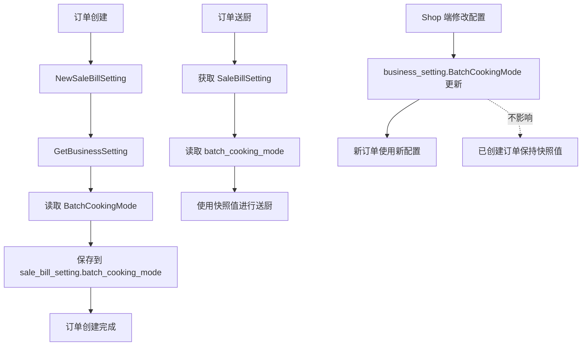

# 订单分批送厨模式快照 设计文档

> 本文档定义订单分批送厨模式快照功能的技术设计和实现方案。

## 📋 概述

订单分批送厨模式快照功能通过在 `sale_bill_setting` 表中记录订单创建时的分批送厨模式，确保订单在整个生命周期内行为一致，不受后续全局配置变更影响。

**核心设计原则**：
- 订单创建时快照：创建订单时，将当前 `business_setting.BatchCookingMode` 的值保存到 `sale_bill_setting.batch_cooking_mode`
- 订单使用快照值：订单的送厨逻辑使用 `sale_bill_setting.batch_cooking_mode`，不再读取全局配置
- 新订单才生效：只有新创建的订单才会使用新的分批送厨模式，已创建的订单保持原有模式

---

## 🎯 规范对齐

### Go Main 规范 (go-main.mdc)

- ✅ Service 只依赖其他 Service 接口（`ISettingSrv`）
- ✅ Repository 只持有 db 实例
- ✅ 不使用 panic，返回 error
- ✅ 使用 `errors.WithMessage` 包装错误

### 数据库规范 (database.mdc)

- ✅ 字段名使用 snake_case：`batch_cooking_mode`
- ✅ 时间字段使用 int 类型
- ✅ 表名使用 ttpos\_ 前缀：`ttpos_sale_bill_setting`
- ✅ 字段类型：VARCHAR(10)，默认值 'post'

### API 设计规范 (api.mdc)

- ✅ data 字段必须是对象
- ✅ 响应格式统一：`{code, message, data{}}`

---

## 🔄 代码复用分析

### 可复用的现有组件

- **ISettingSrv**: `main/app/service/setting/setting.go` - 获取业务设置
- **NewSaleBillSetting**: `main/app/service/order.go` - 创建销售账单设置
- **SaleBillSetting Model**: `main/app/model/order.go` - 数据模型
- **常量定义**: `main/app/constant/setting.go` - BatchCookingModePre, BatchCookingModePost

### 需要修改的代码位置

1. **订单创建逻辑**:
   - `main/app/service/order.go` - `NewSaleBillSetting` 函数（第 408-544 行）

2. **送厨逻辑**（需要从 `business_setting` 改为 `sale_bill_setting`）:
   - `main/app/service/order_action.go` - `ActionCooking` 函数（第 120-154 行）
   - `main/app/service/order_product.go` - `InstantOrderCartProductCooking` 函数（第 501-551 行）
   - `main/app/service/order_product.go` - `updateProductBatchFlagToZero` 函数（第 588 行）
   - `main/app/service/order.go` - 订单商品创建逻辑（第 1774 行）

3. **响应 DTO**:
   - `main/app/dto/resp/shop_cart.go` - `BatchCookingMode` 字段（第 167 行）

---

## 🏗️ 架构设计

### 分层设计原则

**Go Main 三层架构**:

```
API 层 (Controller/API)
  ↓ 依赖
业务层 (Service)
  ↓ 依赖
数据层 (Repository)
```

**依赖规则**:
- ✅ Service 可以依赖其他 Service 接口（`ISettingSrv`）
- ✅ Repository 只持有 db 实例
- ✅ 订单创建时从 `ISettingSrv.GetBusinessSetting()` 读取配置
- ✅ 送厨时从 `SaleBillSetting` 模型读取快照值

### 数据流设计



---

## 🗄️ 数据库设计

### 数据表修改

#### 表: ttpos_sale_bill_setting

**新增字段**:

```sql
ALTER TABLE `ttpos_sale_bill_setting` 
ADD COLUMN `batch_cooking_mode` VARCHAR(10) NOT NULL DEFAULT 'post' 
COMMENT '分批送厨模式: pre-前置 / post-后置，默认 post' 
AFTER `auto_points_exchange`;
```

**字段说明**:
| 字段 | 类型 | 说明 | 约束 |
|------|------|------|------|
| batch_cooking_mode | VARCHAR(10) | 分批送厨模式: pre-前置 / post-后置 | NOT NULL, DEFAULT 'post' |

**数据迁移**:

```sql
-- 为历史订单设置默认值
UPDATE `ttpos_sale_bill_setting` 
SET `batch_cooking_mode` = 'post' 
WHERE `batch_cooking_mode` IS NULL OR `batch_cooking_mode` = '';
```

**迁移文件**: `admin/database/migrations/{YYYYMMDDHHMMSS}_add_batch_cooking_mode_to_sale_bill_setting.php`

---

## 📊 数据模型

### Go Model

```go
// main/app/model/order.go
type SaleBillSetting struct {
    // ... 现有字段 ...
    
    // 积分抵扣设置
    OpenPointsExchange uint    `gorm:"column:open_points_exchange;type:tinyint(1);default:0;comment:是否开启积分抵扣, 0-不开启 1-开启" json:"open_points_exchange"`
    PointsExchangeRate float64 `gorm:"column:points_exchange_rate;type:decimal(12,2);default:0;comment:积分汇率，每积分抵扣的金额，可输入大于0的两位小数" json:"points_exchange_rate"`
    AutoPointsExchange uint    `gorm:"column:auto_points_exchange;type:tinyint(1);default:0;comment:积分抵扣类型,0-手动抵扣 1-自动抵扣" json:"auto_points_exchange"`
    
    // 分批送厨模式（新增）
    BatchCookingMode string `gorm:"column:batch_cooking_mode;type:varchar(10);default:'post';comment:分批送厨模式: pre-前置 / post-后置，默认 post" json:"batch_cooking_mode"`
}
```

### DTO 定义

#### Response DTO（已存在，无需修改）

```go
// main/app/dto/resp/shop_cart.go
type ShopCart struct {
    // ... 现有字段 ...
    BatchCookingMode string `json:"batch_cooking_mode"` // 分批送厨的模式 "post"：后置模式 "pre"：前置模式
}
```

**注意**: `shop_cart.go` 中的 `BatchCookingMode` 字段已存在，但当前返回的是 `business_setting` 的值。需要修改为返回 `sale_bill_setting.batch_cooking_mode` 的值。

---

## 🔌 API 设计

### 无需新增 API

本功能不涉及新增 API 接口，主要是：
1. 数据库字段扩展
2. 订单创建逻辑修改
3. 送厨逻辑修改
4. 响应数据修改

### 现有 API 响应变更

**API**: `/api/v1/cashier/order_cart_info` 等订单相关接口

**响应变更**:
- `shop_cart.batch_cooking_mode` 字段的值来源从 `business_setting` 改为 `sale_bill_setting.batch_cooking_mode`

---

## 🧩 组件和接口

### Service 层修改

#### 修改 NewSaleBillSetting 函数

```go
// main/app/service/order.go
func (s *orderSrv) NewSaleBillSetting(ctx context.Context, saleBillUuid uint64, deskUuid uint64, isMember bool) (*model.SaleBillSetting, error) {
    // ... 现有代码 ...
    
    // 获取门店业务设置
    businessSetting, err := s.settingSrv.GetBusinessSetting(ctx)
    if err != nil {
        return nil, errors.WithMessage(err)
    }
    
    // ... 现有代码 ...
    
    // 分批送厨模式（新增）
    batchCookingMode := businessSetting.BatchCookingMode
    if batchCookingMode == "" {
        batchCookingMode = constant.BatchCookingModePost // 默认值
    }
    
    saleBillSetting := model.SaleBillSetting{
        // ... 现有字段 ...
        BatchCookingMode: batchCookingMode, // 新增字段
    }
    
    // ... 现有代码 ...
    
    return &saleBillSetting, nil
}
```

#### 修改送厨逻辑

**修改点 1**: `order_action.go` - `ActionCooking` 函数

```go
// main/app/service/order_action.go
func (s *orderSrv) ActionCooking(ctx context.Context, ignoreMust bool, saleBill *model.SaleBill, unCookingSaleOrderProducts []*model.SaleOrderProduct, h5OrderUuid uint64, isAutoOrder bool, options ...func(option *ActionCookingOption)) (*resp.OrderCheckServiceRes, error) {
    // ... 现有代码 ...
    
    // 从 sale_bill_setting 中获取分批送厨模式（修改）
    saleBillSetting, err := repository.NewOrderRepo(db).GetSaleBillSettingBySaleBillUuid(saleBill.Uuid)
    if err != nil {
        return nil, errors.WithMessage(err)
    }
    batchCookingMode := saleBillSetting.BatchCookingMode
    if batchCookingMode == "" {
        batchCookingMode = constant.BatchCookingModePost // 默认值
    }
    
    // ... 使用 batchCookingMode 替代 businessSetting.BatchCookingMode ...
}
```

**修改点 2**: `order_product.go` - `InstantOrderCartProductCooking` 函数

```go
// main/app/service/order_product.go
func (s *orderSrv) InstantOrderCartProductCooking(ctx context.Context, req req.OrderCartProductCookingReq) (*resp.ShopCart, *resp.OrderCheckServiceRes, error) {
    defer func() {
        // 助手端前置模式：分批送厨（每次点击下单都送优先级最高的分批类型）
        if ctx.GetSource() == constant.SourceAssistant {
            // 从 sale_bill_setting 中获取分批送厨模式（修改）
            saleBill, err := repository.NewOrderRepo(s.dbm.GetDB(ctx.GetDbId())).GetSaleBillAllInfo(req.SaleBillUuid)
            if err != nil {
                ctx.Log().Info("获取销售账单失败,导致不能分批送厨", zap.Error(err))
                return
            }
            saleBillSetting, err := repository.NewOrderRepo(s.dbm.GetDB(ctx.GetDbId())).GetSaleBillSettingBySaleBillUuid(req.SaleBillUuid)
            if err != nil {
                ctx.Log().Info("获取销售账单设置失败,导致不能分批送厨", zap.Error(err))
                return
            }
            batchCookingMode := saleBillSetting.BatchCookingMode
            if batchCookingMode == "" {
                batchCookingMode = constant.BatchCookingModePost
            }
            if batchCookingMode == constant.BatchCookingModePre {
                // 异步执行分批送厨，不阻塞流程
                utils.Go(func() {
                    ctx := ctx.Copy()
                    if err := s.AutoSendCookingByPriority(ctx, req.SaleBillUuid); err != nil {
                        ctx.Log().Error("分批送厨失败", zap.Error(err))
                    }
                })
            }
        }
    }()
    
    // ... 现有代码 ...
}
```

**修改点 3**: `order.go` - 订单商品创建逻辑

```go
// main/app/service/order.go
// 在创建订单商品时，需要从 sale_bill_setting 获取 batch_cooking_mode
// 但此时 sale_bill_setting 可能还未创建，需要从 business_setting 读取（仅用于创建时）
// 创建完成后，后续逻辑都使用 sale_bill_setting.batch_cooking_mode
```

---

## ⚡ 缓存设计

### 无需新增缓存

本功能不涉及缓存设计，因为：
- `sale_bill_setting` 数据在订单创建时写入，后续只读
- 送厨时直接从数据库读取 `sale_bill_setting`，性能影响可接受

---

## 🚨 错误处理

### 错误场景

#### 场景 1: sale_bill_setting 不存在

- **处理方式**: 使用默认值 "post"
- **用户影响**: 订单正常送厨，使用后置模式
- **代码示例**:
  ```go
  saleBillSetting, err := repo.GetSaleBillSettingBySaleBillUuid(saleBillUuid)
  if err != nil {
      // 使用默认值
      batchCookingMode = constant.BatchCookingModePost
  } else {
      batchCookingMode = saleBillSetting.BatchCookingMode
      if batchCookingMode == "" {
          batchCookingMode = constant.BatchCookingModePost
      }
  }
  ```

#### 场景 2: batch_cooking_mode 字段为空

- **处理方式**: 使用默认值 "post"
- **用户影响**: 订单正常送厨，使用后置模式
- **代码示例**:
  ```go
  if batchCookingMode == "" {
      batchCookingMode = constant.BatchCookingModePost
  }
  ```

---

## 🔒 安全设计

### 无需新增安全措施

本功能不涉及新增安全风险，主要是数据字段扩展和逻辑修改。

---

## 🧪 测试策略

### 单元测试

**目标覆盖率**:
- `main/app/service/order.go` - `NewSaleBillSetting`: 100%（Order 相关）
- `main/app/service/order_action.go` - `ActionCooking`: 100%（Order 相关）
- `main/app/service/order_product.go` - `InstantOrderCartProductCooking`: 100%（Order 相关）

**测试内容**:
- 订单创建时正确保存 `batch_cooking_mode`
- 送厨时正确使用 `sale_bill_setting.batch_cooking_mode`
- 历史订单兼容性（字段为空时使用默认值）
- 配置变更不影响已创建订单

### 集成测试

**测试流程**:
1. 创建订单（前置模式）→ 验证 `batch_cooking_mode` = "pre"
2. 修改全局配置为后置模式
3. 送厨已创建订单 → 验证仍使用前置模式
4. 创建新订单 → 验证使用后置模式

---

## 📈 性能优化

### 优化策略

1. **数据库查询优化**:
   - `GetSaleBillSettingBySaleBillUuid` 使用 `sale_bill_uuid` 索引
   - 查询时只查询必要字段

2. **查询合并**:
   - 在 `GetSaleBillAllInfo` 中同时查询 `sale_bill_setting`，避免多次查询

---

## 📚 实现清单

### Phase 1: 数据库和模型

- [ ] 创建数据库迁移文件
- [ ] 执行数据库迁移
- [ ] 更新 Go Model（添加 `BatchCookingMode` 字段）
- [ ] 为历史数据设置默认值

### Phase 2: 订单创建逻辑

- [ ] 修改 `NewSaleBillSetting` 函数，保存 `batch_cooking_mode`
- [ ] 测试订单创建逻辑

### Phase 3: 送厨逻辑修改

- [ ] 修改 `ActionCooking` 函数
- [ ] 修改 `InstantOrderCartProductCooking` 函数
- [ ] 修改 `updateProductBatchFlagToZero` 函数
- [ ] 修改订单商品创建逻辑
- [ ] 修改响应 DTO 数据来源

### Phase 4: 测试和优化

- [ ] 单元测试
- [ ] 集成测试
- [ ] 回归测试
- [ ] 性能测试

**详细任务**: 参见 `tasks.md`

---

## Graphiti & 活动日志

- Related Episode: `[待补充]`
- 模板：`docs/agent/templates/graphiti-episode.md`
- 活动日志：`docs/team/activities/{YYYY-MM}/{YYYY-MM-DD}.md`
- 在技术方案评审、关键架构决策或踩坑总结后，立即补充 Episode 并在设计文档尾部互链。

---

**版本**: v1.0.0  
**创建日期**: 2025-12-02  
**作者**: xiezhihuan  
**审核者**: {审核者}

