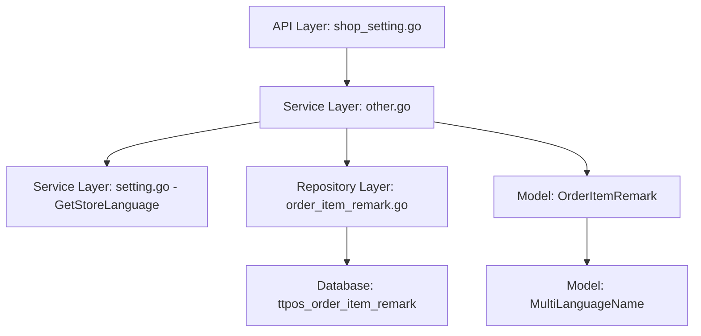

# 单品备注原因管理 设计文档

> 本文档定义单品备注原因管理的技术设计和实现方案。

## 📋 概述

参考"整单备注"的实现逻辑，为"单品备注"添加原因管理功能。在旧商户后台（PHP）和新管理端（Go）的业务设置中，新增"单品备注"原因管理模块，支持多语言、增删改查等操作，与"整单备注"逻辑保持一致。

**本次仅实现后端 API，前端界面后续实现。**

---

## 🎯 规范对齐

### Go Main 规范 (go-main.mdc)

- Service 只依赖其他 Service 接口（如 `ISettingSrv`）
- Repository 只持有 db 实例，不持有 DBManager
- URL 使用 snake_case（`/shop/setting/order_item_remark`）
- data 字段必须是对象
- 不使用 panic，返回 error
- 使用 errors.WithMessage 包装错误

### PHP 规范 (php.mdc)

- 遵循 MVC 分层
- Controller 不写业务逻辑，调用 Model 方法
- 使用验证器验证参数（ValidateHelp）
- 使用软删除（delete_time 字段）

### API 设计规范 (api.mdc)

- URL 使用 snake_case
- 响应格式统一：`{code, message, data{}}`
- data 不能为 null 或数组，必须是对象

### 数据库规范 (database.mdc)

- 必需字段：`id`, `uuid`, `create_time`, `update_time`, `delete_time`
- 时间字段使用 int 类型，\_time 结尾，默认值 0
- UUID 字段使用 bigint unsigned
- 表名使用 ttpos\_ 前缀（`ttpos_order_item_remark`）
- 字段名使用 snake_case

---

## 🔄 代码复用分析

### 可复用的现有组件

- **OrderRemark 相关实现**: 
  - Repository: `main/app/repository/base/order_remark.go` - 参考实现逻辑
  - Service: `main/app/service/other.go` (AddOrderRemark, EditOrderRemark, DeleteOrderRemark, GetOrderRemarkList) - 参考业务逻辑
  - API: `main/app/api/v1/shop/shop_setting.go` (GetOrderRemark, AddOrderRemark, EditOrderRemark, DeleteOrderRemark) - 参考接口设计
  - Model: `main/app/model/reason.go` (OrderRemark) - 参考模型结构
  - DTO: `main/app/dto/req/shop.go` (AddOrderRemarkReq, EditOrderRemarkReq, DeleteOrderRemarkReq) - 参考请求结构
  - DTO: `main/app/dto/resp/order_remark.go` (OrderRemarkResp) - 参考响应结构

- **多语言验证逻辑**: 
  - `main/app/service/other.go` 中的多语言验证逻辑（CheckRequiredLocale, CheckLen）
  - `main/app/service/setting/setting.go` 中的 GetStoreLanguage 方法

- **PHP 实现**: 
  - `admin/app/shop/controller/setting/Business.php` (orderRemark 方法) - 参考批量增删改逻辑
  - `admin/app/shop/model/setting/OrderRemark.php` - 参考 Model 实现

### 集成点

- **现有 API**: 复用现有的多语言验证和权限验证逻辑
- **数据库表**: 参考 `order_remark` 表结构，但添加 id 主键，移除 app_id 和 shop_supplier_id
- **权限验证**: 与"整单备注"权限处理逻辑一致

---

## 🏗️ 架构设计

### 分层设计原则

**Go Main 三层架构**:

```
API 层 (Controller/API)
  ↓ 依赖
业务层 (Service)
  ↓ 依赖
数据层 (Repository)
```

**依赖规则**:

- ✅ 上层可依赖下层
- ❌ 禁止下层依赖上层
- ❌ 禁止跨层调用
- ❌ Service 不能依赖 Repository
- ✅ Service 可以依赖其他 Service 接口（如 ISettingSrv）

### 架构图



### 模块划分

#### Go Main 模块

- **API 层**: `main/app/api/v1/shop/shop_setting.go` - 路由处理、参数校验
- **Service 层**: `main/app/service/other.go` - 业务逻辑、事务管理
- **Repository 层**: `main/app/repository/base/order_item_remark.go` - 数据访问、数据库操作
- **Model 层**: `main/app/model/reason.go` - 数据模型（添加 OrderItemRemark）
- **DTO 层**: `main/app/dto/` - 数据传输对象
  - `req/shop.go` - 请求参数（添加 OrderItemRemark 相关请求）
  - `resp/order_item_remark.go` - 响应数据（新建文件）

#### PHP Admin 模块

- **Controller 层**: `admin/app/shop/controller/setting/Business.php` - 控制器（添加 orderItemRemark 方法）
- **Model 层**: `admin/app/shop/model/setting/OrderItemRemark.php` - 数据模型（新建文件）

---

## 🗄️ 数据库设计

### 数据表设计

#### 表 1: order_item_remark

```sql
CREATE TABLE IF NOT EXISTS `ttpos_order_item_remark` (
    `id` bigint unsigned NOT NULL AUTO_INCREMENT COMMENT '主键ID',
    `uuid` bigint unsigned NOT NULL DEFAULT 0 COMMENT '唯一标识',
    `name` varchar(255) NOT NULL DEFAULT '' COMMENT '名称',
    `multi_language_name_uuid` bigint unsigned NOT NULL DEFAULT 0 COMMENT '多语言名称ID',
    `create_time` int NOT NULL DEFAULT 0 COMMENT '创建时间(时间戳)',
    `update_time` int NOT NULL DEFAULT 0 COMMENT '更新时间(时间戳)',
    `delete_time` int NOT NULL DEFAULT 0 COMMENT '删除时间(时间戳)',
    PRIMARY KEY (`id`),
    UNIQUE KEY `uk_uuid` (`uuid`),
    KEY `idx_delete_time` (`delete_time`)
) ENGINE=InnoDB DEFAULT CHARSET=utf8mb4 COMMENT='单品备注原因表';
```

**字段说明**:
| 字段 | 类型 | 说明 | 约束 |
|------|------|------|------|
| id | bigint unsigned | 主键 ID | AUTO_INCREMENT |
| uuid | bigint unsigned | 唯一标识 | DEFAULT 0, UNIQUE |
| name | varchar(255) | 名称 | DEFAULT '' |
| multi_language_name_uuid | bigint unsigned | 多语言名称ID | DEFAULT 0 |
| create_time | int | 创建时间 | DEFAULT 0 |
| update_time | int | 更新时间 | DEFAULT 0 |
| delete_time | int | 删除时间 | DEFAULT 0 |

**索引设计**:

- 主键索引: `PRIMARY KEY (id)`
- 唯一索引: `UNIQUE KEY uk_uuid (uuid)`
- 普通索引: `KEY idx_delete_time (delete_time)`

**迁移文件**: `admin/database/migrations/{YYYYMMDDHHMMSS}_create_order_item_remark_table.php`

**与 order_remark 表的区别**:

- ✅ 添加了 `id` 主键（自增）
- ❌ 移除了 `app_id` 字段
- ❌ 移除了 `shop_supplier_id` 字段
- ✅ 其他字段保持一致

### 数据库迁移

**迁移脚本**:

```bash
# 创建迁移文件
cd admin
php think migrate:create CreateOrderItemRemarkTable

# 执行迁移
php think migrate:run
```

**同步 Go Model**:

在 `main/app/model/reason.go` 中添加 `OrderItemRemark` 结构体。

**参考**: `docs/agent/workflows/database-migration.md`

---

## 📊 数据模型

### Go Model

```go
// main/app/model/reason.go
// OrderItemRemark 单品备注原因表 ttpos_order_item_remark
type OrderItemRemark struct {
	BaseModel
	Name                  string `gorm:"default:'';column:name;comment:'名称'"`
	MultiLanguageNameUuid uint64 `gorm:"default:0;column:multi_language_name_uuid;comment:'多语言名称ID'"`

	MultiLanguageName MultiLanguageName `gorm:"foreignKey:multi_language_name_uuid;references:uuid"`
}

func (*OrderItemRemark) TableName() string {
	return "ttpos_order_item_remark"
}
```

### DTO 定义

#### Request DTO

```go
// main/app/dto/req/shop.go
type AddOrderItemRemarkReq struct {
	LocaleName dto.LocaleResponse `json:"locale_name" binding:"required"` // 名称列表
}

type EditOrderItemRemarkReq struct {
	Uuid       uint64             `json:"uuid" binding:"required"`
	LocaleName dto.LocaleResponse `json:"locale_name"` // 名称列表
}

type DeleteOrderItemRemarkReq struct {
	Uuid uint64 `json:"uuid" binding:"required"`
}
```

#### Response DTO

```go
// main/app/dto/resp/order_item_remark.go
package resp

import "ttpos-server-go/app/dto"

type OrderItemRemarkResp struct {
	List []OrderItemRemark `json:"list"`
}

// OrderItemRemark 单品备注原因响应
type OrderItemRemark struct {
	Uuid       uint64             `json:"uuid"`
	LocaleName dto.LocaleResponse `json:"locale_name"`
}
```

---

## 🔌 API 设计

### RESTful API

#### API 1: 获取单品备注原因列表

**请求**:

- **URL**: `/shop/setting/order_item_remark`
- **Method**: `GET`
- **Headers**:
  ```json
  {
    "Authorization": "Bearer {token}",
    "Content-Type": "application/json"
  }
  ```

**响应**:

```json
{
  "code": 1,
  "message": "success",
  "data": {
    "list": [
      {
        "uuid": 123456,
        "locale_name": {
          "zh": "不要辣",
          "en": "No Spicy",
          "th": "ไม่เผ็ด"
        }
      }
    ]
  }
}
```

#### API 2: 新增单品备注原因

**请求**:

- **URL**: `/shop/setting/order_item_remark/add`
- **Method**: `POST`
- **Body**:
  ```json
  {
    "locale_name": {
      "zh": "不要辣",
      "en": "No Spicy",
      "th": "ไม่เผ็ด"
    }
  }
  ```

**响应**:

```json
{
  "code": 1,
  "message": "新增成功",
  "data": {}
}
```

**错误响应**:

```json
{
  "code": 0,
  "message": "单品备注数量不能超过100个",
  "data": {}
}
```

#### API 3: 编辑单品备注原因

**请求**:

- **URL**: `/shop/setting/order_item_remark/edit`
- **Method**: `POST`
- **Body**:
  ```json
  {
    "uuid": 123456,
    "locale_name": {
      "zh": "微辣",
      "en": "Mild Spicy",
      "th": "เผ็ดน้อย"
    }
  }
  ```

**响应**:

```json
{
  "code": 1,
  "message": "编辑成功",
  "data": {}
}
```

#### API 4: 删除单品备注原因

**请求**:

- **URL**: `/shop/setting/order_item_remark`
- **Method**: `DELETE`
- **Body**:
  ```json
  {
    "uuid": 123456
  }
  ```

**响应**:

```json
{
  "code": 1,
  "message": "删除成功",
  "data": {}
}
```

### PHP 接口设计

#### PHP API: 批量增删改

**请求**:

- **URL**: `/index.php/shop/setting.Business/orderItemRemark`
- **Method**: `GET` (查询) / `POST` (批量增删改)
- **GET 响应**:
  ```json
  {
    "code": 1,
    "message": "操作成功",
    "data": [
      {
        "id": 1,
        "uuid": 123456,
        "remark": "{\"zh\":\"不要辣\",\"en\":\"No Spicy\"}",
        "multi_language_name_uuid": 789012
      }
    ]
  }
  ```
- **POST Body**:
  ```json
  {
    "order_item_remark": [
      {
        "id": 0,
        "remark": "{\"zh\":\"不要辣\",\"en\":\"No Spicy\"}",
        "action": "add"
      },
      {
        "id": 1,
        "remark": "{\"zh\":\"微辣\",\"en\":\"Mild Spicy\"}",
        "action": "edit"
      },
      {
        "id": 2,
        "action": "delete"
      }
    ]
  }
  ```

---

## 🧩 组件和接口

### Service 层

#### Service 接口

```go
// main/app/service/i_other_service.go
// 在 IOtherSrv 接口中添加以下方法：
GetOrderItemRemarkList(ctx context.Context) (*resp.OrderItemRemarkResp, error)
AddOrderItemRemark(ctx context.Context, addOrderItemRemark req.AddOrderItemRemarkReq) error
EditOrderItemRemark(ctx context.Context, editOrderItemRemark req.EditOrderItemRemarkReq) error
DeleteOrderItemRemark(ctx context.Context, deleteOrderItemRemark req.DeleteOrderItemRemarkReq) error
```

#### Service 实现

```go
// main/app/service/other.go
// GetOrderItemRemarkList 获取单品备注原因列表
func (s *otherSrv) GetOrderItemRemarkList(ctx context.Context) (*resp.OrderItemRemarkResp, error) {
	db := s.dbm.GetDB(ctx.GetCompanyUuid())
	repo := base.NewOrderItemRemarkRepo(db)
	list, err := repo.GetOrderItemRemarkList()
	if err != nil {
		return nil, errors.WithMessage(err, "获取单品备注原因列表失败")
	}

	result := make([]resp.OrderItemRemark, 0, len(list))
	for _, remark := range list {
		result = append(result, resp.OrderItemRemark{
			Uuid:       remark.Uuid,
			LocaleName: remark.MultiLanguageName.GetNames(),
		})
	}

	return &resp.OrderItemRemarkResp{
		List: result,
	}, nil
}

// AddOrderItemRemark 新增单品备注原因
func (s *otherSrv) AddOrderItemRemark(ctx context.Context, addOrderItemRemark req.AddOrderItemRemarkReq) error {
	storeLanguages, _ := s.settingSrv.GetStoreLanguage(ctx)
	if !addOrderItemRemark.LocaleName.CheckRequiredLocale(storeLanguages) {
		return errors.New("多语言名称不完整")
	}

	if !addOrderItemRemark.LocaleName.CheckLen(100) {
		return errors.New("字数不能超过100个字")
	}

	// 限制单品备注数量,不能超过100个
	count, err := base.NewOrderItemRemarkRepo(s.dbm.GetDB(ctx.GetCompanyUuid())).CountOrderItemRemark()
	if err != nil {
		return errors.WithMessage(err, "获取单品备注数量失败")
	}
	if count >= 100 {
		return errors.New("单品备注数量不能超过100个")
	}

	db := s.dbm.GetDB(ctx.GetCompanyUuid())
	if err := db.Transaction(func(tx *gorm.DB) error {
		repo := base.NewOrderItemRemarkRepo(tx)
		_, err := repo.CreateOrderItemRemark(model.OrderItemRemark{
			Name: addOrderItemRemark.LocaleName.GetLocale("zh"),
			MultiLanguageName: model.MultiLanguageName{
				ZhName:   addOrderItemRemark.LocaleName.ZH,
				ThName:   addOrderItemRemark.LocaleName.TH,
				EnName:   addOrderItemRemark.LocaleName.EN,
				ZhTwName: addOrderItemRemark.LocaleName.ZHTW,
				JaName:   addOrderItemRemark.LocaleName.JA,
				KoName:   addOrderItemRemark.LocaleName.KO,
				MyName:   addOrderItemRemark.LocaleName.MY,
				TrName:   addOrderItemRemark.LocaleName.TR,
				SvName:   addOrderItemRemark.LocaleName.SV,
			},
		})
		return err
	}); err != nil {
		return errors.WithMessage(err, "保存单品备注失败")
	}
	return nil
}

// EditOrderItemRemark 编辑单品备注原因
func (s *otherSrv) EditOrderItemRemark(ctx context.Context, editOrderItemRemark req.EditOrderItemRemarkReq) error {
	storeLanguages, _ := s.settingSrv.GetStoreLanguage(ctx)
	if !editOrderItemRemark.LocaleName.CheckRequiredLocale(storeLanguages) {
		return errors.New("多语言名称不完整")
	}

	if !editOrderItemRemark.LocaleName.CheckLen(100) {
		return errors.New("字数不能超过100个字")
	}

	db := s.dbm.GetDB(ctx.GetCompanyUuid())
	err := db.Transaction(func(tx *gorm.DB) error {
		repo := base.NewOrderItemRemarkRepo(tx)
		remark, err := repo.GetOrderItemRemarkByUuid(editOrderItemRemark.Uuid)
		if err != nil {
			return errors.WithMessage(err, "单品备注不存在")
		}

		remark.Name = editOrderItemRemark.LocaleName.GetLocale("zh")
		remark.MultiLanguageName.ZhName = editOrderItemRemark.LocaleName.ZH
		remark.MultiLanguageName.ThName = editOrderItemRemark.LocaleName.TH
		remark.MultiLanguageName.EnName = editOrderItemRemark.LocaleName.EN
		remark.MultiLanguageName.ZhTwName = editOrderItemRemark.LocaleName.ZHTW
		remark.MultiLanguageName.JaName = editOrderItemRemark.LocaleName.JA
		remark.MultiLanguageName.KoName = editOrderItemRemark.LocaleName.KO
		remark.MultiLanguageName.MyName = editOrderItemRemark.LocaleName.MY
		remark.MultiLanguageName.TrName = editOrderItemRemark.LocaleName.TR
		remark.MultiLanguageName.SvName = editOrderItemRemark.LocaleName.SV

		return repo.UpdateOrderItemRemark(editOrderItemRemark.Uuid, *remark)
	})
	if err != nil {
		return errors.WithMessage(err, "更新单品备注失败")
	}
	return nil
}

// DeleteOrderItemRemark 删除单品备注原因
func (s *otherSrv) DeleteOrderItemRemark(ctx context.Context, deleteOrderItemRemark req.DeleteOrderItemRemarkReq) error {
	db := s.dbm.GetDB(ctx.GetCompanyUuid())
	err := db.Transaction(func(tx *gorm.DB) error {
		repo := base.NewOrderItemRemarkRepo(tx)
		return repo.DeleteOrderItemRemark(deleteOrderItemRemark.Uuid)
	})
	if err != nil {
		return errors.WithMessage(err, "删除单品备注失败")
	}
	return nil
}
```

### Repository 层

#### Repository 接口

```go
// main/app/repository/base/order_item_remark.go
package base

import (
	"ttpos-server-go/app/model"
	"ttpos-server-go/app/repository"
	"gorm.io/gorm"
)

// IOrderItemRemarkRepo 单品备注原因仓库接口
type IOrderItemRemarkRepo interface {
	GetOrderItemRemarkList() ([]model.OrderItemRemark, error)
	UpdateOrderItemRemark(uuid uint64, orderItemRemark model.OrderItemRemark) error
	CreateOrderItemRemark(orderItemRemark model.OrderItemRemark) (uint64, error)
	DeleteOrderItemRemark(uuid uint64) error
	GetOrderItemRemarkByUuid(uuid uint64) (*model.OrderItemRemark, error)
	GetOrderItemRemarks(opts ...repository.DBOption) ([]*model.OrderItemRemark, error)
	CountOrderItemRemark() (int64, error)
}

// NewOrderItemRemarkRepo 创建新的单品备注原因仓库
func NewOrderItemRemarkRepo(db *gorm.DB) IOrderItemRemarkRepo {
	return NewOrderItemRemarkRepoImpl(db)
}

// NewOrderItemRemarkRepoImpl 创建新的单品备注原因仓库实现
func NewOrderItemRemarkRepoImpl(db *gorm.DB) *OrderItemRemarkRepoImpl {
	return &OrderItemRemarkRepoImpl{db: db}
}

type OrderItemRemarkRepoImpl struct {
	db *gorm.DB
}

// 实现接口方法（参考 order_remark.go 的实现）
```

### API 层

```go
// main/app/api/v1/shop/shop_setting.go
// GetOrderItemRemark 获取单品备注原因
// @Summary 获取单品备注原因
// @Description 获取单品备注原因列表
// @Tags 商家端.业务设置
// @Accept json
// @Produce json
// @Success 200 {object} resp.OrderItemRemarkResp
// @Security JwtToken
// @Router /shop/setting/order_item_remark [get]
func (h *SettingHandler) GetOrderItemRemark(c *gin.Context) {
	ctx := helper.GetContext(c)
	orderItemRemark, err := h.otherSrv.GetOrderItemRemarkList(ctx)
	if err != nil {
		helper.ErrorWithDetail(c, constant.CodeFail, err)
		return
	}
	helper.Success(c, orderItemRemark)
}

// AddOrderItemRemark 新增单品备注原因
// @Summary 新增单品备注原因
// @Description 新增单品备注原因
// @Tags 商家端.业务设置
// @Accept json
// @Produce json
// @Param data body req.AddOrderItemRemarkReq true "新增单品备注原因"
// @Success 200 {object} dto.Response
// @Security JwtToken
// @Router /shop/setting/order_item_remark/add [post]
func (h *SettingHandler) AddOrderItemRemark(c *gin.Context) {
	var addOrderItemRemark req.AddOrderItemRemarkReq
	if err := c.ShouldBindJSON(&addOrderItemRemark); err != nil {
		helper.ErrorWithDetail(c, constant.CodeFail, err)
		return
	}
	ctx := helper.GetContext(c)
	err := h.otherSrv.AddOrderItemRemark(ctx, addOrderItemRemark)
	if err != nil {
		helper.ErrorWithDetail(c, constant.CodeFail, err)
		return
	}
	helper.Success(c, "新增成功")
}

// EditOrderItemRemark 编辑单品备注原因
// @Summary 编辑单品备注原因
// @Description 编辑单品备注原因
// @Tags 商家端.业务设置
// @Accept json
// @Produce json
// @Param data body req.EditOrderItemRemarkReq true "编辑单品备注原因"
// @Success 200 {object} dto.Response
// @Security JwtToken
// @Router /shop/setting/order_item_remark/edit [post]
func (h *SettingHandler) EditOrderItemRemark(c *gin.Context) {
	var editOrderItemRemark req.EditOrderItemRemarkReq
	if err := c.ShouldBindJSON(&editOrderItemRemark); err != nil {
		helper.ErrorWithDetail(c, constant.CodeFail, err)
		return
	}
	ctx := helper.GetContext(c)
	err := h.otherSrv.EditOrderItemRemark(ctx, editOrderItemRemark)
	if err != nil {
		helper.ErrorWithDetail(c, constant.CodeFail, err)
		return
	}
	helper.Success(c, "编辑成功")
}

// DeleteOrderItemRemark 删除单品备注原因
// @Summary 删除单品备注原因
// @Description 删除单品备注原因
// @Tags 商家端.业务设置
// @Accept json
// @Produce json
// @Param data body req.DeleteOrderItemRemarkReq true "删除单品备注原因"
// @Success 200 {object} dto.Response
// @Security JwtToken
// @Router /shop/setting/order_item_remark [delete]
func (h *SettingHandler) DeleteOrderItemRemark(c *gin.Context) {
	var deleteOrderItemRemark req.DeleteOrderItemRemarkReq
	if err := c.ShouldBindJSON(&deleteOrderItemRemark); err != nil {
		helper.ErrorWithDetail(c, constant.CodeFail, err)
		return
	}
	ctx := helper.GetContext(c)
	err := h.otherSrv.DeleteOrderItemRemark(ctx, deleteOrderItemRemark)
	if err != nil {
		helper.ErrorWithDetail(c, constant.CodeFail, err)
		return
	}
	helper.Success(c, "删除成功")
}
```

---

## ⚡ 缓存设计

本次功能暂不涉及缓存，后续可根据需要添加 Redis 缓存。

---

## 🚨 错误处理

### 错误场景

#### 场景 1: 数量限制超过 100 个

- **处理方式**: 在新增前检查数量，超过限制返回错误
- **用户影响**: 提示"单品备注数量不能超过100个"
- **代码示例**:
  ```go
  if count >= 100 {
      return errors.New("单品备注数量不能超过100个")
  }
  ```

#### 场景 2: 多语言名称不完整

- **处理方式**: 验证多语言名称是否包含所有必需语言
- **用户影响**: 提示"多语言名称不完整"
- **代码示例**:
  ```go
  if !addOrderItemRemark.LocaleName.CheckRequiredLocale(storeLanguages) {
      return errors.New("多语言名称不完整")
  }
  ```

#### 场景 3: 字数长度超过 100 字

- **处理方式**: 验证每个语言名称的字数（非字符）
- **用户影响**: 提示"字数不能超过100个字"
- **代码示例**:
  ```go
  if !addOrderItemRemark.LocaleName.CheckLen(100) {
      return errors.New("字数不能超过100个字")
  }
  ```

---

## 🔒 安全设计

### 身份验证

- **JWT Token**: 所有 API 需要 Token 验证
- **权限验证**: 权限处理逻辑与"整单备注"一致

### 数据安全

- **SQL 注入防护**: 使用参数化查询（GORM）
- **软删除**: 删除操作使用软删除，不影响历史订单数据

---

## 🧪 测试策略

### 单元测试

**目标覆盖率**:

- main/app/service: 70%+
- main/app/repository: 80%+

**测试内容**:

- Service 业务逻辑（数量限制、多语言验证、字数限制）
- Repository 数据访问（CRUD 操作）
- DTO 数据转换

### API 测试

**测试内容**:

- API 接口调用
- 参数验证
- 响应格式
- 错误处理

### 集成测试

**测试流程**:

- 端到端业务流程（新增、编辑、删除、查询）
- 数据库事务
- 数量限制和字数限制验证

---

## 📈 性能优化

### 优化策略

1. **数据库优化**:
   - 添加索引（uuid 唯一索引，delete_time 索引）
   - 优化 SQL 查询（使用软删除过滤）

2. **并发控制**:
   - 事务管理（保证数据一致性）

### 性能指标

- 本地响应时间: < 200ms
- 数据库查询: < 50ms

---

## 📚 实现清单

### Phase 1: 数据库和模型

- [ ] 创建数据库迁移文件
- [ ] 执行数据库迁移
- [ ] 创建 Go Model
- [ ] 创建 PHP Model

### Phase 2: 核心实现（Go Main）

- [ ] 实现 Repository 接口和实现
- [ ] 实现 Service 接口和实现
- [ ] 实现 API 接口
- [ ] 创建 DTO 定义

### Phase 3: PHP Admin 模块

- [ ] 创建 PHP Model
- [ ] 实现 PHP Controller 方法

### Phase 4: 测试

- [ ] 单元测试
- [ ] API 测试
- [ ] 集成测试

**详细任务**: 参见 `tasks.md`

---

## Graphiti & 活动日志

- Related Episode: `[待补充]`
- 模板：`docs/agent/templates/graphiti-episode.md`
- 活动日志：`docs/team/activities/{YYYY-MM}/{YYYY-MM-DD}.md`
- 在技术方案评审、关键架构决策或踩坑总结后，立即补充 Episode 并在设计文档尾部互链。

---

**版本**: v1.0.0  
**创建日期**: 2025-12-05  
**作者**: 王昱  
**审核者**: {审核者}

