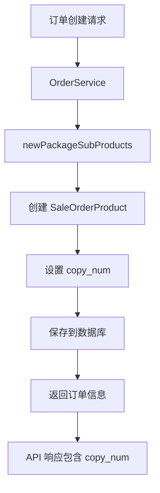

# 套餐分组可选份数支持 设计文档

> 本文档定义套餐分组可选份数支持的技术设计和实现方案。

## 📋 概述

为满足套餐分组可选份数的业务需求，在 `sale_order_product` 表中新增 `copy_num` 字段，用于记录套餐子商品在分组中被选择的份数。该功能主要涉及数据库表结构变更、数据模型更新和业务逻辑适配，确保订单数据能够准确记录套餐分组的选择情况。

**技术范围**：
- 数据库：新增 `copy_num` 字段（DECIMAL(12,4)）
- Go Main 模块：更新 Model、适配订单创建逻辑
- PHP Admin 模块：更新 Model
- Go BMP 模块：更新 Model（如需要）

---

## 🎯 规范对齐

### Go Main 规范 (go-main.mdc)

- ✅ Service 只依赖其他 Service 接口
- ✅ Repository 只持有 db 实例
- ✅ 不使用 panic，返回 error
- ✅ 遵循现有代码风格和结构

### Go BMP 规范 (go-bmp.mdc)

- ✅ 禁止修改 dao/entity/do/ 目录（自动生成）
- ✅ 如需更新 BMP Model，通过数据库迁移后重新生成

### PHP 规范 (php.mdc)

- ✅ 遵循 MVC 分层
- ✅ Model 层更新字段定义

### API 设计规范 (api.mdc)

- ✅ 响应格式统一：`{code, message, data{}}`
- ✅ data 字段必须是对象
- ✅ 字段自动包含在响应中（无需特殊处理）

### 数据库规范 (database.mdc)

- ✅ 字段类型：`DECIMAL(12,4)`（与 `unit_num` 保持一致）
- ✅ 默认值：`0`
- ✅ 字段位置：在 `unit_num` 之后
- ✅ 必须同步更新 `shop_01.sql`
- ✅ 迁移文件命名：`{YYYYMMDDHHMMSS}_add_copy_num_to_sale_order_product_table.php`

---

## 🔄 代码复用分析

### 可复用的现有组件

- **SaleOrderProduct Model**: `main/app/model/sale_order_product.go` - 订单商品模型，需要添加 `CopyNum` 字段
- **newPackageSubProducts 方法**: `main/app/service/order.go` - 创建套餐子商品的逻辑，需要在此处记录 `copy_num`
- **数据库迁移模板**: `admin/database/migrations/20250127000000_add_client_version_to_sale_bill.php` - 参考迁移文件格式

### 集成点

- **订单创建流程**: `main/app/service/order.go` 的 `newPackageSubProducts` 方法
- **数据库表**: `ttpos_sale_order_product` 表
- **DTO 响应**: 订单查询相关的 Response DTO 自动包含新字段

---

## 🏗️ 架构设计

### 分层设计原则

**Go Main 三层架构**:

```
API 层 (Controller/API)
  ↓ 依赖
业务层 (Service)
  ↓ 依赖
数据层 (Repository)
```

**本次变更影响**：
- **数据层**: Model 结构体新增字段
- **业务层**: 订单创建逻辑适配，记录 `copy_num`
- **API 层**: 自动包含新字段（无需修改）

### 架构图



### 模块划分

#### Go Main 模块

- **Model 层**: `main/app/model/sale_order_product.go` - 添加 `CopyNum` 字段
- **Service 层**: `main/app/service/order.go` - 在 `newPackageSubProducts` 方法中设置 `copy_num`
- **DTO 层**: 自动包含新字段（无需修改）

#### PHP Admin 模块

- **Model 层**: `admin/app/{admin|shop}/model/` - 更新对应的 Model 类

#### Go BMP 模块（如需要）

- **Model 层**: 通过数据库迁移后重新生成 entity/do 结构体

---

## 🗄️ 数据库设计

### 数据表设计

#### 表: ttpos_sale_order_product

**新增字段**：

```sql
ALTER TABLE `ttpos_sale_order_product` 
ADD COLUMN `copy_num` DECIMAL(12, 4) NOT NULL DEFAULT 0 COMMENT '表示该子商品在分组中被选择多少份' 
AFTER `unit_num`;
```

**字段说明**:

| 字段 | 类型 | 说明 | 约束 |
|------|------|------|------|
| copy_num | DECIMAL(12,4) | 套餐分组可选份数，表示该子商品在分组中被选择多少份 | DEFAULT 0, NOT NULL |

**字段用途**：
- **套餐子商品**: 记录该子商品在可选分组中被选择的份数
- **普通商品/套餐主商品**: 值为 0（默认值）

**索引设计**:
- 无需新增索引（该字段主要用于记录，不用于查询条件）

**迁移文件**: `admin/database/migrations/{YYYYMMDDHHMMSS}_add_copy_num_to_sale_order_product_table.php`

**同步更新**: `admin/database/seeds/shop_01.sql`

---

## 📊 数据模型

### Go Model

```go
// main/app/model/sale_order_product.go
type SaleOrderProduct struct {
    // ... 现有字段 ...
    UnitNum float64 `gorm:"column:unit_num;type:decimal(12,4);not null;default:0.00;comment:'单位数量，用于套餐子商品'" json:"unit_num"`
    CopyNum float64 `gorm:"column:copy_num;type:decimal(12,4);not null;default:0.00;comment:'表示该子商品在分组中被选择多少份'" json:"copy_num"`
    // ... 其他字段 ...
}
```

### DTO 定义

**Response DTO**（自动包含新字段，无需修改）：

```go
// main/app/dto/resp/order_resp.go
// SaleOrderProductResp 等响应结构体会自动包含 CopyNum 字段
// 因为使用了 json tag，字段会自动序列化
```

---

## 🔌 API 设计

### RESTful API

#### API: 订单详情查询

**请求**:
- **URL**: `/api/v1/order/info`（现有接口）
- **Method**: `POST`
- **Body**: `{ "sale_bill_uuid": 123456 }`

**响应**（自动包含新字段）:

```json
{
  "code": 1,
  "message": "success",
  "data": {
    "sale_order_products": [
      {
        "uuid": 123456,
        "name": "牛排",
        "copy_num": 2.0,
        // ... 其他字段
      }
    ]
  }
}
```

**说明**: 由于 Model 中已包含 `json:"copy_num"` 标签，响应会自动包含该字段，无需修改 API 代码。

---

## 🧩 组件和接口

### Service 层

#### 修改点: newPackageSubProducts 方法

**文件**: `main/app/service/order.go`

**修改内容**:

```go
// 在创建套餐子商品时，设置 copy_num 字段
saleOrderProduct := model.NewDefaultSaleOrderProduct(model.DefaultSaleOrderProduct{
    // ... 现有字段 ...
    CopyNum: product.Num, // 从 product.Num 获取份数（套餐子商品时，Num 就是该子商品在分组中被选择的份数）
    // ... 其他字段 ...
}, &productPackage, product.Operation)
```

**逻辑说明**:
1. 在 `newPackageSubProducts` 方法中，遍历 `product.GetSubProducts()` 时，每个子商品对应一个 `req.ProductParams`
2. `req.ProductParams` 的 `Num` 字段在套餐子商品的情况下，表示该子商品在分组中被选择的份数
3. 创建 `SaleOrderProduct` 时，将 `product.Num` 赋值给 `saleOrderProduct.CopyNum`（见 `order.go:2229`）
4. 对于普通商品和套餐主商品，`CopyNum` 保持默认值 0
5. **实际实现位置**:
   - 套餐主商品创建：`order.go:1816` - `CopyNum: product.Num`
   - 套餐子商品创建：`order.go:2229` - `CopyNum: product.Num`
   - 套餐主商品数量计算：`order.go:1843` - 使用 `CopyNum` 计算 `Num`

### Repository 层

**无需修改**: Repository 层使用 GORM，会自动处理新字段。

### API 层

**无需修改**: API 层返回 Model 结构体，新字段会自动包含在响应中。

---

## ⚡ 缓存设计

**无需修改**: 该字段不影响缓存逻辑。

---

## 🚨 错误处理

### 错误场景

#### 场景 1: copy_num 字段缺失

- **处理方式**: 数据库迁移脚本确保字段存在，Model 中设置默认值 0
- **用户影响**: 无影响，默认值为 0
- **代码示例**:
  ```go
  CopyNum: func() float64 {
      if product.CopyNum > 0 {
          return product.CopyNum
      }
      return 0.0
  }(),
  ```

#### 场景 2: 历史数据兼容

- **处理方式**: 迁移脚本为现有数据设置默认值 0
- **用户影响**: 历史订单的 `copy_num` 为 0，不影响现有功能

---

## 🔒 安全设计

**无需特殊安全处理**: 该字段为记录字段，不涉及敏感信息。

---

## 🧪 测试策略

### 单元测试

**目标覆盖率**:
- Service 层: 70%+
- Repository 层: 80%+
- **Order 相关: 100%**（高风险）

**测试内容**:
- 订单创建时正确设置 `copy_num`
- 套餐子商品的 `copy_num` 正确记录
- 普通商品和套餐主商品的 `copy_num` 为 0
- 退菜逻辑不影响 `copy_num` 字段

### API 测试

**测试内容**:
- 订单查询接口返回 `copy_num` 字段
- 字段值正确

### 集成测试

**测试流程**:
- 创建包含套餐分组可选份数的订单
- 验证 `copy_num` 字段正确记录
- 验证订单查询接口返回 `copy_num`

---

## 📈 性能优化

**无需特殊优化**: 新增字段不影响查询性能。

---

## 🌐 浏览器兼容性

**无需前端修改**: 该功能为后端数据记录，前端自动获取字段值。

---

## 📚 实现清单

### Phase 1: 数据库和模型

- [x] 创建数据库迁移文件
- [ ] 执行数据库迁移（待执行）
- [x] 更新 Go Model
- [x] 更新 Seeds 文件
- [ ] 更新 PHP Model（待完成）
- [ ] 更新 BMP Model（如需要，待完成）

### Phase 2: 核心实现

- [x] 更新 Request DTO（使用 `product.Num` 传递份数，无需单独添加 CopyNum 字段）
- [x] 修改订单创建逻辑（newPackageSubProducts 和 newSaleOrderProductForPackageSubProduct）
- [ ] 验证退菜逻辑兼容性（待检查）
- [ ] 验证统计逻辑兼容性（待检查）

### Phase 3: 测试

- [ ] 单元测试（待完成）
- [ ] API 测试（待完成）
- [ ] 集成测试（待完成）

**详细任务**: 参见 `tasks.md`

---

## 💻 代码实现说明

### 已完成的代码改动

1. **数据库迁移文件** (`admin/database/migrations/20251127140650_add_copy_num_to_sale_order_product_table.php`)
   - ✅ 已创建迁移文件，添加 `copy_num` 字段
   - ✅ 字段类型：`DECIMAL(12,4)`，默认值：`0`
   - ✅ 字段位置：在 `unit_num` 之后

2. **Go Model 更新** (`main/app/model/sale_order_product.go`)
   - ✅ 已添加 `CopyNum float64` 字段（第31行）
   - ✅ GORM 标签正确：`gorm:"column:copy_num;type:decimal(12,4);not null;default:0.00;comment:'表示该子商品在分组中被选择多少份'"`
   - ✅ JSON 标签正确：`json:"copy_num"`

3. **Seeds 文件更新** (`admin/database/seeds/shop_01.sql`)
   - ✅ 已同步更新 `copy_num` 字段定义

4. **订单创建逻辑** (`main/app/service/order.go`)
   - ✅ 套餐主商品创建时设置 `CopyNum: product.Num`（第1816行）
   - ✅ 套餐子商品创建时设置 `CopyNum: product.Num`（第2229行）
   - ✅ 套餐主商品数量计算使用 `CopyNum`（第1843行）：`saleOrderProduct.Num = decimal.NewFromFloat(saleOrderProduct.GetUnitNum()).Mul(decimal.NewFromFloat(saleOrderProduct.CopyNum)).Round(4).InexactFloat64()`

### 实现细节说明

**为什么使用 `product.Num` 而不是单独的 `CopyNum` 字段？**

在 `ProductParams` 结构体中，`Num` 字段在套餐子商品的情况下，表示该子商品在分组中被选择的份数。因此，代码中直接使用 `product.Num` 来设置 `CopyNum`，无需单独添加 `CopyNum` 字段到 `ProductParams`。

**代码位置**：
- 套餐主商品：`order.go:1816` - `CopyNum: product.Num`
- 套餐子商品：`order.go:2229` - `CopyNum: product.Num`
- 数量计算：`order.go:1843` - 使用 `CopyNum` 计算 `Num`

---

## Graphiti & 活动日志

- Related Episode: `[待补充]`
- 模板：`docs/agent/templates/graphiti-episode.md`
- 活动日志：`docs/team/activities/{YYYY-MM}/{YYYY-MM-DD}.md`
- 在技术方案评审、关键架构决策或踩坑总结后，立即补充 Episode 并在设计文档尾部互链。

---

**版本**: v1.0.0  
**创建日期**: 2025-11-27  
**作者**: xiezhihuan  
**审核者**: {审核者}

