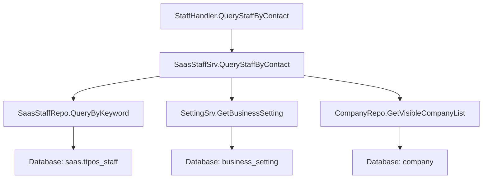

# 根据邮箱或手机号查询员工接口 设计文档

> 本文档定义根据邮箱或手机号查询员工接口的技术设计和实现方案。

## 📋 概述

本功能新增一个简化的员工查询接口，支持根据邮箱或手机号（支持模糊搜索）查询员工信息，返回员工基本信息（UUID、姓名、邮箱、手机号），用于前端下拉列表展示和快速选择。

**与现有接口的区别**：
- 现有 `/shop/staff/search` 接口返回复杂的门店和角色信息，主要用于管理端
- 新接口返回简化的员工基本信息，专门用于收银端/助手端的快速授权选择

**技术栈**：Go Main 模块（Gin + GORM）

---

## 🎯 规范对齐

### Go Main 规范 (go-main.mdc)

- ✅ Service 只依赖其他 Service 接口
- ✅ Repository 只持有 db 实例
- ✅ URL 使用 snake_case (`/shop/staff/query-by-contact`)
- ✅ data 字段必须是对象（`data: { list: [] }`）
- ✅ 不使用 panic，返回 error
- ✅ 接口以 `I` 开头，实现以 `Impl` 结尾

### API 设计规范 (api.mdc)

- ✅ URL 使用 snake_case
- ✅ 响应格式统一：`{code, message, data{}}`
- ✅ data 不能为 null 或数组，必须是对象
- ✅ 使用 Swagger 注释

### 数据库规范 (database.mdc)

- ✅ 复用现有 `saas.ttpos_staff` 表，无需新增表
- ✅ 使用现有索引优化查询（`idx_phone`, `uk_email`）
- ✅ 软删除使用 `delete_time = 0`

---

## 🔄 代码复用分析

### 可复用的现有组件

- **SaasStaffRepo**: `main/app/repository/saas_staff.go` - 员工数据访问层，已有 `GetByEmailOrPhone` 方法（精确匹配），需要扩展支持模糊搜索
- **SaasStaffSrv**: `main/app/service/saas_staff.go` - 员工服务层，已有 `SearchStaff` 方法，可参考其权限过滤逻辑
- **StaffHandler**: `main/app/api/v1/shop/shop_staff.go` - 员工管理接口，可参考其参数验证和响应格式
- **CompanyRepo**: `main/app/repository/company.go` - 门店数据访问层，用于获取可见门店列表
- **SettingSrv**: `main/app/service/setting/setting.go` - 设置服务，用于获取授权员工配置

### 集成点

- **现有 API**: `/shop/staff/search` - 参考其实现方式，但简化返回数据
- **数据库表**: `saas.ttpos_staff` - 统一账号表，包含邮箱和手机号字段
- **业务设置**: `business_setting` 表中的 `discount_authorized_staff_ids` 和 `refund_authorized_staff_ids` - 授权员工配置

---

## 🏗️ 架构设计

### 分层设计原则

**Go Main 三层架构**:

```
API 层 (Controller/Handler)
  ↓ 依赖
业务层 (Service)
  ↓ 依赖
数据层 (Repository)
```

**依赖规则**:

- ✅ 上层可依赖下层
- ❌ 禁止下层依赖上层
- ❌ 禁止跨层调用
- ❌ Service 不能直接依赖 Repository
- ✅ Service 可以依赖其他 Service 接口

### 架构图



### 模块划分

#### Go Main 模块

- **API 层**: 
  - `main/app/api/v1/cashier/cashier_order.go` - 新增 `QueryStaffByContact` 方法（收银机端）
  - `main/app/api/v1/assistant/assistant_order.go` - 新增 `QueryStaffByContact` 方法（助手端）
- **Service 层**: `main/app/service/saas_staff.go` - 新增 `QueryStaffByContact` 方法
- **Repository 层**: `main/app/repository/saas_staff.go` - 新增 `QueryByKeyword` 方法（支持模糊搜索）
- **DTO 层**: `main/app/dto/req/staff.go` - 新增 `QueryStaffByContactReq`
- **DTO 层**: `main/app/dto/resp/saas_staff.go` - 新增 `QueryStaffByContactResp`

---

## 🗄️ 数据库设计

### 数据表设计

#### 复用现有表: saas.ttpos_staff

**表结构**（已存在）:

```sql
CREATE TABLE `saas.ttpos_staff` (
    `id` bigint unsigned NOT NULL AUTO_INCREMENT,
    `uuid` bigint unsigned NOT NULL DEFAULT 0,
    `email` varchar(255) NOT NULL COMMENT '邮箱',
    `phone` varchar(20) DEFAULT '' COMMENT '手机号',
    `real_name` varchar(255) NOT NULL DEFAULT '' COMMENT '姓名',
    `password` varchar(255) NOT NULL COMMENT '登录密码',
    `is_disable` int NOT NULL DEFAULT 0 COMMENT '是否禁用',
    `create_time` int NOT NULL DEFAULT 0,
    `update_time` int NOT NULL DEFAULT 0,
    `delete_time` int NOT NULL DEFAULT 0,
    PRIMARY KEY (`id`),
    UNIQUE KEY `uk_uuid` (`uuid`),
    UNIQUE KEY `uk_email` (`email`),
    KEY `idx_phone` (`phone`),
    KEY `idx_delete_time` (`delete_time`)
) ENGINE=InnoDB DEFAULT CHARSET=utf8mb4 COMMENT='员工表（统一账号表）';
```

**索引使用**:

- `uk_email` - 邮箱精确查询和模糊查询
- `idx_phone` - 手机号精确查询和模糊查询
- `idx_delete_time` - 软删除过滤

**无需新增表或字段**，完全复用现有表结构。

---

## 📊 数据模型

### Go Model

复用现有 Model: `main/app/model/saas_staff.go`

```go
// main/app/model/saas_staff.go
type SaasStaff struct {
    Id         uint64 `gorm:"column:id;primaryKey" json:"id"`
    Uuid       uint64 `gorm:"column:uuid;uniqueIndex" json:"uuid"`
    Email      string `gorm:"column:email;uniqueIndex" json:"email"`
    Phone      string `gorm:"column:phone;index" json:"phone"`
    RealName   string `gorm:"column:real_name" json:"real_name"`
    Password   string `gorm:"column:password" json:"-"`
    IsDisable  int    `gorm:"column:is_disable" json:"is_disable"`
    CreateTime int64  `gorm:"column:create_time" json:"create_time"`
    UpdateTime int64  `gorm:"column:update_time" json:"update_time"`
    DeleteTime int64  `gorm:"column:delete_time;index" json:"delete_time"`
}

func (*SaasStaff) TableName() string {
    return "saas.ttpos_staff"
}
```

### DTO 定义

#### Request DTO

```go
// main/app/dto/req/staff.go
type QueryStaffByContactReq struct {
    Keyword string `form:"keyword" binding:"omitempty"` // 搜索关键词（邮箱或手机号，支持模糊匹配）
    Limit   int    `form:"limit" binding:"omitempty,min=1,max=20"` // 返回结果数量限制（默认 20，最大 20）
}
```

#### Response DTO

```go
// main/app/dto/resp/saas_staff.go
// QueryStaffByContactItem 查询员工响应项
type QueryStaffByContactItem struct {
    Uuid     uint64 `json:"uuid"`      // 员工UUID
    RealName string `json:"real_name"` // 姓名
    Email    string `json:"email"`     // 邮箱
    Phone    string `json:"phone"`     // 手机号
}

// QueryStaffByContactResp 查询员工响应
type QueryStaffByContactResp struct {
    List []*QueryStaffByContactItem `json:"list"` // 员工列表
}
```

---

## 🔌 API 设计

### RESTful API

#### API: 根据邮箱或手机号查询员工

**请求**:

- **URL**: `/shop/staff/query-by-contact`
- **Method**: `GET`
- **Headers**:
  ```json
  {
    "Authorization": "Bearer {token}",
    "Content-Type": "application/json"
  }
  ```
- **Query Parameters**:
  ```
  keyword: string (可选) - 搜索关键词（邮箱或手机号，支持模糊匹配）
  limit: int (可选) - 返回结果数量限制（默认 20，最大 20）
  ```

**响应**:

```json
{
  "code": 200,
  "message": "success",
  "data": {
    "list": [
      {
        "uuid": 123456,
        "real_name": "张三",
        "email": "zhangsan@example.com",
        "phone": "13800138000"
      }
    ]
  }
}
```

**错误响应**:

```json
{
  "code": 0,
  "message": "错误信息",
  "data": {}
}
```

**Swagger 注释**:

```go
// QueryStaffByContact 根据邮箱或手机号查询员工
// @Summary 根据邮箱或手机号查询员工
// @Description 根据邮箱或手机号查询员工，支持模糊搜索，返回员工基本信息，用于下拉列表展示
// @Tags 商家端.员工账号
// @Accept json
// @Produce json
// @Security JwtToken
// @Param keyword query string false "搜索关键词（邮箱或手机号，支持模糊匹配）"
// @Param limit query int false "返回结果数量限制（默认 20，最大 20）"
// @Success 200 {object} dto.Response{data=resp.QueryStaffByContactResp}
// @Router /shop/staff/query-by-contact [get]
```

---

## 🧩 组件和接口

### Service 层

#### Service 接口

```go
// main/app/service/saas_staff.go
type ISaasStaffSrv interface {
    // ... 现有方法 ...
    
    // QueryStaffByContact 根据邮箱或手机号查询员工（支持模糊搜索）
    // 仅返回当前门店可见范围内的授权员工
    QueryStaffByContact(ctx context.Context, req req.QueryStaffByContactReq) (*resp.QueryStaffByContactResp, error)
}
```

#### Service 实现

```go
// main/app/service/saas_staff.go
func (s *saasStaffSrv) QueryStaffByContact(ctx context.Context, req req.QueryStaffByContactReq) (*resp.QueryStaffByContactResp, error) {
    saasDB := s.dbm.GetDB(constant.DefaultDB)
    saasStaffRepo := repository.NewSaasStaffRepo(saasDB)
    
    // 1. 设置默认 limit
    limit := req.Limit
    if limit <= 0 || limit > 20 {
        limit = 20
    }
    
    // 2. 获取当前门店可见范围内的授权员工列表
    // 2.1 获取业务设置（授权员工配置）
    settingSrv := setting.NewSrv(s.dbm, nil) // 不需要 cache
    businessSetting, err := settingSrv.GetBusinessSetting(ctx)
    if err != nil {
        return &resp.QueryStaffByContactResp{List: []*resp.QueryStaffByContactItem{}}, nil
    }
    
    // 2.2 合并折扣和退款的授权员工列表（去重）
    authorizedStaffIdsMap := make(map[uint64]bool)
    for _, id := range businessSetting.DiscountAuthorizedStaffIds {
        authorizedStaffIdsMap[id] = true
    }
    for _, id := range businessSetting.RefundAuthorizedStaffIds {
        authorizedStaffIdsMap[id] = true
    }
    
    // 2.3 获取当前门店可见范围内的门店列表
    currentCompanyUuid := ctx.GetCompanyUuid()
    companyRepo := repository.NewCompanyRepo(saasDB)
    visibleCompanies, err := companyRepo.GetVisibleCompanyList(currentCompanyUuid)
    if err != nil {
        return &resp.QueryStaffByContactResp{List: []*resp.QueryStaffByContactItem{}}, nil
    }
    
    // 2.4 获取可见门店下的授权员工
    companyStaffRepo := repository.NewCompanyStaffRepo(saasDB)
    authorizedStaffUuids := make([]uint64, 0)
    for _, company := range visibleCompanies {
        companyStaffList, _ := companyStaffRepo.GetByCompanyUuid(company.Uuid)
        for _, cs := range companyStaffList {
            if authorizedStaffIdsMap[cs.StaffUuid] {
                authorizedStaffUuids = append(authorizedStaffUuids, cs.StaffUuid)
            }
        }
    }
    
    // 3. 如果没有授权员工，返回空列表
    if len(authorizedStaffUuids) == 0 {
        return &resp.QueryStaffByContactResp{List: []*resp.QueryStaffByContactItem{}}, nil
    }
    
    // 4. 根据关键词查询员工（模糊搜索）
    staffList, err := saasStaffRepo.QueryByKeyword(req.Keyword, authorizedStaffUuids, limit)
    if err != nil {
        return &resp.QueryStaffByContactResp{List: []*resp.QueryStaffByContactItem{}}, nil
    }
    
    // 5. 转换为响应格式
    result := make([]*resp.QueryStaffByContactItem, 0, len(staffList))
    for _, staff := range staffList {
        result = append(result, &resp.QueryStaffByContactItem{
            Uuid:     staff.Uuid,
            RealName: staff.RealName,
            Email:    staff.Email,
            Phone:    staff.Phone,
        })
    }
    
    return &resp.QueryStaffByContactResp{List: result}, nil
}
```

### Repository 层

#### Repository 接口

```go
// main/app/repository/saas_staff.go
type ISaasStaffRepo interface {
    // ... 现有方法 ...
    
    // QueryByKeyword 根据关键词查询员工（支持模糊搜索）
    // keyword: 搜索关键词（邮箱或手机号），为空时返回所有匹配的员工
    // staffUuids: 员工UUID列表（用于过滤）
    // limit: 返回结果数量限制
    QueryByKeyword(keyword string, staffUuids []uint64, limit int) ([]*model.SaasStaff, error)
}
```

#### Repository 实现

```go
// main/app/repository/saas_staff.go
func (r *saasStaffRepo) QueryByKeyword(keyword string, staffUuids []uint64, limit int) ([]*model.SaasStaff, error) {
    var list []*model.SaasStaff
    db := r.db.Model(&model.SaasStaff{}).Scopes(NotDeleted)
    
    // 1. 过滤授权员工
    if len(staffUuids) > 0 {
        db = db.Where("uuid IN (?)", staffUuids)
    }
    
    // 2. 根据关键词过滤（模糊搜索）
    if keyword != "" {
        // 判断是邮箱还是手机号格式
        keywordLower := strings.ToLower(keyword)
        if strings.Contains(keywordLower, "@") {
            // 邮箱格式：模糊匹配邮箱
            db = db.Where("LOWER(email) LIKE ?", "%"+keywordLower+"%")
        } else {
            // 手机号格式：模糊匹配手机号
            db = db.Where("phone LIKE ?", "%"+keyword+"%")
        }
    }
    
    // 3. 限制返回数量
    db = db.Limit(limit)
    
    // 4. 查询
    if err := db.Find(&list).Error; err != nil {
        return nil, err
    }
    
    return list, nil
}
```

### API 层

```go
// main/app/api/v1/cashier/cashier_order.go
// QueryStaffByContact 根据邮箱或手机号查询员工
// @Summary 根据邮箱或手机号查询员工
// @Description 根据邮箱或手机号查询员工，支持模糊搜索，返回员工基本信息，用于下拉列表展示
// @Tags 收银端.订单
// @Accept json
// @Produce json
// @Security JwtToken
// @Param keyword query string false "搜索关键词（邮箱或手机号，支持模糊匹配）"
// @Param limit query int false "返回结果数量限制（默认 20，最大 20）"
// @Success 200 {object} dto.Response{data=resp.QueryStaffByContactResp}
// @Router /cashier/order/query-staff-by-contact [get]
func (h *OrderHandler) QueryStaffByContact(c *gin.Context) {
    ctx := helper.GetContext(c)
    var queryReq req.QueryStaffByContactReq
    if err := c.ShouldBindQuery(&queryReq); err != nil {
        helper.HandleValidationError(c, err, queryReq, nil)
        return
    }
    
    res, err := h.saasStaffSrv.QueryStaffByContact(ctx, queryReq)
    if err != nil {
        helper.ErrorWithDetail(c, constant.CodeSystemError, err)
        return
    }
    
    helper.Success(c, res)
}
```

**路由注册**:

```go
// main/app/api/v1/cashier/cashier_order.go
func RegisterOrderHandlers(router gin.IRouter, dbm *database.DBManager, cache cache.Cache) {
    // ... 初始化服务 ...
    
    wrapper := OrderHandler{
        orderSrv:    orderSrv,
        deskSrv:     deskSrv,
        saasStaffSrv: service.NewSaasStaffSrv(dbm),
    }
    
    privateApi := router.Group("", middleware.Auth(authSrv, dbm))
    {
        // ... 现有路由 ...
        privateApi.GET("/order/query-staff-by-contact", wrapper.QueryStaffByContact) // 新增路由
    }
}

// main/app/api/v1/assistant/assistant_order.go
// 同样的实现和路由注册，路径为 /assistant/order/query-staff-by-contact
```

---

## ⚡ 缓存设计

**暂不实现缓存**，原因：
- 查询结果实时性要求高（授权员工配置可能随时更新）
- 查询性能已通过索引优化
- 如果后续性能不达标，再考虑添加 Redis 缓存

---

## 🚨 错误处理

### 错误场景

#### 场景 1: 查询失败

- **处理方式**: 返回空列表，不抛出异常
- **用户影响**: 下拉列表为空，用户可手动输入
- **代码示例**:
  ```go
  staffList, err := saasStaffRepo.QueryByKeyword(req.Keyword, authorizedStaffUuids, limit)
  if err != nil {
      return &resp.QueryStaffByContactResp{List: []*resp.QueryStaffByContactItem{}}, nil
  }
  ```

#### 场景 2: 无授权员工

- **处理方式**: 返回空列表
- **用户影响**: 下拉列表为空，用户可手动输入
- **代码示例**:
  ```go
  if len(authorizedStaffUuids) == 0 {
      return &resp.QueryStaffByContactResp{List: []*resp.QueryStaffByContactItem{}}, nil
  }
  ```

#### 场景 3: 参数验证失败

- **处理方式**: 返回参数错误
- **用户影响**: 前端显示错误提示
- **代码示例**:
  ```go
  if err := c.ShouldBindQuery(&queryReq); err != nil {
      helper.HandleValidationError(c, err, queryReq, nil)
      return
  }
  ```

---

## 🔒 安全设计

### 身份验证

- **JWT Token**: 所有 API 需要 Token 验证（通过 `middleware.Auth`）

### 权限控制

- **授权员工过滤**: 仅返回 Shop 管理端配置的授权员工
- **门店可见性**: 仅返回当前门店可见范围内的员工
- **数据隔离**: 通过 `ctx.GetCompanyUuid()` 获取当前门店，确保数据隔离

### 数据安全

- **SQL 注入防护**: 使用 GORM 参数化查询
- **输入验证**: 使用 `binding` 标签验证参数
- **敏感信息**: 不返回密码等敏感字段

---

## 🧪 测试策略

### 单元测试

**目标覆盖率**:

- main/app/service: 70%+
- main/app/repository: 80%+

**测试内容**:

- Service 业务逻辑（权限过滤、关键词搜索）
- Repository 数据访问（模糊搜索、结果限制）
- DTO 数据转换

**测试用例**:

1. **正常场景**:
   - 有授权员工，有匹配结果
   - 有授权员工，无匹配结果
   - 无授权员工

2. **边界场景**:
   - 关键词为空（返回所有授权员工）
   - 关键词为邮箱格式
   - 关键词为手机号格式
   - 结果超过 limit

3. **异常场景**:
   - 数据库查询失败
   - 参数验证失败

### API 测试

**测试内容**:

- API 接口调用
- 参数验证
- 响应格式
- 错误处理

### 集成测试

**测试流程**:

- 端到端业务流程（查询 → 返回 → 前端展示）
- 权限过滤逻辑
- 门店可见性逻辑

---

## 📈 性能优化

### 优化策略

1. **数据库优化**:
   - 使用现有索引（`idx_phone`, `uk_email`）
   - 限制返回结果数量（最多 20 条）
   - 使用 `LIKE` 查询时，确保索引可用

2. **查询优化**:
   - 先过滤授权员工 UUID 列表，再查询
   - 使用 `IN` 查询替代多次单条查询

3. **接口优化**:
   - 响应数据简化（只返回必要字段）

### 性能指标

- 本地响应时间: < 200ms
- 数据库查询: < 50ms
- 并发能力: 100+ QPS

---

## 🌐 浏览器兼容性

**不适用**：本功能用于 POS 收银端和助手端（非浏览器环境）

---

## 📚 实现清单

### Phase 1: DTO 和 Repository

- [ ] 创建 Request DTO (`QueryStaffByContactReq`)
- [ ] 创建 Response DTO (`QueryStaffByContactResp`, `QueryStaffByContactItem`)
- [ ] 实现 Repository 方法 (`QueryByKeyword`)

### Phase 2: Service 层

- [ ] 实现 Service 接口方法 (`QueryStaffByContact`)
- [ ] 实现权限过滤逻辑
- [ ] 实现门店可见性过滤逻辑

### Phase 3: API 层

- [ ] 实现 API Handler (`QueryStaffByContact`)
- [ ] 注册路由
- [ ] 添加 Swagger 注释

### Phase 4: 测试

- [ ] Repository 单元测试
- [ ] Service 单元测试
- [ ] API 集成测试

**详细任务**: 参见 `tasks.md`

---

## Graphiti & 活动日志

- Related Episode: `[待补充]`
- 模板：`docs/agent/templates/graphiti-episode.md`
- 活动日志：`docs/team/activities/{YYYY-MM}/{YYYY-MM-DD}.md`
- 在技术方案评审、关键架构决策或踩坑总结后，立即补充 Episode 并在设计文档尾部互链。

---

**版本**: v1.0.0  
**创建日期**: 2025-12-23  
**作者**: xiezhihuan  
**审核者**: {审核者}

