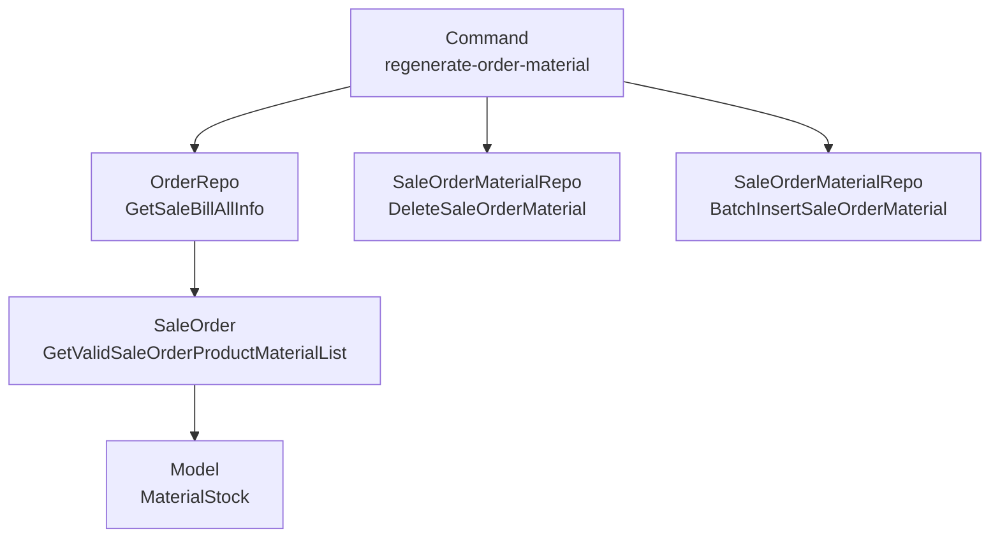
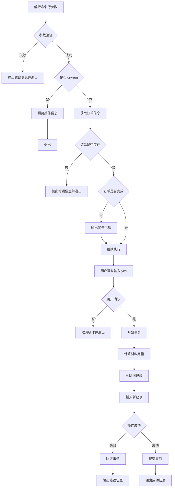

# 重新生成订单材料用料命令 设计文档

> 本文档定义重新生成订单材料用料命令功能的技术设计和实现方案。

## 📋 概述

本功能提供一个命令行工具，用于重新生成指定订单的材料用料记录。核心实现是复用订单结账事件处理器中的材料统计逻辑，封装为命令行工具，支持预览模式和用户确认机制。

**技术要点**：
- 复用现有材料统计逻辑（`GetValidSaleOrderProductMaterialList()`），避免代码重复
- 使用数据库事务保证删除和插入操作的原子性
- 支持 `--dry-run` 预览模式，避免误操作
- 软删除旧记录，保留历史数据

---

## 🎯 规范对齐

### Go Main 规范 (go-main.mdc)

- ✅ 命令文件放在 `main/command/` 目录
- ✅ 使用 Cobra 框架
- ✅ 不使用 panic，返回 error
- ✅ 接口以 `I` 开头，实现以 `Impl` 结尾（如需要 Service）
- ✅ Repository 只持有 db 实例，不持有 DBManager

### 数据库规范 (database.mdc)

- ✅ 复用现有表 `ttpos_sale_order_material`
- ✅ 使用软删除（`delete_time` 字段）
- ✅ 事务保证数据一致性

---

## 🔄 代码复用分析

### 可复用的现有组件

- **SaleOrder.GetValidSaleOrderProductMaterialList()**: `main/app/model/sale_order.go:227-253`
  - 计算订单中有效售出商品的材料用量
  - 支持成本卡和关联材料两种计算方式
  - 自动排除删除、取消、未送厨、套餐子商品、未接单商品

- **SaleOrderMaterialRepo**: `main/app/repository/sale_order_material.go`
  - `BatchInsertSaleOrderMaterial()` - 批量插入材料记录
  - `DeleteSaleOrderMaterial()` - 删除材料记录（按 sale_bill_uuid）

- **OrderRepo.GetSaleBillAllInfo()**: `main/app/repository/order.go:1859-2097`
  - 获取订单完整信息，包含商品、BOM、材料关联等预加载
  - 已预加载 `SaleOrders.SaleOrderProducts.SaleOrderProductBoms.ProductBom` 等

- **材料统计逻辑**: `main/app/event/order/order_checkout_event_handler.go:230-258`
  - 参考材料统计的实现方式
  - 构建 `SaleOrderMaterial` 对象的方式

### 集成点

- **数据库表**: `ttpos_sale_order_material` - 复用现有表结构
- **订单数据**: 通过 `GetSaleBillAllInfo()` 获取，已包含必要的预加载

---

## 🏗️ 架构设计

### 分层设计原则

**命令行工具架构**:

```
Command Layer (regenerate_order_material.go)
  ↓ 调用
Repository Layer (SaleOrderMaterialRepo, OrderRepo)
  ↓ 调用
Model Layer (SaleOrder.GetValidSaleOrderProductMaterialList)
```

**依赖规则**:

- ✅ Command 可以直接调用 Repository 和 Model
- ✅ 复用现有 Repository 方法，不创建新的 Service
- ✅ 业务逻辑封装在 Model 方法中

### 架构图



### 模块划分

#### Go Main 模块

- **Command 层**: `main/command/regenerate_order_material.go` - 命令行工具入口
- **Repository 层**: `main/app/repository/` - 数据访问（复用现有）
  - `order.go` - 获取订单信息
  - `sale_order_material.go` - 材料记录操作
- **Model 层**: `main/app/model/` - 数据模型和业务逻辑（复用现有）
  - `sale_order.go` - 订单模型和材料计算逻辑
  - `sale_order_material.go` - 材料记录模型

---

## 🗄️ 数据库设计

### 数据表设计

#### 表: ttpos_sale_order_material（复用现有表）

**表结构**（已存在，无需创建）：

```sql
CREATE TABLE IF NOT EXISTS `ttpos_sale_order_material` (
    `id` bigint unsigned NOT NULL AUTO_INCREMENT COMMENT '主键ID',
    `uuid` bigint unsigned NOT NULL DEFAULT 0 COMMENT '唯一标识',
    `sale_order_uuid` bigint unsigned NOT NULL DEFAULT 0 COMMENT '销售订单ID',
    `sale_bill_uuid` bigint unsigned NOT NULL DEFAULT 0 COMMENT '销售账单ID',
    `material_uuid` bigint unsigned NOT NULL DEFAULT 0 COMMENT '原料ID',
    `warehouse_uuid` bigint unsigned NOT NULL DEFAULT 0 COMMENT '仓库ID',
    `num` decimal(12,2) NOT NULL DEFAULT 0 COMMENT '数量,原料的实际使用数量',
    `staff_shift_log_uuid` bigint unsigned NOT NULL DEFAULT 0 COMMENT '员工班次记录ID',
    `is_summarized` int NOT NULL DEFAULT 0 COMMENT '是否已经统计,0-未统计 1-已统计',
    `create_time` int NOT NULL DEFAULT 0 COMMENT '创建时间',
    `update_time` int NOT NULL DEFAULT 0 COMMENT '更新时间',
    `delete_time` int NOT NULL DEFAULT 0 COMMENT '删除时间',
    PRIMARY KEY (`id`),
    UNIQUE KEY `uk_uuid` (`uuid`),
    KEY `idx_sale_order_uuid` (`sale_order_uuid`),
    KEY `idx_sale_bill_uuid` (`sale_bill_uuid`),
    KEY `idx_material_uuid` (`material_uuid`),
    KEY `idx_create_time` (`create_time`)
) ENGINE=InnoDB DEFAULT CHARSET=utf8mb4 COMMENT='销售订单原料表';
```

**字段说明**:
| 字段 | 类型 | 说明 | 约束 |
|------|------|------|------|
| id | bigint unsigned | 主键 ID | AUTO_INCREMENT |
| uuid | bigint unsigned | 唯一标识 | DEFAULT 0, UNIQUE |
| sale_order_uuid | bigint unsigned | 销售订单 ID | DEFAULT 0, INDEX |
| sale_bill_uuid | bigint unsigned | 销售账单 ID | DEFAULT 0, INDEX |
| material_uuid | bigint unsigned | 原料 ID | DEFAULT 0, INDEX |
| warehouse_uuid | bigint unsigned | 仓库 ID | DEFAULT 0 |
| num | decimal(12,2) | 材料用量 | DEFAULT 0 |
| staff_shift_log_uuid | bigint unsigned | 员工班次记录 ID | DEFAULT 0 |
| is_summarized | int | 是否已统计 | DEFAULT 0 |
| create_time | int | 创建时间 | DEFAULT 0, INDEX |
| update_time | int | 更新时间 | DEFAULT 0 |
| delete_time | int | 删除时间 | DEFAULT 0 |

**索引设计**:
- 主键索引: `PRIMARY KEY (id)`
- 唯一索引: `UNIQUE KEY uk_uuid (uuid)`
- 普通索引: `KEY idx_sale_order_uuid (sale_order_uuid)`, `KEY idx_sale_bill_uuid (sale_bill_uuid)`, `KEY idx_material_uuid (material_uuid)`, `KEY idx_create_time (create_time)`

---

## 📊 数据模型

### Go Model（复用现有）

```go
// main/app/model/sale_order_material.go
type SaleOrderMaterial struct {
    BaseModel
    SaleOrderUuid     uint64  `gorm:"column:sale_order_uuid;type:bigint(20);default:0;comment:销售订单ID"`
    SaleBillUuid      uint64  `gorm:"column:sale_bill_uuid;type:bigint(20);default:0;comment:销售账单ID"`
    MaterialUuid      uint64  `gorm:"column:material_uuid;type:bigint(20);default:0;comment:原料ID"`
    WarehouseUuid     uint64  `gorm:"column:warehouse_uuid;type:bigint(20);default:0;comment:仓库ID"`
    Num               float64 `gorm:"column:num;type:decimal(12,2);default:0;comment:数量,原料的实际使用数量"`
    StaffShiftLogUuid uint64  `gorm:"column:staff_shift_log_uuid;type:bigint(20);default:0;comment:员工班次记录ID"`
    IsSummarized      int     `gorm:"column:is_summarized;type:int(11);default:0;comment:是否已经统计,0-未统计 1-已统计"`
    
    Material *Material `gorm:"foreignKey:MaterialUuid;references:Uuid"`
}
```

---

## 🔌 命令行接口设计

### 命令格式

```bash
./main regenerate-order-material --company-uuid <门店UUID> --sale-order-uuid <订单UUID> [--dry-run]
```

### 参数说明

| 参数 | 类型 | 必填 | 说明 |
|------|------|------|------|
| `--company-uuid` | uint64 | 是 | 门店 UUID |
| `--sale-order-uuid` | uint64 | 是 | 订单 UUID |
| `--dry-run` | bool | 否 | 预览模式，不实际执行 |

### 执行流程



### 输出示例

**预览模式**:
```
========================================
重新生成订单材料用料记录
门店UUID: 123456
订单UUID: 789012
模式: 预览模式（不会实际执行）
========================================
预览模式：将执行以下操作：
  1. 删除订单 789012 的旧材料记录
  2. 重新计算材料用量
  3. 插入新材料记录（预计 X 条）
预览模式结束，未实际执行操作
```

**执行模式**:
```
========================================
重新生成订单材料用料记录
门店UUID: 123456
订单UUID: 789012
========================================
警告：此操作将删除并重新生成订单的材料用料记录
输入 'yes' 继续，输入其他内容取消: yes
开始执行重新生成操作...
操作成功完成！
删除记录数: 5
新增记录数: 5
耗时: 234ms
```

---

## 🧩 组件和接口

### Command 层

```go
// main/command/regenerate_order_material.go
package command

import (
    "fmt"
    "log"
    "time"
    "ttpos-server-go/app/model"
    "ttpos-server-go/app/repository"
    "ttpos-server-go/config"
    "ttpos-server-go/pkg/database"
    // ... 其他导入
    
    "github.com/spf13/cobra"
    "gorm.io/gorm"
)

var (
    companyUuidFlag   uint64
    saleOrderUuidFlag uint64
    dryRunFlag        bool
)

func init() {
    regenerateOrderMaterialCmd.Flags().Uint64Var(&companyUuidFlag, "company-uuid", 0, "门店UUID")
    regenerateOrderMaterialCmd.Flags().Uint64Var(&saleOrderUuidFlag, "sale-order-uuid", 0, "订单UUID")
    regenerateOrderMaterialCmd.Flags().BoolVar(&dryRunFlag, "dry-run", false, "仅预览，不实际执行")
    regenerateOrderMaterialCmd.MarkFlagRequired("company-uuid")
    regenerateOrderMaterialCmd.MarkFlagRequired("sale-order-uuid")
    rootCommand.AddCommand(regenerateOrderMaterialCmd)
}

var regenerateOrderMaterialCmd = &cobra.Command{
    Use:   "regenerate-order-material",
    Short: "重新生成指定订单的材料用料记录",
    Long:  `删除指定订单的旧材料记录，并重新计算生成新的材料记录`,
    PreRun: func(cmd *cobra.Command, args []string) {
        // 初始化配置、日志、数据库等（参考 regenerate_sales_outbound.go）
    },
    Run: func(cmd *cobra.Command, args []string) {
        // 1. 参数验证
        // 2. 获取订单信息
        // 3. 计算材料用量
        // 4. 删除旧记录
        // 5. 插入新记录
        // 6. 输出结果
    },
}
```

### Repository 层（复用现有）

```go
// main/app/repository/order.go
// GetSaleBillAllInfo() - 已存在，直接使用

// main/app/repository/sale_order_material.go
// DeleteSaleOrderMaterial() - 已存在，直接使用
// BatchInsertSaleOrderMaterial() - 已存在，直接使用
```

### Model 层（复用现有）

```go
// main/app/model/sale_order.go
// GetValidSaleOrderProductMaterialList() - 已存在，直接使用
```

---

## ⚡ 事务设计

### 事务范围

```go
err := repository.CommonRepo.Transaction(db, func(tx *gorm.DB) error {
    // 1. 删除旧记录
    if err := saleOrderMaterialRepo.DeleteSaleOrderMaterial(saleBillUuid); err != nil {
        return err
    }
    
    // 2. 插入新记录
    if err := saleOrderMaterialRepo.BatchInsertSaleOrderMaterial(saleOrderMaterials); err != nil {
        return err
    }
    
    return nil
})
```

### 事务保证

- ✅ 删除和插入操作在同一事务中
- ✅ 任一操作失败，整个事务回滚
- ✅ 保证数据一致性

---

## 🚨 错误处理

### 错误场景

#### 场景 1: 订单不存在

- **处理方式**: 输出错误信息并退出
- **用户影响**: 命令执行失败，提示订单不存在
- **代码示例**:
  ```go
  saleBill, err := orderRepo.GetSaleBillAllInfo(saleBillUuid)
  if err != nil {
      fmt.Printf("%s错误: 订单不存在或查询失败: %s%s\n", redColor, err.Error(), resetColor)
      return
  }
  saleOrder := saleBill.GetSaleOrder(saleOrderUuid)
  if saleOrder == nil {
      fmt.Printf("%s错误: 订单不存在%s\n", redColor, resetColor)
      return
  }
  ```

#### 场景 2: 订单未完成

- **处理方式**: 输出警告信息，但允许继续执行
- **用户影响**: 用户看到警告，可以选择继续或取消
- **代码示例**:
  ```go
  if saleOrder.FinishTime == 0 {
      fmt.Printf("%s警告: 订单未完成（finish_time=0），材料用量可能不准确%s\n", yellowColor, resetColor)
      // 继续执行
  }
  ```

#### 场景 3: 数据库操作失败

- **处理方式**: 回滚事务，输出错误信息
- **用户影响**: 操作失败，数据未修改
- **代码示例**:
  ```go
  err := repository.CommonRepo.Transaction(db, func(tx *gorm.DB) error {
      // 操作...
      if err != nil {
          return errors.WithMessage(err, "操作失败")
      }
      return nil
  })
  if err != nil {
      fmt.Printf("%s错误: %s%s\n", redColor, err.Error(), resetColor)
      return
  }
  ```

---

## 🔒 安全设计

### 用户确认机制

- **确认方式**: 非 dry-run 模式下，要求用户输入 'yes' 确认
- **取消机制**: 输入非 'yes' 的内容，取消操作并退出

### 预览模式

- **dry-run 参数**: 支持 `--dry-run` 预览模式
- **预览内容**: 显示将要执行的操作，不实际执行

### 数据安全

- **软删除**: 使用软删除方式，保留历史数据
- **事务保证**: 使用数据库事务，保证数据一致性

---

## 🧪 测试策略

### 单元测试

**目标覆盖率**:
- Command 层: 70%+

**测试内容**:
- 参数验证
- 订单信息获取
- 材料用量计算
- 数据库操作

**示例**:
```go
// main/command/regenerate_order_material_test.go
func TestRegenerateOrderMaterialCmd(t *testing.T) {
    // 测试实现
}
```

### 集成测试

**测试流程**:
- 端到端命令行执行
- 数据库事务
- 数据一致性验证

---

## 📈 性能优化

### 优化策略

1. **数据库优化**:
   - 使用批量插入，减少数据库交互次数
   - 使用事务，减少锁竞争

2. **查询优化**:
   - 使用 `GetSaleBillAllInfo()` 一次性获取所有必要数据
   - 预加载 BOM 和材料关联，避免 N+1 查询

### 性能指标

- 单个订单重新生成时间: < 1 秒
- 数据库操作时间: < 500ms

---

## 📚 实现清单

### Phase 1: 命令框架搭建

- [ ] 创建命令文件 `regenerate_order_material.go`
- [ ] 实现参数解析和验证
- [ ] 实现 PreRun 初始化逻辑
- [ ] 实现 dry-run 预览模式

### Phase 2: 业务逻辑实现

- [ ] 实现订单信息获取逻辑
- [ ] 实现材料用量计算逻辑（复用现有方法）
- [ ] 实现删除旧记录逻辑
- [ ] 实现插入新记录逻辑
- [ ] 实现事务管理

### Phase 3: 错误处理和日志

- [ ] 实现错误处理逻辑
- [ ] 实现用户确认机制
- [ ] 实现日志输出（彩色输出）
- [ ] 实现操作结果统计

**详细任务**: 参见 `tasks.md`

---

## Graphiti & 活动日志

- Related Episode: `[待补充]`
- 模板：`docs/agent/templates/graphiti-episode.md`
- 活动日志：`docs/team/activities/{YYYY-MM}/{YYYY-MM-DD}.md`
- 在技术方案评审、关键架构决策或踩坑总结后，立即补充 Episode 并在设计文档尾部互链。

---

**版本**: v1.0.0  
**创建日期**: 2025-12-16  
**作者**: xiezhihuan  
**审核者**: 待分配

