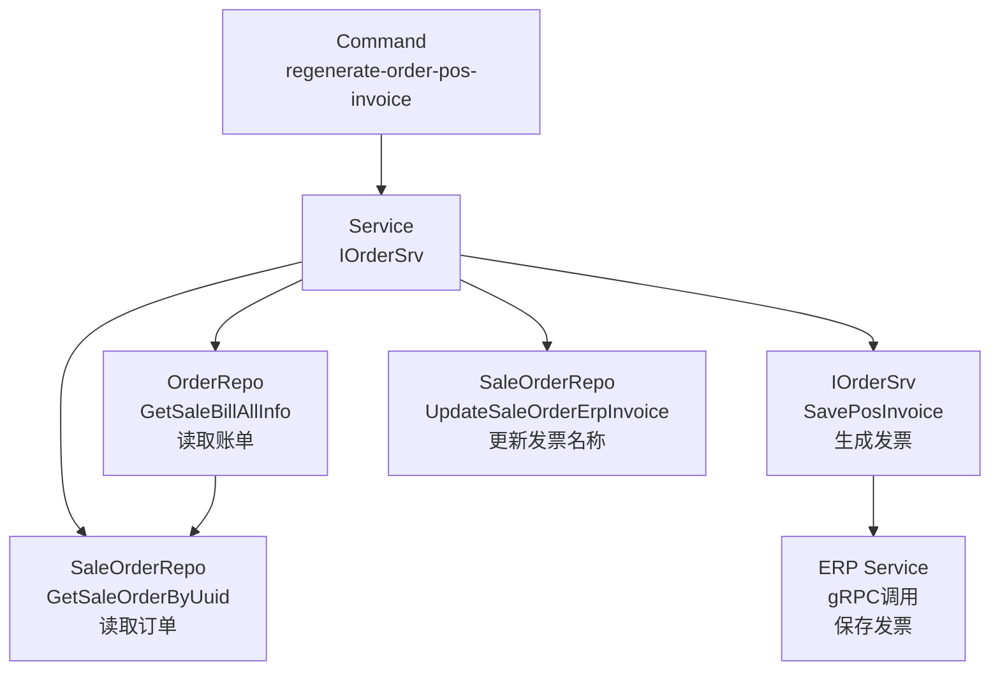
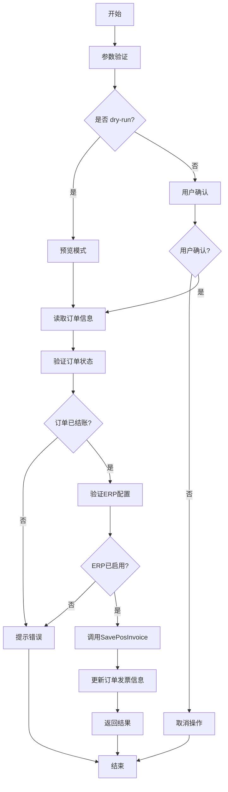
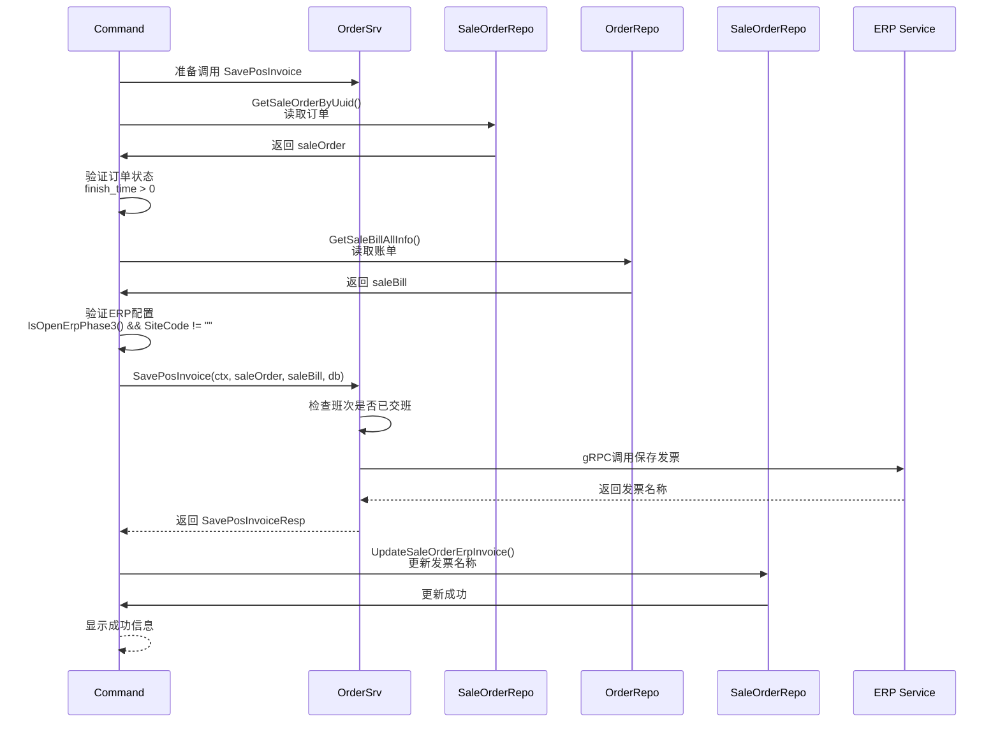

# 重新生成订单POS发票 设计文档

> 本文档定义重新生成订单POS发票功能的技术设计和实现方案。

## 📋 概述

本功能提供一个命令行工具，用于重新生成指定销售订单的POS发票。核心实现是复用现有的 `SavePosInvoice` 方法，封装为命令行工具，支持预览模式和用户确认机制。

**技术要点**：
- 复用现有的 `SavePosInvoice` 方法，避免代码重复
- 读取订单信息（`saleOrder`、`saleBill`）
- 验证订单状态和ERP配置
- 调用 `SavePosInvoice` 方法生成发票
- 更新订单的发票信息字段
- 支持 `--dry-run` 预览模式，避免误操作

---

## 🎯 规范对齐

### Go Main 规范 (go-main.mdc)

- ✅ 命令文件放在 `main/command/` 目录
- ✅ 使用 Cobra 框架
- ✅ 不使用 panic，返回 error
- ✅ Service 只能依赖其他 Service 接口
- ✅ Repository 只持有 db 实例，不持有 DBManager

### 数据库规范 (database.mdc)

- ✅ 不涉及数据库表结构变更
- ✅ 使用现有的订单表和发票字段
- ✅ 更新操作使用事务保证数据一致性

---

## 🔄 代码复用分析

### 可复用的现有组件

- **IOrderSrv.SavePosInvoice()**: `main/app/service/order.go:4182`
  - 保存POS发票到ERP系统的完整逻辑
  - 处理商品列表、材料列表、税费、支付方式等
  - 支持商品发票和材料发票两种类型
  - 已包含班次检查、ERP配置验证等逻辑

- **OrderRepo.GetSaleBillAllInfo()**: `main/app/repository/order.go:1859-2097`
  - 获取销售账单完整信息，包含商品、BOM、材料关联等预加载
  - 已预加载 `SaleOrders.SaleOrderProducts.SaleOrderProductBoms.ProductBom` 等
  - 支持通过 `saleBillUuid` 获取完整订单信息

- **SaleOrderRepo.GetSaleOrderByUuid()**: `main/app/repository/sale_order.go:58-64`
  - 根据UUID获取销售订单
  - 支持通过订单UUID获取订单基本信息

- **SaleOrderRepo.UpdateSaleOrderErpInvoice()**: `main/app/repository/sale_order.go:23`
  - 更新订单的ERP发票名称
  - 更新 `ErpProductsInvoiceName` 和 `ErpMaterialInvoiceName` 字段

- **OrderRepo.GetSaleBillRecord()**: `main/app/repository/order.go:1495-1502`
  - 获取销售账单记录（基础信息）
  - 用于获取 `saleBill` 对象

### 集成点

- **数据库表**: `ttpos_sale_order` - 订单表（读取订单信息，更新发票字段）
- **数据库表**: `ttpos_sale_bill` - 账单表（读取账单信息）
- **ERP服务**: 通过 `SavePosInvoice` 方法调用ERP gRPC服务
- **订单数据**: 通过 `GetSaleOrderByUuid()` 和 `GetSaleBillAllInfo()` 获取
- **发票保存**: 复用 `SavePosInvoice` 方法的完整逻辑

---

## 🏗️ 架构设计

### 分层设计原则

**命令行工具架构**:

```
Command Layer (regenerate_order_pos_invoice.go)
  ↓ 调用
Service Layer (IOrderSrv.SavePosInvoice)
  ↓ 调用
Repository Layer (OrderRepo, SaleOrderRepo)
  ↓ 调用
ERP Service (gRPC)
```

**依赖规则**:

- ✅ Command 调用 Service 接口
- ✅ Service 调用 Repository 和 ERP Service
- ✅ 复用现有 Service 方法
- ✅ 业务逻辑封装在 Service 中

### 架构图



### 模块划分

#### Go Main 模块

- **Command 层**: `main/command/regenerate_order_pos_invoice.go` - 命令行工具入口
- **Service 层**: `main/app/service/order.go` - 业务逻辑实现（复用现有 `SavePosInvoice` 方法）
- **Repository 层**: `main/app/repository/` - 数据访问（复用现有）
  - `sale_order.go` - 订单操作
  - `order.go` - 账单操作

---

## 🗄️ 数据库设计

### 数据表设计

#### 表: ttpos_sale_order（复用现有表）

**字段说明**:
| 字段 | 类型 | 说明 | 约束 |
|------|------|------|------|
| uuid | bigint unsigned | 订单UUID | PRIMARY KEY |
| sale_bill_uuid | bigint unsigned | 账单UUID | INDEX |
| finish_time | int(10) | 完成时间（结账时间） | DEFAULT 0 |
| erp_products_invoice_name | varchar(255) | 商品发票名称 | DEFAULT '' |
| erp_material_invoice_name | varchar(255) | 材料发票名称 | DEFAULT '' |

**操作**:
- **读取**: 通过 `GetSaleOrderByUuid()` 读取订单信息
- **更新**: 通过 `UpdateSaleOrderErpInvoice()` 更新发票名称

#### 表: ttpos_sale_bill（复用现有表）

**字段说明**:
| 字段 | 类型 | 说明 | 约束 |
|------|------|------|------|
| uuid | bigint unsigned | 账单UUID | PRIMARY KEY |

**操作**:
- **读取**: 通过 `GetSaleBillAllInfo()` 读取账单完整信息

---

## 📊 数据模型

### Go Model（复用现有）

```go
// main/app/model/sale_order.go
type SaleOrder struct {
    BaseModel
    SaleBillUuid            uint64 `gorm:"column:sale_bill_uuid"`
    FinishTime              int64  `gorm:"column:finish_time"`
    ErpProductsInvoiceName  string `gorm:"column:erp_products_invoice_name"`
    ErpMaterialInvoiceName  string `gorm:"column:erp_material_invoice_name"`
    // ... 其他字段
}

// main/app/model/sale_bill.go
type SaleBill struct {
    BaseModel
    SaleOrders []*SaleOrder `gorm:"foreignKey:SaleBillUuid;references:Uuid"`
    // ... 其他字段
}
```

---

## 🔌 命令行接口设计

### 命令格式

```bash
./main regenerate-order-pos-invoice --company-uuid <门店UUID> --sale-order-uuid <销售订单UUID> [--dry-run]
```

### 参数说明

| 参数 | 类型 | 必填 | 说明 |
|------|------|------|------|
| `--company-uuid` | uint64 | 是 | 门店 UUID |
| `--sale-order-uuid` | uint64 | 是 | 销售订单 UUID |
| `--dry-run` | bool | 否 | 预览模式，不实际执行 |

### 执行流程



---

## 🔧 服务接口设计

### 接口定义

```go
// IOrderSrv 接口（已存在）
SavePosInvoice(
    ctx context.Context,
    saleOrder *model.SaleOrder,
    saleBill *model.SaleBill,
    db *gorm.DB,
) (*selling.SavePosInvoiceResp, error)
```

### 实现流程



---

## 🔐 安全设计

### 参数验证

- **参数验证**: 验证 `companyUuid` 和 `saleOrderUuid` 的有效性
- **订单验证**: 验证订单存在性和状态（必须已完成结账）
- **ERP配置验证**: 验证ERP Phase3是否启用，SiteCode是否配置
- **错误处理**: 返回明确的错误信息

### 数据一致性

- **事务管理**: 更新订单发票信息时使用事务（如需要）
- **错误处理**: 发票保存失败时，不更新订单发票信息
- **日志记录**: 记录所有操作日志，便于审计和排查

---

## 📝 实现细节

### 1. 读取订单信息

```go
// 读取订单
saleOrderRepo := repository.NewSaleOrderRepo(db)
saleOrder, err := saleOrderRepo.GetSaleOrderByUuid(saleOrderUuid)
if err != nil {
    return errors.WithMessage(err, "订单不存在")
}

// 验证订单状态
if saleOrder.FinishTime == 0 {
    return errors.New("订单未完成结账，无法生成发票")
}

// 读取账单信息
orderRepo := repository.NewOrderRepo(db)
saleBill, err := orderRepo.GetSaleBillAllInfo(saleOrder.SaleBillUuid)
if err != nil {
    return errors.WithMessage(err, "获取账单信息失败")
}
```

### 2. 验证ERP配置

```go
// 获取公司信息和设置
company := ctx.GetCompany()
companySetting := ctx.GetCompanySetting()

// 验证ERP Phase3是否启用
if !company.IsOpenErpPhase3() {
    return errors.New("ERP Phase3未启用，无法生成发票")
}

// 验证SiteCode是否配置
if companySetting.ErpnextSiteCode == "" {
    return errors.New("ERP SiteCode未配置，无法生成发票")
}
```

### 3. 调用SavePosInvoice方法

```go
// 创建 gin.Context（命令行环境）
ctx := &gin.Context{}

// 初始化 OrderSrv
orderSrv := service.NewOrderSrv(dbm, settingSrv, cache.Global)

// 调用 SavePosInvoice 方法
res, err := orderSrv.SavePosInvoice(ctx, saleOrder, saleBill, db)
if err != nil {
    return errors.WithMessage(err, "保存发票失败")
}

// 获取发票名称
productsInvoiceName := res.ProductsInvoiceName
materialInvoiceName := res.MaterialInvoiceName
```

### 4. 更新订单发票信息

```go
// 更新订单发票名称
saleOrderRepo := repository.NewSaleOrderRepo(db)
err = saleOrderRepo.UpdateSaleOrderErpInvoice(
    saleOrderUuid,
    productsInvoiceName,
    materialInvoiceName,
)
if err != nil {
    return errors.WithMessage(err, "更新订单发票信息失败")
}
```

---

## 🧪 测试策略

### 单元测试

- **Command 层测试**: 测试命令行工具参数解析和验证
  - 测试参数验证
  - 测试订单读取和验证
  - 测试ERP配置验证
  - 测试 `--dry-run` 模式
  - 覆盖率要求：≥ 70%

- **Service 层测试**: 测试 `SavePosInvoice` 方法（已存在）
  - 测试正常流程
  - 测试班次检查
  - 测试ERP调用
  - 覆盖率要求：≥ 70%

### 集成测试

- **端到端测试**: 测试完整的发票生成流程
  - 创建测试数据（订单、账单）
  - 执行重新生成发票操作
  - 验证发票已保存到ERP系统
  - 验证订单发票名称已更新

### 命令行测试

- **参数测试**: 测试所有参数组合
  - 必填参数缺失
  - 无效的 UUID
  - dry-run 模式
  - 用户确认机制

---

## 📚 参考资料

### 核心规范

- `.cursor/rules/go-main.mdc` - Go Main 核心约束
- `.cursor/rules/database.mdc` - 数据库开发规范
- `.cursor/rules/security.mdc` - 安全开发规范

### 相关文档

- [重新生成销售账单材料出库记录设计文档](../story-main-regenerate-sale-bill-material-outbound/design.md)
- [ERP集成文档](../../../human/architecture/features/recharge_order.md)

### 代码参考

- `main/app/service/order.go:4182` - `SavePosInvoice` 方法实现
- `main/app/service/order_pay.go:929-939` - 订单支付后保存发票逻辑
- `main/command/regenerate_sale_bill_material_outbound.go` - 命令行工具参考实现

---

**版本**: v1.0.0  
**创建日期**: 2025-12-16  
**作者**: xiezhihuan  
**审核者**: {审核者}

