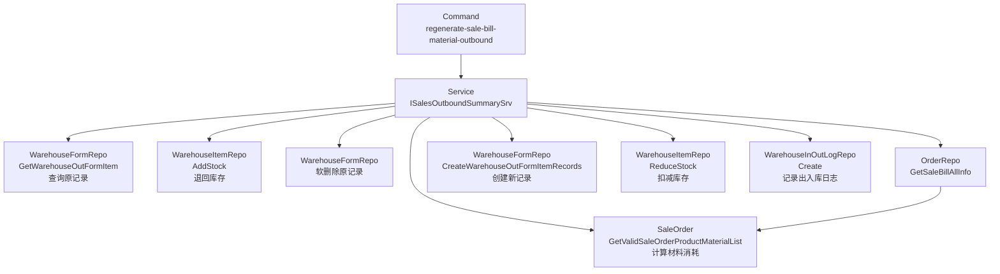
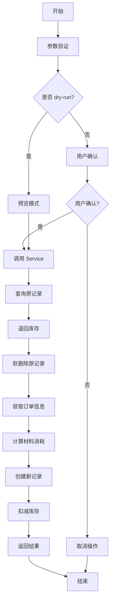
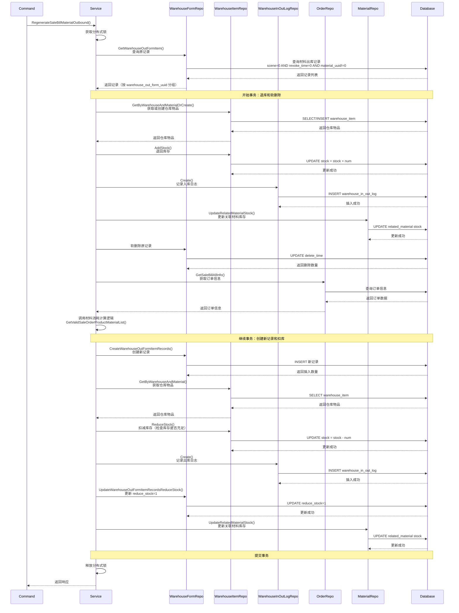

# 重新生成销售账单材料出库记录 设计文档

> 本文档定义重新生成销售账单材料出库记录功能的技术设计和实现方案。

## 📋 概述

本功能提供一个命令行工具和服务接口，用于重新生成指定销售账单的材料出库记录（`ttpos_warehouse_out_form_item`）。核心实现是复用订单材料统计逻辑，封装为命令行工具和服务方法，支持预览模式和用户确认机制。

**技术要点**：
- 复用现有材料消耗计算逻辑（`RegenerateOrderMaterial`），避免代码重复
- 查询原记录并按 `warehouse_out_form_uuid` 分组，保持关联关系
- **库存操作**：软删除原记录时退回库存，创建新记录时扣减库存
- 使用数据库事务保证所有操作（退库、软删除、创建、扣库）的原子性
- 支持 `--dry-run` 预览模式，避免误操作
- 软删除原记录，保留历史数据
- 记录出入库日志，保证库存操作的可追溯性

---

## 🎯 规范对齐

### Go Main 规范 (go-main.mdc)

- ✅ 命令文件放在 `main/command/` 目录
- ✅ 使用 Cobra 框架
- ✅ 不使用 panic，返回 error
- ✅ 接口以 `I` 开头，实现以 `Impl` 结尾
- ✅ Service 只能依赖其他 Service 接口
- ✅ Repository 只持有 db 实例，不持有 DBManager

### 数据库规范 (database.mdc)

- ✅ 复用现有表 `ttpos_warehouse_out_form_item`
- ✅ 使用软删除（`delete_time` 字段）
- ✅ 事务保证数据一致性

---

## 🔄 代码复用分析

### 可复用的现有组件

- **ISalesOutboundSummarySrv.RegenerateOrderMaterial()**: `main/app/service/sales_outbound_summary_service.go:127-199`
  - 重新生成订单材料用料记录的逻辑
  - 获取订单信息、计算材料消耗、删除旧记录、插入新记录
  - 支持分布式锁和事务管理

- **OrderRepo.GetSaleBillAllInfo()**: `main/app/repository/order.go:1859-2097`
  - 获取销售账单完整信息，包含商品、BOM、材料关联等预加载
  - 已预加载 `SaleOrders.SaleOrderProducts.SaleOrderProductBoms.ProductBom` 等

- **WarehouseFormRepo.GetWarehouseOutFormItem()**: `main/app/repository/warehouse_form.go:67-81`
  - 查询出库单明细记录（支持条件查询）
  - 支持过滤条件：`scene = 0 AND revoke_time = 0 AND material_uuid != 0`

- **WarehouseFormRepo.CreateWarehouseOutFormItemRecords()**: `main/app/repository/warehouse_form.go:209-218`
  - 批量创建出库单明细记录
  - 自动处理 SetNil() 方法

- **WarehouseItemRepo.AddStock()**: `main/app/repository/warehouse_item.go:281-284`
  - 增加库存（用于退库操作）
  - 使用 `UPDATE stock = stock + ?` 原子操作

- **WarehouseItemRepo.ReduceStock()**: `main/app/repository/warehouse_item.go:286-289`
  - 减少库存（用于扣库操作）
  - 使用 `UPDATE stock = stock - ?` 原子操作

- **WarehouseItemRepo.GetByWarehouseAndMaterialOrCreate()**: `main/app/repository/warehouse_item.go`
  - 获取或创建仓库物品库存记录
  - 用于退库时确保仓库物品记录存在

- **WarehouseItemRepo.GetByWarehouseAndMaterial()**: `main/app/repository/warehouse_item.go`
  - 获取仓库物品库存记录
  - 用于扣库前检查库存是否充足

- **WarehouseInOutLogRepo.Create()**: `main/app/repository/warehouse_in_out_log.go`
  - 记录出入库日志
  - 用于记录退库和扣库操作

- **MaterialRepo.UpdateRelatedMaterialStock()**: `main/app/repository/material.go`
  - 更新关联材料库存（规格/加料关联材料）
  - 用于退库和扣库后更新关联库存

- **Model.NewWarehouseOutForm()**: `main/app/model/warehouse_form.go:165-229`
  - 创建出库单和出库单明细的工厂方法
  - 支持规格商品/小料和原材料两种类型

### 集成点

- **数据库表**: `ttpos_warehouse_out_form_item` - 复用现有表结构
- **数据库表**: `ttpos_warehouse_out_form` - 验证出库单是否存在
- **数据库表**: `ttpos_warehouse_item` - 仓库物品库存表（退库和扣库操作）
- **数据库表**: `ttpos_warehouse_in_out_log` - 出入库日志表（记录库存操作）
- **订单数据**: 通过 `GetSaleBillAllInfo()` 获取，已包含必要的预加载
- **材料计算**: 复用 `RegenerateOrderMaterial()` 中的材料消耗计算逻辑
- **库存操作**: 复用现有的库存操作方法（`AddStock`, `ReduceStock`）

---

## 🏗️ 架构设计

### 分层设计原则

**命令行工具和服务架构**:

```
Command Layer (regenerate_sale_bill_material_outbound.go)
  ↓ 调用
Service Layer (ISalesOutboundSummarySrv.RegenerateSaleBillMaterialOutbound)
  ↓ 调用
Repository Layer (WarehouseFormRepo, OrderRepo)
  ↓ 调用
Model Layer (SaleOrder.GetValidSaleOrderProductMaterialList)
```

**依赖规则**:

- ✅ Command 调用 Service 接口
- ✅ Service 调用 Repository 和 Model
- ✅ 复用现有 Repository 方法
- ✅ 业务逻辑封装在 Service 中

### 架构图



### 模块划分

#### Go Main 模块

- **Command 层**: `main/command/regenerate_sale_bill_material_outbound.go` - 命令行工具入口
- **Service 层**: `main/app/service/sales_outbound_summary_service.go` - 业务逻辑实现
- **Repository 层**: `main/app/repository/` - 数据访问（复用现有）
  - `warehouse_form.go` - 出库单明细操作
  - `warehouse_item.go` - 仓库物品库存操作（退库和扣库）
  - `warehouse_in_out_log.go` - 出入库日志操作
  - `material.go` - 材料操作（更新关联库存）
  - `order.go` - 获取订单信息
- **Model 层**: `main/app/model/` - 数据模型和业务逻辑（复用现有）
  - `warehouse_form.go` - 出库单和出库单明细模型
  - `sale_order.go` - 订单模型和材料计算逻辑
- **DTO 层**: `main/app/dto/resp/sales_outbound_summary_resp.go` - 响应结构

---

## 🗄️ 数据库设计

### 数据表设计

#### 表: ttpos_warehouse_out_form_item（复用现有表）

**表结构**（已存在，无需创建）：

```sql
CREATE TABLE IF NOT EXISTS `ttpos_warehouse_out_form_item` (
    `id` INT(11) UNSIGNED NOT NULL AUTO_INCREMENT PRIMARY KEY COMMENT '自增ID',
    `uuid` BIGINT UNSIGNED NOT NULL DEFAULT 0 COMMENT '出库单明细uuid',
    `num` DECIMAL(22, 4) NOT NULL DEFAULT 0 COMMENT '数量',
    `scene` INT(10) NOT NULL DEFAULT 0 COMMENT '场景,0-sales销售 1-adjust调整 2-loss损耗 3-lost丢失 4-delete删除',
    `status` INT(10) NOT NULL DEFAULT 0 COMMENT '状态,0-预出库 1-已出库',
    `reduce_stock` INT(10) NOT NULL DEFAULT 0 COMMENT '是否已经减库存,0-未减库存 1-已减库存',
    `revoke_time` INT(10) NOT NULL DEFAULT 0 COMMENT '撤销时间(时间戳)',
    `material_uuid` BIGINT UNSIGNED NOT NULL DEFAULT 0 COMMENT '材料uuid',
    `warehouse_out_form_uuid` BIGINT UNSIGNED NOT NULL DEFAULT 0 COMMENT '出库单uuid',
    `warehouse_uuid` BIGINT UNSIGNED NOT NULL DEFAULT 0 COMMENT '仓库uuid',
    `product_bom_uuid` BIGINT UNSIGNED NOT NULL DEFAULT 0 COMMENT '商品BOM表uuid',
    `sale_order_product_uuid` BIGINT UNSIGNED NOT NULL DEFAULT 0 COMMENT '销售订单商品uuid',
    `sale_order_uuid` BIGINT UNSIGNED NOT NULL DEFAULT 0 COMMENT '销售订单uuid',
    `sale_bill_uuid` BIGINT UNSIGNED NOT NULL DEFAULT 0 COMMENT '销售账单uuid',
    `package_uuid` BIGINT UNSIGNED NOT NULL DEFAULT 0 COMMENT '套餐uuid',
    `staff_shift_log_uuid` BIGINT UNSIGNED NOT NULL DEFAULT 0 COMMENT '班次uuid',
    `create_time` INT(10) UNSIGNED NOT NULL DEFAULT 0 COMMENT '创建时间(时间戳)',
    `update_time` INT(10) UNSIGNED NOT NULL DEFAULT 0 COMMENT '更新时间(时间戳)',
    `delete_time` INT(10) UNSIGNED NOT NULL DEFAULT 0 COMMENT '删除时间(时间戳)',
    UNIQUE KEY `unique_uuid` (`uuid`),
    INDEX `idx_warehouse_out_form_uuid` (`warehouse_out_form_uuid`),
    INDEX `idx_material_uuid` (`material_uuid`),
    INDEX `idx_product_bom_uuid` (`product_bom_uuid`),
    INDEX `idx_sale_bill_uuid` (`sale_bill_uuid`)
) ENGINE = InnoDB DEFAULT CHARSET = utf8mb4 COLLATE = utf8mb4_unicode_ci COMMENT = '出库单明细表';
```

**字段说明**:
| 字段 | 类型 | 说明 | 约束 |
|------|------|------|------|
| uuid | bigint unsigned | 出库单明细UUID | DEFAULT 0, UNIQUE |
| num | decimal(22,4) | 出库数量 | DEFAULT 0 |
| scene | int(10) | 场景类型 | DEFAULT 0 |
| status | int(10) | 状态（0-预出库，1-已出库） | DEFAULT 0 |
| reduce_stock | int(10) | 是否已减库存 | DEFAULT 0 |
| material_uuid | bigint unsigned | 材料UUID | DEFAULT 0, INDEX |
| warehouse_out_form_uuid | bigint unsigned | 出库单UUID | DEFAULT 0, INDEX |
| warehouse_uuid | bigint unsigned | 仓库UUID | DEFAULT 0 |
| sale_bill_uuid | bigint unsigned | 销售账单UUID | DEFAULT 0, INDEX |
| sale_order_uuid | bigint unsigned | 销售订单UUID | DEFAULT 0 |
| staff_shift_log_uuid | bigint unsigned | 员工班次记录UUID | DEFAULT 0 |
| delete_time | int(10) | 删除时间（软删除） | DEFAULT 0 |

**索引设计**:
- 主键索引: `PRIMARY KEY (id)`
- 唯一索引: `UNIQUE KEY unique_uuid (uuid)`
- 普通索引: `KEY idx_warehouse_out_form_uuid`, `KEY idx_material_uuid`, `KEY idx_sale_bill_uuid`

---

## 📊 数据模型

### Go Model（复用现有）

```go
// main/app/model/warehouse_form.go
type WarehouseOutFormItem struct {
    BaseModel
    Num                  float64 `gorm:"column:num;type:decimal(12,4);default:0;comment:数量"`
    Scene                int     `gorm:"column:scene;type:tinyint(2);default:0;comment:场景,0-销售出库 1-adjust调整 2-loss损耗 3-lost丢失 4-delete删除"`
    Status               int     `gorm:"column:status;type:tinyint(1);default:0;comment:状态,0-预出库 1-已出库"`
    ReduceStock          int     `gorm:"column:reduce_stock;type:tinyint(1);default:0;comment:是否已经减库存"`
    RevokeTime           int64   `gorm:"column:revoke_time;type:int(10);default:0;comment:撤销时间(时间戳)"`
    WarehouseOutFormUuid uint64  `gorm:"column:warehouse_out_form_uuid;type:bigint(20) unsigned;default:0;comment:出库单uuid"`
    WarehouseUuid        uint64  `gorm:"column:warehouse_uuid;type:bigint(20) unsigned;default:0;comment:仓库uuid"`
    ProductBomUuid       uint64  `gorm:"column:product_bom_uuid;type:bigint(20) unsigned;default:0;comment:商品BOM表uuid"`
    MaterialUuid         uint64  `gorm:"column:material_uuid;type:bigint(20) unsigned;default:0;comment:材料uuid"`
    PackageUuid          uint64  `gorm:"column:package_uuid;type:bigint(20) unsigned;default:0;comment:套餐uuid"`
    SaleOrderProductUuid uint64 `gorm:"column:sale_order_product_uuid;type:bigint(20) unsigned;default:0;comment:销售订单商品uuid"`
    SaleOrderUuid        uint64  `gorm:"column:sale_order_uuid;type:bigint(20) unsigned;default:0;comment:销售订单uuid"`
    SaleBillUuid         uint64  `gorm:"column:sale_bill_uuid;type:bigint(20) unsigned;default:0;comment:销售账单uuid"`
    StaffShiftLogUuid    uint64  `gorm:"column:staff_shift_log_uuid;type:bigint(20) unsigned;default:0;comment:员工交班记录ID"`
    
    ProductBom *ProductBom `gorm:"foreignKey:ProductBomUuid;references:Uuid"`
    Material   *Material   `gorm:"foreignKey:MaterialUuid;references:Uuid"`
}

func (model *WarehouseOutFormItem) IsMaterial() bool {
    return model.MaterialUuid != 0
}
```

---

## 🔌 命令行接口设计

### 命令格式

```bash
./main regenerate-sale-bill-material-outbound --company-uuid <门店UUID> --sale-bill-uuid <销售账单UUID> [--dry-run]
```

### 参数说明

| 参数 | 类型 | 必填 | 说明 |
|------|------|------|------|
| `--company-uuid` | uint64 | 是 | 门店 UUID |
| `--sale-bill-uuid` | uint64 | 是 | 销售账单 UUID |
| `--dry-run` | bool | 否 | 预览模式，不实际执行 |

### 执行流程



---

## 🔧 服务接口设计

### 接口定义

```go
// ISalesOutboundSummarySrv 接口新增方法
RegenerateSaleBillMaterialOutbound(
    ctx *gin.Context,
    companyUuid uint64,
    saleBillUuid uint64,
) (*resp.RegenerateSaleBillMaterialOutboundResp, error)
```

### 响应结构

```go
// main/app/dto/resp/sales_outbound_summary_resp.go
type RegenerateSaleBillMaterialOutboundResp struct {
    DeletedCount int   `json:"deleted_count"`   // 删除的记录数
    InsertedCount int   `json:"inserted_count"` // 插入的记录数
    DurationMs   int64 `json:"duration_ms"`   // 操作耗时（毫秒）
}
```

### 实现流程



---

## 🔐 安全设计

### 分布式锁

- **锁Key格式**: `regenerate_sale_bill_material_outbound:{companyUuid}:{saleBillUuid}`
- **锁实现**: `lock.NewSystemLock().TryLockUuidString(lockKey)`
- **锁释放**: `defer systemLock.UnlockUuidString(lockKey)`
- **目的**: 防止并发操作同一销售账单

### 事务管理

- **事务范围**: 所有操作（退库、软删除、创建新记录、扣库）在同一事务中执行
- **操作顺序**: 先退库再扣库，确保库存操作的连续性
- **回滚机制**: 任何步骤失败时回滚所有操作（包括库存操作）
- **实现**: `repository.CommonRepo.Transaction(db, func(tx *gorm.DB) error { ... })`
- **库存检查**: 扣库前检查库存是否充足，不足时返回错误并回滚

### 数据验证

- **参数验证**: 验证 `companyUuid` 和 `saleBillUuid` 的有效性
- **数据存在性**: 验证销售账单和出库单的存在性
- **错误处理**: 返回明确的错误信息

---

## 📝 实现细节

### 1. 查询原记录

```go
// 查询销售账单的所有材料出库记录（scene = 0 AND revoke_time = 0 AND material_uuid != 0）
warehouseFormRepo := repository.NewWarehouseFormRepo(db)
warehouseOutFormItems, err := warehouseFormRepo.GetWarehouseOutFormItem(
    repository.CommonRepo.WhereBySaleBillUuid(saleBillUuid),
    repository.CommonRepo.WhereBySoftDelete(),
    repository.CommonRepo.WhereByNotRevoked(),
    func(db *gorm.DB) *gorm.DB {
        return db.Where("scene = ? AND material_uuid != ?", constant.WarehouseOutFormSceneSales, 0)
    },
)
if err != nil {
    return nil, errors.WithMessage(err, "查询材料出库记录失败")
}

materialItems := warehouseOutFormItems

// 按 warehouse_out_form_uuid 分组
formItemMap := make(map[uint64][]*model.WarehouseOutFormItem)
for _, item := range materialItems {
    formItemMap[item.WarehouseOutFormUuid] = append(formItemMap[item.WarehouseOutFormUuid], item)
}
```

### 2. 退回库存和软删除原记录

```go
// 在事务中退回库存并软删除原记录
var deletedCount int64
err = repository.CommonRepo.Transaction(db, func(tx *gorm.DB) error {
    warehouseItemRepo := repository.NewWarehouseItemRepo(tx)
    warehouseLogRepo := repository.NewWarehouseInOutLogRepo(tx)
    materialRepo := repository.NewMaterialRepo(tx)
    
    // 按 warehouse_uuid 和 material_uuid 分组汇总需要退回的数量
    returnStockMap := make(map[string]*struct {
        WarehouseUuid uint64
        MaterialUuid  uint64
        ReturnNum     float64
        Material      *model.Material
    })
    
    for _, item := range materialItems {
        key := fmt.Sprintf("%d_%d", item.WarehouseUuid, item.MaterialUuid)
        if returnStock, ok := returnStockMap[key]; ok {
            returnStock.ReturnNum += item.Num
        } else {
            // 获取材料信息
            material, err := materialRepo.GetMaterialByUuid(item.MaterialUuid, materialRepo.WithRelatedMaterialList())
            if err != nil {
                return errors.WithMessage(err, fmt.Sprintf("获取材料信息失败: %d", item.MaterialUuid))
            }
            
            returnStockMap[key] = &struct {
                WarehouseUuid uint64
                MaterialUuid  uint64
                ReturnNum     float64
                Material      *model.Material
            }{
                WarehouseUuid: item.WarehouseUuid,
                MaterialUuid:  item.MaterialUuid,
                ReturnNum:     item.Num,
                Material:      &material,
            }
        }
    }
    
    // 退回库存
    for _, returnInfo := range returnStockMap {
        if returnInfo.ReturnNum <= 0 {
            continue
        }
        
        // 获取或创建仓库物品库存记录
        warehouseItem, err := warehouseItemRepo.GetByWarehouseAndMaterialOrCreate(
            returnInfo.WarehouseUuid,
            returnInfo.MaterialUuid,
            returnInfo.Material.Code,
            returnInfo.Material.Valuation,
        )
        if err != nil {
            return errors.WithMessage(err, "获取仓库物品库存失败")
        }
        
        // 增加库存
        if err := warehouseItemRepo.AddStock(warehouseItem.Uuid, returnInfo.ReturnNum); err != nil {
            return errors.WithMessage(err, "增加材料库存失败")
        }
        
        // 记录入库日志（退回）
        baseUnitUuid := uint64(0)
        baseUnitName := ""
        if baseUnit := returnInfo.Material.GetBaseUnit(); baseUnit != nil {
            baseUnitUuid = baseUnit.Uuid
            if baseUnit.Unit != nil {
                baseUnitName = baseUnit.Unit.MultiLanguageName.ToJson()
            }
        }
        
        warehouseLog := &model.WarehouseInOutLog{
            LogType:              constant.WarehouseInOutLogLogTypeIn,
            Scene:                constant.WarehouseInOutLogSceneReturn, // 退菜入库
            WarehouseUuid:        returnInfo.WarehouseUuid,
            MaterialUuid:         returnInfo.MaterialUuid,
            MaterialName:         returnInfo.Material.Name,
            MaterialBaseUnitUuid: baseUnitUuid,
            MaterialBaseUnitName: baseUnitName,
            Num:                  returnInfo.ReturnNum,
        }
        if err := warehouseLogRepo.Create(warehouseLog); err != nil {
            return errors.WithMessage(err, "记录入库日志失败")
        }
        
        // 更新关联材料库存
        relatedMaterialUuids := returnInfo.Material.GetRelatedMaterialUuids()
        if len(relatedMaterialUuids) > 0 {
            if err := materialRepo.UpdateRelatedMaterialStock(relatedMaterialUuids); err != nil {
                return errors.WithMessage(err, "更新关联材料库存失败")
            }
        }
    }
    
    // 软删除原记录
    result := tx.Model(&model.WarehouseOutFormItem{}).
        Where("sale_bill_uuid = ? AND scene = ? AND revoke_time = ? AND material_uuid != ? AND delete_time = ?",
            saleBillUuid, constant.WarehouseOutFormSceneSales, 0, 0, constant.NotDeleted).
        Update("delete_time", time.Now().Unix())
    if result.Error != nil {
        return errors.WithMessage(result.Error, "软删除原记录失败")
    }
    deletedCount = result.RowsAffected
    
    return nil
})
if err != nil {
    return nil, errors.WithMessage(err, "退回库存和软删除原记录失败")
}
```

### 3. 重新计算材料消耗

```go
// 获取订单信息
saleBill, err := orderRepo.GetSaleBillAllInfo(saleBillUuid)
if err != nil {
    return nil, errors.WithMessage(err, "获取订单信息失败")
}

// 复用 RegenerateOrderMaterial 的材料消耗计算逻辑
// 遍历订单中的所有订单，计算材料消耗
materialStocks := make([]*model.MaterialStock, 0)
for _, saleOrder := range saleBill.SaleOrders {
    stocks := saleOrder.GetValidSaleOrderProductMaterialList()
    materialStocks = append(materialStocks, stocks...)
}
```

### 4. 创建新记录、扣减库存并关联原出库单UUID

```go
// 在事务中创建新记录并扣减库存
var insertedCount int64
err = repository.CommonRepo.Transaction(db, func(tx *gorm.DB) error {
    warehouseFormRepo := repository.NewWarehouseFormRepo(tx)
    warehouseItemRepo := repository.NewWarehouseItemRepo(tx)
    warehouseLogRepo := repository.NewWarehouseInOutLogRepo(tx)
    materialRepo := repository.NewMaterialRepo(tx)
    
    // 按 warehouse_out_form_uuid 分组创建新记录
    newItems := make([]*model.WarehouseOutFormItem, 0)
    for warehouseOutFormUuid, originalItems := range formItemMap {
        // 验证出库单是否存在
        warehouseOutForm, err := warehouseFormRepo.GetWarehouseForm(
            repository.CommonRepo.WhereByUuid(warehouseOutFormUuid),
            repository.CommonRepo.WhereBySoftDelete(),
        )
        if err != nil || warehouseOutForm == nil {
            logger.Logger.Warn("出库单不存在，使用原UUID", zap.Uint64("warehouseOutFormUuid", warehouseOutFormUuid))
        }
        
        // 为每个材料创建新记录
        for _, materialStock := range materialStocksList {
            // 查找对应的原记录（按 material_uuid 匹配）
            var originalItem *model.WarehouseOutFormItem
            for _, item := range originalItems {
                if item.MaterialUuid == materialStock.MaterialUuid {
                    originalItem = item
                    break
                }
            }
            
            if originalItem == nil {
                continue // 跳过没有对应原记录的材料
            }
            
            // 创建新记录
            uuid, _ := utils.GetID()
            newItem := &model.WarehouseOutFormItem{
                BaseModel: model.BaseModel{
                    Uuid:       uuid,
                    CreateTime: time.Now().Unix(),
                },
                WarehouseOutFormUuid: warehouseOutFormUuid, // 关联原出库单UUID
                WarehouseUuid:        materialStock.WarehouseUuid,
                MaterialUuid:         materialStock.MaterialUuid,
                SaleBillUuid:         saleBillUuid,
                SaleOrderUuid:        originalItem.SaleOrderUuid,
                StaffShiftLogUuid:    originalItem.StaffShiftLogUuid,
                Num:                  decimal.NewFromFloat(materialStock.StockNum).Round(4).InexactFloat64(),
                Scene:                constant.WarehouseOutFormSceneSales,
                Status:               constant.WarehouseOutFormItemStatusSuccess,
                ReduceStock:          constant.WarehouseOutFormItemReduceStockNotProcessed,
            }
            newItems = append(newItems, newItem)
        }
    }
    
    // 批量创建新记录
    if len(newItems) > 0 {
        if err := warehouseFormRepo.CreateWarehouseOutFormItemRecords(newItems); err != nil {
            return errors.WithMessage(err, "创建新记录失败")
        }
        insertedCount = int64(len(newItems))
        
        // 按 warehouse_uuid 和 material_uuid 分组汇总需要扣减的数量
        reduceStockMap := make(map[string]*struct {
            WarehouseUuid uint64
            MaterialUuid  uint64
            ReduceNum     float64
            Material      *model.Material
        })
        
        for _, item := range newItems {
            key := fmt.Sprintf("%d_%d", item.WarehouseUuid, item.MaterialUuid)
            if reduceStock, ok := reduceStockMap[key]; ok {
                reduceStock.ReduceNum += item.Num
            } else {
                // 获取材料信息
                material, err := materialRepo.GetMaterialByUuid(item.MaterialUuid, materialRepo.WithRelatedMaterialList())
                if err != nil {
                    return errors.WithMessage(err, fmt.Sprintf("获取材料信息失败: %d", item.MaterialUuid))
                }
                
                reduceStockMap[key] = &struct {
                    WarehouseUuid uint64
                    MaterialUuid  uint64
                    ReduceNum     float64
                    Material      *model.Material
                }{
                    WarehouseUuid: item.WarehouseUuid,
                    MaterialUuid:  item.MaterialUuid,
                    ReduceNum:     item.Num,
                    Material:      &material,
                }
            }
        }
        
        // 扣减库存
        for _, reduceInfo := range reduceStockMap {
            if reduceInfo.ReduceNum <= 0 {
                continue
            }
            
            // 获取仓库物品库存记录
            warehouseItem, err := warehouseItemRepo.GetByWarehouseAndMaterial(reduceInfo.WarehouseUuid, reduceInfo.MaterialUuid)
            if err != nil {
                return errors.WithMessage(err, fmt.Sprintf("获取仓库物品库存失败: %d", reduceInfo.MaterialUuid))
            }
            
            // 检查库存是否充足
            if warehouseItem.Stock < reduceInfo.ReduceNum {
                return errors.New(fmt.Sprintf("材料库存不足: material_uuid=%d, warehouse_uuid=%d, 需要=%f, 当前=%f",
                    reduceInfo.MaterialUuid, reduceInfo.WarehouseUuid, reduceInfo.ReduceNum, warehouseItem.Stock))
            }
            
            // 扣减库存
            if err := warehouseItemRepo.ReduceStock(warehouseItem.Uuid, reduceInfo.ReduceNum); err != nil {
                return errors.WithMessage(err, "扣减库存失败")
            }
            
            // 记录出库日志（销售出库）
            baseUnitUuid := uint64(0)
            baseUnitName := ""
            if baseUnit := reduceInfo.Material.GetBaseUnit(); baseUnit != nil {
                baseUnitUuid = baseUnit.Uuid
                if baseUnit.Unit != nil {
                    baseUnitName = baseUnit.Unit.MultiLanguageName.ToJson()
                }
            }
            
            warehouseLog := &model.WarehouseInOutLog{
                LogType:              constant.WarehouseInOutLogLogTypeOut,
                Scene:                constant.WarehouseInOutLogSceneSale, // 销售出库
                WarehouseUuid:        reduceInfo.WarehouseUuid,
                MaterialUuid:         reduceInfo.MaterialUuid,
                MaterialName:         reduceInfo.Material.Name,
                MaterialBaseUnitUuid: baseUnitUuid,
                MaterialBaseUnitName: baseUnitName,
                Num:                  reduceInfo.ReduceNum,
            }
            if err := warehouseLogRepo.Create(warehouseLog); err != nil {
                return errors.WithMessage(err, "记录出库日志失败")
            }
            
            // 更新关联材料库存
            relatedMaterialUuids := reduceInfo.Material.GetRelatedMaterialUuids()
            if len(relatedMaterialUuids) > 0 {
                if err := materialRepo.UpdateRelatedMaterialStock(relatedMaterialUuids); err != nil {
                    return errors.WithMessage(err, "更新关联材料库存失败")
                }
            }
        }
        
        // 更新出库单明细的 reduce_stock = 1
        if err := warehouseFormRepo.UpdateWarehouseOutFormItemRecordsReduceStock(saleBillUuid); err != nil {
            return errors.WithMessage(err, "更新 reduce_stock 失败")
        }
    }
    
    return nil
})
if err != nil {
    return nil, errors.WithMessage(err, "创建新记录和扣减库存失败")
}
```

---

## 🧪 测试策略

### 单元测试

- **Service 层测试**: 测试 `RegenerateSaleBillMaterialOutbound()` 方法
  - 测试正常流程（包括退库和扣库）
  - 测试参数验证
  - 测试分布式锁
  - 测试事务回滚
  - 测试库存不足场景
  - 测试退库和扣库的库存操作
  - 覆盖率要求：≥ 70%

- **Repository 层测试**: 测试查询和创建方法
  - 测试 `GetWarehouseOutFormItem()`（带过滤条件）
  - 测试 `CreateWarehouseOutFormItemRecords()`
  - 测试 `AddStock()` 和 `ReduceStock()`
  - 覆盖率要求：≥ 80%

### 集成测试

- **端到端测试**: 测试完整的重新生成流程
  - 创建测试数据（销售账单、出库单、材料出库记录、仓库物品库存）
  - 执行重新生成操作
  - 验证原记录已软删除
  - 验证库存已退回（检查仓库物品库存增加）
  - 验证新记录已创建并关联原出库单UUID
  - 验证库存已扣减（检查仓库物品库存减少）
  - 验证出入库日志已记录
  - 验证 `reduce_stock` 字段已更新为 1

### 命令行测试

- **参数测试**: 测试所有参数组合
  - 必填参数缺失
  - 无效的 UUID
  - dry-run 模式
  - 用户确认机制

---

## 📚 参考资料

### 核心规范

- `.cursor/rules/go-main.mdc` - Go Main 核心约束
- `.cursor/rules/database.mdc` - 数据库开发规范
- `.cursor/rules/security.mdc` - 安全开发规范

### 相关文档

- [销售出库单明细业务逻辑文档](../../api/warehouse-out-form-item-sales.md)
- [重新生成订单材料用料命令设计文档](../story-main-regenerate-order-material/design.md)
- [成本卡材料消耗修正设计文档](../story-main-cost-card-material-consumption-correction/design.md)

### 代码参考

- `main/app/service/sales_outbound_summary_service.go` - 服务实现参考
- `main/command/regenerate_order_material.go` - 命令行工具参考
- `main/app/repository/warehouse_form.go` - Repository 实现参考

---

**版本**: v1.0.0  
**创建日期**: 2025-12-16  
**作者**: xiezhihuan  
**审核者**: {审核者}

