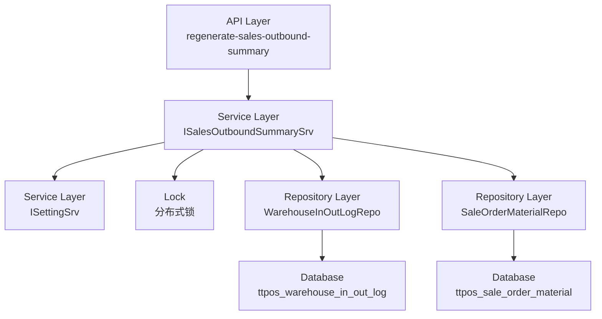

# 重新生成每日销售出库汇总记录 设计文档

> 本文档定义重新生成每日销售出库汇总记录功能的技术设计和实现方案。

## 📋 概述

本功能提供一个管理工具，支持重新生成指定日期的销售出库汇总记录。核心实现是提取 `DailySalesOutboundSummaryTask` 中的统计逻辑，封装为可复用的 Service 方法，并提供 API 接口、命令行工具和前端界面三种调用方式。

**技术要点**：
- 复用现有定时任务的统计逻辑，避免代码重复
- 使用分布式锁防止并发操作
- 事务保证数据一致性
- 软删除旧记录，支持数据恢复

---

## 🎯 规范对齐

### Go Main 规范 (go-main.mdc)

- ✅ Service 只依赖其他 Service 接口，不直接依赖 Repository
- ✅ Repository 只持有 db 实例，不持有 DBManager
- ✅ URL 使用 snake_case：`/api/shop/inventory/regenerate-sales-outbound-summary`
- ✅ data 字段必须是对象，不能是 null 或数组
- ✅ 不使用 panic，返回 error
- ✅ 接口以 `I` 开头，实现以 `Impl` 结尾

### API 设计规范 (api.mdc)

- ✅ URL 使用 snake_case
- ✅ 响应格式统一：`{code, message, data{}}`
- ✅ data 不能为 null 或数组
- ✅ 错误信息使用多语言支持

### 数据库规范 (database.mdc)

- ✅ 复用现有表 `ttpos_warehouse_in_out_log`
- ✅ 使用软删除（`delete_time` 字段）
- ✅ 事务保证数据一致性

---

## 🔄 代码复用分析

### 可复用的现有组件

- **DailySalesOutboundSummaryTask**: `main/app/tasks/daily_sales_outbound_summary.go`
  - `getDailySalesOutboundRecords()` - 获取销售出库记录
  - `saveOutboundSummaryRecords()` - 保存汇总记录
  - `getOpeningHours()` - 获取门店营业时间
  - `isBusinessEndTime()` - 判断营业结束时间
  - `generateOrderNo()` - 生成出库单号

- **WarehouseInOutLogRepo**: `main/app/repository/warehouse_in_out_log.go`
  - `GetWarehouseInOutLogs()` - 查询出入库记录
  - `Delete()` - 软删除记录
  - `Create()` - 创建记录

- **CostCardCorrectionService**: `main/app/service/cost_card_correction_service.go`
  - `saveOutboundSummaryRecords()` - 参考删除旧记录的逻辑

### 集成点

- **现有 API**: Shop 商家管理端的出入库记录列表 API
- **数据库表**: `ttpos_warehouse_in_out_log` - 复用现有表结构
- **分布式锁**: `pkg/lock` - 使用 Redis 分布式锁

---

## 🏗️ 架构设计

### 分层设计原则

**Go Main 三层架构**:

```
API 层 (Controller/API)
  ↓ 依赖
业务层 (Service)
  ↓ 依赖
数据层 (Repository)
```

**依赖规则**:

- ✅ 上层可依赖下层
- ❌ 禁止下层依赖上层
- ❌ 禁止跨层调用
- ❌ Service 不能依赖 Repository
- ✅ Service 可以依赖其他 Service 接口

### 架构图



### 模块划分

#### Go Main 模块

- **API 层**: `main/app/api/v1/shop/shop_warehouse.go` - 新增 API 方法
- **Service 层**: `main/app/service/sales_outbound_summary_service.go` - 新增 Service（提取公共逻辑）
- **Repository 层**: `main/app/repository/warehouse_in_out_log.go` - 复用现有 Repository
- **Model 层**: `main/app/model/warehouse_in_out_log.go` - 复用现有 Model
- **DTO 层**: `main/app/dto/req/` 和 `main/app/dto/resp/` - 新增请求和响应 DTO

#### Command 模块

- **Command 层**: `main/command/regenerate_sales_outbound.go` - 新增命令行工具

#### Vue 前端模块

- **Pages**: `admin/views/shop/pages/inventory/log/index.vue` - 修改现有页面
- **API**: `admin/views/shop/api/inventory.ts` - 新增 API 封装
- **Components**: 复用现有组件

---

## 🗄️ 数据库设计

### 数据表设计

本功能复用现有表结构，无需创建新表。

#### 表: ttpos_warehouse_in_out_log（复用）

**关键字段**:
- `opening_hours`: VARCHAR(255) - 营业时段，格式：`YYYYMMDD HH:mm-HH:mm`
- `log_type`: INT - 日志类型，1=出库
- `scene`: INT - 场景，1=销售出库
- `delete_time`: INT - 删除时间，0=未删除

**查询条件**:
- `log_type = 1` AND `scene = 1` AND `opening_hours LIKE 'YYYYMMDD%'` AND `delete_time = 0`

---

## 📊 数据模型

### Go Model（复用）

```go
// main/app/model/warehouse_in_out_log.go（已存在）
type WarehouseInOutLog struct {
    BaseModel
    LogType              int     `json:"log_type"`
    Scene                int     `json:"scene"`
    WarehouseUuid        uint64  `json:"warehouse_uuid"`
    MaterialUuid         uint64  `json:"material_uuid"`
    MaterialName         string  `json:"material_name"`
    MaterialBaseUnitUuid uint64  `json:"material_base_unit_uuid"`
    MaterialBaseUnitName string  `json:"material_base_unit_name"`
    Num                  float64 `json:"num"`
    Price                float64 `json:"price"`
    Amount               float64 `json:"amount"`
    SupplierUuid         uint64  `json:"supplier_uuid"`
    OrderNo              string  `json:"order_no"`
    OpeningHours         string  `json:"opening_hours"`
    // ...
}
```

### DTO 定义

#### Request DTO

```go
// main/app/dto/req/sales_outbound_summary_req.go
type RegenerateSalesOutboundSummaryReq struct {
    CompanyUuid uint64 `json:"company_uuid" binding:"required"`
    Date        string `json:"date" binding:"required"` // 格式：YYYY-MM-DD
}
```

#### Response DTO

```go
// main/app/dto/resp/sales_outbound_summary_resp.go
type RegenerateSalesOutboundSummaryResp struct {
    DeletedCount   int   `json:"deleted_count"`   // 删除的记录数
    GeneratedCount int   `json:"generated_count"` // 生成的记录数
    DurationMs     int64 `json:"duration_ms"`      // 操作耗时（毫秒）
}
```

---

## 🔌 API 设计

### RESTful API

#### API: 重新生成销售出库汇总记录

**请求**:

- **URL**: `/api/shop/inventory/regenerate-sales-outbound-summary`
- **Method**: `POST`
- **Headers**:
  ```json
  {
    "Authorization": "Bearer {token}",
    "Content-Type": "application/json"
  }
  ```
- **Body**:
  ```json
  {
    "company_uuid": 123456,
    "date": "2025-12-10"
  }
  ```

**响应**:

```json
{
  "code": 1,
  "message": "success",
  "data": {
    "deleted_count": 10,
    "generated_count": 12,
    "duration_ms": 1234
  }
}
```

**错误响应**:

```json
{
  "code": 0,
  "message": "操作进行中，请稍后再试",
  "data": {}
}
```

---

## 🧩 组件和接口

### Service 层

#### Service 接口

```go
// main/app/service/i_sales_outbound_summary_service.go
type ISalesOutboundSummarySrv interface {
    // RegenerateSalesOutboundSummary 重新生成指定日期的销售出库汇总记录
    RegenerateSalesOutboundSummary(ctx *gin.Context, companyUuid uint64, date string) (*dto_resp.RegenerateSalesOutboundSummaryResp, error)
}
```

#### Service 实现

```go
// main/app/service/sales_outbound_summary_service.go
type salesOutboundSummarySrv struct {
    dbm        *database.DBManager
    settingSrv setting.ISettingSrv // 依赖 Setting Service
}

func NewSalesOutboundSummarySrv(
    dbm *database.DBManager,
    settingSrv setting.ISettingSrv,
) ISalesOutboundSummarySrv {
    return &salesOutboundSummarySrv{
        dbm:        dbm,
        settingSrv: settingSrv,
    }
}

func (s *salesOutboundSummarySrv) RegenerateSalesOutboundSummary(
    ctx *gin.Context,
    companyUuid uint64,
    date string,
) (*dto_resp.RegenerateSalesOutboundSummaryResp, error) {
    startTime := time.Now()
    
    // 1. 获取分布式锁
    lockKey := fmt.Sprintf("regenerate_sales_outbound_summary:%d:%s", companyUuid, date)
    lock := lock.NewSystemLock()
    if !lock.TryLockUuid(lockKey) {
        return nil, errors.New("操作进行中，请稍后再试")
    }
    defer lock.UnlockUuid(lockKey)
    
    // 2. 解析日期
    targetDate, err := time.Parse("2006-01-02", date)
    if err != nil {
        return nil, errors.WithMessage(err, "日期格式错误")
    }
    
    // 3. 获取门店信息
    companyRepo := repository.NewCompanyRepo(s.dbm.GetDB(0))
    company, err := companyRepo.GetByUuid(companyUuid)
    if err != nil {
        return nil, errors.WithMessage(err, "门店不存在")
    }
    
    // 4. 检查是否是 ERP 商品
    if !company.IsOpenErp() {
        return nil, errors.New("该门店未开启 ERP 功能")
    }
    
    // 5. 获取营业时段配置
    openingHours, err := s.getOpeningHours(companyUuid)
    if err != nil {
        return nil, errors.WithMessage(err, "获取营业时段失败")
    }
    
    // 6. 计算时间范围
    startTimeUnix, endTimeUnix := s.calculateTimeRange(company, openingHours, targetDate)
    
    // 7. 构建 opening_hours 字符串
    dateStr := targetDate.Format("20060102")
    openingYearHours := fmt.Sprintf("%s %s", dateStr, openingHours)
    
    // 8. 删除旧记录
    deletedCount, err := s.deleteOldRecords(companyUuid, openingYearHours)
    if err != nil {
        return nil, errors.WithMessage(err, "删除旧记录失败")
    }
    
    // 9. 重新生成记录
    generatedCount, err := s.generateNewRecords(companyUuid, startTimeUnix, endTimeUnix, openingYearHours)
    if err != nil {
        return nil, errors.WithMessage(err, "生成新记录失败")
    }
    
    durationMs := time.Since(startTime).Milliseconds()
    
    return &dto_resp.RegenerateSalesOutboundSummaryResp{
        DeletedCount:   deletedCount,
        GeneratedCount: generatedCount,
        DurationMs:     durationMs,
    }, nil
}

// 提取的公共方法（从 DailySalesOutboundSummaryTask 中提取）
func (s *salesOutboundSummarySrv) getDailySalesOutboundRecords(companyUuid uint64, startTime, endTime int64) ([]*OutboundRecord, error) {
    // 复用 DailySalesOutboundSummaryTask.getDailySalesOutboundRecords 逻辑
}

func (s *salesOutboundSummarySrv) saveOutboundSummaryRecords(companyUuid uint64, records []*OutboundRecord, openingYearHours string) error {
    // 复用 DailySalesOutboundSummaryTask.saveOutboundSummaryRecords 逻辑
}
```

### API 层

```go
// main/app/api/v1/shop/shop_warehouse.go（新增方法）
func (h *WarehouseHandler) RegenerateSalesOutboundSummary(c *gin.Context) {
    var req dto_req.RegenerateSalesOutboundSummaryReq
    if err := c.ShouldBindJSON(&req); err != nil {
        helper.ErrorWithDetail(c, constant.CodeInvalidParam, err)
        return
    }
    
    // 权限校验（仅管理员）
    ctx := helper.GetContext(c)
    if !ctx.IsAdmin() {
        helper.ErrorWithDetail(c, constant.CodeNoPermission, errors.New("仅管理员可操作"))
        return
    }
    
    resp, err := h.salesOutboundSummarySrv.RegenerateSalesOutboundSummary(c, req.CompanyUuid, req.Date)
    if err != nil {
        helper.ErrorWithDetail(c, constant.CodeFail, errors.WithMessage(err))
        return
    }
    
    helper.Success(c, resp)
}
```

### Command 层

```go
// main/command/regenerate_sales_outbound.go
var (
    companyUuid uint64
    date        string
    dryRun      bool
)

var regenerateSalesOutboundCmd = &cobra.Command{
    Use:   "regenerate-sales-outbound",
    Short: "重新生成销售出库汇总记录",
    Long:  `重新生成指定门店和日期的销售出库汇总记录`,
    PreRun: func(cmd *cobra.Command, args []string) {
        // 初始化配置、日志、数据库等
    },
    Run: func(cmd *cobra.Command, args []string) {
        if dryRun {
            // 预览模式
            fmt.Println("预览模式：将删除和生成的记录数")
            return
        }
        
        // 调用 Service 方法
        dbm := database.GetDBManager(config.Database)
        settingSrv := setting.NewSrvImpl(dbm, cache.Global)
        srv := service.NewSalesOutboundSummarySrv(dbm, settingSrv)
        
        ctx := context.NewContext()
        resp, err := srv.RegenerateSalesOutboundSummary(ctx, companyUuid, date)
        if err != nil {
            fmt.Printf("操作失败: %v\n", err)
            os.Exit(1)
        }
        
        fmt.Printf("操作成功: 删除 %d 条记录，生成 %d 条记录，耗时 %d ms\n",
            resp.DeletedCount, resp.GeneratedCount, resp.DurationMs)
    },
}

func init() {
    regenerateSalesOutboundCmd.Flags().Uint64Var(&companyUuid, "company-uuid", 0, "门店 UUID（必填）")
    regenerateSalesOutboundCmd.Flags().StringVar(&date, "date", "", "日期，格式：YYYY-MM-DD（必填）")
    regenerateSalesOutboundCmd.Flags().BoolVar(&dryRun, "dry-run", false, "预览模式，不实际执行")
    rootCommand.AddCommand(regenerateSalesOutboundCmd)
}
```

---

## ⚡ 缓存设计

### Redis 分布式锁

**锁的 Key**: `regenerate_sales_outbound_summary:{company_uuid}:{date}`

**锁的超时时间**: 5 分钟

**使用方式**:
```go
lock := lock.NewSystemLock()
if !lock.TryLockUuid(lockKey) {
    return errors.New("操作进行中，请稍后再试")
}
defer lock.UnlockUuid(lockKey)
```

---

## 🚨 错误处理

### 错误场景

#### 场景 1: 并发操作

- **处理方式**: 使用分布式锁，如果获取锁失败，返回"操作进行中"错误
- **用户影响**: 用户看到"操作进行中，请稍后再试"提示
- **代码示例**:
  ```go
  if !lock.TryLockUuid(lockKey) {
      return errors.New("操作进行中，请稍后再试")
  }
  ```

#### 场景 2: 门店不存在或未开启 ERP

- **处理方式**: 在 Service 层检查门店状态，返回相应错误
- **用户影响**: 用户看到"门店不存在"或"该门店未开启 ERP 功能"提示

#### 场景 3: 日期格式错误

- **处理方式**: 在 Service 层验证日期格式，返回格式错误提示
- **用户影响**: 用户看到"日期格式错误"提示

#### 场景 4: 数据库操作失败

- **处理方式**: 使用事务回滚，返回错误信息
- **用户影响**: 用户看到具体的错误信息，数据保持一致性

---

## 🔒 安全设计

### 身份验证

- **JWT Token**: 所有 API 需要 Token 验证（通过 middleware.Auth）

### 权限控制

- **RBAC**: 仅管理员角色可操作（通过 `ctx.IsAdmin()` 检查）

### 数据安全

- **SQL 注入防护**: 使用参数化查询（GORM）
- **操作日志**: 记录详细的操作日志，包括操作人、时间、参数、结果

---

## 🧪 测试策略

### 单元测试

**目标覆盖率**:
- Service: 70%+
- Repository: 80%+（复用现有，无需新增）

**测试内容**:
- Service 业务逻辑
- 日期解析和验证
- 时间范围计算
- 分布式锁有效性

### API 测试

**测试内容**:
- API 接口调用
- 参数验证
- 权限校验
- 响应格式
- 错误处理

### 集成测试

**测试流程**:
- 端到端业务流程（删除旧记录 + 重新生成）
- 数据库事务一致性
- 分布式锁并发控制

---

## 📈 性能优化

### 优化策略

1. **数据库优化**:
   - 使用索引：`opening_hours`, `log_type`, `scene`, `delete_time`
   - 批量删除和插入

2. **并发控制**:
   - 分布式锁防止并发操作
   - 事务保证数据一致性

3. **接口优化**:
   - 对于大量数据，考虑异步处理（未来优化）

### 性能指标

- 单次操作响应时间: < 5 秒（正常数据量）
- 数据库查询: < 1 秒
- 并发控制: 分布式锁响应时间 < 100ms

---

## 📚 实现清单

### Phase 1: 核心 Service 实现

- [ ] 提取公共方法到 Service
- [ ] 实现删除旧记录功能
- [ ] 实现重新生成功能
- [ ] 实现分布式锁控制

### Phase 2: API 和命令行工具

- [ ] 实现 API 接口
- [ ] 实现命令行工具
- [ ] 注册路由

### Phase 3: 前端界面

- [ ] 实现管理后台界面
- [ ] 集成 API 调用

### Phase 4: 测试

- [ ] 单元测试
- [ ] API 测试
- [ ] 集成测试

**详细任务**: 参见 `tasks.md`

---

## Graphiti & 活动日志

- Related Episode: `[待补充]`
- 模板：`docs/agent/templates/graphiti-episode.md`
- 活动日志：`docs/team/activities/{YYYY-MM}/{YYYY-MM-DD}.md`
- 在技术方案评审、关键架构决策或踩坑总结后，立即补充 Episode 并在设计文档尾部互链。

---

**版本**: v1.0.0  
**创建日期**: 2025-12-15  
**作者**: xiezhihuan  
**审核者**: {审核者}

