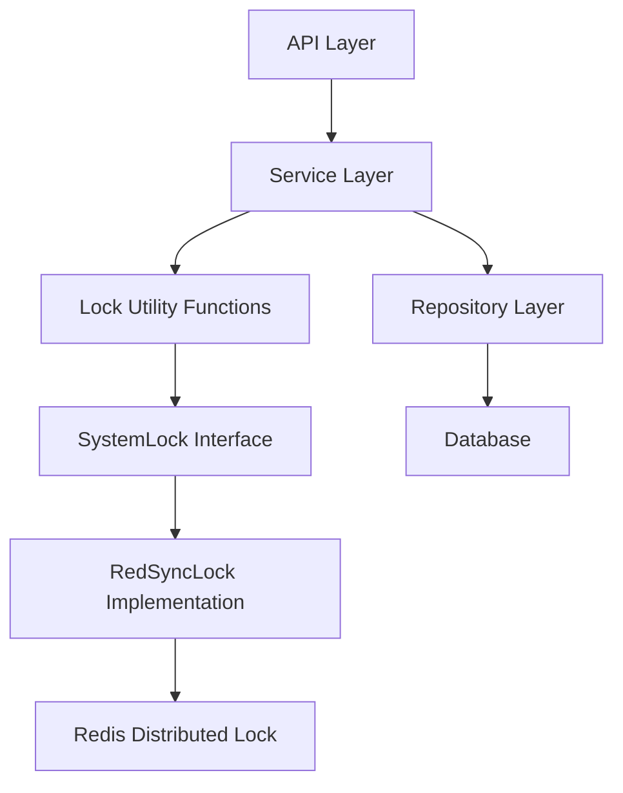

# 并台、转台、转菜操作使用多个订单锁 设计文档

> 本文档定义并台、转台、转菜操作使用多个订单锁的技术设计和实现方案。

## 📋 概述

统一并台、转台和转菜操作的锁机制，使用订单级别的锁（`SaleBillUuid`），当操作涉及多个订单时，需要获取所有相关订单的锁，并按照统一的顺序获取锁以避免死锁。

本设计主要涉及：
1. 创建统一的锁管理工具函数
2. 修改并台操作的锁机制（移除 `companyUuid` 锁，改为锁定所有涉及的订单）
3. 修改转台操作的锁机制（增加目标桌台的锁）
4. 修改转菜操作的锁机制（增加目标订单的锁）

---

## 🎯 规范对齐

### Go Main 规范 (go-main.mdc)

- Service 只依赖其他 Service 接口
- Repository 只持有 db 实例
- URL 使用 snake_case
- data 字段必须是对象
- 不使用 panic，返回 error
- 锁的获取和释放必须在同一个函数中，使用 defer 确保释放

### API 设计规范 (api.mdc)

- 不涉及新 API 接口，仅修改现有 API 的内部实现
- 保持现有 API 的响应格式不变

### 数据库规范 (database.mdc)

- 不涉及数据库表结构变更
- 仅涉及业务逻辑层的锁机制调整

---

## 🔄 代码复用分析

### 可复用的现有组件

- **SystemLock**: `main/pkg/lock/system_lock.go` - 系统锁接口，使用 `NewSystemLock()` 创建
- **RedSyncLock**: `main/pkg/lock/lock_redsync.go` - Redis 分布式锁实现
- **DeskService**: `main/app/service/desk.go` - 桌台服务，包含并台和转台操作
- **OrderService**: `main/app/service/order_product.go` - 订单服务，包含转菜操作
- **DeskRepository**: `main/app/repository/desk.go` - 桌台数据访问层

### 集成点

- **并台操作**: `main/app/service/desk.go:799-1010` - `MergeDesk` 方法
- **转台操作**: `main/app/service/desk.go:694-797` - `ChangeDesk` 方法
- **转菜操作**: `main/app/service/order_product.go:1060-1220` - `InstantOrderCartProductChangeDesk` 方法
- **开台操作**: `main/app/service/order_base.go:96-102` - `CreateDeskOrder` 方法（使用 `DeskUuid` 锁）

---

## 🏗️ 架构设计

### 分层设计原则

**Go Main 三层架构**:

```
API 层 (Controller/API)
  ↓ 依赖
业务层 (Service)
  ↓ 依赖
数据层 (Repository)
```

**锁管理工具函数位置**:

- 工具函数放在 `main/pkg/lock/` 包中，作为锁机制的扩展
- Service 层调用工具函数，简化多订单锁的获取和释放逻辑

### 架构图



### 模块划分

#### 锁管理工具模块

- **位置**: `main/pkg/lock/lock_util.go`（新建）
- **功能**: 提供多订单锁的获取和释放工具函数
- **接口**:
  - `LockMultipleUuids(lock Lock, uuids []uint64) []uint64` - 锁定多个 UUID（按 UUID 排序），返回排序后的 UUID 列表
  - `UnlockMultipleUuids(lock Lock, uuids []uint64)` - 释放多个 UUID 锁（按相反顺序），内部使用与 LockMultipleUuids 相同的排序策略

#### Service 层修改

- **并台操作**: `main/app/service/desk.go:799-1010` - 修改 `MergeDesk` 方法的锁机制
- **转台操作**: `main/app/service/desk.go:694-797` - 修改 `ChangeDesk` 方法的锁机制
- **转菜操作**: `main/app/service/order_product.go:1060-1220` - 修改 `InstantOrderCartProductChangeDesk` 方法的锁机制

---

## 🗄️ 数据库设计

### 数据表设计

**不涉及数据库表结构变更**，仅涉及业务逻辑层的锁机制调整。

---

## 📊 数据模型

### 不涉及数据模型变更

---

## 🔌 API 设计

### 不涉及新 API 接口

**现有 API 保持不变**，仅修改内部实现：

- `/api/v1/desk/merge` - 并台操作（内部锁机制调整）
- `/api/v1/desk/change` - 转台操作（内部锁机制调整）
- `/api/v1/order/cart/product/change_desk` - 转菜操作（内部锁机制调整）

---

## 🧩 组件和接口

### 锁管理工具函数

#### 工具函数实现

```go
// main/pkg/lock/lock_util.go
package lock

import (
	"sort"
)

// sortAndDeduplicateUuids 对 UUID 列表进行去重和排序
// 过滤无效 UUID（0 值），去重，并按 UUID 升序排序
// 返回排序后的唯一 UUID 列表
func sortAndDeduplicateUuids(uuids []uint64) []uint64 {
	// 去重并过滤无效 UUID
	uniqueUuids := make([]uint64, 0)
	seen := make(map[uint64]bool)
	for _, uuid := range uuids {
		if uuid != 0 && !seen[uuid] {
			uniqueUuids = append(uniqueUuids, uuid)
			seen[uuid] = true
		}
	}
	
	// 按 UUID 排序，确保锁获取顺序一致
	sort.Slice(uniqueUuids, func(i, j int) bool {
		return uniqueUuids[i] < uniqueUuids[j]
	})
	
	return uniqueUuids
}

// LockMultipleUuids 锁定多个 UUID（按 UUID 排序）
// 自动去重和过滤无效 UUID（0 值）
// 返回排序后的 UUID 列表（用于后续释放锁）
func LockMultipleUuids(lock Lock, uuids []uint64) []uint64 {
	// 使用公用方法进行去重和排序
	sortedUuids := sortAndDeduplicateUuids(uuids)
	
	// 依次获取锁
	for _, uuid := range sortedUuids {
		lock.LockUuid(uuid)
	}
	
	return sortedUuids
}

// UnlockMultipleUuids 释放多个 UUID 锁（按相反顺序）
// 使用与 LockMultipleUuids 相同的排序策略（去重、排序），然后按相反顺序释放
func UnlockMultipleUuids(lock Lock, uuids []uint64) {
	// 使用公用方法进行去重和排序（确保与 LockMultipleUuids 使用相同的策略）
	sortedUuids := sortAndDeduplicateUuids(uuids)
	
	// 按相反顺序释放锁
	for i := len(sortedUuids) - 1; i >= 0; i-- {
		lock.UnlockUuid(sortedUuids[i])
	}
}
```

### Service 层修改

#### 并台操作修改

```go
// main/app/service/desk.go:799-1010
func (s *deskSrv) MergeDesk(ctx context.Context, req req.MergeDeskReq) (*resp.DeskMergeShopCartResp, *resp.DeskMergeCheckResp, error) {
	systemLock := lock.NewSystemLock()
	
	// 禁止并发操作
	if ctx.NoLock() {
		db := s.dbm.GetDB(ctx.GetCompanyUuid())
		
		// 收集所有需要锁定的订单 UUID（主订单 + 所有被合并的订单）
		orderUuids := []uint64{req.SaleBillUuid}
		
		// 获取主订单信息
		saleBill, errSaleBill := repository.NewOrderRepo(db).GetSaleBillAllInfo(req.SaleBillUuid)
		if errSaleBill != nil {
			return nil, nil, errors.WithMessage(errSaleBill, "获取销售账单信息失败")
		}
		
		// 收集被合并桌台的订单 UUID
		for _, deskUuid := range req.DeskUuids {
			if deskUuid != saleBill.Desk.Uuid {
				desk, _ := repository.NewDeskRepo(db).GetDeskRecord(deskUuid)
				if desk != nil && desk.SaleBillUuid != 0 {
					orderUuids = append(orderUuids, desk.SaleBillUuid)
				}
			}
		}
		
		// 锁定所有涉及的订单（按 UUID 排序）
		// LockMultipleUuids 会自动去重和排序，返回排序后的 UUID 列表
		lockedUuids := lock.LockMultipleUuids(systemLock, orderUuids)
		
		// 按相反顺序释放锁（UnlockMultipleUuids 内部会使用相同的排序策略）
		defer func() {
			lock.UnlockMultipleUuids(systemLock, lockedUuids)
		}()
		
		ctx.AddLock()
	}
	
	// ... 现有业务逻辑保持不变 ...
}
```

#### 转台操作修改

```go
// main/app/service/desk.go:694-797
func (s *deskSrv) ChangeDesk(ctx context.Context, reqs req.ChangeDeskReq) (*resp.ShopCart, error) {
	// 禁止并发操作
	if ctx.NoLock() {
		systemLock := lock.NewSystemLock()
		
		// 收集需要锁定的资源：源订单 + 目标桌台
		lockUuids := []uint64{reqs.SaleBillUuid, reqs.DeskUuid}
		
		// 锁定源订单和目标桌台（按 UUID 排序）
		// LockMultipleUuids 会自动去重和排序，返回排序后的 UUID 列表
		lockedUuids := lock.LockMultipleUuids(systemLock, lockUuids)
		
		// 按相反顺序释放锁（UnlockMultipleUuids 内部会使用相同的排序策略）
		defer func() {
			lock.UnlockMultipleUuids(systemLock, lockedUuids)
		}()
		
		ctx.AddLock()
	}
	
	// ... 现有业务逻辑保持不变 ...
}
```

#### 转菜操作修改

```go
// main/app/service/order_product.go:1060-1220
func (s *orderSrv) InstantOrderCartProductChangeDesk(ctx context.Context, req req.OrderCartProductChangeDeskReq) (*resp.ShopCart, error) {
	if ctx.NoLock() {
		db := s.dbm.GetDB(ctx.GetDbId())
		
		// 获取目标订单 UUID（通过目标桌台 UUID 查询）
		targetDesk, err := repository.NewDeskRepo(db).GetDeskAndSaleBillByDeskUuid(req.DeskUuid)
		if err != nil {
			return nil, errors.WithMessage(err, "获取目标桌台信息失败")
		}
		
		if targetDesk.SaleBillUuid == 0 {
			return nil, errors.New("目标桌台没有关联订单")
		}
		
		// 收集需要锁定的订单：源订单 + 目标订单
		orderUuids := []uint64{req.SaleBillUuid, targetDesk.SaleBillUuid}
		
		// 锁定源订单和目标订单（按 UUID 排序）
		// LockMultipleUuids 会自动去重和排序，返回排序后的 UUID 列表
		lockedUuids := lock.LockMultipleUuids(s.lock, orderUuids)
		
		// 按相反顺序释放锁（UnlockMultipleUuids 内部会使用相同的排序策略）
		defer func() {
			lock.UnlockMultipleUuids(s.lock, lockedUuids)
		}()
		
		ctx.AddLock()
	}
	
	// ... 现有业务逻辑保持不变 ...
}
```

---

## ⚡ 缓存设计

### 不涉及缓存设计变更

锁机制使用 Redis 分布式锁（RedSync），但缓存策略不变。

---

## 🚨 错误处理

### 错误场景

#### 场景 1: 锁获取失败

- **处理方式**: `LockUuid` 方法内部已处理错误，不会 panic
- **用户影响**: 操作可能被阻塞，等待锁释放
- **代码示例**: 现有 `LockUuid` 实现已包含错误处理

#### 场景 2: 目标桌台没有关联订单（转菜操作）

- **处理方式**: 返回错误提示
- **用户影响**: 用户看到错误提示"目标桌台没有关联订单"
- **代码示例**:
  ```go
  if targetDesk.SaleBillUuid == 0 {
      return nil, errors.New("目标桌台没有关联订单")
  }
  ```

#### 场景 3: 死锁风险

- **处理方式**: 统一按 UUID 排序获取锁，确保所有操作都按相同顺序获取锁
- **用户影响**: 避免死锁，操作正常执行
- **缓解措施**: 使用 `LockMultipleUuids` 工具函数，确保排序一致

---

## 🔒 安全设计

### 身份验证

- 所有 API 需要 JWT Token 验证（现有机制保持不变）

### 权限控制

- 订单 UUID 验证：订单必须属于当前商户（现有机制保持不变）

### 数据安全

- 锁机制使用 Redis 分布式锁，保证分布式环境下的数据一致性
- 锁的获取和释放使用 defer 确保释放，避免死锁

---

## 🧪 测试策略

### 单元测试

**目标覆盖率**:

- `main/pkg/lock/lock_util.go`: 100%（工具函数必须完全覆盖）
- `main/app/service/desk.go`: 70%+（并台和转台操作）
- `main/app/service/order_product.go`: 70%+（转菜操作）

**测试内容**:

- 工具函数的去重和排序逻辑
- 工具函数的锁获取和释放顺序
- 并台、转台、转菜操作的锁机制
- 错误处理场景

**示例**:

```go
// main/pkg/lock/lock_util_test.go
func TestLockMultipleUuids(t *testing.T) {
	// 测试去重
	// 测试排序
	// 测试锁获取顺序
}

func TestUnlockMultipleUuids(t *testing.T) {
	// 测试释放顺序（相反顺序）
}
```

### 并发测试

**测试内容**:

- 并台操作的并发场景
- 转台操作与开台操作的并发冲突场景
- 转菜操作的并发场景
- 死锁测试：验证所有操作都按订单 UUID 排序获取锁

**重点测试场景**:

- **转台操作与开台操作同时操作同一桌台**：验证转台操作锁定目标桌台后，开台操作会被正确阻塞

### 集成测试

**测试流程**:

- 端到端业务流程测试
- 多订单锁的获取和释放逻辑测试
- 并发场景下的数据一致性测试

---

## 📈 性能优化

### 优化策略

1. **锁粒度优化**:
   - 使用订单级别的锁，不同订单的操作可以并发执行
   - 提高系统吞吐量

2. **锁获取顺序优化**:
   - 统一按 UUID 排序获取锁，避免死锁
   - 减少锁等待时间

3. **工具函数优化**:
   - 自动去重，避免重复锁定同一订单
   - 自动过滤无效 UUID（0 值）

### 性能指标

- 本地响应时间: < 200ms（不含锁等待时间）
- 并发能力: 不同订单的操作可以并发执行
- 锁等待时间: 取决于 Redis 性能和网络延迟

---

## 🌐 浏览器兼容性

### 不涉及前端变更

---

## 📚 实现清单

### Phase 1: 锁管理工具函数

- [ ] 创建 `main/pkg/lock/lock_util.go`
- [ ] 实现 `sortAndDeduplicateUuids` 公用方法（去重和排序）
- [ ] 实现 `LockMultipleUuids` 函数（使用公用方法）
- [ ] 实现 `UnlockMultipleUuids` 函数（使用公用方法）
- [ ] 编写单元测试

### Phase 2: 并台操作锁机制修改

- [ ] 修改 `main/app/service/desk.go:799-1010` 的 `MergeDesk` 方法
- [ ] 移除 `companyUuid` 锁
- [ ] 收集所有涉及的订单 UUID
- [ ] 使用工具函数锁定所有订单
- [ ] 编写单元测试

### Phase 3: 转台操作锁机制修改

- [ ] 修改 `main/app/service/desk.go:694-797` 的 `ChangeDesk` 方法
- [ ] 增加目标桌台的锁
- [ ] 使用工具函数锁定源订单和目标桌台
- [ ] 编写单元测试和并发测试

### Phase 4: 转菜操作锁机制修改

- [ ] 修改 `main/app/service/order_product.go:1060-1220` 的 `InstantOrderCartProductChangeDesk` 方法
- [ ] 获取目标订单 UUID
- [ ] 使用工具函数锁定源订单和目标订单
- [ ] 编写单元测试

### Phase 5: 测试和优化

- [ ] 单元测试（工具函数、Service 方法）
- [ ] 并发测试（并台、转台、转菜操作）
- [ ] 死锁测试
- [ ] 集成测试
- [ ] 性能测试

**详细任务**: 参见 `tasks.md`

---

## Graphiti & 活动日志

- Related Episode: `[待补充]`
- 模板：`docs/agent/templates/graphiti-episode.md`
- 活动日志：`docs/team/activities/2025-11/2025-11-26.md`
- 在技术方案评审、关键架构决策或踩坑总结后，立即补充 Episode 并在设计文档尾部互链。

---

**版本**: v1.0.0  
**创建日期**: 2025-11-26  
**作者**: xiezhihuan  
**审核者**: {审核者}

