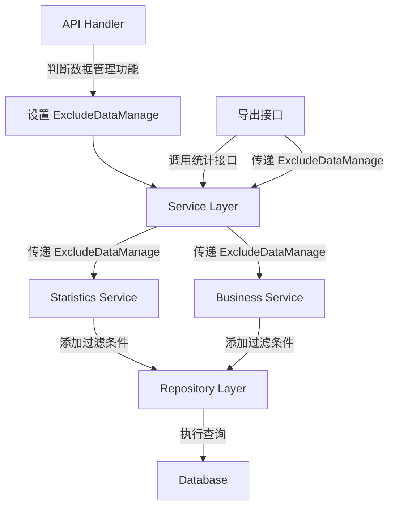

# 旧/新管理端-已选择订单数据隐藏 设计文档

> 本文档定义旧/新管理端已选择订单数据隐藏功能的技术设计和实现方案。

## 📋 概述

当订单在管理端被标记为"已选择"（数据管理订单）后，系统需要在所有相关的数据统计和展示场景中，自动排除这些已选择订单的数据，确保各项业务数据的准确性和可靠性。

**核心实现思路**：
1. **Handler 层判断数据管理功能是否开启**：在 API Handler 层判断两个条件（公司开启数据管理 + 数据管理功能启用），设置 `ExcludeDataManage` 参数
2. **通过参数传递过滤标志**：使用 `ExcludeDataManage` 参数传递过滤标志，而不是通过 context
3. **Service 层根据参数应用过滤**：在 Service 层根据 `ExcludeDataManage` 参数决定是否添加 `WhereNotInDataManageSubQuery` 过滤条件
4. **Repository 层执行过滤**：Repository 层接收过滤选项（DBOption），执行数据库查询
5. **导出接口同步过滤**：所有导出接口内部调用统计接口时，传递相同的 `ExcludeDataManage` 参数，确保导出数据与页面数据一致

**已选择订单判断标准**：
- 通过 `ttpos_data_manage` 表判断
- `type = 0` (DataManageTypeOrder)
- `data_uuid` 存储订单的 `sale_bill_uuid`

**数据管理功能开关判断**：
- 在 Handler 层判断两个条件：
  1. `CompanySetting.IsOpenDataManagement()` - 公司是否开启数据管理
  2. `DataManageSetting.IsEnableDataManage` - 数据管理功能是否启用
- 两个条件都满足时，设置 `ExcludeDataManage = true` 参数传递给 Service 层
- 如果任一条件不满足，则 `ExcludeDataManage = false`，不执行过滤逻辑

---

## 🎯 规范对齐

### Go Main 规范 (go-main.mdc)

- Service 只依赖其他 Service 接口
- Repository 只持有 db 实例
- URL 使用 snake_case
- data 字段必须是对象
- 不使用 panic，返回 error
- 所有代码使用中文注释

### API 设计规范 (api.mdc)

- URL 使用 snake_case
- 响应格式统一
- data 不能为 null 或数组

### 数据库规范 (database.mdc)

- 不需要新增表，使用现有的 `ttpos_data_manage` 表
- 已选择订单的判断逻辑已存在

---

## 🔄 代码复用分析

### 可复用的现有组件

- **CommonRepo.WhereNotInDataManageSubQuery**: `main/app/repository/common.go` 第 742-751 行
  - 已存在的过滤方法，用于排除数据管理订单
  - 方法签名：`WhereNotInDataManageSubQuery(db *gorm.DB, field string, opts ...DBOption) DBOption`
  - 使用方式：`CommonRepo.WhereNotInDataManageSubQuery(ctx.GetDB(), "sale_bill_uuid", CommonRepo.WhereByType(model.DataManageTypeOrder), CommonRepo.WhereBySoftDelete())`
  - **重要**：需要传入独立的 `db` 参数，避免子查询继承外部查询的上下文

- **统计服务**: `main/app/service/statistics.go`
  - `CountSale`: 销售数据统计（已支持 `ExcludeDataManage` 参数）
  - `CountBusinessTimePeriod`: 营业时段统计
  - `CountBusinessSummary`: 综合运营统计
  - `CountBusinessPaymentMethod`: 营业收款统计
  - `CountChannelSale`: 渠道营业统计（Repository 层，支持 `opts` 参数）
  - `CountProductSales`: 商品销售统计
  - `CountUserAnalysis`: 用户分析统计

- **营业数据服务**: `main/app/service/business.go`
  - `CountHome`: 统计首页（需要添加 `ExcludeDataManage` 参数传递）
  - `CountBusiness`: 统计营业数据（已支持 `ExcludeDataManage` 参数）
  - `CountChannelSales`: 统计渠道营业数据（需要添加过滤参数传递）
  - `ExportBusinessTimePeriod`: 导出时段营业统计（需要传递过滤参数）
  - `ExportBusinessSummary`: 导出综合运营统计（需要传递过滤参数）
  - `ExportBusinessPaymentMethod`: 导出营业收款统计（需要传递过滤参数）
  - `ExportChannelSales`: 导出渠道营业统计（需要传递过滤参数）
  - `ExportProductSales`: 导出商品销售统计（需要传递过滤参数）
  - `ExportUserAnalysis`: 导出用户分析统计（需要传递过滤参数）

### 集成点

- **数据管理表**: `ttpos_data_manage` - 存储已选择订单信息
- **设置服务**: `main/app/service/setting/setting.go` - `GetDataManageSetting` 方法获取数据管理开关
- **统计服务**: `main/app/service/statistics.go` - 所有统计方法需要统一过滤
- **营业数据服务**: `main/app/service/business.go` - 首页和报表统计需要过滤

---

## 🏗️ 架构设计

### 分层设计原则

**Go Main 三层架构**:

```
API 层 (Handler)
  ↓ 判断数据管理功能是否开启，设置 ExcludeDataManage 参数
业务层 (Service)
  ↓ 根据 ExcludeDataManage 参数添加过滤条件
数据层 (Repository)
  ↓ 执行数据库查询，应用过滤条件
```

**依赖规则**:

- ✅ 上层可依赖下层
- ❌ 禁止下层依赖上层
- ❌ 禁止跨层调用
- ❌ Service 不能依赖 Repository
- ✅ Service 可以依赖其他 Service 接口

### 架构图



### 模块划分

#### Go Main 模块

- **API 层**: `main/app/api/v1/shop/shop_statistics.go` - 路由处理、参数校验、数据管理功能判断
- **Service 层**: `main/app/service/` - 业务逻辑、过滤条件应用
  - `statistics.go` - 统计服务
  - `business.go` - 营业数据服务
- **Repository 层**: `main/app/repository/` - 数据访问、数据库操作
  - `common.go` - 通用过滤方法
  - `statistics.go` - 统计数据访问
- **Model 层**: `main/app/model/` - 数据模型
  - `data_manage.go` - 数据管理模型
- **DTO 层**: `main/app/dto/` - 数据传输对象
  - `req/` - 请求参数（需要添加 `ExcludeDataManage` 字段）

---

## 🗄️ 数据库设计

### 数据表设计

#### 表: ttpos_data_manage（已存在，无需修改）

```sql
-- 表已存在，用于存储数据管理订单
-- type = 0 表示订单类型
-- data_uuid 存储订单的 sale_bill_uuid
```

**字段说明**:
| 字段 | 类型 | 说明 | 约束 |
|------|------|------|------|
| type | int | 数据类型，0=订单 | DEFAULT 0 |
| data_uuid | bigint unsigned | 订单的 sale_bill_uuid | NOT NULL |
| staff_uuid | bigint unsigned | 操作员工UUID | NOT NULL |

---

## 📊 数据模型

### 已选择订单判断逻辑

```go
// main/app/model/data_manage.go
const DataManageTypeOrder = 0 // 数据类型 0订单

// 判断订单是否为已选择订单
// 通过查询 ttpos_data_manage 表，type = 0 且 data_uuid = sale_bill_uuid
```

### 过滤方法

```go
// main/app/repository/common.go
// WhereNotInDataManageSubQuery 根据DataManage子查询不包含
func (r *commonRepo) WhereNotInDataManageSubQuery(db2 *gorm.DB, field string, opts ...DBOption) DBOption {
    return func(db *gorm.DB) *gorm.DB {
        // 使用独立的 db2 参数构建子查询，避免继承外部查询的上下文
        subQuery := db2.Model(&model.DataManage{}).Select("data_uuid")
        for _, opt := range opts {
            subQuery = opt(subQuery)
        }
        return db.Where(field+" NOT IN (?)", subQuery)
    }
}

// 使用示例（Service 层）：
if req.ExcludeDataManage {
    opts = append(opts, repository.CommonRepo.WhereNotInDataManageSubQuery(
        ctx.GetDB(),
        "sale_bill_uuid",
        repository.CommonRepo.WhereByType(model.DataManageTypeOrder),
        repository.CommonRepo.WhereBySoftDelete(),
    ))
}
```

### 数据管理功能开关判断（Handler 层）

```go
// main/app/api/v1/shop/shop_statistics.go
// 在 Handler 层判断数据管理功能是否开启
func (h *statisticsHandler) CountHome(c *gin.Context) {
    ctx := helper.GetContext(c)
    var countReq req.BusinessDataCountReq
    if err := c.ShouldBindQuery(&countReq); err != nil {
        helper.HandleValidationError(c, err, countReq, nil)
        return
    }
    
    // 判断数据管理功能是否开启
    companySetting := ctx.GetCompanySetting()
    settingSrv := setting.NewSrvImpl(database.GetDBManager(config.Database), cache.Global)
    dataSetting := settingSrv.GetDataManageSetting(ctx)
    countReq.ExcludeDataManage = companySetting.IsOpenDataManagement() && dataSetting.IsEnableDataManage
    
    // 调用 Service 层
    homeData, err := h.businessSrv.CountHome(ctx, countReq)
    if err != nil {
        helper.ErrorWithDetail(c, constant.CodeFail, errors.WithMessage(err))
        return
    }
    helper.Success(c, homeData)
}
```

---

## 🔌 API 设计

### 不需要新增 API

本功能是对现有 API 的增强，不需要新增 API 接口。需要修改的现有 API：

#### 新管理端首页统计接口

1. **统计首页**
   - 路径: `/shop/statistics/home`
   - Handler: `CountHome`
   - 修改: 在 Handler 层判断数据管理功能，设置 `ExcludeDataManage` 参数

2. **统计营业数据**
   - 路径: `/shop/statistics/business`
   - Handler: `CountBusiness`
   - 修改: 在 Handler 层判断数据管理功能，设置 `ExcludeDataManage` 参数

3. **统计区域数据**
   - 路径: `/shop/statistics/area`
   - Handler: `CountArea`
   - 修改: 在 Handler 层判断数据管理功能，设置 `ExcludeDataManage` 参数

4. **统计渠道营业数据**
   - 路径: `/shop/statistics/channel_sales`
   - Handler: `ChannelSales`
   - 修改: 在 Handler 层判断数据管理功能，设置 `ExcludeDataManage` 参数

5. **统计支付方式**
   - 路径: `/shop/statistics/payment_method`
   - Handler: `CountPaymentMethod`
   - 修改: 在 Handler 层判断数据管理功能，设置 `ExcludeDataManage` 参数

6. **统计商品排行**
   - 路径: `/shop/statistics/product_rank`
   - Handler: `CountProductRank`
   - 修改: 在 Handler 层判断数据管理功能，设置 `ExcludeDataManage` 参数

#### 报表中心统计接口

7. **统计营业时段数据**
   - 路径: `/shop/statistics/business/time_period`
   - Handler: `CountBusinessTimePeriod`
   - 修改: 在 Handler 层判断数据管理功能，设置 `ExcludeDataManage` 参数

8. **统计综合运营数据**
   - 路径: `/shop/statistics/business/summary`
   - Handler: `CountBusinessSummary`
   - 修改: 在 Handler 层判断数据管理功能，设置 `ExcludeDataManage` 参数

9. **统计营业收款数据**
   - 路径: `/shop/statistics/business/payment_method`
   - Handler: `CountBusinessPaymentMethod`
   - 修改: 在 Handler 层判断数据管理功能，设置 `ExcludeDataManage` 参数

10. **统计渠道营业数据**
    - 路径: `/shop/statistics/channel_sales`
    - Handler: `ChannelSales`
    - 修改: 在 Handler 层判断数据管理功能，设置 `ExcludeDataManage` 参数

11. **统计商品销售数据**
    - 路径: `/shop/statistics/product_sales`
    - Handler: `CountProductSales`
    - 修改: 在 Handler 层判断数据管理功能，设置 `ExcludeDataManage` 参数

12. **统计用户分析数据**
    - 路径: `/shop/statistics/user_analysis`
    - Handler: `UserAnalysis`
    - 修改: 在 Handler 层判断数据管理功能，设置 `ExcludeDataManage` 参数

#### 报表中心导出接口

13. **导出时段营业统计**
    - 路径: `/shop/statistics/business/time_period/export`
    - Handler: `ExportBusinessTimePeriod`
    - 修改: 在 Handler 层判断数据管理功能，设置 `ExcludeDataManage` 参数，传递给 `CountBusinessTimePeriod`

14. **导出综合运营统计**
    - 路径: `/shop/statistics/business/summary/export`
    - Handler: `ExportBusinessSummary`
    - 修改: 在 Handler 层判断数据管理功能，设置 `ExcludeDataManage` 参数，传递给 `CountBusinessSummary`

15. **导出营业收款统计**
    - 路径: `/shop/statistics/business/payment_method/export`
    - Handler: `ExportBusinessPaymentMethod`
    - 修改: 在 Handler 层判断数据管理功能，设置 `ExcludeDataManage` 参数，传递给 `CountBusinessPaymentMethod`

16. **导出渠道营业统计**
    - 路径: `/shop/statistics/channel_sales/export`
    - Handler: `ExportChannelSales`
    - 修改: 在 Handler 层判断数据管理功能，设置 `ExcludeDataManage` 参数，传递给 `CountChannelSales`

17. **导出商品销售统计**
    - 路径: `/shop/statistics/product_sales/export`
    - Handler: `ExportProductSales`
    - 修改: 在 Handler 层判断数据管理功能，设置 `ExcludeDataManage` 参数，传递给 `CountProductSales`

18. **导出用户分析统计**
    - 路径: `/shop/statistics/user_analysis/export`
    - Handler: `ExportUserAnalysis`
    - 修改: 在 Handler 层判断数据管理功能，设置 `ExcludeDataManage` 参数，传递给 `CountUserAnalysis`

---

## 🧩 组件和接口

### Service 层修改

#### Statistics Service

**文件**: `main/app/service/statistics.go`

**需要修改的方法**:
- `CountBusinessTimePeriod`: 营业时段统计（需要添加 `ExcludeDataManage` 参数支持）
- `CountBusinessSummary`: 综合运营统计（需要添加 `ExcludeDataManage` 参数支持）
- `CountBusinessPaymentMethod`: 营业收款统计（需要添加 `ExcludeDataManage` 参数支持）
- `CountChannelSale`: 渠道营业统计 Repository 方法（已支持 `opts` 参数，需要在 Service 层传递过滤条件）
- `CountProductSales`: 商品销售统计（需要添加 `ExcludeDataManage` 参数支持）
- `CountUserAnalysis`: 用户分析统计（需要添加 `ExcludeDataManage` 参数支持）

**修改方式**:
1. Service 层接收请求参数，其中包含 `ExcludeDataManage` 字段
2. 如果 `req.ExcludeDataManage = true`，则在统计查询中添加 `WhereNotInDataManageSubQuery` 过滤条件
3. 如果 `req.ExcludeDataManage = false`，则跳过过滤逻辑，提高性能
4. **重要**：调用 `WhereNotInDataManageSubQuery` 时需要传入独立的 `db` 参数（如 `ctx.GetDB()`），避免子查询继承外部查询上下文

**实现示例**:
```go
func (s *statisticsSrv) CountBusinessTimePeriod(ctx context.Context, req req.BusinessTimePeriodReq) CountBusinessTimePeriodResp {
    statisticsRepo := repository.NewStatisticsRepo(ctx.GetDB())
    // ... 其他逻辑 ...
    
    // 构建过滤选项
    var opts []repository.DBOption
    if req.ExcludeDataManage {
        opts = append(opts, repository.CommonRepo.WhereNotInDataManageSubQuery(
            ctx.GetDB(),  // 传入独立的 db 参数
            "sale_bill_uuid",
            repository.CommonRepo.WhereByType(model.DataManageTypeOrder),
            repository.CommonRepo.WhereBySoftDelete(),
        ))
    }
    
    // 统计总时段数和时段数据
    total, periodData := statisticsRepo.CountBusinessTimePeriod(repository.CountBusinessTimePeriodReq{
        StartTime:     req.QueryStartTime,
        EndTime:       req.QueryEndTime,
        PeriodSeconds: periodSeconds,
        IsCreateTime:  req.StatisticsType == 0,
        PageNo:        utils.IfInt(req.PageNo > 0, req.PageNo, 1),
        PageSize:      utils.IfInt(req.PageSize > 0, req.PageSize, 10),
        IsDesk:        req.OrderDesk == 1,
        IsInstant:     req.OrderInstant == 1,
        IsTakeout:     req.OrderTakeout == 1,
    }, opts...)
    // ...
}
```

#### Business Service

**文件**: `main/app/service/business.go`

**需要修改的方法**:
- `CountHome`: 统计首页（需要添加 `ExcludeDataManage` 参数传递）
- `CountChannelSales`: 统计渠道营业数据（需要添加过滤参数传递）
- `ExportBusinessTimePeriod`: 导出时段营业统计（需要传递 `ExcludeDataManage` 参数）
- `ExportBusinessSummary`: 导出综合运营统计（需要传递 `ExcludeDataManage` 参数）
- `ExportBusinessPaymentMethod`: 导出营业收款统计（需要传递 `ExcludeDataManage` 参数）
- `ExportChannelSales`: 导出渠道营业统计（需要传递 `ExcludeDataManage` 参数）
- `ExportProductSales`: 导出商品销售统计（需要传递 `ExcludeDataManage` 参数）
- `ExportUserAnalysis`: 导出用户分析统计（需要传递 `ExcludeDataManage` 参数）

**修改方式**:
1. 方法接收 `ExcludeDataManage` 参数
2. 调用统计方法时传递 `ExcludeDataManage` 参数
3. 导出接口内部调用统计接口时，传递相同的 `ExcludeDataManage` 参数

**实现示例**:
```go
func (s *businessSrv) CountHome(ctx context.Context, req req.BusinessDataCountReq) (*business_data_resp.BusinessDataHome, error) {
    // 销售数据
    saleData := s.statisticsSrv.CountSale(ctx, CountReq{
        TimeType:          req.TimeType,
        QueryStartTime:    req.QueryStartTime,
        QueryEndTime:      req.QueryEndTime,
        CategoryType:      req.CategoryType,
        DutyNo:            req.DutyNo,
        ExcludeDataManage: req.ExcludeDataManage,  // 传递过滤参数
    })
    // ...
}

func (s *businessSrv) CountChannelSales(ctx context.Context, req req.ChannelSalesReq) (*resp.ChannelSalesResp, error) {
    db := ctx.GetDB()
    statisticsRepo := repository.NewStatisticsRepo(db)
    
    // 构建过滤选项
    var opts []repository.DBOption
    if req.ExcludeDataManage {
        opts = append(opts, repository.CommonRepo.WhereNotInDataManageSubQuery(
            db,
            "sale_bill_uuid",
            repository.CommonRepo.WhereByType(model.DataManageTypeOrder),
            repository.CommonRepo.WhereBySoftDelete(),
        ))
    }
    
    // 调用 Repository 获取渠道统计数据
    channelData, err := statisticsRepo.CountChannelSale(startTime, endTime, opts...)
    // ...
}

func (s *businessSrv) ExportBusinessTimePeriod(ctx context.Context, req req.BusinessTimePeriodReq) error {
    // 判断数据管理功能是否开启（如果 Handler 层未设置）
    // 调用统计接口
    result := s.CountBusinessTimePeriod(ctx, req)  // req 中已包含 ExcludeDataManage
    // ...
}
```

### DTO 层修改

#### Request DTO

**文件**: `main/app/dto/req/statistics.go`

**需要修改的结构体**:
- `BusinessDataCountReq`: 已包含 `ExcludeDataManage` 字段 ✅
- `BusinessTimePeriodReq`: 需要添加 `ExcludeDataManage` 字段
- `StatisticsSummaryReq`: 需要添加 `ExcludeDataManage` 字段
- `StatisticsPaymentMethodReq`: 需要添加 `ExcludeDataManage` 字段
- `ChannelSalesReq`: 需要添加 `ExcludeDataManage` 字段
- `BusinessDataCountProductSalesReq`: 需要添加 `ExcludeDataManage` 字段
- `UserAnalysisReq`: 需要添加 `ExcludeDataManage` 字段

**实现示例**:
```go
type BusinessTimePeriodReq struct {
    // ... 现有字段 ...
    ExcludeDataManage bool `json:"exclude_data_manage"` // 是否排除数据管理订单
}
```

---

## ⚡ 缓存设计

### 无需新增缓存

本功能不涉及缓存，使用现有的数据库查询机制。

---

## 🚨 错误处理

### 错误场景

#### 场景 1: 数据管理功能判断失败

- **处理方式**: 如果获取数据管理设置失败，默认不执行过滤（`ExcludeDataManage = false`）
- **用户影响**: 统计数据可能包含已选择订单（保守处理）
- **代码示例**:
  ```go
  companySetting := ctx.GetCompanySetting()
  settingSrv := setting.NewSrvImpl(database.GetDBManager(config.Database), cache.Global)
  dataSetting := settingSrv.GetDataManageSetting(ctx)
  // 如果获取失败，dataSetting 可能为 nil，需要处理
  countReq.ExcludeDataManage = companySetting.IsOpenDataManagement() && 
      (dataSetting != nil && dataSetting.IsEnableDataManage)
  ```

#### 场景 2: 过滤条件应用失败

- **处理方式**: 如果过滤条件应用失败，记录错误日志，但不中断查询
- **用户影响**: 统计数据可能包含已选择订单（保守处理）

---

## 🔒 安全设计

### 身份验证

- **JWT Token**: 所有 API 需要 Token 验证（已有中间件）

### 权限控制

- **数据管理权限**: 只有有权限的员工才能选择订单进行数据管理
- **统计权限**: 所有有权限查看统计的员工都能看到过滤后的数据

### 数据安全

- **SQL 注入防护**: 使用参数化查询（GORM）
- **数据隔离**: 通过公司 UUID 和门店 UUID 隔离数据

---

## 🧪 测试策略

### 单元测试

**目标覆盖率**:

- main/app/service: 70%+
- main/app/repository: 80%+
- **统计相关模块: 100%**（高风险）

**测试内容**:

- Service 业务逻辑
- Repository 数据访问
- 过滤条件正确性
- 导出接口数据一致性

**测试场景**:

1. **数据管理功能开启时**：
   - 已选择订单被正确排除
   - 未选择订单正常统计

2. **数据管理功能关闭时**：
   - 所有订单都正常统计（不过滤）

3. **导出接口测试**：
   - 导出数据与页面数据一致
   - 导出数据正确排除已选择订单

### API 测试

**测试内容**:

- API 接口调用
- 参数验证
- 响应格式
- 数据正确性

### 集成测试

**测试流程**:

1. 选择订单进行数据管理
2. 查看首页统计数据（应排除已选择订单）
3. 查看各类报表统计（应排除已选择订单）
4. 导出报表（导出数据应与页面数据一致）

---

## 📈 性能优化

### 优化策略

1. **数据库优化**:
   - 使用索引（`ttpos_data_manage` 表的 `type` 和 `data_uuid` 字段）
   - 子查询优化（使用独立的 db 参数避免继承上下文）

2. **查询优化**:
   - 只在数据管理功能开启时执行过滤
   - 过滤条件使用子查询，避免 JOIN

3. **缓存策略**:
   - 数据管理设置可以缓存（已有实现）

### 性能指标

- 本地响应时间: < 200ms（与现有统计接口一致）
- 数据库查询: < 50ms（过滤条件不影响性能）
- 导出接口: 与现有导出接口性能一致

---

## 🌐 浏览器兼容性

### 前端兼容性（Vue）

- Chrome 90+
- Safari 14+
- Firefox 88+
- Edge 90+

**说明**: 本功能主要是后端修改，前端无需修改，兼容性不受影响。

---

## 📚 实现清单

### Phase 1: DTO 层修改

- [ ] 添加 `BusinessTimePeriodReq.ExcludeDataManage` 字段
- [ ] 添加 `StatisticsSummaryReq.ExcludeDataManage` 字段
- [ ] 添加 `StatisticsPaymentMethodReq.ExcludeDataManage` 字段
- [ ] 添加 `ChannelSalesReq.ExcludeDataManage` 字段
- [ ] 添加 `BusinessDataCountProductSalesReq.ExcludeDataManage` 字段
- [ ] 添加 `UserAnalysisReq.ExcludeDataManage` 字段

### Phase 2: Handler 层修改

- [ ] 修改 `CountHome` Handler - 判断数据管理功能并设置参数
- [ ] 修改 `CountBusiness` Handler - 判断数据管理功能并设置参数
- [ ] 修改 `CountArea` Handler - 判断数据管理功能并设置参数
- [ ] 修改 `ChannelSales` Handler - 判断数据管理功能并设置参数
- [ ] 修改 `CountPaymentMethod` Handler - 判断数据管理功能并设置参数
- [ ] 修改 `CountProductRank` Handler - 判断数据管理功能并设置参数
- [ ] 修改 `CountBusinessTimePeriod` Handler - 判断数据管理功能并设置参数
- [ ] 修改 `CountBusinessSummary` Handler - 判断数据管理功能并设置参数
- [ ] 修改 `CountBusinessPaymentMethod` Handler - 判断数据管理功能并设置参数
- [ ] 修改 `CountProductSales` Handler - 判断数据管理功能并设置参数
- [ ] 修改 `UserAnalysis` Handler - 判断数据管理功能并设置参数
- [ ] 修改 `ExportBusinessTimePeriod` Handler - 判断数据管理功能并设置参数
- [ ] 修改 `ExportBusinessSummary` Handler - 判断数据管理功能并设置参数
- [ ] 修改 `ExportBusinessPaymentMethod` Handler - 判断数据管理功能并设置参数
- [ ] 修改 `ExportChannelSales` Handler - 判断数据管理功能并设置参数
- [ ] 修改 `ExportProductSales` Handler - 判断数据管理功能并设置参数
- [ ] 修改 `ExportUserAnalysis` Handler - 判断数据管理功能并设置参数

### Phase 3: Service 层修改

- [ ] 修改 `CountHome` Service - 传递 `ExcludeDataManage` 参数
- [ ] 修改 `CountBusinessTimePeriod` Service - 添加过滤逻辑
- [ ] 修改 `CountBusinessSummary` Service - 添加过滤逻辑
- [ ] 修改 `CountBusinessPaymentMethod` Service - 添加过滤逻辑
- [ ] 修改 `CountChannelSales` Service - 传递过滤参数给 Repository
- [ ] 修改 `CountProductSales` Service - 添加过滤逻辑
- [ ] 修改 `CountUserAnalysis` Service - 添加过滤逻辑
- [ ] 修改 `ExportBusinessTimePeriod` Service - 传递过滤参数
- [ ] 修改 `ExportBusinessSummary` Service - 传递过滤参数
- [ ] 修改 `ExportBusinessPaymentMethod` Service - 传递过滤参数
- [ ] 修改 `ExportChannelSales` Service - 传递过滤参数
- [ ] 修改 `ExportProductSales` Service - 传递过滤参数
- [ ] 修改 `ExportUserAnalysis` Service - 传递过滤参数

### Phase 4: Repository 层修改

- [ ] 修改 `CountBusinessTimePeriod` Repository - 支持 `opts` 参数
- [ ] 修改 `CountBusinessSummary` Repository - 支持 `opts` 参数
- [ ] 修改 `CountBusinessPaymentMethod` Repository - 支持 `opts` 参数
- [ ] 修改 `CountProductSales` Repository - 支持 `opts` 参数
- [ ] 修改 `CountUserAnalysis` Repository - 支持 `opts` 参数
- [ ] `CountChannelSale` Repository - 已支持 `opts` 参数 ✅

### Phase 5: 测试

- [ ] 单元测试 - Service 层
- [ ] 单元测试 - Repository 层
- [ ] API 测试 - 所有统计接口
- [ ] API 测试 - 所有导出接口
- [ ] 集成测试 - 端到端流程
- [ ] 数据一致性测试 - 导出数据与页面数据一致

**详细任务**: 参见 `tasks.md`

---

## Graphiti & 活动日志

- Related Episode: `[待补充]`
- 模板：`docs/agent/templates/graphiti-episode.md`
- 活动日志：`docs/team/activities/{YYYY-MM}/{YYYY-MM-DD}.md`
- 在技术方案评审、关键架构决策或踩坑总结后，立即补充 Episode 并在设计文档尾部互链。

---

**版本**: v1.0.0  
**创建日期**: 2025-12-22  
**作者**: 王昱  
**审核者**: {审核者}

