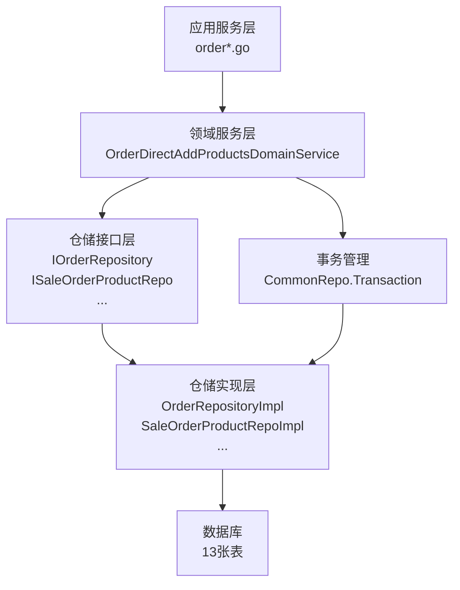

# 订单直接添加商品领域服务 设计文档

> 本文档定义订单直接添加商品领域服务的技术设计和实现方案。

## 📋 概述

订单直接添加商品领域服务（OrderDirectAddProductsDomainService）是一个 DDD 领域服务，专注于**直接向订单添加指定的商品/实体到数据库**，不进行业务规则验证，只负责数据写入。

该服务将：
- 提供统一的接口 `AddProductsToOrder`，支持添加普通商品、套餐、自助餐顾客、自助餐加钟等多种类型
- 支持批量添加，一次调用可以添加多个不同类型的商品/实体
- 确保所有数据写入在同一事务中完成，保证原子性
- 根据数据类型自动写入对应的表（13 张表）

**在系统中的位置**：
- **模块**: `main/app/modules/order/domain/service/`
- **依赖**: `main/app/modules/order/domain/repository`
- **被依赖**: `main/app/service/order*.go`（应用服务层）

---

## 🎯 规范对齐

### Go Modules 规范 (go-modules.mdc)

- ✅ 领域服务接口以 `I` 开头：`IOrderDirectAddProductsDomainService`
- ✅ 领域服务实现以小写开头：`orderDirectAddProductsDomainService`
- ✅ 所有方法第一个参数必须是 `context.Context`（pkg/context）
- ✅ 领域服务依赖 Repository 接口，不直接依赖数据库
- ✅ 遵循 DDD 分层架构：Domain Service → Repository

### Go Main 规范 (go-main.mdc)

- ✅ 不使用 panic，返回 error
- ✅ 使用 `errors.WithMessage` 包装错误
- ✅ Repository 只持有 `db *gorm.DB` 实例，不持有 DBManager
- ✅ 事务管理使用 `repository.CommonRepo.Transaction`

### 数据库规范 (database.mdc)

- ✅ 所有数据写入在同一事务中完成
- ✅ 确保外键关联正确
- ✅ 确保快照数据正确（商品名称、价格等）
- ✅ 时间字段使用 int 类型

---

## 🔄 代码复用分析

### 可复用的现有组件

- **事务管理**: `repository.CommonRepo.Transaction` - 统一的事务管理方法
- **订单商品 Repository**: `repository.NewSaleOrderProductRepo` - 订单商品数据访问
- **订单商品 BOM Repository**: `repository.NewOrderProductBomRepo` - 商品BOM数据访问
- **订单商品属性 Repository**: `repository.NewSaleOrderProductAttributeRepo` - 商品属性数据访问
- **订单商品备注原因 Repository**: `repository.NewSaleOrderProductReasonRepo` - 备注原因数据访问
- **自助餐顾客 Repository**: `repository.NewSaleOrderBuffetCustomerTypeRepo` - 自助餐顾客数据访问
- **自助餐加钟 Repository**: `repository.NewOrderRepo` - 自助餐加钟数据访问（通过 OrderRepo）
- **操作记录 Repository**: `repository.NewOrderOperationRecordRepo` - 操作记录数据访问
- **订单领域服务示例**: `main/app/modules/order/domain/service/order_domain_service.go` - 参考接口设计
- **仓库领域服务示例**: `main/app/modules/inventory/domain/service/warehouse_domain_service.go` - 参考实现模式

### 集成点

- **订单仓储接口**: `main/app/modules/order/domain/repository/IOrderRepository` - 可能需要扩展支持批量写入
- **现有数据写入逻辑**: `main/app/service/order.go:newSaleOrderProduct` - 参考数据写入逻辑
- **事务写入逻辑**: `main/app/service/order_base.go` - 参考事务管理方式

---

## 🏗️ 架构设计

### 分层设计原则

**DDD 四层架构**:

```
应用层 (Application Service)
  ↓ 依赖
领域服务层 (Domain Service) ← 当前实现
  ↓ 依赖
仓储层 (Repository Interface)
  ↓ 实现
基础设施层 (Repository Implementation)
  ↓ 依赖
数据库 (Database)
```

**依赖规则**:

- ✅ 领域服务依赖 Repository 接口
- ✅ 领域服务不依赖应用服务
- ✅ 领域服务不直接依赖数据库
- ❌ 禁止跨层调用

### 架构图



### 模块划分

#### 领域服务层（Domain Service）

- **接口**: `main/app/modules/order/domain/service/i_order_direct_add_products_domain_service.go`
- **实现**: `main/app/modules/order/domain/service/order_direct_add_products_domain_service.go`
- **职责**: 数据写入逻辑编排、事务管理、场景适配

#### 仓储层（Repository）

- **接口**: `main/app/modules/order/domain/repository/order_repository.go`（可能需要扩展）
- **实现**: `main/app/repository/*_repo.go`（使用现有实现）
- **职责**: 数据访问、数据库操作

---

## 🗄️ 数据库设计

### 数据表设计

本功能不创建新表，而是使用现有的 13 张表：

#### 核心表（按类型写入）

1. **ttpos_sale_order_product** - 订单商品表
   - 用途：存储普通商品和套餐
   - 写入时机：添加普通商品或套餐时

2. **ttpos_sale_order_product_bom** - 商品BOM表
   - 用途：存储商品规格、加料
   - 写入时机：商品包含 BOM 时

3. **ttpos_sale_order_product_attribute** - 商品属性表
   - 用途：存储商品属性
   - 写入时机：商品包含属性时

4. **ttpos_sale_order_product_reason** - 商品备注原因表
   - 用途：存储商品备注原因
   - 写入时机：商品包含备注原因时

5. **ttpos_sale_order_buffet_customer_type** - 自助餐顾客类型表
   - 用途：存储自助餐顾客信息
   - 写入时机：添加自助餐顾客时

6. **ttpos_sale_order_buffet_delay_product** - 自助餐加钟商品表
   - 用途：存储自助餐加钟信息
   - 写入时机：添加自助餐加钟时

7. **ttpos_sale_order_operation_record** - 操作记录表
   - 用途：记录所有添加操作
   - 写入时机：所有场景必写

#### 场景相关表（按场景写入）

8. **ttpos_sale_order_coupon** - 优惠券表（如适用）
9. **ttpos_sale_order_discount_strategy** - 折扣策略表（如适用）
10. **ttpos_sale_order_invoice_info** - 发票信息表（如适用）
11. **ttpos_sale_order_material** - 订单材料表（如适用）
12. **ttpos_sale_order_peak_time** - 高峰时段表（如适用）
13. **ttpos_sale_order_abnormal_record** - 异常记录表（如适用）

### 数据库迁移

**无需创建新表**，使用现有表结构。

**参考表结构**：
- `admin/database/seeds/shop_01.sql` - 查看表结构定义

---

## 📊 数据模型

### 领域服务接口定义

```go
// main/app/modules/order/domain/service/i_order_direct_add_products_domain_service.go
package service

import (
	"ttpos-server-go/app/modules/order/domain/repository"
	"ttpos-server-go/pkg/context"
)

// IOrderDirectAddProductsDomainService 订单直接添加商品领域服务接口
type IOrderDirectAddProductsDomainService interface {
	// AddProductsToOrder 直接向订单添加商品/实体到数据库
	// 注意：此方法不进行业务规则验证（库存、限购等），只负责数据写入
	AddProductsToOrder(
		ctx context.Context,
		orderUuid uint64,
		products []AddToOrderProduct,
		options ...AddToOrderOption,
	) error
}

// AddToOrderProduct 添加到订单的商品/实体
type AddToOrderProduct struct {
	Type ProductType // 商品类型：Normal, Package, BuffetCustomer, BuffetDelay
	
	// 根据 Type 使用对应的字段（互斥）
	Product        *model.SaleOrderProduct              // 普通商品/套餐（Type 为 Normal 或 Package 时使用）
	BuffetCustomer *model.SaleOrderBuffetCustomerType  // 自助餐顾客（Type 为 BuffetCustomer 时使用）
	BuffetDelay    *model.SaleOrderBuffetDelayProduct  // 自助餐加钟（Type 为 BuffetDelay 时使用）
}

// ProductType 商品类型
type ProductType int

const (
	ProductTypeNormal ProductType = iota // 普通商品
	ProductTypePackage                   // 套餐
	ProductTypeBuffetCustomer            // 自助餐顾客
	ProductTypeBuffetDelay               // 自助餐加钟
)

// AddToOrderOption 添加选项
type AddToOrderOption struct {
	IsH5Product      bool   // H5 商品标记（设置 is_accept_order 为未接单）
	IsMemberAdd      bool   // 会员加购标记
	IsTableAdd       bool   // 桌台加购标记
	IsBuffetContext  bool   // 自助餐场景
	BatchCookingMode string // 分批制作模式
}

// WithH5Product H5 商品标记
func WithH5Product() func(*AddToOrderOption) {
	return func(opt *AddToOrderOption) {
		opt.IsH5Product = true
	}
}

// WithMemberAdd 会员加购标记
func WithMemberAdd() func(*AddToOrderOption) {
	return func(opt *AddToOrderOption) {
		opt.IsMemberAdd = true
	}
}

// WithTableAdd 桌台加购标记
func WithTableAdd() func(*AddToOrderOption) {
	return func(opt *AddToOrderOption) {
		opt.IsTableAdd = true
	}
}

// WithBuffetContext 自助餐场景
func WithBuffetContext() func(*AddToOrderOption) {
	return func(opt *AddToOrderOption) {
		opt.IsBuffetContext = true
	}
}

// WithBatchCooking 分批制作场景
func WithBatchCooking(mode string) func(*AddToOrderOption) {
	return func(opt *AddToOrderOption) {
		opt.BatchCookingMode = mode
	}
}
```

### 领域服务实现

```go
// main/app/modules/order/domain/service/order_direct_add_products_domain_service.go
package service

import (
	"ttpos-server-go/app/errors"
	"ttpos-server-go/app/model"
	"ttpos-server-go/app/modules/order/domain/repository"
	"ttpos-server-go/app/repository"
	"ttpos-server-go/pkg/context"
	
	"gorm.io/gorm"
)

// orderDirectAddProductsDomainService 订单直接添加商品领域服务实现
type orderDirectAddProductsDomainService struct {
	orderRepo repository.IOrderRepository
	commonRepo repository.ICommonRepo
}

// NewOrderDirectAddProductsDomainService 创建订单直接添加商品领域服务
func NewOrderDirectAddProductsDomainService(
	orderRepo repository.IOrderRepository,
	commonRepo repository.ICommonRepo,
) IOrderDirectAddProductsDomainService {
	return &orderDirectAddProductsDomainService{
		orderRepo:  orderRepo,
		commonRepo: commonRepo,
	}
}

// AddProductsToOrder 直接向订单添加商品/实体到数据库
func (s *orderDirectAddProductsDomainService) AddProductsToOrder(
	ctx context.Context,
	orderUuid uint64,
	products []AddToOrderProduct,
	options ...AddToOrderOption,
) error {
	// 参数验证
	if len(products) == 0 {
		return errors.New("至少需要提供一个商品/实体")
	}
	
	// 解析选项
	opt := &AddToOrderOption{}
	for _, optionFunc := range options {
		optionFunc(opt)
	}
	
	// 获取数据库连接
	db := ctx.GetDB()
	if db == nil {
		return errors.New("数据库连接不存在")
	}
	
	// 事务中执行所有写入操作
	return repository.CommonRepo.Transaction(db, func(tx *gorm.DB) error {
		// 遍历所有商品/实体，根据类型写入对应的表
		for _, product := range products {
			switch product.Type {
			case ProductTypeNormal, ProductTypePackage:
				// 写入普通商品/套餐
				if err := s.persistProduct(ctx, tx, orderUuid, product.Product, opt); err != nil {
					return errors.WithMessage(err, "写入商品失败")
				}
			case ProductTypeBuffetCustomer:
				// 写入自助餐顾客
				if err := s.persistBuffetCustomer(ctx, tx, orderUuid, product.BuffetCustomer); err != nil {
					return errors.WithMessage(err, "写入自助餐顾客失败")
				}
			case ProductTypeBuffetDelay:
				// 写入自助餐加钟
				if err := s.persistBuffetDelay(ctx, tx, orderUuid, product.BuffetDelay); err != nil {
					return errors.WithMessage(err, "写入自助餐加钟失败")
				}
			default:
				return errors.New("不支持的商品类型")
			}
		}
		
		// 写入操作记录
		if err := s.persistOperationRecord(ctx, tx, orderUuid, products); err != nil {
			return errors.WithMessage(err, "写入操作记录失败")
		}
		
		return nil
	})
}

// persistProduct 写入商品数据
func (s *orderDirectAddProductsDomainService) persistProduct(
	ctx context.Context,
	tx *gorm.DB,
	orderUuid uint64,
	product *model.SaleOrderProduct,
	opt *AddToOrderOption,
) error {
	// 设置订单UUID
	product.SaleOrderUuid = orderUuid
	
	// 根据选项设置字段
	if opt.IsH5Product {
		product.IsAcceptOrder = constant.OrderProductIsAcceptOrderUnAccept // 未接单
	} else {
		product.IsAcceptOrder = constant.OrderProductIsAcceptOrderAccepted // 已接单
	}
	
	// 写入订单商品
	productRepo := repository.NewSaleOrderProductRepo(tx)
	if err := productRepo.CreateSaleOrderProductAndBomAndAttribute(*product); err != nil {
		return errors.WithMessage(err, "创建订单商品失败")
	}
	
	// 写入商品备注原因（如有）
	if len(product.OrderItemRemarks) > 0 {
		reasonRepo := repository.NewSaleOrderProductReasonRepo(tx)
		if err := reasonRepo.CreateSaleOrderProductReasons(product.OrderItemRemarks); err != nil {
			return errors.WithMessage(err, "创建备注原因失败")
		}
	}
	
	return nil
}

// persistBuffetCustomer 写入自助餐顾客数据
func (s *orderDirectAddProductsDomainService) persistBuffetCustomer(
	ctx context.Context,
	tx *gorm.DB,
	orderUuid uint64,
	customer *model.SaleOrderBuffetCustomerType,
) error {
	// 设置订单UUID
	customer.SaleOrderUuid = orderUuid
	
	// 写入自助餐顾客
	customerRepo := repository.NewSaleOrderBuffetCustomerTypeRepo(tx)
	if err := customerRepo.CreateSaleOrderBuffetCustomerTypeRecord(*customer); err != nil {
		return errors.WithMessage(err, "创建自助餐顾客失败")
	}
	
	return nil
}

// persistBuffetDelay 写入自助餐加钟数据
func (s *orderDirectAddProductsDomainService) persistBuffetDelay(
	ctx context.Context,
	tx *gorm.DB,
	orderUuid uint64,
	delay *model.SaleOrderBuffetDelayProduct,
) error {
	// 设置订单UUID
	delay.SaleOrderUuid = orderUuid
	
	// 写入自助餐加钟
	orderRepo := repository.NewOrderRepo(tx)
	if _, err := orderRepo.CreateSaleOrderBuffetDelayProduct(*delay); err != nil {
		return errors.WithMessage(err, "创建自助餐加钟失败")
	}
	
	return nil
}

// persistOperationRecord 写入操作记录
func (s *orderDirectAddProductsDomainService) persistOperationRecord(
	ctx context.Context,
	tx *gorm.DB,
	orderUuid uint64,
	products []AddToOrderProduct,
) error {
	// 构建操作记录
	record := &model.SaleOrderOperationRecord{
		Source:        ctx.GetSource(),
		Action:        constant.OrderAddProduct,
		SaleOrderUuid: orderUuid,
		OperatorUuid:  ctx.GetStaffUuid(),
		// ... 其他字段
	}
	
	// 写入操作记录
	recordRepo := repository.NewOrderOperationRecordRepo(tx)
	if _, err := recordRepo.CreateSaleOrderOperationRecord(*record); err != nil {
		return errors.WithMessage(err, "创建操作记录失败")
	}
	
	return nil
}
```

---

## 🔌 API 设计

### 领域服务接口（非 HTTP API）

本功能是领域服务，不直接暴露 HTTP API，而是被应用服务调用。

**接口签名**：
```go
AddProductsToOrder(
	ctx context.Context,
	orderUuid uint64,
	products []AddToOrderProduct,
	options ...AddToOrderOption,
) error
```

**使用示例**：
```go
// 在应用服务中调用
domainService := service.NewOrderDirectAddProductsDomainService(orderRepo, commonRepo)

products := []service.AddToOrderProduct{
	{
		Type:    service.ProductTypeNormal,
		Product: product1,
	},
	{
		Type:            service.ProductTypeBuffetCustomer,
		BuffetCustomer: customer1,
	},
}

err := domainService.AddProductsToOrder(ctx, orderUuid, products, service.WithH5Product())
```

---

## 🧩 组件和接口

### 领域服务层

#### 领域服务接口

```go
// main/app/modules/order/domain/service/i_order_direct_add_products_domain_service.go
type IOrderDirectAddProductsDomainService interface {
	AddProductsToOrder(
		ctx context.Context,
		orderUuid uint64,
		products []AddToOrderProduct,
		options ...AddToOrderOption,
	) error
}
```

#### 领域服务实现

```go
// main/app/modules/order/domain/service/order_direct_add_products_domain_service.go
type orderDirectAddProductsDomainService struct {
	orderRepo  repository.IOrderRepository
	commonRepo repository.ICommonRepo
}
```

### Repository 层（使用现有实现）

本功能使用现有的 Repository 实现，无需新建：

- `repository.NewSaleOrderProductRepo` - 订单商品 Repository
- `repository.NewOrderProductBomRepo` - 商品BOM Repository
- `repository.NewSaleOrderProductAttributeRepo` - 商品属性 Repository
- `repository.NewSaleOrderProductReasonRepo` - 备注原因 Repository
- `repository.NewSaleOrderBuffetCustomerTypeRepo` - 自助餐顾客 Repository
- `repository.NewOrderRepo` - 订单 Repository（用于自助餐加钟）
- `repository.NewOrderOperationRecordRepo` - 操作记录 Repository

---

## ⚡ 缓存设计

**无需缓存**：本功能是数据写入操作，不涉及缓存。

---

## 🚨 错误处理

### 错误场景

#### 场景 1: products 参数为空

- **处理方式**: 返回错误，提示至少需要提供一个商品/实体
- **用户影响**: 调用方收到明确的错误信息
- **代码示例**:
  ```go
  if len(products) == 0 {
      return errors.New("至少需要提供一个商品/实体")
  }
  ```

#### 场景 2: Type 字段与数据字段不一致

- **处理方式**: 返回错误，提示类型不匹配
- **用户影响**: 调用方收到明确的错误信息
- **代码示例**:
  ```go
  if product.Type == ProductTypeNormal && product.Product == nil {
      return errors.New("商品类型为 Normal，但 Product 字段为空")
  }
  ```

#### 场景 3: 数据写入失败

- **处理方式**: 事务自动回滚，返回错误
- **用户影响**: 所有数据都不会写入，保证一致性
- **代码示例**:
  ```go
  return repository.CommonRepo.Transaction(db, func(tx *gorm.DB) error {
      // 如果任何写入失败，事务会自动回滚
      if err := productRepo.Create(...); err != nil {
          return errors.WithMessage(err, "写入商品失败")
      }
      return nil
  })
  ```

#### 场景 4: 外键关联失败

- **处理方式**: 返回错误，提示外键关联失败
- **用户影响**: 调用方收到明确的错误信息
- **代码示例**:
  ```go
  if err := bomRepo.Create(...); err != nil {
      return errors.WithMessage(err, "创建商品BOM失败，请检查 sale_order_product_uuid 是否正确")
  }
  ```

---

## 🔒 安全设计

### 身份验证

- **Context 验证**: 通过 `context.Context` 获取用户信息
- **权限检查**: 由调用方（应用服务）进行权限检查

### 数据安全

- **事务隔离**: 使用数据库事务确保数据一致性
- **外键约束**: 确保外键关联正确
- **数据验证**: 验证 Type 字段与数据字段的一致性

---

## 🧪 测试策略

### 单元测试

**目标覆盖率**:
- 领域服务层: ≥ 80%

**测试内容**:
- 正常场景：添加普通商品、套餐、自助餐顾客、自助餐加钟
- 批量添加：混合添加多种类型
- 异常场景：参数为空、类型不匹配、数据写入失败
- 事务回滚：验证写入失败时事务回滚

**示例**:
```go
// main/app/modules/order/domain/service/order_direct_add_products_domain_service_test.go
func TestOrderDirectAddProductsDomainService_AddProductsToOrder(t *testing.T) {
	// Mock Repository
	mockOrderRepo := &MockOrderRepository{}
	mockCommonRepo := &MockCommonRepo{}
	
	// 创建领域服务
	service := NewOrderDirectAddProductsDomainService(mockOrderRepo, mockCommonRepo)
	
	// 测试用例
	t.Run("添加普通商品", func(t *testing.T) {
		products := []AddToOrderProduct{
			{Type: ProductTypeNormal, Product: &model.SaleOrderProduct{...}},
		}
		err := service.AddProductsToOrder(ctx, orderUuid, products)
		assert.NoError(t, err)
	})
	
	t.Run("批量添加多种类型", func(t *testing.T) {
		products := []AddToOrderProduct{
			{Type: ProductTypeNormal, Product: product1},
			{Type: ProductTypeBuffetCustomer, BuffetCustomer: customer1},
		}
		err := service.AddProductsToOrder(ctx, orderUuid, products)
		assert.NoError(t, err)
	})
	
	t.Run("参数为空", func(t *testing.T) {
		err := service.AddProductsToOrder(ctx, orderUuid, []AddToOrderProduct{})
		assert.Error(t, err)
		assert.Contains(t, err.Error(), "至少需要提供一个商品/实体")
	})
}
```

### 集成测试

**测试内容**:
- 端到端流程：从应用服务调用到数据库写入
- 事务一致性：验证所有表的数据写入在同一事务中
- 数据完整性：验证外键关联、快照数据等

---

## 📈 性能优化

### 优化策略

1. **批量写入**: 支持一次调用添加多个商品/实体，减少事务次数
2. **事务优化**: 所有写入在同一事务中完成，减少数据库交互
3. **避免不必要的查询**: 不进行业务规则验证，直接写入数据

### 性能指标

- 数据写入操作: < 500ms（单次调用，批量添加）
- 事务提交时间: < 100ms
- 并发能力: 支持并发调用（通过 UUID 锁在应用层控制）

---

## 📚 实现清单

### Phase 1: 领域服务接口和实现

- [ ] 创建领域服务接口 `IOrderDirectAddProductsDomainService`
- [ ] 定义 `AddToOrderProduct` 结构体
- [ ] 定义 `ProductType` 枚举
- [ ] 定义 `AddToOrderOption` 和选项函数
- [ ] 实现领域服务 `orderDirectAddProductsDomainService`
- [ ] 实现 `persistProduct` 方法
- [ ] 实现 `persistBuffetCustomer` 方法
- [ ] 实现 `persistBuffetDelay` 方法
- [ ] 实现 `persistOperationRecord` 方法

### Phase 2: 单元测试

- [ ] 编写领域服务单元测试
- [ ] Mock Repository 层
- [ ] 测试正常场景
- [ ] 测试异常场景
- [ ] 测试事务回滚

### Phase 3: 集成和适配

- [ ] 在应用服务中集成领域服务
- [ ] 重构现有加购逻辑，调用领域服务
- [ ] 验证向后兼容性

### Phase 4: 文档和优化

- [ ] 更新代码注释
- [ ] 性能测试和优化
- [ ] 代码审查

**详细任务**: 参见 `tasks.md`

---

## Graphiti & 活动日志

- Related Episode: `[待补充]`
- 模板：`docs/agent/templates/graphiti-episode.md`
- 活动日志：`docs/team/activities/{YYYY-MM}/{YYYY-MM-DD}.md`
- 在技术方案评审、关键架构决策或踩坑总结后，立即补充 Episode 并在设计文档尾部互链。

---

**版本**: v1.0.0  
**创建日期**: 2025-12-19  
**作者**: xiezhihuan  
**审核者**: {审核者}

