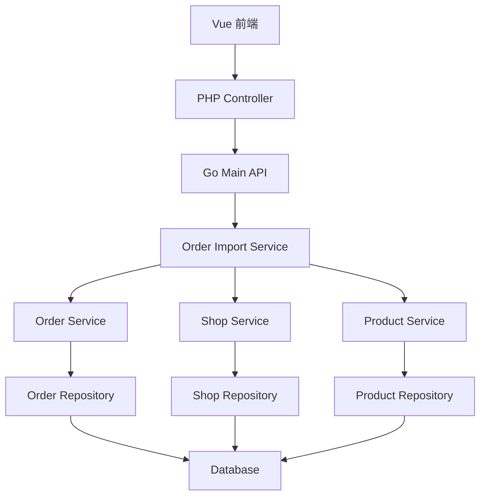

# 订单数据导入 设计文档

> 本文档定义订单数据导入功能的技术设计和实现方案。
> 
> **💡 MVP 方案**：最小可执行版本，快速验证可行性

## 📋 概述

提供简单的 Excel 文件上传和订单数据导入功能，支持将华莱士旧系统的历史订单数据批量导入到 TTPOS 系统。

**核心流程**：Excel 上传 → 解析 → 校验 → 批量写入 → 返回结果

---

## 🎯 规范对齐

### Go Main 规范 (go-main.mdc)

- Service 只依赖其他 Service 接口
- Repository 只持有 db 实例
- URL 使用 snake_case
- data 字段必须是对象
- 不使用 panic，返回 error

### PHP 规范 (php.mdc)

- 遵循 MVC 分层
- Controller 不写业务逻辑
- 使用验证器验证参数

### API 设计规范 (api.mdc)

- URL 使用 snake_case
- 响应格式统一
- data 不能为 null 或数组

### 数据库规范 (database.mdc)

- 使用现有订单表结构
- 遵循现有数据库规范

---

## 🔄 代码复用分析

### 可复用的现有组件

- **商品导入功能**: `admin/views/shop/src/views/product/store/product/importProduct.vue` - 参考前端上传和解析逻辑
- **桌台导入功能**: `admin/views/shop/src/views/supplier/table/table/importQrcode.vue` - 参考前端上传和解析逻辑
- **订单 Service**: `main/app/service/order*.go` - 复用订单创建逻辑
- **订单 Repository**: `main/app/repository/order*.go` - 复用订单数据访问逻辑

### 集成点

- **订单表**: `ttpos_sale_bill`, `ttpos_sale_order`, `ttpos_sale_order_product` - 写入订单数据
- **门店表**: `ttpos_shop` - 校验门店是否存在
- **商品表**: `ttpos_product` - 校验商品是否存在

---

## 🏗️ 架构设计

### 分层设计原则

**Go Main 三层架构**:

```
API 层 (Controller/API)
  ↓ 依赖
业务层 (Service)
  ↓ 依赖
数据层 (Repository)
```

**依赖规则**:

- ✅ 上层可依赖下层
- ❌ 禁止下层依赖上层
- ❌ 禁止跨层调用
- ❌ Service 不能依赖 Repository
- ✅ Service 可以依赖其他 Service 接口

### 架构图



### 模块划分

#### Go Main 模块

- **API 层**: `main/app/api/order_import_api.go` - 文件上传、导入接口
- **Service 层**: `main/app/service/order_import_service.go` - 导入业务逻辑
- **Repository 层**: 复用现有 Order/Shop/Product Repository
- **DTO 层**: `main/app/dto/req/order_import_req.go`, `main/app/dto/resp/order_import_resp.go`

#### PHP Admin 模块

- **Controller 层**: `admin/app/shop/controller/store/order/ImportController.php` - 文件上传接口
- **Service 层**: `admin/app/shop/service/order/ImportService.php` - 调用 Go Main API

#### Vue 前端模块

- **Pages**: `admin/views/shop/src/views/order/import/index.vue` - 导入页面
- **API**: `admin/views/shop/src/api/order/import.ts` - API 封装

---

## 🗄️ 数据库设计

### 使用现有表结构

不新增表，使用现有订单相关表：

- `ttpos_sale_bill` - 销售账单
- `ttpos_sale_order` - 销售订单
- `ttpos_sale_order_product` - 销售订单商品

### Excel 数据映射

> 📖 **详细格式定义请参考**: [excel-format.md](./excel-format.md)

**订单基本信息**（Sheet1）：
- 订单号 → `order_no`
- 下单时间 → `create_time`（转换为时间戳）
- 订单状态 → `status`（0-待付款、1-已完成、2-已取消）
- 订单类型 → `bill_type`（0-桌台订单、1-点餐订单、2-会员端订单）
- 用餐方式 → `dining_method`（0-堂食、1-打包）
- 订单金额 → `amount`（折后价）
- 订单原价 → `origin_amount`（折前价）
- 门店名称 → 通过 `shop_name` 查找 `shop_uuid`
- 桌台名称 → 通过 `desk_name` 查找 `desk_uuid`（可选）
- 会员编号 → 通过 `member_no` 查找 `consumer_uuid`（可选）

**订单明细信息**（Sheet2）：
- 订单号 → 关联订单基本信息
- 商品名称 → 通过 `product_name` 查找 `product_uuid`
- 数量 → `num`
- 单价 → `price`
- 小计 → `amount`（数量×单价）

---

## 📊 数据模型

### Request DTO

```go
// main/app/dto/req/order_import_req.go
type OrderImportReq struct {
    File *multipart.FileHeader `form:"file" binding:"required"`
}
```

### Response DTO

```go
// main/app/dto/resp/order_import_resp.go
type OrderImportResp struct {
    SuccessCount int                    `json:"success_count"`
    FailCount    int                    `json:"fail_count"`
    FailList     []OrderImportFailItem  `json:"fail_list"`
}

type OrderImportFailItem struct {
    Row     int    `json:"row"`      // Excel 行号
    OrderNo string `json:"order_no"`  // 订单号
    Reason  string `json:"reason"`    // 失败原因
}
```

---

## 🔌 API 设计

### RESTful API

#### API 1: 导入订单

**请求**:

- **URL**: `/api/v1/order/import`
- **Method**: `POST`
- **Content-Type**: `multipart/form-data`
- **Headers**:
  ```json
  {
    "Authorization": "Bearer {token}"
  }
  ```
- **Body**:
  ```
  file: {Excel文件}
  ```

**响应**:

```json
{
  "code": 1,
  "message": "success",
  "data": {
    "success_count": 100,
    "fail_count": 2,
    "fail_list": [
      {
        "row": 5,
        "order_no": "ORD001",
        "reason": "门店不存在"
      },
      {
        "row": 10,
        "order_no": "ORD002",
        "reason": "商品不存在"
      }
    ]
  }
}
```

**错误响应**:

```json
{
  "code": 0,
  "message": "文件格式错误，仅支持 .xlsx 格式",
  "data": {}
}
```

---

## 🧩 组件和接口

### Service 层

#### Service 接口

```go
// main/app/service/i_order_import_service.go
type IOrderImportSrv interface {
    Import(ctx *gin.Context, file *multipart.FileHeader) (*dto_resp.OrderImportResp, error)
}
```

#### Service 实现

```go
// main/app/service/order_import_service.go
type orderImportSrv struct {
    dbm          *database.DBManager
    orderSrv     service.IOrderSrv
    shopSrv      service.IShopSrv
    productSrv   service.IProductSrv
}

func NewOrderImportSrv(
    dbm *database.DBManager,
    orderSrv service.IOrderSrv,
    shopSrv service.IShopSrv,
    productSrv service.IProductSrv,
) IOrderImportSrv {
    return &orderImportSrv{
        dbm:        dbm,
        orderSrv:   orderSrv,
        shopSrv:    shopSrv,
        productSrv: productSrv,
    }
}

func (s *orderImportSrv) Import(ctx *gin.Context, file *multipart.FileHeader) (*dto_resp.OrderImportResp, error) {
    // 1. 打开 Excel 文件
    // 2. 解析订单数据
    // 3. 校验数据（必填字段、关联数据）
    // 4. 批量写入数据库（事务）
    // 5. 返回结果
}
```

### API 层

```go
// main/app/api/order_import_api.go
type OrderImportAPI struct {
    orderImportSrv service.IOrderImportSrv
}

func NewOrderImportAPI(orderImportSrv service.IOrderImportSrv) *OrderImportAPI {
    return &OrderImportAPI{orderImportSrv: orderImportSrv}
}

// POST /api/v1/order/import
func (api *OrderImportAPI) Import(c *gin.Context) {
    file, err := c.FormFile("file")
    if err != nil {
        helper.ErrorWithDetail(c, constant.CodeInvalidParam, err)
        return
    }

    // 校验文件格式
    if !strings.HasSuffix(file.Filename, ".xlsx") {
        helper.Error(c, constant.CodeInvalidParam, "文件格式错误，仅支持 .xlsx 格式")
        return
    }

    // 校验文件大小（10MB）
    if file.Size > 10*1024*1024 {
        helper.Error(c, constant.CodeInvalidParam, "文件大小不能超过 10MB")
        return
    }

    resp, err := api.orderImportSrv.Import(c, file)
    if err != nil {
        helper.ErrorWithDetail(c, constant.CodeFail, err)
        return
    }

    helper.Success(c, gin.H{
        "data": resp,
    })
}
```

---

## ⚡ 实现细节

### Excel 解析

使用 `github.com/xuri/excelize/v2` 库：

```go
import "github.com/xuri/excelize/v2"

func parseExcel(file *multipart.FileHeader) ([]OrderData, error) {
    f, err := excelize.OpenReader(file)
    if err != nil {
        return nil, err
    }
    defer f.Close()

    // 读取第一个工作表
    rows, err := f.GetRows("Sheet1")
    if err != nil {
        return nil, err
    }

    // 解析数据（跳过表头）
    var orders []OrderData
    for i := 1; i < len(rows); i++ {
        // 解析每一行数据
    }

    return orders, nil
}
```

### 数据校验

```go
func (s *orderImportSrv) validateOrderData(data *OrderData) error {
    // 1. 校验必填字段
    if data.OrderNo == "" {
        return errors.New("订单号不能为空")
    }
    if data.CreateTime == 0 {
        return errors.New("下单时间不能为空")
    }
    
    // 2. 校验关联数据
    shop, err := s.shopSrv.GetByName(ctx, data.ShopName)
    if err != nil {
        return errors.New("门店不存在")
    }
    
    // 3. 校验商品
    for _, item := range data.Items {
        product, err := s.productSrv.GetByName(ctx, item.ProductName)
        if err != nil {
            return errors.New(fmt.Sprintf("商品 %s 不存在", item.ProductName))
        }
    }
    
    return nil
}
```

### 批量导入

```go
func (s *orderImportSrv) Import(ctx *gin.Context, file *multipart.FileHeader) (*dto_resp.OrderImportResp, error) {
    // 1. 解析 Excel
    orders, err := parseExcel(file)
    if err != nil {
        return nil, err
    }

    // 2. 限制数量
    if len(orders) > 5000 {
        return nil, errors.New("单次导入不能超过 5000 条，请分批导入")
    }

    // 3. 开始事务
    db := s.dbm.GetDB(ctx)
    tx := db.Begin()
    defer tx.Rollback()

    var successCount, failCount int
    var failList []dto_resp.OrderImportFailItem

    // 4. 批量处理（每批 500 条）
    batchSize := 500
    for i := 0; i < len(orders); i += batchSize {
        end := i + batchSize
        if end > len(orders) {
            end = len(orders)
        }
        batch := orders[i:end]

        for _, order := range batch {
            // 校验数据
            if err := s.validateOrderData(&order); err != nil {
                failCount++
                failList = append(failList, dto_resp.OrderImportFailItem{
                    Row:     order.Row,
                    OrderNo: order.OrderNo,
                    Reason:  err.Error(),
                })
                continue
            }

            // 检查订单号是否已存在
            exists, err := s.orderSrv.ExistsByOrderNo(ctx, order.OrderNo)
            if err != nil {
                failCount++
                failList = append(failList, dto_resp.OrderImportFailItem{
                    Row:     order.Row,
                    OrderNo: order.OrderNo,
                    Reason:  "检查订单号失败",
                })
                continue
            }
            if exists {
                failCount++
                failList = append(failList, dto_resp.OrderImportFailItem{
                    Row:     order.Row,
                    OrderNo: order.OrderNo,
                    Reason:  "订单号已存在，跳过",
                })
                continue
            }

            // 创建订单
            if err := s.createOrder(ctx, tx, &order); err != nil {
                failCount++
                failList = append(failList, dto_resp.OrderImportFailItem{
                    Row:     order.Row,
                    OrderNo: order.OrderNo,
                    Reason:  err.Error(),
                })
                continue
            }

            successCount++
        }
    }

    // 5. 提交事务
    if err := tx.Commit().Error; err != nil {
        return nil, err
    }

    // 6. 返回结果
    return &dto_resp.OrderImportResp{
        SuccessCount: successCount,
        FailCount:    failCount,
        FailList:     failList[:min(len(failList), 10)], // 最多返回 10 条失败记录
    }, nil
}
```

---

## 🚨 错误处理

### 错误场景

#### 场景 1: 文件格式错误

- **处理方式**: 返回错误提示
- **用户影响**: 提示"文件格式错误，仅支持 .xlsx 格式"
- **代码示例**:
  ```go
  if !strings.HasSuffix(file.Filename, ".xlsx") {
      return nil, errors.New("文件格式错误，仅支持 .xlsx 格式")
  }
  ```

#### 场景 2: 数据校验失败

- **处理方式**: 记录失败原因，继续处理其他数据
- **用户影响**: 在结果中显示失败记录和原因

#### 场景 3: 数据库写入失败

- **处理方式**: 回滚事务，返回错误
- **用户影响**: 提示导入失败，数据未写入

---

## 🔒 安全设计

### 身份验证

- **JWT Token**: 所有 API 需要 Token 验证

### 权限控制

- **RBAC**: 仅系统管理员和商户管理员可导入

### 数据安全

- **文件大小限制**: 10MB
- **文件类型限制**: 仅 `.xlsx`
- **SQL 注入防护**: 使用参数化查询

---

## 🧪 测试策略

### 单元测试

**目标覆盖率**:

- main/app/service: 70%+
- main/app/repository: 80%+
- **Order 相关: 100%**（高风险）

**测试内容**:

- Excel 解析逻辑
- 数据校验逻辑
- 批量导入逻辑

### API 测试

**测试内容**:

- 文件上传接口
- 参数验证
- 响应格式
- 错误处理

### 集成测试

**测试流程**:

- 端到端导入流程
- 数据库事务
- 数据一致性

---

## 📈 性能优化

### 优化策略

1. **批量插入**: 每批 500 条，减少数据库交互
2. **事务管理**: 使用事务保证一致性
3. **数据校验优化**: 批量查询关联数据，减少数据库查询

### 性能指标

- 单次导入 5000 条: < 30 秒
- 数据库查询: < 50ms
- 批量插入: < 100ms/批

---

## 📚 实现清单

### Phase 1: 后端核心实现

- [ ] 创建 OrderImport Service 接口和实现
- [ ] 创建 OrderImport API
- [ ] 实现 Excel 解析逻辑
- [ ] 实现数据校验逻辑
- [ ] 实现批量导入逻辑

### Phase 2: PHP 接口

- [ ] 创建 PHP Controller
- [ ] 创建 PHP Service（调用 Go Main API）

### Phase 3: Vue 前端

- [ ] 创建导入页面
- [ ] 实现文件上传组件
- [ ] 实现结果展示

### Phase 4: 测试

- [ ] 单元测试
- [ ] API 测试
- [ ] 集成测试

**详细任务**: 参见 `tasks.md`

---

## Graphiti & 活动日志

- Related Episode: `[待补充]`
- 模板：`docs/agent/templates/graphiti-episode.md`
- 活动日志：`docs/team/activities/{YYYY-MM}/{YYYY-MM-DD}.md`
- 在技术方案评审、关键架构决策或踩坑总结后，立即补充 Episode 并在设计文档尾部互链。

---

**版本**: v1.0.0  
**创建日期**: 2025-11-19  
**作者**: xiezhihuan  
**审核者**: 待定

