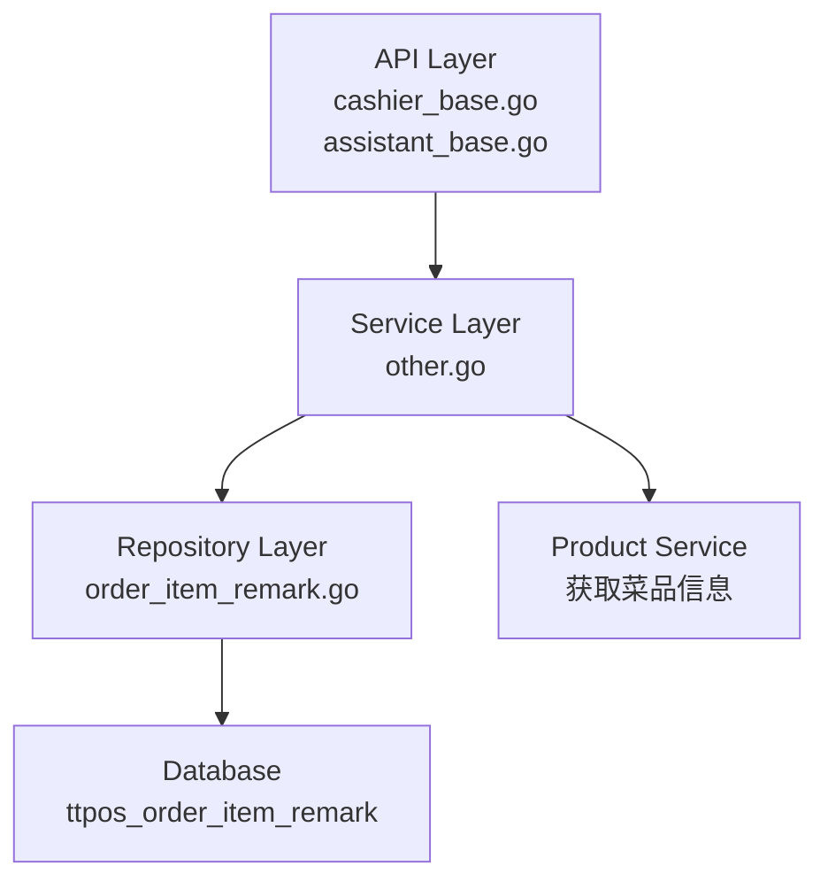

# 点餐端快速选择备注 设计文档

> 本文档定义点餐端快速选择备注功能的技术设计和实现方案。

## 📋 概述

在点餐时（收银机/点餐助手/H5/平板）为菜品添加备注时，可以直接从商户后台已设置的预设选项中选择，无需手动输入。支持为不同菜品显示不同的备注选项，提高操作效率。

**技术定位**：
- 基于现有备注预设（OrderItemRemark）数据
- 参考退菜原因（ReturnFoodReason）的 API 实现方式
- 新增根据菜品获取备注预设列表的 API

---

## 🎯 规范对齐

### Go Main 规范 (go-main.mdc)

- Service 只依赖其他 Service 接口
- Repository 只持有 db 实例
- URL 使用 snake_case
- data 字段必须是对象
- 不使用 panic，返回 error

### API 设计规范 (api.mdc)

- URL 使用 snake_case（如：`/api/v1/cashier/item_remark_preset`）
- 响应格式：`{code, message, data{}}`
- data 不能为 null 或数组

### 数据库规范 (database.mdc)

- 备注预设数据表（ttpos_order_item_remark）已存在
- 订单项备注字段已存在（sale_order_product.remark）
- 菜品与备注预设的关联关系需确认（如不存在需创建）

---

## 🔄 代码复用分析

### 可复用的现有组件

- **OrderItemRemarkRepo**: `main/app/repository/base/order_item_remark.go` - 备注预设数据访问
- **OtherService**: `main/app/service/other.go` - 已实现 `GetOrderItemRemarkList` 方法
- **ReturnFoodReason API**: `main/app/api/v1/cashier/cashier_base.go` - 参考退菜原因 API 实现方式
- **ReturnFoodReason Service**: `main/app/service/other.go` - 参考 `GetReturnFoodReasonList` 实现

### 集成点

- **现有 API**: 在 `main/app/api/v1/cashier/` 和 `main/app/api/v1/assistant/` 中新增获取备注预设 API
- **现有 Service**: 在 `main/app/service/other.go` 中新增根据菜品获取备注预设的方法
- **数据库表**: 使用现有的 `ttpos_order_item_remark` 表

---

## 🏗️ 架构设计

### 分层设计原则

**Go Main 三层架构**:

```
API 层 (Controller/API)
  ↓ 依赖
业务层 (Service)
  ↓ 依赖
数据层 (Repository)
```

**依赖规则**:

- ✅ 上层可依赖下层
- ❌ 禁止下层依赖上层
- ❌ 禁止跨层调用
- ❌ Service 不能依赖 Repository
- ✅ Service 可以依赖其他 Service 接口

### 架构图



### 模块划分

#### Go Main 模块

- **API 层**: `main/app/api/v1/cashier/cashier_base.go` - 收银端 API
- **API 层**: `main/app/api/v1/assistant/assistant_base.go` - 助手端 API
- **Service 层**: `main/app/service/other.go` - 业务逻辑
- **Repository 层**: `main/app/repository/base/order_item_remark.go` - 数据访问（已存在）
- **Model 层**: `main/app/model/reason.go` - OrderItemRemark 模型（已存在）
- **DTO 层**: `main/app/dto/` - 数据传输对象
  - `req/` - 请求参数
  - `resp/` - 响应数据

---

## 🗄️ 数据库设计

### 数据表设计

#### 表 1: ttpos_order_item_remark（已存在）

备注预设表，商户后台已实现管理功能。

**字段说明**:
| 字段 | 类型 | 说明 | 约束 |
|------|------|------|------|
| id | bigint unsigned | 主键 ID | AUTO_INCREMENT |
| uuid | bigint unsigned | 唯一标识 | DEFAULT 0, UNIQUE |
| name | varchar(255) | 名称 | DEFAULT '' |
| multi_language_name_uuid | bigint unsigned | 多语言名称ID | DEFAULT 0 |
| create_time | int | 创建时间 | DEFAULT 0 |
| update_time | int | 更新时间 | DEFAULT 0 |
| delete_time | int | 删除时间 | DEFAULT 0 |

**索引设计**:
- 主键索引: `PRIMARY KEY (id)`
- 唯一索引: `UNIQUE KEY uk_uuid (uuid)`

#### 表 2: ttpos_sale_order_product_reason（扩展使用）

使用现有的 `ttpos_sale_order_product_reason` 表来实现菜品关联备注预设。该表目前用于存储订单商品的原因（退菜、免单、赠菜），我们将扩展其用途，新增 `order_item_remark_uuid` 字段用于存储备注预设的 UUID。

**表结构**（已存在，需扩展）:

```sql
-- 现有字段
CREATE TABLE IF NOT EXISTS `ttpos_sale_order_product_reason` (
    `id` INT(11) UNSIGNED NOT NULL AUTO_INCREMENT PRIMARY KEY COMMENT '自增ID',
    `uuid` BIGINT UNSIGNED NOT NULL DEFAULT 0 COMMENT '自增UUID',
    `sale_order_uuid` BIGINT UNSIGNED NOT NULL DEFAULT 0 COMMENT '销售订单ID',
    `sale_order_product_uuid` BIGINT UNSIGNED NOT NULL DEFAULT 0 COMMENT '销售订单商品ID',
    -- 三选一（现有）
    `return_food_reason_uuid` BIGINT UNSIGNED NOT NULL DEFAULT 0 COMMENT '退菜原因ID',
    `free_reason_uuid` BIGINT UNSIGNED NOT NULL DEFAULT 0 COMMENT '免单原因ID',
    `gift_reason_uuid` BIGINT UNSIGNED NOT NULL DEFAULT 0 COMMENT '赠菜原因ID',
    -- 新增字段：备注预设UUID
    `order_item_remark_uuid` BIGINT UNSIGNED NOT NULL DEFAULT 0 COMMENT '备注预设UUID',
    -- 快照字段
    `name` TEXT COMMENT '原因名称快照（JSON），不随后台更新',
    `multi_language_name_uuid` BIGINT UNSIGNED NOT NULL DEFAULT 0 COMMENT '原因-多语言名称ID',
    -- 时间信息
    `create_time` INT(10) UNSIGNED NOT NULL DEFAULT 0 COMMENT '创建时间(时间戳)',
    `update_time` INT(10) UNSIGNED NOT NULL DEFAULT 0 COMMENT '更新时间(时间戳)',
    `delete_time` INT(10) UNSIGNED NOT NULL DEFAULT 0 COMMENT '删除时间(时间戳)',
    INDEX `idx_sale_order_uuid` (`sale_order_uuid`),
    INDEX `idx_sale_order_product_uuid` (`sale_order_product_uuid`),
    INDEX `idx_order_item_remark_uuid` (`order_item_remark_uuid`), -- 新增索引
    UNIQUE KEY `unique_uuid` (`uuid`)
) ENGINE = InnoDB DEFAULT CHARSET = utf8mb4 COLLATE = utf8mb4_unicode_ci COMMENT = '销售订单商品原因表';
```

**扩展说明**:
- 在 `ttpos_sale_order_product_reason` 表中新增 `order_item_remark_uuid` 字段
- 该字段用于存储备注预设的 UUID
- 当 `order_item_remark_uuid > 0` 时，表示这是备注预设原因
- 与退菜、免单、赠菜原因字段互斥（四选一）

**使用场景**:
- 该表用于存储订单商品（sale_order_product）的原因
- 当用户在点餐时选择备注预设后，会在订单商品上创建一条 `SaleOrderProductReason` 记录
- `order_item_remark_uuid` 字段存储选择的备注预设 UUID
- 这样可以在订单商品上记录使用的备注预设，便于后续查询和统计

**注意**: 
- 需要创建数据库迁移文件，添加 `order_item_remark_uuid` 字段和索引
- 需要更新 Go Model，添加 `OrderItemRemarkUuid` 字段
- 需要添加判断方法 `IsOrderItemRemark()`，类似 `IsReturnFoodReason()`
- **重要**: 该表用于订单商品的原因记录，不是用于商品（product）与备注预设的关联关系。商品与备注预设的关联关系需要商户后台在商品管理时配置，点餐端根据商品 UUID 查询该商品关联的备注预设列表。

---

## 📊 数据模型

### Go Model

#### OrderItemRemark（已存在）

```go
// main/app/model/reason.go
type OrderItemRemark struct {
	BaseModel
	Name                  string `gorm:"default:'';column:name;comment:'名称'"`
	MultiLanguageNameUuid uint64 `gorm:"default:0;column:multi_language_name_uuid;comment:'多语言名称ID'"`

	MultiLanguageName MultiLanguageName `gorm:"foreignKey:multi_language_name_uuid;references:uuid"`
}

func (*OrderItemRemark) TableName() string {
	return "ttpos_order_item_remark"
}
```

#### SaleOrderProductReason（需扩展）

```go
// main/app/model/order.go
type SaleOrderProductReason struct {
	BaseModel
	SaleOrderUuid         uint64 `gorm:"column:sale_order_uuid;type:bigint(20) unsigned;not null;default:0;comment:销售订单ID" json:"sale_order_uuid"`
	SaleOrderProductUuid  uint64 `gorm:"column:sale_order_product_uuid;type:bigint(20) unsigned;not null;default:0;comment:销售订单商品ID" json:"sale_order_product_uuid"`
	MultiLanguageNameUuid uint64 `gorm:"column:multi_language_name_uuid;type:bigint(20) unsigned;not null;default:0;comment:多语言名称ID" json:"multi_language_name_uuid"`
	// 四选一（新增备注预设）
	ReturnFoodReasonUuid uint64 `gorm:"column:return_food_reason_uuid;type:bigint(20) unsigned;not null;default:0;comment:退菜原因ID" json:"return_food_reason_uuid"`
	FreeReasonUuid       uint64 `gorm:"column:free_reason_uuid;type:bigint(20) unsigned;not null;default:0;comment:免单原因ID" json:"free_reason_uuid"`
	GiftReasonUuid       uint64 `gorm:"column:gift_reason_uuid;type:bigint(20) unsigned;not null;default:0;comment:赠菜原因ID" json:"gift_reason_uuid"`
	OrderItemRemarkUuid  uint64 `gorm:"column:order_item_remark_uuid;type:bigint(20) unsigned;not null;default:0;comment:备注预设UUID" json:"order_item_remark_uuid"` // 新增字段
	Name                 string `gorm:"column:name;type:text;default:'';comment:原因名称快照（JSON），不随后台更新" json:"name"`
	MultiLanguageName   *MultiLanguageName `gorm:"foreignKey:multi_language_name_uuid;references:uuid"`
}

// 是否是备注预设
func (model *SaleOrderProductReason) IsOrderItemRemark() bool {
	return model.OrderItemRemarkUuid != 0
}
```

**注意**: 需要创建数据库迁移文件，添加 `order_item_remark_uuid` 字段和索引。

### DTO 定义

#### Request DTO

```go
// main/app/dto/req/cashier.go 或新建 req/order_item_remark.go
type GetOrderItemRemarkPresetReq struct {
	ProductUuid uint64 `json:"product_uuid" binding:"required"` // 菜品UUID
}
```

#### Response DTO

```go
// main/app/dto/resp/order_item_remark.go（已存在，需扩展）
type OrderItemRemark struct {
	Uuid       uint64            `json:"uuid"`
	LocaleName dto.LocaleResponse `json:"locale_name"`
}

type OrderItemRemarkResp struct {
	List []OrderItemRemark `json:"list"`
}

// 新增：根据菜品获取备注预设响应
type ProductOrderItemRemarkResp struct {
	List []OrderItemRemark `json:"list"` // 备注预设列表
}
```

---

## 🔌 API 设计

### RESTful API

#### API 1: 获取菜品备注预设列表

**请求**:

- **URL**: `/api/v1/cashier/item_remark_preset`
- **Method**: `GET`
- **Headers**:
  ```json
  {
    "Authorization": "Bearer {token}",
    "Content-Type": "application/json"
  }
  ```
- **Query Parameters**:
  ```
  product_uuid=123456
  ```

**响应**:

```json
{
  "code": 1,
  "message": "success",
  "data": {
    "list": [
      {
        "uuid": 123456,
        "locale_name": {
          "zh": "不要香菜",
          "th": "ไม่ใส่ผักชี",
          "en": "No coriander",
          "zh_tw": "不要香菜",
          "ja": "コリアンダーなし",
          "ko": "고수 없음",
          "my": "No coriander",
          "tr": "Kişniş yok",
          "sv": "Ingen koriander"
        }
      }
    ]
  }
}
```

**错误响应**:

```json
{
  "code": 0,
  "message": "错误信息",
  "data": {}
}
```

#### API 2: 助手端获取菜品备注预设列表

**请求**:

- **URL**: `/api/v1/assistant/item_remark_preset`
- **Method**: `GET`
- **Query Parameters**: 同 API 1

**响应**: 同 API 1

### API 实现逻辑

参考退菜原因 API 的实现方式：

1. **API 层**（Controller）：
   - 接收请求参数（product_uuid）
   - 调用 Service 方法
   - 返回响应

2. **Service 层**：
   - 根据 product_uuid 查询菜品关联的备注预设
   - **查询逻辑**（使用 `ttpos_sale_order_product_reason` 表）：
     - 查询 `ttpos_sale_order_product_reason` 表中 `order_item_remark_uuid > 0` 的记录
     - 通过 `sale_order_product_uuid` 关联到 `ttpos_sale_order_product` 表
     - 再通过 `product_uuid` 关联到 `ttpos_product` 表
     - 筛选出 `product_uuid` 匹配的记录，获取去重后的 `order_item_remark_uuid` 列表
     - 根据 `order_item_remark_uuid` 列表查询 `ttpos_order_item_remark` 表，获取备注预设详情
     - 如果菜品有关联备注预设，返回菜品专属预设列表
     - 如果菜品无关联备注预设，返回全局备注预设列表（查询 `ttpos_order_item_remark` 表，`delete_time = 0`）
   - 只返回启用状态（delete_time = 0）的备注预设
   - 按排序顺序返回（根据 `ttpos_order_item_remark` 表的 `create_time` 或自定义排序字段）

3. **Repository 层**：
   - 查询备注预设列表（已存在方法：`GetOrderItemRemarkList`）
   - 查询菜品关联的备注预设：通过 `SaleOrderProductReason` 表查询
     - 新增方法：`GetOrderItemRemarkUuidsByProductUuid(productUuid uint64) ([]uint64, error)`
     - 根据 `product_uuid` 查询该商品在历史订单中使用过的备注预设 UUID 列表
     - 使用 JOIN 查询：`sale_order_product_reason` JOIN `sale_order_product` ON `sale_order_product_uuid` JOIN `product` ON `product_uuid`

---

## ⚡ 缓存设计

### Redis 缓存

**缓存策略**:

- **Key 命名**: `ttpos:order_item_remark:product:{product_uuid}`
- **过期时间**: 5 分钟
- **更新策略**: Cache-Aside Pattern
- **缓存失效**: 备注预设更新时清除相关缓存

**示例**:

```go
// 缓存读取
key := fmt.Sprintf("ttpos:order_item_remark:product:%d", productUuid)
cached, err := redis.Get(key)
if err == nil {
    // 缓存命中
    return cached
}

// 缓存未命中，查询数据库
data, err := repo.GetOrderItemRemarkListByProductUuid(productUuid)
if err != nil {
    return err
}

// 写入缓存
redis.Set(key, data, 5*time.Minute)
return data
```

---

## 🚨 错误处理

### 错误场景

#### 场景 1: 菜品不存在

- **处理方式**: 返回错误信息 "菜品不存在"
- **用户影响**: 显示错误提示，允许手动输入备注
- **代码示例**:
  ```go
  if product == nil {
      return nil, errors.New("菜品不存在")
  }
  ```

#### 场景 2: API 调用失败

- **处理方式**: 优雅降级，允许手动输入备注
- **用户影响**: 显示手动输入框
- **代码示例**:
  ```go
  if err != nil {
      logger.Logger.Error("获取备注预设失败", zap.Error(err))
      // 返回空列表，前端显示手动输入框
      return &resp.ProductOrderItemRemarkResp{List: []resp.OrderItemRemark{}}, nil
  }
  ```

#### 场景 3: 备注预设列表为空

- **处理方式**: 返回空列表
- **用户影响**: 显示手动输入框
- **代码示例**:
  ```go
  if len(list) == 0 {
      return &resp.ProductOrderItemRemarkResp{List: []resp.OrderItemRemark{}}, nil
  }
  ```

---

## 🔒 安全设计

### 身份验证

- **JWT Token**: 所有 API 需要 Token 验证
- **Token 刷新**: 自动刷新机制

### 权限控制

- **API 权限**: 每个 API 检查用户权限
- **数据隔离**: 只返回当前商户的备注预设

### 数据安全

- **SQL 注入防护**: 使用参数化查询
- **XSS 防护**: 前端输入校验

---

## 🧪 测试策略

### 单元测试

**目标覆盖率**:

- main/app/service: 70%+
- main/app/repository: 80%+

**测试内容**:

- Service 业务逻辑
- Repository 数据访问
- DTO 数据转换

### API 测试

**测试内容**:

- API 接口调用
- 参数验证
- 响应格式
- 错误处理

### 集成测试

**测试流程**:

- 端到端业务流程
- 缓存一致性
- 多终端测试（POS/Assistant/Tablet/Mobile）

---

## 📈 性能优化

### 优化策略

1. **数据库优化**:
   - 添加索引（product_uuid, order_item_remark_uuid）
   - 优化 SQL 查询
   - 使用连接池

2. **缓存优化**:
   - Redis 缓存备注预设列表
   - 缓存预热
   - 缓存穿透防护

3. **并发控制**:
   - UUID 锁防止并发冲突
   - 事务隔离级别

### 性能指标

- 本地响应时间: < 200ms
- 数据库查询: < 50ms
- 缓存命中率: > 80%
- 并发能力: 1000+ QPS

---

## 🌐 浏览器兼容性

### H5 端兼容性

- Chrome 90+
- Safari 14+
- Firefox 88+
- Edge 90+
- 微信内置浏览器

### 响应式设计

- 桌面端: 1920x1080
- 平板端: 1024x768
- 移动端: 375x667

---

## 📚 实现清单

### Phase 1: API 开发

- [ ] 在 Service 层新增根据菜品获取备注预设的方法
- [ ] 在 API 层新增获取备注预设的接口（收银端、助手端）
- [ ] 创建 Request/Response DTO
- [ ] 实现缓存逻辑

### Phase 2: 测试和优化

- [ ] 单元测试
- [ ] API 测试
- [ ] 集成测试
- [ ] 性能优化

**详细任务**: 参见 `tasks.md`

---

## Graphiti & 活动日志

- Related Episode: `[待补充]`
- 模板：`docs/agent/templates/graphiti-episode.md`
- 活动日志：`docs/team/activities/{YYYY-MM}/{YYYY-MM-DD}.md`
- 在技术方案评审、关键架构决策或踩坑总结后，立即补充 Episode 并在设计文档尾部互链。

---

**版本**: v1.0.0  
**创建日期**: 2025-12-09  
**作者**: 王昱  
**审核者**: {审核者}

