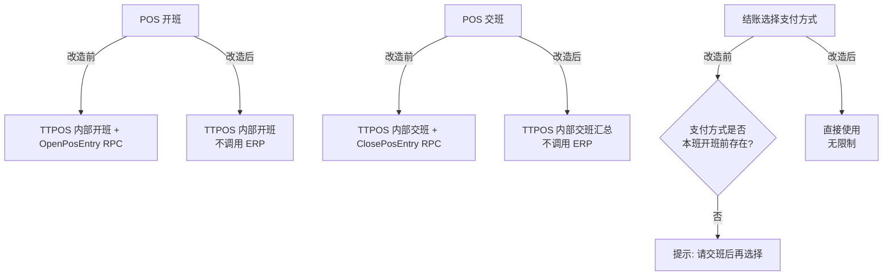

# story-pos-erp-shift-decouple 技术设计

## 概述

| 项目 | 内容 |
|------|------|
| Spec ID | story-pos-erp-shift-decouple |
| 设计人 | weifashi |
| 设计日期 | 2026-03-05 |
| 总 SP | 3 |
| 依赖 | 无（最先开发） |

## 代码复用分析

### 可复用代码

| 文件 | 说明 | 复用方式 |
|------|------|---------|
| `main/app/service/staff_shift.go` | 班次服务（SubmitShift/GetShiftInfo） | 修改，移除 ERP 调用 |
| `main/app/service/rpc/erp/selling.go` | ERP RPC 客户端（OpenPosEntry/ClosePosEntry） | 保留但不再从班次调用 |
| `main/app/model/staff.go` | StaffShiftLog 模型 | 扩展，新增标记字段 |
| `main/app/service/order.go` | 订单服务（结账/接单逻辑） | 修改，移除支付方式校验 |

### 需要新建

| 文件 | 说明 |
|------|------|
| 无需新建文件 | 全部在现有文件上修改 |

## 架构设计



### 改造要点

1. **开班流程**：`SubmitShift()` 中移除 `OpenPosEntry()` RPC 调用
2. **交班流程**：`SubmitCashierReport()` 中移除 `ClosePosEntry()` RPC 调用
3. **支付方式校验**：移除结账/充值/接单时对 `OpeningPaymentMethods` 的校验逻辑
4. **旧数据兼容**：已有 `ErpnextOpenPosEntryName` 的班次保持旧流程收口

## 组件和接口

### Service: StaffShiftSrv

**位置**: `main/app/service/staff_shift.go`

**接口变更**:
```go
// 开班 - 移除 ERP OpenPosEntry 调用
func (s *StaffShiftSrv) StartShift(ctx context.Context, req req.StartShiftReq) error {
    // 1. TTPOS 内部创建班次记录
    // 2. ❌ 不再调用 erpSrv.OpenPosEntry()
    // 3. 记录 OpeningPaymentMethods（仅用于内部对账，不用于限制）
}

// 交班 - 移除 ERP ClosePosEntry 调用
func (s *StaffShiftSrv) SubmitCashierReport(ctx context.Context, req req.SubmitCashierReportReq) error {
    // 1. TTPOS 内部汇总对账
    // 2. ❌ 不再调用 erpSrv.ClosePosEntry()
    // 3. 标记班次完成
}
```

### Service: OrderSrv

**位置**: `main/app/service/order.go`

**接口变更**:
```go
// 结账 - 移除支付方式班次校验
func (s *OrderSrv) FinishPaymentOrder(ctx context.Context, req req.FinishPaymentOrderReq) error {
    // ❌ 移除: 检查支付方式是否在 OpeningPaymentMethods 中
    // ✅ 保留: 检查支付方式是否启用
}
```

## 数据模型

### StaffShiftLog 变更

**位置**: `main/app/model/staff.go`

```go
type StaffShiftLog struct {
    // ... 现有字段 ...

    // ERP 字段保留但不再主动写入（新班次）
    ErpnextOpenPosEntryName  string  // 旧班次有值，新班次为空
    ErpnextClosePosEntryName string  // 旧班次有值，新班次为空

    // 新增字段
    ShiftVersion int `gorm:"column:shift_version;type:tinyint(1);default:2"`
    // 1=旧版(有ERP开关帐), 2=新版(无ERP开关帐)
}
```

### 数据库迁移

```sql
ALTER TABLE ttpos_staff_shift_log
ADD COLUMN shift_version TINYINT(1) NOT NULL DEFAULT 2
COMMENT '班次版本: 1=旧版(有ERP开关帐) 2=新版(无ERP开关帐)';
```

## 风险识别

| 风险 | 影响 | 缓解措施 |
|------|------|---------|
| 旧班次未收口 | 半截班次数据不一致 | ShiftVersion 区分，旧班次仍走旧流程 |
| 支付方式校验移除 | 可能选到未配置的方式 | 保留"是否启用"校验，仅移除班次限制 |

## 测试策略

**目标覆盖率**: main/app/service: 80%+

```bash
cd main && go test -run TestStaffShift ./app/service/...
cd main && go test -run TestFinishPayment ./app/service/...
```
