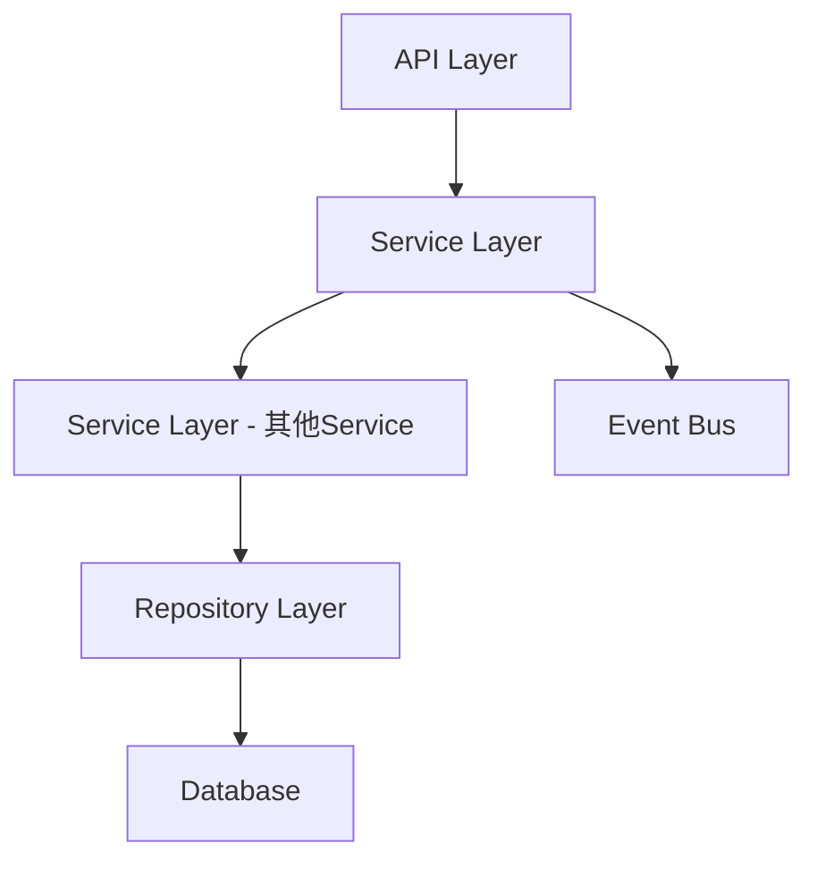

# 收银端满减营销功能 设计文档

> 本文档定义 收银端满减营销功能 的技术设计和实现方案。

## 📋 概述

在收银端和点餐助手的结账页面增加满减营销活动选择功能，支持选择满减/每满减活动，自动计算活动抵扣金额，并在结账时进行验证和核销。该功能参考优惠券功能的实现方式，复用现有的结账流程和金额计算逻辑。

---

## 🎯 规范对齐

### Go Main 规范 (go-main.mdc)

- Service 只依赖其他 Service 接口
- Repository 只持有 db 实例
- URL 使用 snake_case
- data 字段必须是对象
- 不使用 panic，返回 error

### API 设计规范 (api.mdc)

- URL 使用 snake_case
- 响应格式统一
- data 不能为 null 或数组

### 数据库规范 (database.mdc)

- 必需字段完整
- 时间字段使用 int
- 金额字段使用 decimal(20,8)

---

## 🔄 代码复用分析

### 可复用的现有组件

- **OrderPaymentInfo**: `main/app/service/order_pay.go:InstantOrderPaymentInfo()` - 获取结账页面信息，可扩展返回活动列表
- **OrderPaymentCoupon**: `main/app/service/order_pay.go:OrderPaymentCoupon()` - 选择/取消优惠券，可参考实现活动选择逻辑
- **InstantOrderPaymentFinish**: `main/app/service/order_pay.go:InstantOrderPaymentFinish()` - 完成结账，可扩展活动核销逻辑
- **金额计算逻辑**: `main/app/model/sale_order.go` - 订单金额计算，可扩展活动抵扣金额计算

### 集成点

- **结账页面信息接口**: 扩展返回活动列表
- **订单表**: 增加活动相关字段
- **账单表**: 增加活动抵扣金额字段
- **订单操作日志**: 记录活动使用信息

---

## 🏗️ 架构设计

### 分层设计原则

**Go Main 三层架构**:

```
API 层 (Controller/API)
  ↓ 依赖
业务层 (Service)
  ↓ 依赖
数据层 (Repository)
```

### 架构图



### 模块划分

#### Go Main 模块

- **API 层**: `main/app/api/v1/cashier/cashier_desk.go` - 路由处理、参数校验
- **Service 层**: `main/app/service/order_pay.go` - 业务逻辑、事务管理
- **Repository 层**: `main/app/repository/` - 数据访问、数据库操作
- **Model 层**: `main/app/model/sale_order.go`, `main/app/model/sale_bill.go` - 数据模型
- **DTO 层**: `main/app/dto/` - 数据传输对象
  - `req/` - 请求参数
  - `resp/` - 响应数据

---

## 🗄️ 数据库设计

### 数据表设计

#### 修改表 1: ttpos_sale_order

**新增字段**:

```sql
ALTER TABLE `ttpos_sale_order` 
ADD COLUMN `activity_amount` decimal(20,8) NOT NULL DEFAULT 0 COMMENT '满减活动抵扣金额（结账完成后记录）' AFTER `coupon_amount`,
ADD COLUMN `full_reduction_activity_uuid` bigint unsigned NOT NULL DEFAULT 0 COMMENT '订单使用的满减活动UUID' AFTER `activity_amount`,
ADD COLUMN `full_reduction_activity_message` varchar(255) NOT NULL DEFAULT '' COMMENT '满减规则信息（如"满200减20"）' AFTER `full_reduction_activity_uuid`;
```

**字段说明**:
| 字段 | 类型 | 说明 | 约束 |
|------|------|------|------|
| activity_amount | decimal(20,8) | 满减活动抵扣金额 | DEFAULT 0 |
| full_reduction_activity_uuid | bigint unsigned | 满减活动UUID | DEFAULT 0 |
| full_reduction_activity_message | varchar(255) | 满减规则信息 | DEFAULT '' |

#### 修改表 2: ttpos_sale_bill

**新增字段**:

```sql
ALTER TABLE `ttpos_sale_bill` 
ADD COLUMN `activity_amount` decimal(20,8) NOT NULL DEFAULT 0 COMMENT '满减活动抵扣金额（所有sale_order的满减扣减金额总和）' AFTER `gift_amount`;
```

**字段说明**:
| 字段 | 类型 | 说明 | 约束 |
|------|------|------|------|
| activity_amount | decimal(20,8) | 满减活动抵扣金额总和 | DEFAULT 0 |

### 数据库迁移

**迁移脚本**:

```bash
# 创建迁移文件
cd admin
php think migrate:create AddFullReductionActivityToSaleOrderAndSaleBill

# 执行迁移
php think migrate:run
```

**同步 Go Model**:

在 `main/app/model/sale_order.go` 和 `main/app/model/sale_bill.go` 中增加对应字段。

**参考**: `docs/agent/workflows/database-migration.md`

---

## 📊 数据模型

### Go Model

#### SaleOrder 模型扩展

```go
// main/app/model/sale_order.go
type SaleOrder struct {
    // ... 现有字段 ...
    
    // 满减活动相关字段
    ActivityAmount              float64 `gorm:"column:activity_amount;type:decimal(20,8);default:0;comment:满减活动抵扣金额" json:"activity_amount"`
    FullReductionActivityUuid   uint64  `gorm:"column:full_reduction_activity_uuid;type:bigint(20);default:0;comment:满减活动UUID" json:"full_reduction_activity_uuid"`
    FullReductionActivityMessage string `gorm:"column:full_reduction_activity_message;type:varchar(255);default:'';comment:满减规则信息" json:"full_reduction_activity_message"`
}
```

#### SaleBill 模型扩展

```go
// main/app/model/sale_bill.go
type SaleBill struct {
    // ... 现有字段 ...
    
    // 满减活动相关字段
    ActivityAmount float64 `gorm:"column:activity_amount;type:decimal(20,8);default:0;comment:满减活动抵扣金额总和" json:"activity_amount"`
}
```

### DTO 定义

#### Request DTO

```go
// main/app/dto/req/instant.go

// InstantOrderPaymentActivityReq 选择或取消满减活动请求
type InstantOrderPaymentActivityReq struct {
    SaleBillUuid              uint64 `json:"sale_bill_uuid" binding:"required"`  // 销售账单UUID, 必填
    SaleOrderUuid             uint64 `json:"sale_order_uuid" binding:"required"` // 销售订单UUID, 必填
    FullReductionActivityUuid uint64 `json:"full_reduction_activity_uuid"`       // 满减活动UUID, 0表示取消活动
}
```

#### Response DTO

```go
// main/app/dto/resp/instant.go

// FullReductionActivityList 满减活动列表
type FullReductionActivityList struct {
    List []FullReductionActivityItem `json:"list"`
}

// FullReductionActivityItem 满减活动项
type FullReductionActivityItem struct {
    Uuid           uint64             `json:"uuid"`             // 活动UUID
    LocaleName     dto.LocaleResponse `json:"locale_name"`       // 活动多语言名称
    ActivityType   uint               `json:"activity_type"`    // 活动类型：1-阶梯满减，2-循环满减
    StartDate      string             `json:"start_date"`       // 开始日期
    EndDate        string             `json:"end_date"`          // 结束日期
    StartTime      string             `json:"start_time"`        // 开始时间（HH:mm）
    EndTime        string             `json:"end_time"`          // 结束时间（HH:mm）
    IsAllDay       bool               `json:"is_all_day"`      // 是否全天
    Rules          []ActivityRule     `json:"rules"`            // 活动规则列表
    IsAvailable    bool               `json:"is_available"`     // 是否可用
    IsSelected     bool               `json:"is_selected"`      // 是否已选中
    DiscountAmount float64            `json:"discount_amount"`   // 抵扣金额（如果已选中）
}

// ActivityRule 活动规则
type ActivityRule struct {
    Threshold float64 `json:"threshold"` // 满减阈值
    Discount  float64 `json:"discount"`   // 减价金额
}

// InstantOrderPaymentInfoResp 扩展
type InstantOrderPaymentInfoResp struct {
    // ... 现有字段 ...
    ActivityList resp.FullReductionActivityList `json:"activity_list"` // 满减活动列表
}
```

---

## 🔌 API 设计

### RESTful API

#### API 1: 获取结账页面信息（修改）

**请求**:

- **URL**: `/api/v1/cashier/desk/order/payment/info`
- **Method**: `GET`
- **Headers**:
  ```json
  {
    "Authorization": "Bearer {token}",
    "Content-Type": "application/json"
  }
  ```
- **Query**:
  ```
  sale_bill_uuid={uuid}&sale_order_uuid={uuid}
  ```

**响应**:

```json
{
  "code": 1,
  "message": "success",
  "data": {
    "coupon_list": {...},
    "payment_orders": {...},
    "payment_methods": {...},
    "amounts": {...},
    "member_info": {...},
    "points_exchange": {...},
    "activity_list": {
      "list": [
        {
          "uuid": 123456,
          "locale_name": {"zh": "满200减20", "en": "200 off 20"},
          "activity_type": 1,
          "start_date": "2025-11-24",
          "end_date": "2025-12-31",
          "start_time": "09:00",
          "end_time": "22:00",
          "is_all_day": false,
          "rules": [
            {"threshold": 200, "discount": 20}
          ],
          "is_available": true,
          "is_selected": false,
          "discount_amount": 0
        }
      ]
    }
  }
}
```

**代码位置**: `main/app/api/v1/cashier/cashier_desk.go:OrderPaymentInfo()`

#### API 2: 选择或取消满减活动（新增）

**请求**:

- **URL**: `/api/v1/cashier/desk/order/payment/activity`
- **Method**: `POST`
- **Headers**:
  ```json
  {
    "Authorization": "Bearer {token}",
    "Content-Type": "application/json"
  }
  ```
- **Body**:
  ```json
  {
    "sale_order_uuid": 123456,
    "sale_bill_uuid": 123456,
    "full_reduction_activity_uuid": 789012
  }
  ```

**响应**:

```json
{
  "code": 1,
  "message": "success",
  "data": {
    "coupon_list": {...},
    "payment_orders": {...},
    "payment_methods": {...},
    "amounts": {...},
    "member_info": {...},
    "points_exchange": {...},
    "activity_list": {
      "list": [...]
    }
  }
}
```

**错误响应**:

```json
{
  "code": 0,
  "message": "活动信息已经变更，请重新确认",
  "data": {}
}
```

**代码位置**: 
- `main/app/api/v1/cashier/cashier_desk.go:OrderPaymentActivity()` (收银端)
- `main/app/api/v1/assistant/assistant_desk.go:OrderPaymentActivity()` (助手端)

#### API 3: 完成结账（修改）

**请求**:

- **URL**: `/api/v1/cashier/desk/order/payment/finish`
- **Method**: `POST`
- **Body**: 现有请求参数

**业务逻辑扩展**:

- 检查所选活动是否有效
- 如果无效则提示"活动信息已经变更，请重新确认"
- 记录活动抵扣金额到订单表

**代码位置**: `main/app/service/order_pay.go:InstantOrderPaymentFinish()`

---

## 🧩 组件和接口

### Service 层

#### Service 方法扩展

```go
// main/app/service/order_pay.go

// InstantOrderPaymentInfo 扩展
// 增加活动列表查询逻辑
func (s *orderSrv) InstantOrderPaymentInfo(ctx context.Context, saleBill *model.SaleBill, saleBillUuid uint64, saleOrderUuid uint64) (*resp.InstantOrderPaymentInfoResp, error) {
    // ... 现有逻辑 ...
    
    // 获取满减活动列表
    activityList, err := s.getFullReductionActivityList(ctx, saleOrder, saleBill)
    if err != nil {
        return nil, errors.WithMessage(err, "查询满减活动列表失败")
    }
    
    infoResp.ActivityList = activityList
    return infoResp, nil
}

// OrderPaymentActivity 选择或取消满减活动
func (s *orderSrv) OrderPaymentActivity(ctx context.Context, req req.InstantOrderPaymentActivityReq) (*resp.InstantOrderPaymentInfoResp, error) {
    // 1. 加锁（UUID 锁，防止并发冲突）
    // 2. 验证订单状态和支付状态
    // 3. 验证活动有效性（有效期、时段、满减条件）
    // 4. 处理活动选择/取消/替换
    // 5. 处理与优惠券的互斥
    // 6. 处理与积分抵扣的互斥（选择活动后积分不再自动抵扣）
    // 7. 使用事务更新订单和重新计算账单金额
    // 8. 发布活动事件（用于订单操作日志）
    // 9. 返回结账页面信息
}

// getFullReductionActivityList 获取满减活动列表
func (s *orderSrv) getFullReductionActivityList(ctx context.Context, saleOrder *model.SaleOrder, saleBill *model.SaleBill) (resp.FullReductionActivityList, error) {
    // 1. 查询有效日期内的活动（进行中的活动）
    // 2. 判断活动是否在适用时段内（使用商家时区）
    // 3. 判断订单金额是否达到满减条件
    // 4. 判断活动是否已选中
    // 5. 计算活动抵扣金额（如果已选中）
    // 6. 排序：可用时间范围内显示在前
    // 7. 返回活动列表
}

// calculateActivityDiscount 计算活动抵扣金额
func (s *orderSrv) calculateActivityDiscount(ctx context.Context, saleOrder *model.SaleOrder, activityUuid uint64) (float64, string, error) {
    // 1. 查询活动详情和规则
    // 2. 根据活动类型计算抵扣金额：
    //    - 阶梯满减：找到满足条件的最大规则
    //    - 循环满减：计算循环次数
    // 3. 如果扣减金额大于订单金额，则最终扣减金额为订单金额
    // 4. 返回抵扣金额和活动规则信息（如"满200减20"）
}

// isActivityInTimeRange 判断活动是否在适用时段内
func (s *orderSrv) isActivityInTimeRange(ctx context.Context, activity *model.FullReductionActivity, now int64) bool {
    // 使用商家时区判断活动是否在适用时段内
}

// checkActivityThreshold 判断订单金额是否达到满减条件
func (s *orderSrv) checkActivityThreshold(activity *model.FullReductionActivity, orderAmount float64) bool {
    // 判断订单金额是否满足活动的最小阈值
}
```

### Repository 层

#### Repository 方法

```go
// main/app/repository/full_reduction_activity_repo.go

// IFullReductionActivityRepo 满减活动仓库接口
type IFullReductionActivityRepo interface {
    GetList(opts ...DBOption) ([]*model.FullReductionActivity, int64, error)
    GetByUuid(uuid uint64) (*model.FullReductionActivity, error)
    WhereStatus(status int, now int64) DBOption
    // ... 其他方法
}

// main/app/repository/sale_order.go

// ISaleOrderRepo 销售订单仓库接口扩展
type ISaleOrderRepo interface {
    // ... 现有方法 ...
    UpdateSaleOrderActivity(saleOrderUuid uint64, fullReductionActivityUuid uint64, fullReductionActivityMessage string, activityAmount float64, autoPointsExchange uint) error // 更新销售订单的满减活动信息
}
```

**实现说明**: 
- 活动数据通过 `FullReductionActivityRepo` 查询，该 Repository 已存在
- 订单活动信息更新通过 `SaleOrderRepo.UpdateSaleOrderActivity` 方法实现

### API 层

```go
// main/app/api/v1/cashier/cashier_desk.go

// OrderPaymentActivity 选择或取消满减活动
// @Summary 选择或取消满减活动
// @Description 选择或取消满减活动
// @Tags 收银端.桌台.结账
// @Accept json
// @Produce json
// @Security JwtToken
// @param data body req.InstantOrderPaymentActivityReq true "选择或取消满减活动参数"
// @Success 200 {object} dto.Response{data=resp.InstantOrderPaymentInfoResp} "结账页面信息"
// @Router /cashier/desk/order/payment/activity [post]
func (h *DeskHandler) OrderPaymentActivity(c *gin.Context) {
    ctx := helper.GetContext(c)
    ctx.Log().Debug("收到桌台页面选择或取消满减活动接口请求")

    var req dto_req.InstantOrderPaymentActivityReq
    if err := c.ShouldBindJSON(&req); err != nil {
        helper.HandleValidationError(c, err, req, nil)
        return
    }
    ctx.Log().Info("选择或取消满减活动", zap.Any("params", req))
    
    // 选择或取消满减活动
    res, err := h.orderSrv.OrderPaymentActivity(ctx, &req)
    if err != nil {
        helper.ErrorWithDetail(c, constant.CodeFail, errors.WithMessage(err))
        return
    }
    
    // 返回结果
    helper.Success(c, res)
}
```
---

## 🚨 错误处理

### 错误场景

#### 场景 1: 活动信息变更

- **处理方式**: 在结账完成时重新验证活动有效性，如果变更则提示"活动信息已经变更，请重新确认"
- **用户影响**: 用户需要重新选择活动
- **代码示例**:
  ```go
  if !activity.IsValid() {
      return nil, errors.New("活动信息已经变更，请重新确认")
  }
  ```

#### 场景 2: 活动不在适用时段内

- **处理方式**: 活动置灰显示，不可选择
- **用户影响**: 用户无法选择该活动
- **代码示例**:
  ```go
  if !activity.IsInTimeRange(now) {
      activity.IsAvailable = false
  }
  ```

#### 场景 3: 订单金额未达到满减条件

- **处理方式**: 活动置灰显示，不可选择
- **用户影响**: 用户无法选择该活动
- **代码示例**:
  ```go
  if orderAmount < activity.MinThreshold() {
      activity.IsAvailable = false
  }
  ```

---

## 🔒 安全设计

### 身份验证

- **JWT Token**: 所有 API 需要 Token 验证
- **Token 刷新**: 自动刷新机制

### 权限控制

- **API 权限**: 每个 API 检查用户权限
- **活动权限**: 验证活动是否属于当前商户

### 数据安全

- **SQL 注入防护**: 使用参数化查询
- **XSS 防护**: 前端输入校验

---

## 🧪 测试策略

### 单元测试

**目标覆盖率**:

- main/app/service: 70%+
- main/app/repository: 80%+
- **Payment/Order 相关: 100%**（高风险）

**测试内容**:

- Service 业务逻辑
- Repository 数据访问
- DTO 数据转换
- 活动抵扣金额计算

### API 测试

**测试内容**:

- API 接口调用
- 参数验证
- 响应格式
- 错误处理

### 集成测试

**测试流程**:

- 端到端业务流程
- 数据库事务
- 缓存一致性
- 活动与优惠券互斥
- 活动与积分抵扣互斥

---

## 📈 性能优化

### 优化策略

1. **数据库优化**:
   - 添加索引（`full_reduction_activity_uuid`）
   - 优化 SQL 查询
   - 使用连接池

2. **缓存优化**:
   - Redis 缓存活动列表
   - 缓存预热
   - 缓存穿透防护

3. **并发控制**:
   - UUID 锁防止并发冲突
   - 事务隔离级别

4. **接口优化**:
   - 异步处理非关键验证

### 性能指标

- 本地响应时间: < 200ms
- 数据库查询: < 50ms
- 缓存命中率: > 80%
- 并发能力: 1000+ QPS

---

## 📚 实现清单

### Phase 1: 数据库和模型 ✅

- [x] 创建数据库迁移文件（sale_order 和 sale_bill 表）
  - `admin/database/migrations/20251124165827_add_full_reduction_activity_to_sale_order_table.php`
  - `admin/database/migrations/20251124165828_add_full_reduction_activity_to_sale_bill_table.php`
- [ ] 执行数据库迁移（需手动执行：`cd admin && php think migrate:run`）
- [x] 更新 Go Model（SaleOrder, SaleBill）
  - `main/app/model/sale_order.go` - 添加 ActivityAmount, FullReductionActivityUuid, FullReductionActivityMessage
  - `main/app/model/sale_bill.go` - 添加 ActivityAmount
  - `main/app/model/sale_bill_ext_calc.go` - 添加 `calcActivityAmount` 方法
- [x] 创建 DTO 定义（Request 和 Response）
  - `main/app/dto/req/instant.go` - InstantOrderPaymentActivityReq
  - `main/app/dto/resp/instant.go` - FullReductionActivityList, FullReductionActivityItem, ActivityRule

### Phase 2: 核心实现 ✅

- [x] 实现活动列表查询逻辑（`getFullReductionActivityList`）
  - 查询有效日期内的活动
  - 判断活动是否在适用时段内（使用商家时区）
  - 判断订单金额是否达到满减条件
  - 判断活动是否已选中
  - 计算活动抵扣金额（如果已选中）
  - 排序：可用时间范围内显示在前
- [x] 实现活动选择/取消逻辑（`OrderPaymentActivity`）
  - UUID 锁防止并发冲突
  - 验证活动有效性（有效期、时段、满减条件）
  - 处理活动选择/取消/替换
  - 处理与优惠券的互斥
  - 处理与积分抵扣的互斥（选择活动后积分不再自动抵扣）
  - 使用事务更新订单和重新计算账单金额
  - 发布活动事件（用于订单操作日志）
- [x] 实现活动抵扣金额计算（`calculateActivityDiscount`）
  - 支持阶梯满减和循环满减两种类型
  - 确保扣减金额不超过订单金额
- [x] 扩展结账完成逻辑（活动核销，在 `InstantOrderPaymentFinish` 中）
  - 验证活动有效性
  - 重新计算活动抵扣金额
  - 记录活动信息到订单表
- [x] 实现活动与优惠券互斥
- [x] 实现活动与积分抵扣互斥（选择活动后积分不再自动抵扣）
- [x] 扩展账单金额计算逻辑（`calcActivityAmount`）
  - 在 `SaleBill.CalcSaleBill()` 中汇总所有订单的活动抵扣金额
- [x] 实现反结账逻辑（`ClearSettleInfo` 中清空活动字段）
  - 调用 `SetActivityCancel()` 清空活动相关字段
- [x] 实现拆单和免单场景处理
  - 拆单：活动字段在 sale_order 级别，每个拆单可以独立使用活动
  - 免单：会员变更时清空活动（`OrderMemberCancel` 和 `OrderUseMember` 中调用 `SetActivityCancel`）
- [x] 创建 API 接口（收银端和助手端）
  - `main/app/api/v1/cashier/cashier_desk.go:OrderPaymentActivity()`
  - `main/app/api/v1/assistant/assistant_desk.go:OrderPaymentActivity()`
- [x] 注册 API 路由
  - 收银端：`/cashier/desk/order/payment/activity`
  - 助手端：`/assistant/desk/order/payment/activity`
- [x] 更新订单操作日志（事件处理器）
  - `main/app/event/order_activity_sale_order_event_handler.go` - 活动事件处理器
  - `main/pkg/eventbus/event/order_activity_sale_order_event.go` - 事件定义
  - `main/app/constant/order.go` - 添加 `OrderActivity` 常量

### Phase 3: 集成和优化 🚧

- [ ] 集成缓存策略（Redis 缓存活动列表）
- [x] 实现并发控制（UUID 锁）
  - 在 `OrderPaymentActivity` 中使用 `s.lock.LockUuid(req.SaleBillUuid)`
- [ ] 性能优化（数据库查询优化、索引）
- [x] 更新订单操作日志（已完成）

### Phase 4: 测试 ⏳

- [ ] 单元测试（Service 层）
- [ ] API 测试（集成测试）
- [ ] 集成测试（端到端测试）
- [ ] 性能测试

**详细任务**: 参见 `tasks.md`

**当前进度**: Phase 1-2 核心功能已完成 ✅，Phase 3-4 待完成

---

## 📝 实现文件清单

### 数据库迁移
- `admin/database/migrations/20251124165827_add_full_reduction_activity_to_sale_order_table.php`
- `admin/database/migrations/20251124165828_add_full_reduction_activity_to_sale_bill_table.php`

### Go Model
- `main/app/model/sale_order.go` - 添加活动相关字段和方法（`SetActivityCancel`）
- `main/app/model/sale_bill.go` - 添加 `ActivityAmount` 字段
- `main/app/model/sale_bill_ext_calc.go` - 添加 `calcActivityAmount()` 方法

### DTO
- `main/app/dto/req/instant.go` - `InstantOrderPaymentActivityReq`
- `main/app/dto/resp/instant.go` - `FullReductionActivityList`, `FullReductionActivityItem`, `ActivityRule`

### Service
- `main/app/service/order_pay.go` - 活动相关业务逻辑
  - `getFullReductionActivityList()` - 获取活动列表
  - `calculateActivityDiscount()` - 计算活动抵扣金额
  - `OrderPaymentActivity()` - 选择或取消活动
  - `isActivityInTimeRange()` - 判断活动是否在适用时段内（使用商家时区）
  - `checkActivityThreshold()` - 判断订单金额是否达到满减条件
- `main/app/service/order_cashier_member.go` - 会员变更时清空活动（`OrderMemberCancel`, `OrderUseMember`）

### Repository
- `main/app/repository/sale_order.go` - `UpdateSaleOrderActivity()` 方法

### API
- `main/app/api/v1/cashier/cashier_desk.go` - `OrderPaymentActivity()` 方法
- `main/app/api/v1/assistant/assistant_desk.go` - `OrderPaymentActivity()` 方法

### 路由注册
- `main/app/api/v1/cashier/cashier_desk.go:RegisterDeskHandlers()` - 注册收银端路由 `/cashier/desk/order/payment/activity`
- `main/app/api/v1/assistant/assistant_desk.go:RegisterDeskHandlers()` - 注册助手端路由 `/assistant/desk/order/payment/activity`

### 事件处理
- `main/pkg/eventbus/event/order_activity_sale_order_event.go` - 活动事件发布和订阅
- `main/app/event/order_activity_sale_order_event_handler.go` - 活动事件处理器
- `main/app/event/a_init.go` - 注册事件处理器
- `main/pkg/eventbus/event/init_event_bus.go` - 添加事件名称常量 `EventActivitySaleOrder`

### 常量
- `main/app/constant/order.go` - `OrderActivity = "ACTIVITY"`

---

## 🔄 事件处理

### 活动事件

**事件定义**: `main/pkg/eventbus/event/order_activity_sale_order_event.go`

```go
// ActivitySaleOrderPayload 满减活动事件荷载
type ActivitySaleOrderPayload struct {
    BasePayload
    FullReductionActivityUuid   uint64  `json:"full_reduction_activity_uuid"`   // 满减活动UUID
    FullReductionActivityMessage string  `json:"full_reduction_activity_message"` // 满减规则信息（如"满200减20"）
    ActivityAmount               float64 `json:"activity_amount"`                // 满减活动抵扣金额
    OldPrice                     float64 `json:"old_price"`                       // 使用活动前的订单金额
    NewPrice                     float64 `json:"new_price"`                       // 使用活动后的订单金额
}
```

**事件处理器**: `main/app/event/order_activity_sale_order_event_handler.go`

- 在活动选择/取消时发布事件
- 事件处理器记录订单操作日志
- 操作类型：`OrderActivity`（满减活动）

**事件发布时机**:
- 在 `OrderPaymentActivity` 方法中，事务提交成功后异步发布事件
- 使用 `utils.Go()` 进行异步处理

## 🔧 关键实现细节

### 时区处理

活动时段判断使用商家时区：
- 通过 `ctx.GetCompanySetting().GetTimezone()` 获取商家时区
- 使用 `utils.Timezone(timezone)` 创建时区工具
- 使用 `timeUtil.FormatUnixTime(now, "15:04")` 格式化时间为 HH:mm 格式

### 金额计算

- 使用 `decimal` 包进行精确的金额计算
- 在 `SaleBill.calcActivityAmount()` 中汇总所有订单的活动抵扣金额
- 确保活动抵扣金额不超过订单金额

### 互斥规则

1. **活动与优惠券互斥**：
   - 如果已使用优惠券，则不能选择活动
   - 如果已选择活动，则不能使用优惠券

2. **活动与积分抵扣互斥**：
   - 选择活动后，将 `AutoPointsExchange` 设置为 0（手动抵扣）
   - 积分抵扣后最终应收为 0 时，不可选择活动

### 拆单和免单场景

1. **拆单场景**：
   - 活动字段存储在 `sale_order` 级别
   - 每个拆单可以独立选择和使用满减活动
   - 无需特殊处理，天然支持

2. **免单场景**：
   - 会员变更时自动清空活动选择
   - 在 `OrderMemberCancel` 和 `OrderUseMember` 中调用 `SetActivityCancel()`

### 反结账处理

- 在 `SaleOrder.ClearSettleInfo()` 中调用 `SetActivityCancel()`
- 清空 `FullReductionActivityUuid`、`FullReductionActivityMessage`、`ActivityAmount` 字段

---

**版本**: v1.1.0  
**创建日期**: 2025-11-24  
**最后更新**: 2025-11-24  
**作者**: 开发组  
**审核者**: 待定

