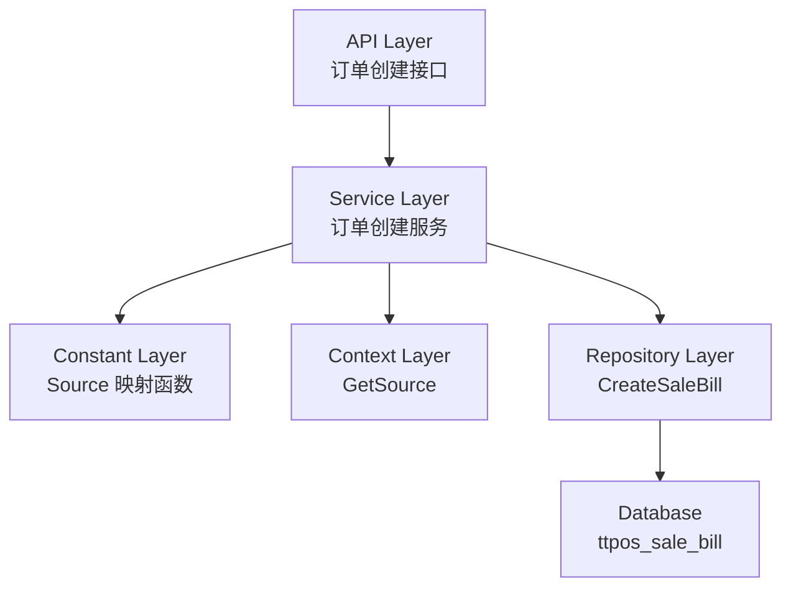

# 订单来源追踪 设计文档

> 本文档定义 订单来源追踪 的技术设计和实现方案。

## 📋 概述

在创建订单时，系统需要根据请求上下文（JWT token 中的 source 信息）自动设置 `SaleBill` 表的 `source` 字段值，以准确记录订单来自哪个客户端。该功能主要涉及常量定义和订单创建逻辑的修改，不涉及数据库结构变更（字段已存在）。

**技术定位**：纯后端逻辑修改，无前端变更，无新增 API 接口。

---

## 🎯 规范对齐

### Go Main 规范 (go-main.mdc)

- ✅ Service 只依赖其他 Service 接口
- ✅ Repository 只持有 db 实例
- ✅ 不使用 panic，返回 error
- ✅ 使用 errors.WithMessage 包装错误
- ✅ 遵循分层架构：Controller → Service → Repository

### API 设计规范 (api.mdc)

- ✅ 本功能不涉及新增 API 接口
- ✅ 仅修改现有订单创建逻辑

### 数据库规范 (database.mdc)

- ✅ `source` 字段已存在于 `ttpos_sale_bill` 表中
- ✅ 字段类型：`int(10)`，默认值：0
- ✅ 字段注释：`订单来源：0-默认值、1-收银机、2-点餐助手、3-平板、4-H5、5-会员端`
- ✅ 无需新增数据库迁移

---

## 🔄 代码复用分析

### 可复用的现有组件

- **JWT Source 常量**: `main/app/constant/jwt/jwt.go` - 已定义 Source 常量（SourceCashier, SourceAssistant, SourceTablet, SourceH5, SourceMember）
- **Context 接口**: `main/pkg/context/context.go` - 提供 `GetSource()` 方法获取请求来源
- **SaleBill 模型**: `main/app/model/sale_bill.go` - 已包含 `Source` 字段定义
- **订单创建服务**: `main/app/service/order.go`, `main/app/service/order_base.go` - 现有订单创建逻辑

### 集成点

- **订单创建流程**: 在现有订单创建方法中集成 source 字段设置逻辑
- **常量映射**: 新增 Source 映射函数，将 JWT Source 字符串映射到 uint 类型

---

## 🏗️ 架构设计

### 分层设计原则

**Go Main 三层架构**:

```
API 层 (Controller/API)
  ↓ 依赖
业务层 (Service)
  ↓ 依赖
数据层 (Repository)
```

**依赖规则**:

- ✅ 上层可依赖下层
- ❌ 禁止下层依赖上层
- ❌ 禁止跨层调用
- ❌ Service 不能依赖 Repository
- ✅ Service 可以依赖其他 Service 接口

### 架构图



### 模块划分

#### Go Main 模块

- **Constant 层**: `main/app/constant/` - 定义 Source 映射常量和函数
- **Service 层**: `main/app/service/` - 修改订单创建逻辑，设置 source 字段
- **Repository 层**: `main/app/repository/` - 无需修改（CreateSaleBill 已存在）
- **Model 层**: `main/app/model/` - 无需修改（Source 字段已存在）

---

## 🗄️ 数据库设计

### 数据表设计

#### 表: ttpos_sale_bill

**字段说明**:
| 字段 | 类型 | 说明 | 约束 |
|------|------|------|------|
| source | int(10) | 订单来源：0-默认值、1-收银机、2-点餐助手、3-平板、4-H5、5-会员端 | DEFAULT 0 |

**索引设计**:
- 普通索引: `KEY idx_source (source)` - 已存在（用于按来源查询）

**说明**: `source` 字段已存在于表中，无需新增数据库迁移。

---

## 📊 数据模型

### Go Model

```go
// main/app/model/sale_bill.go
// Source 字段已存在
Source uint `gorm:"column:source;type:int(10);default:0;comment:订单来源：0-默认值、1-收银机、2-点餐助手、3-平板、4-H5、5-会员端" json:"source"`
```

### 常量定义（新增）

```go
// main/app/constant/sale_bill_source.go
package constant

import "ttpos-server-go/app/constant/jwt"

// MapJwtSourceToSaleBillSource 将 JWT Source 映射到 SaleBill.source 字段值
// 参数: jwtSource - JWT token 中的 source 值（如 "cashier", "assistant" 等）
// 返回: SaleBill.source 字段值（0-5）
// 注意: SaleBillSource 常量已在 device.go 中定义
func MapJwtSourceToSaleBillSource(jwtSource string) uint {
	switch jwtSource {
	case jwt.SourceCashier:
		return SaleBillSourceCashier
	case jwt.SourceAssistant:
		return SaleBillSourceAssistant
	case jwt.SourceTablet:
		return SaleBillSourceTablet
	case jwt.SourceH5:
		return SaleBillSourceH5
	case jwt.SourceMember:
		return SaleBillSourceMember
	default:
		return SaleBillSourceDefault
	}
}
```

---

## 🔌 API 设计

**说明**: 本功能不涉及新增 API 接口，仅修改现有订单创建逻辑。

### 现有 API（无需修改）

- `POST /api/v1/cashier/instant_order/create` - 创建即时订单
- `POST /api/v1/cashier/desk_order/create` - 创建桌台订单
- `POST /api/v1/member/order/create` - 创建会员端订单

**修改点**: 在创建订单时，自动设置 `source` 字段，无需修改 API 接口定义。

---

## 🧩 组件和接口

### Constant 层（新增）

#### Source 映射函数

```go
// main/app/constant/sale_bill_source.go
package constant

import "ttpos-server-go/app/constant/jwt"

// MapJwtSourceToSaleBillSource 将 JWT Source 映射到 SaleBill.source 字段值
// 参数: jwtSource - JWT token 中的 source 值（如 "cashier", "assistant" 等）
// 返回: SaleBill.source 字段值（0-5）
// 注意: SaleBillSource 常量已在 device.go 中定义
func MapJwtSourceToSaleBillSource(jwtSource string) uint {
	switch jwtSource {
	case jwt.SourceCashier:
		return SaleBillSourceCashier
	case jwt.SourceAssistant:
		return SaleBillSourceAssistant
	case jwt.SourceTablet:
		return SaleBillSourceTablet
	case jwt.SourceH5:
		return SaleBillSourceH5
	case jwt.SourceMember:
		return SaleBillSourceMember
	default:
		return SaleBillSourceDefault
	}
}
```

### Service 层（修改）

#### 修改点 1: CreateInstantOrder

```go
// main/app/service/order_base.go
func (s *orderSrv) CreateInstantOrder(ctx context.Context, request req.CreateInstantOrderReq) (resp.CreateInstantOrderResp, error) {
	// ... 现有代码 ...
	
	// 创建销售账单
	saleBill, err := repository.NewOrderRepo(tx).CreateSaleBill(model.SaleBill{
		OrderNo:      orderNo,
		SerialNo:     serialNo,
		BillType:     constant.OrderSourceMapToBillType[constant.OrderSourceInstant],
		DiningMethod: constant.SaleBillDiningMethodDineIn,
		DeviceUuid:   ctx.GetDeviceUuid(),
		Source:       constant.MapJwtSourceToSaleBillSource(ctx.GetSource()), // 新增：设置 source
	})
	// ... 现有代码 ...
}
```

#### 修改点 2: CreateDeskOrder

```go
// main/app/service/order_base.go
func (s *orderSrv) CreateDeskOrder(ctx context.Context, req req.CreateDeskOrderReq) (*resp.CreateDeskOrderResp, error) {
	// ... 现有代码 ...
	
	// 创建销售账单
	if _, errCreateSaleBill := repository.NewOrderRepo(tx).CreateSaleBill(*saleBill); errCreateSaleBill != nil {
		return errCreateSaleBill
	}
	
	// 修改：在创建 SaleBill 之前设置 source
	saleBill.Source = constant.MapJwtSourceToSaleBillSource(ctx.GetSource())
	
	// ... 现有代码 ...
}
```

#### 修改点 3: createMemberOrder

```go
// main/app/service/order.go
func (s *orderSrv) createMemberOrder(ctx context.Context, request req.CreateMemberOrderReq) (*resp.CreateMemberOrderResp, error) {
	// ... 现有代码 ...
	
	// 创建销售账单
	saleBill, err := repository.NewOrderRepo(db).CreateSaleBill(model.SaleBill{
		OrderNo:             orderNo,
		SerialNo:            "",
		BillType:            constant.OrderSourceMapToBillType[constant.OrderSourceMember],
		DiningMethod:        constant.SaleBillDiningMethodTakeout,
		DeviceUuid:          ctx.GetDeviceUuid(),
		MemberSaleOrderUuid: memberSaleOrderUuid,
		Source:               constant.MapJwtSourceToSaleBillSource(ctx.GetSource()), // 新增：设置 source
	})
	// ... 现有代码 ...
}
```

#### 修改点 4: 订单导入（可选）

```go
// main/app/service/order_import_service.go
// 对于导入订单，如果没有来源信息，使用默认值 0
saleBill.Source = constant.SaleBillSourceDefault
```

### Repository 层（无需修改）

- `CreateSaleBill` 方法已存在，无需修改
- 只需在调用时传入已设置 `Source` 字段的 `SaleBill` 对象即可

---

## ⚡ 缓存设计

**说明**: 本功能不涉及缓存变更。

---

## 🚨 错误处理

### 错误场景

#### 场景 1: JWT Source 值无法识别

- **处理方式**: 使用默认值 0，记录警告日志
- **用户影响**: 订单正常创建，source 字段为 0
- **代码示例**:
  ```go
  source := constant.MapJwtSourceToSaleBillSource(ctx.GetSource())
  if source == constant.SaleBillSourceDefault && ctx.GetSource() != "" {
      ctx.Log().Warn("无法识别的订单来源", zap.String("source", ctx.GetSource()))
  }
  ```

#### 场景 2: Context 中无 Source 信息

- **处理方式**: 使用默认值 0
- **用户影响**: 订单正常创建，source 字段为 0
- **代码示例**:
  ```go
  source := constant.MapJwtSourceToSaleBillSource(ctx.GetSource())
  // 如果 ctx.GetSource() 返回空字符串，MapJwtSourceToSaleBillSource 会返回默认值 0
  ```

---

## 🔒 安全设计

### 身份验证

- ✅ 所有订单创建 API 需要 JWT Token 验证（已存在）
- ✅ Token 中包含 source 信息（已存在）

### 数据安全

- ✅ 使用参数化查询（GORM 自动处理）
- ✅ source 字段值由系统自动设置，用户无法篡改

---

## 🧪 测试策略

### 单元测试

**目标覆盖率**:

- `main/app/constant`: 100%（Source 映射函数）
- `main/app/service`: 70%+（订单创建方法）
- **Payment/Order 相关: 100%**（高风险）

**测试内容**:

- Source 映射函数：测试所有 JWT Source 值映射到正确的 source 字段值
- 订单创建方法：测试不同来源创建订单时 source 字段设置正确

**示例**:

```go
// main/app/constant/sale_bill_source_test.go
func TestMapJwtSourceToSaleBillSource(t *testing.T) {
	tests := []struct {
		name      string
		jwtSource string
		want      uint
	}{
		{"cashier", jwt.SourceCashier, constant.SaleBillSourceCashier},
		{"assistant", jwt.SourceAssistant, constant.SaleBillSourceAssistant},
		{"tablet", jwt.SourceTablet, constant.SaleBillSourceTablet},
		{"h5", jwt.SourceH5, constant.SaleBillSourceH5},
		{"member", jwt.SourceMember, constant.SaleBillSourceMember},
		{"unknown", "unknown", constant.SaleBillSourceDefault},
		{"empty", "", constant.SaleBillSourceDefault},
	}
	
	for _, tt := range tests {
		t.Run(tt.name, func(t *testing.T) {
			if got := constant.MapJwtSourceToSaleBillSource(tt.jwtSource); got != tt.want {
				t.Errorf("MapJwtSourceToSaleBillSource() = %v, want %v", got, tt.want)
			}
		})
	}
}
```

### API 测试

**测试内容**:

- 通过不同客户端创建订单，验证数据库中的 source 字段值
- 测试未知来源时使用默认值 0

### 集成测试

**测试流程**:

- 端到端测试：通过收银机创建订单 → 验证 source = 1
- 端到端测试：通过点餐助手创建订单 → 验证 source = 2
- 端到端测试：通过平板创建订单 → 验证 source = 3
- 端到端测试：通过 H5 创建订单 → 验证 source = 4
- 端到端测试：通过会员端创建订单 → 验证 source = 5

---

## 📈 性能优化

### 优化策略

1. **性能影响**: 本功能仅是在创建订单时设置字段值，不增加额外的数据库查询，对性能影响可忽略
2. **代码优化**: Source 映射函数使用 switch 语句，性能最优

### 性能指标

- 本地响应时间: < 200ms（不影响现有订单创建性能）
- Source 映射函数: < 1μs（内存操作）

---

## 🌐 浏览器兼容性

**说明**: 本功能不涉及前端变更，无需考虑浏览器兼容性。

---

## 📚 实现清单

### Phase 1: 常量定义

- [x] 创建 Source 映射常量文件
- [x] 实现 MapJwtSourceToSaleBillSource 函数
- [x] 编写单元测试

### Phase 2: 修改订单创建逻辑

- [x] 修改 CreateInstantOrder 方法
- [x] 修改 CreateDeskOrder 方法
- [x] 修改 createMemberOrder 方法
- [x] 检查订单导入逻辑（已设置默认值 0）

### Phase 3: 测试和验证

- [x] 单元测试（Source 映射函数）
- [ ] 单元测试（订单创建方法）
- [ ] API 集成测试
- [ ] 端到端测试

**详细任务**: 参见 `tasks.md`

---

## Graphiti & 活动日志

- Related Episode: `[待补充]`
- 模板：`docs/agent/templates/graphiti-episode.md`
- 活动日志：`docs/team/activities/{YYYY-MM}/{YYYY-MM-DD}.md`
- 在技术方案评审、关键架构决策或踩坑总结后，立即补充 Episode 并在设计文档尾部互链。

---

**版本**: v1.0.0  
**创建日期**: 2025-11-27  
**作者**: xiezhihuan  
**审核者**: {审核者}

