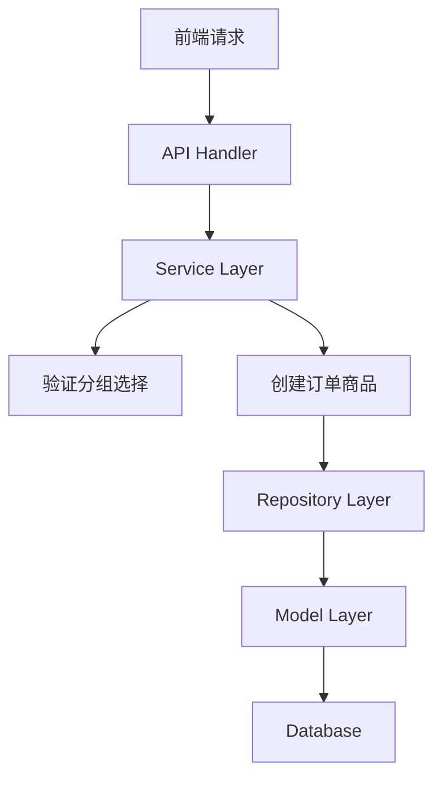

# 收银端套餐商品选择功能 设计文档

> 本文档定义收银端套餐商品选择功能的技术设计和实现方案。

## 📋 概述

在收银端、点餐助手、平板、会员端、自助点餐机等终端实现套餐商品选择功能，支持固定分组和可选分组的商品选择，显示选择状态和商品加价信息，并在加购时验证分组选择是否符合套餐设置。该功能主要涉及接口返回字段扩展、数据库表结构扩展、加购接口参数扩展和业务逻辑验证。

---

## 🎯 规范对齐

### Go Main 规范 (go-main.mdc)

- Service 只依赖其他 Service 接口
- Repository 只持有 db 实例
- URL 使用 snake_case
- data 字段必须是对象
- 不使用 panic，返回 error

### API 设计规范 (api.mdc)

- URL 使用 snake_case
- 响应格式统一
- data 不能为 null 或数组

### 数据库规范 (database.mdc)

- 必需字段完整
- 时间字段使用 int
- 金额字段使用 decimal(22,4)
- 迁移前检查字段是否存在

---

## 🔄 代码复用分析

### 可复用的现有组件

- **套餐加购接口**: `main/app/api/v1/cashier/cashier_desk.go:OrderCartProductPackageAdd()` - 套餐加购，可扩展加价参数和验证逻辑
- **商品列表接口**: `main/app/service/product.go:ProductSearch()` - 商品列表查询，已返回分组类型和加价信息
- **套餐 Service**: `main/app/service/order_product.go:OrderCartProductPackageAdd()` - 套餐加购业务逻辑
- **订单商品创建**: `main/app/service/order.go:newSaleOrderProduct()` - 创建订单商品，可扩展加价字段
- **套餐 Model**: `main/app/model/product_package_group.go` - 已包含 `group_type`、`optional_count` 字段

### 集成点

- **商品列表接口**: 已返回 `group_type`、`optional_count`、`add_price` 字段（商家管理端已实现）
- **加购请求参数**: 扩展 `ProductRequest` 结构体，增加 `add_price` 字段
- **订单商品表**: 增加 `add_price` 字段
- **加购验证**: 增加分组选择验证逻辑

---

## 🏗️ 架构设计

### 分层设计原则

**Go Main 三层架构**:

```
API 层 (Controller/API)
  ↓ 依赖
业务层 (Service)
  ↓ 依赖
数据层 (Repository/Model)
```

### 架构图



### 模块划分

#### Go Main 模块

- **API 层**: `main/app/api/v1/{terminal}/` - 路由处理、参数校验
- **Service 层**: `main/app/service/order_product.go` - 套餐加购业务逻辑、分组验证
- **Service 层**: `main/app/service/order.go` - 订单商品创建、价格计算
- **Repository 层**: `main/app/repository/` - 数据访问、数据库操作
- **Model 层**: `main/app/model/sale_order_product.go` - 数据模型扩展
- **DTO 层**: `main/app/dto/req/shop_cart.go` - 请求参数扩展
- **DTO 层**: `main/app/dto/resp/` - 响应数据（已包含分组信息）

---

## 🗄️ 数据库设计

### 数据表设计

#### 修改表: ttpos_sale_order_product

**新增字段**:

```sql
ALTER TABLE `ttpos_sale_order_product` 
ADD COLUMN `add_price` decimal(22,4) NOT NULL DEFAULT 0.00 
COMMENT '加价金额。子商品记录单商品加价金额；套餐主商品记录所有子商品加价总和' 
AFTER `sauce_price`;
```

**字段说明**:
| 字段 | 类型 | 说明 | 约束 |
|------|------|------|------|
| add_price | DECIMAL(22,4) | 加价金额 | DEFAULT 0.00 |

**字段用途**:
- **子商品**: 记录该子商品的加价金额（单商品加价）
- **套餐主商品**: 记录所有子商品的加价总和 = Σ(子商品加价 × 子商品数量)

**索引设计**:
- 无需新增索引（现有索引已足够）

### 数据库迁移

**迁移脚本**:

```bash
# 创建迁移文件
cd admin
php think migrate:create AddAddPriceToSaleOrderProduct

# 执行迁移
php think migrate:run
```

**迁移文件内容**:

```php
<?php
// admin/database/migrations/{YYYYMMDDHHMMSS}_add_add_price_to_sale_order_product_table.php

use think\migration\Migrator;
use think\migration\db\Column;

class AddAddPriceToSaleOrderProduct extends Migrator
{
    public function up()
    {
        $table = $this->table('sale_order_product');
        if (!$table->hasColumn('add_price')) {
            $table->addColumn('add_price', 'decimal', [
                'precision' => 22,
                'scale' => 4,
                'default' => 0.00,
                'comment' => '加价金额。子商品记录单商品加价金额；套餐主商品记录所有子商品加价总和',
                'after' => 'sauce_price'
            ])->update();
        }
        
        // 更新现有数据：设置默认值
        $this->execute("UPDATE `ttpos_sale_order_product` SET `add_price` = 0.00 WHERE `add_price` IS NULL");
    }

    public function down()
    {
        $table = $this->table('sale_order_product');
        if ($table->hasColumn('add_price')) {
            $table->removeColumn('add_price')->update();
        }
    }
}
```

**同步 Go Model**:

在 `main/app/model/sale_order_product.go` 中增加对应字段。

---

## 📊 数据模型

### Go Model 扩展

#### SaleOrderProduct

```go
// main/app/model/sale_order_product.go

type SaleOrderProduct struct {
	// ... 现有字段 ...
	SaucePrice float64 `gorm:"column:sauce_price;type:decimal(12,2);not null;default:0.00;comment:'小料价（单商品）'" json:"sauce_price"`
	AddPrice   float64 `gorm:"column:add_price;type:decimal(22,4);not null;default:0.00;comment:'加价金额。子商品记录单商品加价金额；套餐主商品记录所有子商品加价总和'" json:"add_price"`
	// ... 其他字段 ...
}
```

### DTO 扩展

#### ProductRequest

```go
// main/app/dto/req/shop_cart.go

type ProductRequest struct {
	ProductPackageGroupUuid uint64   `json:"product_package_group_uuid"` // 套餐分组UUID
	EditProductReq
	Num      float64 `json:"num"`       // 商品数量
	UnitNum  float64 `json:"unit_num"`  // 一个套餐的单个子商品的数量
	AddPrice float64 `json:"add_price"` // ⭐ 新增：加价金额
}
```

#### ProductParams

```go
// main/app/dto/req/shop_cart.go

type ProductParams struct {
	// ... 现有字段 ...
	ProductPackageGroupUuid uint64 `json:"product_package_group_uuid"`
	AddPrice                 float64 `json:"add_price"` // ⭐ 新增：加价金额
	// ... 其他字段 ...
}
```

---

## 🔌 API 设计

### 1. 商品列表接口（已实现）

**接口**: `GET /api/v1/{terminal}/product/list`

**响应字段**: 已包含 `group_type`、`optional_count`、`add_price` 字段

**响应结构**:

```json
{
  "code": 1,
  "message": "success",
  "data": {
    "list": [
      {
        "product_type": 1,
        "package_group_list": {
          "list": [
            {
              "uuid": 123,
              "group_type": 1,
              "optional_count": 2,
              "products": {
                "list": [
                  {
                    "add_price": 5.00
                  }
                ]
              }
            }
          ]
        }
      }
    ]
  }
}
```

### 2. 购物车详情接口

**接口**: `GET /api/v1/{terminal}/order/cart/info`

**响应字段扩展**: 需要在套餐商品中返回 `add_price` 字段

**响应结构**:

```json
{
  "code": 1,
  "message": "success",
  "data": {
    "products": [
      {
        "product_type": 1,
        "add_price": 10.00,
        "sub_products": [
          {
            "add_price": 5.00
          }
        ]
      }
    ]
  }
}
```

### 3. 套餐加购接口

**接口**: `POST /api/v1/{terminal}/order/cart/product_package/add`

**请求参数扩展**:

```json
{
  "product_package_uuid": 123,
  "products": [
    {
      "product_package_group_uuid": 456,
      "flavor_uuid": 789,
      "num": 1,
      "add_price": 5.00
    }
  ]
}
```

**接口功能增强**:

1. **接收加价参数**: 从请求中获取子商品的加价金额
2. **分组选择验证**: 
   - 查询套餐分组配置
   - 验证固定分组是否包含所有商品
   - 验证可选分组已选数量是否等于 `optional_count`
3. **传递加价参数**: 将加价金额传递到商品创建流程

---

## 🔧 业务逻辑设计

### 1. 分组选择验证逻辑

**位置**: `main/app/service/order_product.go:OrderCartProductPackageAdd()`

**验证流程**:

```go
// 1. 查询套餐分组配置
packageGroups, err := repository.NewProductPackageRepo(db).GetPackageGroupsByPackageUuid(request.ProductPackageUuid)
if err != nil {
    return nil, errors.WithMessage(err)
}

// 2. 按分组UUID分组统计已选商品
groupSelectedMap := make(map[uint64][]req.ProductRequest)
for _, product := range request.Products {
    groupSelectedMap[product.ProductPackageGroupUuid] = append(
        groupSelectedMap[product.ProductPackageGroupUuid], 
        product,
    )
}

// 3. 遍历每个分组进行验证
for _, group := range packageGroups {
    selectedProducts := groupSelectedMap[group.Uuid]
    
    if group.GroupType == 0 {
        // 固定分组：验证是否包含所有商品
        if len(selectedProducts) != len(group.ProductPackageGroupItems) {
            return nil, errors.New("固定分组必须选择所有商品")
        }
        // 验证商品UUID是否匹配
        selectedUuidMap := make(map[uint64]bool)
        for _, p := range selectedProducts {
            selectedUuidMap[p.FlavorUuid] = true
        }
        for _, item := range group.ProductPackageGroupItems {
            if !selectedUuidMap[item.ProductBomUuid] {
                return nil, errors.New(fmt.Sprintf("固定分组必须选择所有商品，缺少商品：%s", item.ProductBom.ProductPackage.Name))
            }
        }
    } else {
        // 可选分组：验证已选数量是否等于 optional_count
        selectedCount := 0
        for _, p := range selectedProducts {
            selectedCount += int(p.Num) // 按份数统计
        }
        if selectedCount != group.OptionalCount {
            return nil, errors.New(fmt.Sprintf("该分组需要选择 %d 个商品，当前已选 %d 个，还差 %d 个", 
                group.OptionalCount, selectedCount, group.OptionalCount-selectedCount))
        }
    }
}
```

### 2. 加价参数传递

**位置**: `main/app/service/order_product.go:OrderCartProductPackageAdd()`

**修改内容**:

```go
// 构建子商品参数时，传递加价金额
subProducts := make([]req.ProductParams, 0)
for _, productReq := range request.Products {
    subProduct := req.ProductParams{
        FlavorProductBomUuid:            productReq.FlavorUuid,
        Num:                             productReq.Num,
        ProductPackageAttributeUuidList: productReq.AttributeUuidList,
        ProductPackageGroupUuid:         productReq.ProductPackageGroupUuid,
        AddPrice:                        productReq.AddPrice, // ⭐ 新增
        Operation:                       "add",
    }
    subProducts = append(subProducts, subProduct)
}
```

### 3. 价格计算逻辑

**位置**: `main/app/service/order.go:newSaleOrderProduct()`

**修改内容**:

```go
// 创建子商品时，保存加价金额
saleOrderProduct := model.NewDefaultSaleOrderProduct(model.DefaultSaleOrderProduct{
    // ... 现有字段 ...
    AddPrice: product.AddPrice, // ⭐ 新增：子商品加价金额
    // ... 其他字段 ...
}, &productPackage, product.Operation)

// 创建套餐主商品时，计算所有子商品加价总和
if saleOrderProduct.ProductType == constant.ProductTypePackage {
    totalAddPrice := 0.0
    for _, subProduct := range subProducts {
        totalAddPrice += subProduct.AddPrice * subProduct.Num
    }
    saleOrderProduct.AddPrice = totalAddPrice
}
```

### 4. 套餐单价计算

**位置**: `main/app/service/order.go:CalcSaleOrderProduct()`

**计算逻辑**:

```
套餐单价 = 套餐原始定价 + Σ(子商品加价 × 子商品数量)
```

**实现**:

```go
// 在计算商品价格时，考虑加价金额
packagePrice := flavorProductBom.Price // 套餐原始定价
if saleOrderProduct.ProductType == constant.ProductTypePackage {
    packagePrice += saleOrderProduct.AddPrice // 加上加价总和
}
```

---

## 🔐 业务逻辑验证

### 分组选择验证

**验证规则**:
1. 固定分组（`group_type = 0`）：必须选择分组内所有商品
2. 可选分组（`group_type = 1`）：已选商品数量（按份数统计）必须等于 `optional_count`
3. 验证失败时返回明确的错误提示

**实现位置**: `main/app/service/order_product.go:OrderCartProductPackageAdd()`

### 加价参数验证

**验证规则**:
1. `add_price` 必须 >= 0
2. `add_price` 支持小数，精度为4位

**实现位置**: `main/app/service/order_product.go:OrderCartProductPackageAdd()`

---

## 📝 错误处理

### 错误码定义

| 错误码 | 错误信息 | 说明 |
|--------|---------|------|
| 40001 | 固定分组必须选择所有商品 | 固定分组验证失败 |
| 40002 | 该分组需要选择 {count} 个商品，当前已选 {selected} 个，还差 {diff} 个 | 可选分组验证失败 |
| 40003 | 加价金额不能为负数 | 加价参数验证失败 |

### 错误提示示例

```json
{
  "code": 0,
  "message": "该分组需要选择 2 个商品，当前已选 1 个，还差 1 个",
  "data": {}
}
```

---

## 🧪 测试要点

### 单元测试

1. **分组选择验证测试**
   - 固定分组：选择所有商品（通过）
   - 固定分组：缺少商品（失败）
   - 可选分组：已选数量等于可选数量（通过）
   - 可选分组：已选数量不等于可选数量（失败）

2. **加价参数传递测试**
   - 加价参数正确传递到商品创建流程
   - 加价金额正确保存到数据库

3. **价格计算测试**
   - 套餐单价 = 套餐原始定价 + 加价总和
   - 子商品加价金额正确记录
   - 套餐主商品加价总和正确计算

### 集成测试

1. **加购流程测试**
   - 固定分组套餐加购
   - 可选分组套餐加购
   - 包含加价的套餐加购

2. **购物车查询测试**
   - 购物车详情接口返回正确的加价信息
   - 套餐价格计算正确

---

**版本**: v1.0.0  
**创建日期**: 2025-11-25  
**维护者**: 技术组

