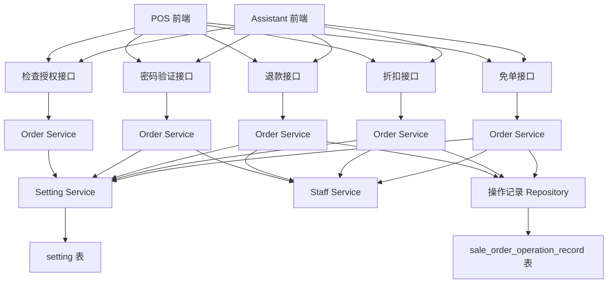

# 敏感操作设置（收银机）设计文档

> 本文档定义收银机和点餐助手端敏感操作（折扣/退款）权限验证的技术设计和实现方案。

## 📋 概述

在收银机和点餐助手端实现敏感操作（折扣/退款/免单）的权限验证功能。当普通员工进行折扣、退款或免单操作时，系统判断当前员工是否为授权验证人：
- **如果是授权员工**：无需输入密码，直接进行下一步操作
- **如果不是授权员工**：弹出授权验证弹窗，要求输入授权员工账号（邮箱或手机号）和权限密码

**前置依赖**：
- ✅ 商家后台业务设置中的"敏感操作设置"功能（`story-shop-sensitive-operation-settings`）
- ✅ 权限密码配置功能

---

## 🎯 规范对齐

### Go Main 规范 (go-main.mdc)

- Service 只依赖其他 Service 接口
- Repository 只持有 db 实例
- URL 使用 snake_case
- data 字段必须是对象
- 不使用 panic，返回 error

### API 设计规范 (api.mdc)

- URL 使用 snake_case
- 响应格式统一：`{code, message, data{}}`
- data 字段必须是对象

### 数据库规范 (database.mdc)

- 使用现有的订单操作记录表（`sale_order_operation_record`）
- 在 `data` 字段（JSON）中存储授权员工信息
- 遵循现有操作记录的存储方式

---

## 🔄 代码复用分析

### 可复用的现有组件

- **退款接口**: `main/app/api/v1/cashier/cashier_order.go` - `ReturnOrder` 方法
- **折扣接口**: `main/app/api/v1/cashier/cashier_instant.go` - `OrderDiscount` 方法
- **免单接口**: `main/app/api/v1/cashier/cashier_desk.go` - `OrderFree` 方法（桌台免单）
- **免单接口**: `main/app/api/v1/cashier/cashier_instant.go` - `OrderFree` 方法（点餐页面免单）
- **免单接口**: `main/app/api/v1/assistant/assistant_desk.go` - `OrderFree` 方法（助手端免单）
- **免单 Service**: `main/app/service/order_pay.go` - `InstantOrderFree` 方法
- **订单操作记录**: `main/app/model/sale_order_operation_record.go` - 订单操作记录模型
- **业务设置 Service**: `main/app/service/setting/setting.go` - 业务设置处理逻辑
- **员工 Service**: `main/app/service/staff.go` - 员工查询逻辑

### 集成点

- **检查授权接口**: `/cashier/order/check_authorization` - 新建接口
- **密码验证接口**: `/cashier/order/verify_password` - 新建接口
- **退款接口**: `/cashier/order/return` - 扩展现有接口
- **折扣接口**: `/cashier/instant/order/discount` - 扩展现有接口
- **免单接口**: `/cashier/desk/order/free` - 扩展现有接口（收银端桌台免单）
- **免单接口**: `/cashier/instant/order/free` - 扩展现有接口（收银端点餐页面免单）
- **免单接口**: `/assistant/desk/order/free` - 扩展现有接口（助手端免单）
- **业务设置**: `setting` 表，key 为 `business`，values 为 JSON

---

## 🏗️ 架构设计

### 分层设计原则

**Go Main 三层架构**:

```
API 层 (cashier_order.go)
  ↓ 依赖
Service 层 (order_manage.go / order_discount.go)
  ↓ 依赖
Repository 层
  ↓ 操作
Database (sale_order_operation_record 表)
```

**依赖规则**:

- ✅ API 调用 Service，Service 调用 Repository
- ✅ Service 调用 Setting Service 获取业务设置
- ✅ Service 调用 Staff Service 查询员工信息
- ❌ API 不直接操作数据库

### 架构图



### 模块划分

#### Go Main 模块

- **API 层**: 
  - `main/app/api/v1/cashier/cashier_order.go` - 检查授权、密码验证、退款接口
  - `main/app/api/v1/cashier/cashier_instant.go` - 折扣接口
  - `main/app/api/v1/cashier/cashier_desk.go` - 免单接口（桌台免单）
  - `main/app/api/v1/cashier/cashier_instant.go` - 免单接口（点餐页面免单）
  - `main/app/api/v1/assistant/assistant_desk.go` - 免单接口（助手端免单）
- **Service 层**: 
  - `main/app/service/order_manage.go` - 退款 Service
  - `main/app/service/order_discount.go` - 折扣 Service
  - `main/app/service/order_pay.go` - 免单 Service
  - `main/app/service/setting/setting.go` - 业务设置 Service（复用）
  - `main/app/service/staff.go` - 员工 Service（复用）
- **Repository 层**: 
  - `main/app/repository/sale_order_operation_record.go` - 操作记录 Repository（复用）

---

## 🗄️ 数据库设计

### 数据表设计

#### 使用现有表: `sale_order_operation_record`

```sql
-- 表结构（已存在）
CREATE TABLE `ttpos_sale_order_operation_record` (
    `uuid` bigint(20) unsigned NOT NULL AUTO_INCREMENT COMMENT '自增ID',
    `source` varchar(255) NOT NULL COMMENT '操作来源 cashier-收银端 assistant-点餐助手 shop-商家后台 h5-扫码点餐',
    `action` varchar(150) NOT NULL COMMENT '操作行为',
    `data` text NOT NULL COMMENT '数据（JSON格式）',
    `remark` varchar(255) NOT NULL COMMENT '备注',
    `sale_bill_uuid` bigint(20) unsigned DEFAULT 0 COMMENT '销售账单ID',
    `sale_order_uuid` bigint(20) unsigned DEFAULT 0 COMMENT '销售订单ID',
    `operator_uuid` bigint(20) unsigned DEFAULT 0 COMMENT '操作员ID',
    -- ... 其他字段
    PRIMARY KEY (`uuid`)
) ENGINE=InnoDB DEFAULT CHARSET=utf8mb4 COMMENT='订单操作记录表';
```

**`data` 字段 JSON 格式扩展**:

```json
{
  "discount": 10.0,
  "discount_type": 0,
  "authorized_staff": {
    "uuid": 123,
    "name": "张三",
    "email": "zhangsan@example.com"
  }
}
```

**字段说明**:

| 字段 | 类型 | 说明 | 约束 |
|------|------|------|------|
| authorized_staff | object | 授权员工信息（仅在使用了授权验证时存在） | 可选 |
| authorized_staff.uuid | number | 授权员工UUID | 必填（当 authorized_staff 存在时） |
| authorized_staff.name | string | 授权员工姓名 | 必填（当 authorized_staff 存在时） |
| authorized_staff.email | string | 授权员工邮箱 | 必填（当 authorized_staff 存在时） |

**注意**: 
- 不另外增加操作记录类型，在原本的折扣和退款记录中增加授权员工信息
- 不需要显示到前端，仅记录在数据库记录中

---

## 📊 数据模型

### Go DTO 定义

#### 检查授权请求

```go
// main/app/dto/req/order.go
// 检查授权接口无需请求参数，通过 token 识别当前员工
```

#### 检查授权响应

```go
// main/app/dto/resp/order.go
type CheckAuthorizationResp struct {
    HasPermission bool `json:"has_permission"` // 是否有权限: true-有权限, false-无权限
}
```

#### 密码验证请求

```go
// main/app/dto/req/order.go
type VerifyPasswordReq struct {
    AuthorizedStaffAccount string `json:"authorized_staff_account" binding:"required"` // 授权员工账号（邮箱或手机号）
    Password               string `json:"password" binding:"required"`                 // 权限密码
}
```

#### 密码验证响应

```go
// main/app/dto/resp/order.go
type VerifyPasswordResp struct {
    Verified bool `json:"verified"` // 验证结果: true-成功, false-失败
}
```

#### 退款请求扩展

```go
// main/app/dto/req/order.go
type OrderReturnReq struct {
    // ... 现有字段 ...
    
    // 新增字段（可选）
    AuthorizedStaffAccount string `json:"authorized_staff_account"` // 授权员工账号（邮箱或手机号）
    AuthorizedStaffPassword string `json:"authorized_staff_password"` // 权限密码
}
```

#### 整单改价请求扩展

```go
// main/app/dto/req/order.go
type OrderAmountChangeReq struct {
    // ... 现有字段 ...
    
    // 新增字段（可选）
    AuthorizedStaffAccount string `json:"authorized_staff_account"` // 授权员工账号（邮箱或手机号）
    AuthorizedStaffPassword string `json:"authorized_staff_password"` // 权限密码
}
```

#### 打折请求扩展

```go
// main/app/dto/req/order.go
type OrderDiscountReq struct {
    // ... 现有字段 ...
    
    // 新增字段（可选）
    AuthorizedStaffAccount string `json:"authorized_staff_account"` // 授权员工账号（邮箱或手机号）
    AuthorizedStaffPassword string `json:"authorized_staff_password"` // 权限密码
}
```

#### 抹零请求扩展

```go
// main/app/dto/req/order.go
type OrderZeroRuleReq struct {
    // ... 现有字段 ...
    
    // 新增字段（可选）
    AuthorizedStaffAccount string `json:"authorized_staff_account"` // 授权员工账号（邮箱或手机号）
    AuthorizedStaffPassword string `json:"authorized_staff_password"` // 权限密码
}
```

#### 免单请求扩展

```go
// main/app/dto/req/instant.go
type InstantOrderFreeReq struct {
    // ... 现有字段 ...
    SaleBillUuid  uint64   `json:"sale_bill_uuid"`  // 销售账单UUID, 必填
    SaleOrderUuid uint64   `json:"sale_order_uuid"` // 销售订单UUID, 必填
    ReasonIds     []uint64 `json:"reason_ids"`      // 免单原因标签ids
    Reason        string   `json:"reason"`          // 原因
    
    // 新增字段（可选）
    AuthorizedStaffAccount string `json:"authorized_staff_account"` // 授权员工账号（邮箱或手机号）
    AuthorizedStaffPassword string `json:"authorized_staff_password"` // 权限密码
}
```

#### 授权员工信息（操作记录）

```go
// main/app/model/sale_order_operation_record.go
type AuthorizedStaffInfo struct {
    Uuid  uint64 `json:"uuid"`  // 授权员工UUID
    Name  string `json:"name"`  // 授权员工姓名
    Email string `json:"email"` // 授权员工邮箱
}
```

---

## 🔌 API 设计

### RESTful API

#### API: 检查授权

**请求**:

- **URL**: `/cashier/order/check_authorization`
- **Method**: `POST`
- **Headers**:
  ```json
  {
    "Authorization": "Bearer {token}",
    "Content-Type": "application/json"
  }
  ```
- **Body**: 无（通过 token 识别当前员工）

**响应**:

```json
{
  "code": 1,
  "message": "success",
  "data": {
    "has_permission": false
  }
}
```

#### API: 密码验证

**请求**:

- **URL**: `/cashier/order/verify_password`
- **Method**: `POST`
- **Headers**:
  ```json
  {
    "Authorization": "Bearer {token}",
    "Content-Type": "application/json"
  }
  ```
- **Body**:
  ```json
  {
    "authorized_staff_account": "zhangsan@example.com",
    "password": "123456"
  }
  ```

**响应**:

```json
{
  "code": 1,
  "message": "success",
  "data": {
    "verified": true,
    "authorized_staff": {
      "uuid": 123,
      "name": "张三",
      "email": "zhangsan@example.com"
    }
  }
}
```

**错误响应**:

```json
{
  "code": 0,
  "message": "密码错误",
  "data": {}
}
```

```json
{
  "code": 0,
  "message": "不是权限员工，请确认信息",
  "data": {}
}
```

#### API: 退款接口（扩展）

**请求**:

- **URL**: `/cashier/order/return`
- **Method**: `POST`
- **Headers**:
  ```json
  {
    "Authorization": "Bearer {token}",
    "Content-Type": "application/json",
    "Client-Version": "v2.10.0"
  }
  ```
- **Body**:
  ```json
  {
    "sale_bill_uuid": 123,
    "sale_order_uuid": 456,
    "products": [],
    "authorized_staff_account": "zhangsan@example.com",
    "authorized_staff_password": "123456"
  }
  ```

**注意**: 
- `authorized_staff_account` 和 `authorized_staff_password` 为可选字段，仅在当前员工不在授权名单中时需要
- `Client-Version` 请求头为可选，格式为 `v2.10.0` 或 `2.10.0`
- 如果版本 < v2.10.0 或未传递版本信息，不进行权限验证（向后兼容）

#### API: 整单改价接口（扩展）

**请求**:

- **URL**: `/cashier/desk/order/discount` 或 `/cashier/instant/order/discount`
- **Method**: `POST`
- **Headers**:
  ```json
  {
    "Authorization": "Bearer {token}",
    "Content-Type": "application/json",
    "Client-Version": "v2.10.0"
  }
  ```
- **Body**:
  ```json
  {
    "discount_method": 1,
    "sale_bill_uuid": 123,
    "sale_order_uuid": 456,
    "price": 100.0,
    "authorized_staff_account": "zhangsan@example.com",
    "authorized_staff_password": "123456"
  }
  ```

**注意**: `Client-Version` 请求头为可选，如果版本 < v2.10.0 或未传递版本信息，不进行权限验证（向后兼容）

#### API: 打折接口（扩展）

**请求**:

- **URL**: `/cashier/desk/order/discount` 或 `/cashier/instant/order/discount`
- **Method**: `POST`
- **Headers**:
  ```json
  {
    "Authorization": "Bearer {token}",
    "Content-Type": "application/json",
    "Client-Version": "v2.10.0"
  }
  ```
- **Body**:
  ```json
  {
    "discount_method": 2,
    "sale_bill_uuid": 123,
    "sale_order_uuid": 456,
    "discount": 10.0,
    "authorized_staff_account": "zhangsan@example.com",
    "authorized_staff_password": "123456"
  }
  ```

**注意**: `Client-Version` 请求头为可选，如果版本 < v2.10.0 或未传递版本信息，不进行权限验证（向后兼容）

#### API: 抹零接口（扩展）

**请求**:

- **URL**: `/cashier/desk/order/discount` 或 `/cashier/instant/order/discount`
- **Method**: `POST`
- **Headers**:
  ```json
  {
    "Authorization": "Bearer {token}",
    "Content-Type": "application/json",
    "Client-Version": "v2.10.0"
  }
  ```
- **Body**:
  ```json
  {
    "discount_method": 3,
    "sale_bill_uuid": 123,
    "sale_order_uuid": 456,
    "zero_rule": 1,
    "authorized_staff_account": "zhangsan@example.com",
    "authorized_staff_password": "123456"
  }
  ```

**注意**: 
- `authorized_staff_account` 和 `authorized_staff_password` 为可选字段，仅在当前员工不在授权名单中时需要
- `Client-Version` 请求头为可选，如果版本 < v2.10.0 或未传递版本信息，不进行权限验证（向后兼容）

---

## 🧩 组件和接口

### Service 层（Go）

#### 检查授权 Service

```go
// main/app/service/order_manage.go 或新建文件
func (s *orderSrv) CheckAuthorization(ctx context.Context) (bool, error) {
    // 1. 获取当前员工信息
    currentStaff := ctx.GetStaff()
    
    // 2. 获取业务设置
    settingSrv := NewSettingSrv(s.dbm)
    businessSetting, err := settingSrv.GetBusinessSetting(ctx)
    if err != nil {
        return false, errors.WithMessage(err)
    }
    
    // 3. 检查折扣操作是否开启密码验证（整单改价、打折、抹零共用）
    discountNeedPassword := businessSetting.DiscountNeedPassword == "1"
    discountAuthorizedStaffIds := businessSetting.DiscountAuthorizedStaffIds
    
    // 4. 如果未开启密码验证，返回有权限
    if !discountNeedPassword {
        return true, nil
    }
    
    // 5. 检查当前员工是否在授权名单中
    for _, staffId := range discountAuthorizedStaffIds {
        if staffId == currentStaff.Uuid {
            return true, nil
        }
    }
    
    // 6. 不在授权名单中，返回无权限
    return false, nil
}
```

**注意**: 检查授权接口不区分操作类型（折扣/退款），统一检查折扣操作的授权配置。退款操作的授权检查在退款接口中单独处理。

#### 密码验证 Service

```go
// main/app/service/order_manage.go 或新建文件
func (s *orderSrv) VerifyPassword(ctx context.Context, req req.VerifyPasswordReq) (*resp.VerifyPasswordResp, error) {
    // 1. 根据账号（邮箱或手机号）查找员工
    staffSrv := NewStaffSrv(s.dbm)
    staff, err := staffSrv.GetStaffByAccount(ctx, req.AuthorizedStaffAccount)
    if err != nil {
        return nil, errors.New("不是权限员工，请确认信息")
    }
    
    // 2. 获取业务设置
    settingSrv := NewSettingSrv(s.dbm)
    businessSetting, err := settingSrv.GetBusinessSetting(ctx)
    if err != nil {
        return nil, errors.WithMessage(err)
    }
    
    // 3. 检查员工是否在授权名单中（折扣操作的授权名单）
    authorizedStaffIds := businessSetting.DiscountAuthorizedStaffIds
    
    isAuthorized := false
    for _, staffId := range authorizedStaffIds {
        if staffId == staff.Uuid {
            isAuthorized = true
            break
        }
    }
    
    if !isAuthorized {
        return nil, errors.New("不是权限员工，请确认信息")
    }
    
    // 4. 验证密码（从 staff 表中读取权限密码 permission_password）
    if staff.PermissionPassword != req.Password {
        return nil, errors.New("密码错误")
    }
    
    // 5. 返回验证结果
    return &resp.VerifyPasswordResp{
        Verified: true,
    }, nil
}
```

**注意**: 密码验证接口区分操作类型：
- `VerifyPassword`: 用于折扣操作（整单改价、打折、抹零），检查折扣授权名单
- `VerifyPasswordForRefund`: 用于退款操作，检查退款授权名单

在实际使用中，通过 `AuthorizeSensitiveOperation` 统一方法自动选择对应的验证方法。

#### 统一授权验证方法

```go
// main/app/service/order_manage.go

// SensitiveOperationType 敏感操作类型
type SensitiveOperationType string

const (
    SensitiveOperationTypeDiscount SensitiveOperationType = "discount" // 折扣操作（整单改价、打折、抹零）
    SensitiveOperationTypeRefund   SensitiveOperationType = "refund"   // 退款操作
)

// AuthorizeSensitiveOperation 授权敏感操作
// 统一的授权验证方法，用于折扣操作和退款操作
// 返回授权员工信息，如果当前员工有权限则返回当前员工信息
func (s *orderSrv) AuthorizeSensitiveOperation(ctx context.Context, operationType SensitiveOperationType, authorizedStaffAccount, authorizedStaffPassword string) (*model.Staff, error) {
    // 如果提供了授权参数，需要验证
    if authorizedStaffAccount != "" && authorizedStaffPassword != "" {
        verifyReq := req.VerifyPasswordForSensitiveOperationReq{
            AuthorizedStaffAccount: authorizedStaffAccount,
            Password:               authorizedStaffPassword,
        }
        
        var verified bool
        var err error
        
        // 根据操作类型选择不同的验证方法
        if operationType == SensitiveOperationTypeRefund {
            verified, err = s.VerifyPasswordForRefund(ctx, verifyReq)
        } else {
            verified, err = s.VerifyPassword(ctx, verifyReq)
        }
        
        if err != nil {
            return nil, errors.WithMessage(err, "授权验证失败")
        }
        if !verified {
            return nil, errors.New("授权验证失败")
        }
        
        // 获取授权员工信息
        db := s.dbm.GetDB(ctx.GetDbId())
        staffRepo := repository.NewStaffRepo(db)
        staff, err := staffRepo.GetStaff(staffRepo.WhereUsername(authorizedStaffAccount))
        if err != nil || staff.Uuid == 0 {
            return nil, errors.New("获取授权员工信息失败")
        }
        return &staff, nil
    }
    
    // 如果没有提供授权参数，检查当前员工是否在授权名单中
    var hasPermission bool
    var err error
    
    if operationType == SensitiveOperationTypeRefund {
        hasPermission, err = s.CheckAuthorizationForRefund(ctx)
    } else {
        hasPermission, err = s.CheckAuthorization(ctx)
    }
    
    if err != nil {
        return nil, errors.WithMessage(err)
    }
    if !hasPermission {
        return nil, errors.New("需要授权验证")
    }
    
    // 当前员工有权限，返回当前员工信息
    staff := ctx.GetStaff()
    return &staff, nil
}
```

**设计说明**：
- 统一了退款和折扣操作的授权验证逻辑，避免代码重复
- 通过 `SensitiveOperationType` 区分操作类型，自动选择对应的验证方法
- 返回授权员工信息，便于后续操作记录

#### 版本判断工具方法

```go
// main/app/service/order_manage.go 或新建文件

// shouldRequireAuth 判断是否需要权限验证
// 根据客户端版本判断是否需要权限验证
func shouldRequireAuth(clientVersion string) bool {
    if clientVersion == "" {
        return false // 未传递版本，视为旧版本，不验证
    }
    
    // 解析版本号（支持 v2.10.0 或 2.10.0 格式）
    version := parseVersion(clientVersion)
    if version == nil {
        return false // 无法解析版本，视为旧版本，不验证
    }
    
    // 目标版本 v2.10.0
    targetVersion := parseVersion("2.10.0")
    return version.Compare(targetVersion) >= 0 // >= v2.10.0 才验证
}

// parseVersion 解析版本号
// 支持格式：v2.10.0, 2.10.0, 2.10.0.1
func parseVersion(versionStr string) *semver.Version {
    // 移除前缀 v
    if strings.HasPrefix(versionStr, "v") {
        versionStr = versionStr[1:]
    }
    
    // 使用 go-semver 或类似库解析
    version, err := semver.NewVersion(versionStr)
    if err != nil {
        return nil
    }
    
    return version
}
```

#### 退款 Service 增强

```go
// main/app/service/order_manage.go
func (s *orderSrv) ReturnOrder(ctx context.Context, orderReq req.OrderReturnReq) (error, int) {
    // 1. 版本判断：从请求头获取客户端版本
    clientVersion := ctx.GetHeader("Client-Version")
    
    // 2. 如果版本 < v2.10.0，不进行权限验证，直接执行退款
    if !shouldRequireAuth(clientVersion) {
        // 直接执行退款逻辑（现有代码）
        // ...
        return nil, constant.CodeSuccess
    }
    
    // 3. 版本 >= v2.10.0，进行授权验证（退款操作）
    authorizedStaff, err := s.AuthorizeSensitiveOperation(ctx, SensitiveOperationTypeRefund, orderReq.AuthorizedStaffAccount, orderReq.AuthorizedStaffPassword)
    if err != nil {
        return errors.WithMessage(err), constant.CodeFail
    }
    
    // 4. 执行退款逻辑（现有代码）
    // ...
    
    // 5. 创建操作记录（如果使用了授权验证，记录授权员工信息）
    // 将 authorizedStaff 传递给操作记录创建逻辑
    // ...
}
```

#### 整单改价 Service 增强

```go
// main/app/service/order_discount.go
func (s *orderSrv) OrderAmountChange(ctx context.Context, request req.OrderAmountChangeReq) (*resp.ShopCart, error) {
    // 1. 版本判断：从请求头获取客户端版本
    clientVersion := ctx.GetHeader("Client-Version")
    
    // 2. 如果版本 < v2.10.0，不进行权限验证，直接执行整单改价
    if !shouldRequireAuth(clientVersion) {
        // 直接执行整单改价逻辑（现有代码）
        // ...
        return shopCart, nil
    }
    
    // 3. 版本 >= v2.10.0，进行授权验证（折扣操作：整单改价）
    authorizedStaff, err := s.AuthorizeSensitiveOperation(ctx, SensitiveOperationTypeDiscount, request.AuthorizedStaffAccount, request.AuthorizedStaffPassword)
    if err != nil {
        return nil, errors.WithMessage(err)
    }
    
    // 4. 执行整单改价逻辑（现有代码）
    // ...
    
    // 5. 创建操作记录（如果使用了授权验证，记录授权员工信息）
    // 将 authorizedStaff 传递给操作记录创建逻辑
    // ...
}
```

#### 打折 Service 增强

```go
// main/app/service/order_discount.go
func (s *orderSrv) OrderDiscount(ctx context.Context, request req.OrderDiscountReq) (*resp.ShopCart, error) {
    // 1. 版本判断：从请求头获取客户端版本
    clientVersion := ctx.GetHeader("Client-Version")
    
    // 2. 如果版本 < v2.10.0，不进行权限验证，直接执行打折
    if !shouldRequireAuth(clientVersion) {
        // 直接执行打折逻辑（现有代码）
        // ...
        return shopCart, nil
    }
    
    // 3. 版本 >= v2.10.0，进行授权验证（折扣操作：打折）
    authorizedStaff, err := s.AuthorizeSensitiveOperation(ctx, SensitiveOperationTypeDiscount, request.AuthorizedStaffAccount, request.AuthorizedStaffPassword)
    if err != nil {
        return nil, errors.WithMessage(err)
    }
    
    // 4. 执行打折逻辑（现有代码）
    // ...
    
    // 5. 创建操作记录（如果使用了授权验证，记录授权员工信息）
    // 将 authorizedStaff 传递给操作记录创建逻辑
    // ...
}
```

#### 抹零 Service 增强

```go
// main/app/service/order_discount.go
func (s *orderSrv) OrderZeroRule(ctx context.Context, request req.OrderZeroRuleReq) (*resp.ShopCart, error) {
    // 1. 版本判断：从请求头获取客户端版本
    clientVersion := ctx.GetHeader("Client-Version")
    
    // 2. 如果版本 < v2.10.0，不进行权限验证，直接执行抹零
    if !shouldRequireAuth(clientVersion) {
        // 直接执行抹零逻辑（现有代码）
        // ...
        return shopCart, nil
    }
    
    // 3. 版本 >= v2.10.0，进行授权验证（折扣操作：抹零）
    authorizedStaff, err := s.AuthorizeSensitiveOperation(ctx, SensitiveOperationTypeDiscount, request.AuthorizedStaffAccount, request.AuthorizedStaffPassword)
    if err != nil {
        return nil, errors.WithMessage(err)
    }
    
    // 4. 执行抹零逻辑（现有代码）
    // ...
    
    // 5. 创建操作记录（如果使用了授权验证，记录授权员工信息）
    // 将 authorizedStaff 传递给操作记录创建逻辑
    // ...
}
```

#### 免单 Service 增强

```go
// main/app/service/order_pay.go
func (s *orderSrv) InstantOrderFree(ctx context.Context, req req.InstantOrderFreeReq) (*resp.OrderFinishResp, error) {
    // 1. 版本判断：从请求头获取客户端版本
    clientVersion := ctx.GetHeader("Client-Version")
    
    // 2. 如果版本 < v2.10.0，不进行权限验证，直接执行免单
    if !shouldRequireAuth(clientVersion) {
        // 直接执行免单逻辑（现有代码）
        // ...
        return res, nil
    }
    
    // 3. 版本 >= v2.10.0，进行授权验证（折扣操作：免单）
    // 免单操作在产品定义中属于折扣类型（discount_type = 4），使用折扣操作的授权验证逻辑
    authorizedStaff, err := s.AuthorizeSensitiveOperation(ctx, SensitiveOperationTypeDiscount, req.AuthorizedStaffAccount, req.AuthorizedStaffPassword)
    if err != nil {
        return nil, errors.WithMessage(err)
    }
    
    // 4. 执行免单逻辑（现有代码）
    // ...
    
    // 5. 创建操作记录（如果使用了授权验证，记录授权员工信息）
    // 将 authorizedStaff 传递给操作记录创建逻辑
    // 免单操作记录中需要记录授权员工信息，与折扣操作记录保持一致
    // ...
}
```

### 操作记录增强

```go
// main/app/event/order_return_amount_event_handler.go
// 在创建操作记录时，将 authorizedStaff 信息添加到 data JSON 中
func (h *OrderReturnAmountEventHandler) Handle(ctx context.Context, payload *event.ReturnOrderPayload) error {
    // ... 现有逻辑 ...
    
    // 构建操作记录数据
    recordData := map[string]interface{}{
        // ... 现有字段 ...
    }
    
    // 如果使用了授权验证，添加授权员工信息
    if payload.AuthorizedStaff != nil {
        recordData["authorized_staff"] = map[string]interface{}{
            "uuid":  payload.AuthorizedStaff.Uuid,
            "name":  payload.AuthorizedStaff.Name,
            "email": payload.AuthorizedStaff.Email,
        }
    }
    
    // 创建操作记录
    record := model.SaleOrderOperationRecord{
        Source:        ctx.GetSource(),
        Action:        constant.OrderReturn,
        Data:          utils.ToJSON(recordData),
        SaleBillUuid:  saleBill.Uuid,
        SaleOrderUuid: saleOrder.Uuid,
        OperatorUuid:  ctx.GetStaff().Uuid,
    }
    
    // 保存到数据库
    // ...
}
```

**设计说明**：
- 授权员工信息通过事件 Payload 传递到事件处理器
- 在创建操作记录时，将授权员工信息添加到 `data` JSON 字段中
- 折扣操作的操作记录增强逻辑类似，需要在相应的事件处理器中添加授权员工信息

---

## ⚡ 缓存设计

### Redis 缓存

**缓存策略**:

- **业务设置缓存**: 使用现有的业务设置缓存（`setting:company_id:{app_id}`）
- **员工信息缓存**: 可考虑缓存员工信息（如需要）

**缓存清除**:

- 业务设置更新时，自动清除缓存（已有逻辑）

---

## 🚨 错误处理

### 错误场景

#### 场景 1: 检查授权失败

- **处理方式**: 返回 `has_permission: false`
- **用户影响**: 前端弹出授权弹窗

#### 场景 2: 密码验证失败（密码错误）

- **处理方式**: 返回错误："密码错误"
- **用户影响**: toast提示"密码错误"

#### 场景 3: 密码验证失败（账号不是权限员工）

- **处理方式**: 返回错误："不是权限员工，请确认信息"
- **用户影响**: toast提示"不是权限员工，请确认信息"

#### 场景 4: 授权验证失败（退款/折扣接口）

- **处理方式**: 返回错误，不执行操作
- **用户影响**: 显示错误提示，操作未执行

---

## 🔒 安全设计

### 身份验证

- **JWT Token**: 所有 API 需要 Token 验证
- **权限验证**: 检查当前员工是否有权限操作

### 权限控制

- **二次验证**: 弹窗验证 + 接口验证
- **密码验证**: 从业务设置中读取权限密码进行验证

### 数据安全

- **参数验证**: 使用 binding tag 验证参数
- **密码安全**: 密码不在日志中记录
- **SQL 注入防护**: 使用 GORM 参数化查询

---

## 🧪 测试策略

### 单元测试

**测试内容**:

- Service 权限检查逻辑
- Service 密码验证逻辑
- 操作记录创建逻辑

### API 测试

**测试内容**:

- 检查授权接口
- 密码验证接口
- 退款接口增强
- 折扣接口增强
- 免单接口增强

### 集成测试

**测试流程**:

- 检查授权 → 弹出弹窗 → 密码验证 → 执行操作 → 记录操作日志

---

## 📈 性能优化

### 优化策略

1. **缓存优化**:
   - 业务设置数据缓存到 Redis
   - 员工信息缓存（如需要）

2. **数据库优化**:
   - 使用现有索引
   - 避免不必要的查询

### 性能指标

- 检查授权接口响应时间: < 100ms
- 密码验证接口响应时间: < 200ms
- 授权弹窗显示时间: < 50ms

---

## 📚 实现清单

### Phase 1: 接口开发

- [ ] 创建检查授权接口
- [ ] 创建密码验证接口
- [ ] 实现权限检查 Service
- [ ] 实现密码验证 Service

### Phase 2: 版本判断逻辑开发

- [ ] 实现版本解析工具方法（parseVersion）
- [ ] 实现版本比较工具方法（shouldRequireAuth）
- [ ] 处理版本解析错误情况
- [ ] 处理未传递版本信息的情况

### Phase 3: 退款接口增强

- [ ] 修改退款 DTO，增加授权参数
- [ ] 修改退款 Service，增加版本判断逻辑
- [ ] 修改退款 Service，增加授权验证逻辑（仅在版本 >= v2.10.0 时）
- [ ] 修改操作记录创建逻辑，记录授权员工信息

### Phase 4: 折扣接口增强（整单改价、打折、抹零）

- [ ] 修改整单改价 DTO（OrderAmountChangeReq），增加授权参数
- [ ] 修改打折 DTO（OrderDiscountReq），增加授权参数
- [ ] 修改抹零 DTO（OrderZeroRuleReq），增加授权参数
- [ ] 修改整单改价 Service（OrderAmountChange），增加版本判断逻辑
- [ ] 修改打折 Service（OrderDiscount），增加版本判断逻辑
- [ ] 修改抹零 Service（OrderZeroRule），增加版本判断逻辑
- [ ] 修改整单改价 Service（OrderAmountChange），增加授权验证逻辑（仅在版本 >= v2.10.0 时）
- [ ] 修改打折 Service（OrderDiscount），增加授权验证逻辑（仅在版本 >= v2.10.0 时）
- [ ] 修改抹零 Service（OrderZeroRule），增加授权验证逻辑（仅在版本 >= v2.10.0 时）
- [ ] 修改操作记录创建逻辑，记录授权员工信息

### Phase 5: 免单接口增强

- [ ] 修改免单 DTO（InstantOrderFreeReq），增加授权参数
- [ ] 修改免单 Service（InstantOrderFree），增加版本判断逻辑
- [ ] 修改免单 Service（InstantOrderFree），增加授权验证逻辑（仅在版本 >= v2.10.0 时）
- [ ] 修改操作记录创建逻辑，在免单操作记录中记录授权员工信息
- [ ] 确保免单操作使用折扣操作的授权验证逻辑（discount_type = 4）

### Phase 6: 前端实现

- [ ] 创建授权验证弹窗组件（POS）
- [ ] 创建授权验证弹窗组件（Assistant）
- [ ] 实现检查授权接口调用
- [ ] 实现密码验证接口调用
- [ ] 实现退款/折扣/免单接口调用（带授权参数）

### Phase 7: 测试

- [ ] 单元测试
- [ ] API 测试
- [ ] 集成测试

**详细任务**: 参见 `tasks.md`

---

## Graphiti & 活动日志

- Related Episode: `[待补充]`
- 模板：`docs/agent/templates/graphiti-episode.md`
- 活动日志：`docs/team/activities/{YYYY-MM}/{YYYY-MM-DD}.md`
- 在技术方案评审、关键架构决策或踩坑总结后，立即补充 Episode 并在设计文档尾部互链。

---

---

## 🔄 重构记录

### v1.1.0 - 2025-11-24

**重构内容**：
- 提取统一的授权验证方法 `AuthorizeSensitiveOperation`，消除代码重复
- 创建 `SensitiveOperationType` 类型和常量，区分折扣和退款操作
- 所有敏感操作方法（退款、整单改价、打折、抹零）统一使用 `AuthorizeSensitiveOperation` 方法

**优势**：
- 代码复用性提高，维护成本降低
- 授权验证逻辑统一，减少出错概率
- 后续新增敏感操作类型时，只需调用统一方法即可

---

**版本**: v1.1.0  
**创建日期**: 2025-11-24  
**最后更新**: 2025-11-24  
**作者**: 开发组  
**审核者**: {审核者}

