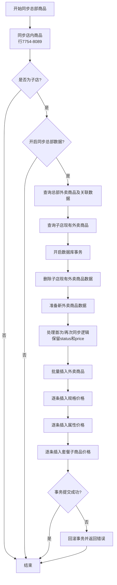

# 同步总部外卖商品功能 设计文档

> 本文档定义同步总部外卖商品到子店的技术设计和实现方案。

## 📋 概述

在现有的商品同步功能中扩展外卖商品同步逻辑。当系统同步完总部店内商品后，继续同步总部的外卖商品数据，包括：
1. 外卖商品基本信息（`ttpos_product_package_takeout`）
2. 外卖规格价格（`ttpos_product_bom_takeout`）
3. 外卖属性价格（`ttpos_product_package_attribute_takeout`）
4. 外卖套餐子商品价格（`ttpos_product_package_group_item_takeout`）

核心设计思路：
- 复用店内商品同步的整体架构（先删后建）
- 首次同步时外卖商品状态设置为下架（0）
- 再次同步时保留子店的外卖商品 price/status、规格 price、属性 price 和套餐子商品 add_price 配置

---

## 🎯 规范对齐

### Go Main 规范 (go-main.mdc)

本设计严格遵循 Go Main 开发规范：

- ✅ Service 层实现业务逻辑，使用 Repository 接口访问数据
- ✅ Repository 只持有 db 实例，不持有 DBManager
- ✅ 使用事务保证数据一致性
- ✅ 不使用 panic，返回 error
- ✅ 使用 `errors.WithMessage` 包装错误
- ✅ 使用 `logger.Logger` 记录错误日志
- ✅ 所有注释使用中文

### 数据库规范 (database.mdc)

外卖商品相关表已符合数据库规范：

- ✅ 包含标准字段：`id`, `uuid`, `create_time`, `update_time`, `delete_time`
- ✅ 时间字段使用 int 类型
- ✅ 金额/价格字段使用 decimal(22,4)
- ✅ UUID 字段使用 bigint unsigned
- ✅ 表名使用 ttpos_ 前缀
- ✅ 字段名使用 snake_case

---

## 🔄 代码复用分析

### 可复用的现有组件

- **productSrv.SyncProduct**: `main/app/service/product.go:7542-8100`
  - 复用整体架构：先删后建、事务管理、错误处理
  - 在第 7754-8089 行的"同步总店商品到子店"逻辑后增加外卖商品同步

- **ProductPackageTakeoutRepo**: `main/app/repository/product_package_takeout.go`
  - 使用 `GetProductPackageTakeoutList` 查询外卖商品
  - 使用 `DestroyProductPackageTakeout` 物理删除
  - 使用 `CreateProductPackageTakeout` 创建外卖商品

- **ProductBomTakeoutRepo**: `main/app/repository/product_bom_takeout.go`
  - 使用 `GetProductBomTakeoutList` 查询规格价格
  - 使用 `DestroyProductBomTakeout` 物理删除
  - 使用 `CreateProductBomTakeout` 创建规格价格

- **ProductPackageAttributeTakeoutRepo**: `main/app/repository/product_package_attribute_takeout.go`
  - 使用 `GetProductPackageAttributeTakeoutList` 查询属性价格
  - 使用 `DestroyProductPackageAttributeTakeout` 物理删除
  - 使用 `CreateProductPackageAttributeTakeout` 创建属性价格

- **ProductPackageGroupItemTakeoutRepo**: `main/app/repository/product_package_group_item_takeout.go`
  - 使用 `GetProductPackageGroupItemTakeoutList` 查询套餐子商品价格
  - 使用 `DestroyProductPackageGroupItemTakeout` 物理删除
  - 使用 `CreateProductPackageGroupItemTakeout` 创建套餐子商品价格

### 集成点

- **现有同步逻辑**: 在 `SyncProduct` 方法的第 8190 行（return 之前）插入外卖商品同步逻辑
- **数据库表**: 复用外卖商品相关的四张表
- **事务管理**: 使用与店内商品同步相同的事务管理机制

---

## 🏗️ 架构设计

### 分层设计原则

**Go Main 三层架构**:

```
Service 层 (productSrv.SyncProduct)
  ↓ 依赖
Repository 层 (ProductPackageTakeoutRepo, ProductBomTakeoutRepo, 
              ProductPackageAttributeTakeoutRepo, ProductPackageGroupItemTakeoutRepo)
  ↓ 依赖
数据库 (MySQL)
```

### 执行流程图



---

## 📝 详细设计

### 核心方法设计

在 `productSrv.SyncProduct` 方法中，在店内商品同步逻辑内部增加以下逻辑：

```go
// 在店内商品同步的 if 块内部
if companySetting.IsSubShop() && syncHeadquarterData {
    // ... 店内商品同步逻辑 ...
    
    // 同步总店外卖商品到子店
    err = s.syncHeadquarterTakeoutProducts(ctx, db, headquarterDb, &companySetting)
    if err != nil {
        return errors.WithMessage(err, "同步总店外卖商品到子店失败")
    }
}
```

### 新增辅助方法

#### 1. syncHeadquarterTakeoutProducts

**方法签名**:
```go
func (s *productSrv) syncHeadquarterTakeoutProducts(
    _ context.Context,
    subDb *gorm.DB,
    headquarterDb *gorm.DB,
    companySetting *model.CompanySetting,
) error
```

**注**：`ctx` 参数未在方法内使用，使用 `_` 命名避免 linter 警告

**功能**: 同步总部外卖商品到子店的主流程

**实现步骤**:

1. 初始化 Repository
```go
commonRepo := repository.NewCommonRepo()
headTakeoutRepo := repository.NewProductPackageTakeoutRepo(headquarterDb)
subTakeoutRepo := repository.NewProductPackageTakeoutRepo(subDb)
subBomTakeoutRepo := repository.NewProductBomTakeoutRepo(subDb)
subAttrTakeoutRepo := repository.NewProductPackageAttributeTakeoutRepo(subDb)
subGroupItemTakeoutRepo := repository.NewProductPackageGroupItemTakeoutRepo(subDb)
```

2. 查询总部外卖商品（包含关联数据）
```go
headTakeoutList, err := headTakeoutRepo.GetProductPackageTakeoutList(
    commonRepo.WhereByHeadquarterUuid(0),
    headTakeoutRepo.WithProductBomTakeouts(),
    headTakeoutRepo.WithProductPackageAttributeTakeouts(),
    headTakeoutRepo.WithProductPackageGroupItemTakeouts(),
)
```

3. 查询子店现有外卖商品（用于判断是否已同步）
```go
subTakeoutList, err := subTakeoutRepo.GetProductPackageTakeoutList(
    commonRepo.WhereByHeadquarterUuid(companySetting.HeadquarterUuid),
    subTakeoutRepo.WithProductBomTakeouts(),
    subTakeoutRepo.WithProductPackageAttributeTakeouts(),
    subTakeoutRepo.WithProductPackageGroupItemTakeouts(),
)
```

4. 构建子店已同步数据的 Map（用于快速查找）
```go
subTakeoutMap := make(map[uint64]*model.ProductPackageTakeout)
subBomTakeoutMap := make(map[uint64]*model.ProductBomTakeout)
subAttrTakeoutMap := make(map[uint64]*model.ProductPackageAttributeTakeout)
subGroupItemTakeoutMap := make(map[uint64]*model.ProductPackageGroupItemTakeout)
for _, takeout := range subTakeoutList {
    subTakeoutMap[takeout.Uuid] = takeout
    for _, bom := range takeout.ProductBomTakeouts {
        subBomTakeoutMap[bom.Uuid] = &bom
    }
    for _, attr := range takeout.ProductPackageAttributeTakeouts {
        subAttrTakeoutMap[attr.Uuid] = &attr
    }
    for _, groupItem := range takeout.ProductPackageGroupItemTakeouts {
        subGroupItemTakeoutMap[groupItem.Uuid] = &groupItem
    }
}
```

5. 准备新数据（遍历总部数据）
```go
newTakeoutList := make([]model.ProductPackageTakeout, 0)
newBomTakeoutList := make([]model.ProductBomTakeout, 0)
newAttrTakeoutList := make([]model.ProductPackageAttributeTakeout, 0)
newGroupItemTakeoutList := make([]model.ProductPackageGroupItemTakeout, 0)

for _, headTakeout := range headTakeoutList {
    // 确定 status
    status := uint(0) // 默认下架
    if existsTakeout, ok := subTakeoutMap[headTakeout.Uuid]; ok {
        status = existsTakeout.Status // 保留子店状态
    }
    
    // 创建新外卖商品
    newTakeout := model.ProductPackageTakeout{
        BaseModel: model.BaseModel{
            Uuid:       headTakeout.Uuid,
            CreateTime: headTakeout.CreateTime,
            UpdateTime: headTakeout.UpdateTime,
            DeleteTime: headTakeout.DeleteTime,
        },
        ProductPackageUuid:            headTakeout.ProductPackageUuid,
        MultiLanguageNameUuid:         headTakeout.MultiLanguageNameUuid,
        HeadquarterUuid:               companySetting.HeadquarterUuid,
        Name:                          headTakeout.Name,
        ProductType:                   headTakeout.ProductType,
        TakeoutType:                   headTakeout.TakeoutType,
        Status:                        status, // 使用确定的状态
        CategoryUuid:                  headTakeout.CategoryUuid,
        SpecialCategoryUuid:           headTakeout.SpecialCategoryUuid,
        ImageFileUuid:                 headTakeout.ImageFileUuid,
        Describe:                      headTakeout.Describe,
        DescribeMultiLanguageNameUuid: headTakeout.DescribeMultiLanguageNameUuid,
        Source:                        headTakeout.Source,
        SourceProductId:               headTakeout.SourceProductId,
    }
    newTakeoutList = append(newTakeoutList, newTakeout)
    
    // 处理规格价格
    for _, headBom := range headTakeout.ProductBomTakeouts {
        // 确定 price
        price := headBom.Price // 默认使用总部价格
        if existsBom, ok := subBomTakeoutMap[headBom.Uuid]; ok {
            price = existsBom.Price // 保留子店价格
        }
        
        newBom := model.ProductBomTakeout{
            BaseModel: model.BaseModel{
                Uuid:       headBom.Uuid,
                CreateTime: headBom.CreateTime,
                UpdateTime: headBom.UpdateTime,
                DeleteTime: headBom.DeleteTime,
            },
            ProductPackageTakeoutUuid: headBom.ProductPackageTakeoutUuid,
            ProductBomUuid:            headBom.ProductBomUuid,
            HeadquarterUuid:           companySetting.HeadquarterUuid,
            Price:                     price, // 使用确定的价格
            GrabModifierId:            headBom.GrabModifierId,
        }
        newBomTakeoutList = append(newBomTakeoutList, newBom)
    }
    
    // 处理属性价格（不保留子店价格）
    for _, headAttr := range headTakeout.ProductPackageAttributeTakeouts {
        newAttr := model.ProductPackageAttributeTakeout{
            BaseModel: model.BaseModel{
                Uuid:       headAttr.Uuid,
                CreateTime: headAttr.CreateTime,
                UpdateTime: headAttr.UpdateTime,
                DeleteTime: headAttr.DeleteTime,
            },
            ProductPackageTakeoutUuid:   headAttr.ProductPackageTakeoutUuid,
            ProductPackageAttributeUuid: headAttr.ProductPackageAttributeUuid,
            HeadquarterUuid:             companySetting.HeadquarterUuid,
            Price:                       headAttr.Price, // 使用总部价格
        }
        newAttrTakeoutList = append(newAttrTakeoutList, newAttr)
    }
    
    // 处理套餐子商品价格
    for _, headGroupItem := range headTakeout.ProductPackageGroupItemTakeouts {
        // 确定 add_price
        addPrice := headGroupItem.AddPrice // 默认使用总部价格
        if existsGroupItem, ok := subGroupItemTakeoutMap[headGroupItem.Uuid]; ok {
            addPrice = existsGroupItem.AddPrice // 保留子店价格
        }
        
        newGroupItem := model.ProductPackageGroupItemTakeout{
            BaseModel: model.BaseModel{
                Uuid:       headGroupItem.Uuid,
                CreateTime: headGroupItem.CreateTime,
                UpdateTime: headGroupItem.UpdateTime,
                DeleteTime: headGroupItem.DeleteTime,
            },
            ProductPackageTakeoutUuid:   headGroupItem.ProductPackageTakeoutUuid,
            ProductPackageGroupItemUuid: headGroupItem.ProductPackageGroupItemUuid,
            ProductPackageGroupUuid:     headGroupItem.ProductPackageGroupUuid,
            HeadquarterUuid:             companySetting.HeadquarterUuid,
            AddPrice:                    addPrice, // 使用确定的价格
        }
        newGroupItemTakeoutList = append(newGroupItemTakeoutList, newGroupItem)
    }
}
```

6. 执行数据库事务
```go
err = subDb.Transaction(func(tx *gorm.DB) error {
    takeoutRepo := repository.NewProductPackageTakeoutRepo(tx)
    bomTakeoutRepo := repository.NewProductBomTakeoutRepo(tx)
    attrTakeoutRepo := repository.NewProductPackageAttributeTakeoutRepo(tx)
    groupItemTakeoutRepo := repository.NewProductPackageGroupItemTakeoutRepo(tx)
    
    // 删除子店现有数据
    delTakeoutUuids := make([]uint64, 0)
    delBomTakeoutUuids := make([]uint64, 0)
    delAttrTakeoutUuids := make([]uint64, 0)
    delGroupItemTakeoutUuids := make([]uint64, 0)
    
    for _, takeout := range subTakeoutList {
        delTakeoutUuids = append(delTakeoutUuids, takeout.Uuid)
        for _, bom := range takeout.ProductBomTakeouts {
            delBomTakeoutUuids = append(delBomTakeoutUuids, bom.Uuid)
        }
        for _, attr := range takeout.ProductPackageAttributeTakeouts {
            delAttrTakeoutUuids = append(delAttrTakeoutUuids, attr.Uuid)
        }
        for _, groupItem := range takeout.ProductPackageGroupItemTakeouts {
            delGroupItemTakeoutUuids = append(delGroupItemTakeoutUuids, groupItem.Uuid)
        }
    }
    
    if len(delAttrTakeoutUuids) > 0 {
        err := attrTakeoutRepo.DestroyProductPackageAttributeTakeout(commonRepo.WhereInUuids(delAttrTakeoutUuids))
        if err != nil {
            return errors.WithMessage(err, "销毁子店外卖属性价格失败")
        }
    }
    
    if len(delGroupItemTakeoutUuids) > 0 {
        err := groupItemTakeoutRepo.DestroyProductPackageGroupItemTakeout(delGroupItemTakeoutUuids)
        if err != nil {
            return errors.WithMessage(err, "销毁子店外卖套餐子商品价格失败")
        }
    }
    
    if len(delBomTakeoutUuids) > 0 {
        err := bomTakeoutRepo.DestroyProductBomTakeout(commonRepo.WhereInUuids(delBomTakeoutUuids))
        if err != nil {
            return errors.WithMessage(err, "销毁子店外卖规格价格失败")
        }
    }
    
    if len(delTakeoutUuids) > 0 {
        err := takeoutRepo.DestroyProductPackageTakeout(commonRepo.WhereInUuids(delTakeoutUuids))
        if err != nil {
            return errors.WithMessage(err, "销毁子店外卖商品失败")
        }
    }
    
    // 插入新数据
    if len(newTakeoutList) > 0 {
        for _, takeout := range newTakeoutList {
            err := takeoutRepo.CreateProductPackageTakeout(&takeout)
            if err != nil {
                logger.Logger.Error("创建子店外卖商品失败", zap.Uint64("uuid", takeout.Uuid), zap.Error(err))
                // 不中断，继续处理
            }
        }
    }
    
    if len(newBomTakeoutList) > 0 {
        for _, bom := range newBomTakeoutList {
            err := bomTakeoutRepo.CreateProductBomTakeout(&bom)
            if err != nil {
                logger.Logger.Error("创建子店外卖规格价格失败", zap.Uint64("uuid", bom.Uuid), zap.Error(err))
                // 不中断，继续处理
            }
        }
    }
    
    if len(newAttrTakeoutList) > 0 {
        for _, attr := range newAttrTakeoutList {
            err := attrTakeoutRepo.CreateProductPackageAttributeTakeout(&attr)
            if err != nil {
                logger.Logger.Error("创建子店外卖属性价格失败", zap.Uint64("uuid", attr.Uuid), zap.Error(err))
                // 不中断，继续处理
            }
        }
    }
    
    if len(newGroupItemTakeoutList) > 0 {
        for _, groupItem := range newGroupItemTakeoutList {
            err := groupItemTakeoutRepo.CreateProductPackageGroupItemTakeout(&groupItem)
            if err != nil {
                logger.Logger.Error("创建子店外卖套餐子商品价格失败", zap.Uint64("uuid", groupItem.Uuid), zap.Error(err))
                // 不中断，继续处理
            }
        }
    }
    
    return nil
})
```

---

## 🗄️ 数据库设计

### 使用现有表

本功能不需要创建新表，使用以下四张现有的外卖商品表：

#### 表 1: ttpos_product_package_takeout（外卖商品表）

**关键字段**:
- `uuid`: 唯一标识（与总部保持一致）
- `product_package_uuid`: 关联店内商品包
- `headquarter_uuid`: 总部 UUID（子店外卖商品标记为总部 UUID）
- `price`: 外卖商品价格（套餐价格）**需保留子店配置**
- `status`: 外卖状态（0-下架 1-上架）**需保留子店配置**
- `create_time`, `update_time`, `delete_time`: 时间戳（与总部保持一致）

#### 表 2: ttpos_product_bom_takeout（外卖规格价格表）

**关键字段**:
- `uuid`: 唯一标识（与总部保持一致）
- `product_package_takeout_uuid`: 关联外卖商品
- `product_bom_uuid`: 关联店内商品 BOM
- `headquarter_uuid`: 总部 UUID
- `price`: 外卖规格价格 **需保留子店配置**
- `create_time`, `update_time`, `delete_time`: 时间戳（与总部保持一致）

#### 表 3: ttpos_product_package_attribute_takeout（外卖属性价格表）

**关键字段**:
- `uuid`: 唯一标识（与总部保持一致）
- `product_package_takeout_uuid`: 关联外卖商品
- `product_package_attribute_uuid`: 关联店内商品属性
- `headquarter_uuid`: 总部 UUID
- `price`: 外卖属性价格 **需保留子店配置**
- `create_time`, `update_time`, `delete_time`: 时间戳（与总部保持一致）

#### 表 4: ttpos_product_package_group_item_takeout（外卖套餐子商品价格表）

**关键字段**:
- `uuid`: 唯一标识（与总部保持一致）
- `product_package_takeout_uuid`: 关联外卖商品
- `product_package_group_item_uuid`: 关联套餐子商品
- `product_package_group_uuid`: 关联套餐分组
- `headquarter_uuid`: 总部 UUID
- `add_price`: 外卖加价金额 **需保留子店配置**
- `create_time`, `update_time`, `delete_time`: 时间戳（与总部保持一致）
- `price`: 外卖属性价格（使用总部价格，不保留子店配置）
- `create_time`, `update_time`, `delete_time`: 时间戳（与总部保持一致）

### 数据同步策略

| 字段类型 | 同步策略 |
|---------|---------|
| uuid | 与总部保持一致（用于关联关系） |
| headquarter_uuid | 设置为总部 UUID（标识来源） |
| 时间戳（create_time, update_time, delete_time） | 与总部保持一致 |
| status（外卖商品状态） | 首次：下架（0），再次：保留子店值 |
| price（规格价格） | 首次：总部值，再次：保留子店值 |
| price（属性价格） | 始终使用总部值 |
| image_file_uuid（外卖商品图片） | 与总部保持一致，图片文件通过 SyncProductPackageImage 方法同步 |
| multi_language_name_uuid（商品名称多语言） | 与总部保持一致，多语言数据通过 SyncMultiLanguage 方法同步 |
| describe_multi_language_name_uuid（卖点描述多语言） | 与总部保持一致，多语言数据通过 SyncMultiLanguage 方法同步 |
| 其他业务字段 | 与总部保持一致 |

### 图片文件同步

外卖商品的图片文件需要通过 `SyncProductPackageImage` 方法同步到子店：

1. **图片文件来源**：
   - 店内商品：`ProductPackage.image_file_uuid`
   - 外卖商品：`ProductPackageTakeout.image_file_uuid`

2. **同步策略**：
   - 查询总部所有店内商品和外卖商品的图片UUID（使用 UNION 合并）
   - 查询这些UUID对应的文件和文件分组
   - 删除子店现有的总部文件数据
   - 批量插入总部文件数据到子店

3. **实现位置**：`main/app/service/product.go:8670-8750`（SyncProductPackageImage 方法）

### 多语言数据同步

外卖商品的多语言数据需要通过 `SyncMultiLanguage` 方法同步到子店：

1. **多语言字段**：
   - 外卖商品名称：`ProductPackageTakeout.multi_language_name_uuid`
   - 外卖商品卖点描述：`ProductPackageTakeout.describe_multi_language_name_uuid`

2. **同步策略**：
   - 从总部查询所有外卖商品的多语言UUID
   - 查询这些UUID对应的多语言数据
   - 删除子店现有的多语言数据
   - 批量插入总部多语言数据到子店

3. **实现位置**：`main/app/service/sync.go:488-700`（SyncMultiLanguage 方法）

4. **配置说明**：
   - 在 `tableConfigs` 中已添加外卖商品表的多语言配置
   - 第 523 行：`product_package_takeout.multi_language_name_uuid`（商品名称）
   - 第 524 行：`product_package_takeout.describe_multi_language_name_uuid`（卖点描述）

---

## 🔍 关键设计决策

### 决策 1: 外卖商品状态默认下架

**理由**:
- 子店可能需要先检查价格、分类等配置
- 避免未准备好的商品被顾客下单
- 给子店管理员审核和调整的时间

**实现**:
```go
status := uint(0) // 首次同步默认下架
if existsTakeout, ok := subTakeoutMap[headTakeout.Uuid]; ok {
    status = existsTakeout.Status // 再次同步保留状态
}
```

### 决策 2: 保留子店的规格价格

**理由**:
- 不同地区可能有不同的定价策略
- 子店可能根据本地市场调整价格
- 避免总部更新覆盖子店的定价决策

**实现**:
```go
price := headBom.Price // 首次同步使用总部价格
if existsBom, ok := subBomTakeoutMap[headBom.Uuid]; ok {
    price = existsBom.Price // 再次同步保留子店价格
}
```

### 决策 3: 属性价格不保留子店配置

**理由**:
- 属性价格通常是统一的加价（如加冰、加糖等）
- 属性数量多，逐个调整成本高
- 保持与总部一致性更重要

**实现**:
```go
Price: headAttr.Price, // 始终使用总部价格
```

### 决策 4: 图片文件和多语言通过专门方法同步

**理由**:
- 图片文件和多语言数据存储在独立的表中（`ttpos_file` 和 `ttpos_multi_language_name`）
- 店内商品和外卖商品共享这些数据表
- 使用现有的专门方法统一同步更高效

**实现**:
- **图片同步**：在 `SyncProductPackageImage` 方法中扩展查询逻辑，使用 UNION 查询合并店内商品和外卖商品的图片UUID
- **多语言同步**：在 `SyncMultiLanguage` 方法的 `tableConfigs` 中添加外卖商品表配置
  - `product_package_takeout.multi_language_name_uuid`（商品名称）
  - `product_package_takeout.describe_multi_language_name_uuid`（卖点描述）

### 决策 5: 使用先删后建策略

**理由**:
- 与店内商品同步保持一致
- 简化数据对比和更新逻辑
- 避免复杂的差异比对

**权衡**:
- 优点：逻辑简单，数据一致性高
- 缺点：可能有短暂的数据缺失（通过事务缓解）

### 决策 5: 关联数据创建失败不中断

**理由**:
- 部分规格或属性创建失败不应影响整体
- 记录错误日志便于后续排查
- 与店内商品同步逻辑保持一致

**实现**:
```go
err := bomTakeoutRepo.CreateProductBomTakeout(&bom)
if err != nil {
    logger.Logger.Error("创建子店外卖规格价格失败", zap.Uint64("uuid", bom.Uuid), zap.Error(err))
    // 不 return，继续处理下一条
}
```

---

## 📊 性能考虑

### 查询优化

1. **预加载关联数据**
   - 使用 `WithProductBomTakeouts()` 和 `WithProductPackageAttributeTakeouts()` 避免 N+1 查询
   - 一次性加载所有需要的数据

2. **使用 Map 加速查找**
   - 构建子店数据的 Map，O(1) 时间复杂度查找
   - 避免嵌套循环导致的 O(n²) 复杂度

### 写入优化

1. **批量操作**
   - 删除操作使用 `WhereInUuids` 批量删除
   - 插入操作逐条执行（因为需要错误处理）

2. **事务管理**
   - 所有操作在一个事务中完成
   - 减少数据库连接开销

### 内存优化

- 使用 slice 预分配容量（如果数据量大）
- 及时释放不再使用的变量

---

## 🧪 测试策略

### 单元测试

1. **测试首次同步**
   - 验证外卖商品状态为下架（0）
   - 验证规格价格使用总部值
   - 验证属性价格使用总部值

2. **测试再次同步**
   - 验证外卖商品状态保持不变
   - 验证规格价格保持不变
   - 验证属性价格使用总部最新值

3. **测试错误场景**
   - 总部外卖商品为空
   - 子店外卖商品为空
   - 部分数据创建失败

### 集成测试

1. 准备测试数据（总部外卖商品）
2. 执行首次同步
3. 修改子店的 status 和 price
4. 执行再次同步
5. 验证子店数据保留正确

### 手动测试检查清单

- [ ] 首次同步后，外卖商品状态为下架
- [ ] 首次同步后，规格价格与总部一致
- [ ] 修改子店 status 和 price 后，再次同步保留修改
- [ ] 修改总部属性价格后，子店同步更新
- [ ] 同步失败时有明确的错误日志
- [ ] 事务回滚后数据一致

---

## 🚨 错误处理

### 错误分类

1. **致命错误（回滚事务）**
   - 查询总部外卖商品失败
   - 查询子店外卖商品失败
   - 批量删除外卖商品失败
   - 事务提交失败

2. **非致命错误（记录日志）**
   - 单条规格价格创建失败
   - 单条属性价格创建失败

### 错误日志示例

```go
logger.Logger.Error("创建子店外卖规格价格失败",
    zap.Uint64("uuid", bom.Uuid),
    zap.Uint64("product_package_takeout_uuid", bom.ProductPackageTakeoutUuid),
    zap.Uint64("product_bom_uuid", bom.ProductBomUuid),
    zap.Error(err),
)
```

---

## 📝 代码风格

### 命名约定

- 变量名使用驼峰命名：`headTakeoutList`, `subBomTakeoutMap`
- 常量名使用全大写：`DEFAULT_STATUS = 0`
- 接口名以 `I` 开头：`IProductPackageTakeoutRepo`
- 实现名以 `Impl` 结尾：`productPackageTakeoutRepoImpl`

### 注释规范

- 方法注释说明功能和参数
- 关键逻辑添加行内注释
- 所有注释使用中文

### 错误处理

```go
// ✅ 正确
if err != nil {
    return errors.WithMessage(err, "同步总店外卖商品到子店失败")
}

// ❌ 错误
if err != nil {
    panic(err)
}
```

---

## 🔗 相关资源

### 参考代码

- `main/app/service/product.go:7754-8089` - 店内商品同步逻辑
- `main/app/repository/product_package_takeout.go` - 外卖商品 Repository
- `main/app/repository/product_bom_takeout.go` - 外卖规格价格 Repository
- `main/app/repository/product_package_attribute_takeout.go` - 外卖属性价格 Repository

### 相关文档

- `.cursor/rules/go-main.mdc` - Go Main 开发规范
- `.cursor/rules/database.mdc` - 数据库开发规范
- `docs/shared/specs/active/story-product-sync-headquarter-takeout/requirements.md` - 需求文档

---

**版本**: v1.0.0  
**创建日期**: 2025-12-18  
**作者**: 曾振华
