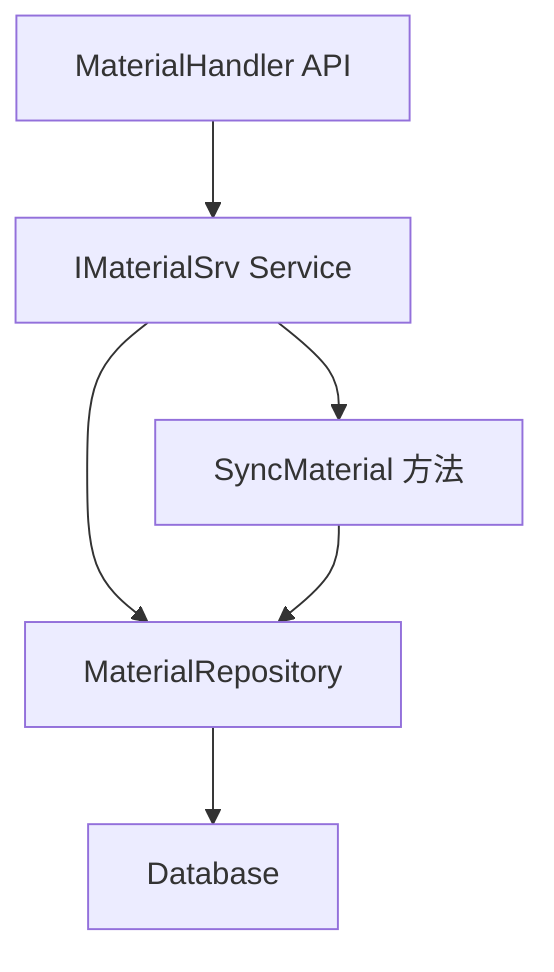

# 子店可修改总店同步物品安全库存 设计文档

> 本文档定义子店可修改总店同步物品安全库存功能的技术设计和实现方案。

## 📋 概述

本功能包含两个核心部分：
1. **新增接口**：允许子店修改总店同步物品的安全库存
2. **同步逻辑优化**：修改 `SyncMaterial` 方法，保护子店已调整的库存数据不被覆盖

**技术栈**: Go (main/)  
**涉及模块**: API 层、Service 层、Repository 层

---

## 🎯 规范对齐

### Go Main 规范 (go-main.mdc)

- ✅ Service 只依赖其他 Service 接口（不依赖 Repository）
- ✅ Repository 只持有 db 实例（不持有 DBManager）
- ✅ URL 使用 snake_case（`/api/v1/shop/material/update_safety_stock`）
- ✅ data 字段必须是对象，不能是 null 或数组
- ✅ 不使用 panic，返回 error
- ✅ 接口以 `I` 开头，实现以 `Impl` 结尾

### API 设计规范 (api.mdc)

- ✅ URL 使用 snake_case
- ✅ 响应格式：`{code, message, data{}}`
- ✅ data 字段必须是对象
- ✅ 使用 `helper.Success()` 和 `helper.ErrorWithDetail()` 统一响应

### 数据库规范 (database.mdc)

- ✅ 不需要新增表或字段（使用现有 `ttpos_material` 表的 `safety_stock` 字段）
- ✅ 使用事务保护数据一致性
- ✅ 使用索引优化查询（`idx_code`、`idx_headquarter_uuid`）

---

## 🔄 代码复用分析

### 可复用的现有组件

- **MaterialService**: `main/app/service/material.go` - 物品服务，已包含 `SyncMaterial` 方法
- **MaterialRepository**: `main/app/repository/material.go` - 物品数据访问层，已包含 `UpdateMaterialData` 方法
- **MaterialModel**: `main/app/model/material.go` - 物品模型，已包含 `SafetyStock` 字段
- **MaterialHandler**: `main/app/api/v1/shop/shop_material.go` - 物品 API 处理器，可添加新方法
- **Context**: `pkg/context` - 上下文管理，包含公司信息获取

### 集成点

- **现有 API**: `main/app/api/v1/shop/shop_material.go` - 在现有 MaterialHandler 中添加新方法
- **现有 Service**: `main/app/service/material.go` - 在 IMaterialSrv 接口中添加新方法，在 materialSrv 中实现
- **现有 Repository**: `main/app/repository/material.go` - 使用现有的 `UpdateMaterialData` 方法
- **同步逻辑**: `main/app/service/material.go` - 修改 `SyncMaterial` 方法（第2903行）

---

## 🏗️ 架构设计

### 分层设计原则

**Go Main 三层架构**:

```
API 层 (MaterialHandler)
  ↓ 依赖
业务层 (MaterialService)
  ↓ 依赖
数据层 (MaterialRepository)
```

**依赖规则**:
- ✅ API 层依赖 Service 接口
- ✅ Service 层依赖 Repository 接口（通过 DBManager 获取 Repository）
- ✅ Repository 层只持有 db 实例

### 架构图



### 模块划分

#### Go Main 模块

- **API 层**: `main/app/api/v1/shop/shop_material.go` - 添加 `UpdateSafetyStock` 方法
- **Service 层**: `main/app/service/material.go` - 添加 `UpdateMaterialSafetyStock` 方法，修改 `SyncMaterial` 方法
- **Repository 层**: `main/app/repository/material.go` - 使用现有的 `UpdateMaterialData` 方法
- **Model 层**: `main/app/model/material.go` - 使用现有的 `Material` 模型
- **DTO 层**: `main/app/dto/req/material.go` - 添加 `MaterialUpdateSafetyStockReq`
- **DTO 层**: `main/app/dto/resp/material.go` - 添加响应结构（如需要）

---

## 🗄️ 数据库设计

### 数据表设计

#### 表: ttpos_material（已存在）

**不需要新增表或字段**，使用现有的 `safety_stock` 字段：

```sql
-- 现有字段
`safety_stock` decimal(14,4) DEFAULT NULL COMMENT '安全库存数量'
```

**索引设计**:
- 主键索引: `PRIMARY KEY (id)`
- 唯一索引: `UNIQUE KEY uk_uuid (uuid)`
- 普通索引: `KEY idx_code (code)` - 用于同步时匹配物品
- 普通索引: `KEY idx_headquarter_uuid (headquarter_uuid)` - 用于查询总店同步的物品

---

## 📊 数据模型

### Go Model

```go
// main/app/model/material.go（已存在）
type Material struct {
    BaseModel
    // ... 其他字段
    SafetyStock           *float64 `gorm:"column:safety_stock;comment:'安全库存数量'"`
    HeadquarterUuid       uint64   `gorm:"default:0;column:headquarter_uuid;comment:'总部ID'"`
    // ... 其他字段
}
```

### DTO 定义

#### Request DTO

```go
// main/app/dto/req/material.go
type MaterialUpdateSafetyStockReq struct {
    Uuid        uint64   `json:"uuid" binding:"required"`        // 物品UUID
    SafetyStock *float64 `json:"safety_stock"`                   // 安全库存值（可为 null）
}
```

#### Response DTO

```go
// main/app/dto/resp/material.go（如需要）
type MaterialUpdateSafetyStockResp struct {
    Uuid        uint64   `json:"uuid"`
    SafetyStock *float64 `json:"safety_stock"`
}
```

---

## 🔌 API 设计

### RESTful API

#### API 1: 修改物品安全库存

**请求**:

- **URL**: `/api/v1/shop/material/update_safety_stock`
- **Method**: `POST`
- **Headers**:
  ```json
  {
    "Authorization": "Bearer {token}",
    "Content-Type": "application/json"
  }
  ```
- **Body**:
  ```json
  {
    "uuid": 123456,
    "safety_stock": 50.0
  }
  ```

**响应**:

```json
{
  "code": 1,
  "message": "success",
  "data": {
    "uuid": 123456,
    "safety_stock": 50.0
  }
}
```

**错误响应**:

```json
{
  "code": 0,
  "message": "非子店账号无法修改",
  "data": {}
}
```

**错误场景**:
1. 非子店账号（`headquarter_uuid = 0`）: "非子店账号无法修改"
2. 物品不存在: "物品不存在"
3. 物品不是总店同步的（`headquarter_uuid = 0`）: "只能修改总店同步的物品"
4. 参数验证失败: 返回验证错误信息

---

## 🧩 组件和接口

### Service 层

#### Service 接口扩展

```go
// main/app/service/i_material_srv.go（需要添加）
type IMaterialSrv interface {
    // ... 现有方法
    UpdateMaterialSafetyStock(ctx context.Context, req req.MaterialUpdateSafetyStockReq) error // 新增方法
}
```

#### Service 实现

```go
// main/app/service/material.go（需要添加实现）
func (s *materialSrv) UpdateMaterialSafetyStock(ctx context.Context, req req.MaterialUpdateSafetyStockReq) error {
    company := ctx.GetCompany()
    
    // 权限校验：只有子店账号才能修改
    if !company.IsSubShop() {
        return errors.New("非子店账号无法修改")
    }
    
    db := ctx.GetDB()
    materialRepo := repository.NewMaterialRepo(db)
    commonRepo := repository.NewCommonRepo()
    
    // 查询物品
    material := materialRepo.GetMaterial(
        commonRepo.WhereByUuid(req.Uuid),
        commonRepo.WhereBySoftDelete(),
    )
    
    if material.Uuid == 0 {
        return errors.New("物品不存在")
    }
    
    // 业务校验：只能修改总店同步的物品
    if material.HeadquarterUuid == 0 {
        return errors.New("只能修改总店同步的物品")
    }
    
    // 更新安全库存
    updateData := map[string]any{
        "safety_stock": req.SafetyStock,
        "update_time": time.Now().Unix(),
    }
    
    if err := materialRepo.UpdateMaterialData(updateData, commonRepo.WhereByUuid(req.Uuid)); err != nil {
        return errors.WithMessage(err, "更新安全库存失败")
    }
    
    return nil
}
```

#### SyncMaterial 方法优化

```go
// main/app/service/material.go（第3044-3096行）
// 在同步总部物品到子店时，如果子店已有该物品（通过 uuid 匹配），保留子店的安全库存

// 获取子店中已存在的总部物品，获取uuid和safety_stock的map
// 使用 *float64 类型，可以区分：nil（子店为nil，需要保留nil）、非nil（子店有值，需要保留该值）、不存在（使用总店的值）
subShopMaterialSafetyStockMap := make(map[uint64]*float64)
subShopMaterialList := materialRepo.GetMaterialList(
    commonRepo.WhereByHeadquarterUuid(companySetting.HeadquarterUuid),
    materialRepo.WithMultiLanguageName(commonRepo.WhereBySoftDelete()),
    materialRepo.WithNotBaseUnitList(commonRepo.WhereBySoftDelete()),
)
for _, subShopMaterial := range subShopMaterialList {
    // 无论子店的安全库存是否为 nil，都记录到 map 中，以保留子店的值
    subShopMaterialSafetyStockMap[subShopMaterial.Uuid] = subShopMaterial.SafetyStock
    delMaterialUuidList = append(delMaterialUuidList, subShopMaterial.Uuid)
}

// 遍历总店物品列表，创建物品
for _, material := range headMaterialList {
    // 如果子店已有该物品（通过 uuid 匹配），则保留子店的安全库存（包括 nil）
    if subShopSafetyStock, ok := subShopMaterialSafetyStockMap[material.Uuid]; ok {
        material.SafetyStock = subShopSafetyStock // 保留子店的值，可能是 nil 或具体数值
    }
    // 否则使用总店的安全库存（material.SafetyStock 保持不变）
    
    addMaterialList = append(addMaterialList, model.Material{
        // ... 包含所有字段
        SafetyStock: material.SafetyStock, // 如果子店已有则使用子店的（包括nil），否则使用总店的
        // ...
    })
}

// 统一删除后重建，在重建时保留子店已调整的安全库存
if len(delMaterialUuidList) > 0 {
    materialRepo.DestroyMaterial(commonRepo.WhereInUuids(delMaterialUuidList))
}
if len(addMaterialList) > 0 {
    materialRepo.CreateMaterialList(addMaterialList)
}
```

### Repository 层

**使用现有的 Repository 方法**，不需要新增：

- `GetMaterialList(opts ...DBOption) []model.Material` - 查询物品列表（用于获取子店已存在的物品）
- `CreateMaterialList(materials []model.Material) error` - 批量创建物品
- `DestroyMaterial(opts ...DBOption) error` - 删除物品

### API 层

```go
// main/app/api/v1/shop/shop_material.go（需要添加）
// UpdateSafetyStock 修改物品安全库存
// @Summary 修改物品安全库存
// @Description 子店修改总店同步物品的安全库存
// @Tags 商家端.物品管理
// @Accept json
// @Produce json
// @Security JwtToken
// @Param request body req.MaterialUpdateSafetyStockReq true "请求参数"
// @Success 200 {object} helper.Response "成功"
// @Failure 400 {object} helper.Response "错误请求"
// @Router /shop/material/update_safety_stock [post]
func (h *MaterialHandler) UpdateSafetyStock(c *gin.Context) {
    ctx := helper.GetContext(c)
    var req req.MaterialUpdateSafetyStockReq
    
    if err := c.ShouldBindJSON(&req); err != nil {
        helper.HandleValidationError(c, err, req, dto.PageReqMessage)
        return
    }
    
    if err := h.materialSrv.UpdateMaterialSafetyStock(ctx, req); err != nil {
        helper.ErrorWithDetail(c, constant.CodeFail, errors.WithMessage(err))
        return
    }
    
    helper.Success(c, gin.H{
        "data": gin.H{
            "uuid":         req.Uuid,
            "safety_stock": req.SafetyStock,
        },
    })
}
```

---

## ⚡ 缓存设计

**本功能不需要缓存**，因为：
- 修改操作频率低
- 数据实时性要求高
- 安全库存修改后需要立即生效

---

## 🚨 错误处理

### 错误场景

#### 场景 1: 非子店账号调用接口

- **处理方式**: 在 Service 层检查 `company.IsSubShop()`
- **用户影响**: 返回错误 "非子店账号无法修改"
- **代码示例**:
  ```go
  if !company.IsSubShop() {
      return errors.New("非子店账号无法修改")
  }
  ```

#### 场景 2: 物品不存在

- **处理方式**: 查询物品后检查 `material.Uuid == 0`
- **用户影响**: 返回错误 "物品不存在"
- **代码示例**:
  ```go
  if material.Uuid == 0 {
      return errors.New("物品不存在")
  }
  ```

#### 场景 3: 物品不存在（已删除）

- **处理方式**: 查询物品后检查 `material.Uuid == 0` 或 `material.DeleteTime > 0`
- **用户影响**: 返回错误 "物品不存在"
- **代码示例**:
  ```go
  if material.Uuid == 0 {
      return errors.New("物品不存在")
  }
  ```

#### 场景 4: 同步时数据库更新失败

- **处理方式**: 记录错误日志，继续处理下一个物品
- **用户影响**: 同步任务继续执行，失败的物品记录在日志中
- **代码示例**:
  ```go
  if err := materialRepo.UpdateMaterialData(updateData, ...); err != nil {
      logger.Logger.Error("更新物品失败", zap.String("code", material.Code), zap.Error(err))
      continue
  }
  ```

---

## 🔒 安全设计

### 身份验证

- **JWT Token**: 所有 API 需要 Token 验证（通过 middleware）
- **权限校验**: 只有子店账号（`headquarter_uuid > 0`）才能调用

### 权限控制

- **业务校验**: 子店可以修改自己物品和总店同步物品的安全库存
- **数据隔离**: 通过 `company.Uuid` 隔离不同公司的数据

### 数据安全

- **SQL 注入防护**: 使用 GORM 参数化查询
- **事务保护**: 使用数据库事务确保数据一致性

---

## 🧪 测试策略

### 单元测试

**目标覆盖率**:
- Service 层: 70%+
- Repository 层: 80%+（使用现有方法，已有测试）

**测试内容**:
- `UpdateMaterialSafetyStock` 方法的正常场景和异常场景
- `SyncMaterial` 方法的库存字段保护逻辑

**测试用例**:
1. 子店账号修改总店同步物品的安全库存 - 成功
2. 子店账号修改自己创建的物品的安全库存 - 成功
3. 非子店账号调用接口 - 返回错误
4. 物品不存在 - 返回错误
5. 同步时子店已有物品且安全库存不为 nil - 保留子店的安全库存
6. 同步时子店已有物品但安全库存为 nil - 保留 nil，不覆盖为总店的安全库存
7. 同步时子店没有物品 - 创建新记录并使用总店的安全库存

### API 测试

**测试内容**:
- API 接口调用
- 参数验证
- 响应格式
- 错误处理

### 集成测试

**测试流程**:
1. 子店同步总店物品
2. 子店修改安全库存
3. 再次同步总店物品
4. 验证安全库存未被覆盖

---

## 📈 性能优化

### 优化策略

1. **数据库优化**:
   - 使用索引 `idx_code` 和 `idx_headquarter_uuid` 优化查询
   - 使用 `UpdateMaterialData` 批量更新（如需要）

2. **同步优化**:
   - 在事务中批量处理物品更新
   - 使用 `continue` 跳过失败项，不影响整体同步

### 性能指标

- 接口响应时间: < 200ms
- 数据库查询: < 50ms（使用索引）
- 同步操作: 批量处理，单条物品更新 < 10ms

---

## 📚 实现清单

### Phase 1: DTO 和 Service 层

- [ ] 创建 Request DTO: `MaterialUpdateSafetyStockReq`
- [ ] 在 `IMaterialSrv` 接口中添加 `UpdateMaterialSafetyStock` 方法
- [ ] 实现 `UpdateMaterialSafetyStock` 方法
- [ ] 编写 Service 单元测试

### Phase 2: API 层

- [ ] 在 `MaterialHandler` 中添加 `UpdateSafetyStock` 方法
- [ ] 注册 API 路由
- [ ] 编写 API 集成测试

### Phase 3: 同步逻辑优化

- [ ] 修改 `SyncMaterial` 方法，添加库存字段保护逻辑
- [ ] 测试同步逻辑（子店已有物品时不覆盖库存字段）
- [ ] 测试同步逻辑（子店没有物品时同步所有字段）

### Phase 4: 测试和文档

- [ ] 单元测试
- [ ] API 测试
- [ ] 集成测试
- [ ] 文档更新

**详细任务**: 参见 `tasks.md`

---

## Graphiti & 活动日志

- Related Episode: `[待补充]`
- 模板：`docs/agent/templates/graphiti-episode.md`
- 活动日志：`docs/team/activities/{YYYY-MM}/{YYYY-MM-DD}.md`
- 在技术方案评审、关键架构决策或踩坑总结后，立即补充 Episode 并在设计文档尾部互链。

---

**版本**: v1.0.0  
**创建日期**: 2025-12-08  
**作者**: 曾振华  
**审核者**: 待分配
