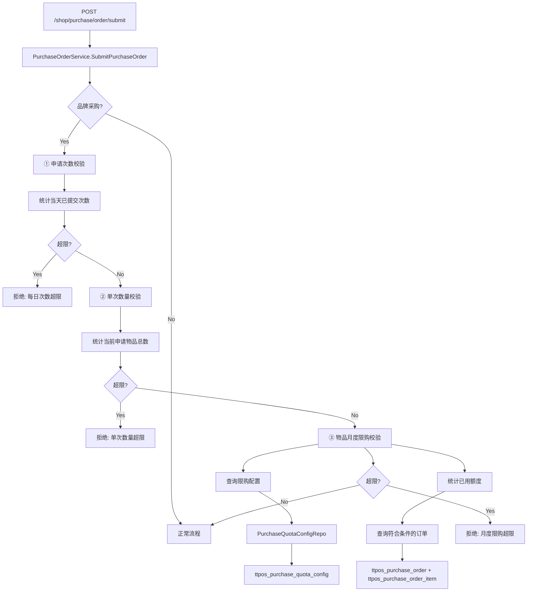

# 品牌采购限额控制 设计文档

> 本文档定义品牌采购限额控制功能的技术设计和实现方案（包含申请次数限制、物品数量限制、月度限购）。

## 📋 概述

本功能在品牌采购流程中增加三维度限额校验机制：

1. **申请次数限制**：门店每天最多提交 N 次品牌采购申请（默认2次）
2. **单次数量限制**：单次申请物品总数量不超过 M 件（默认100件）
3. **物品月度限购**：特定物品每月采购总量不超过配置限额

当子店提交品牌采购申请时，系统按顺序执行以上三个维度的校验，任一维度超限则拒绝提交。

**核心特点**:
- **实时查询统计模式**: 无需维护额外状态，驳回订单自动释放限额
- **物品级别限购**: 按 material_uuid + unit_uuid 精准控制
- **全局与物品配置结合**: 申请次数和单次数量为全局配置，月度限购为物品级配置
- **MVP 范围**: 仅后端实现，前端配置暂缓

---

## 🎯 规范对齐

### Go Main 规范 (go-main.mdc)

**分层设计**:
- ✅ Service 只依赖其他 Service 接口
- ✅ Repository 只持有 db 实例，不持有 DBManager
- ✅ 不使用 panic，返回 error

**命名规范**:
- ✅ 接口以 `I` 开头: `IPurchaseQuotaConfigRepo`
- ✅ 实现以 `Impl` 结尾: `purchaseQuotaConfigRepoImpl`
- ✅ URL 使用 snake_case: 无新增 API

**响应格式**:
- ✅ data 字段必须是对象
- ✅ 错误使用 errors.WithMessage 包装

### API 设计规范 (api.mdc)

**MVP 阶段无新增 API**，校验逻辑集成在现有的品牌采购提交接口中：
- 接口路径: `/api/v1/shop/purchase/order/submit`（已存在）
- Method: `POST`
- 响应格式: `{code, message, data{}}`

### 数据库规范 (database.mdc)

✅ **必需字段完整**:
- `id`, `uuid`, `create_time`, `update_time`, `delete_time`

✅ **字段类型规范**:
- 时间字段使用 `int` 类型，`_time` 结尾，默认值 0
- 金额/数量字段使用 `decimal(10,2)`
- UUID 字段使用 `bigint unsigned`

✅ **命名规范**:
- 表名使用 `ttpos_` 前缀
- 字段名使用 `snake_case`

---

## 🔄 代码复用分析

### 可复用的现有组件

1. **品牌采购服务**: `main/app/service/purchase_order/purchase_order.go`
   - 复用: 在 `SubmitPurchaseOrder` 方法中集成限购校验
   - 方式: 新增限购校验逻辑块

2. **品牌采购订单模型**: `main/app/model/purchase_order.go`
   - 复用: 查询订单状态和物品信息
   - 方式: 直接使用现有 Model

3. **雪花算法工具**: `main/pkg/utils/snowflake.go`
   - 复用: 生成限购配置的业务 UUID
   - 方式: `snowflake.GenerateUuid()`

4. **多语言工具**: `main/pkg/i18n/`
   - 复用: 实现错误提示的国际化
   - 方式: 在 i18n 文件中添加限购相关文案

### 集成点

1. **提交接口集成**:
   - 位置: `PurchaseOrderService.SubmitPurchaseOrder()`
   - 集成方式: 在订单状态校验后、提交前增加三维度限购校验逻辑
   - 校验顺序: ① 申请次数限制 → ② 单次数量限制 → ③ 物品月度限购
   - 影响: 仅对 PurchaseType=2（品牌采购）生效

2. **数据库表关联**:
   - 新表 `ttpos_purchase_quota_config` 通过 `material_uuid` 关联物品
   - 查询统计时关联 `ttpos_purchase_order` 和 `ttpos_purchase_order_item`
   - 全局配置通过 `ttpos_config` 表管理（申请次数、单次数量上限）

---

## 🏗️ 架构设计

### 分层设计原则

**Go Main 三层架构**:

```
提交接口 (PurchaseOrderService.SubmitPurchaseOrder)
  ↓ 新增三维度限购校验逻辑
① 申请次数校验 (统计当天已提交次数)
  ↓ 查询
数据库 (ttpos_purchase_order)
  ↓ 通过
② 单次数量校验 (统计当前申请物品总数量)
  ↓ 通过
③ 物品月度限购校验
  ↓ 调用
限购配置 Repository (PurchaseQuotaConfigRepo)
  ↓ 查询
数据库 (ttpos_purchase_quota_config, ttpos_purchase_order, ttpos_purchase_order_item)
```

**依赖规则**:
- ✅ PurchaseOrderService 内部方法调用 PurchaseQuotaConfigRepo
- ✅ Repository 只持有 db 实例
- ❌ 不创建新的 Service（MVP 阶段简化）

### 架构图



### 模块划分

#### Go Main 模块

- **Repository 层**: `main/app/repository/`
  - 新增: `purchase_quota_config_repo.go` - 限购配置数据访问
  - 新增: `i_purchase_quota_config_repo.go` - 限购配置接口

- **Model 层**: `main/app/model/`
  - 新增: `purchase_quota_config.go` - 限购配置模型

- **Constant 层**: `main/app/constant/`
  - 新增: `purchase_quota.go` - 限购相关常量

- **Service 层**: `main/app/service/purchase_order/`
  - 修改: `purchase_order.go` - 集成限购校验逻辑

- **i18n 层**: `main/i18n/`
  - 修改: 各语言文件 - 添加限购错误提示

---

## 🗄️ 数据库设计

### 数据表设计

#### 表1: ttpos_purchase_quota_config（主表）

```sql
CREATE TABLE IF NOT EXISTS `ttpos_purchase_quota_config` (
    `id` INT(11) UNSIGNED NOT NULL AUTO_INCREMENT COMMENT '自增ID',
    `uuid` BIGINT(20) UNSIGNED NOT NULL DEFAULT 0 COMMENT '绑定记录ID（雪花算法生成）',
    `material_uuid` BIGINT(20) UNSIGNED NOT NULL COMMENT '物品UUID',
    `material_code` VARCHAR(100) NOT NULL DEFAULT '' COMMENT '物品编码（冗余，便于查询）',
    `unit_uuid` BIGINT(20) UNSIGNED NOT NULL COMMENT '限购单位UUID',
    `unit_name` VARCHAR(50) NOT NULL DEFAULT '' COMMENT '限购单位名称（冗余）',
    `quota_limit` DECIMAL(10,2) NOT NULL DEFAULT 0.00 COMMENT '限购数量',
    
    -- 门店范围控制
    `apply_to_all_shops` TINYINT(4) NOT NULL DEFAULT 1 COMMENT '是否应用到全部店铺: 1=是 0=否',
    
    -- 扩展字段（预留）
    `period_type` TINYINT(4) NOT NULL DEFAULT 0 COMMENT '周期类型: 0=按天(默认) 1=月度',
    `strict_mode` TINYINT(4) NOT NULL DEFAULT 1 COMMENT '超限策略: 1=严格拒绝',
    `config_source` TINYINT(4) NOT NULL DEFAULT 1 COMMENT '配置来源: 1=门店 2=总部',
    
    -- 状态字段
    `status` TINYINT(4) NOT NULL DEFAULT 1 COMMENT '状态: 1=启用 0=禁用',
    `create_time` INT(10) NOT NULL DEFAULT 0 COMMENT '创建时间(时间戳)',
    `update_time` INT(10) NOT NULL DEFAULT 0 COMMENT '更新时间(时间戳)',
    `delete_time` INT(10) NOT NULL DEFAULT 0 COMMENT '删除时间(时间戳)',
    
    PRIMARY KEY (`id`),
    UNIQUE KEY `uk_uuid` (`uuid`),
    KEY `idx_material` (`material_uuid`),
    KEY `idx_status` (`status`),
    KEY `idx_delete_time` (`delete_time`)
) ENGINE=InnoDB DEFAULT CHARSET=utf8mb4 COMMENT='品牌采购限购配置';
```

**字段说明**:
| 字段 | 类型 | 说明 | 约束 |
|------|------|------|------|
| id | int unsigned | 主键 ID | AUTO_INCREMENT |
| uuid | bigint unsigned | 唯一标识 | DEFAULT 0 |
| material_uuid | bigint unsigned | 物品UUID | NOT NULL |
| material_code | varchar(100) | 物品编码（冗余） | DEFAULT '' |
| unit_uuid | bigint unsigned | 限购单位UUID | NOT NULL |
| unit_name | varchar(50) | 限购单位名称（冗余） | DEFAULT '' |
| quota_limit | decimal(10,2) | 限购数量 | DEFAULT 0.00 |
| apply_to_all_shops | tinyint(4) | 是否应用到全部店铺: 1=是 0=否 | DEFAULT 1 |
| period_type | tinyint(4) | 周期类型: 0=按天(默认) 1=月度 | DEFAULT 0 |
| strict_mode | tinyint(4) | 超限策略: 1=严格拒绝 | DEFAULT 1 |
| config_source | tinyint(4) | 配置来源: 1=门店 2=总部 | DEFAULT 1 |
| status | tinyint(4) | 状态: 1=启用 0=禁用 | DEFAULT 1 |
| create_time | int | 创建时间 | DEFAULT 0 |
| update_time | int | 更新时间 | DEFAULT 0 |
| delete_time | int | 删除时间 | DEFAULT 0 |

**索引设计**:
- 主键索引: `PRIMARY KEY (id)`
- 唯一索引: `UNIQUE KEY uk_uuid (uuid)` - UUID 唯一性保证
- 普通索引: `KEY idx_material (material_uuid)` - 按物品查询配置
- 普通索引: `KEY idx_status (status)` - 查询启用的配置
- 普通索引: `KEY idx_delete_time (delete_time)` - 软删除查询优化

**迁移文件**: `admin/database/migrations/{YYYYMMDDHHMMSS}_create_ttpos_purchase_quota_config_table.php`

#### 表2: ttpos_purchase_quota_config_shop（关联表）

```sql
CREATE TABLE IF NOT EXISTS `ttpos_purchase_quota_config_shop` (
    `id` INT(11) UNSIGNED NOT NULL AUTO_INCREMENT COMMENT '自增ID',
    `config_uuid` BIGINT(20) UNSIGNED NOT NULL COMMENT '限购配置UUID',
    `shop_uuid` BIGINT(20) UNSIGNED NOT NULL COMMENT '门店UUID',
    
    -- 状态字段
    `create_time` INT(10) NOT NULL DEFAULT 0 COMMENT '创建时间(时间戳)',
    `delete_time` INT(10) NOT NULL DEFAULT 0 COMMENT '删除时间(时间戳)',
    
    PRIMARY KEY (`id`),
    UNIQUE KEY `uk_config_shop` (`config_uuid`, `shop_uuid`),
    KEY `idx_config` (`config_uuid`),
    KEY `idx_shop` (`shop_uuid`),
    KEY `idx_delete_time` (`delete_time`)
) ENGINE=InnoDB DEFAULT CHARSET=utf8mb4 COMMENT='品牌采购限购配置门店关联';
```

**字段说明**:
| 字段 | 类型 | 说明 | 约束 |
|------|------|------|------|
| id | int unsigned | 主键 ID | AUTO_INCREMENT |
| config_uuid | bigint unsigned | 限购配置UUID | NOT NULL |
| shop_uuid | bigint unsigned | 门店UUID | NOT NULL |
| create_time | int | 创建时间 | DEFAULT 0 |
| delete_time | int | 删除时间 | DEFAULT 0 |

**索引设计**:
- 主键索引: `PRIMARY KEY (id)`
- 唯一索引: `UNIQUE KEY uk_config_shop (config_uuid, shop_uuid)` - 防止重复关联
- 普通索引: `KEY idx_config (config_uuid)` - 按配置查询门店
- 普通索引: `KEY idx_shop (shop_uuid)` - 按门店查询配置
- 普通索引: `KEY idx_delete_time (delete_time)` - 软删除查询优化

**设计说明**:
- 移除了 `shop_uuids` JSON 字段，改用关联表存储多对多关系
- `apply_to_all_shops=1` 时，关联表无记录（表示全部门店）
- `apply_to_all_shops=0` 时，关联表存储选中的门店列表
- 查询逻辑：先查主表判断 `apply_to_all_shops`，若为 0 则 JOIN 关联表过滤
- 数据一致性：删除配置时需同步软删除关联表记录

**迁移文件**: `admin/database/migrations/{YYYYMMDDHHMMSS}_create_ttpos_purchase_quota_config_shop_table.php`

#### 表: ttpos_shop_config (扩展现有表)

门店级配置存储每日品类申请数限制，扩展现有的门店配置表或使用专门的配置表：

**方案1：使用现有 ttpos_config 表 + shop_uuid**

如果 `ttpos_config` 表已支持 `shop_uuid` 字段，直接使用：

```sql
-- 为每个门店添加配置记录
INSERT INTO `ttpos_config` (`name`, `value`, `shop_uuid`, `description`, `create_time`) VALUES
('purchase.brand.daily_limit', '2', {shop_uuid}, '品牌采购每日申请次数上限（门店级）', UNIX_TIMESTAMP());
```

**方案2：新建门店配置表（推荐）**

```sql
CREATE TABLE IF NOT EXISTS `ttpos_shop_purchase_config` (
    `id` INT(11) UNSIGNED NOT NULL AUTO_INCREMENT COMMENT '自增ID',
    `shop_uuid` BIGINT(20) UNSIGNED NOT NULL COMMENT '门店UUID',
    `daily_limit` INT(11) NOT NULL DEFAULT 2 COMMENT '每日采购申请次数上限',
    
    -- 状态字段
    `create_time` INT(10) NOT NULL DEFAULT 0 COMMENT '创建时间(时间戳)',
    `update_time` INT(10) NOT NULL DEFAULT 0 COMMENT '更新时间(时间戳)',
    `delete_time` INT(10) NOT NULL DEFAULT 0 COMMENT '删除时间(时间戳)',
    
    PRIMARY KEY (`id`),
    UNIQUE KEY `uk_shop` (`shop_uuid`),
    KEY `idx_delete_time` (`delete_time`)
) ENGINE=InnoDB DEFAULT CHARSET=utf8mb4 COMMENT='门店采购配置';
```

**设计说明**:
- 每个门店一条配置记录
- 如果门店未配置，使用全局默认值
- 门店配置优先级 > 全局配置

#### 全局配置项 (ttpos_config)

品牌采购申请的全局限制使用现有的 `ttpos_config` 表进行管理：

| 配置键 | 类型 | 默认值 | 说明 |
| ---- | ---- | ---- | ---- |
| `purchase.brand.daily_limit` | int | 2 | 每个门店每天最多提交品牌采购申请次数 |
| `purchase.brand.single_qty_limit` | int | 100 | 单次品牌采购申请物品总数量上限 |

**初始化数据**（通过 SQL 或 Seeder 添加）：

```sql
INSERT INTO `ttpos_config` (`name`, `value`, `description`, `create_time`) VALUES
('purchase.brand.daily_limit', '2', '品牌采购每日申请次数上限', UNIX_TIMESTAMP()),
('purchase.brand.single_qty_limit', '100', '品牌采购单次物品数量上限', UNIX_TIMESTAMP());
```

**读取方式**：

```go
// 在 Service 中读取全局配置
dailyLimit := config.GetInt("purchase.brand.daily_limit", 2)
singleQtyLimit := config.GetInt("purchase.brand.single_qty_limit", 100)
```

### 数据库迁移

**迁移脚本**:

```bash
# 创建迁移文件
cd admin
php think migrate:create CreateTtposPurchaseQuotaConfigTable

# 执行迁移
php think migrate:run
```

**参考**: `docs/agent/workflows/database-migration.md`

---

## 📊 数据模型

### Go Model

```go
// main/app/model/purchase_quota_config.go
package model

// PurchaseQuotaConfig 品牌采购限购配置主表
type PurchaseQuotaConfig struct {
	Id              uint64  `gorm:"column:id;primaryKey" json:"id"`
	Uuid            uint64  `gorm:"column:uuid;uniqueIndex" json:"uuid"`
	MaterialUuid    uint64  `gorm:"column:material_uuid;not null" json:"material_uuid"`
	MaterialCode    string  `gorm:"column:material_code;type:varchar(100);default:''" json:"material_code"`
	UnitUuid        uint64  `gorm:"column:unit_uuid;not null" json:"unit_uuid"`
	UnitName        string  `gorm:"column:unit_name;type:varchar(50);default:''" json:"unit_name"`
	QuotaLimit      float64 `gorm:"column:quota_limit;type:decimal(10,2);default:0.00" json:"quota_limit"`
	ApplyToAllShops uint8   `gorm:"column:apply_to_all_shops;default:1" json:"apply_to_all_shops"`
	PeriodType      uint8   `gorm:"column:period_type;default:0" json:"period_type"`
	StrictMode      uint8   `gorm:"column:strict_mode;default:1" json:"strict_mode"`
	ConfigSource    uint8   `gorm:"column:config_source;default:1" json:"config_source"`
	Status          uint8   `gorm:"column:status;default:1" json:"status"`
	CreateTime      int64   `gorm:"column:create_time;default:0" json:"create_time"`
	UpdateTime      int64   `gorm:"column:update_time;default:0" json:"update_time"`
	DeleteTime      int64   `gorm:"column:delete_time;index;default:0" json:"delete_time"`
	
	// 关联关系（不会序列化到 JSON）
	Shops []PurchaseQuotaConfigShop `gorm:"foreignKey:ConfigUuid;references:Uuid" json:"-"`
}

func (*PurchaseQuotaConfig) TableName() string {
	return "ttpos_purchase_quota_config"
}

// PurchaseQuotaConfigShop 品牌采购限购配置门店关联表
type PurchaseQuotaConfigShop struct {
	Id         uint64 `gorm:"column:id;primaryKey" json:"id"`
	ConfigUuid uint64 `gorm:"column:config_uuid;not null" json:"config_uuid"`
	ShopUuid   uint64 `gorm:"column:shop_uuid;not null" json:"shop_uuid"`
	CreateTime int64  `gorm:"column:create_time;default:0" json:"create_time"`
	DeleteTime int64  `gorm:"column:delete_time;index;default:0" json:"delete_time"`
}

func (*PurchaseQuotaConfigShop) TableName() string {
	return "ttpos_purchase_quota_config_shop"
}

// GetShopUuidList 获取配置关联的门店UUID列表
func (p *PurchaseQuotaConfig) GetShopUuidList() []uint64 {
	uuids := make([]uint64, 0, len(p.Shops))
	for _, shop := range p.Shops {
		if shop.DeleteTime == 0 {
			uuids = append(uuids, shop.ShopUuid)
		}
	}
	return uuids
}

// AppliesTo 检查配置是否应用到指定门店
func (p *PurchaseQuotaConfig) AppliesTo(shopUuid uint64) bool {
	// 应用到全部店铺
	if p.ApplyToAllShops == 1 {
		return true
	}
	
	// 检查是否在关联门店列表中
	for _, shop := range p.Shops {
		if shop.ShopUuid == shopUuid && shop.DeleteTime == 0 {
			return true
		}
	}
	return false
}
```

### 常量定义

```go
// main/app/constant/purchase_quota.go
package constant

// 限购配置状态
const (
	PurchaseQuotaConfigStatusDisabled = 0 // 禁用
	PurchaseQuotaConfigStatusEnabled  = 1 // 启用
)

// 限购周期类型
const (
	PurchaseQuotaPeriodTypeDaily     = 0 // 按天（默认）
	PurchaseQuotaPeriodTypeMonthly   = 1 // 月度
	PurchaseQuotaPeriodTypeQuarterly = 2 // 季度（预留）
	PurchaseQuotaPeriodTypeYearly    = 3 // 年度（预留）
)

// 限购超限策略
const (
	PurchaseQuotaStrictModeStrict = 1 // 严格拒绝
	PurchaseQuotaStrictModeSoft   = 2 // 柔性提醒（预留）
)

// 限购配置来源
const (
	PurchaseQuotaConfigSourceShop        = 1 // 门店自配
	PurchaseQuotaConfigSourceHeadquarter = 2 // 总部下发
)
```

---

## 🔌 核心逻辑设计

### 限购校验流程

```go
// main/app/service/purchase_order/purchase_order.go

// SubmitPurchaseOrder 提交采购订单
func (s *purchaseOrderSrv) SubmitPurchaseOrder(ctx *gin.Context, req *dto_req.SubmitPurchaseOrderReq) error {
	// ... 现有逻辑 ...
	
	// 🔥 新增：品牌采购三维度限额校验
	if order.PurchaseType == constant.PurchaseTypeBrand {
		// ① 检查申请次数限制
		if err := s.checkDailySubmitLimit(ctx, order.ShopUuid); err != nil {
			return err
		}
		
		// ② 检查单次数量限制
		if err := s.checkSingleQtyLimit(ctx, order); err != nil {
			return err
		}
		
		// ③ 检查物品月度限购
		if err := s.checkPurchaseQuota(ctx, order); err != nil {
			return err
		}
	}
	
	// ... 提交逻辑 ...
}

// checkDailySubmitLimit 检查每日申请次数限制
func (s *purchaseOrderSrv) checkDailySubmitLimit(ctx *gin.Context, shopUuid uint64) error {
	// 读取全局配置
	dailyLimit := config.GetInt("purchase.brand.daily_limit", 2)
	
	// 获取店铺时区
	shop, err := s.shopRepo.GetByUuid(shopUuid)
	if err != nil {
		return errors.WithMessage(err, "获取店铺信息失败")
	}
	
	// 使用店铺时区计算当天的起止时间戳
	location := time.FixedZone(shop.Timezone, shop.TimezoneOffset*60)
	now := time.Now().In(location)
	todayStart := time.Date(now.Year(), now.Month(), now.Day(), 0, 0, 0, 0, location).Unix()
	todayEnd := time.Date(now.Year(), now.Month(), now.Day(), 23, 59, 59, 0, location).Unix()
	
	// 统计当天已提交的申请次数
	db := s.dbm.GetDB(ctx)
	var count int64
	err = db.Model(&model.PurchaseOrder{}).
		Where("shop_uuid = ?", shopUuid).
		Where("purchase_type = ?", constant.PurchaseTypeBrand).
		Where("status != ?", 0). // 排除草稿
		Where("create_time >= ? AND create_time <= ?", todayStart, todayEnd).
		Where("delete_time = 0").
		Count(&count).Error
	
	if err != nil {
		return errors.WithMessage(err, "查询每日申请次数失败")
	}
	
	// 校验是否超限
	if count >= int64(dailyLimit) {
		return fmt.Errorf(i18n.T(ctx, "purchase.daily_limit_exceeded", dailyLimit))
	}
	
	return nil
}

// checkSingleQtyLimit 检查单次数量限制
func (s *purchaseOrderSrv) checkSingleQtyLimit(ctx *gin.Context, order *model.PurchaseOrder) error {
	// 读取全局配置
	singleQtyLimit := config.GetInt("purchase.brand.single_qty_limit", 100)
	
	// 统计当前申请的物品总数量
	var totalQty float64
	for _, item := range order.Items {
		totalQty += item.Num
	}
	
	// 校验是否超限
	if totalQty > float64(singleQtyLimit) {
		return fmt.Errorf(i18n.T(ctx, "purchase.single_qty_exceeded", singleQtyLimit))
	}
	
	return nil
}

// checkPurchaseQuota 检查品牌采购限购
func (s *purchaseOrderSrv) checkPurchaseQuota(ctx *gin.Context, order *model.PurchaseOrder) error {
	repo := repository.NewPurchaseQuotaConfigRepo(s.dbm.GetDB(ctx))
	
	// 遍历订单明细，逐个检查限购
	for _, item := range order.Items {
		// 1. 查询该物品的限购配置（支持门店维度）
		config, err := repo.GetByMaterialUuidAndShop(item.MaterialUuid, order.ShopUuid)
		if err != nil {
			if errors.Is(err, gorm.ErrRecordNotFound) {
				// 无限购配置，跳过
				continue
			}
			return errors.WithMessage(err, "获取品牌采购限购配置失败")
		}
		
		// 2. 校验单位是否匹配
		if item.UnitUuid != config.UnitUuid {
			return fmt.Errorf("品牌采购物品[%s]限购单位为[%s]，请使用指定单位", 
				item.MaterialName, config.UnitName)
		}
		
		// 3. 查询本月已使用额度
		usedQty, err := s.getMonthlyUsedQuota(ctx, item.MaterialUuid, item.UnitUuid, order.Uuid, order.ShopUuid)
		if err != nil {
			return errors.WithMessage(err, "查询品牌采购已使用额度失败")
		}
		
		// 4. 校验是否超限
		if usedQty+item.Num > config.QuotaLimit {
			return fmt.Errorf("品牌采购物品[%s]本月限购%.2f%s，已使用%.2f，本次申请%.2f，超出限额",
				item.MaterialName, config.QuotaLimit, config.UnitName, usedQty, item.Num)
		}
	}
	
	return nil
}

// getMonthlyUsedQuota 查询本月已使用额度（实时统计）
func (s *purchaseOrderSrv) getMonthlyUsedQuota(
	ctx *gin.Context,
	materialUuid uint64,
	unitUuid uint64,
	excludeOrderUuid uint64,
	shopUuid uint64, // 🔥 新增：门店UUID
) (float64, error) {
	db := s.dbm.GetDB(ctx)
	
	// 当前月份（格式：2026-01）
	currentMonth := time.Now().Format("2006-01")
	
	var usedQty float64
	err := db.Table("ttpos_purchase_order po").
		Select("COALESCE(SUM(poi.num), 0) as used_qty").
		Joins("JOIN ttpos_purchase_order_item poi ON po.uuid = poi.purchase_order_uuid").
		Where("po.shop_uuid = ?", shopUuid). // 🔥 新增：按门店过滤
		Where("po.purchase_type = ?", constant.PurchaseTypeBrand). // 品牌采购
		Where("poi.material_uuid = ?", materialUuid).
		Where("poi.unit_uuid = ?", unitUuid).
		Where("po.status IN (?)", []int{1, 2, 4, 5}). // 待审核、已通过、部分收货、待总部审核
		Where("po.uuid != ?", excludeOrderUuid). // 排除当前单据
		Where("FROM_UNIXTIME(po.create_time, '%Y-%m') = ?", currentMonth).
		Where("po.delete_time = 0").
		Scan(&usedQty).Error
	
	return usedQty, err
}
```

### 订单状态说明

**计入限额的状态**:
- `1` - 待审核
- `2` - 已通过
- `4` - 部分收货
- `5` - 待总部审核

**不计入限额的状态**:
- `0` - 草稿（未提交）
- `3` - 已驳回（被拒绝）
- `6` - 全部收货（已完成）

**驳回后的处理**:
- 订单被驳回 → status 变为 3
- 下次限购校验 → 查询 `status IN (1,2,4,5)`
- 已驳回订单不在查询范围 → 限额自动"释放"

---

## 🌐 API 设计

### API 列表

| API | Method | Path | 说明 | 终端 |
|----|--------|------|------|------|
| 创建/更新限购配置 | POST | `/api/v1/shop/purchase/quota/config` | 创建或更新物品限购配置 | shop |
| 查询限购配置 | GET | `/api/v1/shop/purchase/quota/config/{material_uuid}` | 查询指定物品的限购配置 | shop |
| 删除限购配置 | DELETE | `/api/v1/shop/purchase/quota/config/{uuid}` | 删除限购配置 | shop |
| 获取门店配置 | GET | `/api/v1/shop/config/{shop_uuid}` | 获取门店采购配置 | shop |
| 更新门店配置 | POST | `/api/v1/shop/config/{shop_uuid}` | 更新门店采购配置 | shop |

---

### API 1: 创建/更新限购配置

**请求**:
```http
POST /api/v1/shop/purchase/quota/config
Content-Type: application/json

{
  "material_uuid": 123456789,
  "material_code": "WP001",
  "unit_uuid": 987654321,
  "unit_name": "kg",
  "quota_limit": 100.00,
  "period_type": 1,
  "apply_to_all_shops": true,
  "shop_uuids": []  // apply_to_all_shops=false时必填，存储到关联表
}
```

**响应**:
```json
{
  "code": 0,
  "message": "success",
  "data": {
    "uuid": 111222333444,
    "material_uuid": 123456789,
    "quota_limit": 100.00,
    "apply_to_all_shops": true,
    "shop_count": 0  // 应用的门店数量，0表示全部
  }
}
```

**业务规则**:
- 如果物品已有配置，执行更新操作
- `apply_to_all_shops=true` 时，忽略 `shop_uuids`，并软删除所有关联表记录
- `apply_to_all_shops=false` 时，`shop_uuids` 不能为空
- 保存配置时需使用事务：
  1. 更新/创建主表记录
  2. 如果 `apply_to_all_shops=false`，先软删除旧关联，再批量插入新关联
  3. 如果 `apply_to_all_shops=true`，软删除所有关联表记录

---

### API 2: 查询限购配置

**请求**:
```http
GET /api/v1/shop/purchase/quota/config/123456789
```

**响应**:
```json
{
  "code": 0,
  "message": "success",
  "data": {
    "uuid": 111222333444,
    "material_uuid": 123456789,
    "material_code": "WP001",
    "unit_uuid": 987654321,
    "unit_name": "kg",
    "quota_limit": 100.00,
    "period_type": 1,
    "apply_to_all_shops": true,
    "shop_uuids": [],
    "shop_count": 0,
    "status": 1,
    "create_time": 1704672000,
    "update_time": 1704672000
  }
}
```

**业务规则**:
- 如果未找到配置，返回 `data: null`
- 只返回启用状态的配置

---

### API 3: 删除限购配置

**请求**:
```http
DELETE /api/v1/shop/purchase/quota/config/111222333444
```

**响应**:
```json
{
  "code": 0,
  "message": "success",
  "data": {}
}
```

**业务规则**:
- 软删除主表（设置 `delete_time`）
- 同时软删除关联表的所有记录（事务保证一致性）
- 删除后该物品不再有限购限制

---

### API 4: 获取门店配置

**请求**:
```http
GET /api/v1/shop/config/123456789
```

**响应**:
```json
{
  "code": 0,
  "message": "success",
  "data": {
    "shop_uuid": 123456789,
    "purchase_daily_limit": 2,
    "purchase_single_qty_limit": 100
  }
}
```

**业务规则**:
- 如果门店未配置，返回全局默认值
- 门店配置优先级 > 全局配置

---

### API 5: 更新门店配置

**请求**:
```http
POST /api/v1/shop/config/123456789
Content-Type: application/json

{
  "purchase_daily_limit": 3,
  "purchase_single_qty_limit": 150
}
```

**响应**:
```json
{
  "code": 0,
  "message": "success",
  "data": {
    "shop_uuid": 123456789,
    "purchase_daily_limit": 3,
    "purchase_single_qty_limit": 150
  }
}
```

**业务规则**:
- 如果门店配置不存在，创建新记录
- 如果门店配置已存在，更新记录
- 传 `null` 或不传某字段，表示使用默认值

---

## 🧩 组件和接口

### Repository 层

#### Repository 接口

```go
// main/app/repository/i_purchase_quota_config_repo.go
package repository

import (
	"gorm.io/gorm"
	"ttpos/main/app/model"
)

type IPurchaseQuotaConfigRepo interface {
	// GetByMaterialUuidAndShop 根据物品UUID和门店UUID查询限购配置
	GetByMaterialUuidAndShop(materialUuid uint64, shopUuid uint64, options ...DBOption) (*model.PurchaseQuotaConfig, error)
	
	// GetList 查询限购配置列表
	GetList(options ...DBOption) ([]*model.PurchaseQuotaConfig, int64, error)
	
	// Create 创建限购配置（主表）
	Create(config *model.PurchaseQuotaConfig) error
	
	// Update 更新限购配置（主表）
	Update(config *model.PurchaseQuotaConfig) error
	
	// Delete 软删除限购配置（主表）
	Delete(uuid uint64) error
	
	// BatchCreateShops 批量创建门店关联
	BatchCreateShops(configUuid uint64, shopUuids []uint64) error
	
	// DeleteShops 删除门店关联（软删除）
	DeleteShops(configUuid uint64) error
	
	// 选项方法
	WhereStatus(status uint8) DBOption
	WhereMaterialUuid(materialUuid uint64) DBOption
	WhereUuid(uuid uint64) DBOption
}

// DBOption 查询选项
type DBOption func(*gorm.DB) *gorm.DB
```

#### Repository 实现（选项模式）

```go
// main/app/repository/purchase_quota_config_repo.go
package repository

import (
	"gorm.io/gorm"
	"ttpos/main/app/constant"
	"ttpos/main/app/model"
)

type purchaseQuotaConfigRepoImpl struct {
	db *gorm.DB // ✅ 只持有 db 实例
}

func NewPurchaseQuotaConfigRepo(db *gorm.DB) IPurchaseQuotaConfigRepo {
	return &purchaseQuotaConfigRepoImpl{db: db}
}

// GetByMaterialUuidAndShop 根据物品UUID和门店UUID查询限购配置
// 查询逻辑：apply_to_all_shops=1 OR 存在关联表记录
func (r *purchaseQuotaConfigRepoImpl) GetByMaterialUuidAndShop(
	materialUuid uint64,
	shopUuid uint64,
	options ...DBOption,
) (*model.PurchaseQuotaConfig, error) {
	var config model.PurchaseQuotaConfig
	db := r.db.Where("ttpos_purchase_quota_config.delete_time = ?", 0).
		Where("ttpos_purchase_quota_config.status = ?", constant.PurchaseQuotaConfigStatusEnabled).
		Where("ttpos_purchase_quota_config.material_uuid = ?", materialUuid)
	
	// 门店范围过滤：应用到全部店铺 OR 在关联表中存在记录
	db = db.Where(`
		ttpos_purchase_quota_config.apply_to_all_shops = 1 
		OR EXISTS (
			SELECT 1 FROM ttpos_purchase_quota_config_shop 
			WHERE ttpos_purchase_quota_config_shop.config_uuid = ttpos_purchase_quota_config.uuid
			AND ttpos_purchase_quota_config_shop.shop_uuid = ?
			AND ttpos_purchase_quota_config_shop.delete_time = 0
		)
	`, shopUuid)
	
	for _, option := range options {
		db = option(db)
	}
	
	if err := db.First(&config).Error; err != nil {
		return nil, err
	}
	
	// 预加载关联的门店列表（可选）
	if err := r.db.Where("delete_time = ?", 0).
		Model(&config).Association("Shops").Find(&config.Shops); err != nil {
		return nil, err
	}
	
	return &config, nil
}

// Create 创建限购配置
func (r *purchaseQuotaConfigRepoImpl) Create(config *model.PurchaseQuotaConfig) error {
	return r.db.Create(config).Error
}

// Update 更新限购配置
func (r *purchaseQuotaConfigRepoImpl) Update(config *model.PurchaseQuotaConfig) error {
	return r.db.Save(config).Error
}

// Delete 软删除限购配置（同时软删除关联表记录）
func (r *purchaseQuotaConfigRepoImpl) Delete(uuid uint64) error {
	return r.db.Transaction(func(tx *gorm.DB) error {
		// 1. 软删除主表
		if err := tx.Model(&model.PurchaseQuotaConfig{}).
			Where("uuid = ?", uuid).
			Update("delete_time", time.Now().Unix()).Error; err != nil {
			return err
		}
		
		// 2. 软删除关联表
		if err := tx.Model(&model.PurchaseQuotaConfigShop{}).
			Where("config_uuid = ?", uuid).
			Update("delete_time", time.Now().Unix()).Error; err != nil {
			return err
		}
		
		return nil
	})
}

// BatchCreateShops 批量创建门店关联
func (r *purchaseQuotaConfigRepoImpl) BatchCreateShops(configUuid uint64, shopUuids []uint64) error {
	if len(shopUuids) == 0 {
		return nil
	}
	
	shops := make([]model.PurchaseQuotaConfigShop, 0, len(shopUuids))
	now := time.Now().Unix()
	
	for _, shopUuid := range shopUuids {
		shops = append(shops, model.PurchaseQuotaConfigShop{
			ConfigUuid: configUuid,
			ShopUuid:   shopUuid,
			CreateTime: now,
		})
	}
	
	return r.db.Create(&shops).Error
}

// DeleteShops 删除指定配置的所有门店关联（软删除）
func (r *purchaseQuotaConfigRepoImpl) DeleteShops(configUuid uint64) error {
	return r.db.Model(&model.PurchaseQuotaConfigShop{}).
		Where("config_uuid = ?", configUuid).
		Update("delete_time", time.Now().Unix()).Error
}

func (r *purchaseQuotaConfigRepoImpl) GetList(
	options ...DBOption,
) ([]*model.PurchaseQuotaConfig, int64, error) {
	var list []*model.PurchaseQuotaConfig
	var total int64
	
	db := r.db.Where("delete_time = ?", 0)
	
	for _, option := range options {
		db = option(db)
	}
	
	if err := db.Model(&model.PurchaseQuotaConfig{}).Count(&total).Error; err != nil {
		return nil, 0, err
	}
	
	if err := db.Find(&list).Error; err != nil {
		return nil, 0, err
	}
	
	return list, total, nil
}

// 选项方法
func (r *purchaseQuotaConfigRepoImpl) WhereStatus(status uint8) DBOption {
	return func(db *gorm.DB) *gorm.DB {
		return db.Where("status = ?", status)
	}
}

func (r *purchaseQuotaConfigRepoImpl) WhereMaterialUuid(materialUuid uint64) DBOption {
	return func(db *gorm.DB) *gorm.DB {
		return db.Where("material_uuid = ?", materialUuid)
	}
}
```

---

## 🌐 国际化设计

### 错误文案清单

需要在以下文件中添加限购相关的错误提示：

- `main/i18n/zh.json` - 中文
- `main/i18n/en.json` - 英文
- `main/i18n/ja.json` - 日语
- `main/i18n/ko.json` - 韩语
- `main/i18n/th.json` - 泰语
- `main/i18n/de.json` - 德语
- `main/i18n/sv.json` - 瑞典语
- `main/i18n/tr.json` - 土耳其语
- `main/i18n/my.json` - 缅甸语
- `main/i18n/zhtw.json` - 繁体中文

**文案 Key**:
- `purchase.quota.exceeded` - 超限错误
- `purchase.quota.unit_mismatch` - 单位不匹配错误
- `purchase.quota.config_not_found` - 配置查询失败
- `purchase.quota.used_query_failed` - 已用额度查询失败

**示例（中文）**:
```json
{
  "purchase.quota.exceeded": "品牌采购物品[%s]本月限购%v%s，已使用%v，本次申请%v，超出限额",
  "purchase.quota.unit_mismatch": "品牌采购物品[%s]限购单位为[%s]，请使用指定单位",
  "purchase.quota.config_not_found": "获取品牌采购限购配置失败",
  "purchase.quota.used_query_failed": "查询品牌采购已使用额度失败"
}
```

---

## 🚨 错误处理

### 场景 1: 超出限额

- **处理方式**: 拒绝提交，返回明确的超限错误信息
- **用户影响**: 看到提示"品牌采购物品[XX]本月限购XX，已使用XX，本次申请XX，超出限额"
- **代码示例**:
  ```go
  if usedQty+item.Num > config.QuotaLimit {
      logger.Logger.Warn("品牌采购超限", 
          zap.String("material", item.MaterialName),
          zap.Float64("limit", config.QuotaLimit),
          zap.Float64("used", usedQty),
          zap.Float64("request", item.Num))
      return fmt.Errorf("品牌采购物品[%s]本月限购%.2f%s，已使用%.2f，本次申请%.2f，超出限额",
          item.MaterialName, config.QuotaLimit, config.UnitName, usedQty, item.Num)
  }
  ```

### 场景 2: 单位不匹配

- **处理方式**: 拒绝提交，返回单位不匹配错误
- **用户影响**: 看到提示"品牌采购物品[XX]限购单位为[XX]，请使用指定单位"
- **代码示例**:
  ```go
  if item.UnitUuid != config.UnitUuid {
      logger.Logger.Warn("品牌采购单位不匹配",
          zap.String("material", item.MaterialName),
          zap.String("expected_unit", config.UnitName),
          zap.Uint64("request_unit", item.UnitUuid))
      return fmt.Errorf("品牌采购物品[%s]限购单位为[%s]，请使用指定单位",
          item.MaterialName, config.UnitName)
  }
  ```

### 场景 3: 配置查询失败

- **处理方式**: 记录日志，返回通用错误
- **用户影响**: 看到提示"获取品牌采购限购配置失败"
- **代码示例**:
  ```go
  if err != nil && !errors.Is(err, gorm.ErrRecordNotFound) {
      logger.Logger.Error("查询限购配置失败", zap.Error(err))
      return errors.WithMessage(err, "获取品牌采购限购配置失败")
  }
  ```

---

## 🔒 安全设计

### 身份验证

- ✅ 复用现有的 JWT Token 验证
- ✅ 所有 API 需要 Token 验证

### 数据安全

- ✅ SQL 注入防护（使用 GORM 参数化查询）
- ✅ 软删除机制（delete_time 字段）

### 并发控制

- ✅ 使用数据库事务保证一致性
- ✅ 实时查询统计模式避免并发冲突
- ⚠️ 如需更严格的并发控制，可在订单 UUID 级别加分布式锁

---

## 🧪 测试策略

### 单元测试

**目标覆盖率**:
- Repository: 80%+
- Service（限购校验逻辑）: 70%+

**测试内容**:
- Repository 数据访问
- 限购校验逻辑
- 已用额度统计

**示例**:

```go
// main/app/repository/purchase_quota_config_repo_test.go
func TestPurchaseQuotaConfigRepo_GetByMaterialUuid(t *testing.T) {
	// 测试实现
}

// main/app/service/purchase_order/purchase_order_test.go
func TestPurchaseOrderService_CheckPurchaseQuota(t *testing.T) {
	// 测试限购校验逻辑
}
```

### 集成测试

**测试流程**:
1. 创建测试限购配置
2. 提交品牌采购申请
3. 验证限购校验是否生效
4. 测试超限场景
5. 测试单位不匹配场景
6. 测试驳回后额度释放

---

## 📈 性能优化

### 优化策略

1. **数据库优化**:
   - 添加索引: `idx_status`, `uk_material`
   - 优化统计 SQL: 使用 JOIN 和 SUM 聚合
   - 查询时只统计有效状态的订单

2. **查询优化**:
   - 实时查询统计模式，无需维护额外状态
   - 使用 `COALESCE(SUM(poi.num), 0)` 处理空值

3. **并发控制**:
   - 数据库事务保证一致性
   - 如需更严格控制，可添加分布式锁

### 性能指标

- 限购校验响应时间: < 100ms
- 数据库查询: < 50ms
- 统计查询优化: 使用索引

---

## 📚 实现清单

### Phase 1: 数据库和模型

- [ ] 创建数据库迁移文件
- [ ] 执行数据库迁移
- [ ] 创建 Go Model
- [ ] 创建常量定义

### Phase 2: Repository 层

- [ ] 创建 Repository 接口
- [ ] 实现 Repository（选项模式）
- [ ] 编写 Repository 单元测试

### Phase 3: Service 层集成

- [ ] 在 PurchaseOrderService 中集成限购校验逻辑
- [ ] 实现 checkPurchaseQuota 方法
- [ ] 实现 getMonthlyUsedQuota 方法
- [ ] 编写 Service 单元测试

### Phase 4: 国际化

- [ ] 添加中文错误提示
- [ ] 添加英文错误提示
- [ ] 添加其他语言错误提示

### Phase 5: 测试和文档

- [ ] 集成测试
- [ ] 性能测试
- [ ] 更新 CHANGELOG.md

**详细任务**: 参见 `tasks.md`

---

## Graphiti & 活动日志

- Related Episode: `[待补充]`
- 模板：`docs/agent/templates/graphiti-episode.md`
- 活动日志：`docs/team/activities/{YYYY-MM}/{YYYY-MM-DD}.md`

---

**版本**: v1.0.0-MVP  
**创建日期**: 2026-01-07  
**作者**: BenDaye  
**审核者**: 待指定

