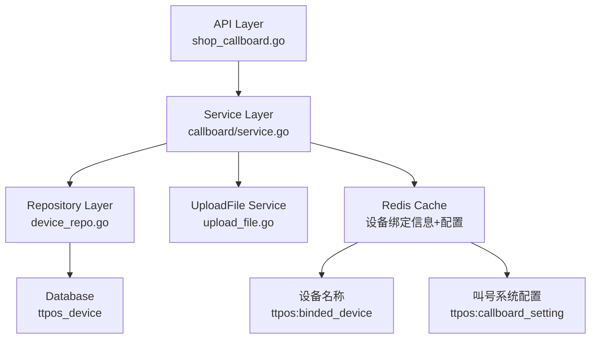

# 新管理端-叫号系统配置管理 设计文档

> 本文档定义 新管理端-叫号系统配置管理 的技术设计和实现方案。

## 📋 概述

在新管理端（Shop 商家管理端）新增叫号系统配置管理功能，允许商户管理员设置叫号系统的名称、背景图片、超时限制、语音叫号开关、叫号次数等配置项。同时扩展叫号设备管理功能，为每个叫号设备增加名称字段。

该功能使用 Redis 缓存存储叫号系统配置和设备名称，复用现有的图片上传服务。

---

## 🎯 规范对齐

### Go Main 规范 (go-main.mdc)

- ✅ Service 只依赖其他 Service 接口
- ✅ Repository 只持有 db 实例
- ✅ URL 使用 snake_case
- ✅ data 字段必须是对象
- ✅ 不使用 panic，返回 error
- ✅ 接口以 `I` 开头，实现以 `Impl` 结尾

### API 设计规范 (api.mdc)

- ✅ URL 使用 snake_case
- ✅ 响应格式统一：`{code, message, data{}}`
- ✅ data 不能为 null 或数组
- ✅ 分页信息统一放在 meta 中

### 数据库规范 (database.mdc)

- ✅ 叫号系统配置存储在 Redis 缓存中
- ✅ 设备名称存储在 Redis 缓存中（与现有设备绑定信息一致）
- ✅ 无需新增数据库表

---

## 🔄 代码复用分析

### 可复用的现有组件

- **UploadFile Service**: `main/app/service/upload_file.go` - 图片上传服务已存在，可直接复用
- **CallBoard Service**: `main/app/service/callboard/service.go` - 已存在叫号系统服务，需扩展设备名称管理
- **Device Repository**: `main/app/repository/device.go` - 设备仓库已存在
- **Device Model**: `main/app/model/device.go` - 设备模型已存在

### 集成点

- **现有 API**: `/api/v1/shop/callboard/device/list` - 需扩展返回设备名称
- **现有 API**: `/api/v1/shop/callboard/device/update` - 需扩展支持更新设备名称
- **现有 API**: `/api/v1/shop/product/upload_image` - 参考实现上传背景图 API
- **Redis 缓存**: 设备绑定信息存储在 Redis 中，扩展存储设备名称

---

## 🏗️ 架构设计

### 分层设计原则

**Go Main 三层架构**:

```
API 层 (Controller/API)
  ↓ 依赖
业务层 (Service)
  ↓ 依赖
数据层 (Repository)
```

**依赖规则**:

- ✅ 上层可依赖下层
- ❌ 禁止下层依赖上层
- ❌ 禁止跨层调用
- ❌ Service 不能依赖 Repository
- ✅ Service 可以依赖其他 Service 接口

### 架构图



### 模块划分

#### Go Main 模块

- **API 层**: 
  - `main/app/api/v1/shop/shop_callboard.go` - 扩展设备管理 API（更新 list 和 update），新增上传背景图 API
- **Service 层**: 
  - `main/app/service/callboard/service.go` - 扩展设备名称管理
- **Repository 层**: 
  - `main/app/repository/device.go` - 设备仓库（已存在）
- **Model 层**: 
  - `main/app/model/device.go` - 设备模型（已存在）
- **DTO 层**: 
  - `main/app/dto/req/callboard.go` - 扩展请求参数
  - `main/app/dto/resp/callboard.go` - 扩展响应数据

---

## 🗄️ 数据存储设计

### Redis 缓存存储方案

#### 1. 设备名称存储

**存储在 Redis 缓存中**（与现有设备绑定信息一致）:

- **Key**: `ttpos:binded_device:{device_id}`
- **Hash Field**: `name`
- **默认值**: 如果名称为空，返回 "WALLACE"

**现有缓存结构**:
```
ttpos:binded_device:{device_id}
  - company_uuid: {uint64}
  - device_secret: {string}
  - lang1: {string}
  - lang2: {string}
  - create_time: {int64}
  - name: {string}  # 新增字段
```

#### 2. 叫号系统配置存储（如需要）

**存储在 Redis 缓存中**:

- **Key**: `ttpos:callboard_setting:{company_uuid}`
- **Type**: Hash
- **Fields**:
  - `name`: 叫号系统名称
  - `background_image_url`: 背景图片 URL（可选，可传空字符串）
  - `timeout_limit`: 超时限制（分钟，可选）
  - `voice_call_enabled`: 语音叫号开关（可选）
  - `call_count`: 叫号次数（1-3）

**缓存结构示例**:
```
ttpos:callboard_setting:{company_uuid}
  - name: "叫号系统"
  - background_image_url: "https://example.com/uploads/image.jpg"
  - timeout_limit: "10"
  - voice_call_enabled: "true"
  - call_count: "3"
```

**说明**: 
- 所有配置存储在 Redis 缓存中，无需使用数据库表
- 配置按公司隔离（使用 company_uuid）
- `background_image_url` 直接保存图片的完整 URL（如：`https://example.com/uploads/image.jpg`），无需通过 UUID 查询
- `background_image_url` 为可选字段，可传空字符串
- 如果配置不存在，使用默认值

---

## 📊 数据模型

### DTO 定义

#### Request DTO

```go
// main/app/dto/req/callboard.go
// 扩展 BindDeviceReq
type BindDeviceReq struct {
	BindCode           string `json:"bind_code" binding:"required,max=10"`
	Lang1              string `json:"lang1"`
	Lang2              string `json:"lang2"`
	Name               string `json:"name"`                      // 设备名称（可选，版本 >= 2.11.0 时必填）
	BackgroundImageUrl string `json:"background_image_url"`     // 背景图片 URL（可选，可传空字符串）
	TimeoutLimit       *int   `json:"timeout_limit"`             // 超时限制（分钟，可选）
	VoiceCallEnabled   *bool  `json:"voice_call_enabled"`        // 语音叫号开关（可选）
	CallCount          int    `json:"call_count"`                // 叫号次数（可选，版本 >= 2.11.0 时必填，最小1，最大3）
}

// 扩展 UpdateBindInfoReq
type UpdateBindInfoReq struct {
	Uuid               uint64 `json:"uuid" binding:"required"`
	Lang1              string `json:"lang1"`
	Lang2              string `json:"lang2"`
	Name               string `json:"name"`                      // 设备名称（可选，版本 >= 2.11.0 时必填）
	BackgroundImageUrl string `json:"background_image_url"`     // 背景图片 URL（可选，可传空字符串）
	TimeoutLimit       *int   `json:"timeout_limit"`             // 超时限制（分钟，可选）
	VoiceCallEnabled   *bool  `json:"voice_call_enabled"`        // 语音叫号开关（可选）
	CallCount          int    `json:"call_count"`                // 叫号次数（可选，版本 >= 2.11.0 时必填，最小1，最大3）
}

```

#### Response DTO

```go
// main/app/dto/resp/callboard.go
// 扩展 DeviceItem
type DeviceItem struct {
	Uuid     uint64 `json:"uuid"`
	Lang1    string `json:"lang1"`
	Lang2    string `json:"lang2"`
	DeviceId string `json:"device_id"`
	BindTime int64  `json:"bind_time"`
	Name     string `json:"name"`  // 新增：设备名称（如果为空，返回 "WALLACE"）
}
```

---

## 🔌 API 设计

### RESTful API

#### API 1: 上传叫号系统背景图片

**请求**:

- **URL**: `/api/v1/shop/callboard/upload_background_image`
- **Method**: `POST`
- **Content-Type**: `multipart/form-data`
- **Body**: 
  - `file`: 图片文件（JPEG、PNG、WEBP，小于 20MB）

**响应**:

```json
{
  "code": 1,
  "message": "上传成功",
  "data": {
    "uuid": 1234567890,
    "file_url": "https://example.com/uploads/image.jpg",
    "file_path": "/uploads/image.jpg"
  }
}
```

**说明**: 
- 上传成功后，返回的 `file_url` 字段即为背景图片的完整 URL
- 前端可直接使用 `file_url` 保存到叫号系统配置的 `background_image_url` 字段
- 无需通过 UUID 再次查询图片 URL

**参考实现**: `main/app/api/v1/shop/shop_product.go` - `UploadProductImage` 方法

#### API 2: 更新设备列表 API（扩展）

**请求**:

- **URL**: `/api/v1/shop/callboard/device/list`
- **Method**: `GET`
- **说明**: 扩展现有 API，返回设备名称字段

**响应**:

```json
{
  "code": 1,
  "message": "success",
  "data": {
    "list": [
      {
        "uuid": 123456,
        "device_id": "device_001",
        "bind_time": 1701234567,
        "lang1": "zh",
        "lang2": "en",
        "name": "叫号设备1"  // 新增字段（如果为空，返回 "WALLACE"）
      }
    ]
  }
}
```

#### API 3: 更新设备信息 API（扩展）

**请求**:

- **URL**: `/api/v1/shop/callboard/device/update`
- **Method**: `POST`
- **Headers**:
  - `Client-Version`: 客户端版本号（如：2.11.0）
- **Body**:
  ```json
  {
    "uuid": 123456,
    "lang1": "zh",
    "lang2": "en",
    "name": "叫号设备1",  // 可选，版本 >= 2.11.0 时必填，最大 20 字符
    "background_image_url": "",  // 背景图片 URL（可选，可传空字符串）
    "timeout_limit": 10,  // 超时限制（分钟，可选）
    "voice_call_enabled": true,  // 语音叫号开关（可选）
    "call_count": 3  // 叫号次数（可选，版本 >= 2.11.0 时必填，最小1，最大3）
  }
  ```

**版本兼容性说明**:
- **版本 >= 2.11.0**: `name` 和 `call_count` 为必填字段，会进行参数校验
- **版本 < 2.11.0**: 所有字段均为可选，不进行参数校验，使用默认值

**响应**:

```json
{
  "code": 1,
  "message": "更新成功",
  "data": {}
}
```

**错误响应**:

```json
{
  "code": 0,
  "message": "请输入名称",
  "data": {}
}
```

---

## 🧩 组件和接口

### Service 层

#### CallBoard Service 扩展

```go
// main/app/service/callboard/service.go
// 扩展 ICallBoardService 接口
type ICallBoardService interface {
    // ... 现有方法
    
    // 扩展 GetDeviceList：返回设备名称
    GetDeviceList(ctx context.Context, companyUuid uint64, req req.GetDeviceListReq) (*resp.DeviceListResp, error)
    
    // 扩展 UpdateBindInfo：支持更新设备名称，根据客户端版本进行参数校验
    UpdateBindInfo(ctx context.Context, companyUuid uint64, req req.UpdateBindInfoReq, clientVersion string) error
    
    // 扩展 BindDevice：支持设置设备名称，根据客户端版本进行参数校验
    BindDevice(ctx context.Context, companyUuid uint64, req req.BindDeviceReq, clientVersion string) error
}

// 实现扩展
func (s *callBoardService) GetDeviceList(...) (*resp.DeviceListResp, error) {
    // ... 现有逻辑
    
    // 从 Redis 读取设备名称
    name := bindInfo.Name
    if name == "" {
        name = "WALLACE"  // 默认名称
    }
    
    list = append(list, resp.DeviceItem{
        // ... 现有字段
        Name: name,  // 新增字段
    })
}

func (s *callBoardService) UpdateBindInfo(ctx context.Context, companyUuid uint64, req req.UpdateBindInfoReq, clientVersion string) error {
    // 版本 >= 2.11.0 时才进行参数校验
    if utils.CompareVersion(clientVersion, utils.VersionGTE, "2.11.0") {
        if req.Name == "" {
            return errors.New("请输入名称")
        }
        if utf8.RuneCountInString(req.Name) > 20 {
            return errors.New("名称不能超过20个字")
        }
        if req.CallCount != 0 && (req.CallCount < 1 || req.CallCount > 3) {
            return errors.New("叫号次数必须在1-3之间")
        }
    }
    
    // 设置默认值
    if req.CallCount == 0 {
        req.CallCount = 1
    }
    
    // 更新 Redis 缓存中的设备信息
    deviceKey := cachekey.GetBindedDeviceKey(device.DeviceId)
    err = s.getRedisClient().HMSet(
        ctx,
        deviceKey,
        "lang1", req.Lang1,
        "lang2", req.Lang2,
        "name", req.Name,
        "background_image_url", req.BackgroundImageUrl,
        "timeout_limit", req.TimeoutLimit,
        "voice_call_enabled", req.VoiceCallEnabled,
        "call_count", req.CallCount,
    ).Err()
}

func (s *callBoardService) BindDevice(ctx context.Context, companyUuid uint64, req req.BindDeviceReq, clientVersion string) error {
    // 版本 >= 2.11.0 时才进行参数校验
    if utils.CompareVersion(clientVersion, utils.VersionGTE, "2.11.0") {
        if req.Name == "" {
            return errors.New("请输入名称")
        }
        if utf8.RuneCountInString(req.Name) > 20 {
            return errors.New("名称不能超过20个字")
        }
        if req.CallCount != 0 && (req.CallCount < 1 || req.CallCount > 3) {
            return errors.New("叫号次数必须在1-3之间")
        }
    }
    
    // 设置默认值
    if req.CallCount == 0 {
        req.CallCount = 1
    }
    
    // ... 现有逻辑
    
    // 保存设备信息到 Redis
    err = s.getRedisClient().HMSet(
        ctx,
        deviceKey,
        // ... 现有字段
        "name", req.Name,
        "background_image_url", req.BackgroundImageUrl,
        "timeout_limit", req.TimeoutLimit,
        "voice_call_enabled", req.VoiceCallEnabled,
        "call_count", req.CallCount,
    ).Err()
}
```


### API 层

```go
// main/app/api/v1/shop/shop_callboard.go
// 新增上传背景图 API
func (h *CallBoardHandler) UploadBackgroundImage(c *gin.Context) {
    // 参考 UploadProductImage 实现
    file, err := c.FormFile("file")
    // 调用 UploadFile Service
    uploadFileResp, err := h.uploadFileSrv.UploadImage(...)
    // 返回图片信息（包含 file_url），前端可直接使用 file_url 保存到配置
    helper.Success(c, uploadFileResp)
}
```

---

## ⚡ 缓存设计

### Redis 缓存

**缓存策略**:

- **设备绑定信息**: `ttpos:binded_device:{device_id}` - 包含设备名称
- **叫号系统配置**: `ttpos:callboard_setting:{company_uuid}` - 存储所有配置项

**更新策略**: Cache-Aside Pattern

**示例**:

```go
// 读取设备名称
deviceKey := cachekey.GetBindedDeviceKey(deviceId)
name, err := redis.HGet(ctx, deviceKey, "name").Result()
if err == redis.Nil || name == "" {
    name = "WALLACE"  // 默认名称
}

// 更新设备名称
err = redis.HSet(ctx, deviceKey, "name", req.Name).Err()

// 读取叫号系统配置
settingKey := fmt.Sprintf("ttpos:callboard_setting:%d", companyUuid)
config, err := redis.HGetAll(ctx, settingKey).Result()
if err == redis.Nil || len(config) == 0 {
    // 使用默认配置
}

// 保存叫号系统配置
err = redis.HMSet(ctx, settingKey,
    "name", req.Name,
    "background_image_url", req.BackgroundImageUrl,
    "timeout_limit", req.TimeoutLimit,
    "voice_call_enabled", req.VoiceCallEnabled,
    "call_count", req.CallCount,
).Err()
```

---

## 🚨 错误处理

### 错误场景

#### 场景 1: 设备名称为空

- **处理方式**: 参数验证失败，返回错误 "请输入名称"
- **用户影响**: 用户看到错误提示
- **代码示例**:
  ```go
  if req.Name == "" {
      return errors.New("请输入名称")
  }
  ```

#### 场景 2: 设备名称超过 20 字符

- **处理方式**: 参数验证失败，返回错误
- **用户影响**: 用户看到错误提示

#### 场景 2.1: 背景图片为空字符串

- **处理方式**: 允许传空字符串，正常保存到 Redis
- **用户影响**: 背景图片字段为空，QDS 端使用默认图片

#### 场景 2.2: 客户端版本 < 2.11.0

- **处理方式**: 所有字段（name、background_image_url、timeout_limit、voice_call_enabled、call_count）均为可选，不进行参数校验
- **用户影响**: 旧版本客户端可以正常调用 API，使用默认值

#### 场景 2.3: 客户端版本 >= 2.11.0

- **处理方式**: `name` 和 `call_count` 为必填字段，进行参数校验
- **用户影响**: 新版本客户端必须提供必填字段

#### 场景 3: 背景图片格式不支持

- **处理方式**: UploadFile Service 验证，返回错误
- **用户影响**: 用户看到错误提示 "仅支持JPG、JPEG、PNG、WEBP格式"

#### 场景 4: 背景图片大小超过 20MB

- **处理方式**: UploadFile Service 验证，返回错误
- **用户影响**: 用户看到错误提示

#### 场景 5: 叫号次数超出范围

- **处理方式**: 参数验证失败，返回错误
- **用户影响**: 用户看到错误提示

---

## 🔒 安全设计

### 身份验证

- **JWT Token**: 所有 API 需要 Token 验证
- **中间件**: `middleware.Auth`

### 权限控制

- **商户隔离**: 通过 `companyUuid` 隔离数据
- **API 权限**: 每个 API 检查用户权限

### 数据安全

- **参数验证**: 使用 `binding` 标签验证参数
- **SQL 注入防护**: 使用参数化查询
- **文件上传安全**: 验证文件类型和大小

---

## 🧪 测试策略

### 单元测试

**目标覆盖率**:

- main/app/service: 70%+
- main/app/repository: 80%+

**测试内容**:

- Service 业务逻辑
- 参数验证
- 错误处理
- 默认值处理

### API 测试

**测试内容**:

- API 接口调用
- 参数验证
- 响应格式
- 错误处理

### 集成测试

**测试流程**:

- 配置保存 → QDS 端读取
- 设备名称设置 → 设备列表查询
- 背景图片上传 → 配置保存

---

## 📈 性能优化

### 优化策略

1. **缓存优化**:
   - Redis 缓存设备绑定信息（包含名称）
   - 配置信息可选缓存

2. **缓存优化**:
   - 所有配置存储在 Redis 缓存中，无需数据库表
   - 配置读取速度快，支持实时更新

3. **文件上传优化**:
   - 复用现有上传服务
   - 支持异步处理（如需要）

### 性能指标

- 本地响应时间: < 200ms
- 数据库查询: < 50ms
- 缓存命中率: > 80%

---

## 📚 实现清单

### Phase 1: DTO 和模型扩展

- [ ] 扩展 `BindDeviceReq` 增加 `name` 字段
- [ ] 扩展 `UpdateBindInfoReq` 增加 `name` 字段
- [ ] 扩展 `DeviceItem` 增加 `name` 字段

### Phase 2: Service 层扩展

- [ ] 扩展 `CallBoardService.GetDeviceList` 返回设备名称
- [ ] 扩展 `CallBoardService.UpdateBindInfo` 支持更新设备名称
- [ ] 扩展 `CallBoardService.BindDevice` 支持设置设备名称

### Phase 3: API 层实现

- [ ] 扩展 `/shop/callboard/device/list` API
- [ ] 扩展 `/shop/callboard/device/update` API
- [ ] 新增 `/shop/callboard/upload_background_image` API

### Phase 4: 测试

- [ ] 单元测试
- [ ] API 测试
- [ ] 集成测试

**详细任务**: 参见 `tasks.md`

---

## Graphiti & 活动日志

- Related Episode: `[待补充]`
- 模板：`docs/agent/templates/graphiti-episode.md`
- 活动日志：`docs/team/activities/{YYYY-MM}/{YYYY-MM-DD}.md`
- 在技术方案评审、关键架构决策或踩坑总结后，立即补充 Episode 并在设计文档尾部互链。

---

**版本**: v1.0.0  
**创建日期**: 2025-12-11  
**作者**: 王昱  
**审核者**: {审核者}
