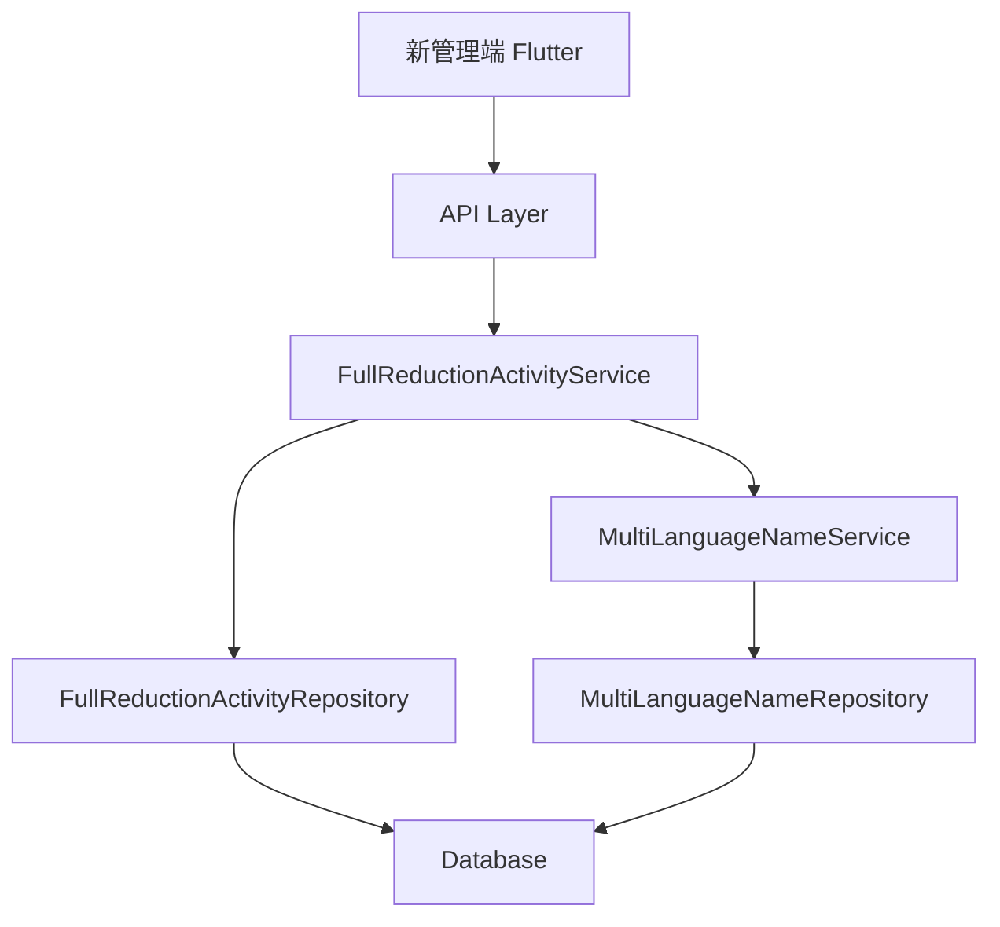

# 新管理端-满减营销功能 设计文档

> 本文档定义 新管理端-满减营销功能 的技术设计和实现方案。

## 📋 概述

在新管理端（Shop）实现满减营销活动管理功能，包括活动的创建、编辑、删除、失效和列表查询。该功能涉及 Go Main 模块的后端 API 实现和 Flutter 前端页面实现（新管理端位于 `ttpos-flutter/apps/shop`）。

---

## 🎯 规范对齐

### Go Main 规范 (go-main.mdc)

设计遵循 Go Main 开发规范：

- Service 只依赖其他 Service 接口
- Repository 只持有 db 实例
- URL 使用 snake_case
- data 字段必须是对象
- 不使用 panic，返回 error
- 接口以 `I` 开头，实现以 `Impl` 结尾

### API 设计规范 (api.mdc)

API 设计遵循规范：

- URL 使用 snake_case: `/api/v1/shop/full_reduction_activity`
- 响应格式统一: `{code, message, data{}}`
- data 不能为 null 或数组

### 数据库规范 (database.mdc)

数据库设计遵循规范：

- 必需字段完整: `id`, `uuid`, `create_time`, `update_time`, `delete_time`
- 时间字段使用 int
- 金额字段使用 decimal(22,4)
- 表名使用 ttpos\_ 前缀
- 活动名称使用多语言：`name` (JSON) + `multi_language_name_uuid`

---

## 🔄 代码复用分析

### 可复用的现有组件

- **MultiLanguageName Service**: `main/app/service/multi_language_name.go` - 用于创建和管理活动名称的多语言支持
- **MultiLanguageName Repository**: `main/app/repository/multi_language_name.go` - 多语言名称数据访问
- **BaseModel**: `main/app/model/base.go` - 基础模型，包含 uuid, create_time, update_time, delete_time
- **Helper 函数**: `main/app/api/helper/` - API 响应辅助函数
- **UUID 生成**: `pkg/uuid` - UUID 生成工具
- **时区处理**: 使用商户设置的时区进行活动状态判断

### 集成点

- **多语言名称表**: `ttpos_multi_language_name` - 存储活动名称的多语言数据
- **商户时区设置**: 从商户设置中获取时区，用于活动状态判断

---

## 🏗️ 架构设计

### 分层设计原则

**Go Main 三层架构**:

```
API 层 (Controller/API)
  ↓ 依赖
业务层 (Service)
  ↓ 依赖
数据层 (Repository)
```

**依赖规则**:

- ✅ 上层可依赖下层
- ❌ 禁止下层依赖上层
- ❌ 禁止跨层调用
- ❌ Service 不能依赖 Repository
- ✅ Service 可以依赖其他 Service 接口

### 架构图



### 模块划分

#### Go Main 模块

- **API 层**: `main/app/api/v1/shop/shop_full_reduction_activity.go` - 路由处理、参数校验
- **Service 层**: `main/app/service/full_reduction_activity.go` - 业务逻辑、事务管理
- **Repository 层**: `main/app/repository/full_reduction_activity.go` - 数据访问、数据库操作
- **Model 层**: `main/app/model/full_reduction_activity.go` - 数据模型
- **DTO 层**: `main/app/dto/req/full_reduction_activity_req.go`, `main/app/dto/resp/full_reduction_activity_resp.go` - 数据传输对象

---

## 🗄️ 数据库设计

### 数据表设计

#### 表 1: ttpos_full_reduction_activity (满减活动表)

```sql
CREATE TABLE IF NOT EXISTS `ttpos_full_reduction_activity` (
    `id` bigint unsigned NOT NULL AUTO_INCREMENT COMMENT '主键ID',
    `uuid` bigint unsigned NOT NULL DEFAULT 0 COMMENT '唯一标识',
    `name` VARCHAR(1000) NOT NULL DEFAULT '' COMMENT '活动名称（JSON格式）',
    `multi_language_name_uuid` bigint unsigned NOT NULL DEFAULT 0 COMMENT '多语言名称UUID',
    `start_date` int NOT NULL DEFAULT 0 COMMENT '活动开始日期（时间戳，当天00:00:00）',
    `end_date` int NOT NULL DEFAULT 0 COMMENT '活动结束日期（时间戳，当天23:59:59）',
    `start_time` VARCHAR(10) NOT NULL DEFAULT '' COMMENT '适用时间开始（格式：HH:mm，如09:00）',
    `end_time` VARCHAR(10) NOT NULL DEFAULT '' COMMENT '适用时间结束（格式：HH:mm，如22:00）',
    `is_all_day` tinyint(1) NOT NULL DEFAULT 1 COMMENT '是否全天（1=全天，0=特定时段）',
    `reduction_type` tinyint(1) NOT NULL DEFAULT 0 COMMENT '满减方式（0=阶梯满减，1=循环满减）',
    `is_disabled` tinyint(1) NOT NULL DEFAULT 0 COMMENT '是否失效（1=失效，0=未失效）',
    `create_time` int NOT NULL DEFAULT 0 COMMENT '创建时间',
    `update_time` int NOT NULL DEFAULT 0 COMMENT '更新时间',
    `delete_time` int NOT NULL DEFAULT 0 COMMENT '删除时间',
    PRIMARY KEY (`id`),
    UNIQUE KEY `uk_uuid` (`uuid`),
    KEY `idx_start_date` (`start_date`),
    KEY `idx_end_date` (`end_date`),
    KEY `idx_multi_language_name_uuid` (`multi_language_name_uuid`)
) ENGINE=InnoDB DEFAULT CHARSET=utf8mb4 COMMENT='满减活动表';
```

**字段说明**:
| 字段 | 类型 | 说明 | 约束 |
|------|------|------|------|
| id | bigint unsigned | 主键 ID | AUTO_INCREMENT |
| uuid | bigint unsigned | 唯一标识 | DEFAULT 0, UNIQUE |
| name | VARCHAR(1000) | 活动名称（JSON格式） | DEFAULT '' |
| multi_language_name_uuid | bigint unsigned | 多语言名称UUID | DEFAULT 0 |
| start_date | int | 活动开始日期（时间戳，当天00:00:00） | DEFAULT 0 |
| end_date | int | 活动结束日期（时间戳，当天23:59:59） | DEFAULT 0 |
| start_time | VARCHAR(10) | 适用时间开始（格式：HH:mm） | DEFAULT '' |
| end_time | VARCHAR(10) | 适用时间结束（格式：HH:mm） | DEFAULT '' |
| is_all_day | tinyint(1) | 是否全天（1=全天，0=特定时段） | DEFAULT 1 |
| reduction_type | tinyint(1) | 满减方式（0=阶梯满减，1=循环满减） | DEFAULT 0 |
| is_disabled | tinyint(1) | 是否失效（1=失效，0=未失效） | DEFAULT 0 |
| create_time | int | 创建时间 | DEFAULT 0 |
| update_time | int | 更新时间 | DEFAULT 0 |
| delete_time | int | 删除时间 | DEFAULT 0 |

**索引设计**:

- 主键索引: `PRIMARY KEY (id)`
- 唯一索引: `UNIQUE KEY uk_uuid (uuid)`
- 普通索引: `KEY idx_start_date (start_date)`, `KEY idx_end_date (end_date)`, `KEY idx_multi_language_name_uuid (multi_language_name_uuid)`

**迁移文件**: `admin/database/migrations/{YYYYMMDDHHMMSS}_create_ttpos_full_reduction_activity_table.php`

#### 表 2: ttpos_full_reduction_activity_rule (满减规则表)

```sql
CREATE TABLE IF NOT EXISTS `ttpos_full_reduction_activity_rule` (
    `id` bigint unsigned NOT NULL AUTO_INCREMENT COMMENT '主键ID',
    `uuid` bigint unsigned NOT NULL DEFAULT 0 COMMENT '唯一标识',
    `full_reduction_activity_uuid` bigint unsigned NOT NULL DEFAULT 0 COMMENT '活动UUID',
    `threshold` decimal(22,4) NOT NULL DEFAULT 0.0000 COMMENT '阈值（满减条件，如满200减20中的200）',
    `reduction_amount` decimal(22,4) NOT NULL DEFAULT 0.0000 COMMENT '扣减值（满减金额，如满200减20中的20）',
    `create_time` int NOT NULL DEFAULT 0 COMMENT '创建时间',
    `update_time` int NOT NULL DEFAULT 0 COMMENT '更新时间',
    `delete_time` int NOT NULL DEFAULT 0 COMMENT '删除时间',
    PRIMARY KEY (`id`),
    UNIQUE KEY `uk_uuid` (`uuid`),
    KEY `idx_full_reduction_activity_uuid` (`full_reduction_activity_uuid`),
    KEY `idx_threshold` (`threshold`)
) ENGINE=InnoDB DEFAULT CHARSET=utf8mb4 COMMENT='满减活动规则表';
```

**字段说明**:
| 字段 | 类型 | 说明 | 约束 |
|------|------|------|------|
| id | bigint unsigned | 主键 ID | AUTO_INCREMENT |
| uuid | bigint unsigned | 唯一标识 | DEFAULT 0, UNIQUE |
| full_reduction_activity_uuid | bigint unsigned | 活动UUID | DEFAULT 0 |
| threshold | decimal(22,4) | 阈值（满减条件） | DEFAULT 0.0000 |
| reduction_amount | decimal(22,4) | 扣减值（满减金额） | DEFAULT 0.0000 |
| create_time | int | 创建时间 | DEFAULT 0 |
| update_time | int | 更新时间 | DEFAULT 0 |
| delete_time | int | 删除时间 | DEFAULT 0 |

**索引设计**:

- 主键索引: `PRIMARY KEY (id)`
- 唯一索引: `UNIQUE KEY uk_uuid (uuid)`
- 普通索引: `KEY idx_full_reduction_activity_uuid (full_reduction_activity_uuid)`

**迁移文件**: `admin/database/migrations/{YYYYMMDDHHMMSS}_create_ttpos_full_reduction_activity_rule_table.php`

### 数据库迁移

**迁移脚本**:

```bash
# 创建迁移文件
cd admin
php think migrate:create CreateTtposFullReductionActivityTable
php think migrate:create CreateTtposFullReductionActivityRuleTable

# 执行迁移
php think migrate:run
```

**同步 Go Model**:

在 `main/app/model/` 中创建对应的 Go 结构体

**参考**: `docs/agent/workflows/database-migration.md`

---

## 📊 数据模型

### Go Model

```go
// main/app/model/full_reduction_activity.go
package model

type FullReductionActivity struct {
	BaseModel
	Name                  string `gorm:"column:name;type:varchar(1000);default:'';comment:'活动名称（JSON格式）'" json:"name"`
	MultiLanguageNameUuid uint64 `gorm:"column:multi_language_name_uuid;type:bigint(20) unsigned;default:0;comment:'多语言名称UUID'" json:"multi_language_name_uuid"`
	StartDate             int64  `gorm:"column:start_date;type:int(10);default:0;comment:'活动开始日期（时间戳，当天00:00:00）'" json:"start_date"`
	EndDate               int64  `gorm:"column:end_date;type:int(10);default:0;comment:'活动结束日期（时间戳，当天23:59:59）'" json:"end_date"`
	StartTime             string `gorm:"column:start_time;type:varchar(10);default:'';comment:'适用时间开始（格式：HH:mm）'" json:"start_time"`
	EndTime               string `gorm:"column:end_time;type:varchar(10);default:'';comment:'适用时间结束（格式：HH:mm）'" json:"end_time"`
	IsAllDay              int    `gorm:"column:is_all_day;type:tinyint(1);default:1;comment:'是否全天（1=全天，0=特定时段）'" json:"is_all_day"`
	ReductionType         int    `gorm:"column:reduction_type;type:tinyint(1);default:0;comment:'满减方式（0=阶梯满减，1=循环满减）'" json:"reduction_type"`
	IsDisabled            int    `gorm:"column:is_disabled;type:tinyint(1);default:0;comment:'是否失效（1=失效，0=未失效）'" json:"is_disabled"`
	
	// 关联
	MultiLanguageName MultiLanguageName `gorm:"foreignKey:multi_language_name_uuid;references:uuid" json:"multi_language_name,omitempty"`
	Rules             []FullReductionActivityRule `gorm:"foreignKey:full_reduction_activity_uuid;references:uuid" json:"rules,omitempty"`
}

func (*FullReductionActivity) TableName() string {
	return "ttpos_full_reduction_activity"
}

// GetStatus 获取活动状态（进行中/未开始/已结束）
func (m *FullReductionActivity) GetStatus(now int64, timezone string) string {
	// 如果已失效，返回已结束
	if m.IsDisabled == 1 {
		return "ended"
	}
	
	// 根据当前时间和活动日期判断状态
	if now < m.StartDate {
		return "not_started"
	}
	if now > m.EndDate {
		return "ended"
	}
	return "ongoing"
}
```

```go
// main/app/model/full_reduction_activity_rule.go
package model

type FullReductionActivityRule struct {
	BaseModel
	FullReductionActivityUuid uint64  `gorm:"column:full_reduction_activity_uuid;type:bigint(20) unsigned;default:0;comment:'活动UUID';index" json:"full_reduction_activity_uuid"`
	Threshold       float64 `gorm:"column:threshold;type:decimal(22,4);default:0.0000;comment:'阈值（满减条件）'" json:"threshold"`
	ReductionAmount float64 `gorm:"column:reduction_amount;type:decimal(22,4);default:0.0000;comment:'扣减值（满减金额）'" json:"reduction_amount"`
}

func (*FullReductionActivityRule) TableName() string {
	return "ttpos_full_reduction_activity_rule"
}
```

### DTO 定义

#### Request DTO

**注意**：Request 中的多语言字段使用 `string`（JSON 格式），前端发送 JSON 字符串。Service 层会将其转换为 `MultiLanguageName` 并存储。

```go
// main/app/dto/req/full_reduction_activity_req.go
package req

type FullReductionActivityCreateReq struct {
	Name          string                          `json:"name" binding:"required"` // JSON格式多语言名称，前端发送 JSON 字符串
	StartDate     int64                           `json:"start_date" binding:"required"`
	EndDate       int64                           `json:"end_date" binding:"required"`
	StartTime     string                          `json:"start_time"` // HH:mm格式
	EndTime       string                          `json:"end_time"`   // HH:mm格式
	IsAllDay      int                             `json:"is_all_day" binding:"required"` // 1=全天，0=特定时段
	ReductionType int                             `json:"reduction_type" binding:"required"` // 0=阶梯满减，1=循环满减
	Rules         []FullReductionActivityRuleCreateReq `json:"rules" binding:"required,min=1"`
}

type FullReductionActivityRuleCreateReq struct {
	Threshold       float64 `json:"threshold" binding:"required,min=0.01,max=999999.99"`
	ReductionAmount float64 `json:"reduction_amount" binding:"required,min=0.01,max=999999.99"`
}

type FullReductionActivityUpdateReq struct {
	Uuid          uint64                          `json:"uuid" binding:"required"`
	Name           string                          `json:"name" binding:"required"` // JSON格式多语言名称，前端发送 JSON 字符串 // JSON格式多语言名称，前端发送 JSON 字符串
	StartDate      int64                           `json:"start_date" binding:"required"`
	EndDate        int64                           `json:"end_date" binding:"required"`
	StartTime      string                          `json:"start_time"`
	EndTime        string                          `json:"end_time"`
	IsAllDay       int                             `json:"is_all_day" binding:"required"`
	ReductionType  int                             `json:"reduction_type" binding:"required"`
	Rules          []FullReductionActivityRuleCreateReq `json:"rules" binding:"required,min=1"`
}

type FullReductionActivityGetReq struct {
	Uuid uint64 `json:"uuid" binding:"required"`
}

type FullReductionActivityListReq struct {
	PageNo   int    `json:"page_no" binding:"required"`
	PageSize int    `json:"page_size" binding:"required"`
	Status   string `json:"status"` // all, ongoing, not_started, ended
}

type FullReductionActivityDeleteReq struct {
	Uuid uint64 `json:"uuid" binding:"required"`
}

type FullReductionActivityDisableReq struct {
	Uuid uint64 `json:"uuid" binding:"required"`
}
```

#### Response DTO

**重要**：所有多语言字段必须使用 `dto.LocaleResponse` 结构，遵循 `.cursor/rules/go-main.mdc` 规范。

```go
// main/app/dto/resp/full_reduction_activity_resp.go
package resp

import "ttpos-server-go/app/dto"

type FullReductionActivityResp struct {
	Uuid              uint64                        `json:"uuid"`
	Name              dto.LocaleResponse            `json:"name"` // 多语言名称，使用 LocaleResponse（必须）
	StartDate         int64                         `json:"start_date"`
	EndDate           int64                         `json:"end_date"`
	StartTime         string                        `json:"start_time"`
	EndTime           string                        `json:"end_time"`
	IsAllDay          int                           `json:"is_all_day"`
	ReductionType     int                           `json:"reduction_type"`
	ReductionTypeName string                        `json:"reduction_type_name"` // 阶梯满减/循环满减
	IsDisabled        int                           `json:"is_disabled"`
	Status            string                        `json:"status"` // ongoing, not_started, ended
	Rules             []FullReductionActivityRuleResp `json:"rules"`
	CreateTime        int64                         `json:"create_time"`
	UpdateTime        int64                         `json:"update_time"`
}

type FullReductionActivityRuleResp struct {
	Uuid           uint64  `json:"uuid"`
	Threshold      float64 `json:"threshold"`
	ReductionAmount float64 `json:"reduction_amount"`
}

type FullReductionActivityListResp struct {
	List []*FullReductionActivityResp `json:"list"`
	Meta *PageMeta                `json:"meta"`
}

type PageMeta struct {
	PageNo   int   `json:"page_no"`
	PageSize int   `json:"page_size"`
	Total    int64 `json:"total"`
}
```

---

## 🔌 API 设计

### RESTful API

#### API 1: 获取活动列表

**请求**:

- **URL**: `/api/v1/shop/full_reduction_activity/list`
- **Method**: `POST`
- **Headers**:
  ```json
  {
    "Authorization": "Bearer {token}",
    "Content-Type": "application/json"
  }
  ```
- **Body**:
  ```json
  {
    "page_no": 1,
    "page_size": 20,
    "status": "all"
  }
  ```

**响应**:

```json
{
  "code": 1,
  "message": "success",
  "data": {
    "list": [
      {
        "uuid": 123456,
        "name": "{\"zh\":\"满100减10\",\"en\":\"100 off 10\"}",
        "start_date": 1700000000,
        "end_date": 1700086399,
        "start_time": "09:00",
        "end_time": "22:00",
        "is_all_day": 0,
        "reduction_type": 0,
        "reduction_type_name": "阶梯满减",
        "is_disabled": 0,
        "status": "ongoing",
        "rules": [
          {
            "uuid": 123457,
            "threshold": 100.00,
            "reduction_amount": 10.00
          }
        ],
        "create_time": 1699000000,
        "update_time": 1699000000
      }
    ],
    "meta": {
      "page_no": 1,
      "page_size": 20,
      "total": 10
    }
  }
}
```

#### API 2: 创建活动

**请求**:

- **URL**: `/api/v1/shop/full_reduction_activity/create`
- **Method**: `POST`
- **Body**:
  ```json
  {
    "name": "{\"zh\":\"满100减10\",\"en\":\"100 off 10\"}",
    "start_date": 1700000000,
    "end_date": 1700086399,
    "start_time": "09:00",
    "end_time": "22:00",
    "is_all_day": 0,
    "reduction_type": 0,
    "rules": [
      {
        "threshold": 100.00,
        "reduction_amount": 10.00
      },
      {
        "threshold": 200.00,
        "reduction_amount": 30.00
      }
    ]
  }
  ```

**响应**:

```json
{
  "code": 1,
  "message": "success",
  "data": {
    "uuid": 123456
  }
}
```

#### API 3: 获取活动详情

**请求**:

- **URL**: `/api/v1/shop/full_reduction_activity/detail`
- **Method**: `POST`
- **Body**:
  ```json
  {
    "uuid": 123456
  }
  ```

**响应**:

```json
{
  "code": 1,
  "message": "success",
  "data": {
    "uuid": 123456,
    "name": "{\"zh\":\"满100减10\",\"en\":\"100 off 10\"}",
    "start_date": 1700000000,
    "end_date": 1700086399,
    "start_time": "09:00",
    "end_time": "22:00",
    "is_all_day": 0,
    "reduction_type": 0,
    "reduction_type_name": "阶梯满减",
    "is_disabled": 0,
    "status": "ongoing",
    "rules": [
      {
        "uuid": 123457,
        "threshold": 100.00,
        "reduction_amount": 10.00
      }
    ],
    "create_time": 1699000000,
    "update_time": 1699000000
  }
}
```

#### API 4: 更新活动

**请求**:

- **URL**: `/api/v1/shop/full_reduction_activity/update`
- **Method**: `POST`
- **Body**: 同创建活动，增加 `uuid` 字段

**响应**:

```json
{
  "code": 1,
  "message": "success",
  "data": {}
}
```

#### API 5: 删除活动

**请求**:

- **URL**: `/api/v1/shop/full_reduction_activity/delete`
- **Method**: `POST`
- **Body**:
  ```json
  {
    "uuid": 123456
  }
  ```

**响应**:

```json
{
  "code": 1,
  "message": "success",
  "data": {}
}
```

#### API 6: 失效活动

**请求**:

- **URL**: `/api/v1/shop/full_reduction_activity/disable`
- **Method**: `POST`
- **Body**:
  ```json
  {
    "uuid": 123456
  }
  ```

**响应**:

```json
{
  "code": 1,
  "message": "success",
  "data": {}
}
```

---

## 🧩 组件和接口

### Service 层

#### Service 接口

```go
// main/app/service/i_full_reduction_activity_srv.go
package service

import (
	"ttpos-server-go/app/dto/req"
	"ttpos-server-go/app/dto/resp"
	"github.com/gin-gonic/gin"
)

type IFullReductionActivitySrv interface {
	Create(ctx *gin.Context, req *dto_req.FullReductionActivityCreateReq) (*dto_resp.FullReductionActivityResp, error)
	Update(ctx *gin.Context, req *dto_req.FullReductionActivityUpdateReq) error
	GetByUuid(ctx *gin.Context, uuid uint64) (*dto_resp.FullReductionActivityResp, error)
	GetList(ctx *gin.Context, req *dto_req.FullReductionActivityListReq) (*dto_resp.FullReductionActivityListResp, error)
	Delete(ctx *gin.Context, uuid uint64) error
	Disable(ctx *gin.Context, uuid uint64) error
}
```

#### Service 实现

```go
// main/app/service/full_reduction_activity_srv.go
package service

import (
	"sort"
	"time"
	"ttpos-server-go/app/dto"
	"ttpos-server-go/app/dto/req"
	"ttpos-server-go/app/dto/resp"
	"ttpos-server-go/app/model"
	"ttpos-server-go/app/repository"
	"ttpos-server-go/pkg/database"
	"ttpos-server-go/pkg/uuid"
	"github.com/gin-gonic/gin"
	"github.com/pkg/errors"
)

type fullReductionActivitySrv struct {
	dbm              *database.DBManager
	multiLangNameSrv IMultiLanguageNameSrv
}

func NewFullReductionActivitySrv(
	dbm *database.DBManager,
	multiLangNameSrv IMultiLanguageNameSrv,
) IFullReductionActivitySrv {
	return &fullReductionActivitySrv{
		dbm:              dbm,
		multiLangNameSrv: multiLangNameSrv,
	}
}

func (s *fullReductionActivitySrv) Create(ctx *gin.Context, req *dto_req.FullReductionActivityCreateReq) (*dto_resp.FullReductionActivityResp, error) {
	// 获取 Repository
	activityRepo := repository.NewFullReductionActivityRepo(s.dbm.GetDB(ctx))
	ruleRepo := repository.NewFullReductionActivityRuleRepo(s.dbm.GetDB(ctx))
	
	// 创建多语言名称
	multiLangUuid, err := s.multiLangNameSrv.CreateFromJson(ctx, req.Name)
	if err != nil {
		return nil, errors.WithMessage(err, "创建多语言名称失败")
	}
	
	// 创建活动
	activityUuid := uuid.GenerateUuid()
	activity := &model.FullReductionActivity{
		BaseModel:             model.BaseModel{Uuid: activityUuid},
		Name:                  req.Name,
		MultiLanguageNameUuid: multiLangUuid,
		StartDate:             req.StartDate,
		EndDate:               req.EndDate,
		StartTime:             req.StartTime,
		EndTime:               req.EndTime,
		IsAllDay:              req.IsAllDay,
		ReductionType:         req.ReductionType,
		IsDisabled:            0,
	}
	
	if err := activityRepo.Create(activity); err != nil {
		return nil, errors.WithMessage(err, "创建活动失败")
	}
	
	// 创建规则
	// 如果是阶梯满减，需要排序
	rules := req.Rules
	if req.ReductionType == 0 { // 阶梯满减
		sort.Slice(rules, func(i, j int) bool {
			return rules[i].Threshold < rules[j].Threshold
		})
	}
	
	for _, ruleReq := range rules {
		rule := &model.FullReductionActivityRule{
			BaseModel:                model.BaseModel{Uuid: uuid.GenerateUuid()},
			FullReductionActivityUuid: activityUuid,
			Threshold:                ruleReq.Threshold,
			ReductionAmount:          ruleReq.ReductionAmount,
		}
		if err := ruleRepo.Create(rule); err != nil {
			return nil, errors.WithMessage(err, "创建规则失败")
		}
	}
	
	// 返回响应
	return s.buildResp(ctx, activity)
}

// buildResp 构建响应对象
func (s *fullReductionActivitySrv) buildResp(ctx *gin.Context, activity *model.FullReductionActivity) (*dto_resp.FullReductionActivityResp, error) {
	// 从 MultiLanguageName 转换为 LocaleResponse
	var name dto.LocaleResponse
	if activity.MultiLanguageName != nil {
		name = activity.MultiLanguageName.GetNames()
	}
	
	// 构建规则响应
	rules := make([]dto_resp.FullReductionActivityRuleResp, 0, len(activity.Rules))
	for _, rule := range activity.Rules {
		rules = append(rules, dto_resp.FullReductionActivityRuleResp{
			Uuid:           rule.Uuid,
			Threshold:      rule.Threshold,
			ReductionAmount: rule.ReductionAmount,
		})
	}
	
	// 获取活动状态
	now := time.Now().Unix()
	status := activity.GetStatus(now, ctx.GetTimeZone())
	
	// 获取满减方式名称
	reductionTypeName := "阶梯满减"
	if activity.ReductionType == 1 {
		reductionTypeName = "循环满减"
	}
	
	return &dto_resp.FullReductionActivityResp{
		Uuid:              activity.Uuid,
		Name:              name,  // ✅ 使用 LocaleResponse
		StartDate:         activity.StartDate,
		EndDate:           activity.EndDate,
		StartTime:         activity.StartTime,
		EndTime:           activity.EndTime,
		IsAllDay:          activity.IsAllDay,
		ReductionType:     activity.ReductionType,
		ReductionTypeName: reductionTypeName,
		IsDisabled:        activity.IsDisabled,
		Status:            status,
		Rules:             rules,
		CreateTime:        activity.CreateTime,
		UpdateTime:        activity.UpdateTime,
	}, nil
}

// 其他方法实现...
```

### Repository 层

#### Repository 接口

```go
// main/app/repository/i_full_reduction_activity_repo.go
package repository

import "ttpos-server-go/app/model"

type IFullReductionActivityRepo interface {
	Create(activity *model.FullReductionActivity) error
	Update(activity *model.FullReductionActivity, options ...DBOption) error
	GetByUuid(uuid uint64, options ...DBOption) (*model.FullReductionActivity, error)
	GetList(options ...DBOption) ([]*model.FullReductionActivity, int64, error)
	Delete(uuid uint64) error
	
	// 选项方法
	WhereUuid(uuid uint64) DBOption
	WhereStatus(status string, now int64) DBOption
}
```

#### Repository 实现

```go
// main/app/repository/full_reduction_activity_repo.go
package repository

import (
	"ttpos-server-go/app/model"
	"gorm.io/gorm"
	"github.com/pkg/errors"
)

type FullReductionActivityRepoImpl struct {
	db *gorm.DB
}

func NewFullReductionActivityRepo(db *gorm.DB) IFullReductionActivityRepo {
	return &FullReductionActivityRepoImpl{db: db}
}

func (r *FullReductionActivityRepoImpl) Create(activity *model.FullReductionActivity) error {
	return r.db.Create(activity).Error
}

func (r *FullReductionActivityRepoImpl) GetByUuid(uuid uint64, options ...DBOption) (*model.FullReductionActivity, error) {
	var activity model.FullReductionActivity
	db := r.db.Where("delete_time = ?", 0)
	
	for _, option := range options {
		db = option(db)
	}
	
	if err := db.Where("uuid = ?", uuid).Preload("Rules").Preload("MultiLanguageName").First(&activity).Error; err != nil {
		return nil, errors.WithMessage(err, "查询活动失败")
	}
	return &activity, nil
}

// 其他方法实现...
```

#### FullReductionActivityRule Repository 接口

```go
// main/app/repository/i_full_reduction_activity_rule_repo.go
package repository

import "ttpos-server-go/app/model"

type IFullReductionActivityRuleRepo interface {
	Create(rule *model.FullReductionActivityRule) error
	Update(rule *model.FullReductionActivityRule, options ...DBOption) error
	GetByFullReductionActivityUuid(activityUuid uint64, options ...DBOption) ([]*model.FullReductionActivityRule, error)
	DeleteByFullReductionActivityUuid(activityUuid uint64) error
	Delete(uuid uint64) error
}
```

#### FullReductionActivityRule Repository 实现

```go
// main/app/repository/full_reduction_activity_rule_repo.go
package repository

import (
	"time"
	"ttpos-server-go/app/model"
	"gorm.io/gorm"
	"github.com/pkg/errors"
)

type FullReductionActivityRuleRepoImpl struct {
	db *gorm.DB
}

func NewFullReductionActivityRuleRepo(db *gorm.DB) IFullReductionActivityRuleRepo {
	return &FullReductionActivityRuleRepoImpl{db: db}
}

func (r *FullReductionActivityRuleRepoImpl) Create(rule *model.FullReductionActivityRule) error {
	return r.db.Create(rule).Error
}

func (r *FullReductionActivityRuleRepoImpl) GetByFullReductionActivityUuid(activityUuid uint64, options ...DBOption) ([]*model.FullReductionActivityRule, error) {
	var rules []*model.FullReductionActivityRule
	db := r.db.Where("delete_time = ?", 0).Where("full_reduction_activity_uuid = ?", activityUuid)
	
	for _, option := range options {
		db = option(db)
	}
	
	if err := db.Find(&rules).Error; err != nil {
		return nil, errors.WithMessage(err, "查询规则失败")
	}
	return rules, nil
}

func (r *FullReductionActivityRuleRepoImpl) DeleteByFullReductionActivityUuid(activityUuid uint64) error {
	return r.db.Model(&model.FullReductionActivityRule{}).
		Where("full_reduction_activity_uuid = ?", activityUuid).
		Update("delete_time", time.Now().Unix()).Error
}

func (r *FullReductionActivityRuleRepoImpl) Delete(uuid uint64) error {
	return r.db.Model(&model.FullReductionActivityRule{}).
		Where("uuid = ?", uuid).
		Update("delete_time", time.Now().Unix()).Error
}

// 其他方法实现...
```

### API 层

```go
// main/app/api/v1/shop/shop_full_reduction_activity.go
package shop

import (
	"ttpos-server-go/app/api/helper"
	"ttpos-server-go/app/constant"
	"ttpos-server-go/app/dto/req"
	"ttpos-server-go/app/service"
	"github.com/gin-gonic/gin"
)

type FullReductionActivityHandler struct {
	fullReductionActivitySrv service.IFullReductionActivitySrv
}

func NewFullReductionActivityHandler(fullReductionActivitySrv service.IFullReductionActivitySrv) *FullReductionActivityHandler {
	return &FullReductionActivityHandler{fullReductionActivitySrv: fullReductionActivitySrv}
}

// Create 创建活动
// @Summary 创建满减活动
// @Description 创建满减活动
// @Tags 商家端.满减活动
// @Accept json
// @Produce json
// @Security JwtToken
// @param data body req.FullReductionActivityCreateReq true "创建活动"
// @Success 200 {object} dto.Response
// @Router /shop/full_reduction_activity/create [post]
func (h *FullReductionActivityHandler) Create(c *gin.Context) {
	ctx := helper.GetContext(c)
	var req dto_req.FullReductionActivityCreateReq
	if err := c.ShouldBindJSON(&req); err != nil {
		helper.ErrorWithDetail(c, constant.CodeInvalidParam, err)
		return
	}
	
	resp, err := h.fullReductionActivitySrv.Create(ctx, &req)
	if err != nil {
		helper.ErrorWithDetail(c, constant.CodeFail, err)
		return
	}
	
	helper.Success(c, resp)
}

// 其他 API 方法...
```

---

## ⚡ 缓存设计

### Redis 缓存

**缓存策略**:

- **Key 命名**: `ttpos:shop:full_reduction_activity:{status}`
- **过期时间**: 5分钟
- **更新策略**: Cache-Aside Pattern

**示例**:

```go
// 缓存活动列表
key := fmt.Sprintf("ttpos:shop:full_reduction_activity:%s", status)
cached, err := redis.Get(key)
if err == nil {
    // 缓存命中
    return cached
}

// 缓存未命中，查询数据库
data, err := repo.GetList(...)
if err != nil {
    return err
}

// 写入缓存
redis.Set(key, data, 5*time.Minute)
return data
```

---

## 🚨 错误处理

### 错误场景

#### 场景 1: 活动日期验证失败

- **处理方式**: 返回参数错误，提示"活动日期不可选择以前的日期"
- **用户影响**: 用户看到错误提示，无法保存
- **代码示例**:
  ```go
  if req.StartDate < time.Now().Unix() {
      return nil, errors.New("活动日期不可选择以前的日期")
  }
  ```

#### 场景 2: 进行中活动编辑

- **处理方式**: 前端提示确认，后端记录操作日志
- **用户影响**: 用户需要确认后才能保存

#### 场景 3: 活动规则计算错误

- **处理方式**: 详细日志记录，返回错误
- **用户影响**: 用户看到错误提示

---

## 🔒 安全设计

### 身份验证

- **JWT Token**: 所有 API 需要 Token 验证
- **Token 刷新**: 自动刷新机制

### 权限控制

- **RBAC**: 基于角色的访问控制
- **API 权限**: 每个 API 检查用户权限

### 数据安全

- **敏感数据加密**: 不涉及敏感数据
- **SQL 注入防护**: 使用参数化查询
- **XSS 防护**: 前端输入校验

---

## 🧪 测试策略

### 单元测试

**目标覆盖率**:

- main/app/service: 70%+
- main/app/repository: 80%+
- **活动规则计算: 100%**（高风险）

**测试内容**:

- Service 业务逻辑
- Repository 数据访问
- 活动规则计算逻辑
- 活动状态判断逻辑

### API 测试

**测试内容**:

- API 接口调用
- 参数验证
- 响应格式
- 错误处理

### 集成测试

**测试流程**:

- 端到端业务流程
- 数据库事务
- 缓存一致性

---

## 📈 性能优化

### 优化策略

1. **数据库优化**:
   - 添加索引（start_date, end_date）
   - 优化 SQL 查询
   - 使用连接池

2. **缓存优化**:
   - Redis 缓存活动列表
   - 缓存预热
   - 缓存穿透防护

3. **并发控制**:
   - UUID 锁防止并发冲突
   - 事务隔离级别

### 性能指标

- 本地响应时间: < 200ms
- 数据库查询: < 50ms
- 缓存命中率: > 80%

---

## 📚 实现清单

### Phase 1: 数据库和模型

- [ ] 创建数据库迁移文件（ttpos_full_reduction_activity, ttpos_full_reduction_activity_rule）
- [ ] 执行数据库迁移
- [ ] 创建 Go Model（FullReductionActivity, FullReductionActivityRule）
- [ ] 更新 Seeds 文件

### Phase 2: 核心实现（Go Main）

- [ ] 实现 Repository 接口和实现（FullReductionActivityRepo, FullReductionActivityRuleRepo）
- [ ] 实现 Service 接口和实现（FullReductionActivitySrv）
- [ ] 实现 API 接口（FullReductionActivityHandler）
- [ ] 创建 DTO 定义（FullReductionActivityReq, FullReductionActivityResp）

### Phase 3: Flutter 前端模块（新管理端）

- [ ] 创建 API 封装（`ttpos-flutter/packages/api/lib/shop/full_reduction_activity_api.dart`）
- [ ] 创建活动列表页面（`ttpos-flutter/apps/shop/lib/pages/marketing/full_reduction_activity/list_page.dart`）
- [ ] 创建活动添加/编辑页面（`ttpos-flutter/apps/shop/lib/pages/marketing/full_reduction_activity/form_page.dart`）
- [ ] 创建活动详情页面（`ttpos-flutter/apps/shop/lib/pages/marketing/full_reduction_activity/detail_page.dart`）
- [ ] 实现活动失效和删除功能
- [ ] 在工作台添加营销活动入口

### Phase 4: 集成和优化

- [ ] 实现缓存策略（Redis key: ttpos:shop:full_reduction_activity）
- [ ] 实现并发控制
- [ ] 性能优化

### Phase 5: 测试

- [ ] 单元测试
- [ ] API 测试
- [ ] 集成测试
- [ ] 性能测试

**详细任务**: 参见 `tasks.md`

---

## Graphiti & 活动日志

- Related Episode: `[待补充]`
- 模板：`docs/agent/templates/graphiti-episode.md`
- 活动日志：`docs/team/activities/{YYYY-MM}/{YYYY-MM-DD}.md`
- 在技术方案评审、关键架构决策或踩坑总结后，立即补充 Episode 并在设计文档尾部互链。

---

**版本**: v1.0.0  
**创建日期**: 2025-11-21  
**作者**: xiezhihuan  
**审核者**: 待定

