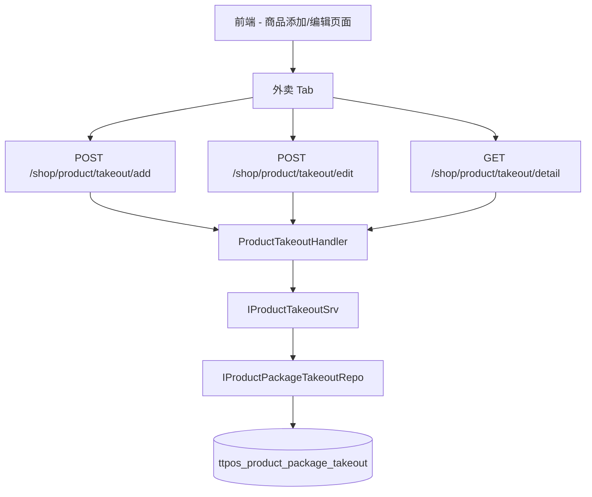

# 新管理端商品管理增加外卖商品模块 设计文档

> 本文档定义外卖商品管理功能的技术设计和实现方案。

## 📋 概述

在 Shop 商家管理端的商品添加/编辑页面中增加外卖 Tab，允许商户为店内商品配置外卖专属信息（外卖分类、价格、上下架状态等）。外卖商品通过 `ttpos_product_package_takeout` 表独立存储，与店内商品通过 `product_package_uuid` 关联。

**设计原则**：
- 外卖商品与店内商品相互独立，互不影响
- 规格信息复用 `ttpos_product_bom` 表
- 支持多外卖平台扩展（通过 `takeout_type` 字段）

---

## 🎯 规范对齐

### Go Main 规范 (go-main.mdc)

- ✅ Service 只依赖其他 Service 接口
- ✅ Repository 只持有 db 实例
- ✅ URL 使用 snake_case
- ✅ data 字段必须是对象
- ✅ 不使用 panic，返回 error

### API 设计规范 (api.mdc)

- ✅ URL 使用 snake_case：`/shop/product/takeout/add`
- ✅ 响应格式统一：`{code, message, data}`
- ✅ data 不能为 null 或数组

### 数据库规范 (database.mdc)

- ✅ 必需字段完整：id, uuid, create_time, update_time, delete_time
- ✅ 时间字段使用 int
- ✅ 外键使用 bigint unsigned

---

## 🔄 代码复用分析

### 可复用的现有组件

| 组件 | 路径 | 复用方式 |
|------|------|----------|
| 商品服务 | `main/app/service/product.go` | 参考 CRUD 逻辑 |
| 商品 API | `main/app/api/v1/shop/shop_product.go` | 参考 Handler 结构 |
| 通用 Repository | `main/app/repository/common_repo.go` | 使用选项模式 |
| 多语言服务 | `main/app/service/multi_language.go` | 创建/更新多语言名称 |

### 集成点

| 现有模块 | 集成方式 |
|----------|----------|
| `ttpos_product_package` | 通过 `product_package_uuid` 关联 |
| `ttpos_product_bom` | 共用规格信息，无需新建表 |
| `ttpos_product_category` | 通过 `category_uuid` 关联外卖分类 |
| `ttpos_file` | 通过 `image_file_uuid` 关联图片 |

---

## 🏗️ 架构设计

### 分层设计

```
┌─────────────────────────────────────┐
│         API Layer (Handler)         │
│  shop_product_takeout.go            │
├─────────────────────────────────────┤
│         Service Layer               │
│  product_takeout.go                 │
├─────────────────────────────────────┤
│         Repository Layer            │
│  product_package_takeout.go         │
├─────────────────────────────────────┤
│         Model Layer                 │
│  product_package_takeout.go         │
└─────────────────────────────────────┘
```

### 数据流



---

## 🗄️ 数据库设计

### 表：`ttpos_product_package_takeout`

```sql
CREATE TABLE IF NOT EXISTS `ttpos_product_package_takeout` (
    `id` bigint unsigned NOT NULL AUTO_INCREMENT COMMENT '自增ID',
    `uuid` bigint unsigned NOT NULL DEFAULT 0 COMMENT 'UUID',
    `product_package_uuid` bigint unsigned NOT NULL DEFAULT 0 COMMENT '商品包UUID，关联 ttpos_product_package.uuid',
    `name` text CHARACTER SET utf8mb4 COLLATE utf8mb4_unicode_ci COMMENT '商品包名称',
    `multi_language_name_uuid` bigint unsigned NOT NULL DEFAULT 0 COMMENT '多语言名称ID',
    `product_type` int(4) unsigned NOT NULL DEFAULT 0 COMMENT '商品类型, 0-商品 1-套餐',
    `takeout_type` int(4) unsigned NOT NULL DEFAULT 1 COMMENT '外卖类型 1-Grab 2-FoodPanda 3-其他（预留扩展）',
    `status` int(4) unsigned NOT NULL DEFAULT 0 COMMENT '外卖状态 0-下架 1-上架',
    `category_uuid` bigint unsigned NOT NULL DEFAULT 0 COMMENT '外卖分类UUID',
    `special_category_uuid` bigint unsigned NOT NULL DEFAULT 0 COMMENT '外卖特色分类UUID',
    `image_file_uuid` bigint unsigned NOT NULL DEFAULT 0 COMMENT '外卖商品图片UUID',
    `create_time` int(10) unsigned NOT NULL DEFAULT 0 COMMENT '创建时间',
    `update_time` int(10) unsigned NOT NULL DEFAULT 0 COMMENT '更新时间',
    `delete_time` int(10) unsigned NOT NULL DEFAULT 0 COMMENT '删除时间',
    UNIQUE KEY `idx_uuid` (`uuid`),
    UNIQUE KEY `idx_product_package_takeout_type` (`product_package_uuid`, `takeout_type`),
    KEY `idx_takeout_type` (`takeout_type`),
    KEY `idx_status` (`status`),
    KEY `idx_delete_time` (`delete_time`),
    PRIMARY KEY (`id`)
) ENGINE=InnoDB DEFAULT CHARSET=utf8mb4 COLLATE=utf8mb4_unicode_ci COMMENT='外卖商品表，存储商品的外卖专属信息';
```

### 索引设计

| 索引名 | 字段 | 类型 | 用途 |
|--------|------|------|------|
| `idx_uuid` | uuid | UNIQUE | 主查询 |
| `idx_product_package_takeout_type` | product_package_uuid, takeout_type | UNIQUE | 防止重复配置 |
| `idx_takeout_type` | takeout_type | INDEX | 按平台筛选 |
| `idx_status` | status | INDEX | 按状态筛选 |
| `idx_delete_time` | delete_time | INDEX | 软删除查询 |

---

## 📊 数据模型

### Go Model

```go
// main/app/model/product_package_takeout.go
type ProductPackageTakeout struct {
    BaseModel
    ProductPackageUuid    uint64 `gorm:"column:product_package_uuid"`
    MultiLanguageNameUuid uint64 `gorm:"column:multi_language_name_uuid"`
    Name                  string `gorm:"column:name"`
    ProductType           uint   `gorm:"column:product_type"`
    TakeoutType           uint   `gorm:"column:takeout_type"`
    Status                uint   `gorm:"column:status"`
    CategoryUuid          uint64 `gorm:"column:category_uuid"`
    SpecialCategoryUuid   uint64 `gorm:"column:special_category_uuid"`
    ImageFileUuid         uint64 `gorm:"column:image_file_uuid"`

    // 关联关系
    ProductPackage    ProductPackage    `gorm:"foreignKey:product_package_uuid;references:uuid"`
    MultiLanguageName MultiLanguageName `gorm:"foreignKey:multi_language_name_uuid;references:uuid"`
    ProductCategory   ProductCategory   `gorm:"foreignKey:category_uuid;references:uuid"`
    ImageFile         File              `gorm:"foreignKey:image_file_uuid;references:uuid"`
}
```

### DTO 定义

#### Request DTO

```go
// main/app/dto/req/product_takeout.go
type ProductTakeoutAddReq struct {
    ProductPackageUuid  uint64             `json:"product_package_uuid" binding:"required"`
    TakeoutType         uint               `json:"takeout_type" binding:"required"`
    LocaleName          dto.LocaleRequest  `json:"locale_name"`
    CategoryUuid        uint64             `json:"category_uuid"`
    SpecialCategoryUuid uint64             `json:"special_category_uuid"`
    Status              uint               `json:"status"`
    ImageFileUuid       uint64             `json:"image_file_uuid"`
}

type ProductTakeoutEditReq struct {
    Uuid                uint64             `json:"uuid" binding:"required"`
    LocaleName          dto.LocaleRequest  `json:"locale_name"`
    CategoryUuid        uint64             `json:"category_uuid"`
    SpecialCategoryUuid uint64             `json:"special_category_uuid"`
    Status              uint               `json:"status"`
    ImageFileUuid       uint64             `json:"image_file_uuid"`
}
```

#### Response DTO

```go
// main/app/dto/resp/product_takeout.go
type ProductTakeoutDetailResp struct {
    Uuid                uint64             `json:"uuid"`
    ProductPackageUuid  uint64             `json:"product_package_uuid"`
    TakeoutType         uint               `json:"takeout_type"`
    LocaleName          dto.LocaleResponse `json:"locale_name"`
    ProductType         uint               `json:"product_type"`
    CategoryUuid        uint64             `json:"category_uuid"`
    CategoryName        dto.LocaleResponse `json:"category_name"`
    SpecialCategoryUuid uint64             `json:"special_category_uuid"`
    Status              uint               `json:"status"`
    ImageUrl            string             `json:"image_url"`
}
```

---

## 🔌 API 设计

### RESTful API

| 方法 | 路径 | 说明 | 状态 |
|------|------|------|------|
| POST | `/shop/product/takeout/add` | 添加外卖商品 | ✅ 已实现 |
| POST | `/shop/product/takeout/edit` | 编辑外卖商品 | ✅ 已实现 |
| GET | `/shop/product/takeout/detail` | 获取外卖商品详情 | ✅ 已实现 |
| DELETE | `/shop/product/takeout/delete` | 删除外卖商品 | ✅ 已实现 |
| POST | `/shop/product/takeout/status` | 修改外卖商品状态 | ✅ 已实现 |

### API 详情

#### 1. 添加外卖商品

```
POST /shop/product/takeout/add
Content-Type: application/json
Authorization: Bearer {token}

Request:
{
  "product_package_uuid": 123456789,
  "takeout_type": 1,
  "locale_name": { "zh": "外卖商品名", "en": "Takeout Product" },
  "category_uuid": 111,
  "special_category_uuid": 222,
  "status": 0,
  "image_file_uuid": 333
}

Response:
{
  "code": 1,
  "message": "保存成功",
  "data": {}
}
```

#### 2. 获取外卖商品详情

```
GET /shop/product/takeout/detail?uuid=123456789
Authorization: Bearer {token}

Response:
{
  "code": 1,
  "message": "success",
  "data": {
    "uuid": 123456789,
    "product_package_uuid": 987654321,
    "takeout_type": 1,
    "locale_name": { "zh": "外卖商品名", "en": "Takeout Product" },
    "product_type": 0,
    "category_uuid": 111,
    "category_name": { "zh": "热菜", "en": "Hot Dishes" },
    "status": 1,
    "image_url": "https://..."
  }
}
```

---

## 🧩 组件和接口

### Service 层

```go
// main/app/service/product_takeout.go
type IProductTakeoutSrv interface {
    Add(ctx *context.Context, req *req.ProductTakeoutAddReq) error
    Edit(ctx *context.Context, req *req.ProductTakeoutEditReq) error
    Detail(ctx *context.Context, uuid uint64) (*resp.ProductTakeoutDetailResp, error)
    Delete(ctx *context.Context, uuid uint64) error
    UpdateStatus(ctx *context.Context, uuid uint64, status uint) error
}
```

### Repository 层

```go
// main/app/repository/product_package_takeout.go
type IProductPackageTakeoutRepo interface {
    Create(takeout *model.ProductPackageTakeout) error
    Update(takeout *model.ProductPackageTakeout) error
    GetByUuid(uuid uint64, opts ...DBOption) (*model.ProductPackageTakeout, error)
    GetByProductPackageAndType(productPackageUuid uint64, takeoutType uint, opts ...DBOption) (*model.ProductPackageTakeout, error)
    Delete(uuid uint64) error
    
    // 预加载选项
    WithProductPackage(opts ...DBOption) DBOption
    WithMultiLanguageName(opts ...DBOption) DBOption
    WithProductCategory(opts ...DBOption) DBOption
    WithImageFile(opts ...DBOption) DBOption
    
    // 查询选项
    WhereByTakeoutType(takeoutType uint) DBOption
    WhereByStatus(status uint) DBOption
}
```

---

## 🚨 错误处理

### 错误场景

| 场景 | 错误码 | 错误信息 | 处理方式 |
|------|--------|----------|----------|
| 商品包不存在 | CodeFail | 商品不存在 | 返回错误提示 |
| 外卖配置已存在 | CodeFail | 该商品已存在此类型的外卖配置 | 返回错误提示 |
| 外卖商品不存在 | CodeFail | 外卖商品不存在 | 返回错误提示 |
| 参数验证失败 | CodeParamError | {字段}不能为空 | 返回验证错误 |

---

## 🔒 安全设计

### 身份验证

- ✅ 所有 API 需要 JWT Token 验证
- ✅ 使用 `middleware.Auth()` 中间件

### 权限控制

- ✅ 只有 Shop 端用户可以操作
- ✅ 用户只能操作自己商户的数据

### 数据安全

- ✅ 使用参数化查询防止 SQL 注入
- ✅ 软删除保护数据

---

## 📚 实现清单

### Phase 1: 数据库和模型 ✅ 已完成

- [x] 创建数据库迁移文件
- [x] 创建 Go Model
- [x] 更新 Seeds 文件

### Phase 2: 后端核心实现 ✅ 已完成

- [x] 实现 Repository 接口和实现
- [x] 实现 Service 接口和实现
- [x] 实现 API Handler
- [x] 创建 DTO 定义
- [x] 注册 API 路由

### Phase 3: 前端实现 🚧 待开发

- [ ] 创建 API 封装
- [ ] 商品添加页面增加外卖 Tab
- [ ] 商品编辑页面增加外卖 Tab
- [ ] 外卖商品表单组件

### Phase 4: 测试

- [ ] 单元测试
- [ ] API 测试
- [ ] 集成测试

**详细任务**: 参见 `tasks.md`

---

## Graphiti & 活动日志

- Related Episode: `[待补充]`
- 模板：`docs/agent/templates/graphiti-episode.md`
- 活动日志：`docs/team/activities/{YYYY-MM}/{YYYY-MM-DD}.md`

---

**版本**: v1.0.0  
**创建日期**: 2025-12-09  
**作者**: weifashi  
**审核者**: 待定

