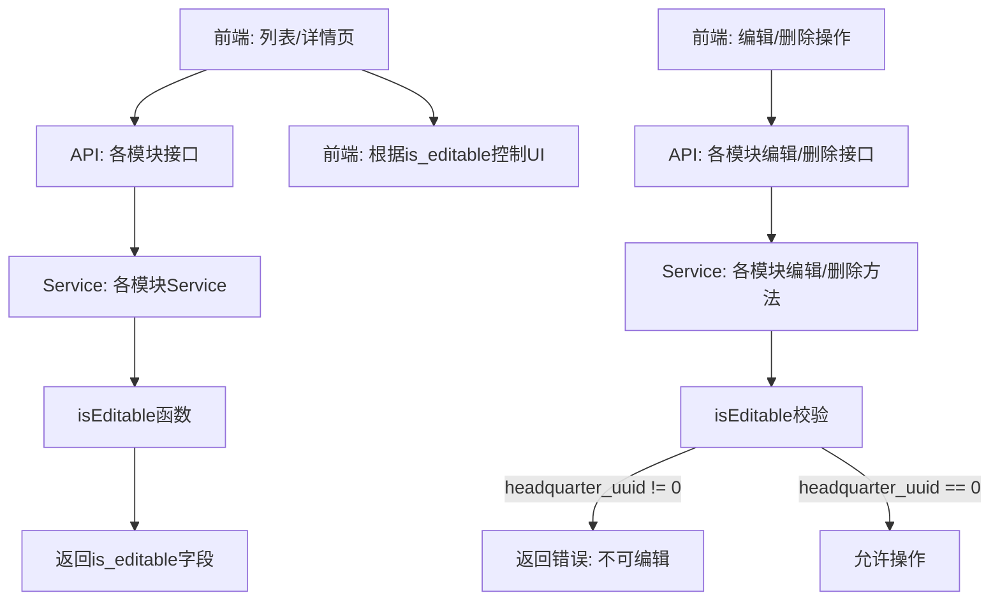

# 参考商品单位实现，来源总部的数据不可编辑 设计文档

> 本文档定义参考商品单位（ProductUnit）的实现方式，为多个模块实现总部来源数据不可编辑功能的技术设计和实现方案。

## 📋 概述

参考商品单位（ProductUnit）模块的实现方式，为以下模块实现总部来源数据不可编辑的功能：
- **菜品标签**（ProductLabel）
- **满额减**（FullReductionActivity）
- **商品**（ProductPackage）

**核心实现**：
1. 在响应结构中添加 `is_editable` 字段
2. 在列表/详情接口中返回 `is_editable` 字段（使用 `isEditable()` 函数判断）
3. 在编辑/删除接口中增加总部来源数据校验
4. 前端根据 `is_editable` 字段控制 UI

**参考实现**：商品单位（ProductUnit）模块已完整实现，代码位置：
- Service：`main/app/service/product.go` - `GetProductUnitList()`, `GetProductUnit()`, `EditProductUnit()`, `DeleteProductUnit()`, `isEditable()`
- 响应结构：`main/app/dto/resp/product_resp/product.go` - `ProductUnitItem`, `ProductUnitDetail`

**关联任务**：DooTask #37479  
**前端仓库**：shop-headquarters-branch-granular-sync

---

## 🎯 规范对齐

### Go Main 规范 (go-main.mdc)

- ✅ Service 只依赖其他 Service 接口
- ✅ Repository 只持有 db 实例
- ✅ URL 使用 snake_case
- ✅ data 字段必须是对象
- ✅ 不使用 panic，返回 error
- ✅ 复用 `isEditable()` 函数，保持代码一致性

### API 设计规范 (api.mdc)

- ✅ URL 使用 snake_case（各模块现有接口保持不变）
- ✅ 响应格式统一：`{code, message, data}`
- ✅ data 不能为 null 或数组（使用对象包裹）
- ✅ 新增 `is_editable` 字段到响应结构

### 数据库规范 (database.mdc)

- ✅ 所有相关表已有 `headquarter_uuid` 字段（由同步功能添加）
- ✅ 字段类型：`bigint unsigned NOT NULL DEFAULT 0`
- ✅ 已有索引：`idx_headquarter_uuid`

---

## 🔄 代码复用分析

### 可复用的现有组件

- **isEditable() 函数**: `main/app/service/product.go` - 第2634行
  ```go
  func isEditable(_ context.Context, headquarterUuid uint64) bool {
      return headquarterUuid == 0
  }
  ```
  - 所有模块复用此函数，保持判断逻辑一致

- **ProductUnit 实现模式**: 
  - 列表接口：返回 `is_editable` 字段
  - 详情接口：返回 `is_editable` 字段
  - 编辑接口：校验 `isEditable()`，拒绝编辑总部来源数据
  - 删除接口：校验 `isEditable()`，拒绝删除总部来源数据

### 集成点

- **各模块的 Service 层**：在现有方法中添加 `is_editable` 字段和校验逻辑
- **各模块的响应结构**：在 DTO 中添加 `is_editable` 字段
- **前端 UI**：根据 `is_editable` 字段控制编辑按钮和表单字段

---

## 🏗️ 架构设计

### 分层设计原则

**Go Main 三层架构**:

```
API 层 (Controller/API)
  ↓ 依赖
业务层 (Service)
  ↓ 依赖
数据层 (Repository)
```

**实现位置**：

1. **Service 层**：在各模块的 Service 方法中：
   - 列表方法：返回 `is_editable` 字段
   - 详情方法：返回 `is_editable` 字段
   - 编辑方法：增加 `isEditable()` 校验
   - 删除方法：增加 `isEditable()` 校验

2. **DTO 层**：在各模块的响应结构中添加 `is_editable` 字段

3. **前端层**：根据 `is_editable` 字段控制 UI

### 架构图



### 模块划分

#### 1. 菜品标签（ProductLabel）

- **Service**: `main/app/service/product_label.go`
  - `GetProductLabelList()` - 添加 `is_editable` 字段
  - `EditProductLabel()` - 添加总部来源数据校验
  - `DeleteProductLabel()` - 添加总部来源数据校验

- **DTO**: `main/app/dto/resp/product_label.go`
  - `ProductLabelDetail` - 添加 `IsEditable bool` 字段

#### 2. 满额减（FullReductionActivity）

- **Service**: `main/app/service/full_reduction_activity_srv.go`
  - 列表/详情方法 - 添加 `is_editable` 字段
  - 编辑方法 - 添加总部来源数据校验
  - 删除方法 - 添加总部来源数据校验

- **DTO**: `main/app/dto/resp/full_reduction_activity_resp.go`
  - `FullReductionActivityResp` - 添加 `IsEditable bool` 字段

#### 3. 商品（ProductPackage）- 特殊规则

- **Service**: `main/app/service/product.go`
  - 列表/详情方法 - 已有 `is_editable` 字段（✅ 已存在）
  - 编辑方法 - 添加总部来源数据校验（特殊规则：允许修改外卖价格、上下架）
  - 删除方法 - 添加总部来源数据校验

- **DTO**: `main/app/dto/resp/product_resp/product.go`
  - 响应结构 - 已有 `IsEditable bool` 字段（✅ 已存在）

---

## 🔧 核心实现方案

### 1. 统一判断函数

**复用商品单位的 `isEditable()` 函数**：

```go
// main/app/service/product.go (第2634行)
func isEditable(_ context.Context, headquarterUuid uint64) bool {
    return headquarterUuid == 0
}
```

**使用方式**：
- 在列表/详情方法中：`IsEditable: isEditable(ctx, model.HeadquarterUuid)`
- 在编辑/删除方法中：`if !isEditable(ctx, model.HeadquarterUuid) { return errors.New("不可编辑") }`

### 2. 响应结构修改

**参考 ProductUnit 的响应结构**：

```go
// ProductUnitItem (参考)
type ProductUnitItem struct {
    Uuid       uint64 `json:"uuid"`
    Name       string `json:"name"`
    IsEditable bool   `json:"is_editable"` // 新增字段
}

// ProductUnitDetail (参考)
type ProductUnitDetail struct {
    Uuid       uint64 `json:"uuid"`
    IsEditable bool   `json:"is_editable"` // 新增字段
}
```

**各模块需要添加的字段**：

```go
// ProductLabelDetail
type ProductLabelDetail struct {
    // ... 现有字段
    IsEditable bool `json:"is_editable"` // 新增
}

// FullReductionActivityResp
type FullReductionActivityResp struct {
    // ... 现有字段
    IsEditable bool `json:"is_editable"` // 新增
}

```

### 3. Service 方法修改

#### 列表方法修改（参考 ProductUnit）

```go
// 参考：GetProductUnitList() (第2006行)
func (s *productSrv) GetProductUnitList(ctx context.Context, req req.ProductUnitListReq) (product_resp.ProductUnitListResp, error) {
    // ... 查询逻辑
    
    for _, unit := range units {
        productUnitList = append(productUnitList, product_resp.ProductUnitItem{
            // ... 其他字段
            IsEditable: isEditable(ctx, unit.HeadquarterUuid), // 添加这行
        })
    }
    
    return product_resp.ProductUnitListResp{...}, nil
}
```

#### 详情方法修改（参考 ProductUnit）

```go
// 参考：GetProductUnit() (第2044行)
func (s *productSrv) GetProductUnit(ctx context.Context, getUnitReq req.ProductUnitReq) (product_resp.ProductUnitDetail, error) {
    // ... 查询逻辑
    
    productUnit := product_resp.ProductUnitDetail{
        // ... 其他字段
        IsEditable: isEditable(ctx, unit.HeadquarterUuid), // 添加这行
    }
    
    return productUnit, nil
}
```

#### 编辑方法修改（参考 ProductUnit）

```go
// 参考：EditProductUnit() (第2260行)
func (s *productSrv) EditProductUnit(ctx context.Context, editUnitReq req.ProductUnitEditReq) error {
    // ... 查询单位
    
    if !isEditable(ctx, productUnit.HeadquarterUuid) { // 添加这行
        return errors.New("单位不可编辑") // 添加这行
    } // 添加这行
    
    // ... 编辑逻辑
}
```

#### 删除方法修改（参考 ProductUnit）

```go
// 参考：DeleteProductUnit() (第2375行)
func (s *productSrv) DeleteProductUnit(ctx context.Context, deleteUnitReq req.ProductUnitReq) error {
    // ... 查询单位
    
    if !isEditable(ctx, productUnit.HeadquarterUuid) { // 添加这行
        return errors.New("单位不可删除") // 添加这行
    } // 添加这行
    
    // ... 删除逻辑
}
```

### 4. 特殊规则处理

#### 商品（ProductPackage）- 允许修改外卖价格、上下架

```go
func (s *productSrv) EditProductPackage(ctx context.Context, editReq req.ProductPackageEditReq) error {
    // ... 查询商品
    
    if !isEditable(ctx, productPackage.HeadquarterUuid) {
        // 特殊规则：允许修改外卖价格、上下架
        // 检查是否只修改了允许的字段
        if !isOnlyEditingAllowedFields(editReq) {
            return errors.New("商品不可编辑")
        }
    }
    
    // ... 编辑逻辑
}

func isOnlyEditingAllowedFields(editReq req.ProductPackageEditReq) bool {
    // 只允许修改外卖价格、上下架字段
    // 其他字段不允许修改
    // 实现逻辑...
}
```

---

## 🗄️ 数据库设计

### 现有字段

所有相关表已有 `headquarter_uuid` 字段（由同步功能添加）：

- `ttpos_product_label.headquarter_uuid`
- `ttpos_full_reduction_activity.headquarter_uuid`
- `ttpos_product_package.headquarter_uuid`

**字段定义**：
```sql
`headquarter_uuid` bigint unsigned NOT NULL DEFAULT 0 COMMENT '总部uuid，0表示本店创建，>0表示从总部同步'
```

**索引**：
```sql
KEY `idx_headquarter_uuid` (`headquarter_uuid`)
```

**无需新增数据库字段**，只需使用现有字段。

---

## 🔌 API 设计

### 现有接口保持不变

所有模块的现有 API 接口保持不变，只需在响应中添加 `is_editable` 字段：

#### 菜品标签接口

- `GET /shop/product/label/list` - 列表接口（添加 `is_editable` 字段）
- `POST /shop/product/label/edit` - 编辑接口（添加校验）
- `POST /shop/product/label/delete` - 删除接口（添加校验）

#### 满额减接口

- `GET /shop/full_reduction_activity/list` - 列表接口（添加 `is_editable` 字段）
- `GET /shop/full_reduction_activity/detail` - 详情接口（添加 `is_editable` 字段）
- `POST /shop/full_reduction_activity/edit` - 编辑接口（添加校验）
- `POST /shop/full_reduction_activity/delete` - 删除接口（添加校验）

#### 商品接口

- `GET /shop/product/list` - 列表接口（已有 `is_editable` 字段）
- `GET /shop/product/detail` - 详情接口（已有 `is_editable` 字段）
- `POST /shop/product/edit` - 编辑接口（添加校验，特殊规则）
- `POST /shop/product/delete` - 删除接口（添加校验）

### 响应格式示例

```json
{
  "code": 1,
  "message": "success",
  "data": {
    "list": [
      {
        "uuid": 10001,
        "name": "标签名称",
        "is_editable": false  // 新增字段
      }
    ]
  }
}
```

### 错误响应示例

```json
{
  "code": 0,
  "message": "标签不可编辑",
  "data": null
}
```

---

## 🧪 测试策略

### 单元测试

- **Service 层测试**：
  - 测试 `isEditable()` 函数（headquarter_uuid = 0 和 != 0 的情况）
  - 测试列表/详情方法返回 `is_editable` 字段
  - 测试编辑/删除方法拒绝总部来源数据

- **Repository 层测试**：
  - 无需新增测试（使用现有 Repository）

### 集成测试

- **API 测试**：
  - 测试列表接口返回 `is_editable` 字段
  - 测试详情接口返回 `is_editable` 字段
  - 测试编辑接口拒绝总部来源数据
  - 测试删除接口拒绝总部来源数据

### 前端测试

- **UI 测试**：
  - 测试列表页根据 `is_editable` 控制编辑按钮
  - 测试详情页根据 `is_editable` 禁用表单字段
  - 测试错误提示显示

---

## 📝 实现步骤

### Phase 1: 菜品标签实现（1天）

1. 修改响应结构：添加 `IsEditable` 字段
2. 修改列表方法：返回 `is_editable` 字段
3. 修改编辑方法：添加总部来源数据校验
4. 修改删除方法：添加总部来源数据校验
5. 前端 UI 实现

### Phase 2: 满额减实现（1天）

1. 修改响应结构：添加 `IsEditable` 字段
2. 修改列表/详情方法：返回 `is_editable` 字段
3. 修改编辑方法：添加总部来源数据校验
4. 修改删除方法：添加总部来源数据校验
5. 前端 UI 实现

### Phase 3: 商品实现（特殊规则）（1.5天）

1. 确认响应结构已有 `IsEditable` 字段（✅ 已存在）
2. 修改编辑方法：添加总部来源数据校验（特殊规则：允许修改外卖价格、上下架）
3. 修改删除方法：添加总部来源数据校验
4. 前端 UI 实现（特殊处理）

### Phase 4: 测试和优化（1天）

1. 单元测试补充
2. API 测试补充
3. 集成测试
4. UI 交互测试

---

## 🔍 代码审查要点

1. **一致性检查**：
   - 所有模块使用相同的 `isEditable()` 函数
   - 所有模块的错误提示格式一致
   - 所有模块的响应结构格式一致

2. **特殊规则检查**：
   - 商品：只允许修改外卖价格、上下架

3. **前端检查**：
   - 所有模块的 UI 控制一致
   - 错误提示明确

---

## 📚 参考资料

### 参考实现

- **商品单位（ProductUnit）**：
  - Service：`main/app/service/product.go`
    - `GetProductUnitList()` - 第2006行
    - `GetProductUnit()` - 第2044行
    - `EditProductUnit()` - 第2260行
    - `DeleteProductUnit()` - 第2375行
    - `isEditable()` - 第2634行
  - 响应结构：`main/app/dto/resp/product_resp/product.go`
    - `ProductUnitItem` - 第225行
    - `ProductUnitDetail` - 第248行

### 相关文档

- **总部-分店颗粒化同步**：`docs/shared/specs/active/shop-headquarters-branch-granular-sync-backend/`

---

**版本**: v1.0.0  
**创建日期**: 2025-12-08  
**作者**: 曾振华  
**审核者**: {审核者}
