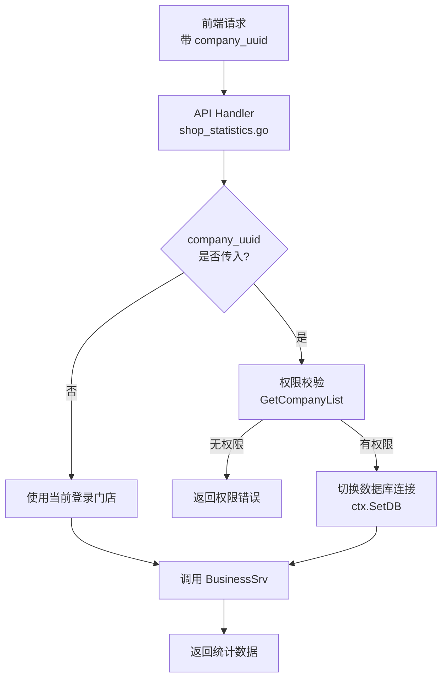

# story-shop-home-store-switch 技术设计

## 📋 概述

| 项目       | 内容                         |
| ---------- | ---------------------------- |
| Spec ID    | story-shop-home-store-switch |
| 设计人     | 王昱                         |
| 设计日期   | 2026-02-25                   |
| 总 SP      | 2                            |

## 🔄 代码复用分析

### 可复用代码

| 文件                                  | 说明                   | 复用方式 |
| ------------------------------------- | ---------------------- | -------- |
| `main/app/service/business.go:3792`   | GetCompanyList 权限校验 | 直接调用 |
| `main/app/api/v1/shop/shop_statistics.go` | 现有 3 个统计接口      | 扩展     |

### 需要修改

| 文件                                      | 说明                              |
| ----------------------------------------- | --------------------------------- |
| `main/app/api/v1/shop/shop_statistics.go` | 3 个 Handler 增加 company_uuid 支持 |
| `main/app/dto/req/business_data.go`       | 请求 DTO 增加 CompanyUuid 字段    |

## 🏗️ 架构设计

### 架构图



### 实现方案

**核心思路**：在 Handler 层处理 company_uuid 参数，进行权限校验后切换数据库连接。

1. **参数解析**：从请求中获取可选的 `company_uuid` 参数
2. **权限校验**：复用 `GetCompanyList` 检查用户是否有权限访问目标门店
3. **数据库切换**：通过 `ctx.SetDB()` 切换到目标门店的数据库连接
4. **业务调用**：调用现有 Service 方法获取数据

### 分层说明

- **API Layer**: `main/app/api/v1/shop/shop_statistics.go` - 增加 company_uuid 处理逻辑
- **Service Layer**: `main/app/service/business.go` - 无需修改，复用现有方法
- **DTO Layer**: `main/app/dto/req/business_data.go` - 增加 CompanyUuid 字段

## 🧩 组件和接口

### Handler 修改: statisticsHandler

**位置**: `main/app/api/v1/shop/shop_statistics.go`

**修改的方法**:

| 方法名           | 行号    | 修改内容                            |
| ---------------- | ------- | ----------------------------------- |
| `CountBusiness`  | 22-49   | 增加 company_uuid 解析和数据库切换   |
| `CountArea`      | 134-161 | 增加 company_uuid 解析和数据库切换   |
| `CountProductRank` | 163-190 | 增加 company_uuid 解析和数据库切换 |

**通用逻辑（抽取为辅助方法）**:

```go
// switchCompanyContext 切换到指定门店的数据库上下文
// 如果 companyUuid 为空，返回原 ctx；否则校验权限并切换数据库
func (h *statisticsHandler) switchCompanyContext(ctx *context.Context, companyUuid uint64) (*context.Context, error) {
    if companyUuid == 0 {
        return ctx, nil
    }

    // 1. 权限校验：检查用户是否有权限访问该门店
    companyList := h.businessSrv.GetCompanyList(ctx, ...)
    hasPermission := false
    for _, c := range companyList {
        if c.Uuid == companyUuid {
            hasPermission = true
            break
        }
    }
    if !hasPermission {
        return nil, errors.NewForbiddenError("无权限访问该门店")
    }

    // 2. 切换数据库连接
    db := h.dbm.GetDB(companyUuid)
    newCtx := ctx.Clone()
    newCtx.SetDB(db)

    return newCtx, nil
}
```

## 📊 数据模型

### DTO 修改: BusinessDataCountReq

**位置**: `main/app/dto/req/business_data.go`

```go
type BusinessDataCountReq struct {
    // ... 现有字段
    CompanyUuid uint64 `form:"company_uuid" json:"company_uuid"` // 可选，指定查询的门店
}
```

### DTO 修改: BusinessDataRankProductReq

**位置**: `main/app/dto/req/business_data.go`

```go
type BusinessDataRankProductReq struct {
    // ... 现有字段
    CompanyUuid uint64 `form:"company_uuid" json:"company_uuid"` // 可选，指定查询的门店
}
```

## 🔌 API 设计

### /shop/statistics/business

| 项目   | 内容                                        |
| ------ | ------------------------------------------- |
| Method | GET                                         |
| Path   | /shop/statistics/business                   |
| 新增参数 | `company_uuid` (可选) - 指定查询的门店 UUID |
| 响应   | 无变化                                      |

### /shop/statistics/area

| 项目   | 内容                                        |
| ------ | ------------------------------------------- |
| Method | GET                                         |
| Path   | /shop/statistics/area                       |
| 新增参数 | `company_uuid` (可选) - 指定查询的门店 UUID |
| 响应   | 无变化                                      |

### /shop/statistics/product_rank

| 项目   | 内容                                        |
| ------ | ------------------------------------------- |
| Method | GET                                         |
| Path   | /shop/statistics/product_rank               |
| 新增参数 | `company_uuid` (可选) - 指定查询的门店 UUID |
| 响应   | 无变化                                      |

## ⚠️ 风险识别

| 风险                   | 影响 | 缓解措施                                     |
| ---------------------- | ---- | -------------------------------------------- |
| 权限校验逻辑不一致     | 中   | 复用 GetCompanyList，与门店汇总统计保持一致   |
| 数据库切换后上下文污染 | 低   | 使用 ctx.Clone() 创建新上下文                |
| 向后兼容性问题         | 低   | company_uuid 为可选参数，不传时保持原有逻辑 |

## 🧪 测试策略

**目标覆盖率**:
- Handler 层: 70%+

**测试场景**:

| 场景                        | 预期结果             |
| --------------------------- | -------------------- |
| 不传 company_uuid           | 返回当前登录门店数据 |
| 传入有权限的 company_uuid   | 返回指定门店数据     |
| 传入无权限的 company_uuid   | 返回权限错误         |
| 传入不存在的 company_uuid   | 返回错误提示         |

**测试命令**:
```bash
cd main && go test -v ./app/api/v1/shop/... -run TestStatistics
```

---

**版本**: v1.0.0
**创建日期**: 2026-02-25
