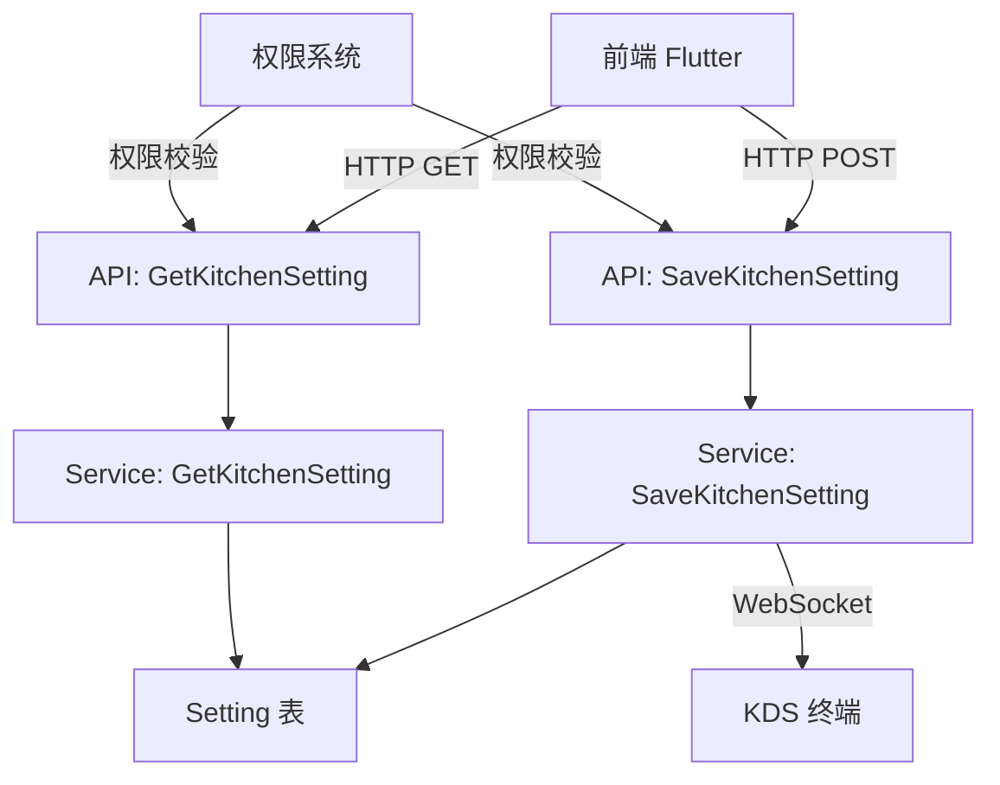

# KDS 等待时长颜色配置 设计文档

> 本文档定义 KDS 等待时长颜色配置功能的技术设计和实现方案。

## 📋 概述

本功能为新管理端（Shop）提供等待时长颜色配置的后端支持，允许门店管理员自定义配置等待时长的颜色方案。配置通过 WebSocket 实时下发到 KDS 终端生效。

**核心设计原则**：
- 保持向后兼容：保留 `WaitColor` 字段，新增 `WaitTimeColorRanges` 字段
- 数据格式转换：自动处理新旧格式转换（旧格式：`["red", "yellow"]`，新格式：RGB 格式）
- 实时配置下发：通过 WebSocket 推送配置更新
- 权限控制：基于角色权限系统控制访问

---

## 🎯 规范对齐

### Go Main 规范 (go-main.mdc)

- ✅ Service 只依赖其他 Service 接口
- ✅ Repository 只持有 db 实例
- ✅ URL 使用 snake_case (`/api/v1/shop/setting/kitchen`)
- ✅ data 字段必须是对象
- ✅ 不使用 panic，返回 error
- ✅ 使用 `errors.WithMessage` 包装错误

### API 设计规范 (api.mdc)

- ✅ URL 使用 snake_case
- ✅ 响应格式统一：`{code, message, data{}}`
- ✅ data 不能为 null 或数组
- ✅ 错误信息使用多语言

### 数据库规范 (database.mdc)

- ✅ 复用现有 `setting` 表，不新增表
- ✅ 配置存储在 `values` 字段（JSON 格式）
- ✅ 时间字段使用 int 类型

---

## 🔄 代码复用分析

### 可复用的现有组件

- **Setting Service**: `main/app/service/setting/setting.go` - 复用现有的 `GetKitchenSetting` 方法，扩展 `SaveKitchenSetting` 方法
- **WebSocket 推送**: `main/pkg/websocket/websocket.go` - 复用 `PushClient` 方法推送配置更新
- **DTO 结构**: `main/app/dto/resp/setting/kitchen_setting.go` - 扩展 `KitchenResp` 结构体
- **默认配置**: `main/app/service/setting/default.go` - 复用 `getDefaultKitchen` 方法
- **权限系统**: `admin/database/migrations/20251124014502_init_management_app_access.php` - 参考权限迁移文件格式

### 集成点

- **Setting 表**: 配置存储在 `setting` 表的 `values` 字段（key = `kitchen`）
- **WebSocket 服务**: 通过 gRPC 调用 WebSocket 服务推送配置更新
- **权限系统**: 集成到现有的角色权限系统

---

## 🏗️ 架构设计

### 分层设计原则

**Go Main 三层架构**:

```
API 层 (shop_setting.go)
  ↓ 依赖
业务层 (setting/setting.go)
  ↓ 依赖
数据层 (setting 表)
```

**依赖规则**:
- ✅ API 层依赖 Service 接口
- ✅ Service 层依赖其他 Service 接口（不依赖 Repository）
- ✅ Service 层直接操作数据库（通过 DBManager）

### 架构图



### 模块划分

#### Go Main 模块

- **API 层**: `main/app/api/v1/shop/shop_setting.go` - 路由处理、参数校验
- **Service 层**: `main/app/service/setting/setting.go` - 业务逻辑、配置保存、WebSocket 推送
- **DTO 层**: `main/app/dto/` - 数据传输对象
  - `req/setting/kitchen_setting.go` - 请求参数
  - `resp/setting/kitchen_setting.go` - 响应数据

#### PHP Admin 模块

- **Controller 层**: `admin/app/shop/controller/setting/Terminal.php` - `kitchen()` 方法处理厨显设置
  - GET 请求：获取厨显设置（包含 `wait_time_color_ranges` 字段）
  - POST 请求：保存厨显设置（接收并保存 `wait_time_color_ranges` 字段）
- **迁移文件**: `admin/database/migrations/` - 权限迁移和数据迁移

---

## 🗄️ 数据库设计

### 数据表设计

#### 复用现有表: setting

**表结构**（已存在）:

```sql
CREATE TABLE `setting` (
    `id` bigint unsigned NOT NULL AUTO_INCREMENT COMMENT '主键ID',
    `key` varchar(50) NOT NULL COMMENT '设置key',
    `describe` varchar(255) NOT NULL COMMENT '描述',
    `values` text NOT NULL COMMENT '设置值（JSON格式）',
    `app_id` int NOT NULL DEFAULT 0 COMMENT '应用ID',
    `shop_supplier_id` int NOT NULL DEFAULT 0 COMMENT '商家供应商ID',
    `create_time` int NOT NULL DEFAULT 0 COMMENT '创建时间',
    `update_time` int NOT NULL DEFAULT 0 COMMENT '更新时间',
    PRIMARY KEY (`id`),
    KEY `idx_key_app_supplier` (`key`, `app_id`, `shop_supplier_id`)
) ENGINE=InnoDB DEFAULT CHARSET=utf8mb4 COMMENT='设置表';
```

**配置存储格式**（JSON）:

```json
{
  "is_open": "1",
  "is_come_dish": "1",
  "is_call_service": "1",
  "server": {
    "ip": "192.168.1.100",
    "port": "8080"
  },
  "is_wait_color": "1",
  "wait_color": ["red", "yellow"],
    "wait_time_color_ranges": [
      {"minute": "0", "color": "#100A05"},
      {"minute": "10", "color": "#FFBE00"},
      {"minute": "20", "color": "#E50028"}
    ],
  "language": ["en", "zh"],
  "default_language": "en",
  "is_smart_kitchen": "0"
}
```

**字段说明**:
- `wait_color` ([]string): 旧格式，保持向后兼容，格式：`["red", "yellow"]` 或 `["yellow", "red"]`
  - 第一个元素对应第二区间（10分钟）的颜色
  - 第二个元素对应第三区间（20分钟）的颜色
  - 取值只能是 `"red"` 或 `"yellow"`
- `wait_time_color_ranges` ([]object): 新格式，格式：`[{"minute": "0", "color": "#100A05"}, ...]`（注意：`minute` 为字符串类型以兼容 PHP）
  - 统一使用 RGB 格式（`#xxxxxx`）
  - 颜色值不限定，支持任意 RGB 颜色值

### 数据库迁移

**权限迁移文件**: `admin/database/migrations/20251209101829_add_kitchen_wait_time_color_access.php`

**数据迁移文件**: `admin/database/migrations/{YYYYMMDDHHMMSS}_add_kitchen_wait_time_color_config.php`

---

## 📊 数据模型

### Go Model

```go
// main/app/dto/resp/setting/kitchen_setting.go

// WaitTimeColorRange 等待时长颜色区间
type WaitTimeColorRange struct {
    Minute string `json:"minute"` // 时间阈值（分钟，字符串类型以兼容 PHP）
    Color  string `json:"color"`   // 颜色值（RGB 格式，统一使用 #xxxxxx 格式，不限定颜色值）
}

// KitchenResp 厨显设置，接口响应
type KitchenResp struct {
    IsOpen              string               `json:"is_open"`                // 是否开启厨显功能 0关闭 1开启
    IsComeDish          string               `json:"is_come_dish"`            // 是否开启来菜提醒 0-关闭 1-开启
    IsCallService       string               `json:"is_call_service"`         // 是否开启顾客呼叫提醒 0-关闭 1-开启
    Server              Server               `json:"server"`                  // 厨显服务器连接
    IsWaitColor         string               `json:"is_wait_color"`           // 是否开启等待时长颜色 0-关闭 1-开启
    WaitColor           []string             `json:"wait_color"`               // 时长颜色（旧格式，保持兼容：["red", "yellow"]）
    WaitTimeColorRanges []WaitTimeColorRange `json:"wait_time_color_ranges"`  // 等待时长颜色区间配置（新格式）
    LanguageList        []dto.LanguageItem   `json:"language_list"`           // 语言列表
    Language            []string             `json:"language"`                 // 常用语言
    DefaultLanguage     string               `json:"default_language"`         // 默认语言
    IsSmartKitchen      string               `json:"is_smart_kitchen"`        // 是否开启智能后厨 0-关闭 1-开启
}

// Kitchen 厨显设置（包含敏感信息）
type Kitchen struct {
    KitchenResp
    AdvancedPassword string `json:"advanced_password"` // 高级设置密码
}
```

### DTO 定义

#### Request DTO

```go
// main/app/dto/req/setting/kitchen_setting.go

// SaveKitchenSettingReq 保存厨显设置请求
type SaveKitchenSettingReq struct {
    IsWaitColor         string               `json:"is_wait_color" binding:"required,oneof=0 1"` // 是否开启等待时长颜色 0-关闭 1-开启
    WaitTimeColorRanges []WaitTimeColorRange `json:"wait_time_color_ranges" binding:"required,dive"` // 等待时长颜色区间配置
}

// WaitTimeColorRange 等待时长颜色区间
type WaitTimeColorRange struct {
    Minute string `json:"minute" binding:"required"` // 时间阈值（分钟，字符串类型以兼容 PHP）
    Color  string `json:"color" binding:"required"`  // 颜色值（RGB 格式，如 #000000，或旧格式 red/yellow）
}
```

#### Response DTO

```go
// main/app/dto/resp/setting/kitchen_setting.go
// 使用 KitchenResp（见上方定义）
```

---

## 🔌 API 设计

### RESTful API

#### API 1: 获取厨显设置

**请求**:

- **URL**: `/api/v1/shop/setting/kitchen`
- **Method**: `GET`
- **Headers**:
  ```json
  {
    "Authorization": "Bearer {token}",
    "Content-Type": "application/json"
  }
  ```

**响应**:

```json
{
  "code": 1,
  "message": "success",
  "data": {
    "is_open": "1",
    "is_come_dish": "1",
    "is_call_service": "1",
    "server": {
      "ip": "192.168.1.100",
      "port": "8080"
    },
    "is_wait_color": "1",
    "wait_color": ["red", "yellow"],
    "wait_time_color_ranges": [
      {"minute": "0", "color": "#100A05"},
      {"minute": "10", "color": "#FFBE00"},
      {"minute": "20", "color": "#E50028"}
    ],
    "language_list": [...],
    "language": ["en", "zh"],
    "default_language": "en",
    "is_smart_kitchen": "0"
  }
}
```

#### API 2: 保存厨显设置

**请求**:

- **URL**: `/api/v1/shop/setting/kitchen`
- **Method**: `POST`
- **Headers**:
  ```json
  {
    "Authorization": "Bearer {token}",
    "Content-Type": "application/json"
  }
  ```
- **Body**:
  ```json
  {
    "is_wait_color": "1",
    "wait_time_color_ranges": [
      {"minute": "0", "color": "#100A05"},
      {"minute": "15", "color": "#FFBE00"},
      {"minute": "30", "color": "#E50028"}
    ]
  }
  ```

**响应**:

```json
{
  "code": 1,
  "message": "保存成功",
  "data": {}
}
```

**错误响应**:

```json
{
  "code": 0,
  "message": "区间不可重叠，第三区间起点必须大于第二区间",
  "data": {}
}
```

### PHP Admin API（兼容接口）

#### API: 厨显设置（GET/POST）

**请求**:

- **URL**: `/index.php/shop/setting.Terminal/kitchen`
- **Method**: `GET`（获取）或 `POST`（设置）
- **Headers**:
  ```json
  {
    "Authorization": "Bearer {token}",
    "Content-Type": "application/json"
  }
  ```

**POST 请求 Body**（包含 `wait_time_color_ranges` 字段）:

```json
{
  "is_open": "1",
  "is_come_dish": "1",
  "is_call_service": "1",
  "server": {
    "ip": "192.168.1.100",
    "port": "8080"
  },
  "is_wait_color": "1",
  "wait_color": ["red", "yellow"],
  "wait_time_color_ranges": [
    {"minute": "0", "color": "#100A05"},
    {"minute": "10", "color": "#FFBE00"},
    {"minute": "20", "color": "#E50028"}
  ],
  "language": ["en", "zh"],
  "default_language": "en",
  "is_smart_kitchen": "0"
}
```

**响应**:

```json
{
  "code": 1,
  "message": "操作成功",
  "data": {}
}
```

**说明**:
- PHP Admin 模块的 `Terminal::kitchen()` 方法同时支持 `wait_color`（旧格式）和 `wait_time_color_ranges`（新格式）
- 两个字段都会保存到数据库，保持向后兼容
- GET 请求返回的配置中包含 `wait_time_color_ranges` 字段

---

## 🧩 组件和接口

### Service 层

#### Service 接口（已存在）

```go
// main/app/service/setting/setting.go
type ISrv interface {
    GetKitchenSetting(ctx context.Context, companySetting model.CompanySetting, languageList []dto.LanguageItem) (setting.Kitchen, error)
    // 需要新增
    SaveKitchenSetting(ctx context.Context, req req.SaveKitchenSettingReq) error
}
```

#### Service 实现

```go
// main/app/service/setting/setting.go

import (
    "strconv"
    // ... 其他导入
)

// SaveKitchenSetting 保存厨显设置
func (s *Srv) SaveKitchenSetting(ctx context.Context, req req.SaveKitchenSettingReq) error {
    // 1. 参数验证
    if err := s.validateWaitTimeColorRanges(req.WaitTimeColorRanges); err != nil {
        return errors.WithMessage(err, "参数验证失败")
    }

    // 2. 获取当前配置
    companySetting, err := s.GetCompanySetting(ctx)
    if err != nil {
        return errors.WithMessage(err, "获取商家设置失败")
    }

    languageList, err := s.GetStoreLanguageList(ctx)
    if err != nil {
        return errors.WithMessage(err, "获取语言列表失败")
    }

    currentKitchen, err := s.GetKitchenSetting(ctx, companySetting, languageList)
    if err != nil {
        return errors.WithMessage(err, "获取厨显设置失败")
    }

    // 3. 更新配置
    currentKitchen.IsWaitColor = req.IsWaitColor
    currentKitchen.WaitTimeColorRanges = req.WaitTimeColorRanges
    
    // 4. 转换新格式到旧格式（保持兼容）
    currentKitchen.WaitColor = s.convertToOldFormat(req.WaitTimeColorRanges)

    // 5. 保存到数据库
    if err := s.UpdateSetting(ctx, constant.SettingKitchen, currentKitchen); err != nil {
        return errors.WithMessage(err, "保存配置失败")
    }

    // 6. 推送 WebSocket 配置更新
    utils.Go(func() {
        websocket.PushClient(
            ctx.GetCompanyUuid(),
            websocket.SourceKitchen,
            websocket.SourceAll,
            websocket.UPDATE_CONFIG,
            map[string]any{
                "update_time":  time.Now().Unix(),
                "config_type":  "kitchen_wait_time_color",
                "config_data":  req.WaitTimeColorRanges,
            },
        )
    })

    return nil
}

// validateWaitTimeColorRanges 验证等待时长颜色区间
func (s *Srv) validateWaitTimeColorRanges(ranges []req.WaitTimeColorRange) error {
    if len(ranges) != 3 {
        return errors.New("必须配置3个时间区间")
    }

    // 解析并验证第一区间必须为0分钟
    minute0, err := strconv.Atoi(ranges[0].Minute)
    if err != nil || minute0 != 0 {
        return errors.New("第一区间必须为0分钟")
    }

    // 解析并验证第二区间范围：1-60分钟
    minute1, err := strconv.Atoi(ranges[1].Minute)
    if err != nil || minute1 < 1 || minute1 > 60 {
        return errors.New("第二区间必须在1-60分钟之间")
    }

    // 解析并验证第三区间范围：必须大于第二区间，且≤60分钟
    minute2, err := strconv.Atoi(ranges[2].Minute)
    if err != nil || minute2 <= minute1 || minute2 > 60 {
        return errors.New("第三区间起点必须大于第二区间，且不超过60分钟")
    }

    return nil
}

// convertToOldFormat 转换新格式到旧格式
func (s *Srv) convertToOldFormat(ranges []req.WaitTimeColorRange) []string {
    var result []string
    for i, r := range ranges {
        if i == 0 {
            continue // 跳过第一区间（0分钟）
        }
        // RGB 格式转换为 red/yellow
        color := r.Color
        colorUpper := strings.ToUpper(color)
        if colorUpper == "#E50028" {
            color = "red"
        } else if colorUpper == "#FFBE00" {
            color = "yellow"
        } else {
            // 其他 RGB 颜色，默认使用 yellow（保持兼容）
            color = "yellow"
        }
        result = append(result, color)
    }
    return result
}

// convertFromOldFormat 从旧格式转换到新格式
func (s *Srv) convertFromOldFormat(oldFormat []string) []setting.WaitTimeColorRange {
    var result []setting.WaitTimeColorRange
    result = append(result, setting.WaitTimeColorRange{Minute: "0", Color: "#100A05"}) // 第一区间固定黑色
    
    // 旧格式：["red", "yellow"] 或 ["yellow", "red"]
    // 第一个元素对应第二区间，第二个元素对应第三区间
    colorMap := map[string]string{
        "red":    "#E50028",
        "yellow": "#FFBE00",
    }
    
    for i, item := range oldFormat {
        if i >= 2 {
            break // 最多两个元素
        }
        minute := "10"
        if i == 1 {
            minute = "20"
        }
        color := "#FFBE00" // 默认黄色
        if rgbColor, ok := colorMap[item]; ok {
            color = rgbColor
        }
        result = append(result, setting.WaitTimeColorRange{Minute: minute, Color: color})
    }
    
    // 如果旧格式数据不足，使用默认值
    if len(result) < 3 {
        if len(result) == 1 {
            result = append(result, setting.WaitTimeColorRange{Minute: "10", Color: "#FFBE00"})
        }
        if len(result) == 2 {
            result = append(result, setting.WaitTimeColorRange{Minute: "20", Color: "#E50028"})
        }
    }
    
    return result
}
```

### API 层

```go
// main/app/api/v1/shop/shop_setting.go

// GetKitchenSetting 获取厨显设置
// @Summary 获取厨显设置
// @Description 获取厨显设置
// @Tags 商家端.厨显设置
// @Accept json
// @Produce json
// @Security JwtToken
// @Success 200 {object} dto.Response{data=setting.KitchenResp}
// @Router /shop/setting/kitchen [get]
func (h *SettingHandler) GetKitchenSetting(c *gin.Context) {
    ctx := helper.GetContext(c)
    companySetting, err := h.settingSrv.GetCompanySetting(ctx)
    if err != nil {
        helper.ErrorWithDetail(c, constant.CodeFail, err)
        return
    }

    languageList, err := h.settingSrv.GetStoreLanguageList(ctx)
    if err != nil {
        helper.ErrorWithDetail(c, constant.CodeFail, err)
        return
    }

    kitchenSetting, err := h.settingSrv.GetKitchenSetting(ctx, companySetting, languageList)
    if err != nil {
        helper.ErrorWithDetail(c, constant.CodeFail, err)
        return
    }

    // 转换旧格式到新格式（如果只有旧格式）
    if len(kitchenSetting.WaitTimeColorRanges) == 0 && len(kitchenSetting.WaitColor) > 0 {
        kitchenSetting.WaitTimeColorRanges = h.settingSrv.ConvertFromOldFormat(kitchenSetting.WaitColor)
    }

    helper.Success(c, kitchenSetting.KitchenResp)
}

// SaveKitchenSetting 保存厨显设置
// @Summary 保存厨显设置
// @Description 保存厨显设置
// @Tags 商家端.厨显设置
// @Accept json
// @Produce json
// @Security JwtToken
// @param data body req.SaveKitchenSettingReq true "保存厨显设置"
// @Success 200 {object} dto.Response
// @Router /shop/setting/kitchen [post]
func (h *SettingHandler) SaveKitchenSetting(c *gin.Context) {
    ctx := helper.GetContext(c)
    var req req.SaveKitchenSettingReq
    if err := c.ShouldBindJSON(&req); err != nil {
        helper.ErrorWithDetail(c, constant.CodeFail, err)
        return
    }

    err := h.settingSrv.SaveKitchenSetting(ctx, req)
    if err != nil {
        helper.ErrorWithDetail(c, constant.CodeFail, err)
        return
    }

    helper.Success(c, "保存成功")
}
```

---

## ⚡ 缓存设计

### Redis 缓存

**缓存策略**: Cache-Aside Pattern

**缓存 Key**: `setting:company_id:{company_uuid}:kitchen`

**缓存更新**: 配置保存时删除缓存，下次读取时重新缓存

**示例**:

```go
// 读取配置时
key := fmt.Sprintf("setting:company_id:%d:kitchen", companyUuid)
cached, err := cache.Get(key)
if err == nil {
    return cached
}

// 缓存未命中，查询数据库
kitchen, err := s.GetKitchenSetting(...)
if err != nil {
    return err
}

// 写入缓存（5分钟过期）
cache.Set(key, kitchen, 5*time.Minute)
return kitchen
```

---

## 🚨 错误处理

### 错误场景

#### 场景 1: 时间区间重叠

- **处理方式**: 返回错误提示："区间不可重叠，第三区间起点必须大于第二区间"
- **用户影响**: 前端显示错误提示，不允许保存
- **代码示例**:
  ```go
  if ranges[2].Minute <= ranges[1].Minute {
      return errors.WithMessage(errors.New("区间不可重叠，第三区间起点必须大于第二区间"))
  }
  ```

#### 场景 2: WebSocket 推送失败

- **处理方式**: 记录错误日志，不影响配置保存
- **用户影响**: 配置保存成功，但 KDS 终端可能未及时更新（可通过主动拉取配置）

---

## 🔒 安全设计

### 身份验证

- **JWT Token**: 所有 API 需要 Token 验证
- **中间件**: 使用 `middleware.Auth` 验证 Token

### 权限控制

- **RBAC**: 基于角色的访问控制
- **权限项**: 「厨显设置」权限项（UUID: 2859332341760000）
- **权限路径**: 管理 APP → 工作台 → 其他 → 各端设置 → 厨显设置

### 数据安全

- **参数验证**: 使用 `binding` 标签验证参数
- **SQL 注入防护**: 使用 GORM 参数化查询
- **数据格式验证**: 严格验证时间区间

---

## 🧪 测试策略

### 单元测试

**目标覆盖率**:
- main/app/service: 70%+
- main/app/api: 80%+

**测试内容**:
- Service 业务逻辑（参数验证、格式转换）
- API 接口（参数校验、响应格式）
- 数据格式转换（新旧格式互转：`["red", "yellow"]` ↔ RGB 格式）
  - `"red"` ↔ `#E50028`
  - `"yellow"` ↔ `#FFBE00`
  - 黑色固定：`#100A05`

### API 测试

**测试内容**:
- 获取厨显设置接口
- 保存厨显设置接口
- 参数验证（时间区间、颜色格式）
- 错误处理

### 集成测试

**测试流程**:
- 配置保存 → WebSocket 推送 → KDS 终端接收
- 权限控制（有权限/无权限）
- 数据格式兼容性（旧格式自动转换）

---

## 📈 性能优化

### 优化策略

1. **数据库优化**:
   - 使用索引：`idx_key_app_supplier` (key, app_id, shop_supplier_id)
   - 配置缓存：Redis 缓存 5 分钟

2. **WebSocket 推送**:
   - 异步推送，不阻塞主流程
   - 推送失败不影响配置保存

3. **数据格式转换**:
   - 缓存转换结果，避免重复转换

### 性能指标

- 配置保存响应时间: < 2 秒
- WebSocket 推送延迟: < 5 秒
- 配置读取响应时间: < 200ms（缓存命中）

---

## 📚 实现清单

### Phase 1: 数据模型和 DTO

- [x] 定义 `WaitTimeColorRange` 结构体
- [x] 更新 `KitchenResp` 结构体（新增 `WaitTimeColorRanges` 字段）
- [x] 创建 `SaveKitchenSettingReq` 请求 DTO

### Phase 2: Service 层实现

- [ ] 实现 `SaveKitchenSetting` 方法
- [ ] 实现参数验证逻辑（时间区间验证）
- [ ] 实现新旧格式转换逻辑（`["red", "yellow"]` ↔ RGB 格式）
- [ ] 更新 `GetKitchenSetting` 方法（支持新格式）

### Phase 3: API 层实现

- [ ] 实现 `GetKitchenSetting` API
- [ ] 实现 `SaveKitchenSetting` API
- [ ] 注册 API 路由

### Phase 4: 权限管理

- [x] 创建权限迁移文件
- [ ] 执行权限迁移

### Phase 5: 数据迁移

- [ ] 创建数据迁移文件
- [ ] 实现默认配置初始化逻辑（从旧格式 `["red", "yellow"]` 转换）

### Phase 6: 测试

- [ ] 单元测试
- [ ] API 测试
- [ ] 集成测试

**详细任务**: 参见 `tasks.md`

---

## Graphiti & 活动日志

- Related Episode: `[待补充]`
- 模板：`docs/agent/templates/graphiti-episode.md`
- 活动日志：`docs/team/activities/{YYYY-MM}/{YYYY-MM-DD}.md`

---

**版本**: v1.0.0  
**创建日期**: 2025-12-09  
**作者**: {团队/个人}  
**审核者**: {审核者}
