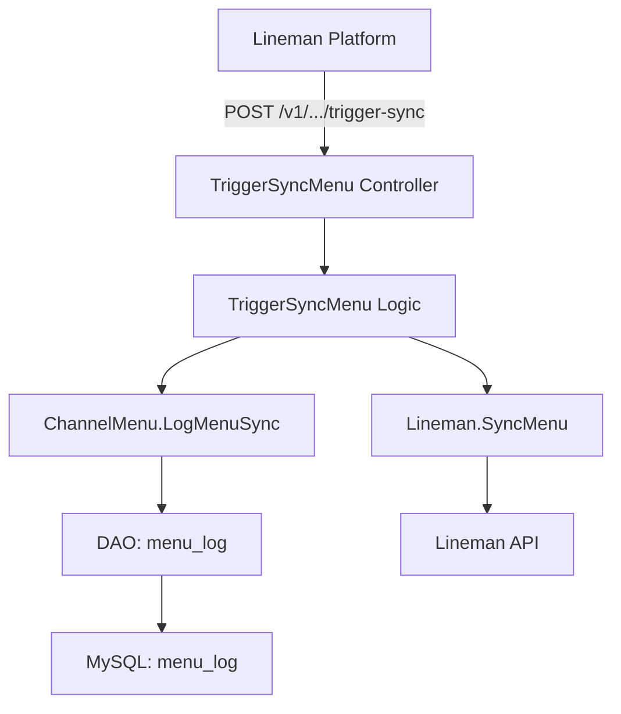

# Lineman 触发菜单同步（TriggerSyncMenu）设计文档

> 本文档定义 Lineman 触发菜单同步功能的技术设计和实现方案。

## 📋 概述

本功能新增 TriggerSyncMenu 接口，实现 Lineman 平台主动触发 TTPOS 菜单同步的能力。当 Lineman 平台调用该接口时，系统将：
1. 记录同步触发日志到 `menu_log`（`sync_type=NOTIFY`，`status=QUEUED`）
2. 调用 `service.Lineman().SyncMenu(ctx, shopUUID)` 触发实际的菜单同步流程

该功能属于 **ttpos-takeout** 微服务，采用 GoFrame 2.x 框架实现。

---

## 🎯 规范对齐

### Go BMP 规范 (go-bmp.mdc)

本设计严格遵循 Go BMP 开发规范：

- ✅ 使用 GoFrame 2.x 框架
- ✅ Controller → Logic → Service → DAO 分层架构
- ✅ **禁止修改** `dao/`, `model/entity/`, `model/do/` 目录（自动生成）
- ✅ 使用 `gerror` 处理错误（不用标准库 errors）
- ✅ 使用 `g.Log()` 记录日志
- ✅ 业务逻辑写在 `internal/logic/` 目录
- ✅ 数据库操作通过 `dao` 层

### API 设计规范 (api.mdc)

符合 Lineman API 定义规范：

- ✅ URL: `POST /v1/partners/{partnerId}/stores/{storeId}/menus/trigger-sync`
- ✅ 响应格式: `{ "status": "ok/fail", "code": "string", "message": "string" }`
- ✅ 标准 HTTP 状态码: 200/400/401/404/500
- ✅ 参考协议: [Lineman API 定义及 TTPOS 映射](https://docs.google.com/spreadsheets/d/1CKRl7tRLtp6dCAcXQqWhPvS_0M378-vdKpucR6ZtNbg/edit?gid=1404604549#gid=1404604549)

### 数据库规范 (database.mdc)

复用现有 `menu_log` 表，无需新建表：

- ✅ 表名: `ttpos_channel_menu_log`（已存在）
- ✅ 必需字段: `id`, `uuid`, `create_time`, `update_time`, `delete_time`
- ✅ 时间字段使用 int 类型
- ✅ 通过 DAO 层操作数据库

---

## 🔄 代码复用分析

### 可复用的现有组件

1. **MenuSyncNotification 实现模式**
   - 路径: `internal/controller/lineman/lineman_v1_menu_sync_notification.go`
   - 复用: Controller 结构、错误处理模式、响应格式

2. **Logic 层处理模式**
   - 路径: `internal/logic/lineman/menu_sync_notification.go`
   - 复用: 参数校验、service 调用模式

3. **Service.Lineman() 接口**
   - 路径: `internal/service/lineman.go`
   - 方法: `SyncMenu(ctx context.Context, shopUUID uint64) error`
   - 状态: ✅ 已实现，直接调用

4. **ChannelMenu Service**
   - 路径: `internal/service/channel_menu.go`
   - 方法: `LogMenuSync()` - 记录菜单同步日志
   - 状态: ✅ 已实现，直接调用

5. **常量定义**
   - 路径: `internal/consts/consts.go`
   - 常量: `ProviderLineman`, `MenuSyncTypeNotify`, `MenuSyncStatusQueued`
   - 状态: ✅ 已存在，直接使用

### 集成点

- **Lineman API 路由**: 已注册在 `api/lineman/v1/menu.go`
- **Controller 入口**: 已存在骨架，需补充实现
- **数据库表**: `ttpos_channel_menu_log` 已存在
- **Service 依赖**: `service.Lineman()` 和 `service.ChannelMenu()` 已注册

---

## 🏗️ 架构设计

### 分层设计原则

**Go BMP 四层架构**:

```
HTTP Controller 层
  ↓ 依赖
Logic 层（业务编排）
  ↓ 依赖
Service 层（核心业务）
  ↓ 依赖
DAO 层（数据访问，自动生成 ❌ 禁止修改）
```

**依赖规则**:

- ✅ Controller 只负责参数解析和响应
- ✅ Logic 负责业务编排和流程控制
- ✅ Service 实现核心业务逻辑
- ✅ DAO 自动生成，禁止手动修改

### 架构图



### 模块划分

#### Go BMP 模块（ttpos-takeout）

- **HTTP Controller**: `internal/controller/lineman/lineman_v1_trigger_sync_menu.go`
  - 职责: 接收 HTTP 请求，解析参数，调用 Logic，返回响应
  - 输入: `v1.TriggerSyncMenuReq`
  - 输出: `v1.TriggerSyncMenuRes`

- **Logic 层**: `internal/logic/lineman/trigger_sync_menu.go`（新建）
  - 职责: 业务编排，调用 `ChannelMenu.LogMenuSync()` 和 `Lineman.SyncMenu()`
  - 输入: `partnerId`, `storeId`
  - 处理流程:
    1. 解析 `storeId`（在 Lineman 场景中，storeId 就是 shopUUID）
    2. 调用 `ChannelMenu.LogMenuSync()` 写入 `menu_log`
    3. 调用 `Lineman.SyncMenu(shopUUID)` 触发同步

- **Service 层**: 
  - `service.ChannelMenu().LogMenuSync()` - 已实现，记录同步日志
  - `service.Lineman().SyncMenu()` - 已实现，执行菜单同步

- **DAO 层**: `internal/dao/channel_menu_log.go`（自动生成 ❌ 禁止修改）

---

## 🗄️ 数据库设计

### 复用现有表

#### 表: ttpos_channel_menu_log

**说明**: 该表已存在，用于记录所有渠道的菜单同步日志。

**关键字段**:

| 字段 | 类型 | 说明 | 本次使用值 |
|------|------|------|-----------|
| shop_uuid | varchar(50) | 店铺 UUID | 从 storeId 映射 |
| provider | varchar(50) | 渠道提供商 | `LINEMAN` |
| sync_type | varchar(50) | 同步类型 | `NOTIFY`（平台主动通知） |
| status | varchar(50) | 同步状态 | `QUEUED`（已加入队列） |
| request_id | varchar(100) | 请求 ID | 自动生成 UUID |
| create_time | int | 创建时间 | Unix 时间戳 |

**无需迁移**：表结构已满足需求，无需修改。

---

## 📊 数据模型

### DTO 定义

#### Request DTO (API 层)

```go
// api/lineman/v1/menu.go (已存在)
type TriggerSyncMenuReq struct {
	g.Meta    `path:"/v1/partners/:partnerId/stores/:storeId/menus/trigger-sync" method:"post" tags:"Lineman" summary:"触发菜单同步"`
	PartnerId string `json:"partnerId" v:"required" dc:"Partner ID"`
	StoreId   string `json:"storeId" v:"required" dc:"Store ID"`
}
```

#### Response DTO (API 层)

```go
// api/lineman/v1/menu.go (已存在)
type TriggerSyncMenuRes struct {
	LinemanCommonResData
}

type LinemanCommonResData struct {
	Status  string `json:"status" dc:"ok/fail"`
	Code    string `json:"code" dc:"响应码"`
	Message string `json:"message" dc:"响应消息"`
}
```

---

## 🔌 API 设计

### RESTful API

#### API: TriggerSyncMenu

**请求**:

- **URL**: `/v1/partners/{partnerId}/stores/{storeId}/menus/trigger-sync`
- **Method**: `POST`
- **Headers**:
  ```json
  {
    "Authorization": "Bearer {access_token}",
    "Content-Type": "application/json"
  }
  ```
- **Path Parameters**:
  - `partnerId`: Partner ID（Lineman 合作伙伴 ID）
  - `storeId`: Store ID（Lineman 门店 ID）

**成功响应 (HTTP 200)**:

```json
{
  "status": "ok",
  "code": "200",
  "message": "Trigger sync is successfully trigger."
}
```

**错误响应 (HTTP 400)**:

```json
{
  "status": "fail",
  "code": "400",
  "message": "The request is malformed or missing mandatory information."
}
```

**错误响应 (HTTP 404)**:

```json
{
  "status": "fail",
  "code": "404",
  "message": "Invalid partner ID and/or store ID."
}
```

**错误响应 (HTTP 500)**:

```json
{
  "status": "fail",
  "code": "500",
  "message": "The application has experienced an internal problem."
}
```

---

## 🧩 组件和接口

### Controller 层

```go
// internal/controller/lineman/lineman_v1_trigger_sync_menu.go
package lineman

import (
	"context"

	"github.com/gogf/gf/v2/errors/gcode"
	"github.com/gogf/gf/v2/errors/gerror"

	v1 "ttpos-bmp/app/ttpos-takeout/api/lineman/v1"
	"ttpos-bmp/app/ttpos-takeout/internal/service"
)

// TriggerSyncMenu 接收 LINE MAN 触发菜单同步请求
func (c *ControllerV1) TriggerSyncMenu(ctx context.Context, req *v1.TriggerSyncMenuReq) (res *v1.TriggerSyncMenuRes, err error) {
	// 使用类型断言检查 service 是否实现了该方法
	type triggerSyncMenuHandler interface {
		HandleTriggerSyncMenu(ctx context.Context, req *v1.TriggerSyncMenuReq) error
	}

	handler, ok := service.Lineman().(triggerSyncMenuHandler)
	if !ok {
		return &v1.TriggerSyncMenuRes{
			LinemanCommonResData: v1.LinemanCommonResData{
				Status:  "fail",
				Code:    "500",
				Message: "Lineman 服务未实现触发同步处理",
			},
		}, nil
	}

	err = handler.HandleTriggerSyncMenu(ctx, req)
	if err != nil {
		code := "500"
		if gerror.Code(err) == gcode.CodeInvalidParameter {
			code = "400"
		} else if gerror.Code(err) == gcode.CodeNotFound {
			code = "404"
		}
		return &v1.TriggerSyncMenuRes{
			LinemanCommonResData: v1.LinemanCommonResData{
				Status:  "fail",
				Code:    code,
				Message: err.Error(),
			},
		}, nil
	}

	return &v1.TriggerSyncMenuRes{
		LinemanCommonResData: v1.LinemanCommonResData{
			Status:  "ok",
			Code:    "200",
			Message: "Trigger sync is successfully trigger.",
		},
	}, nil
}
```

### Logic 层

```go
// internal/logic/lineman/trigger_sync_menu.go (新建)
package lineman

import (
	"context"
	"strconv"

	"github.com/gogf/gf/v2/errors/gcode"
	"github.com/gogf/gf/v2/errors/gerror"
	"github.com/gogf/gf/v2/frame/g"

	v1 "ttpos-bmp/app/ttpos-takeout/api/lineman/v1"
	"ttpos-bmp/app/ttpos-takeout/internal/consts"
	"ttpos-bmp/app/ttpos-takeout/internal/service"
)

// HandleTriggerSyncMenu 处理 LINE MAN 触发菜单同步请求
// 参数:
//   - ctx: 上下文
//   - req: 触发同步请求
//
// 返回:
//   - error: 错误信息
func (s *sLineman) HandleTriggerSyncMenu(ctx context.Context, req *v1.TriggerSyncMenuReq) error {
	if req == nil {
		return gerror.NewCode(gcode.CodeInvalidParameter, "请求参数不能为空")
	}

	// Step 1: 解析 storeId（在 Lineman 场景中，storeId 就是 shopUUID）
	shopUUID, err := strconv.ParseUint(req.StoreId, 10, 64)
	if err != nil {
		g.Log().Errorf(ctx, "解析 storeId 失败: %v", err)
		return gerror.NewCode(gcode.CodeNotFound, "Invalid store ID")
	}

	// Step 2: 记录到 menu_log（sync_type=NOTIFY, status=QUEUED）
	err = service.ChannelMenu().LogMenuSync(
		ctx,
		req.StoreId,
		string(consts.ProviderLineman),
		string(consts.MenuSyncTypeNotify),
		"",      // request_id 由 LogMenuSync 自动生成
		false,   // success = false，表示尚未完成
		"QUEUED", // sync_status
		"",      // error_msg
	)
	if err != nil {
		g.Log().Errorf(ctx, "记录菜单同步日志失败: %v", err)
		return gerror.NewCode(gcode.CodeInternalError, "Failed to log menu sync")
	}

	// Step 3: 调用 service.Lineman().SyncMenu() 触发同步
	err = service.Lineman().SyncMenu(ctx, shopUUID)
	if err != nil {
		g.Log().Errorf(ctx, "触发菜单同步失败: %v", err)
		// 同步失败不影响响应，因为已经记录了日志
		// 实际同步会异步执行，这里只是触发
	}

	return nil
}
```

### Service 层（已存在，无需修改）

```go
// internal/service/lineman.go (已存在)
type ILineman interface {
	// ... 其他方法
	
	// SyncMenu 同步菜单到 Lineman
	// 参数:
	//   - ctx: 上下文
	//   - shopUUID: 门店UUID
	//
	// 返回:
	//   - error: 错误信息
	SyncMenu(ctx context.Context, shopUUID uint64) error
}

// internal/service/channel_menu.go (已存在)
type IChannelMenu interface {
	// LogMenuSync 记录菜单同步日志
	LogMenuSync(
		ctx context.Context,
		storeId string,
		provider string,
		syncType string,
		requestId string,
		success bool,
		syncStatus string,
		errorMsg string,
	) error
}
```

---

## 🚨 错误处理

### 错误场景

#### 场景 1: 参数缺失或无效

- **处理方式**: 返回 HTTP 400，`code="400"`
- **用户影响**: 看到 "The request is malformed or missing mandatory information."
- **代码示例**:
  ```go
  if req == nil {
      return gerror.NewCode(gcode.CodeInvalidParameter, "请求参数不能为空")
  }
  ```

#### 场景 2: storeId 不存在

- **处理方式**: 返回 HTTP 404，`code="404"`
- **用户影响**: 看到 "Invalid partner ID and/or store ID."
- **代码示例**:
  ```go
  if shopUUID == 0 {
      return gerror.NewCode(gcode.CodeNotFound, "Invalid store ID")
  }
  ```

#### 场景 3: menu_log 写入失败

- **处理方式**: 返回 HTTP 500，`code="500"`
- **用户影响**: 看到 "The application has experienced an internal problem."
- **代码示例**:
  ```go
  if err != nil {
      g.Log().Errorf(ctx, "记录菜单同步日志失败: %v", err)
      return gerror.NewCode(gcode.CodeInternalError, "Failed to log menu sync")
  }
  ```

#### 场景 4: SyncMenu 调用失败

- **处理方式**: 记录错误日志，但不影响响应（异步同步）
- **用户影响**: 收到成功响应，但同步会在后台重试
- **代码示例**:
  ```go
  err = service.Lineman().SyncMenu(ctx, shopUUID)
  if err != nil {
      g.Log().Errorf(ctx, "触发菜单同步失败: %v", err)
      // 不返回错误，因为已经记录了日志
  }
  ```

---

## 🔒 安全设计

### 身份验证

- **Bearer Token**: 所有 Lineman API 需要 Token 验证（已实现在中间件）
- **Token 校验**: 由 GoFrame 中间件自动处理

### 权限控制

- **Partner 权限**: 仅允许访问自己的门店数据
- **Store 权限**: 校验 partnerId 和 storeId 的关联关系

### 数据安全

- **参数校验**: 使用 GoFrame 自动校验（`v:"required"`）
- **SQL 注入防护**: 使用 DAO 层参数化查询
- **日志脱敏**: 不记录敏感信息

---

## 🧪 测试策略

### 单元测试

**目标覆盖率**:

- Logic 层: 70%+

**测试内容**:

- 参数校验逻辑
- storeId 映射逻辑
- menu_log 写入逻辑
- SyncMenu 调用逻辑

**示例**:

```go
// internal/logic/lineman/trigger_sync_menu_test.go
func TestHandleTriggerSyncMenu(t *testing.T) {
	// 测试正常流程
	// 测试参数为空
	// 测试 storeId 无效
	// 测试 menu_log 写入失败
}
```

### 集成测试

**测试流程**:

1. 调用 TriggerSyncMenu 接口
2. 验证 menu_log 记录是否正确
3. 验证 SyncMenu 是否被调用

### API 测试

**测试内容**:

- HTTP 200 响应
- HTTP 400 响应（参数缺失）
- HTTP 404 响应（storeId 不存在）
- HTTP 500 响应（内部错误）

---

## 📈 性能优化

### 优化策略

1. **异步同步**: `SyncMenu()` 采用异步执行，不阻塞响应
2. **日志批量写入**: 使用 DAO 批量插入优化
3. **错误恢复**: 同步失败不影响响应，后台重试

### 性能指标

- 接口响应时间: < 300ms
- menu_log 写入: < 50ms
- 并发能力: 500+ QPS

---

## 📚 实现清单

### Phase 1: 核心实现

- [ ] 1.1 实现 Controller 层（补充现有骨架）
- [ ] 1.2 创建 Logic 层（新建 `trigger_sync_menu.go`）
- [ ] 1.3 实现 storeId -> shopUUID 映射逻辑
- [ ] 1.4 集成 ChannelMenu.LogMenuSync()
- [ ] 1.5 集成 Lineman.SyncMenu()

### Phase 2: 测试

- [ ] 2.1 Logic 层单元测试
- [ ] 2.2 集成测试
- [ ] 2.3 API 测试（Postman）

### Phase 3: 文档

- [ ] 3.1 更新 API 文档
- [ ] 3.2 更新 CHANGELOG.md

**详细任务**: 参见 `tasks.md`

---

## Graphiti & 活动日志

- Related Episode: `[待补充]`
- 模板：`docs/agent/templates/graphiti-episode.md`
- 活动日志：`docs/team/activities/rikugun/2026-01/2026-01-15.md`
- 在技术方案评审、关键架构决策或踩坑总结后，立即补充 Episode 并在设计文档尾部互链。

---

**版本**: v1.0.0  
**创建日期**: 2026-01-15  
**作者**: rikugun  
**审核者**: 待审核
