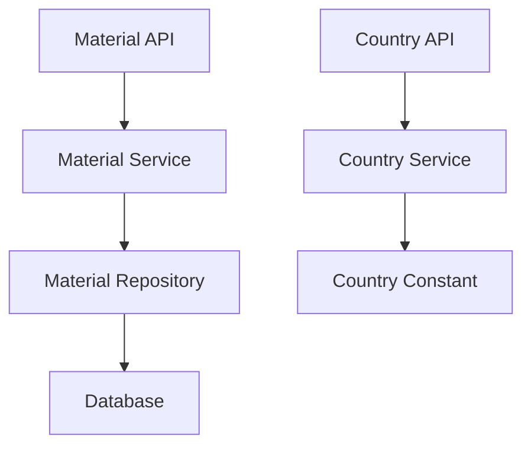

# 物品管理-原产地功能 设计文档

> 本文档定义物品管理中原产地字段的技术设计和实现方案。

## 📋 概述

在物品详情中增加"原产地"字段，支持从国家字典库的197个国家/地区中选择。该功能用于记录物品的原产地信息，便于商家管理和追溯。

**版本**: v2.11.0  
**创建日期**: 2025-12-05  
**来源**: DooTask #37483

---

## 🎯 规范对齐

### Go Main 规范 (go-main.mdc)

- Service 只依赖其他 Service 接口
- Repository 只持有 db 实例
- URL 使用 snake_case
- data 字段必须是对象
- 不使用 panic，返回 error

### API 设计规范 (api.mdc)

- URL 使用 snake_case
- 响应格式统一
- data 不能为 null 或数组

### 数据库规范 (database.mdc)

- 必需字段完整
- 时间字段使用 int
- 金额字段使用 decimal
- 字符串字段使用 varchar，合理设置长度

---

## 🔄 代码复用分析

### 可复用的现有组件

- **Material Model**: `main/app/model/material.go` - 物品数据模型，需要增加 `OriginCountryCode` 字段
- **Material Service**: `main/app/service/material.go` - 物品业务逻辑，需要修改详情、创建、编辑方法
- **Material API**: `main/app/api/v1/shop/shop_material.go` - 物品 API 接口，需要修改相关接口
- **Nationality Service**: `main/app/service/nationality_service.go` - 国籍服务，可参考其列表接口实现方式
- **MultiLanguageName**: `main/app/model/multi_language_name.go` - 多语言名称模型，国家名称使用多语言结构
- **LocaleResponse**: `main/app/dto/common_resp.go` - 多语言响应结构，用于返回国家多语言名称

### 集成点

- **Material 表**: 增加 `origin_country_code` 字段
- **Material 接口**: 物品详情、创建、编辑接口增加原产地字段
- **Country 常量**: 新增国家枚举常量文件
- **Country API**: 新增国家列表接口

---

## 🏗️ 架构设计

### 分层设计原则

**Go Main 三层架构**:

```
API 层 (Controller/API)
  ↓ 依赖
业务层 (Service)
  ↓ 依赖
数据层 (Repository)
```

**依赖规则**:

- ✅ 上层可依赖下层
- ❌ 禁止下层依赖上层
- ❌ 禁止跨层调用
- ❌ Service 不能依赖 Repository
- ✅ Service 可以依赖其他 Service 接口

### 架构图



### 模块划分

#### Go Main 模块

- **API 层**: `main/app/api/v1/shop/` - 路由处理、参数校验
- **Service 层**: `main/app/service/` - 业务逻辑、事务管理
- **Repository 层**: `main/app/repository/` - 数据访问、数据库操作
- **Model 层**: `main/app/model/` - 数据模型
- **DTO 层**: `main/app/dto/` - 数据传输对象
  - `req/` - 请求参数
  - `resp/` - 响应数据
- **Constant 层**: `main/app/constant/` - 常量定义

---

## 🗄️ 数据库设计

### 数据表设计

#### 表: ttpos_material（修改）

**新增字段**:

| 字段 | 类型 | 说明 | 约束 |
|------|------|------|------|
| origin_country_code | varchar(10) | 原产地国家编码（ISO 3166-1 alpha-2） | DEFAULT '' |

**字段说明**:

- `origin_country_code`: 存储国家编码（如：CN, US, TH），使用 ISO 3166-1 alpha-2 标准
- 可为空，默认值为空字符串
- 不添加索引（查询频率低）

**迁移文件**: `admin/database/migrations/{YYYYMMDDHHMMSS}_add_origin_country_code_to_material_table.php`

**SQL 示例**:

```sql
ALTER TABLE `ttpos_material` 
ADD COLUMN `origin_country_code` varchar(10) NOT NULL DEFAULT '' COMMENT '原产地国家编码（ISO 3166-1 alpha-2，如：CN, US, TH）' 
AFTER `allow_substore_visible`;
```

**同步 Go Model**:

在 `main/app/model/material.go` 中增加字段：

```go
OriginCountryCode string `gorm:"type:varchar(10);default:'';column:origin_country_code;comment:'原产地国家编码（ISO 3166-1 alpha-2）'"`
```

**更新 Seeds 文件**: `admin/database/seeds/shop_01.sql`

---

## 📊 数据模型

### Go Model

```go
// main/app/model/material.go
type Material struct {
    BaseModel
    // ... 现有字段 ...
    AllowSubstoreVisible  int      `gorm:"column:allow_substore_visible;comment:'允许子店可见：1-允许，0-不允许'"`
    OriginCountryCode     string   `gorm:"type:varchar(10);default:'';column:origin_country_code;comment:'原产地国家编码（ISO 3166-1 alpha-2）'"`
    // ... 其他字段 ...
}
```

### DTO 定义

#### Request DTO

```go
// main/app/dto/req/material.go

// MaterialAddReq 添加物品请求（修改）
type MaterialAddReq struct {
    // ... 现有字段 ...
    AllowSubstoreVisible int    `json:"allow_substore_visible"` // 允许子店可见：1-允许，0-不允许（仅总店可用）
    OriginCountryCode    string `json:"origin_country_code"`    // 原产地国家编码（可选）
}

// MaterialEditReq 编辑物品请求（修改）
type MaterialEditReq struct {
    // ... 现有字段 ...
    AllowSubstoreVisible int    `json:"allow_substore_visible"` // 允许子店可见：1-允许，0-不允许（仅总店可用）
    OriginCountryCode    string `json:"origin_country_code"`    // 原产地国家编码（可选）
}
```

#### Response DTO

```go
// main/app/dto/resp/material_resp/material.go

// MaterialDetailResp 物品详情响应（修改）
type MaterialDetailResp struct {
    // ... 现有字段 ...
    AllowSubstoreVisible int                  `json:"allow_substore_visible"` // 允许子店可见：1-允许，0-不允许（仅总店可用）
    OriginCountryCode    string               `json:"origin_country_code"`     // 原产地国家编码
    OriginCountry        *CountryItem         `json:"origin_country"`           // 原产地国家信息（可选）
    // ... 其他字段 ...
}

// CountryItem 国家信息
type CountryItem struct {
    Code       string             `json:"code"`        // 国家编码（ISO 3166-1 alpha-2）
    LocaleName dto.LocaleResponse `json:"locale_name"` // 多语言国家名称
}

// CountryListResp 国家列表响应
type CountryListResp struct {
    List []CountryItem `json:"list"` // 国家列表
}
```

---

## 🔌 API 设计

### RESTful API

#### API 1: 获取物品详情（修改）

**请求**:

- **URL**: `/api/v1/shop/material/detail`
- **Method**: `GET`
- **Headers**:
  ```json
  {
    "Authorization": "Bearer {token}",
    "Content-Type": "application/json"
  }
  ```
- **Query Parameters**:
  ```json
  {
    "uuid": 123456
  }
  ```

**响应**:

```json
{
  "code": 1,
  "message": "success",
  "data": {
    "uuid": 123456,
    "locale_name": {...},
    "origin_country_code": "CN",
    "origin_country": {
      "code": "CN",
      "locale_name": {
        "zh": "中国",
        "zhtw": "中國",
        "en": "China",
        "ja": "中国",
        "ko": "중국",
        "my": "တရုတ်",
        "th": "จีน",
        "tr": "Çin",
        "de": "China",
        "sv": "Kina"
      }
    },
    "...": "..."
  }
}
```

#### API 2: 创建物品（修改）

**请求**:

- **URL**: `/api/v1/shop/material/add`
- **Method**: `POST`
- **Body**:
  ```json
  {
    "locale_name": {...},
    "category_uuid": 123,
    "origin_country_code": "CN",
    "...": "..."
  }
  ```

**响应**:

```json
{
  "code": 1,
  "message": "success",
  "data": {}
}
```

#### API 3: 编辑物品（修改）

**请求**:

- **URL**: `/api/v1/shop/material/edit`
- **Method**: `POST`
- **Body**:
  ```json
  {
    "uuid": 123456,
    "locale_name": {...},
    "origin_country_code": "US",
    "...": "..."
  }
  ```

**响应**:

```json
{
  "code": 1,
  "message": "success",
  "data": {}
}
```

#### API 4: 获取国家列表（新增）

**请求**:

- **URL**: `/api/v1/shop/country/list`
- **Method**: `GET`
- **Headers**:
  ```json
  {
    "Authorization": "Bearer {token}",
    "Content-Type": "application/json"
  }
  ```

**响应**:

```json
{
  "code": 1,
  "message": "success",
  "data": {
    "list": [
      {
        "code": "CN",
        "locale_name": {
          "zh": "中国",
          "zhtw": "中國",
          "en": "China",
          "ja": "中国",
          "ko": "중국",
          "my": "တရုတ်",
          "th": "จีน",
          "tr": "Çin",
          "de": "China",
          "sv": "Kina"
        }
      },
      {
        "code": "US",
        "locale_name": {
          "zh": "美国",
          "zhtw": "美國",
          "en": "United States",
          "ja": "アメリカ合衆国",
          "ko": "미국",
          "my": "အမေရိကန်",
          "th": "สหรัฐอเมริกา",
          "tr": "Amerika Birleşik Devletleri",
          "de": "Vereinigte Staaten",
          "sv": "USA"
        }
      }
    ]
  }
}
```

**错误响应**:

```json
{
  "code": 0,
  "message": "错误信息",
  "data": {}
}
```

---

## 🧩 组件和接口

### Service 层

#### Service 接口（修改）

```go
// main/app/service/i_material_srv.go（修改）
type IMaterialSrv interface {
    // ... 现有方法 ...
    GetMaterialDetail(ctx context.Context, req req.MaterialDetailReq) (material_resp.MaterialDetailResp, error)
    AddMaterial(ctx context.Context, req req.MaterialAddReq) error
    EditMaterial(ctx context.Context, req req.MaterialEditReq) error
}
```

#### Service 实现（修改）

```go
// main/app/service/material.go（修改）

// GetMaterialDetail 获取物品详情
func (s *materialSrv) GetMaterialDetail(ctx context.Context, req req.MaterialDetailReq) (material_resp.MaterialDetailResp, error) {
    // ... 现有逻辑 ...
    
    // 获取原产地国家信息
    var originCountry *material_resp.CountryItem
    if material.OriginCountryCode != "" {
        country := constant.GetCountryByCode(material.OriginCountryCode)
        if country != nil {
            originCountry = &material_resp.CountryItem{
                Code:       country.Code,
                LocaleName: country.GetLocaleNames(),
            }
        }
    }
    
    return material_resp.MaterialDetailResp{
        // ... 现有字段 ...
        OriginCountryCode: material.OriginCountryCode,
        OriginCountry:     originCountry,
        // ... 其他字段 ...
    }, nil
}

// AddMaterial 创建物品
func (s *materialSrv) AddMaterial(ctx context.Context, req req.MaterialAddReq) error {
    // ... 现有逻辑 ...
    
    material := &model.Material{
        // ... 现有字段 ...
        OriginCountryCode: req.OriginCountryCode,
        // ... 其他字段 ...
    }
    
    // ... 保存逻辑 ...
}

// EditMaterial 编辑物品
func (s *materialSrv) EditMaterial(ctx context.Context, req req.MaterialEditReq) error {
    // ... 现有逻辑 ...
    
    material.OriginCountryCode = req.OriginCountryCode
    
    // ... 更新逻辑 ...
}
```

#### Country Service（新增）

```go
// main/app/service/i_country_srv.go（新增）
type ICountrySrv interface {
    GetList(ctx context.Context) (material_resp.CountryListResp, error)
}

// main/app/service/country_srv.go（新增）
type countrySrv struct {
    // 无需依赖数据库，直接从常量读取
}

func NewCountrySrv() ICountrySrv {
    return &countrySrv{}
}

func (s *countrySrv) GetList(ctx context.Context) (material_resp.CountryListResp, error) {
    countries := constant.GetAllCountries()
    list := make([]material_resp.CountryItem, 0, len(countries))
    
    for _, country := range countries {
        list = append(list, material_resp.CountryItem{
            Code:       country.Code,
            LocaleName: country.GetLocaleNames(),
        })
    }
    
    return material_resp.CountryListResp{
        List: list,
    }, nil
}
```

### Repository 层

无需修改 Repository，Material Repository 已支持通过 GORM 自动处理新字段。

### API 层

#### Material API（修改）

```go
// main/app/api/v1/shop/shop_material.go（修改）

// GetMaterialDetail 获取物品详情（无需修改，Service 层已处理）
func (h *MaterialHandler) GetMaterialDetail(c *gin.Context) {
    // ... 现有逻辑不变 ...
}

// AddMaterial 添加物品（无需修改，Service 层已处理）
func (h *MaterialHandler) AddMaterial(c *gin.Context) {
    // ... 现有逻辑不变 ...
}

// EditMaterial 编辑物品（无需修改，Service 层已处理）
func (h *MaterialHandler) EditMaterial(c *gin.Context) {
    // ... 现有逻辑不变 ...
}
```

#### Country API（新增）

```go
// main/app/api/v1/shop/shop_country.go（新增）
package shop

import (
    "ttpos-server-go/app/api/helper"
    "ttpos-server-go/app/constant"
    "ttpos-server-go/app/dto/resp/material_resp"
    "ttpos-server-go/app/service"
    "ttpos-server-go/pkg/context"
    
    "github.com/gin-gonic/gin"
)

// CountryHandler 国家处理器
type CountryHandler struct {
    countrySrv service.ICountrySrv
}

// GetList 获取国家列表
// @Summary 获取国家列表
// @Description 获取所有国家列表（197个国家/地区）
// @Tags 商家端.物品管理
// @Accept json
// @Produce json
// @Security JwtToken
// @Success 200 {object} material_resp.CountryListResp "成功"
// @Failure 400 {object} nil "错误请求"
// @Router /shop/country/list [get]
func (h *CountryHandler) GetList(c *gin.Context) {
    ctx := helper.GetContext(c)
    
    list, err := h.countrySrv.GetList(ctx)
    if err != nil {
        helper.ErrorWithDetail(c, constant.CodeFail, err)
        return
    }
    
    helper.Success(c, list)
}
```

### Constant 层

#### Country Constant（新增）

```go
// main/app/constant/country.go（新增）
package constant

import (
    "ttpos-server-go/app/dto"
)

// Country 国家信息
type Country struct {
    Code        string                    // 国家编码（ISO 3166-1 alpha-2）
    LocaleNames map[string]string         // 多语言国家名称
}

// GetLocaleNames 获取多语言名称
func (c *Country) GetLocaleNames() dto.LocaleResponse {
    return dto.LocaleResponse{
        Zh:   c.LocaleNames["zh"],
        Zhtw: c.LocaleNames["zhtw"],
        En:   c.LocaleNames["en"],
        Ja:   c.LocaleNames["ja"],
        Ko:   c.LocaleNames["ko"],
        My:   c.LocaleNames["my"],
        Th:   c.LocaleNames["th"],
        Tr:   c.LocaleNames["tr"],
        De:   c.LocaleNames["de"],
        Sv:   c.LocaleNames["sv"],
    }
}

// 国家列表（197个国家/地区）
var countries = []Country{
    {
        Code: "CN",
        LocaleNames: map[string]string{
            "zh":   "中国",
            "zhtw": "中國",
            "en":   "China",
            "ja":   "中国",
            "ko":   "중국",
            "my":   "တရုတ်",
            "th":   "จีน",
            "tr":   "Çin",
            "de":   "China",
            "sv":   "Kina",
        },
    },
    {
        Code: "US",
        LocaleNames: map[string]string{
            "zh":   "美国",
            "zhtw": "美國",
            "en":   "United States",
            "ja":   "アメリカ合衆国",
            "ko":   "미국",
            "my":   "အမေရိကန်",
            "th":   "สหรัฐอเมริกา",
            "tr":   "Amerika Birleşik Devletleri",
            "de":   "Vereinigte Staaten",
            "sv":   "USA",
        },
    },
    // ... 其他195个国家 ...
}

// GetAllCountries 获取所有国家列表
func GetAllCountries() []Country {
    return countries
}

// GetCountryByCode 根据编码获取国家信息
func GetCountryByCode(code string) *Country {
    for i := range countries {
        if countries[i].Code == code {
            return &countries[i]
        }
    }
    return nil
}
```

---

## ⚡ 缓存设计

### Redis 缓存

**国家列表缓存**:

- **Key 命名**: `ttpos:country:list`
- **过期时间**: 24小时（国家数据基本不变）
- **更新策略**: Cache-Aside Pattern

**示例**:

```go
// 缓存读取
key := "ttpos:country:list"
cached, err := redis.Get(key)
if err == nil {
    // 缓存命中
    return cached
}

// 缓存未命中，从常量读取
data := constant.GetAllCountries()

// 写入缓存
redis.Set(key, data, 24*time.Hour)
return data
```

---

## 🚨 错误处理

### 错误场景

#### 场景 1: 国家编码不存在

- **处理方式**: 如果传入的国家编码不存在，忽略该字段（不报错）
- **用户影响**: 原产地字段为空
- **代码示例**:
  ```go
  if req.OriginCountryCode != "" {
      country := constant.GetCountryByCode(req.OriginCountryCode)
      if country == nil {
          // 忽略无效编码，不报错
          req.OriginCountryCode = ""
      }
  }
  ```

#### 场景 2: 国家列表接口异常

- **处理方式**: 返回错误信息
- **用户影响**: 前端显示错误提示
- **代码示例**:
  ```go
  if err != nil {
      logger.Logger.Error("获取国家列表失败", zap.Error(err))
      return material_resp.CountryListResp{}, errors.WithMessage(err, "获取国家列表失败")
  }
  ```

---

## 🔒 安全设计

### 身份验证

- **JWT Token**: 所有 API 需要 Token 验证
- **权限控制**: 物品管理相关接口需要相应权限

### 数据安全

- **参数验证**: 国家编码长度限制（最大10字符）
- **SQL 注入防护**: 使用参数化查询（GORM）

---

## 🧪 测试策略

### 单元测试

**目标覆盖率**:

- main/app/service: 70%+
- main/app/repository: 80%+

**测试内容**:

- Service 业务逻辑（获取详情、创建、编辑）
- Country Service 列表获取
- 国家编码验证

**示例**:

```go
// main/app/service/material_srv_test.go
func TestMaterialService_GetMaterialDetail_WithOriginCountry(t *testing.T) {
    // 测试实现
}

// main/app/service/country_srv_test.go
func TestCountryService_GetList(t *testing.T) {
    // 测试实现
}
```

### API 测试

**测试内容**:

- API 接口调用
- 参数验证
- 响应格式
- 错误处理

---

## 📈 性能优化

### 优化策略

1. **缓存优化**:
   - 国家列表使用 Redis 缓存（24小时）
   - 减少常量查询次数

2. **数据库优化**:
   - 原产地字段不添加索引（查询频率低）
   - 字段长度合理（varchar(10)）

### 性能指标

- 本地响应时间: < 200ms
- 国家列表接口: < 50ms（缓存命中）
- 并发能力: 1000+ QPS

---

## 📚 实现清单

### Phase 1: 数据库和模型

- [ ] 创建数据库迁移文件
- [ ] 执行数据库迁移
- [ ] 创建 Go Model（修改 Material）
- [ ] 更新 Seeds 文件

### Phase 2: 常量定义

- [ ] 创建国家枚举常量文件
- [ ] 填充197个国家数据
- [ ] 实现国家查询方法

### Phase 3: 核心实现

- [ ] 修改 Material Service（详情、创建、编辑）
- [ ] 创建 Country Service
- [ ] 修改 Material DTO（Request/Response）
- [ ] 创建 Country DTO（Response）

### Phase 4: API 实现

- [ ] 修改 Material API（无需修改，Service 层已处理）
- [ ] 创建 Country API
- [ ] 注册 Country API 路由

### Phase 5: 测试

- [ ] 单元测试
- [ ] API 测试
- [ ] 集成测试

**详细任务**: 参见 `tasks.md`

---

## Graphiti & 活动日志

- Related Episode: `[待补充]`
- 模板：`docs/agent/templates/graphiti-episode.md`
- 活动日志：`docs/team/activities/{YYYY-MM}/{YYYY-MM-DD}.md`
- 在技术方案评审、关键架构决策或踩坑总结后，立即补充 Episode 并在设计文档尾部互链。

---

**版本**: v1.0.0  
**创建日期**: 2025-12-05  
**作者**: 开发组  
**审核者**: 技术组

