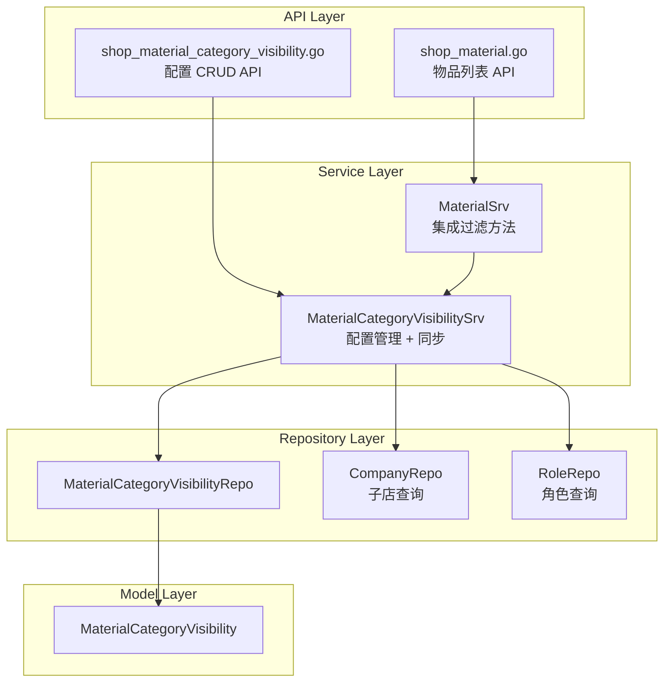
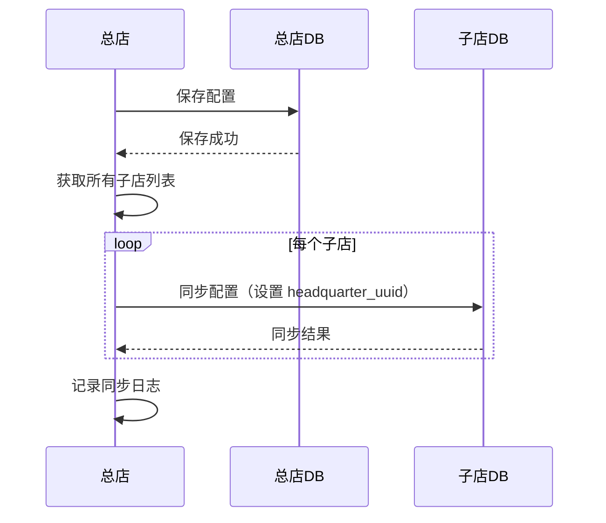

# story-shop-material-visibility-config 技术设计

## 📋 概述

| 项目 | 内容 |
|------|------|
| Spec ID | story-shop-material-visibility-config |
| 设计人 | xiezhihuan |
| 设计日期 | 2026-02-03 |
| 总 SP | 8 |

---

## 🔄 代码复用分析

### 可复用代码

| 文件 | 说明 | 复用方式 |
|------|------|---------|
| `main/app/repository/company.go` | 子店列表查询 | 直接调用 GetSubShopList |
| `main/app/repository/role.go` | 角色列表查询 | 直接调用 GetRoleList |
| `main/app/service/material.go` | 同步机制模式 | 参考 SyncMaterialCategory 实现 |
| `main/app/model/staff.go` | Staff-Role 关联 | 参考多对多关系设计 |

### 需要新建

| 文件 | 说明 |
|------|------|
| `main/app/model/material_category_visibility.go` | 可见性配置数据模型 |
| `main/app/repository/material_category_visibility.go` | 可见性配置仓库层 |
| `main/app/service/material_category_visibility.go` | 可见性配置服务层（CRUD + 同步） |
| `main/app/dto/req/material_category_visibility.go` | 请求 DTO |
| `main/app/dto/resp/material_category_visibility.go` | 响应 DTO |
| `main/app/api/v1/shop/shop_material_category_visibility.go` | API 控制器 |
| `admin/database/migrations/xxx_create_material_category_visibility.php` | 数据库迁移 |

### 需要修改

| 文件 | 说明 |
|------|------|
| `main/app/service/material.go` | 集成可见性过滤方法到 GetMaterialList |
| `main/app/api/v1/shop/router.go` | 添加新路由 |

---

## 🏗️ 架构设计

### 架构图



### 分层说明

| 层级 | 位置 | 职责 |
|------|------|------|
| API Layer | `main/app/api/v1/shop/` | HTTP Handler，参数校验 |
| Service Layer | `main/app/service/` | 业务逻辑，可见性判断 |
| Repository Layer | `main/app/repository/` | 数据访问，跨库查询 |
| Model Layer | `main/app/model/` | 数据模型定义 |
| DTO Layer | `main/app/dto/` | 请求/响应对象 |

---

## 📊 数据模型

### Model: MaterialCategoryVisibility

**位置**: `main/app/model/material_category_visibility.go`

**表名**: `ttpos_material_category_visibility`

```go
// MaterialCategoryVisibility 物品分类可见性配置表
type MaterialCategoryVisibility struct {
    BaseModel
    Name            string `gorm:"type:varchar(100);not null;comment:'配置名称'"`
    IsAllRoles      int    `gorm:"default:0;comment:'是否全部门店角色：1-全部，0-部分'"`
    CategoryUuids   string `gorm:"type:text;comment:'物品类别UUID列表，JSON数组格式'"`
    RoleConfigs     string `gorm:"type:text;comment:'角色配置，JSON数组格式 [{role_uuid, company_uuid}]'"`
    HeadquarterUuid uint64 `gorm:"default:0;comment:'总部UUID，0=当前店创建，>0=来自总部'"`
}

// CategoryUuids JSON 结构: [123456789, 234567890, ...]
// RoleConfigs JSON 结构: [{"role_uuid": 123, "company_uuid": 456}, ...]
```

### JSON 字段结构

```go
// RoleConfig 角色配置项
type RoleConfig struct {
    RoleUuid    uint64 `json:"role_uuid"`
    CompanyUuid uint64 `json:"company_uuid"`
}

// 辅助方法
func (m *MaterialCategoryVisibility) GetCategoryUuids() []uint64
func (m *MaterialCategoryVisibility) SetCategoryUuids(uuids []uint64)
func (m *MaterialCategoryVisibility) GetRoleConfigs() []RoleConfig
func (m *MaterialCategoryVisibility) SetRoleConfigs(configs []RoleConfig)
```

### 数据库迁移

**文件**: `admin/database/migrations/{timestamp}_create_material_category_visibility.php`

```sql
CREATE TABLE `ttpos_material_category_visibility` (
    `id` bigint(20) unsigned NOT NULL AUTO_INCREMENT,
    `uuid` bigint(20) unsigned NOT NULL DEFAULT 0,
    `name` varchar(100) NOT NULL COMMENT '配置名称',
    `is_all_roles` tinyint(1) NOT NULL DEFAULT 0 COMMENT '是否全部门店角色：1-全部，0-部分',
    `category_uuids` text COMMENT '物品类别UUID列表，JSON数组',
    `role_configs` text COMMENT '角色配置，JSON数组',
    `headquarter_uuid` bigint(20) unsigned NOT NULL DEFAULT 0 COMMENT '总部UUID',
    `create_time` int(10) unsigned NOT NULL DEFAULT 0,
    `update_time` int(10) unsigned NOT NULL DEFAULT 0,
    `delete_time` int(10) unsigned NOT NULL DEFAULT 0,
    PRIMARY KEY (`id`),
    UNIQUE KEY `idx_uuid` (`uuid`),
    KEY `idx_headquarter_uuid` (`headquarter_uuid`)
) ENGINE=InnoDB DEFAULT CHARSET=utf8mb4 COMMENT='物品分类可见性配置表';
```

**TARGET**: `const TARGET = 'all';` （应用到所有商户数据库和 saas 主库）

---

## 🧩 组件和接口

### Service: MaterialCategoryVisibilitySrv

**位置**: `main/app/service/material_category_visibility.go`

```go
type IMaterialCategoryVisibilitySrv interface {
    // 配置管理
    GetList(ctx context.Context, req req.VisibilityListReq) (*resp.VisibilityListResp, error)
    GetDetail(ctx context.Context, uuid uint64) (*resp.VisibilityDetailResp, error)
    Create(ctx context.Context, req req.VisibilityCreateReq) error
    Update(ctx context.Context, req req.VisibilityUpdateReq) error
    Delete(ctx context.Context, uuid uint64) error

    // 子店角色查询（跨库）
    GetSubShopRoles(ctx context.Context) (*resp.SubShopRolesResp, error)

    // 同步机制
    SyncToSubShops(ctx context.Context, visibility *model.MaterialCategoryVisibility) error
    SyncDeleteToSubShops(ctx context.Context, uuid uint64) error

    // 可见性过滤（核心方法）
    GetVisibleCategoryUuids(ctx context.Context, staffRoleUuids []uint64, companyUuid uint64) ([]uint64, bool)
}
```

### 核心方法: GetVisibleCategoryUuids

```go
// GetVisibleCategoryUuids 获取用户可见的物品类别UUID列表
// 返回值: categoryUuids, needFilter
//   - needFilter=false: 用户可见所有类别，无需过滤
//   - needFilter=true:  用户仅可见返回的类别列表（白名单模式）
func (s *MaterialCategoryVisibilitySrv) GetVisibleCategoryUuids(
    ctx context.Context,
    staffRoleUuids []uint64,
    companyUuid uint64,
) ([]uint64, bool) {
    // 1. 查询所有可见性配置
    // 2. 检查用户角色是否在任何配置中
    // 3. 如果都不在 → return nil, false（全部可见）
    // 4. 如果有配置 → 收集可见类别并集 → return uuids, true
}
```

### Repository: MaterialCategoryVisibilityRepo

**位置**: `main/app/repository/material_category_visibility.go`

```go
type IMaterialCategoryVisibilityRepo interface {
    GetList(opts ...DBOption) ([]model.MaterialCategoryVisibility, error)
    GetByUuid(uuid uint64) (*model.MaterialCategoryVisibility, error)
    Create(visibility *model.MaterialCategoryVisibility) error
    Update(visibility *model.MaterialCategoryVisibility) error
    Delete(uuid uint64) error

    // 查询包含指定角色的配置
    GetByRoleAndCompany(roleUuid, companyUuid uint64) ([]model.MaterialCategoryVisibility, error)

    // 查询所有配置的角色列表（用于判断角色是否被任何配置包含）
    GetAllConfiguredRoles() ([]model.RoleConfig, error)
}
```

---

## 🔌 API 设计

### 1. 获取可见性配置列表

| 项目 | 内容 |
|------|------|
| Method | GET |
| Path | `/api/v1/shop/material_category_visibility/list` |
| 权限 | 仅总店 |
| 请求 | `req.VisibilityListReq` |
| 响应 | `resp.VisibilityListResp` |

### 2. 获取可见性配置详情

| 项目 | 内容 |
|------|------|
| Method | GET |
| Path | `/api/v1/shop/material_category_visibility/detail` |
| 权限 | 仅总店 |
| 请求 | `uuid` (query param) |
| 响应 | `resp.VisibilityDetailResp` |

### 3. 新增可见性配置

| 项目 | 内容 |
|------|------|
| Method | POST |
| Path | `/api/v1/shop/material_category_visibility/add` |
| 权限 | 仅总店 |
| 请求 | `req.VisibilityCreateReq` |
| 响应 | 标准成功响应 |

### 4. 编辑可见性配置

| 项目 | 内容 |
|------|------|
| Method | POST |
| Path | `/api/v1/shop/material_category_visibility/edit` |
| 权限 | 仅总店 |
| 请求 | `req.VisibilityUpdateReq` |
| 响应 | 标准成功响应 |

### 5. 删除可见性配置

| 项目 | 内容 |
|------|------|
| Method | POST |
| Path | `/api/v1/shop/material_category_visibility/delete` |
| 权限 | 仅总店 |
| 请求 | `uuid` (JSON body) |
| 响应 | 标准成功响应 |

### 6. 获取子店角色列表

| 项目 | 内容 |
|------|------|
| Method | GET |
| Path | `/api/v1/shop/material_category_visibility/sub_shop_roles` |
| 权限 | 仅总店 |
| 请求 | 无 |
| 响应 | `resp.SubShopRolesResp` |

### DTO 定义

```go
// req.VisibilityCreateReq
type VisibilityCreateReq struct {
    Name          string       `json:"name" binding:"required,max=100"`
    IsAllRoles    int          `json:"is_all_roles" binding:"oneof=0 1"`
    CategoryUuids []uint64     `json:"category_uuids"`
    RoleConfigs   []RoleConfig `json:"role_configs"`
}

// resp.VisibilityListResp
type VisibilityListResp struct {
    List []VisibilityListItem `json:"list"`
}

type VisibilityListItem struct {
    Uuid          uint64 `json:"uuid"`
    Name          string `json:"name"`
    RoleCount     int    `json:"role_count"`
    CategoryCount int    `json:"category_count"`
}

// resp.SubShopRolesResp
type SubShopRolesResp struct {
    Shops []ShopRoles `json:"shops"`
}

type ShopRoles struct {
    CompanyUuid uint64 `json:"company_uuid"`
    CompanyCode string `json:"company_code"`
    CompanyName string `json:"company_name"`
    Roles       []Role `json:"roles"`
}
```

---

## 🔄 同步机制设计

### 同步流程



### 同步策略

1. **创建/更新**：总店保存后，遍历所有子店数据库写入（覆盖更新）
2. **删除**：总店删除后，遍历所有子店数据库执行软删除
3. **失败处理**：记录失败日志，支持手动重试
4. **异步执行**：使用 `utils.Go` 异步执行同步，不阻塞主流程

---

## ⚠️ 风险识别

| 风险 | 影响 | 缓解措施 |
|------|------|---------|
| 跨库查询性能 | 中 | 子店角色列表使用并发查询 + 超时控制 |
| 同步部分失败 | 中 | 记录失败日志 + 异步重试机制 |
| JSON 字段查询效率 | 低 | 可见性判断在应用层处理，减少复杂 SQL |
| 配置数据量大 | 低 | 单表设计简化查询，配置数量通常较少 |

---

## 🧪 测试策略

### 测试范围

| 层级 | 文件 | 覆盖率目标 |
|------|------|-----------|
| Service | `material_category_visibility_test.go` | 80%+ |
| Repository | `material_category_visibility_repo_test.go` | 70%+ |

### 核心测试用例

1. **可见性判断逻辑**
   - 用户所有角色未配置 → 全部可见
   - 用户单角色已配置 → 仅可见配置类别
   - 用户多角色已配置 → 可见类别并集
   - 用户部分角色配置 + 部分未配置 → 仅可见已配置角色的类别

2. **同步机制**
   - 创建配置 → 同步到所有子店
   - 更新配置 → 覆盖子店配置
   - 删除配置 → 同步删除到子店

3. **边界场景**
   - 空配置列表
   - 配置中类别已删除
   - 子店不存在对应角色

### 测试命令

```bash
cd main && go test -coverprofile=coverage.out ./app/service/material_category_visibility_test.go
cd main && go tool cover -html=coverage.out
```

---

**版本**: v1.0.0
**设计日期**: 2026-02-03
