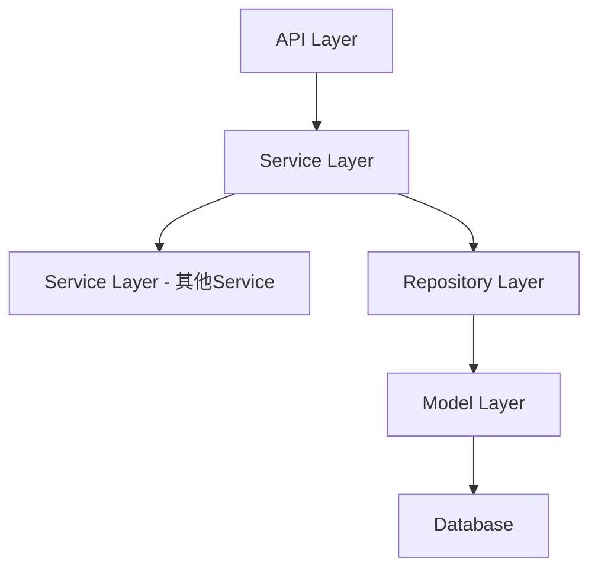

# 套餐分组类型和加价功能 设计文档

> 本文档定义 套餐分组类型和加价功能 的技术设计和实现方案。

## 📋 概述

在套餐商品的分组功能中增加分组类型（固定/可选）和商品加价两个核心能力。该功能主要涉及数据库表结构扩展、API 接口参数扩展、数据模型更新和业务逻辑验证。该功能参考现有套餐功能的实现方式，复用现有的套餐创建、编辑和查询流程。

---

## 🎯 规范对齐

### Go Main 规范 (go-main.mdc)

- Service 只依赖其他 Service 接口
- Repository 只持有 db 实例
- URL 使用 snake_case
- data 字段必须是对象
- 不使用 panic，返回 error

### API 设计规范 (api.mdc)

- URL 使用 snake_case
- 响应格式统一
- data 不能为 null 或数组

### 数据库规范 (database.mdc)

- 必需字段完整
- 时间字段使用 int
- 金额字段使用 decimal(20,8) 或 decimal(10,2)
- 迁移前检查字段是否存在

---

## 🔄 代码复用分析

### 可复用的现有组件

- **套餐创建接口**: `main/app/api/v1/shop/shop_product.go:ProductShopAdd()` - 创建套餐，可扩展分组类型和加价字段
- **套餐编辑接口**: `main/app/api/v1/shop/shop_product.go:ProductShopEdit()` - 编辑套餐，可扩展分组类型和加价字段
- **商品详情接口**: `main/app/api/v1/shop/shop_product.go:ProductShopDetail()` - 查询商品详情，可扩展返回分组类型和加价字段
- **套餐 Service**: `main/app/service/product.go` - 套餐业务逻辑，可扩展分组类型和加价验证
- **套餐 Model**: `main/app/model/product_package_group.go`, `main/app/model/product_package_group_item.go` - 数据模型，可扩展字段

### 集成点

- **套餐分组表**: 增加分组类型和可选数量字段
- **套餐分组商品表**: 增加加价字段
- **API 请求参数**: 扩展 DTO 结构体
- **API 响应数据**: 扩展响应结构体
- **业务逻辑验证**: 增加分组类型和加价验证

---

## 🏗️ 架构设计

### 分层设计原则

**Go Main 三层架构**:

```
API 层 (Controller/API)
  ↓ 依赖
业务层 (Service)
  ↓ 依赖
数据层 (Repository/Model)
```

### 架构图



### 模块划分

#### Go Main 模块

- **API 层**: `main/app/api/v1/shop/shop_product.go` - 路由处理、参数校验
- **Service 层**: `main/app/service/product.go` - 业务逻辑、事务管理
- **Repository 层**: `main/app/repository/product_package_group.go` - 数据访问、数据库操作
- **Model 层**: `main/app/model/product_package_group.go`, `main/app/model/product_package_group_item.go` - 数据模型
- **DTO 层**: `main/app/dto/req/product.go`, `main/app/dto/resp/product.go` - 数据传输对象

#### PHP Admin 模块

- **Model 层**: `admin/app/common/model/product/ProductPackageGroup.php` - 数据模型
- **迁移文件**: `admin/database/migrations/` - 数据库迁移

---

## 🗄️ 数据库设计

### 数据表设计

#### 修改表 1: ttpos_product_package_group

**新增字段**:

```sql
ALTER TABLE `ttpos_product_package_group` 
ADD COLUMN `group_type` TINYINT NOT NULL DEFAULT 0 COMMENT '分组类型 0-固定 1-可选' AFTER `product_package_uuid`,
ADD COLUMN `optional_count` INT NOT NULL DEFAULT 1 COMMENT '可选数量，表示本组商品中要求选择多少个商品' AFTER `group_type`;
```

**字段说明**:
| 字段 | 类型 | 说明 | 约束 |
|------|------|------|------|
| group_type | TINYINT | 分组类型（0-固定，1-可选） | DEFAULT 0 |
| optional_count | INT | 可选数量 | DEFAULT 1 |

**索引设计**:
- 无需新增索引（现有索引已足够）

#### 修改表 2: ttpos_product_package_group_item

**新增字段**:

```sql
ALTER TABLE `ttpos_product_package_group_item` 
ADD COLUMN `add_price` DECIMAL(10,2) NOT NULL DEFAULT 0.00 COMMENT '加价金额，表示该商品需要加价多少钱' AFTER `sort`;
```

**字段说明**:
| 字段 | 类型 | 说明 | 约束 |
|------|------|------|------|
| add_price | DECIMAL(10,2) | 加价金额 | DEFAULT 0.00 |

**索引设计**:
- 无需新增索引（现有索引已足够）

### 数据库迁移

**迁移脚本**:

```bash
# 创建迁移文件
cd admin
php think migrate:create AddGroupTypeAndAddPriceToPackageGroup

# 执行迁移
php think migrate:run
```

**迁移文件内容**:

```php
<?php
// admin/database/migrations/{YYYYMMDDHHMMSS}_add_group_type_and_add_price_to_package_group.php

use think\migration\Migrator;
use think\migration\db\Column;

class AddGroupTypeAndAddPriceToPackageGroup extends Migrator
{
    public function up()
    {
        // 检查字段是否存在，避免重复添加
        $table = $this->table('product_package_group');
        if (!$table->hasColumn('group_type')) {
            $table->addColumn('group_type', 'tinyint', [
                'default' => 0,
                'comment' => '分组类型 0-固定 1-可选',
                'after' => 'product_package_uuid'
            ]);
        }
        if (!$table->hasColumn('optional_count')) {
            $table->addColumn('optional_count', 'int', [
                'default' => 1,
                'comment' => '可选数量，表示本组商品中要求选择多少个商品',
                'after' => 'group_type'
            ]);
        }
        $table->update();

        $table = $this->table('product_package_group_item');
        if (!$table->hasColumn('add_price')) {
            $table->addColumn('add_price', 'decimal', [
                'precision' => 10,
                'scale' => 2,
                'default' => 0.00,
                'comment' => '加价金额，表示该商品需要加价多少钱',
                'after' => 'sort'
            ]);
        }
        $table->update();

        // 更新现有数据：设置默认值
        $this->execute("UPDATE `ttpos_product_package_group` SET `group_type` = 0, `optional_count` = 1 WHERE `group_type` IS NULL OR `optional_count` IS NULL");
        $this->execute("UPDATE `ttpos_product_package_group_item` SET `add_price` = 0.00 WHERE `add_price` IS NULL");
    }

    public function down()
    {
        $table = $this->table('product_package_group');
        if ($table->hasColumn('group_type')) {
            $table->removeColumn('group_type');
        }
        if ($table->hasColumn('optional_count')) {
            $table->removeColumn('optional_count');
        }
        $table->update();

        $table = $this->table('product_package_group_item');
        if ($table->hasColumn('add_price')) {
            $table->removeColumn('add_price');
        }
        $table->update();
    }
}
```

**同步 Go Model**:

在 `main/app/model/product_package_group.go` 和 `main/app/model/product_package_group_item.go` 中增加对应字段。

**参考**: `docs/agent/workflows/database-migration.md`

---

## 📊 数据模型

### Go Model 扩展

#### ProductPackageGroup

```go
// main/app/model/product_package_group.go

type ProductPackageGroup struct {
	BaseModel
	Name                  string `json:"name" gorm:"type:text;comment:名称"`
	MultiLanguageNameUuid uint64 `json:"multi_language_name_uuid" gorm:"index:idx_multi_language_name_uuid;not null;default:0;comment:多语言名称ID"`
	ProductPackageUuid    uint64 `json:"product_package_uuid" gorm:"index:idx_product_package_uuid;not null;default:0;comment:商品套餐UUID"`
	GroupType             int    `json:"group_type" gorm:"type:tinyint;not null;default:0;comment:分组类型 0-固定 1-可选"`
	OptionalCount         int    `json:"optional_count" gorm:"type:int;not null;default:1;comment:可选数量，表示本组商品中要求选择多少个商品"`

	ProductPackageGroupItems []ProductPackageGroupItem `gorm:"foreignKey:product_package_group_uuid;references:uuid"`
	MultiLanguageName        MultiLanguageName         `gorm:"foreignKey:multi_language_name_uuid;references:uuid"`
	ProductPackage           *ProductPackage           `gorm:"foreignKey:product_package_uuid;references:uuid"`
}
```

#### ProductPackageGroupItem

```go
// main/app/model/product_package_group_item.go

type ProductPackageGroupItem struct {
	BaseModel
	ProductPackageGroupUuid uint64  `json:"product_package_group_uuid" gorm:"index:idx_product_package_group_uuid;not null;default:0;comment:商品套餐组ID"`
	RelatedUuid             uint64  `json:"related_uuid" gorm:"index:idx_related_uuid;not null;default:0;comment:关联商品UUID, product_package_uuid"`
	ProductBomUuid          uint64  `json:"product_bom_uuid" gorm:"index:idx_product_bom_uuid;not null;default:0;comment:商品BOM UUID,商品规格uuid"`
	Num                     float64 `json:"num" gorm:"type:decimal(12,4);not null;default:0;comment:数量"`
	Sort                    int     `json:"sort" gorm:"index:idx_sort;not null;default:0;comment:排序"`
	AddPrice                float64 `json:"add_price" gorm:"type:decimal(10,2);not null;default:0.00;comment:加价金额，表示该商品需要加价多少钱"`

	ProductBom          *ProductBom          `gorm:"foreignKey:product_bom_uuid;references:uuid"`
	ProductPackage      *ProductPackage      `gorm:"foreignKey:related_uuid;references:uuid"`
	ProductPackageGroup *ProductPackageGroup `gorm:"foreignKey:product_package_group_uuid;references:uuid"`
}
```

### PHP Model 扩展

#### ProductPackageGroup

```php
// admin/app/common/model/product/ProductPackageGroup.php

class ProductPackageGroup extends BaseModel
{
    // ... 现有代码 ...
    
    // 新增字段映射
    protected $field = [
        'id',
        'uuid',
        'name',
        'multi_language_name_uuid',
        'product_package_uuid',
        'group_type',        // 新增
        'optional_count',    // 新增
        'create_time',
        'update_time',
        'delete_time',
    ];
}
```

---

## 🔌 API 设计

### 请求 DTO 扩展

#### ProductShopAddPackageGroupReq

```go
// main/app/dto/req/product.go

// ProductShopAddPackageGroupReq 套餐分组添加请求
type ProductShopAddPackageGroupReq struct {
	LocaleName    dto.LocaleResponse                     `json:"locale_name" binding:"required"` // 套餐分组名称
	GroupType     int                                    `json:"group_type"`                      // 分组类型 0-固定 1-可选，默认0
	OptionalCount int                                    `json:"optional_count"`                   // 可选数量（可选分组时有效），默认1
	Products      []ProductShopAddPackageGroupProductReq `json:"products" binding:"required,dive"` // 套餐分组商品列表
}
```

#### ProductShopAddPackageGroupProductReq

```go
// main/app/dto/req/product.go

// ProductShopAddPackageGroupProductReq 套餐分组商品添加请求
type ProductShopAddPackageGroupProductReq struct {
	BomUuid  uint64  `json:"bom_uuid" binding:"required"` // 商品BOM UUID
	Num      float64 `json:"num" binding:"required,min=0"`      // 商品数量
	Sort     int     `json:"sort" binding:"required"`     // 商品排序
	AddPrice float64 `json:"add_price"`                    // 加价金额，默认0
}
```

#### ProductShopEditPackageGroupReq

```go
// main/app/dto/req/product.go

// ProductShopEditPackageGroupReq 套餐分组编辑请求
type ProductShopEditPackageGroupReq struct {
	Uuid          uint64                                  `json:"uuid"`          // 套餐分组UUID
	LocaleName    dto.LocaleResponse                      `json:"locale_name"`    // 套餐分组名称
	GroupType     int                                     `json:"group_type"`    // 分组类型 0-固定 1-可选
	OptionalCount int                                     `json:"optional_count"` // 可选数量（可选分组时有效）
	Products      []ProductShopEditPackageGroupProductReq `json:"products"`      // 套餐分组商品列表
	IsDelete      bool                                    `json:"is_delete"`     // 是否删除
}
```

#### ProductShopEditPackageGroupProductReq

```go
// main/app/dto/req/product.go

// ProductShopEditPackageGroupProductReq 套餐分组商品编辑请求
type ProductShopEditPackageGroupProductReq struct {
	Uuid     uint64  `json:"uuid"`      // 套餐商品UUID
	BomUuid  uint64  `json:"bom_uuid"`  // 商品BOM UUID
	Num      float64 `json:"num"`       // 商品数量
	Sort     int     `json:"sort"`      // 商品排序
	AddPrice float64 `json:"add_price"` // 加价金额，默认0
	IsDelete bool    `json:"is_delete"` // 是否删除
}
```

### 响应 DTO 扩展

#### ProductPackageGroupResp

```go
// main/app/dto/resp/product.go

// ProductPackageGroupResp 套餐分组响应
type ProductPackageGroupResp struct {
	Uuid          uint64                        `json:"uuid"`           // 套餐分组UUID
	LocaleName    dto.LocaleResponse            `json:"locale_name"`    // 套餐分组名称
	GroupType     int                           `json:"group_type"`     // 分组类型 0-固定 1-可选
	OptionalCount int                           `json:"optional_count"`  // 可选数量
	Products      []ProductPackageGroupItemResp `json:"products"`       // 套餐分组商品列表
}

// ProductPackageGroupItemResp 套餐分组商品响应
type ProductPackageGroupItemResp struct {
	Uuid     uint64  `json:"uuid"`      // 套餐商品UUID
	BomUuid  uint64  `json:"bom_uuid"`  // 商品BOM UUID
	Num      float64 `json:"num"`       // 商品数量
	Sort     int     `json:"sort"`      // 商品排序
	AddPrice float64 `json:"add_price"` // 加价金额
}
```

### API 接口

#### 1. 创建套餐接口

**接口**: `POST /shop/product/add`

**请求参数**: `ProductShopAddReq`

**变更**: `ProductShopAddPackageGroupReq` 增加 `group_type`、`optional_count` 字段，`ProductShopAddPackageGroupProductReq` 增加 `add_price` 字段

**响应**: 创建成功返回商品UUID

#### 2. 编辑套餐接口

**接口**: `POST /shop/product/edit`

**请求参数**: `ProductShopEditReq`

**变更**: `ProductShopEditPackageGroupReq` 增加 `group_type`、`optional_count` 字段，`ProductShopEditPackageGroupProductReq` 增加 `add_price` 字段

**响应**: 编辑成功返回商品UUID

#### 3. 商品详情接口

**接口**: `GET /shop/product/detail`

**请求参数**: `uuid` (商品UUID)

**响应**: `ProductShopDetailResp`

**变更**: 返回数据中增加 `group_type`、`optional_count`、`add_price` 字段

---

## 🔐 业务逻辑验证

### 分组类型验证

**验证规则**:
1. `group_type` 必须为 0（固定）或 1（可选）
2. `optional_count` 必须 >= 1
3. `optional_count` 必须 <= 分组内商品总数
4. 固定分组时，`optional_count` 应等于分组内商品总数（自动计算）

**实现位置**: `main/app/service/product.go`

```go
// 验证分组类型和可选数量
func (s *ProductService) validatePackageGroup(group *ProductShopAddPackageGroupReq) error {
	// 验证分组类型
	if group.GroupType != 0 && group.GroupType != 1 {
		return errors.New("分组类型必须为0（固定）或1（可选）")
	}

	// 验证可选数量
	if group.OptionalCount < 1 {
		return errors.New("可选数量必须 >= 1")
	}

	// 验证可选数量不能大于商品总数
	if len(group.Products) > 0 && group.OptionalCount > len(group.Products) {
		return errors.New("可选数量不能大于分组内商品总数")
	}

	// 固定分组时，可选数量应等于商品总数
	if group.GroupType == 0 && group.OptionalCount != len(group.Products) {
		group.OptionalCount = len(group.Products)
	}

	return nil
}
```

### 加价验证

**验证规则**:
1. `add_price` 必须 >= 0
2. `add_price` 支持小数，精度为2位

**实现位置**: `main/app/service/product.go`

```go
// 验证加价金额
func (s *ProductService) validateAddPrice(addPrice float64) error {
	if addPrice < 0 {
		return errors.New("加价金额不能为负数")
	}
	// 精度验证（前端处理，后端验证范围）
	return nil
}
```

### 必选验证

**验证规则**:
1. 必选数量不能大于可选数量
2. 必选数量不能大于分组内商品总数

**实现位置**: `main/app/service/product.go`

```go
// 验证必选数量
func (s *ProductService) validateRequiredCount(requiredCount, optionalCount, totalCount int) error {
	if requiredCount > optionalCount {
		return errors.New("必选不可大于可选数量")
	}
	if requiredCount > totalCount {
		return errors.New("必选数量不能大于分组内商品总数")
	}
	return nil
}
```

---

## 🔄 数据流转

### 创建套餐流程

```
1. 前端提交套餐数据（包含分组类型和加价）
   ↓
2. API 层接收请求，参数校验
   ↓
3. Service 层业务逻辑验证（分组类型、可选数量、加价）
   ↓
4. Repository 层保存数据到数据库
   ↓
5. 返回创建结果
```

### 编辑套餐流程

```
1. 前端提交编辑数据（包含分组类型和加价）
   ↓
2. API 层接收请求，参数校验
   ↓
3. Service 层业务逻辑验证（分组类型、可选数量、加价）
   ↓
4. Repository 层更新数据库
   ↓
5. 返回编辑结果
```

### 查询套餐详情流程

```
1. 前端请求商品详情
   ↓
2. API 层接收请求
   ↓
3. Repository 层查询数据库（包含新字段）
   ↓
4. Service 层组装响应数据
   ↓
5. 返回商品详情（包含分组类型和加价）
```

---

## 🧪 测试策略

### 单元测试

- [ ] 分组类型验证逻辑测试
- [ ] 可选数量验证逻辑测试
- [ ] 加价金额验证逻辑测试
- [ ] 必选数量验证逻辑测试

### 集成测试

- [ ] 创建套餐接口测试（包含新字段）
- [ ] 编辑套餐接口测试（包含新字段）
- [ ] 商品详情查询接口测试（返回新字段）
- [ ] 数据库迁移测试

### 端到端测试

- [ ] 创建包含可选分组的套餐
- [ ] 创建包含加价商品的套餐
- [ ] 编辑套餐分组类型和加价
- [ ] 验证订单创建时的数量计算

---

## 📝 实现检查清单

### 数据库层

- [ ] 创建数据库迁移文件
- [ ] 迁移文件支持回滚
- [ ] 迁移前检查字段是否存在
- [ ] 更新现有数据默认值

### Model 层

- [ ] 更新 Go Model（ProductPackageGroup）
- [ ] 更新 Go Model（ProductPackageGroupItem）
- [ ] 更新 PHP Model（ProductPackageGroup）

### DTO 层

- [ ] 扩展 Request DTO（创建接口）
- [ ] 扩展 Request DTO（编辑接口）
- [ ] 扩展 Response DTO（详情接口）

### Service 层

- [ ] 实现分组类型验证
- [ ] 实现可选数量验证
- [ ] 实现加价金额验证
- [ ] 实现必选数量验证

### API 层

- [ ] 更新创建套餐接口
- [ ] 更新编辑套餐接口
- [ ] 更新商品详情接口

### 测试

- [ ] 单元测试
- [ ] 集成测试
- [ ] 端到端测试

---

**版本**: v1.0.0  
**创建日期**: 2025-11-24  
**维护者**: 开发组


