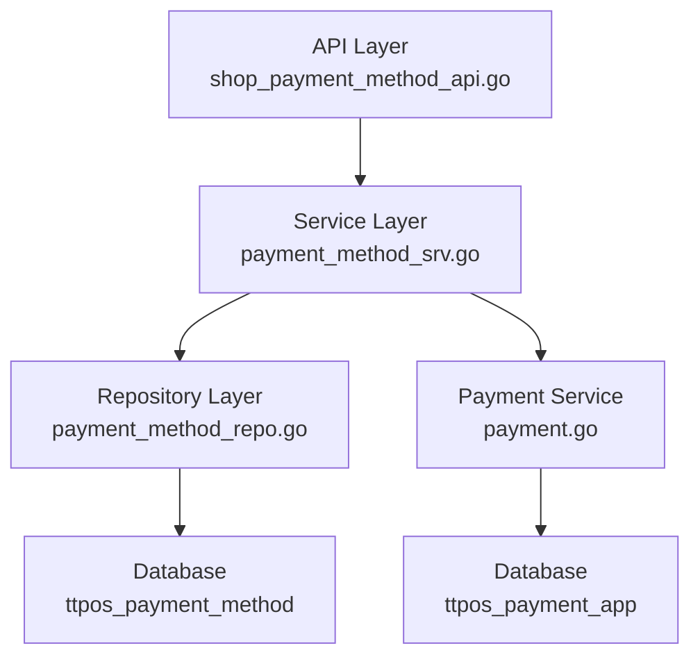

# 新管理端-支付管理 设计文档

> 本文档定义 新管理端-支付管理 的技术设计和实现方案。

## 📋 概述

在新管理端（Shop 商家管理端）提供完整的支付方式管理 API 接口，支持商户通过 API 自主管理支付方式，包括 CRUD 操作、状态变更、排序管理，以及 LianlianPay 专项配置。该功能基于现有的 `ttpos_payment_method` 表，扩展管理接口，不涉及表结构变更（LianlianPay 配置复用现有的 `ttpos_payment_app` 表，按公司级别配置）。

---

## 🎯 规范对齐

### Go Main 规范 (go-main.mdc)

- ✅ Service 只依赖其他 Service 接口
- ✅ Repository 只持有 db 实例
- ✅ URL 使用 snake_case
- ✅ data 字段必须是对象
- ✅ 不使用 panic，返回 error
- ✅ 接口以 `I` 开头，实现以 `Impl` 结尾

### API 设计规范 (api.mdc)

- ✅ URL 使用 snake_case（如：`/api/v1/shop/payment_method`）
- ✅ 响应格式统一：`{code, message, data{}}`
- ✅ data 不能为 null 或数组
- ✅ 分页信息统一放在 meta 中

### 数据库规范 (database.mdc)

- ✅ 使用现有表 `ttpos_payment_method`（不新增表）
- ✅ LianlianPay 配置复用 `ttpos_payment_app` 表（按公司级别）
- ✅ 时间字段使用 int 类型
- ✅ 软删除使用 `delete_time`

---

## 🔄 代码复用分析

### 可复用的现有组件

- **PaymentMethod Repository**: `main/app/repository/payment_method.go` - 已存在基础查询方法，需扩展 CRUD 方法
- **PaymentMethod Service**: `main/app/service/payment_method.go` - 已存在查询方法，需扩展管理方法
- **PaymentMethod Model**: `main/app/model/payment_method.go` - 数据模型已存在
- **PaymentApp Model**: `main/app/model/payment_app.go` - LianlianPay 配置模型已存在
- **Payment Service**: `main/app/service/payment.go` - LianlianPay 支付服务已存在

### 集成点

- **现有 API**: `/api/v1/shop/setting/payment_method/list` - 已有查询接口，需新增管理接口
- **数据库表**: `ttpos_payment_method` - 复用现有表结构
- **数据库表**: `ttpos_payment_app` - 复用现有 LianlianPay 配置表（按公司级别）

---

## 🏗️ 架构设计

### 分层设计原则

**Go Main 三层架构**:

```
API 层 (Controller/API)
  ↓ 依赖
业务层 (Service)
  ↓ 依赖
数据层 (Repository)
```

**依赖规则**:

- ✅ 上层可依赖下层
- ❌ 禁止下层依赖上层
- ❌ 禁止跨层调用
- ❌ Service 不能依赖 Repository
- ✅ Service 可以依赖其他 Service 接口

### 架构图



### 模块划分

#### Go Main 模块

- **API 层**: `main/app/api/v1/shop/shop_payment_method.go` - 路由处理、参数校验
- **Service 层**: `main/app/service/payment_method.go` - 业务逻辑、事务管理（扩展现有 Service）
- **Repository 层**: `main/app/repository/payment_method.go` - 数据访问、数据库操作（扩展现有 Repository）
- **Model 层**: `main/app/model/payment_method.go` - 数据模型（已存在）
- **DTO 层**: `main/app/dto/` - 数据传输对象
  - `req/payment_method_req.go` - 请求参数
  - `resp/payment_method_resp.go` - 响应数据

---

## 🗄️ 数据库设计

### 数据表设计

#### 表 1: ttpos_payment_method（已存在，不修改）

**表结构**（已存在）:

```sql
CREATE TABLE IF NOT EXISTS `ttpos_payment_method` (
    `id` INT(11) NOT NULL AUTO_INCREMENT PRIMARY KEY COMMENT '自增ID',
    `uuid` BIGINT NOT NULL DEFAULT 0 COMMENT '支付方式ID',
    `headquarter_uuid` BIGINT NOT NULL DEFAULT 0 COMMENT '总部uuid，0表示本店创建，>0表示从总部同步',
    `name` VARCHAR(255) NOT NULL DEFAULT '' COMMENT '支付方式名称',
    `code` INT(11) NOT NULL DEFAULT 0 COMMENT '支付方式代号',
    `payment_name` VARCHAR(255) NOT NULL DEFAULT '' COMMENT '支付名称',
    `source` INT(10) NOT NULL DEFAULT 1 COMMENT '来源 0-系统 1-手动 2-LianLianPay',
    `logo_file_uuid` BIGINT UNSIGNED NOT NULL DEFAULT 0 COMMENT 'logo图片ID',
    `qrcode_file_uuid` BIGINT UNSIGNED NOT NULL DEFAULT 0 COMMENT '二维码图片ID',
    `fee_percent` DECIMAL(22, 4) NOT NULL DEFAULT 0 COMMENT '手续费百分比,取值范围0-1',
    `is_show_cashier` INT(10) NOT NULL DEFAULT 0 COMMENT '0-不显示 1-收银机结账显示',
    `is_show_assistant` INT(10) NOT NULL DEFAULT 0 COMMENT '0-不显示 1-点餐助手结账显示',
    `is_show_member_recharge` INT(10) NOT NULL DEFAULT 0 COMMENT '0-不显示 1-收银机会员充值显示',
    `status` INT(10) NOT NULL DEFAULT 0 COMMENT '状态 0-禁用 1-启用',
    `sort` INT(11) NOT NULL DEFAULT 0 COMMENT '排序',
    `default_img` TEXT COMMENT '默认图片',
    `erpnext_payment` VARCHAR(255) NOT NULL DEFAULT '' COMMENT 'ERPNext支付方式',
    `create_time` INT(10) UNSIGNED NOT NULL DEFAULT 0 COMMENT '创建时间(时间戳)',
    `update_time` INT(10) UNSIGNED NOT NULL DEFAULT 0 COMMENT '更新时间(时间戳)',
    `delete_time` INT(10) UNSIGNED NOT NULL DEFAULT 0 COMMENT '删除时间(时间戳)',
    UNIQUE KEY `unique_uuid` (`uuid`),
    INDEX `idx_headquarter_uuid` (`headquarter_uuid`)
) ENGINE = InnoDB DEFAULT CHARSET = utf8mb4 COLLATE = utf8mb4_unicode_ci COMMENT = '支付方式表';
```

**字段说明**:
| 字段 | 类型 | 说明 | 约束 |
|------|------|------|------|
| id | INT(11) | 主键 ID | AUTO_INCREMENT |
| uuid | BIGINT | 唯一标识 | DEFAULT 0, UNIQUE |
| name | VARCHAR(255) | 支付方式名称 | NOT NULL |
| code | INT(11) | 支付方式代号 | NOT NULL, 需唯一性校验 |
| source | INT(10) | 来源（0-系统 1-手动 2-LianLianPay） | NOT NULL |
| status | INT(10) | 状态（0-禁用 1-启用） | NOT NULL |
| sort | INT(11) | 排序 | NOT NULL, 需连续 |
| delete_time | INT(10) | 删除时间 | DEFAULT 0, 软删除 |

**索引设计**:
- 主键索引: `PRIMARY KEY (id)`
- 唯一索引: `UNIQUE KEY unique_uuid (uuid)`
- 普通索引: `KEY idx_headquarter_uuid (headquarter_uuid)`

**注意**: 本次需求不修改表结构，仅扩展 API 接口。

#### 表 2: ttpos_payment_app（已存在，用于 LianlianPay 配置）

**表结构**（已存在）:

```sql
CREATE TABLE IF NOT EXISTS `ttpos_payment_app` (
    `id` INT(11) NOT NULL AUTO_INCREMENT PRIMARY KEY COMMENT '自增ID',
    `company_uuid` BIGINT UNSIGNED NOT NULL DEFAULT 0 COMMENT '集团ID',
    `ll_white_ip` VARCHAR(255) NOT NULL DEFAULT '' COMMENT '白名单IP',
    `ll_merchant_id` VARCHAR(255) NOT NULL DEFAULT '' COMMENT '商户号',
    `ll_store_id` VARCHAR(100) NOT NULL DEFAULT '' COMMENT '站点ID',
    `ll_public_key` TEXT NOT NULL DEFAULT '' COMMENT 'LianLianpay公钥',
    `ll_merchant_private_key` TEXT NOT NULL DEFAULT '' COMMENT '商户私钥',
    `ll_token` VARCHAR(255) NOT NULL DEFAULT '' COMMENT 'Token',
    `ll_sign_salt` VARCHAR(255) NOT NULL DEFAULT '' COMMENT '签名盐',
    `create_time` INT(10) UNSIGNED NOT NULL DEFAULT 0 COMMENT '创建时间(时间戳)',
    `update_time` INT(10) UNSIGNED NOT NULL DEFAULT 0 COMMENT '更新时间(时间戳)',
    `delete_time` INT(10) UNSIGNED NOT NULL DEFAULT 0 COMMENT '删除时间(时间戳)',
    PRIMARY KEY (`id`),
    UNIQUE KEY `uk_company_uuid` (`company_uuid`)
) ENGINE = InnoDB DEFAULT CHARSET = utf8mb4 COMMENT = '支付配置表';
```

**注意**: LianlianPay 配置按公司级别存储，一个公司一个配置。本次需求扩展查询和更新接口。

---

## 📊 数据模型

### Go Model（已存在）

```go
// main/app/model/payment_method.go
type PaymentMethod struct {
    BaseModel
    Name                 string  `gorm:"column:name;type:varchar(255);comment:支付方式名称;NOT NULL" json:"name"`
    Code                 int     `gorm:"column:code;type:int(11);default:0;comment:支付方式代号;NOT NULL" json:"code"`
    PaymentName          string  `gorm:"column:payment_name;type:varchar(255);comment:支付名称;NOT NULL" json:"payment_name"`
    Source               int     `gorm:"column:source;type:tinyint(1);default:0;comment:来源 0-系统 1-手动 2-LianLianPay;NOT NULL" json:"source"`
    LogoFileUuid         uint64  `gorm:"column:logo_file_uuid;type:bigint(20) unsigned;default:0;comment:logo图片ID;NOT NULL" json:"logo_file_uuid"`
    QrcodeFileUuid       uint64  `gorm:"column:qrcode_file_uuid;type:bigint(20) unsigned;default:0;comment:二维码图片ID;NOT NULL" json:"qrcode_file_uuid"`
    FeePercent           float64 `gorm:"column:fee_percent;type:decimal(5,4);default:0;comment:手续费百分比，取值范围0-1;NOT NULL" json:"fee_percent"`
    IsShowCashier        int     `gorm:"column:is_show_cashier;type:tinyint(1);default:0;comment:0-不显示 1-收银机结账显示;NOT NULL" json:"is_show_cashier"`
    IsShowAssistant      int     `gorm:"column:is_show_assistant;type:tinyint(1);default:0;comment:0-不显示 1-点餐助手结账显示;NOT NULL" json:"is_show_assistant"`
    IsShowMemberRecharge int     `gorm:"column:is_show_member_recharge;type:tinyint(1);default:0;comment:0-不显示 1-收银机会员充值显示;NOT NULL" json:"is_show_member_recharge"`
    Status               int     `gorm:"column:status;type:tinyint(1);default:0;comment:状态 0-禁用 1-启用;NOT NULL" json:"status"`
    Sort                 int     `gorm:"column:sort;type:int(11);default:0;comment:排序;NOT NULL" json:"sort"`
    DefaultImg           string  `gorm:"column:default_img;type:varchar(255);comment:默认图片;NOT NULL" json:"default_img"`
    ErpnextPayment       string  `gorm:"column:erpnext_payment;type:varchar(255);comment:ERPNext支付方式;NOT NULL" json:"erpnext_payment"`
}
```

### DTO 定义

#### Request DTO

```go
// main/app/dto/req/payment_method_req.go

// PaymentMethodListReq 支付方式列表请求
type PaymentMethodListReq struct {
    PageNo   int `json:"page_no" binding:"required"`
    PageSize int `json:"page_size" binding:"required"`
}

// PaymentMethodCreateReq 创建支付方式请求
type PaymentMethodCreateReq struct {
    Name                 string  `json:"name" binding:"required"`
    PaymentName          string  `json:"payment_name" binding:"required"`
    LogoFileUuid         uint64  `json:"logo_file_uuid"`
    QrcodeFileUuid       uint64  `json:"qrcode_file_uuid"`
    FeePercent           float64 `json:"fee_percent" binding:"gte=0,lte=100"`
    IsShowCashier        int     `json:"is_show_cashier"`
    IsShowAssistant      int     `json:"is_show_assistant"`
    IsShowMemberRecharge int     `json:"is_show_member_recharge"`
    Status               int     `json:"status"`
}

// PaymentMethodUpdateReq 更新支付方式请求
type PaymentMethodUpdateReq struct {
    Uuid                 uint64  `json:"uuid" binding:"required"`
    Name                 string  `json:"name"`
    PaymentName          string  `json:"payment_name"`
    LogoFileUuid         uint64  `json:"logo_file_uuid"`
    QrcodeFileUuid       uint64  `json:"qrcode_file_uuid"`
    FeePercent           float64 `json:"fee_percent" binding:"gte=0,lte=100"`
    IsShowCashier        int     `json:"is_show_cashier"`
    IsShowAssistant      int     `json:"is_show_assistant"`
    IsShowMemberRecharge int     `json:"is_show_member_recharge"`
    Status               int     `json:"status"`
}

// PaymentMethodGetReq 获取支付方式详情请求
type PaymentMethodGetReq struct {
    Uuid uint64 `json:"uuid" binding:"required"`
}

// PaymentMethodDeleteReq 删除支付方式请求
type PaymentMethodDeleteReq struct {
    Uuid uint64 `json:"uuid" binding:"required"`
}

// PaymentMethodSortUpdateReq 排序更新请求（批量）
type PaymentMethodSortUpdateReq struct {
    Items []PaymentMethodSortItem `json:"items" binding:"required"`
}

type PaymentMethodSortItem struct {
    Uuid uint64 `json:"uuid" binding:"required"`
    Sort int    `json:"sort" binding:"required"`
}

// LianlianPayConfigGetReq LianlianPay 配置查询请求
type LianlianPayConfigGetReq struct {
    // 无参数，按当前公司查询
}

// LianlianPayConfigUpdateReq LianlianPay 配置更新请求
type LianlianPayConfigUpdateReq struct {
    LlWhiteIp            string `json:"ll_white_ip" binding:"required"`
    LlMerchantId         string `json:"ll_merchant_id" binding:"required"`
    LlStoreId            string `json:"ll_store_id" binding:"required"`
    LlPublicKey          string `json:"ll_public_key" binding:"required"`
    LlMerchantPrivateKey string `json:"ll_merchant_private_key" binding:"required"`
    LlToken              string `json:"ll_token" binding:"required"`
}
```

#### Response DTO

```go
// main/app/dto/resp/payment_method_resp.go

// PaymentMethodListItemResp 支付方式列表项响应（列表用）
type PaymentMethodListItemResp struct {
    Uuid   uint64 `json:"uuid"`
    Name   string `json:"name"`
    Source int    `json:"source"`
    Sort   int    `json:"sort"`
}

// PaymentMethodDetailResp 支付方式详情响应（详情用）
type PaymentMethodDetailResp struct {
    Uuid                 uint64  `json:"uuid"`
    Name                 string  `json:"name"`
    PaymentName          string  `json:"payment_name"`
    Source               int     `json:"source"`
    LogoFileUuid         uint64  `json:"logo_file_uuid"`
    LogoFile             string  `json:"logo_file"`             // 文件 URL
    QrcodeFileUuid       uint64  `json:"qrcode_file_uuid"`
    QrcodeFile           string  `json:"qrcode_file"`          // 文件 URL
    FeePercent           float64 `json:"fee_percent"`
    IsShowCashier        int     `json:"is_show_cashier"`
    IsShowAssistant      int     `json:"is_show_assistant"`
    IsShowMemberRecharge int     `json:"is_show_member_recharge"`
    Status               int     `json:"status"`
    Sort                 int     `json:"sort"`
}

// PaymentMethodListResp 支付方式列表响应
type PaymentMethodListResp struct {
    List []*PaymentMethodListItemResp `json:"list"`
    Meta *PageMeta                    `json:"meta"`
}

type PageMeta struct {
    PageNo   int   `json:"page_no"`
    PageSize int   `json:"page_size"`
    Total    int64 `json:"total"`
}

// LianlianPayConfigResp LianlianPay 配置响应
type LianlianPayConfigResp struct {
    LlWhiteIp            string `json:"ll_white_ip"`
    LlMerchantId         string `json:"ll_merchant_id"`
    LlStoreId            string `json:"ll_store_id"`
    LlPublicKey          string `json:"ll_public_key"`
    LlMerchantPrivateKey string `json:"ll_merchant_private_key"` // 返回占位符或加密值
    LlToken              string `json:"ll_token"`                 // 返回占位符或加密值
}
```

---

## 🔌 API 设计

### RESTful API

#### API 1: 支付方式列表查询

**请求**:

- **URL**: `/api/v1/shop/payment_method/list`
- **Method**: `GET`
- **Headers**:
  ```json
  {
    "Authorization": "Bearer {token}",
    "Content-Type": "application/json"
  }
  ```
- **Query Parameters**:
  ```
  page_no=1&page_size=20
  ```

**响应**:

```json
{
  "code": 1,
  "message": "success",
  "data": {
    "list": [
      {
        "uuid": 123456,
        "name": "微信支付",
        "source": 2,
        "sort": 1
      }
    ],
    "meta": {
      "page_no": 1,
      "page_size": 20,
      "total": 10
    }
  }
}
```

#### API 2: 创建支付方式

**请求**:

- **URL**: `/api/v1/shop/payment_method/create`
- **Method**: `POST`
- **Body**:
  ```json
  {
    "name": "微信支付",
    "payment_name": "WeChat Pay",
    "logo_file_uuid": 123456,
    "fee_percent": 0.6,
    "is_show_cashier": 1,
    "is_show_assistant": 1,
    "status": 1
  }
  ```

**响应**:

```json
{
  "code": 1,
  "message": "success",
  "data": {
    "payment_method": {
      "uuid": 123456,
      "name": "微信支付",
      "status": 1
    }
  }
}
```

#### API 3: 获取支付方式详情

**请求**:

- **URL**: `/api/v1/shop/payment_method/detail`
- **Method**: `GET`
- **Query Parameters**:
  ```
  uuid=123456
  ```

**响应**:

```json
{
  "code": 1,
  "message": "success",
  "data": {
    "payment_method": {
      "uuid": 123456,
      "name": "微信支付",
      "payment_name": "WeChat Pay",
      "source": 2,
      "logo_file_uuid": 123456,
      "logo_file": "https://example.com/logo.png",
      "qrcode_file_uuid": 123457,
      "qrcode_file": "https://example.com/qrcode.png",
      "fee_percent": 0.6,
      "is_show_cashier": 1,
      "is_show_assistant": 1,
      "is_show_member_recharge": 0,
      "status": 1,
      "sort": 1
    }
  }
}
```

#### API 4: 更新支付方式

**请求**:

- **URL**: `/api/v1/shop/payment_method/update`
- **Method**: `PUT`
- **Body**:
  ```json
  {
    "uuid": 123456,
    "name": "微信支付（更新）",
    "payment_name": "WeChat Pay Updated",
    "fee_percent": 0.8,
    "status": 1
  }
  ```

**响应**:

```json
{
  "code": 1,
  "message": "success",
  "data": {
    "payment_method": {
      "uuid": 123456,
      "name": "微信支付（更新）",
      "status": 1
    }
  }
}
```

#### API 5: 删除支付方式

**请求**:

- **URL**: `/api/v1/shop/payment_method/delete`
- **Method**: `DELETE`
- **Body**:
  ```json
  {
    "uuid": 123456
  }
  ```

**响应**:

```json
{
  "code": 1,
  "message": "success",
  "data": {}
}
```

**错误响应**（有关联订单）:

```json
{
  "code": 0,
  "message": "支付方式有关联订单，无法删除",
  "data": {}
}
```

#### API 6: 批量更新支付方式排序

**请求**:

- **URL**: `/api/v1/shop/payment_method/update_sort`
- **Method**: `PUT`
- **Body**:
  ```json
  {
    "items": [
      {"uuid": 123456, "sort": 1},
      {"uuid": 123457, "sort": 2},
      {"uuid": 123458, "sort": 3}
    ]
  }
  ```

**响应**:

```json
{
  "code": 1,
  "message": "success",
  "data": {}
}
```

#### API 7: 查询 LianlianPay 配置

**请求**:

- **URL**: `/api/v1/shop/payment_method/lianlianpay_config`
- **Method**: `GET`

**响应**:

```json
{
  "code": 1,
  "message": "success",
  "data": {
    "ll_white_ip": "192.168.1.1",
    "ll_merchant_id": "123456789",
    "ll_store_id": "STORE001",
    "ll_public_key": "MIIBIjANBgkqhkiG9w0BAQEFAAOCAQ8A...",
    "ll_merchant_private_key": "***",
    "ll_token": "***"
  }
}
```

#### API 8: 更新 LianlianPay 配置

**请求**:

- **URL**: `/api/v1/shop/payment_method/lianlianpay_config`
- **Method**: `PUT`
- **Body**:
  ```json
  {
    "ll_white_ip": "192.168.1.1",
    "ll_merchant_id": "123456789",
    "ll_store_id": "STORE001",
    "ll_public_key": "MIIBIjANBgkqhkiG9w0BAQEFAAOCAQ8A...",
    "ll_merchant_private_key": "MIIEvQIBADANBgkqhkiG9w0BAQEFAASCBKcwggSjAgEAAoIBAQC...",
    "ll_token": "abc123xyz"
  }
  ```

**响应**:

```json
{
  "code": 1,
  "message": "success",
  "data": {}
}
```

---

## 🧩 组件和接口

### Service 层

#### Service 接口扩展

```go
// main/app/service/i_payment_method_srv.go（扩展现有接口）
type IPaymentMethodSrv interface {
    // 现有方法
    IsEnabled(ctx context.Context, paymentMethod model.PaymentMethod, companySetting model.CompanySetting) bool
    GetList(ctx context.Context, typ string) resp.PaymentMethodList

    // 新增管理方法
    GetManagementList(ctx context.Context, req *dto_req.PaymentMethodListReq) (*dto_resp.PaymentMethodListResp, error)
    GetDetail(ctx context.Context, req *dto_req.PaymentMethodGetReq) (*dto_resp.PaymentMethodDetailResp, error)
    Create(ctx context.Context, req *dto_req.PaymentMethodCreateReq) (*dto_resp.PaymentMethodDetailResp, error)
    Update(ctx context.Context, req *dto_req.PaymentMethodUpdateReq) (*dto_resp.PaymentMethodDetailResp, error)
    Delete(ctx context.Context, req *dto_req.PaymentMethodDeleteReq) error
    UpdateSort(ctx context.Context, req *dto_req.PaymentMethodSortUpdateReq) error
    GetLianlianPayConfig(ctx context.Context) (*dto_resp.LianlianPayConfigResp, error)
    UpdateLianlianPayConfig(ctx context.Context, req *dto_req.LianlianPayConfigUpdateReq) error
}
```

#### Service 实现要点

1. **GetManagementList**: 
   - 仅支持分页查询（page_no、page_size）
   - 无需搜索和筛选功能
   - 按排序字段（sort）排序
   - 返回列表项（uuid、name、source、sort）

2. **GetDetail**: 
   - 根据 UUID 查询支付方式详情
   - 关联查询文件 URL（logo_file、qrcode_file）
   - 返回完整详情信息

3. **Create**: 
   - 自动生成 code（根据 source 和现有 code 生成）
   - 自动设置 source（手动添加为 1）
   - 生成 UUID
   - 设置默认排序（最大 sort + 1）
   - fee_percent 范围 0-100（存储时转换为 0-1）

4. **Update**:
   - 校验系统来源（source=0）的字段修改权限
   - 支持更新 status（状态在编辑时更改）
   - fee_percent 范围 0-100（存储时转换为 0-1）

5. **Delete**:
   - 校验系统来源（source=0）禁止删除
   - 检查关联订单（查询 `ttpos_payment_order` 表）
   - 软删除（设置 `delete_time`）
   - 重新排序（删除后排序值需连续）

6. **UpdateSort**:
   - 批量更新排序
   - 确保排序值连续（1, 2, 3...）
   - 使用事务保证一致性

7. **UpdateLianlianPayConfig**:
   - 敏感字段（私钥、Token）加密存储
   - 按公司 UUID 查询/更新 `ttpos_payment_app` 表

### Repository 层

#### Repository 接口扩展

```go
// main/app/repository/i_payment_method_repo.go（扩展现有接口）
type IPaymentMethodRepo interface {
    // 现有方法
    IPaymentMethodQueryRepo
    WhereUuid(uuid uint64) DBOption
    WhereStatus(status int) DBOption
    // ...

    // 新增管理方法
    CreatePaymentMethod(paymentMethod model.PaymentMethod) error
    UpdatePaymentMethod(paymentMethod model.PaymentMethod, options ...DBOption) error
    DeletePaymentMethod(uuid uint64) error
    CheckCodeExists(code int, excludeUuid uint64) (bool, error)
    CheckHasOrders(uuid uint64) (bool, error)
    GetMaxSort() (int, error)
    BatchUpdateSort(items []model.PaymentMethod) error
}
```

### API 层

```go
// main/app/api/v1/shop/shop_payment_method.go
type PaymentMethodHandler struct {
    paymentMethodSrv service.IPaymentMethodSrv
}

func NewPaymentMethodHandler(paymentMethodSrv service.IPaymentMethodSrv) *PaymentMethodHandler {
    return &PaymentMethodHandler{paymentMethodSrv: paymentMethodSrv}
}

// GET /api/v1/shop/payment_method/list
func (h *PaymentMethodHandler) GetList(c *gin.Context) {
    var req dto_req.PaymentMethodListReq
    if err := c.ShouldBindQuery(&req); err != nil {
        helper.ErrorWithDetail(c, constant.CodeInvalidParam, err)
        return
    }

    resp, err := h.paymentMethodSrv.GetManagementList(helper.GetContext(c), &req)
    if err != nil {
        helper.ErrorWithDetail(c, constant.CodeFail, err)
        return
    }

    helper.Success(c, gin.H{"data": resp})
}

// POST /api/v1/shop/payment_method/create
func (h *PaymentMethodHandler) Create(c *gin.Context) {
    var req dto_req.PaymentMethodCreateReq
    if err := c.ShouldBindJSON(&req); err != nil {
        helper.ErrorWithDetail(c, constant.CodeInvalidParam, err)
        return
    }

    resp, err := h.paymentMethodSrv.Create(helper.GetContext(c), &req)
    if err != nil {
        helper.ErrorWithDetail(c, constant.CodeFail, err)
        return
    }

    helper.Success(c, gin.H{"data": gin.H{"payment_method": resp}})
}

// GET /api/v1/shop/payment_method/detail
func (h *PaymentMethodHandler) GetDetail(c *gin.Context) {
    var req dto_req.PaymentMethodGetReq
    if err := c.ShouldBindQuery(&req); err != nil {
        helper.ErrorWithDetail(c, constant.CodeInvalidParam, err)
        return
    }

    resp, err := h.paymentMethodSrv.GetDetail(helper.GetContext(c), &req)
    if err != nil {
        helper.ErrorWithDetail(c, constant.CodeFail, err)
        return
    }

    helper.Success(c, gin.H{"data": gin.H{"payment_method": resp}})
}

// PUT /api/v1/shop/payment_method/update
func (h *PaymentMethodHandler) Update(c *gin.Context) {
    var req dto_req.PaymentMethodUpdateReq
    if err := c.ShouldBindJSON(&req); err != nil {
        helper.ErrorWithDetail(c, constant.CodeInvalidParam, err)
        return
    }

    resp, err := h.paymentMethodSrv.Update(helper.GetContext(c), &req)
    if err != nil {
        helper.ErrorWithDetail(c, constant.CodeFail, err)
        return
    }

    helper.Success(c, gin.H{"data": gin.H{"payment_method": resp}})
}

// 其他 API 方法...
```

---

## ⚡ 缓存设计

### Redis 缓存

**缓存策略**:

- **Key 命名**: `ttpos:shop:payment_method:list:{company_uuid}:{status}`
- **过期时间**: 5 分钟
- **更新策略**: Cache-Aside Pattern

**缓存场景**:

- 支付方式列表（按状态缓存）
- LianlianPay 配置（按公司 UUID 缓存）

---

## 🚨 错误处理

### 错误场景

#### 场景 1: 系统来源支付方式禁止修改/删除

- **处理方式**: 返回错误码 `CodePaymentMethodSystemSource`
- **用户影响**: 提示"系统来源的支付方式不允许修改/删除"

#### 场景 2: 删除时有关联订单

- **处理方式**: 返回错误码 `CodePaymentMethodHasOrders`
- **用户影响**: 提示"支付方式有关联订单，无法删除"

#### 场景 3: 排序值不连续

- **处理方式**: 自动重新排序，确保连续
- **用户影响**: 排序自动调整

---

## 🔒 安全设计

### 身份验证

- **JWT Token**: 所有 API 需要 Token 验证
- **权限控制**: 仅商户管理员可访问

### 数据安全

- **敏感数据加密**: LianlianPay 私钥、Token 加密存储
- **SQL 注入防护**: 使用参数化查询
- **参数验证**: 使用 binding 标签验证

### 敏感字段处理

- **存储**: 私钥、Token 使用 AES 加密存储
- **响应**: 返回占位符 `***` 或加密后的值（不返回明文）

---

## 🧪 测试策略

### 单元测试

**目标覆盖率**:

- Service: 70%+
- Repository: 80%+
- **Payment 相关: 100%**（高风险）

**测试内容**:

- CRUD 操作
- 业务逻辑（排序、删除检查）
- 权限控制（系统来源限制）
- 敏感字段加密

### API 测试

**测试内容**:

- 所有 API 接口
- 参数验证
- 错误处理
- 响应格式

---

## 📈 性能优化

### 优化策略

1. **数据库优化**:
   - 使用索引（uuid, code, status）
   - 分页查询优化

2. **缓存优化**:
   - Redis 缓存支付方式列表
   - 缓存 LianlianPay 配置

3. **并发控制**:
   - UUID 锁防止并发冲突
   - 事务管理保证排序一致性

### 性能指标

- 本地响应时间: < 200ms
- 数据库查询: < 50ms
- 缓存命中率: > 80%

---

## 📚 实现清单

### Phase 1: DTO 和 Repository 扩展

- [ ] 创建 Request DTO
- [ ] 创建 Response DTO
- [ ] 扩展 Repository 接口
- [ ] 实现 Repository 方法

### Phase 2: Service 层实现

- [ ] 扩展 Service 接口
- [ ] 实现 Service 业务逻辑
- [ ] 实现排序逻辑
- [ ] 实现 LianlianPay 配置管理

### Phase 3: API 层实现

- [ ] 创建 API Handler
- [ ] 实现所有 API 接口
- [ ] 注册路由

### Phase 4: 测试和优化

- [ ] 单元测试
- [ ] API 测试
- [ ] 性能优化
- [ ] 缓存实现

**详细任务**: 参见 `tasks.md`

---

## Graphiti & 活动日志

- Related Episode: `[待补充]`
- 模板：`docs/agent/templates/graphiti-episode.md`
- 活动日志：`docs/team/activities/{YYYY-MM}/{YYYY-MM-DD}.md`
- 在技术方案评审、关键架构决策或踩坑总结后，立即补充 Episode 并在设计文档尾部互链。

---

**版本**: v1.0.0  
**创建日期**: 2025-12-11  
**作者**: 王昱  
**审核者**: {审核者}
